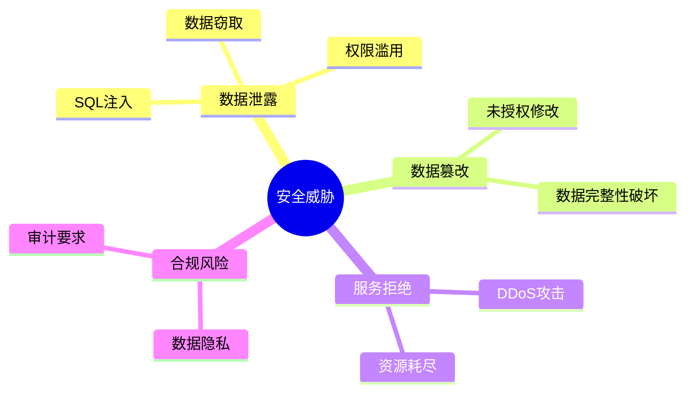
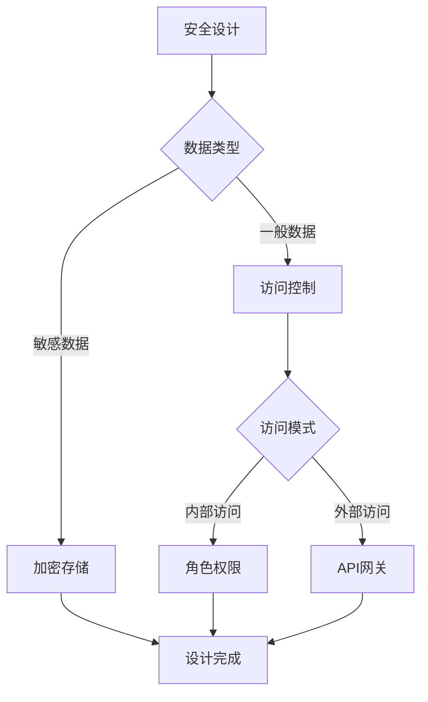

# 数据库安全设计模式：数据保护与访问控制

> **创建日期**：2025-01-15
> **最后更新**：2025-01-15
> **版本**：v1.0
> **状态**：实施中

---

## 📋 目录

- [数据库安全设计模式：数据保护与访问控制](#数据库安全设计模式数据保护与访问控制)
  - [📋 目录](#-目录)
  - [1. 概述](#1-概述)
    - [1.1. 数据库安全威胁](#11-数据库安全威胁)
    - [1.2. 安全设计决策树](#12-安全设计决策树)
  - [2. 访问控制设计](#2-访问控制设计)
    - [2.1. 角色权限模型](#21-角色权限模型)
    - [2.2. 权限检查函数](#22-权限检查函数)
    - [2.3. PostgreSQL行级安全（RLS）扩展](#23-postgresql行级安全rls扩展)
  - [3. 数据加密设计](#3-数据加密设计)
    - [3.1. 字段级加密](#31-字段级加密)
    - [3.2. 透明数据加密（TDE）](#32-透明数据加密tde)
    - [3.3. 传输加密](#33-传输加密)
  - [4. 数据脱敏设计](#4-数据脱敏设计)
    - [4.1. 数据脱敏函数](#41-数据脱敏函数)
    - [4.2. 视图脱敏](#42-视图脱敏)
  - [5. 审计日志设计](#5-审计日志设计)
    - [5.1. 审计日志Schema设计](#51-审计日志schema设计)
    - [5.2. 审计触发器](#52-审计触发器)
    - [5.3. 查询审计](#53-查询审计)
  - [6. 安全配置最佳实践](#6-安全配置最佳实践)
    - [6.1. PostgreSQL安全配置](#61-postgresql安全配置)
    - [6.2. 密码策略](#62-密码策略)
  - [7. 实际应用案例](#7-实际应用案例)
    - [7.1. 金融系统安全设计](#71-金融系统安全设计)
  - [8. 参考资料](#8-参考资料)

---

## 1. 概述

数据库安全设计是保护数据机密性、完整性和可用性的关键，包括访问控制、加密、审计等多个方面。

### 1.1. 数据库安全威胁



### 1.2. 安全设计决策树



---

## 2. 访问控制设计

### 2.1. 角色权限模型

**RBAC（基于角色的访问控制）Schema设计**：

```sql
CREATE SCHEMA security;

-- 用户表
CREATE TABLE security.users (
    user_id BIGSERIAL PRIMARY KEY,
    username VARCHAR(100) NOT NULL UNIQUE,
    email VARCHAR(200) NOT NULL UNIQUE,
    password_hash TEXT NOT NULL,
    is_active BOOLEAN DEFAULT TRUE,
    created_at TIMESTAMPTZ NOT NULL DEFAULT CURRENT_TIMESTAMP,
    last_login_at TIMESTAMPTZ
);

-- 角色表
CREATE TABLE security.roles (
    role_id SERIAL PRIMARY KEY,
    role_name VARCHAR(100) NOT NULL UNIQUE,
    description TEXT,
    created_at TIMESTAMPTZ NOT NULL DEFAULT CURRENT_TIMESTAMP
);

-- 权限表
CREATE TABLE security.permissions (
    permission_id SERIAL PRIMARY KEY,
    permission_name VARCHAR(100) NOT NULL UNIQUE,
    resource_type VARCHAR(100) NOT NULL,  -- table, schema, database
    resource_name VARCHAR(200) NOT NULL,
    action VARCHAR(50) NOT NULL,  -- SELECT, INSERT, UPDATE, DELETE
    description TEXT,
    created_at TIMESTAMPTZ NOT NULL DEFAULT CURRENT_TIMESTAMP,
    UNIQUE(resource_type, resource_name, action)
);

-- 用户角色关联表
CREATE TABLE security.user_roles (
    user_id BIGINT NOT NULL REFERENCES security.users(user_id) ON DELETE CASCADE,
    role_id INTEGER NOT NULL REFERENCES security.roles(role_id) ON DELETE CASCADE,
    granted_at TIMESTAMPTZ NOT NULL DEFAULT CURRENT_TIMESTAMP,
    granted_by BIGINT REFERENCES security.users(user_id),
    PRIMARY KEY (user_id, role_id)
);

-- 角色权限关联表
CREATE TABLE security.role_permissions (
    role_id INTEGER NOT NULL REFERENCES security.roles(role_id) ON DELETE CASCADE,
    permission_id INTEGER NOT NULL REFERENCES security.permissions(permission_id) ON DELETE CASCADE,
    granted_at TIMESTAMPTZ NOT NULL DEFAULT CURRENT_TIMESTAMP,
    PRIMARY KEY (role_id, permission_id)
);

-- 创建索引
CREATE INDEX idx_user_roles_user ON security.user_roles(user_id);
CREATE INDEX idx_user_roles_role ON security.user_roles(role_id);
CREATE INDEX idx_role_permissions_role ON security.role_permissions(role_id);
CREATE INDEX idx_role_permissions_permission ON security.role_permissions(permission_id);
```

### 2.2. 权限检查函数

**权限检查函数实现**：

```sql
-- 检查用户权限函数
CREATE OR REPLACE FUNCTION check_user_permission(
    p_user_id BIGINT,
    p_resource_type VARCHAR,
    p_resource_name VARCHAR,
    p_action VARCHAR
)
RETURNS BOOLEAN AS $$
DECLARE
    v_has_permission BOOLEAN;
BEGIN
    SELECT EXISTS (
        SELECT 1
        FROM security.user_roles ur
        JOIN security.role_permissions rp ON ur.role_id = rp.role_id
        JOIN security.permissions p ON rp.permission_id = p.permission_id
        WHERE ur.user_id = p_user_id
          AND p.resource_type = p_resource_type
          AND p.resource_name = p_resource_name
          AND p.action = p_action
    ) INTO v_has_permission;

    RETURN v_has_permission;
END;
$$ LANGUAGE plpgsql SECURITY DEFINER;

-- 获取用户所有权限函数
CREATE OR REPLACE FUNCTION get_user_permissions(p_user_id BIGINT)
RETURNS TABLE (
    resource_type VARCHAR,
    resource_name VARCHAR,
    action VARCHAR
) AS $$
BEGIN
    RETURN QUERY
    SELECT DISTINCT
        p.resource_type,
        p.resource_name,
        p.action
    FROM security.user_roles ur
    JOIN security.role_permissions rp ON ur.role_id = rp.role_id
    JOIN security.permissions p ON rp.permission_id = p.permission_id
    WHERE ur.user_id = p_user_id;
END;
$$ LANGUAGE plpgsql SECURITY DEFINER;
```

### 2.3. PostgreSQL行级安全（RLS）扩展

**RLS安全策略设计**：

```sql
-- 启用RLS
ALTER TABLE business.orders ENABLE ROW LEVEL SECURITY;

-- 创建安全策略：用户只能查看自己的订单
CREATE POLICY orders_user_isolation ON business.orders
    FOR SELECT
    USING (user_id = current_user_id());

-- 创建安全策略：管理员可以查看所有订单
CREATE POLICY orders_admin_access ON business.orders
    FOR ALL
    USING (
        EXISTS (
            SELECT 1 FROM security.user_roles ur
            JOIN security.roles r ON ur.role_id = r.role_id
            WHERE ur.user_id = current_user_id()
              AND r.role_name = 'admin'
        )
    );

-- 创建安全策略：销售只能查看自己负责的订单
CREATE POLICY orders_sales_access ON business.orders
    FOR SELECT
    USING (
        EXISTS (
            SELECT 1 FROM business.order_assignments oa
            WHERE oa.order_id = business.orders.order_id
              AND oa.sales_user_id = current_user_id()
        )
    );
```

---

## 3. 数据加密设计

### 3.1. 字段级加密

**字段加密Schema设计**：

```sql
-- 启用pgcrypto扩展
CREATE EXTENSION IF NOT EXISTS pgcrypto;

-- 敏感数据表（加密字段）
CREATE TABLE security.sensitive_data (
    data_id BIGSERIAL PRIMARY KEY,
    user_id BIGINT NOT NULL,
    -- 加密字段
    encrypted_email BYTEA NOT NULL,
    encrypted_phone BYTEA NOT NULL,
    encrypted_ssn BYTEA NOT NULL,
    -- 加密密钥ID（用于密钥轮换）
    encryption_key_id VARCHAR(50) NOT NULL,
    created_at TIMESTAMPTZ NOT NULL DEFAULT CURRENT_TIMESTAMP
);

-- 加密函数
CREATE OR REPLACE FUNCTION encrypt_field(
    p_value TEXT,
    p_key TEXT
)
RETURNS BYTEA AS $$
BEGIN
    RETURN pgp_sym_encrypt(p_value, p_key);
END;
$$ LANGUAGE plpgsql;

-- 解密函数
CREATE OR REPLACE FUNCTION decrypt_field(
    p_encrypted BYTEA,
    p_key TEXT
)
RETURNS TEXT AS $$
BEGIN
    RETURN pgp_sym_decrypt(p_encrypted, p_key);
END;
$$ LANGUAGE plpgsql;

-- 插入加密数据
INSERT INTO security.sensitive_data (
    user_id,
    encrypted_email,
    encrypted_phone,
    encrypted_ssn,
    encryption_key_id
)
VALUES (
    123,
    encrypt_field('alice@example.com', 'encryption_key_2024'),
    encrypt_field('123-456-7890', 'encryption_key_2024'),
    encrypt_field('123-45-6789', 'encryption_key_2024'),
    'encryption_key_2024'
);

-- 查询解密数据（需要密钥）
SELECT
    data_id,
    user_id,
    decrypt_field(encrypted_email, 'encryption_key_2024') AS email,
    decrypt_field(encrypted_phone, 'encryption_key_2024') AS phone,
    decrypt_field(encrypted_ssn, 'encryption_key_2024') AS ssn
FROM security.sensitive_data
WHERE user_id = 123;
```

### 3.2. 透明数据加密（TDE）

**TDE配置示例**：

```sql
-- PostgreSQL透明数据加密（需要扩展支持）
-- 注意：PostgreSQL原生不支持TDE，需要使用扩展如pg_tde

-- 创建加密表空间（如果支持）
CREATE TABLESPACE encrypted_tablespace
LOCATION '/var/lib/postgresql/encrypted_data';

-- 在加密表空间中创建表
CREATE TABLE security.encrypted_table (
    id BIGSERIAL PRIMARY KEY,
    sensitive_data TEXT
) TABLESPACE encrypted_tablespace;
```

### 3.3. 传输加密

**SSL/TLS配置**：

```conf
# postgresql.conf
ssl = on
ssl_cert_file = '/etc/ssl/certs/server.crt'
ssl_key_file = '/etc/ssl/private/server.key'
ssl_ca_file = '/etc/ssl/certs/ca.crt'

# pg_hba.conf
hostssl    all    all    0.0.0.0/0    md5
```

---

## 4. 数据脱敏设计

### 4.1. 数据脱敏函数

**数据脱敏函数实现**：

```sql
-- 邮箱脱敏函数
CREATE OR REPLACE FUNCTION mask_email(p_email TEXT)
RETURNS TEXT AS $$
DECLARE
    v_local_part TEXT;
    v_domain TEXT;
    v_masked_local TEXT;
BEGIN
    -- 分离本地部分和域名
    v_local_part := split_part(p_email, '@', 1);
    v_domain := split_part(p_email, '@', 2);

    -- 脱敏本地部分（保留前2个字符）
    IF length(v_local_part) > 2 THEN
        v_masked_local := left(v_local_part, 2) || repeat('*', length(v_local_part) - 2);
    ELSE
        v_masked_local := repeat('*', length(v_local_part));
    END IF;

    RETURN v_masked_local || '@' || v_domain;
END;
$$ LANGUAGE plpgsql IMMUTABLE;

-- 手机号脱敏函数
CREATE OR REPLACE FUNCTION mask_phone(p_phone TEXT)
RETURNS TEXT AS $$
BEGIN
    -- 保留前3位和后4位，中间用*替代
    IF length(p_phone) >= 7 THEN
        RETURN left(p_phone, 3) || repeat('*', length(p_phone) - 7) || right(p_phone, 4);
    ELSE
        RETURN repeat('*', length(p_phone));
    END IF;
END;
$$ LANGUAGE plpgsql IMMUTABLE;

-- 身份证号脱敏函数
CREATE OR REPLACE FUNCTION mask_id_card(p_id_card TEXT)
RETURNS TEXT AS $$
BEGIN
    -- 保留前6位和后4位，中间用*替代
    IF length(p_id_card) >= 10 THEN
        RETURN left(p_id_card, 6) || repeat('*', length(p_id_card) - 10) || right(p_id_card, 4);
    ELSE
        RETURN repeat('*', length(p_id_card));
    END IF;
END;
$$ LANGUAGE plpgsql IMMUTABLE;

-- 银行卡号脱敏函数
CREATE OR REPLACE FUNCTION mask_card_number(p_card_number TEXT)
RETURNS TEXT AS $$
BEGIN
    -- 保留前4位和后4位，中间用*替代
    IF length(p_card_number) >= 8 THEN
        RETURN left(p_card_number, 4) || repeat('*', length(p_card_number) - 8) || right(p_card_number, 4);
    ELSE
        RETURN repeat('*', length(p_card_number));
    END IF;
END;
$$ LANGUAGE plpgsql IMMUTABLE;

-- 使用示例
SELECT
    user_id,
    mask_email(email) AS masked_email,
    mask_phone(phone) AS masked_phone,
    mask_id_card(id_card) AS masked_id_card
FROM security.users;
```

### 4.2. 视图脱敏

**脱敏视图设计**：

```sql
-- 创建脱敏视图
CREATE VIEW security.users_masked AS
SELECT
    user_id,
    username,
    mask_email(email) AS email,
    mask_phone(phone) AS phone,
    created_at
FROM security.users;

-- 授予视图权限给普通用户
GRANT SELECT ON security.users_masked TO app_user;
```

---

## 5. 审计日志设计

### 5.1. 审计日志Schema设计

**审计日志表设计**：

```sql
CREATE SCHEMA audit;

-- 审计日志表
CREATE TABLE audit.audit_logs (
    log_id BIGSERIAL PRIMARY KEY,
    table_name VARCHAR(200) NOT NULL,
    operation VARCHAR(20) NOT NULL CHECK (operation IN ('INSERT', 'UPDATE', 'DELETE', 'SELECT')),
    user_id BIGINT,
    username VARCHAR(100),
    old_data JSONB,
    new_data JSONB,
    changed_fields TEXT[],
    ip_address INET,
    user_agent TEXT,
    session_id VARCHAR(100),
    executed_at TIMESTAMPTZ NOT NULL DEFAULT CURRENT_TIMESTAMP
) PARTITION BY RANGE (executed_at);

-- 创建分区（按月）
CREATE TABLE audit.audit_logs_2024_01 PARTITION OF audit.audit_logs
FOR VALUES FROM ('2024-01-01') TO ('2024-02-01');

CREATE TABLE audit.audit_logs_2024_02 PARTITION OF audit.audit_logs
FOR VALUES FROM ('2024-02-01') TO ('2024-03-01');

-- 创建索引
CREATE INDEX idx_audit_logs_table ON audit.audit_logs(table_name, executed_at DESC);
CREATE INDEX idx_audit_logs_user ON audit.audit_logs(user_id, executed_at DESC);
CREATE INDEX idx_audit_logs_operation ON audit.audit_logs(operation, executed_at DESC);
CREATE INDEX idx_audit_logs_executed ON audit.audit_logs(executed_at DESC);
```

### 5.2. 审计触发器

**通用审计触发器**：

```sql
-- 通用审计触发器函数
CREATE OR REPLACE FUNCTION audit_trigger_function()
RETURNS TRIGGER AS $$
DECLARE
    v_old_data JSONB;
    v_new_data JSONB;
    v_changed_fields TEXT[];
BEGIN
    -- 获取变更字段
    IF TG_OP = 'UPDATE' THEN
        v_old_data := row_to_json(OLD)::JSONB;
        v_new_data := row_to_json(NEW)::JSONB;

        -- 计算变更字段
        SELECT array_agg(key)
        INTO v_changed_fields
        FROM jsonb_each(v_old_data) old_kv
        JOIN jsonb_each(v_new_data) new_kv ON old_kv.key = new_kv.key
        WHERE old_kv.value IS DISTINCT FROM new_kv.value;
    ELSIF TG_OP = 'DELETE' THEN
        v_old_data := row_to_json(OLD)::JSONB;
        v_new_data := NULL;
    ELSE
        v_old_data := NULL;
        v_new_data := row_to_json(NEW)::JSONB;
    END IF;

    -- 插入审计日志
    INSERT INTO audit.audit_logs (
        table_name,
        operation,
        user_id,
        username,
        old_data,
        new_data,
        changed_fields,
        ip_address,
        user_agent,
        session_id
    )
    VALUES (
        TG_TABLE_NAME,
        TG_OP,
        current_setting('app.user_id', TRUE)::BIGINT,
        current_setting('app.username', TRUE),
        v_old_data,
        v_new_data,
        v_changed_fields,
        inet_client_addr(),
        current_setting('app.user_agent', TRUE),
        current_setting('app.session_id', TRUE)
    );

    RETURN COALESCE(NEW, OLD);
END;
$$ LANGUAGE plpgsql;

-- 为表创建审计触发器
CREATE TRIGGER audit_users_trigger
AFTER INSERT OR UPDATE OR DELETE ON security.users
FOR EACH ROW
EXECUTE FUNCTION audit_trigger_function();
```

### 5.3. 查询审计

**查询审计函数**：

```sql
-- 查询审计函数
CREATE OR REPLACE FUNCTION audit_query(
    p_table_name VARCHAR,
    p_query_text TEXT,
    p_result_count INTEGER
)
RETURNS VOID AS $$
BEGIN
    INSERT INTO audit.audit_logs (
        table_name,
        operation,
        user_id,
        username,
        new_data,
        ip_address,
        user_agent,
        session_id
    )
    VALUES (
        p_table_name,
        'SELECT',
        current_setting('app.user_id', TRUE)::BIGINT,
        current_setting('app.username', TRUE),
        jsonb_build_object('query', p_query_text, 'result_count', p_result_count),
        inet_client_addr(),
        current_setting('app.user_agent', TRUE),
        current_setting('app.session_id', TRUE)
    );
END;
$$ LANGUAGE plpgsql;
```

---

## 6. 安全配置最佳实践

### 6.1. PostgreSQL安全配置

**安全配置检查清单**：

```sql
-- 1. 检查SSL配置
SHOW ssl;

-- 2. 检查密码加密
SHOW password_encryption;

-- 3. 检查连接限制
SHOW max_connections;

-- 4. 检查日志配置
SHOW log_statement;
SHOW log_connections;
SHOW log_disconnections;

-- 5. 检查密码策略（需要扩展）
-- 安装passwordcheck扩展
CREATE EXTENSION IF NOT EXISTS passwordcheck;
```

### 6.2. 密码策略

**密码策略函数**：

```sql
-- 密码复杂度检查函数
CREATE OR REPLACE FUNCTION check_password_strength(p_password TEXT)
RETURNS BOOLEAN AS $$
BEGIN
    -- 检查密码长度（至少8位）
    IF length(p_password) < 8 THEN
        RAISE EXCEPTION 'Password must be at least 8 characters long';
    END IF;

    -- 检查是否包含数字
    IF NOT (p_password ~ '[0-9]') THEN
        RAISE EXCEPTION 'Password must contain at least one digit';
    END IF;

    -- 检查是否包含大写字母
    IF NOT (p_password ~ '[A-Z]') THEN
        RAISE EXCEPTION 'Password must contain at least one uppercase letter';
    END IF;

    -- 检查是否包含小写字母
    IF NOT (p_password ~ '[a-z]') THEN
        RAISE EXCEPTION 'Password must contain at least one lowercase letter';
    END IF;

    -- 检查是否包含特殊字符
    IF NOT (p_password ~ '[!@#$%^&*(),.?":{}|<>]') THEN
        RAISE EXCEPTION 'Password must contain at least one special character';
    END IF;

    RETURN TRUE;
END;
$$ LANGUAGE plpgsql;

-- 密码更新触发器
CREATE OR REPLACE FUNCTION validate_password_trigger()
RETURNS TRIGGER AS $$
BEGIN
    IF NEW.password_hash IS DISTINCT FROM OLD.password_hash THEN
        -- 这里应该检查新密码的复杂度
        -- 简化示例：假设password_hash已经加密
        PERFORM check_password_strength('dummy');  -- 实际应该解密检查
    END IF;
    RETURN NEW;
END;
$$ LANGUAGE plpgsql;
```

---

## 7. 实际应用案例

### 7.1. 金融系统安全设计

**金融系统安全Schema设计**：

```sql
CREATE SCHEMA finance_security;

-- 账户表（加密敏感字段）
CREATE TABLE finance_security.accounts (
    account_id BIGSERIAL PRIMARY KEY,
    user_id BIGINT NOT NULL,
    account_number_encrypted BYTEA NOT NULL,  -- 加密账户号
    balance DECIMAL(15,2) NOT NULL,
    account_type VARCHAR(50) NOT NULL,
    encryption_key_id VARCHAR(50) NOT NULL,
    created_at TIMESTAMPTZ NOT NULL DEFAULT CURRENT_TIMESTAMP,
    updated_at TIMESTAMPTZ NOT NULL DEFAULT CURRENT_TIMESTAMP
);

-- 交易表（完整审计）
CREATE TABLE finance_security.transactions (
    transaction_id BIGSERIAL PRIMARY KEY,
    from_account_id BIGINT NOT NULL REFERENCES finance_security.accounts(account_id),
    to_account_id BIGINT NOT NULL REFERENCES finance_security.accounts(account_id),
    amount DECIMAL(15,2) NOT NULL,
    transaction_type VARCHAR(50) NOT NULL,
    status VARCHAR(20) NOT NULL DEFAULT 'pending',
    created_by BIGINT NOT NULL,
    created_at TIMESTAMPTZ NOT NULL DEFAULT CURRENT_TIMESTAMP,
    approved_by BIGINT,
    approved_at TIMESTAMPTZ
);

-- 启用审计
CREATE TRIGGER audit_accounts_trigger
AFTER INSERT OR UPDATE OR DELETE ON finance_security.accounts
FOR EACH ROW
EXECUTE FUNCTION audit_trigger_function();

CREATE TRIGGER audit_transactions_trigger
AFTER INSERT OR UPDATE OR DELETE ON finance_security.transactions
FOR EACH ROW
EXECUTE FUNCTION audit_trigger_function();

-- 创建RLS策略：用户只能查看自己的账户
ALTER TABLE finance_security.accounts ENABLE ROW LEVEL SECURITY;

CREATE POLICY accounts_user_isolation ON finance_security.accounts
    FOR SELECT
    USING (user_id = current_user_id());
```

---

## 8. 参考资料

- [多租户数据库设计模式](./07.20-多租户数据库设计模式.md)
- [数据库设计最佳实践库](./07.14-数据库设计最佳实践库.md)
- [PostgreSQL安全文档](https://www.postgresql.org/docs/current/security.html)

---

**最后更新**：2025-01-15
**维护者**：Data-Science Team
**状态**：实施中
