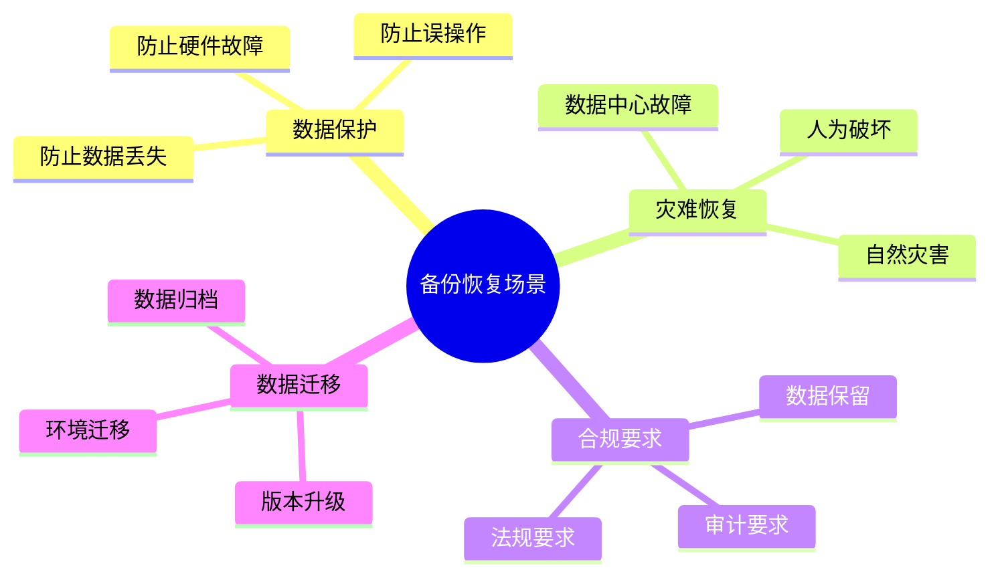
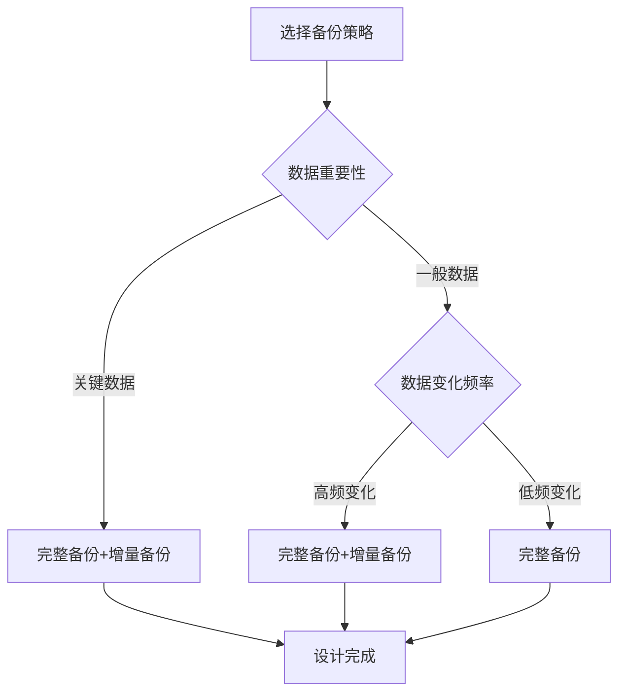
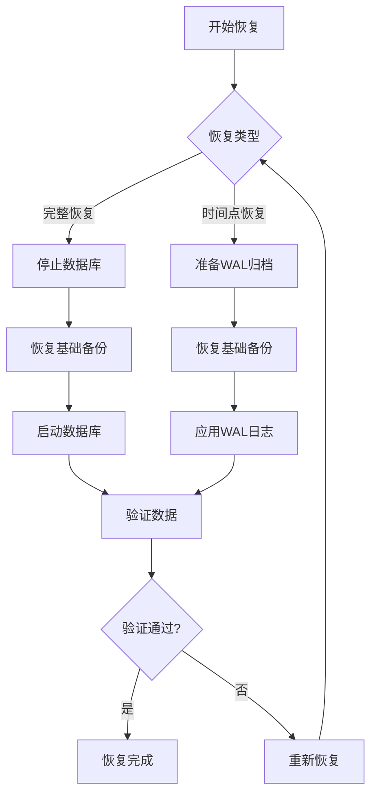

# 数据库备份与恢复设计模式：数据保护与灾难恢复

> **创建日期**：2025-01-15
> **最后更新**：2025-01-15
> **版本**：v1.0
> **状态**：实施中

---

## 📋 目录

- [数据库备份与恢复设计模式：数据保护与灾难恢复](#数据库备份与恢复设计模式数据保护与灾难恢复)
  - [📋 目录](#-目录)
  - [1. 概述](#1-概述)
    - [1.1. 备份恢复应用场景](#11-备份恢复应用场景)
    - [1.2. 备份策略选择决策树](#12-备份策略选择决策树)
  - [2. 备份策略设计](#2-备份策略设计)
    - [2.1. 备份类型对比](#21-备份类型对比)
    - [2.2. 备份策略设计原则](#22-备份策略设计原则)
  - [3. PostgreSQL备份实现](#3-postgresql备份实现)
    - [3.1. pg\_dump完整备份](#31-pg_dump完整备份)
    - [3.2. pg\_basebackup物理备份](#32-pg_basebackup物理备份)
    - [3.3. WAL归档配置](#33-wal归档配置)
  - [4. 备份存储与管理](#4-备份存储与管理)
    - [4.1. 备份元数据管理](#41-备份元数据管理)
    - [4.2. 备份记录函数](#42-备份记录函数)
  - [5. 恢复策略设计](#5-恢复策略设计)
    - [5.1. 完整恢复流程](#51-完整恢复流程)
    - [5.2. pg\_restore恢复](#52-pg_restore恢复)
    - [5.3. 时间点恢复（PITR）](#53-时间点恢复pitr)
  - [6. 灾难恢复设计](#6-灾难恢复设计)
    - [6.1. 灾难恢复计划](#61-灾难恢复计划)
    - [6.2. 异地备份设计](#62-异地备份设计)
  - [7. 备份验证与测试](#7-备份验证与测试)
    - [7.1. 备份验证函数](#71-备份验证函数)
    - [7.2. 恢复测试函数](#72-恢复测试函数)
  - [8. 实际应用案例](#8-实际应用案例)
    - [8.1. 企业级备份系统设计](#81-企业级备份系统设计)
  - [9. 参考资料](#9-参考资料)

---

## 1. 概述

数据库备份与恢复是保障数据安全的关键，需要设计合理的备份策略和恢复流程。

### 1.1. 备份恢复应用场景



### 1.2. 备份策略选择决策树



---

## 2. 备份策略设计

### 2.1. 备份类型对比

**备份类型对比矩阵**：

| 备份类型 | 特点 | 恢复速度 | 存储空间 | 适用场景 |
|---------|------|---------|---------|---------|
| **完整备份** | 备份所有数据 | 快 | 大 | 定期全量备份 |
| **增量备份** | 备份变更数据 | 慢 | 小 | 频繁备份 |
| **差异备份** | 备份上次完整备份后的变更 | 中 | 中 | 平衡方案 |
| **连续归档** | 实时归档WAL | 快 | 中 | 高可用系统 |

### 2.2. 备份策略设计原则

**备份策略原则**：

```text
1. 3-2-1原则：
   - 3份数据副本
   - 2种不同存储介质
   - 1份异地备份

2. RTO（恢复时间目标）：
   - 关键系统：< 1小时
   - 一般系统：< 24小时

3. RPO（恢复点目标）：
   - 关键系统：< 15分钟
   - 一般系统：< 24小时

4. 备份保留策略：
   - 每日备份：保留30天
   - 每周备份：保留12周
   - 每月备份：保留12个月
   - 每年备份：保留7年
```

---

## 3. PostgreSQL备份实现

### 3.1. pg_dump完整备份

**pg_dump备份脚本**：

```bash
#!/bin/bash
# PostgreSQL完整备份脚本

# 配置
DB_NAME="my_database"
DB_USER="postgres"
BACKUP_DIR="/backup/postgresql"
DATE=$(date +%Y%m%d_%H%M%S)
BACKUP_FILE="${BACKUP_DIR}/${DB_NAME}_${DATE}.sql"

# 创建备份目录
mkdir -p ${BACKUP_DIR}

# 执行备份
pg_dump -U ${DB_USER} -d ${DB_NAME} -F c -f ${BACKUP_FILE}.dump

# 压缩备份
gzip ${BACKUP_FILE}.dump

# 删除30天前的备份
find ${BACKUP_DIR} -name "${DB_NAME}_*.dump.gz" -mtime +30 -delete

echo "Backup completed: ${BACKUP_FILE}.dump.gz"
```

**pg_dump并行备份**：

```bash
#!/bin/bash
# PostgreSQL并行备份（大数据量）

DB_NAME="my_database"
DB_USER="postgres"
BACKUP_DIR="/backup/postgresql"
DATE=$(date +%Y%m%d_%H%M%S)
BACKUP_FILE="${BACKUP_DIR}/${DB_NAME}_${DATE}"

# 并行备份（使用-j参数）
pg_dump -U ${DB_USER} -d ${DB_NAME} -F d -j 4 -f ${BACKUP_FILE}

# 压缩备份目录
tar -czf ${BACKUP_FILE}.tar.gz ${BACKUP_FILE}
rm -rf ${BACKUP_FILE}

echo "Parallel backup completed: ${BACKUP_FILE}.tar.gz"
```

### 3.2. pg_basebackup物理备份

**pg_basebackup备份脚本**：

```bash
#!/bin/bash
# PostgreSQL物理备份脚本

DB_USER="postgres"
BACKUP_DIR="/backup/postgresql/base"
DATE=$(date +%Y%m%d_%H%M%S)
BACKUP_PATH="${BACKUP_DIR}/base_${DATE}"

# 创建备份目录
mkdir -p ${BACKUP_PATH}

# 执行物理备份
pg_basebackup -U ${DB_USER} -D ${BACKUP_PATH} -Ft -z -P

# 删除30天前的备份
find ${BACKUP_DIR} -name "base_*" -type d -mtime +30 -exec rm -rf {} \;

echo "Physical backup completed: ${BACKUP_PATH}"
```

### 3.3. WAL归档配置

**WAL归档配置**：

```sql
-- postgresql.conf配置
wal_level = replica
archive_mode = on
archive_command = 'cp %p /backup/wal_archive/%f'
archive_timeout = 300  -- 5分钟强制归档

-- 检查归档状态
SELECT * FROM pg_stat_archiver;
```

**WAL归档脚本**：

```bash
#!/bin/bash
# WAL归档脚本

WAL_FILE=$1
ARCHIVE_DIR="/backup/wal_archive"

# 复制WAL文件到归档目录
cp ${WAL_FILE} ${ARCHIVE_DIR}/$(basename ${WAL_FILE})

# 压缩旧WAL文件（7天前）
find ${ARCHIVE_DIR} -name "*.wal" -mtime +7 -exec gzip {} \;

# 删除30天前的压缩WAL文件
find ${ARCHIVE_DIR} -name "*.wal.gz" -mtime +30 -delete
```

---

## 4. 备份存储与管理

### 4.1. 备份元数据管理

**备份元数据Schema设计**：

```sql
CREATE SCHEMA backup_management;

-- 备份记录表
CREATE TABLE backup_management.backup_records (
    backup_id BIGSERIAL PRIMARY KEY,
    database_name VARCHAR(100) NOT NULL,
    backup_type VARCHAR(20) NOT NULL CHECK (backup_type IN ('full', 'incremental', 'differential', 'wal')),
    backup_method VARCHAR(50) NOT NULL,  -- pg_dump, pg_basebackup, continuous_archiving
    backup_file_path TEXT NOT NULL,
    backup_size BIGINT NOT NULL,
    start_time TIMESTAMPTZ NOT NULL,
    end_time TIMESTAMPTZ,
    duration INTERVAL,
    status VARCHAR(20) NOT NULL CHECK (status IN ('running', 'completed', 'failed')),
    error_message TEXT,
    checksum VARCHAR(64),  -- 备份文件校验和
    created_at TIMESTAMPTZ NOT NULL DEFAULT CURRENT_TIMESTAMP
);

-- 创建索引
CREATE INDEX idx_backup_records_database ON backup_management.backup_records(database_name, start_time DESC);
CREATE INDEX idx_backup_records_status ON backup_management.backup_records(status, start_time DESC);
CREATE INDEX idx_backup_records_type ON backup_management.backup_records(backup_type, start_time DESC);

-- 备份验证记录表
CREATE TABLE backup_management.backup_verifications (
    verification_id BIGSERIAL PRIMARY KEY,
    backup_id BIGINT NOT NULL REFERENCES backup_management.backup_records(backup_id) ON DELETE CASCADE,
    verification_type VARCHAR(50) NOT NULL,  -- checksum, restore_test, integrity_check
    verification_status VARCHAR(20) NOT NULL CHECK (verification_status IN ('passed', 'failed')),
    verification_result JSONB,
    verified_at TIMESTAMPTZ NOT NULL DEFAULT CURRENT_TIMESTAMP,
    verified_by VARCHAR(100)
);

CREATE INDEX idx_backup_verifications_backup ON backup_management.backup_verifications(backup_id);
CREATE INDEX idx_backup_verifications_status ON backup_management.backup_verifications(verification_status, verified_at DESC);
```

### 4.2. 备份记录函数

**备份记录函数**：

```sql
-- 记录备份开始
CREATE OR REPLACE FUNCTION record_backup_start(
    p_database_name VARCHAR,
    p_backup_type VARCHAR,
    p_backup_method VARCHAR,
    p_backup_file_path TEXT
)
RETURNS BIGINT AS $$
DECLARE
    v_backup_id BIGINT;
BEGIN
    INSERT INTO backup_management.backup_records (
        database_name,
        backup_type,
        backup_method,
        backup_file_path,
        backup_size,
        start_time,
        status
    )
    VALUES (
        p_database_name,
        p_backup_type,
        p_backup_method,
        p_backup_file_path,
        0,
        CURRENT_TIMESTAMP,
        'running'
    )
    RETURNING backup_id INTO v_backup_id;

    RETURN v_backup_id;
END;
$$ LANGUAGE plpgsql;

-- 记录备份完成
CREATE OR REPLACE FUNCTION record_backup_complete(
    p_backup_id BIGINT,
    p_backup_size BIGINT,
    p_checksum VARCHAR DEFAULT NULL
)
RETURNS VOID AS $$
DECLARE
    v_start_time TIMESTAMPTZ;
BEGIN
    SELECT start_time INTO v_start_time
    FROM backup_management.backup_records
    WHERE backup_id = p_backup_id;

    UPDATE backup_management.backup_records
    SET end_time = CURRENT_TIMESTAMP,
        duration = CURRENT_TIMESTAMP - v_start_time,
        backup_size = p_backup_size,
        checksum = p_checksum,
        status = 'completed'
    WHERE backup_id = p_backup_id;
END;
$$ LANGUAGE plpgsql;

-- 记录备份失败
CREATE OR REPLACE FUNCTION record_backup_failure(
    p_backup_id BIGINT,
    p_error_message TEXT
)
RETURNS VOID AS $$
DECLARE
    v_start_time TIMESTAMPTZ;
BEGIN
    SELECT start_time INTO v_start_time
    FROM backup_management.backup_records
    WHERE backup_id = p_backup_id;

    UPDATE backup_management.backup_records
    SET end_time = CURRENT_TIMESTAMP,
        duration = CURRENT_TIMESTAMP - v_start_time,
        status = 'failed',
        error_message = p_error_message
    WHERE backup_id = p_backup_id;
END;
$$ LANGUAGE plpgsql;
```

---

## 5. 恢复策略设计

### 5.1. 完整恢复流程

**完整恢复流程设计**：



### 5.2. pg_restore恢复

**pg_restore恢复脚本**：

```bash
#!/bin/bash
# PostgreSQL恢复脚本

BACKUP_FILE=$1
DB_NAME="my_database"
DB_USER="postgres"

# 检查备份文件是否存在
if [ ! -f "${BACKUP_FILE}" ]; then
    echo "Backup file not found: ${BACKUP_FILE}"
    exit 1
fi

# 解压备份文件（如果是压缩的）
if [[ ${BACKUP_FILE} == *.gz ]]; then
    gunzip -c ${BACKUP_FILE} > ${BACKUP_FILE%.gz}
    BACKUP_FILE=${BACKUP_FILE%.gz}
fi

# 删除现有数据库（谨慎操作）
dropdb -U ${DB_USER} ${DB_NAME}

# 创建新数据库
createdb -U ${DB_USER} ${DB_NAME}

# 恢复备份
if [[ ${BACKUP_FILE} == *.dump ]]; then
    # 自定义格式备份
    pg_restore -U ${DB_USER} -d ${DB_NAME} -j 4 ${BACKUP_FILE}
elif [[ ${BACKUP_FILE} == *.sql ]]; then
    # SQL格式备份
    psql -U ${DB_USER} -d ${DB_NAME} < ${BACKUP_FILE}
else
    # 目录格式备份
    pg_restore -U ${DB_USER} -d ${DB_NAME} -j 4 ${BACKUP_FILE}
fi

echo "Restore completed"
```

### 5.3. 时间点恢复（PITR）

**PITR恢复脚本**：

```bash
#!/bin/bash
# PostgreSQL时间点恢复脚本

BASE_BACKUP_DIR=$1
TARGET_TIME=$2  # 格式：'2024-01-15 10:30:00'
DB_NAME="my_database"
DB_USER="postgres"
RECOVERY_DIR="/var/lib/postgresql/data"

# 1. 停止数据库
systemctl stop postgresql

# 2. 清空数据目录（保留配置文件）
rm -rf ${RECOVERY_DIR}/*

# 3. 恢复基础备份
tar -xzf ${BASE_BACKUP_DIR}/base.tar.gz -C ${RECOVERY_DIR}

# 4. 配置恢复参数
cat >> ${RECOVERY_DIR}/postgresql.conf << EOF
restore_command = 'cp /backup/wal_archive/%f %p'
recovery_target_time = '${TARGET_TIME}'
EOF

# 5. 创建恢复标记文件
touch ${RECOVERY_DIR}/recovery.signal

# 6. 启动数据库（自动进入恢复模式）
systemctl start postgresql

# 7. 等待恢复完成
echo "Waiting for recovery to complete..."
sleep 30

# 8. 检查恢复状态
psql -U ${DB_USER} -d ${DB_NAME} -c "SELECT pg_is_in_recovery();"

echo "PITR recovery completed"
```

---

## 6. 灾难恢复设计

### 6.1. 灾难恢复计划

**灾难恢复计划Schema设计**：

```sql
CREATE SCHEMA disaster_recovery;

-- 灾难恢复计划表
CREATE TABLE disaster_recovery.recovery_plans (
    plan_id SERIAL PRIMARY KEY,
    plan_name VARCHAR(200) NOT NULL UNIQUE,
    database_name VARCHAR(100) NOT NULL,
    rto_minutes INTEGER NOT NULL,  -- 恢复时间目标（分钟）
    rpo_minutes INTEGER NOT NULL,  -- 恢复点目标（分钟）
    backup_strategy TEXT NOT NULL,
    recovery_procedure TEXT NOT NULL,
    contact_person VARCHAR(200),
    contact_phone VARCHAR(50),
    is_active BOOLEAN DEFAULT TRUE,
    created_at TIMESTAMPTZ NOT NULL DEFAULT CURRENT_TIMESTAMP,
    updated_at TIMESTAMPTZ NOT NULL DEFAULT CURRENT_TIMESTAMP
);

-- 灾难恢复演练记录表
CREATE TABLE disaster_recovery.recovery_drills (
    drill_id BIGSERIAL PRIMARY KEY,
    plan_id INTEGER NOT NULL REFERENCES disaster_recovery.recovery_plans(plan_id),
    drill_date TIMESTAMPTZ NOT NULL,
    drill_type VARCHAR(50) NOT NULL,  -- full, partial, table_level
    recovery_time_minutes INTEGER,
    data_loss_minutes INTEGER,
    status VARCHAR(20) NOT NULL CHECK (status IN ('success', 'failed', 'partial')),
    issues TEXT,
    lessons_learned TEXT,
    conducted_by VARCHAR(200),
    created_at TIMESTAMPTZ NOT NULL DEFAULT CURRENT_TIMESTAMP
);

CREATE INDEX idx_recovery_drills_plan ON disaster_recovery.recovery_drills(plan_id, drill_date DESC);
```

### 6.2. 异地备份设计

**异地备份Schema设计**：

```sql
-- 异地备份配置表
CREATE TABLE backup_management.remote_backup_configs (
    config_id SERIAL PRIMARY KEY,
    database_name VARCHAR(100) NOT NULL,
    remote_type VARCHAR(50) NOT NULL,  -- s3, azure_blob, gcs, ftp, rsync
    remote_endpoint TEXT NOT NULL,
    remote_path TEXT NOT NULL,
    credentials JSONB NOT NULL,  -- 加密存储凭据
    encryption_key_id VARCHAR(50),
    is_active BOOLEAN DEFAULT TRUE,
    sync_schedule VARCHAR(100),  -- cron表达式
    last_sync_at TIMESTAMPTZ,
    sync_status VARCHAR(20),
    created_at TIMESTAMPTZ NOT NULL DEFAULT CURRENT_TIMESTAMP,
    updated_at TIMESTAMPTZ NOT NULL DEFAULT CURRENT_TIMESTAMP
);

-- 异地备份记录表
CREATE TABLE backup_management.remote_backup_records (
    record_id BIGSERIAL PRIMARY KEY,
    backup_id BIGINT NOT NULL REFERENCES backup_management.backup_records(backup_id),
    config_id INTEGER NOT NULL REFERENCES backup_management.remote_backup_configs(config_id),
    remote_file_path TEXT NOT NULL,
    sync_start_time TIMESTAMPTZ NOT NULL,
    sync_end_time TIMESTAMPTZ,
    sync_status VARCHAR(20) NOT NULL CHECK (sync_status IN ('pending', 'syncing', 'completed', 'failed')),
    error_message TEXT,
    created_at TIMESTAMPTZ NOT NULL DEFAULT CURRENT_TIMESTAMP
);

CREATE INDEX idx_remote_backup_records_backup ON backup_management.remote_backup_records(backup_id);
CREATE INDEX idx_remote_backup_records_config ON backup_management.remote_backup_records(config_id, sync_start_time DESC);
```

---

## 7. 备份验证与测试

### 7.1. 备份验证函数

**备份验证函数**：

```sql
-- 备份完整性验证函数
CREATE OR REPLACE FUNCTION verify_backup_integrity(
    p_backup_id BIGINT
)
RETURNS BOOLEAN AS $$
DECLARE
    v_backup_record RECORD;
    v_file_checksum VARCHAR(64);
    v_stored_checksum VARCHAR(64);
BEGIN
    -- 获取备份记录
    SELECT * INTO v_backup_record
    FROM backup_management.backup_records
    WHERE backup_id = p_backup_id;

    IF NOT FOUND THEN
        RAISE EXCEPTION 'Backup record not found: %', p_backup_id;
    END IF;

    -- 计算文件校验和（使用sha256）
    -- 注意：这需要在应用层实现，因为PostgreSQL无法直接读取文件系统

    -- 比较校验和
    IF v_file_checksum != v_stored_checksum THEN
        INSERT INTO backup_management.backup_verifications (
            backup_id,
            verification_type,
            verification_status,
            verification_result
        )
        VALUES (
            p_backup_id,
            'checksum',
            'failed',
            jsonb_build_object('error', 'Checksum mismatch')
        );
        RETURN FALSE;
    END IF;

    -- 记录验证成功
    INSERT INTO backup_management.backup_verifications (
        backup_id,
        verification_type,
        verification_status,
        verification_result
    )
    VALUES (
        p_backup_id,
        'checksum',
        'passed',
        jsonb_build_object('checksum', v_file_checksum)
    );

    RETURN TRUE;
END;
$$ LANGUAGE plpgsql;
```

### 7.2. 恢复测试函数

**恢复测试函数**：

```sql
-- 恢复测试函数（在测试环境）
CREATE OR REPLACE FUNCTION test_backup_restore(
    p_backup_id BIGINT,
    p_test_database_name VARCHAR
)
RETURNS TABLE (
    test_status VARCHAR,
    restore_time INTERVAL,
    data_verification BOOLEAN
) AS $$
DECLARE
    v_backup_record RECORD;
    v_start_time TIMESTAMPTZ;
    v_end_time TIMESTAMPTZ;
    v_restore_success BOOLEAN := FALSE;
    v_data_verified BOOLEAN := FALSE;
BEGIN
    -- 获取备份记录
    SELECT * INTO v_backup_record
    FROM backup_management.backup_records
    WHERE backup_id = p_backup_id;

    IF NOT FOUND THEN
        RAISE EXCEPTION 'Backup record not found: %', p_backup_id;
    END IF;

    v_start_time := CURRENT_TIMESTAMP;

    -- 执行恢复（这里应该调用恢复脚本）
    -- 简化示例：假设恢复成功
    v_restore_success := TRUE;

    v_end_time := CURRENT_TIMESTAMP;

    -- 验证数据（检查关键表的数据量）
    -- 简化示例：假设验证通过
    v_data_verified := TRUE;

    -- 记录测试结果
    INSERT INTO backup_management.backup_verifications (
        backup_id,
        verification_type,
        verification_status,
        verification_result
    )
    VALUES (
        p_backup_id,
        'restore_test',
        CASE WHEN v_restore_success AND v_data_verified THEN 'passed' ELSE 'failed' END,
        jsonb_build_object(
            'restore_time', v_end_time - v_start_time,
            'data_verified', v_data_verified
        )
    );

    RETURN QUERY
    SELECT
        CASE WHEN v_restore_success AND v_data_verified THEN 'passed' ELSE 'failed' END,
        v_end_time - v_start_time,
        v_data_verified;
END;
$$ LANGUAGE plpgsql;
```

---

## 8. 实际应用案例

### 8.1. 企业级备份系统设计

**完整备份系统Schema设计**：

```sql
CREATE SCHEMA enterprise_backup;

-- 备份任务表
CREATE TABLE enterprise_backup.backup_jobs (
    job_id BIGSERIAL PRIMARY KEY,
    job_name VARCHAR(200) NOT NULL UNIQUE,
    database_name VARCHAR(100) NOT NULL,
    backup_type VARCHAR(20) NOT NULL,
    schedule_cron VARCHAR(100) NOT NULL,  -- cron表达式
    retention_days INTEGER NOT NULL DEFAULT 30,
    is_active BOOLEAN DEFAULT TRUE,
    last_run_at TIMESTAMPTZ,
    next_run_at TIMESTAMPTZ,
    created_at TIMESTAMPTZ NOT NULL DEFAULT CURRENT_TIMESTAMP,
    updated_at TIMESTAMPTZ NOT NULL DEFAULT CURRENT_TIMESTAMP
);

-- 备份任务执行记录表
CREATE TABLE enterprise_backup.backup_job_executions (
    execution_id BIGSERIAL PRIMARY KEY,
    job_id BIGINT NOT NULL REFERENCES enterprise_backup.backup_jobs(job_id),
    backup_id BIGINT REFERENCES backup_management.backup_records(backup_id),
    execution_start_time TIMESTAMPTZ NOT NULL,
    execution_end_time TIMESTAMPTZ,
    execution_status VARCHAR(20) NOT NULL CHECK (execution_status IN ('running', 'completed', 'failed', 'skipped')),
    error_message TEXT,
    created_at TIMESTAMPTZ NOT NULL DEFAULT CURRENT_TIMESTAMP
);

CREATE INDEX idx_backup_job_executions_job ON enterprise_backup.backup_job_executions(job_id, execution_start_time DESC);
CREATE INDEX idx_backup_job_executions_status ON enterprise_backup.backup_job_executions(execution_status, execution_start_time DESC);

-- 备份任务调度函数
CREATE OR REPLACE FUNCTION schedule_backup_jobs()
RETURNS VOID AS $$
DECLARE
    v_job RECORD;
    v_next_run TIMESTAMPTZ;
BEGIN
    FOR v_job IN
        SELECT * FROM enterprise_backup.backup_jobs
        WHERE is_active = TRUE
    LOOP
        -- 计算下次运行时间（简化示例）
        -- 实际应该使用cron解析库
        v_next_run := CURRENT_TIMESTAMP + INTERVAL '1 day';

        UPDATE enterprise_backup.backup_jobs
        SET next_run_at = v_next_run
        WHERE job_id = v_job.job_id;
    END LOOP;
END;
$$ LANGUAGE plpgsql;
```

---

## 9. 参考资料

- [数据库安全设计模式](./07.23-数据库安全设计模式.md)
- [数据库性能调优实战](./07.08-数据库性能调优实战.md)
- [PostgreSQL备份文档](https://www.postgresql.org/docs/current/backup.html)

---

**最后更新**：2025-01-15
**维护者**：Data-Science Team
**状态**：实施中
