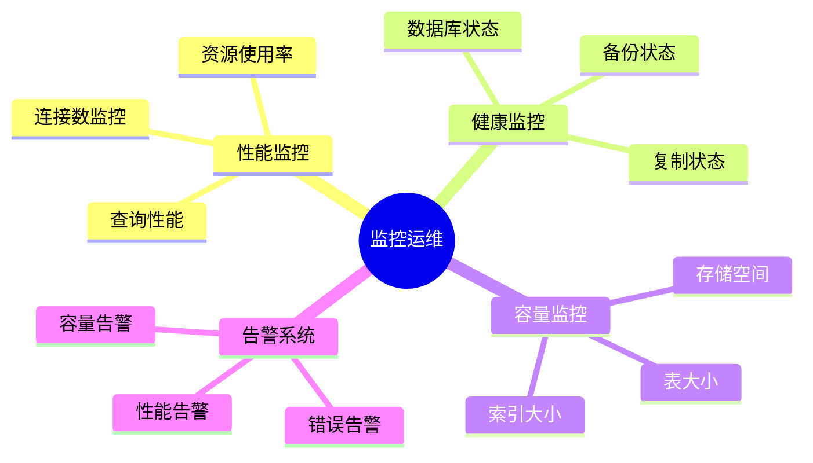
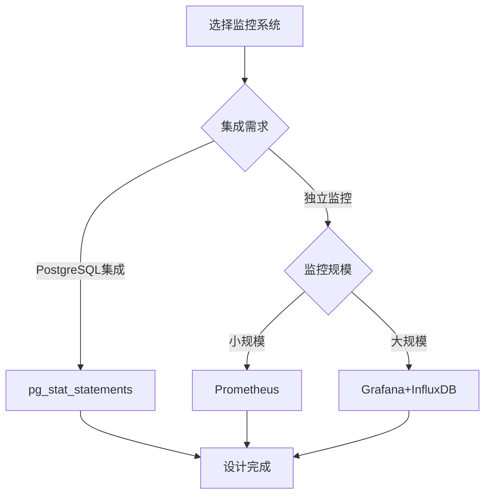

# 数据库监控与运维设计模式：可观测性与自动化运维

> **创建日期**：2025-01-15
> **最后更新**：2025-01-15
> **版本**：v1.0
> **状态**：实施中

---

## 📋 目录

- [数据库监控与运维设计模式：可观测性与自动化运维](#数据库监控与运维设计模式可观测性与自动化运维)
  - [📋 目录](#-目录)
  - [1. 概述](#1-概述)
    - [1.1. 监控运维应用场景](#11-监控运维应用场景)
    - [1.2. 监控系统选择决策树](#12-监控系统选择决策树)
  - [2. 监控指标设计](#2-监控指标设计)
    - [2.1. 核心监控指标](#21-核心监控指标)
    - [2.2. PostgreSQL监控指标采集](#22-postgresql监控指标采集)
  - [3. 监控数据存储设计](#3-监控数据存储设计)
    - [3.1. 监控数据Schema设计](#31-监控数据schema设计)
    - [3.2. 指标采集函数](#32-指标采集函数)
  - [4. 告警系统设计](#4-告警系统设计)
    - [4.1. 告警规则Schema设计](#41-告警规则schema设计)
    - [4.2. 告警检测函数](#42-告警检测函数)
  - [5. 性能分析设计](#5-性能分析设计)
    - [5.1. 性能分析Schema设计](#51-性能分析schema设计)
    - [5.2. 性能分析函数](#52-性能分析函数)
  - [6. 自动化运维设计](#6-自动化运维设计)
    - [6.1. 自动化任务Schema设计](#61-自动化任务schema设计)
    - [6.2. 自动化任务函数](#62-自动化任务函数)
  - [7. 实际应用案例](#7-实际应用案例)
    - [7.1. 完整监控系统设计](#71-完整监控系统设计)
  - [8. 参考资料](#8-参考资料)

---

## 1. 概述

数据库监控与运维设计是保障数据库稳定运行的关键，需要设计全面的监控指标、告警系统和自动化运维流程。

### 1.1. 监控运维应用场景



### 1.2. 监控系统选择决策树



---

## 2. 监控指标设计

### 2.1. 核心监控指标

**监控指标分类矩阵**：

| 指标类别 | 关键指标 | 告警阈值 | 说明 |
|---------|---------|---------|------|
| **性能指标** | 查询响应时间 | >1秒 | 平均查询时间 |
| **性能指标** | 慢查询数量 | >100/小时 | 超过1秒的查询 |
| **性能指标** | 连接数使用率 | >80% | 当前连接数/最大连接数 |
| **资源指标** | CPU使用率 | >80% | 数据库进程CPU使用率 |
| **资源指标** | 内存使用率 | >85% | 数据库内存使用率 |
| **资源指标** | 磁盘使用率 | >85% | 数据目录磁盘使用率 |
| **可用性指标** | 数据库状态 | down | 数据库是否运行 |
| **可用性指标** | 复制延迟 | >10秒 | 主从复制延迟 |
| **容量指标** | 表大小增长 | >10GB/天 | 单表日增长量 |
| **容量指标** | 数据库大小 | >1TB | 数据库总大小 |

### 2.2. PostgreSQL监控指标采集

**pg_stat_statements配置**：

```sql
-- 启用pg_stat_statements扩展
CREATE EXTENSION IF NOT EXISTS pg_stat_statements;

-- 配置pg_stat_statements
ALTER SYSTEM SET pg_stat_statements.track = 'all';
ALTER SYSTEM SET pg_stat_statements.max = 10000;
SELECT pg_reload_conf();

-- 查询慢查询
SELECT
    query,
    calls,
    total_exec_time,
    mean_exec_time,
    max_exec_time,
    stddev_exec_time,
    rows,
    100.0 * shared_blks_hit / nullif(shared_blks_hit + shared_blks_read, 0) AS hit_percent
FROM pg_stat_statements
WHERE mean_exec_time > 1000  -- 超过1秒的查询
ORDER BY mean_exec_time DESC
LIMIT 20;
```

---

## 3. 监控数据存储设计

### 3.1. 监控数据Schema设计

**监控数据表设计**：

```sql
CREATE SCHEMA monitoring;

-- 数据库指标表（时序数据）
CREATE TABLE monitoring.database_metrics (
    metric_id BIGSERIAL PRIMARY KEY,
    database_name VARCHAR(100) NOT NULL,
    metric_name VARCHAR(100) NOT NULL,
    metric_value DOUBLE PRECISION NOT NULL,
    metric_unit VARCHAR(20),
    collected_at TIMESTAMPTZ NOT NULL DEFAULT CURRENT_TIMESTAMP
) PARTITION BY RANGE (collected_at);

-- 创建分区（按小时分区）
CREATE TABLE monitoring.database_metrics_2024_01_15_00 PARTITION OF monitoring.database_metrics
FOR VALUES FROM ('2024-01-15 00:00:00') TO ('2024-01-15 01:00:00');

-- 创建索引
CREATE INDEX idx_database_metrics_db_time ON monitoring.database_metrics(database_name, collected_at DESC);
CREATE INDEX idx_database_metrics_name_time ON monitoring.database_metrics(metric_name, collected_at DESC);

-- 查询指标表
CREATE TABLE monitoring.query_metrics (
    query_id BIGSERIAL PRIMARY KEY,
    database_name VARCHAR(100) NOT NULL,
    query_hash BIGINT NOT NULL,
    query_text TEXT NOT NULL,
    calls BIGINT NOT NULL,
    total_exec_time DOUBLE PRECISION NOT NULL,
    mean_exec_time DOUBLE PRECISION NOT NULL,
    max_exec_time DOUBLE PRECISION NOT NULL,
    rows BIGINT NOT NULL,
    shared_blks_hit BIGINT NOT NULL,
    shared_blks_read BIGINT NOT NULL,
    collected_at TIMESTAMPTZ NOT NULL DEFAULT CURRENT_TIMESTAMP
) PARTITION BY RANGE (collected_at);

CREATE INDEX idx_query_metrics_db_time ON monitoring.query_metrics(database_name, collected_at DESC);
CREATE INDEX idx_query_metrics_hash_time ON monitoring.query_metrics(query_hash, collected_at DESC);

-- 连接指标表
CREATE TABLE monitoring.connection_metrics (
    metric_id BIGSERIAL PRIMARY KEY,
    database_name VARCHAR(100) NOT NULL,
    current_connections INTEGER NOT NULL,
    max_connections INTEGER NOT NULL,
    active_connections INTEGER NOT NULL,
    idle_connections INTEGER NOT NULL,
    idle_in_transaction_connections INTEGER NOT NULL,
    collected_at TIMESTAMPTZ NOT NULL DEFAULT CURRENT_TIMESTAMP
) PARTITION BY RANGE (collected_at);

CREATE INDEX idx_connection_metrics_db_time ON monitoring.connection_metrics(database_name, collected_at DESC);
```

### 3.2. 指标采集函数

**指标采集函数**：

```sql
-- 采集数据库指标函数
CREATE OR REPLACE FUNCTION collect_database_metrics()
RETURNS VOID AS $$
DECLARE
    v_db_name VARCHAR;
    v_db_size BIGINT;
    v_num_connections INTEGER;
    v_max_connections INTEGER;
BEGIN
    -- 获取当前数据库名
    SELECT current_database() INTO v_db_name;

    -- 采集数据库大小
    SELECT pg_database_size(v_db_name) INTO v_db_size;
    INSERT INTO monitoring.database_metrics (
        database_name, metric_name, metric_value, metric_unit
    )
    VALUES (
        v_db_name, 'database_size', v_db_size, 'bytes'
    );

    -- 采集连接数
    SELECT count(*) INTO v_num_connections
    FROM pg_stat_activity
    WHERE datname = v_db_name;

    SELECT setting::INTEGER INTO v_max_connections
    FROM pg_settings
    WHERE name = 'max_connections';

    INSERT INTO monitoring.database_metrics (
        database_name, metric_name, metric_value, metric_unit
    )
    VALUES (
        v_db_name, 'current_connections', v_num_connections, 'count'
    ),
    (
        v_db_name, 'max_connections', v_max_connections, 'count'
    ),
    (
        v_db_name, 'connection_usage_percent',
        (v_num_connections::DOUBLE PRECISION / v_max_connections::DOUBLE PRECISION) * 100,
        'percent'
    );
END;
$$ LANGUAGE plpgsql;

-- 采集查询指标函数
CREATE OR REPLACE FUNCTION collect_query_metrics()
RETURNS VOID AS $$
DECLARE
    v_db_name VARCHAR;
BEGIN
    SELECT current_database() INTO v_db_name;

    INSERT INTO monitoring.query_metrics (
        database_name, query_hash, query_text,
        calls, total_exec_time, mean_exec_time,
        max_exec_time, rows, shared_blks_hit, shared_blks_read
    )
    SELECT
        v_db_name,
        queryid,
        query,
        calls,
        total_exec_time,
        mean_exec_time,
        max_exec_time,
        rows,
        shared_blks_hit,
        shared_blks_read
    FROM pg_stat_statements
    WHERE calls > 0;
END;
$$ LANGUAGE plpgsql;
```

---

## 4. 告警系统设计

### 4.1. 告警规则Schema设计

**告警规则表设计**：

```sql
CREATE SCHEMA alerting;

-- 告警规则表
CREATE TABLE alerting.alert_rules (
    rule_id SERIAL PRIMARY KEY,
    rule_name VARCHAR(200) NOT NULL UNIQUE,
    metric_name VARCHAR(100) NOT NULL,
    database_name VARCHAR(100),
    condition_type VARCHAR(20) NOT NULL CHECK (condition_type IN ('gt', 'lt', 'eq', 'ne', 'between')),
    threshold_value DOUBLE PRECISION,
    threshold_min DOUBLE PRECISION,
    threshold_max DOUBLE PRECISION,
    duration_minutes INTEGER NOT NULL DEFAULT 5,  -- 持续多长时间触发告警
    severity VARCHAR(20) NOT NULL CHECK (severity IN ('critical', 'warning', 'info')),
    is_active BOOLEAN DEFAULT TRUE,
    notification_channels TEXT[],  -- 通知渠道：email, sms, webhook
    created_at TIMESTAMPTZ NOT NULL DEFAULT CURRENT_TIMESTAMP,
    updated_at TIMESTAMPTZ NOT NULL DEFAULT CURRENT_TIMESTAMP
);

CREATE INDEX idx_alert_rules_active ON alerting.alert_rules(is_active, metric_name);

-- 告警记录表
CREATE TABLE alerting.alerts (
    alert_id BIGSERIAL PRIMARY KEY,
    rule_id INTEGER NOT NULL REFERENCES alerting.alert_rules(rule_id),
    database_name VARCHAR(100),
    metric_name VARCHAR(100) NOT NULL,
    metric_value DOUBLE PRECISION NOT NULL,
    threshold_value DOUBLE PRECISION NOT NULL,
    severity VARCHAR(20) NOT NULL,
    status VARCHAR(20) NOT NULL CHECK (status IN ('firing', 'resolved', 'acknowledged')),
    started_at TIMESTAMPTZ NOT NULL,
    resolved_at TIMESTAMPTZ,
    acknowledged_at TIMESTAMPTZ,
    acknowledged_by VARCHAR(100),
    notification_sent BOOLEAN DEFAULT FALSE,
    created_at TIMESTAMPTZ NOT NULL DEFAULT CURRENT_TIMESTAMP
) PARTITION BY RANGE (started_at);

CREATE INDEX idx_alerts_status ON alerting.alerts(status, started_at DESC) WHERE status = 'firing';
CREATE INDEX idx_alerts_rule ON alerting.alerts(rule_id, started_at DESC);
CREATE INDEX idx_alerts_db ON alerting.alerts(database_name, started_at DESC);
```

### 4.2. 告警检测函数

**告警检测函数**：

```sql
-- 告警检测函数
CREATE OR REPLACE FUNCTION check_alert_rules()
RETURNS TABLE (
    rule_id INTEGER,
    database_name VARCHAR,
    metric_name VARCHAR,
    current_value DOUBLE PRECISION,
    threshold_value DOUBLE PRECISION,
    severity VARCHAR
) AS $$
BEGIN
    RETURN QUERY
    WITH recent_metrics AS (
        SELECT
            dm.database_name,
            dm.metric_name,
            AVG(dm.metric_value) AS avg_value
        FROM monitoring.database_metrics dm
        WHERE dm.collected_at >= CURRENT_TIMESTAMP - INTERVAL '5 minutes'
        GROUP BY dm.database_name, dm.metric_name
    ),
    active_rules AS (
        SELECT * FROM alerting.alert_rules
        WHERE is_active = TRUE
    )
    SELECT
        ar.rule_id,
        COALESCE(ar.database_name, rm.database_name) AS database_name,
        ar.metric_name,
        rm.avg_value AS current_value,
        COALESCE(ar.threshold_value, ar.threshold_min) AS threshold_value,
        ar.severity
    FROM active_rules ar
    JOIN recent_metrics rm ON ar.metric_name = rm.metric_name
        AND (ar.database_name IS NULL OR ar.database_name = rm.database_name)
    WHERE (
        (ar.condition_type = 'gt' AND rm.avg_value > ar.threshold_value) OR
        (ar.condition_type = 'lt' AND rm.avg_value < ar.threshold_value) OR
        (ar.condition_type = 'between' AND rm.avg_value BETWEEN ar.threshold_min AND ar.threshold_max)
    )
    AND NOT EXISTS (
        SELECT 1 FROM alerting.alerts a
        WHERE a.rule_id = ar.rule_id
          AND a.status = 'firing'
          AND a.database_name = COALESCE(ar.database_name, rm.database_name)
    );
END;
$$ LANGUAGE plpgsql;

-- 创建告警函数
CREATE OR REPLACE FUNCTION create_alert(
    p_rule_id INTEGER,
    p_database_name VARCHAR,
    p_metric_name VARCHAR,
    p_metric_value DOUBLE PRECISION,
    p_threshold_value DOUBLE PRECISION,
    p_severity VARCHAR
)
RETURNS BIGINT AS $$
DECLARE
    v_alert_id BIGINT;
BEGIN
    INSERT INTO alerting.alerts (
        rule_id, database_name, metric_name,
        metric_value, threshold_value, severity,
        status, started_at
    )
    VALUES (
        p_rule_id, p_database_name, p_metric_name,
        p_metric_value, p_threshold_value, p_severity,
        'firing', CURRENT_TIMESTAMP
    )
    RETURNING alert_id INTO v_alert_id;

    RETURN v_alert_id;
END;
$$ LANGUAGE plpgsql;
```

---

## 5. 性能分析设计

### 5.1. 性能分析Schema设计

**性能分析表设计**：

```sql
CREATE SCHEMA performance_analysis;

-- 慢查询分析表
CREATE TABLE performance_analysis.slow_queries (
    query_id BIGSERIAL PRIMARY KEY,
    database_name VARCHAR(100) NOT NULL,
    query_hash BIGINT NOT NULL,
    query_text TEXT NOT NULL,
    execution_time DOUBLE PRECISION NOT NULL,
    calls BIGINT NOT NULL,
    rows_processed BIGINT,
    execution_plan JSONB,
    collected_at TIMESTAMPTZ NOT NULL DEFAULT CURRENT_TIMESTAMP
) PARTITION BY RANGE (collected_at);

CREATE INDEX idx_slow_queries_db_time ON performance_analysis.slow_queries(database_name, collected_at DESC);
CREATE INDEX idx_slow_queries_hash ON performance_analysis.slow_queries(query_hash, collected_at DESC);

-- 表性能分析表
CREATE TABLE performance_analysis.table_performance (
    analysis_id BIGSERIAL PRIMARY KEY,
    database_name VARCHAR(100) NOT NULL,
    schema_name VARCHAR(100) NOT NULL,
    table_name VARCHAR(200) NOT NULL,
    table_size BIGINT NOT NULL,
    index_size BIGINT NOT NULL,
    total_size BIGINT NOT NULL,
    row_count BIGINT NOT NULL,
    seq_scan_count BIGINT NOT NULL,
    seq_tup_read BIGINT NOT NULL,
    idx_scan_count BIGINT NOT NULL,
    idx_tup_fetch BIGINT NOT NULL,
    n_tup_ins BIGINT NOT NULL,
    n_tup_upd BIGINT NOT NULL,
    n_tup_del BIGINT NOT NULL,
    last_vacuum TIMESTAMPTZ,
    last_autovacuum TIMESTAMPTZ,
    last_analyze TIMESTAMPTZ,
    last_autoanalyze TIMESTAMPTZ,
    collected_at TIMESTAMPTZ NOT NULL DEFAULT CURRENT_TIMESTAMP
) PARTITION BY RANGE (collected_at);

CREATE INDEX idx_table_performance_db_time ON performance_analysis.table_performance(database_name, collected_at DESC);
CREATE INDEX idx_table_performance_table ON performance_analysis.table_performance(schema_name, table_name, collected_at DESC);
```

### 5.2. 性能分析函数

**性能分析函数**：

```sql
-- 分析表性能函数
CREATE OR REPLACE FUNCTION analyze_table_performance()
RETURNS VOID AS $$
DECLARE
    v_db_name VARCHAR;
BEGIN
    SELECT current_database() INTO v_db_name;

    INSERT INTO performance_analysis.table_performance (
        database_name, schema_name, table_name,
        table_size, index_size, total_size,
        row_count, seq_scan_count, seq_tup_read,
        idx_scan_count, idx_tup_fetch,
        n_tup_ins, n_tup_upd, n_tup_del,
        last_vacuum, last_autovacuum,
        last_analyze, last_autoanalyze
    )
    SELECT
        v_db_name,
        schemaname,
        tablename,
        pg_total_relation_size(schemaname||'.'||tablename) AS total_size,
        pg_relation_size(schemaname||'.'||tablename) AS table_size,
        pg_indexes_size(schemaname||'.'||tablename) AS index_size,
        n_live_tup,
        seq_scan,
        seq_tup_read,
        idx_scan,
        idx_tup_fetch,
        n_tup_ins,
        n_tup_upd,
        n_tup_del,
        last_vacuum,
        last_autovacuum,
        last_analyze,
        last_autoanalyze
    FROM pg_stat_user_tables;
END;
$$ LANGUAGE plpgsql;

-- 识别需要优化的表
CREATE OR REPLACE FUNCTION identify_optimization_targets()
RETURNS TABLE (
    schema_name VARCHAR,
    table_name VARCHAR,
    table_size BIGINT,
    seq_scan_ratio DOUBLE PRECISION,
    recommendation TEXT
) AS $$
BEGIN
    RETURN QUERY
    WITH table_stats AS (
        SELECT
            schemaname,
            tablename,
            pg_total_relation_size(schemaname||'.'||tablename) AS total_size,
            seq_scan,
            seq_tup_read,
            idx_scan,
            CASE
                WHEN seq_scan + idx_scan > 0
                THEN seq_scan::DOUBLE PRECISION / (seq_scan + idx_scan)::DOUBLE PRECISION
                ELSE 0
            END AS seq_scan_ratio
        FROM pg_stat_user_tables
        WHERE n_live_tup > 1000  -- 只分析有数据的表
    )
    SELECT
        ts.schemaname,
        ts.tablename,
        ts.total_size,
        ts.seq_scan_ratio,
        CASE
            WHEN ts.seq_scan_ratio > 0.5 AND ts.total_size > 1000000000 THEN
                'Consider adding indexes - high sequential scan ratio on large table'
            WHEN ts.total_size > 10000000000 THEN
                'Consider partitioning - table is very large'
            WHEN ts.seq_scan_ratio > 0.8 THEN
                'High sequential scan ratio - review query patterns'
            ELSE
                'No immediate action needed'
        END AS recommendation
    FROM table_stats ts
    WHERE ts.seq_scan_ratio > 0.5 OR ts.total_size > 1000000000
    ORDER BY ts.total_size DESC;
END;
$$ LANGUAGE plpgsql;
```

---

## 6. 自动化运维设计

### 6.1. 自动化任务Schema设计

**自动化任务表设计**：

```sql
CREATE SCHEMA automation;

-- 自动化任务表
CREATE TABLE automation.tasks (
    task_id SERIAL PRIMARY KEY,
    task_name VARCHAR(200) NOT NULL UNIQUE,
    task_type VARCHAR(50) NOT NULL,  -- vacuum, analyze, reindex, backup, etc.
    database_name VARCHAR(100),
    schedule_cron VARCHAR(100) NOT NULL,
    task_config JSONB DEFAULT '{}'::jsonb,
    is_active BOOLEAN DEFAULT TRUE,
    last_run_at TIMESTAMPTZ,
    next_run_at TIMESTAMPTZ,
    created_at TIMESTAMPTZ NOT NULL DEFAULT CURRENT_TIMESTAMP,
    updated_at TIMESTAMPTZ NOT NULL DEFAULT CURRENT_TIMESTAMP
);

CREATE INDEX idx_tasks_active ON automation.tasks(is_active, next_run_at) WHERE is_active = TRUE;

-- 任务执行记录表
CREATE TABLE automation.task_executions (
    execution_id BIGSERIAL PRIMARY KEY,
    task_id INTEGER NOT NULL REFERENCES automation.tasks(task_id),
    execution_start_time TIMESTAMPTZ NOT NULL,
    execution_end_time TIMESTAMPTZ,
    execution_status VARCHAR(20) NOT NULL CHECK (execution_status IN ('running', 'completed', 'failed', 'skipped')),
    execution_result JSONB,
    error_message TEXT,
    created_at TIMESTAMPTZ NOT NULL DEFAULT CURRENT_TIMESTAMP
) PARTITION BY RANGE (execution_start_time);

CREATE INDEX idx_task_executions_task ON automation.task_executions(task_id, execution_start_time DESC);
CREATE INDEX idx_task_executions_status ON automation.task_executions(execution_status, execution_start_time DESC);
```

### 6.2. 自动化任务函数

**自动化任务执行函数**：

```sql
-- Vacuum任务函数
CREATE OR REPLACE FUNCTION execute_vacuum_task(
    p_database_name VARCHAR,
    p_table_name VARCHAR DEFAULT NULL,
    p_full BOOLEAN DEFAULT FALSE
)
RETURNS JSONB AS $$
DECLARE
    v_result JSONB;
    v_start_time TIMESTAMPTZ;
    v_end_time TIMESTAMPTZ;
BEGIN
    v_start_time := CURRENT_TIMESTAMP;

    IF p_table_name IS NOT NULL THEN
        -- 单表Vacuum
        IF p_full THEN
            EXECUTE format('VACUUM FULL %I.%I', current_schema(), p_table_name);
        ELSE
            EXECUTE format('VACUUM ANALYZE %I.%I', current_schema(), p_table_name);
        END IF;
    ELSE
        -- 全库Vacuum
        IF p_full THEN
            PERFORM pg_stat_progress_vacuum();
            -- 注意：VACUUM FULL不能在函数中执行，需要在应用层实现
        ELSE
            PERFORM pg_stat_progress_vacuum();
            ANALYZE;
        END IF;
    END IF;

    v_end_time := CURRENT_TIMESTAMP;

    v_result := jsonb_build_object(
        'status', 'completed',
        'start_time', v_start_time,
        'end_time', v_end_time,
        'duration', v_end_time - v_start_time
    );

    RETURN v_result;
EXCEPTION
    WHEN OTHERS THEN
        RETURN jsonb_build_object(
            'status', 'failed',
            'error', SQLERRM
        );
END;
$$ LANGUAGE plpgsql;

-- 索引重建任务函数
CREATE OR REPLACE FUNCTION execute_reindex_task(
    p_database_name VARCHAR,
    p_table_name VARCHAR DEFAULT NULL,
    p_index_name VARCHAR DEFAULT NULL
)
RETURNS JSONB AS $$
DECLARE
    v_result JSONB;
    v_start_time TIMESTAMPTZ;
    v_end_time TIMESTAMPTZ;
BEGIN
    v_start_time := CURRENT_TIMESTAMP;

    IF p_index_name IS NOT NULL THEN
        -- 重建单个索引
        EXECUTE format('REINDEX INDEX %I', p_index_name);
    ELSIF p_table_name IS NOT NULL THEN
        -- 重建表的所有索引
        EXECUTE format('REINDEX TABLE %I.%I', current_schema(), p_table_name);
    ELSE
        -- 重建数据库的所有索引
        -- 注意：REINDEX DATABASE不能在函数中执行
        RAISE EXCEPTION 'Full database reindex must be executed outside function';
    END IF;

    v_end_time := CURRENT_TIMESTAMP;

    v_result := jsonb_build_object(
        'status', 'completed',
        'start_time', v_start_time,
        'end_time', v_end_time,
        'duration', v_end_time - v_start_time
    );

    RETURN v_result;
EXCEPTION
    WHEN OTHERS THEN
        RETURN jsonb_build_object(
            'status', 'failed',
            'error', SQLERRM
        );
END;
$$ LANGUAGE plpgsql;
```

---

## 7. 实际应用案例

### 7.1. 完整监控系统设计

**完整监控系统Schema设计**：

```sql
CREATE SCHEMA monitoring_system;

-- 监控配置表
CREATE TABLE monitoring_system.monitoring_configs (
    config_id SERIAL PRIMARY KEY,
    database_name VARCHAR(100) NOT NULL,
    collection_interval_seconds INTEGER NOT NULL DEFAULT 60,
    retention_days INTEGER NOT NULL DEFAULT 30,
    is_enabled BOOLEAN DEFAULT TRUE,
    created_at TIMESTAMPTZ NOT NULL DEFAULT CURRENT_TIMESTAMP,
    updated_at TIMESTAMPTZ NOT NULL DEFAULT CURRENT_TIMESTAMP,
    UNIQUE(database_name)
);

-- 监控仪表板配置表
CREATE TABLE monitoring_system.dashboards (
    dashboard_id SERIAL PRIMARY KEY,
    dashboard_name VARCHAR(200) NOT NULL UNIQUE,
    description TEXT,
    config JSONB NOT NULL,  -- Grafana dashboard配置
    created_at TIMESTAMPTZ NOT NULL DEFAULT CURRENT_TIMESTAMP,
    updated_at TIMESTAMPTZ NOT NULL DEFAULT CURRENT_TIMESTAMP
);

-- 监控报告表
CREATE TABLE monitoring_system.reports (
    report_id BIGSERIAL PRIMARY KEY,
    report_type VARCHAR(50) NOT NULL,  -- daily, weekly, monthly
    report_period_start TIMESTAMPTZ NOT NULL,
    report_period_end TIMESTAMPTZ NOT NULL,
    report_data JSONB NOT NULL,
    generated_at TIMESTAMPTZ NOT NULL DEFAULT CURRENT_TIMESTAMP,
    generated_by VARCHAR(100)
) PARTITION BY RANGE (generated_at);

CREATE INDEX idx_reports_type_period ON monitoring_system.reports(report_type, report_period_start DESC);
```

---

## 8. 参考资料

- [数据库性能调优实战](./07.08-数据库性能调优实战.md)
- [时序数据库设计模式](./07.18-时序数据库设计模式.md)
- [PostgreSQL监控文档](https://www.postgresql.org/docs/current/monitoring-stats.html)

---

**最后更新**：2025-01-15
**维护者**：Data-Science Team
**状态**：实施中
