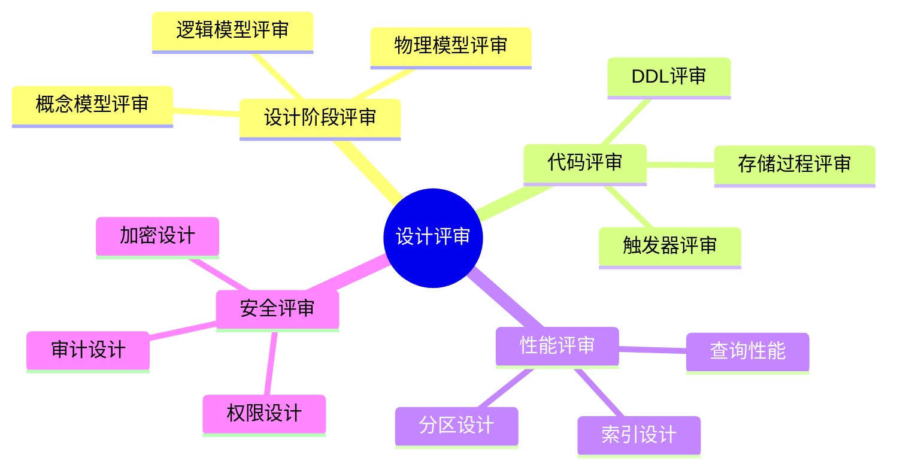
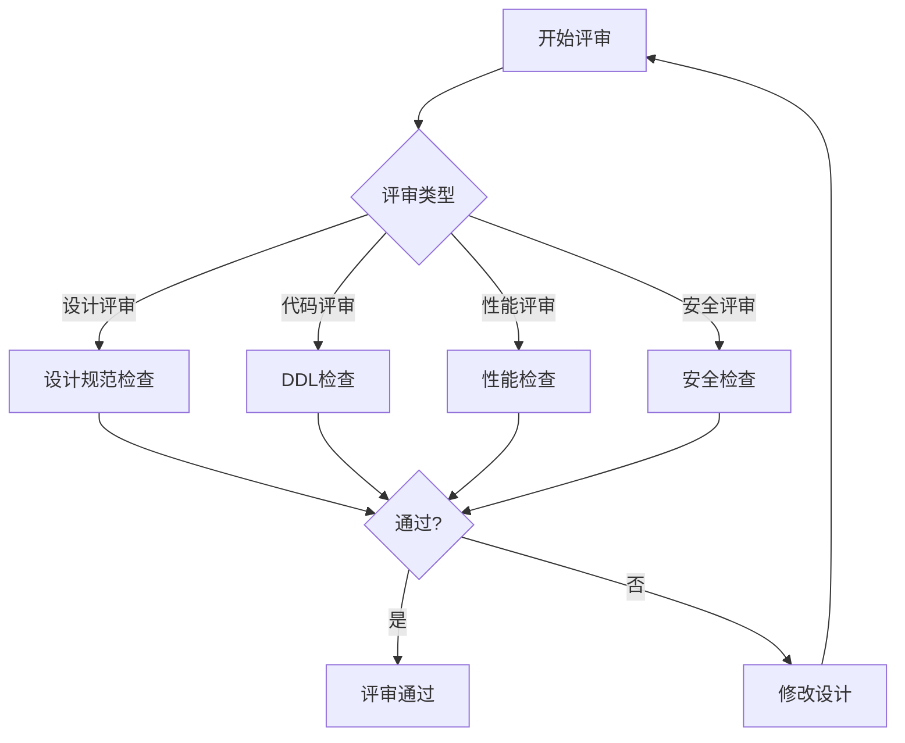

# 数据库设计评审与质量保证：设计规范与检查清单

> **创建日期**：2025-01-15
> **最后更新**：2025-01-15
> **版本**：v1.0
> **状态**：实施中

---

## 📋 目录

- [数据库设计评审与质量保证：设计规范与检查清单](#数据库设计评审与质量保证设计规范与检查清单)
  - [📋 目录](#-目录)
  - [1. 概述](#1-概述)
    - [1.1. 设计评审应用场景](#11-设计评审应用场景)
    - [1.2. 评审流程决策树](#12-评审流程决策树)
  - [2. 设计评审流程](#2-设计评审流程)
    - [2.1. 评审阶段](#21-评审阶段)
    - [2.2. 评审检查清单](#22-评审检查清单)
  - [3. 设计规范检查](#3-设计规范检查)
    - [3.1. 命名规范检查](#31-命名规范检查)
    - [3.2. 结构规范检查](#32-结构规范检查)
  - [4. 性能检查](#4-性能检查)
    - [4.1. 索引检查](#41-索引检查)
    - [4.2. 查询性能检查](#42-查询性能检查)
  - [5. 安全检查](#5-安全检查)
    - [5.1. 权限检查](#51-权限检查)
  - [6. 质量评分系统](#6-质量评分系统)
    - [6.1. 质量评分函数](#61-质量评分函数)
    - [6.2. 评审报告生成](#62-评审报告生成)
  - [7. 实际应用案例](#7-实际应用案例)
    - [7.1. 完整评审系统设计](#71-完整评审系统设计)
  - [8. 参考资料](#8-参考资料)

---

## 1. 概述

数据库设计评审与质量保证是确保设计质量的关键环节，需要建立完善的评审流程和质量检查标准。

### 1.1. 设计评审应用场景



### 1.2. 评审流程决策树



---

## 2. 设计评审流程

### 2.1. 评审阶段

**评审阶段矩阵**：

| 阶段 | 评审内容 | 评审人员 | 评审方式 | 输出 |
|------|---------|---------|---------|------|
| **概念模型评审** | ER图、业务规则 | 业务分析师、架构师 | 会议评审 | 评审报告 |
| **逻辑模型评审** | 表结构、关系 | 数据库设计师、开发人员 | 文档评审 | 评审意见 |
| **物理模型评审** | 索引、分区、性能 | DBA、性能工程师 | 技术评审 | 优化建议 |
| **代码评审** | DDL、函数、触发器 | 开发人员、DBA | 代码审查 | 代码修改 |

### 2.2. 评审检查清单

**设计评审检查清单Schema**：

```sql
CREATE SCHEMA design_review;

-- 评审项目表
CREATE TABLE design_review.review_items (
    item_id SERIAL PRIMARY KEY,
    category VARCHAR(50) NOT NULL,  -- naming, structure, performance, security
    item_name VARCHAR(200) NOT NULL,
    description TEXT,
    severity VARCHAR(20) NOT NULL CHECK (severity IN ('critical', 'high', 'medium', 'low')),
    checklist TEXT[],  -- 检查项列表
    created_at TIMESTAMPTZ NOT NULL DEFAULT CURRENT_TIMESTAMP
);

-- 设计评审记录表
CREATE TABLE design_review.review_records (
    review_id BIGSERIAL PRIMARY KEY,
    design_name VARCHAR(200) NOT NULL,
    design_version VARCHAR(50) NOT NULL,
    reviewer_name VARCHAR(100) NOT NULL,
    review_type VARCHAR(50) NOT NULL,  -- concept, logical, physical, code
    review_status VARCHAR(20) NOT NULL CHECK (review_status IN ('pending', 'in_progress', 'approved', 'rejected', 'needs_revision')),
    review_start_time TIMESTAMPTZ NOT NULL,
    review_end_time TIMESTAMPTZ,
    review_score INTEGER CHECK (review_score BETWEEN 0 AND 100),
    review_comments TEXT,
    created_at TIMESTAMPTZ NOT NULL DEFAULT CURRENT_TIMESTAMP,
    updated_at TIMESTAMPTZ NOT NULL DEFAULT CURRENT_TIMESTAMP
);

CREATE INDEX idx_review_records_status ON design_review.review_records(review_status, review_start_time DESC);
CREATE INDEX idx_review_records_design ON design_review.review_records(design_name, design_version);

-- 评审问题记录表
CREATE TABLE design_review.review_issues (
    issue_id BIGSERIAL PRIMARY KEY,
    review_id BIGINT NOT NULL REFERENCES design_review.review_records(review_id) ON DELETE CASCADE,
    item_id INTEGER NOT NULL REFERENCES design_review.review_items(item_id),
    issue_type VARCHAR(50) NOT NULL,  -- error, warning, suggestion
    issue_description TEXT NOT NULL,
    affected_object VARCHAR(200),  -- 表名、字段名等
    severity VARCHAR(20) NOT NULL,
    status VARCHAR(20) NOT NULL CHECK (status IN ('open', 'fixed', 'wont_fix', 'deferred')),
    fixed_at TIMESTAMPTZ,
    created_at TIMESTAMPTZ NOT NULL DEFAULT CURRENT_TIMESTAMP
);

CREATE INDEX idx_review_issues_review ON design_review.review_issues(review_id, severity);
CREATE INDEX idx_review_issues_status ON design_review.review_issues(status, created_at DESC);
```

---

## 3. 设计规范检查

### 3.1. 命名规范检查

**命名规范检查函数**：

```sql
-- 命名规范检查函数
CREATE OR REPLACE FUNCTION check_naming_conventions(
    p_schema_name VARCHAR,
    p_table_name VARCHAR
)
RETURNS TABLE (
    object_type VARCHAR,
    object_name VARCHAR,
    issue_type VARCHAR,
    issue_description TEXT
) AS $$
BEGIN
    RETURN QUERY
    -- 检查表名：应该使用小写字母和下划线
    SELECT
        'table'::VARCHAR,
        t.table_name::VARCHAR,
        'warning'::VARCHAR,
        'Table name should use lowercase and underscores'::TEXT
    FROM information_schema.tables t
    WHERE t.table_schema = p_schema_name
      AND t.table_name = p_table_name
      AND (t.table_name ~ '[A-Z]' OR t.table_name ~ '-')

    UNION ALL

    -- 检查字段名：应该使用小写字母和下划线
    SELECT
        'column'::VARCHAR,
        c.column_name::VARCHAR,
        'warning'::VARCHAR,
        'Column name should use lowercase and underscores'::TEXT
    FROM information_schema.columns c
    WHERE c.table_schema = p_schema_name
      AND c.table_name = p_table_name
      AND (c.column_name ~ '[A-Z]' OR c.column_name ~ '-')

    UNION ALL

    -- 检查索引名：应该使用idx_前缀
    SELECT
        'index'::VARCHAR,
        i.indexname::VARCHAR,
        'warning'::VARCHAR,
        'Index name should start with idx_'::TEXT
    FROM pg_indexes i
    WHERE i.schemaname = p_schema_name
      AND i.tablename = p_table_name
      AND NOT i.indexname LIKE 'idx_%';
END;
$$ LANGUAGE plpgsql;
```

### 3.2. 结构规范检查

**结构规范检查函数**：

```sql
-- 结构规范检查函数
CREATE OR REPLACE FUNCTION check_structure_conventions(
    p_schema_name VARCHAR,
    p_table_name VARCHAR
)
RETURNS TABLE (
    issue_type VARCHAR,
    issue_description TEXT,
    recommendation TEXT
) AS $$
BEGIN
    RETURN QUERY
    -- 检查是否有主键
    SELECT
        'error'::VARCHAR,
        'Table missing primary key'::TEXT,
        'Add PRIMARY KEY constraint'::TEXT
    FROM information_schema.tables t
    WHERE t.table_schema = p_schema_name
      AND t.table_name = p_table_name
      AND NOT EXISTS (
          SELECT 1 FROM information_schema.table_constraints tc
          WHERE tc.table_schema = p_schema_name
            AND tc.table_name = p_table_name
            AND tc.constraint_type = 'PRIMARY KEY'
      )

    UNION ALL

    -- 检查是否有created_at字段
    SELECT
        'warning'::VARCHAR,
        'Table missing created_at timestamp field'::TEXT,
        'Add created_at TIMESTAMPTZ DEFAULT CURRENT_TIMESTAMP'::TEXT
    FROM information_schema.tables t
    WHERE t.table_schema = p_schema_name
      AND t.table_name = p_table_name
      AND NOT EXISTS (
          SELECT 1 FROM information_schema.columns c
          WHERE c.table_schema = p_schema_name
            AND c.table_name = p_table_name
            AND c.column_name = 'created_at'
      )

    UNION ALL

    -- 检查外键是否有索引
    SELECT
        'warning'::VARCHAR,
        format('Foreign key column %s missing index', kcu.column_name)::TEXT,
        format('CREATE INDEX idx_%s_%s ON %s.%s(%s)',
               p_table_name, kcu.column_name,
               p_schema_name, p_table_name, kcu.column_name)::TEXT
    FROM information_schema.table_constraints tc
    JOIN information_schema.key_column_usage kcu
        ON tc.constraint_name = kcu.constraint_name
    WHERE tc.table_schema = p_schema_name
      AND tc.table_name = p_table_name
      AND tc.constraint_type = 'FOREIGN KEY'
      AND NOT EXISTS (
          SELECT 1 FROM pg_indexes i
          WHERE i.schemaname = p_schema_name
            AND i.tablename = p_table_name
            AND i.indexdef LIKE '%' || kcu.column_name || '%'
      );
END;
$$ LANGUAGE plpgsql;
```

---

## 4. 性能检查

### 4.1. 索引检查

**索引检查函数**：

```sql
-- 索引检查函数
CREATE OR REPLACE FUNCTION check_index_design(
    p_schema_name VARCHAR,
    p_table_name VARCHAR
)
RETURNS TABLE (
    issue_type VARCHAR,
    issue_description TEXT,
    recommendation TEXT
) AS $$
BEGIN
    RETURN QUERY
    -- 检查大表是否有索引
    WITH table_sizes AS (
        SELECT
            schemaname,
            tablename,
            pg_total_relation_size(schemaname||'.'||tablename) AS total_size,
            n_live_tup AS row_count
        FROM pg_stat_user_tables
        WHERE schemaname = p_schema_name
          AND tablename = p_table_name
    )
    SELECT
        'warning'::VARCHAR,
        'Large table missing indexes'::TEXT,
        'Review query patterns and add appropriate indexes'::TEXT
    FROM table_sizes ts
    WHERE ts.total_size > 1000000000  -- 1GB
      AND ts.row_count > 1000000  -- 1M rows
      AND NOT EXISTS (
          SELECT 1 FROM pg_indexes i
          WHERE i.schemaname = ts.schemaname
            AND i.tablename = ts.tablename
      )

    UNION ALL

    -- 检查未使用的索引
    SELECT
        'suggestion'::VARCHAR,
        format('Index %s appears unused', i.indexname)::TEXT,
        'Consider dropping unused index'::TEXT
    FROM pg_indexes i
    LEFT JOIN pg_stat_user_indexes si
        ON i.schemaname = si.schemaname
        AND i.tablename = si.tablename
        AND i.indexname = si.indexname
    WHERE i.schemaname = p_schema_name
      AND i.tablename = p_table_name
      AND (si.idx_scan IS NULL OR si.idx_scan = 0)
      AND i.indexname NOT LIKE '%_pkey';  -- 排除主键索引
END;
$$ LANGUAGE plpgsql;
```

### 4.2. 查询性能检查

**查询性能检查函数**：

```sql
-- 查询性能检查函数
CREATE OR REPLACE FUNCTION check_query_performance()
RETURNS TABLE (
    query_hash BIGINT,
    query_text TEXT,
    mean_exec_time DOUBLE PRECISION,
    calls BIGINT,
    issue_type VARCHAR,
    recommendation TEXT
) AS $$
BEGIN
    RETURN QUERY
    SELECT
        pss.queryid AS query_hash,
        pss.query AS query_text,
        pss.mean_exec_time,
        pss.calls,
        CASE
            WHEN pss.mean_exec_time > 1000 THEN 'critical'::VARCHAR
            WHEN pss.mean_exec_time > 500 THEN 'high'::VARCHAR
            WHEN pss.mean_exec_time > 100 THEN 'medium'::VARCHAR
            ELSE 'low'::VARCHAR
        END AS issue_type,
        CASE
            WHEN pss.mean_exec_time > 1000 THEN 'Query is very slow, requires optimization'::TEXT
            WHEN pss.mean_exec_time > 500 THEN 'Query is slow, consider adding indexes'::TEXT
            WHEN pss.mean_exec_time > 100 THEN 'Query performance could be improved'::TEXT
            ELSE 'Query performance is acceptable'::TEXT
        END AS recommendation
    FROM pg_stat_statements pss
    WHERE pss.calls > 100  -- 只检查频繁执行的查询
      AND pss.mean_exec_time > 100  -- 只检查慢查询
    ORDER BY pss.mean_exec_time DESC
    LIMIT 50;
END;
$$ LANGUAGE plpgsql;
```

---

## 5. 安全检查

### 5.1. 权限检查

**权限检查函数**：

```sql
-- 权限检查函数
CREATE OR REPLACE FUNCTION check_security_design(
    p_schema_name VARCHAR
)
RETURNS TABLE (
    issue_type VARCHAR,
    issue_description TEXT,
    recommendation TEXT
) AS $$
BEGIN
    RETURN QUERY
    -- 检查表是否启用RLS
    SELECT
        'warning'::VARCHAR,
        format('Table %s.%s not using RLS', t.schemaname, t.tablename)::TEXT,
        'Consider enabling Row Level Security for sensitive data'::TEXT
    FROM pg_tables t
    WHERE t.schemaname = p_schema_name
      AND NOT EXISTS (
          SELECT 1 FROM pg_class c
          JOIN pg_namespace n ON c.relnamespace = n.oid
          WHERE n.nspname = t.schemaname
            AND c.relname = t.tablename
            AND c.relrowsecurity = TRUE
      )

    UNION ALL

    -- 检查是否有敏感字段未加密
    SELECT
        'warning'::VARCHAR,
        format('Column %s.%s.%s may contain sensitive data',
               t.schemaname, t.tablename, c.column_name)::TEXT,
        'Consider encrypting sensitive columns'::TEXT
    FROM information_schema.columns c
    JOIN information_schema.tables t
        ON c.table_schema = t.table_schema
        AND c.table_name = t.table_name
    WHERE c.table_schema = p_schema_name
      AND (
          c.column_name ILIKE '%password%' OR
          c.column_name ILIKE '%secret%' OR
          c.column_name ILIKE '%token%' OR
          c.column_name ILIKE '%ssn%' OR
          c.column_name ILIKE '%credit%'
      )
      AND c.data_type NOT IN ('bytea', 'text');  -- 假设bytea和text可能已加密
END;
$$ LANGUAGE plpgsql;
```

---

## 6. 质量评分系统

### 6.1. 质量评分函数

**质量评分函数**：

```sql
-- 设计质量评分函数
CREATE OR REPLACE FUNCTION calculate_design_quality_score(
    p_schema_name VARCHAR,
    p_table_name VARCHAR
)
RETURNS TABLE (
    category VARCHAR,
    score INTEGER,
    max_score INTEGER,
    percentage DOUBLE PRECISION
) AS $$
DECLARE
    v_naming_score INTEGER := 0;
    v_structure_score INTEGER := 0;
    v_performance_score INTEGER := 0;
    v_security_score INTEGER := 0;
    v_total_score INTEGER := 0;
    v_max_total_score INTEGER := 100;
BEGIN
    -- 命名规范评分（25分）
    SELECT COUNT(*) INTO v_naming_score
    FROM check_naming_conventions(p_schema_name, p_table_name)
    WHERE issue_type = 'error';

    v_naming_score := GREATEST(0, 25 - v_naming_score * 5);

    -- 结构规范评分（25分）
    SELECT COUNT(*) INTO v_structure_score
    FROM check_structure_conventions(p_schema_name, p_table_name)
    WHERE issue_type = 'error';

    v_structure_score := GREATEST(0, 25 - v_structure_score * 5);

    -- 性能设计评分（25分）
    SELECT COUNT(*) INTO v_performance_score
    FROM check_index_design(p_schema_name, p_table_name)
    WHERE issue_type IN ('error', 'critical');

    v_performance_score := GREATEST(0, 25 - v_performance_score * 5);

    -- 安全设计评分（25分）
    SELECT COUNT(*) INTO v_security_score
    FROM check_security_design(p_schema_name)
    WHERE issue_type IN ('error', 'critical');

    v_security_score := GREATEST(0, 25 - v_security_score * 5);

    v_total_score := v_naming_score + v_structure_score + v_performance_score + v_security_score;

    RETURN QUERY
    SELECT 'naming'::VARCHAR, v_naming_score, 25, (v_naming_score::DOUBLE PRECISION / 25 * 100)
    UNION ALL
    SELECT 'structure'::VARCHAR, v_structure_score, 25, (v_structure_score::DOUBLE PRECISION / 25 * 100)
    UNION ALL
    SELECT 'performance'::VARCHAR, v_performance_score, 25, (v_performance_score::DOUBLE PRECISION / 25 * 100)
    UNION ALL
    SELECT 'security'::VARCHAR, v_security_score, 25, (v_security_score::DOUBLE PRECISION / 25 * 100)
    UNION ALL
    SELECT 'total'::VARCHAR, v_total_score, v_max_total_score, (v_total_score::DOUBLE PRECISION / v_max_total_score * 100);
END;
$$ LANGUAGE plpgsql;
```

### 6.2. 评审报告生成

**评审报告生成函数**：

```sql
-- 生成评审报告函数
CREATE OR REPLACE FUNCTION generate_review_report(
    p_review_id BIGINT
)
RETURNS JSONB AS $$
DECLARE
    v_review_record RECORD;
    v_issues JSONB;
    v_score JSONB;
    v_report JSONB;
BEGIN
    -- 获取评审记录
    SELECT * INTO v_review_record
    FROM design_review.review_records
    WHERE review_id = p_review_id;

    IF NOT FOUND THEN
        RAISE EXCEPTION 'Review record not found: %', p_review_id;
    END IF;

    -- 获取评审问题
    SELECT jsonb_agg(
        jsonb_build_object(
            'issue_id', issue_id,
            'item_name', ri.item_name,
            'issue_type', issue_type,
            'issue_description', issue_description,
            'affected_object', affected_object,
            'severity', severity,
            'status', status
        )
    ) INTO v_issues
    FROM design_review.review_issues ri
    JOIN design_review.review_items ri2 ON ri.item_id = ri2.item_id
    WHERE ri.review_id = p_review_id;

    -- 构建报告
    v_report := jsonb_build_object(
        'review_id', p_review_id,
        'design_name', v_review_record.design_name,
        'design_version', v_review_record.design_version,
        'reviewer', v_review_record.reviewer_name,
        'review_type', v_review_record.review_type,
        'review_status', v_review_record.review_status,
        'review_score', v_review_record.review_score,
        'review_start_time', v_review_record.review_start_time,
        'review_end_time', v_review_record.review_end_time,
        'review_comments', v_review_record.review_comments,
        'issues', COALESCE(v_issues, '[]'::jsonb),
        'summary', jsonb_build_object(
            'total_issues', (
                SELECT COUNT(*) FROM design_review.review_issues
                WHERE review_id = p_review_id
            ),
            'critical_issues', (
                SELECT COUNT(*) FROM design_review.review_issues
                WHERE review_id = p_review_id AND severity = 'critical'
            ),
            'high_issues', (
                SELECT COUNT(*) FROM design_review.review_issues
                WHERE review_id = p_review_id AND severity = 'high'
            ),
            'open_issues', (
                SELECT COUNT(*) FROM design_review.review_issues
                WHERE review_id = p_review_id AND status = 'open'
            )
        )
    );

    RETURN v_report;
END;
$$ LANGUAGE plpgsql;
```

---

## 7. 实际应用案例

### 7.1. 完整评审系统设计

**评审系统Schema设计**：

```sql
CREATE SCHEMA review_system;

-- 设计文档表
CREATE TABLE review_system.design_documents (
    document_id BIGSERIAL PRIMARY KEY,
    design_name VARCHAR(200) NOT NULL,
    design_version VARCHAR(50) NOT NULL,
    design_type VARCHAR(50) NOT NULL,  -- concept, logical, physical
    ddl_content TEXT,
    er_diagram TEXT,  -- ER图描述
    description TEXT,
    author VARCHAR(100) NOT NULL,
    status VARCHAR(20) NOT NULL DEFAULT 'draft' CHECK (status IN ('draft', 'submitted', 'reviewing', 'approved', 'rejected')),
    created_at TIMESTAMPTZ NOT NULL DEFAULT CURRENT_TIMESTAMP,
    updated_at TIMESTAMPTZ NOT NULL DEFAULT CURRENT_TIMESTAMP,
    UNIQUE(design_name, design_version)
);

CREATE INDEX idx_design_documents_status ON review_system.design_documents(status, created_at DESC);
CREATE INDEX idx_design_documents_author ON review_system.design_documents(author, created_at DESC);

-- 评审工作流表
CREATE TABLE review_system.review_workflows (
    workflow_id BIGSERIAL PRIMARY KEY,
    document_id BIGINT NOT NULL REFERENCES review_system.design_documents(document_id) ON DELETE CASCADE,
    workflow_step INTEGER NOT NULL,
    step_name VARCHAR(100) NOT NULL,
    reviewer_role VARCHAR(50) NOT NULL,
    reviewer_name VARCHAR(100),
    step_status VARCHAR(20) NOT NULL DEFAULT 'pending' CHECK (step_status IN ('pending', 'in_progress', 'approved', 'rejected')),
    step_comments TEXT,
    step_start_time TIMESTAMPTZ,
    step_end_time TIMESTAMPTZ,
    created_at TIMESTAMPTZ NOT NULL DEFAULT CURRENT_TIMESTAMP
);

CREATE INDEX idx_review_workflows_document ON review_system.review_workflows(document_id, workflow_step);
CREATE INDEX idx_review_workflows_status ON review_system.review_workflows(step_status, step_start_time DESC);
```

---

## 8. 参考资料

- [数据库设计最佳实践库](./07.14-数据库设计最佳实践库.md)
- [数据库设计工具与模板库](./07.15-数据库设计工具与模板库.md)
- [数据库安全设计模式](./07.23-数据库安全设计模式.md)

---

**最后更新**：2025-01-15
**维护者**：Data-Science Team
**状态**：实施中
