# 数据库设计模式总结与索引：快速查找指南

> **创建日期**：2025-01-15
> **最后更新**：2025-12-01
> **版本**：v2.0 (增强版)
> **状态**：实施中

---

## 📋 目录

- [数据库设计模式总结与索引：快速查找指南](#数据库设计模式总结与索引快速查找指南)
  - [📋 目录](#-目录)
  - [1. 概述](#1-概述)
    - [1.1. 设计模式分类](#11-设计模式分类)
  - [2. 设计模式分类索引](#2-设计模式分类索引)
    - [2.1. 按应用场景索引](#21-按应用场景索引)
    - [2.2. 按数据类型索引](#22-按数据类型索引)
    - [2.3. 按架构模式索引](#23-按架构模式索引)
  - [3. 设计模式对比矩阵](#3-设计模式对比矩阵)
    - [3.1. 数据库类型对比](#31-数据库类型对比)
    - [3.2. 多租户模式对比](#32-多租户模式对比)
    - [3.3. 分布式事务模式对比](#33-分布式事务模式对比)
  - [4. 设计模式选择决策树](#4-设计模式选择决策树)
    - [4.1. 数据库类型选择决策树](#41-数据库类型选择决策树)
    - [4.2. 多租户模式选择决策树](#42-多租户模式选择决策树)
    - [4.3. 分布式模式选择决策树](#43-分布式模式选择决策树)
  - [5. 设计模式快速参考](#5-设计模式快速参考)
    - [5.1. 设计模式速查表](#51-设计模式速查表)
    - [5.2. 常用设计模式组合](#52-常用设计模式组合)
  - [6. 参考资料](#6-参考资料)
    - [6.1. 理论模型文档](#61-理论模型文档)
    - [6.2. 实践指导文档](#62-实践指导文档)
  - [7. 模式分类形式化](#7-模式分类形式化)
    - [7.1. 模式分类本体](#71-模式分类本体)
    - [7.2. 模式语义关系图谱](#72-模式语义关系图谱)
    - [7.3. 模式选择决策算法](#73-模式选择决策算法)
  - [8. 参考资料](#8-参考资料)
    - [8.1. 理论模型文档](#81-理论模型文档)
    - [8.2. 实践指导文档](#82-实践指导文档)

---

## 1. 概述

本文档提供数据库设计模式的快速查找指南，帮助开发者根据具体需求快速定位合适的设计模式。

### 1.1. 设计模式分类

```mermaid
mindmap
  root((数据库设计模式))
    基础设计模式
      Schema设计
      元模型理论
      数据建模
    现代设计模式
      微服务数据库
      数据网格
      AI驱动优化
    分布式设计模式
      分布式事务
      数据一致性
      数据同步
    专用数据库模式
      向量数据库
      地理空间数据库
      知识图谱数据库
      时序数据库
      文档数据库
      列式数据库
      内存数据库
    多租户模式
      独立数据库
      共享数据库+Schema
      共享数据库+RLS
    安全与运维模式
      数据库安全
      备份恢复
      监控运维
      设计评审
```



---

## 2. 设计模式分类索引

### 2.1. 按应用场景索引

**应用场景索引矩阵**：

| 应用场景 | 推荐模式 | 文档链接 | 优先级 |
|---------|---------|---------|--------|
| **电商系统** | 分布式数据库、文档数据库、多租户 | [07.17](./07.17-分布式数据库设计模式.md), [07.19](./07.19-文档数据库设计模式.md), [07.20](./07.20-多租户数据库设计模式.md) | ⭐⭐⭐ |
| **推荐系统** | 向量数据库、知识图谱 | [07.10](./07.10-向量数据库设计.md), [07.12](./07.12-知识图谱数据库设计实战.md) | ⭐⭐⭐ |
| **LBS服务** | 地理空间数据库 | [07.11](./07.11-地理空间数据库设计.md) | ⭐⭐⭐ |
| **IoT平台** | 时序数据库、列式数据库 | [07.18](./07.18-时序数据库设计模式.md), [07.21](./07.21-列式数据库设计模式.md) | ⭐⭐⭐ |
| **内容管理** | 文档数据库 | [07.19](./07.19-文档数据库设计模式.md) | ⭐⭐ |
| **数据分析** | 列式数据库、时序数据库 | [07.21](./07.21-列式数据库设计模式.md), [07.18](./07.18-时序数据库设计模式.md) | ⭐⭐⭐ |
| **缓存系统** | 内存数据库 | [07.22](./07.22-内存数据库设计模式.md) | ⭐⭐⭐ |
| **SaaS平台** | 多租户数据库 | [07.20](./07.20-多租户数据库设计模式.md) | ⭐⭐⭐ |
| **企业知识库** | 知识图谱、向量数据库 | [07.12](./07.12-知识图谱数据库设计实战.md), [07.10](./07.10-向量数据库设计.md) | ⭐⭐⭐ |
| **金融系统** | 数据库安全、备份恢复 | [07.23](./07.23-数据库安全设计模式.md), [07.24](./07.24-数据库备份与恢复设计模式.md) | ⭐⭐⭐ |

### 2.2. 按数据类型索引

**数据类型索引矩阵**：

| 数据类型 | 推荐模式 | 文档链接 | 说明 |
|---------|---------|---------|------|
| **关系型数据** | Schema设计、关系数据库理论 | [07.01](./07.01-Schema设计方法论.md), [01.02](../01-理论模型/01.02-关系数据库理论.md) | 结构化数据 |
| **向量数据** | 向量数据库 | [07.10](./07.10-向量数据库设计.md) | 嵌入向量、相似度搜索 |
| **地理数据** | 地理空间数据库 | [07.11](./07.11-地理空间数据库设计.md) | 点、线、面、空间查询 |
| **图数据** | 知识图谱 | [07.12](./07.12-知识图谱数据库设计实战.md) | 实体、关系、三元组 |
| **时序数据** | 时序数据库 | [07.18](./07.18-时序数据库设计模式.md) | 时间序列、监控数据 |
| **文档数据** | 文档数据库 | [07.19](./07.19-文档数据库设计模式.md) | JSON、XML、非结构化 |
| **分析数据** | 列式数据库 | [07.21](./07.21-列式数据库设计模式.md) | OLAP、数据仓库 |
| **缓存数据** | 内存数据库 | [07.22](./07.22-内存数据库设计模式.md) | 临时数据、高速访问 |

### 2.3. 按架构模式索引

**架构模式索引矩阵**：

| 架构模式 | 推荐模式 | 文档链接 | 适用场景 |
|---------|---------|---------|---------|
| **单体架构** | Schema设计、数据建模 | [07.01](./07.01-Schema设计方法论.md), [07.03](./07.03-数据建模指导.md) | 小型应用 |
| **微服务架构** | 分布式数据库、Database per Service | [07.17](./07.17-分布式数据库设计模式.md) | 大型分布式系统 |
| **数据网格** | 数据网格理论 | [07.05](./07.05-现代数据库设计模式.md) | 企业级数据架构 |
| **数据编织** | 数据编织理论 | [07.05](./07.05-现代数据库设计模式.md) | 统一数据管理 |
| **多租户SaaS** | 多租户数据库 | [07.20](./07.20-多租户数据库设计模式.md) | SaaS平台 |

---

## 3. 设计模式对比矩阵

### 3.1. 数据库类型对比

**数据库类型对比矩阵**：

| 数据库类型 | 数据模型 | 查询方式 | 适用场景 | 性能特点 | 文档链接 |
|-----------|---------|---------|---------|---------|---------|
| **关系数据库** | 表、行、列 | SQL | 结构化数据、事务处理 | ACID、强一致性 | [01.02](../01-理论模型/01.02-关系数据库理论.md) |
| **向量数据库** | 向量、嵌入 | 相似度搜索 | AI应用、推荐系统 | 高维向量检索 | [07.10](./07.10-向量数据库设计.md) |
| **地理空间数据库** | 点、线、面 | 空间查询 | LBS、GIS | 空间索引优化 | [07.11](./07.11-地理空间数据库设计.md) |
| **知识图谱** | 三元组、图 | 图查询 | 知识管理、推理 | 图遍历优化 | [07.12](./07.12-知识图谱数据库设计实战.md) |
| **时序数据库** | 时间序列 | 时间窗口查询 | IoT、监控 | 时间分区优化 | [07.18](./07.18-时序数据库设计模式.md) |
| **文档数据库** | JSON、文档 | 文档查询 | 内容管理、非结构化 | 灵活Schema | [07.19](./07.19-文档数据库设计模式.md) |
| **列式数据库** | 列存储 | 聚合查询 | 数据分析、OLAP | 列压缩优化 | [07.21](./07.21-列式数据库设计模式.md) |
| **内存数据库** | 键值、数据结构 | 快速访问 | 缓存、会话 | 内存速度 | [07.22](./07.22-内存数据库设计模式.md) |

### 3.2. 多租户模式对比

**多租户模式对比矩阵**：

| 模式 | 隔离级别 | 成本 | 性能 | 扩展性 | 适用场景 | 文档链接 |
|------|---------|------|------|--------|---------|---------|
| **独立数据库** | 完全隔离 | 高 | 最优 | 低 | 大型企业客户 | [07.20](./07.20-多租户数据库设计模式.md) |
| **共享数据库+Schema** | Schema隔离 | 中 | 良好 | 中 | 中型SaaS | [07.20](./07.20-多租户数据库设计模式.md) |
| **共享数据库+RLS** | 行级隔离 | 低 | 一般 | 高 | 小型SaaS | [07.20](./07.20-多租户数据库设计模式.md) |

### 3.3. 分布式事务模式对比

**分布式事务模式对比矩阵**：

| 模式 | 一致性 | 性能 | 复杂度 | 适用场景 | 文档链接 |
|------|--------|------|--------|---------|---------|
| **2PC** | 强一致性 | 低 | 高 | 强一致性要求 | [07.17](./07.17-分布式数据库设计模式.md) |
| **Saga** | 最终一致性 | 高 | 中 | 长事务、微服务 | [07.17](./07.17-分布式数据库设计模式.md) |
| **TCC** | 最终一致性 | 高 | 高 | 复杂业务逻辑 | [07.17](./07.17-分布式数据库设计模式.md) |
| **事件溯源** | 最终一致性 | 高 | 高 | 审计、回放需求 | [07.17](./07.17-分布式数据库设计模式.md) |

---

## 4. 设计模式选择决策树

### 4.1. 数据库类型选择决策树

```mermaid
flowchart TD
    A[选择数据库类型] --> B{数据特征}

    B -->|结构化数据| C{事务需求}
    B -->|向量数据| D[向量数据库]
    B -->|地理数据| E[地理空间数据库]
    B -->|图数据| F[知识图谱]
    B -->|时序数据| G[时序数据库]
    B -->|文档数据| H[文档数据库]
    B -->|分析数据| I[列式数据库]
    B -->|缓存数据| J[内存数据库]

    C -->|强事务| K[关系数据库]
    C -->|弱事务| L{查询模式}

    L -->|聚合查询| I
    L -->|OLTP| K

    D --> M[07.10-向量数据库设计]
    E --> N[07.11-地理空间数据库设计]
    F --> O[07.12-知识图谱数据库设计实战]
    G --> P[07.18-时序数据库设计模式]
    H --> Q[07.19-文档数据库设计模式]
    I --> R[07.21-列式数据库设计模式]
    J --> S[07.22-内存数据库设计模式]
    K --> T[07.01-Schema设计方法论]
```



### 4.2. 多租户模式选择决策树

```mermaid
flowchart TD
    A[选择多租户模式] --> B{租户规模}

    B -->|大型企业| C[独立数据库]
    B -->|中型企业| D{数据隔离需求}
    B -->|小型企业| E[共享数据库+RLS]

    D -->|高隔离| C
    D -->|中隔离| F[共享数据库+Schema]
    D -->|低隔离| E

    C --> G[07.20-多租户数据库设计模式]
    F --> G
    E --> G
```



### 4.3. 分布式模式选择决策树

```mermaid
flowchart TD
    A[选择分布式模式] --> B{一致性需求}

    B -->|强一致性| C[2PC]
    B -->|最终一致性| D{事务复杂度}

    D -->|简单事务| E[Saga]
    D -->|复杂事务| F{TCC/事件溯源}

    F -->|需要审计| G[事件溯源]
    F -->|需要补偿| H[TCC]

    C --> I[07.17-分布式数据库设计模式]
    E --> I
    G --> I
    H --> I
```



---

## 5. 设计模式快速参考

### 5.1. 设计模式速查表

**设计模式速查表**：

| 模式名称 | 文档编号 | 核心概念 | 关键SQL/代码 | 适用场景 |
|---------|---------|---------|-------------|---------|
| **Schema设计** | 07.01 | 命名规范、数据类型、约束 | `CREATE TABLE`, `ALTER TABLE` | 所有数据库设计 |
| **元模型理论** | 07.02 | 元数据、DDL生成 | Python元模型类 | 自动化设计 |
| **数据建模** | 07.03 | ER图、范式化 | ER图设计 | 概念设计 |
| **向量数据库** | 07.10 | 向量嵌入、相似度搜索 | `pgvector`, `<=>` | AI应用 |
| **地理空间** | 07.11 | PostGIS、空间索引 | `ST_Contains`, `GIST` | LBS、GIS |
| **知识图谱** | 07.12 | 三元组、图查询 | `Cypher`, `SPARQL` | 知识管理 |
| **分布式** | 07.17 | Saga、2PC、CQRS | 分布式事务模式 | 微服务 |
| **时序数据库** | 07.18 | 超表、连续聚合 | `TimescaleDB`, `create_hypertable` | IoT、监控 |
| **文档数据库** | 07.19 | JSONB、文档模型 | `JSONB`, `MongoDB` | 内容管理 |
| **多租户** | 07.20 | RLS、Schema隔离 | `ROW LEVEL SECURITY` | SaaS平台 |
| **列式数据库** | 07.21 | MergeTree、物化视图 | `ClickHouse`, `MergeTree` | 数据分析 |
| **内存数据库** | 07.22 | Redis、缓存模式 | `Redis`, `SET`, `GET` | 缓存、会话 |
| **数据库安全** | 07.23 | RBAC、加密、审计 | `pgcrypto`, `RLS` | 安全要求高 |
| **备份恢复** | 07.24 | WAL归档、PITR | `pg_basebackup`, `pg_dump` | 数据保护 |
| **监控运维** | 07.25 | 指标采集、告警 | `pg_stat_statements` | 运维管理 |
| **设计评审** | 07.26 | 质量检查、评分 | 检查函数 | 质量保证 |

### 5.2. 常用设计模式组合

**设计模式组合推荐**：

| 组合场景 | 推荐模式组合 | 说明 |
|---------|------------|------|
| **AI推荐系统** | 向量数据库 + 知识图谱 | [07.10](./07.10-向量数据库设计.md) + [07.12](./07.12-知识图谱数据库设计实战.md) + [07.13](./07.13-向量与知识图谱融合设计.md) |
| **微服务电商** | 分布式数据库 + 文档数据库 + 多租户 | [07.17](./07.17-分布式数据库设计模式.md) + [07.19](./07.19-文档数据库设计模式.md) + [07.20](./07.20-多租户数据库设计模式.md) |
| **IoT监控平台** | 时序数据库 + 列式数据库 + 监控运维 | [07.18](./07.18-时序数据库设计模式.md) + [07.21](./07.21-列式数据库设计模式.md) + [07.25](./07.25-数据库监控与运维设计模式.md) |
| **企业知识库** | 知识图谱 + 向量数据库 + 文档数据库 | [07.12](./07.12-知识图谱数据库设计实战.md) + [07.10](./07.10-向量数据库设计.md) + [07.19](./07.19-文档数据库设计模式.md) |
| **金融系统** | 关系数据库 + 数据库安全 + 备份恢复 | [07.01](./07.01-Schema设计方法论.md) + [07.23](./07.23-数据库安全设计模式.md) + [07.24](./07.24-数据库备份与恢复设计模式.md) |

---

## 6. 参考资料

### 6.1. 理论模型文档

- [范畴论基础](../01-理论模型/01.01-范畴论基础.md)
- [关系数据库理论](../01-理论模型/01.02-关系数据库理论.md)
- [多模型数据库理论](../01-理论模型/01.03-多模型数据库理论.md)
- [知识图谱理论](../01-理论模型/01.04-知识图谱理论.md)
- [形式化方法](../01-理论模型/01.05-形式化方法.md)
- [知识推理与归纳理论](../01-理论模型/01.06-知识推理与归纳理论.md)
- [AI Graph理论](../01-理论模型/01.07-AI Graph理论.md)

### 6.2. 实践指导文档

- [Schema设计方法论](./07.01-Schema设计方法论.md)
- [元模型理论](./07.02-元模型理论.md)
- [数据建模指导](./07.03-数据建模指导.md)
- [数据分析与使用指南](./07.04-数据分析与使用指南.md)
- [现代数据库设计模式](./07.05-现代数据库设计模式.md)
- [数据库设计反模式与解决方案](./07.06-数据库设计反模式与解决方案.md)
- [数据库迁移与版本管理](./07.07-数据库迁移与版本管理.md)
- [数据库性能调优实战](./07.08-数据库性能调优实战.md)
- [行业案例库](./07.09-行业案例库.md)
- [向量数据库设计](./07.10-向量数据库设计.md)
- [地理空间数据库设计](./07.11-地理空间数据库设计.md)
- [知识图谱数据库设计实战](./07.12-知识图谱数据库设计实战.md)
- [向量与知识图谱融合设计](./07.13-向量与知识图谱融合设计.md)
- [数据库设计最佳实践库](./07.14-数据库设计最佳实践库.md)
- [数据库设计工具与模板库](./07.15-数据库设计工具与模板库.md)
- [数据库设计案例深度解析](./07.16-数据库设计案例深度解析.md)
- [分布式数据库设计模式](./07.17-分布式数据库设计模式.md)
- [时序数据库设计模式](./07.18-时序数据库设计模式.md)
- [文档数据库设计模式](./07.19-文档数据库设计模式.md)
- [多租户数据库设计模式](./07.20-多租户数据库设计模式.md)
- [列式数据库设计模式](./07.21-列式数据库设计模式.md)
- [内存数据库设计模式](./07.22-内存数据库设计模式.md)
- [数据库安全设计模式](./07.23-数据库安全设计模式.md)
- [数据库备份与恢复设计模式](./07.24-数据库备份与恢复设计模式.md)
- [数据库监控与运维设计模式](./07.25-数据库监控与运维设计模式.md)
- [数据库设计评审与质量保证](./07.26-数据库设计评审与质量保证.md)

---

## 7. 模式分类形式化

### 7.1. 模式分类本体

```mermaid
flowchart TB
    subgraph 基础层
        F1[关系模型理论]
        F2[范式化理论]
        F3[CAP/PACELC]
    end

    subgraph 模式层
        P1[Schema设计模式]
        P2[索引设计模式]
        P3[分区设计模式]
        P4[复制设计模式]
    end

    subgraph 应用层
        A1[OLTP模式]
        A2[OLAP模式]
        A3[HTAP模式]
        A4[AI数据模式]
    end

    F1 --> P1
    F2 --> P1
    F3 --> P4
    P1 --> A1
    P2 --> A1
    P3 --> A2
    P4 --> A3
    P1 --> A4
```

### 7.2. 模式语义关系图谱

```mermaid
flowchart LR
    subgraph 核心模式
        S[Schema设计<br/>07.01]
        M[元模型<br/>07.02]
        D[数据建模<br/>07.03]
    end

    subgraph 现代模式
        MS[微服务数据库<br/>07.05]
        DM[分布式模式<br/>07.17]
        FT[形式化理论<br/>07.42]
    end

    subgraph 专用模式
        V[向量数据库<br/>07.10]
        KG[知识图谱<br/>07.12]
        TS[时序数据库<br/>07.18]
        MT[多租户<br/>07.20]
    end

    S --> M
    M --> D
    D --> MS
    MS --> DM
    DM --> FT

    S --> V
    V --> KG
    S --> TS
    S --> MT

    V -.->|融合| KG
    DM -.->|一致性| FT
```

### 7.3. 模式选择决策算法

```python
def select_design_patterns(requirements: dict) -> list:
    """
    根据需求自动推荐设计模式

    requirements = {
        'scale': 'small' | 'medium' | 'large',
        'consistency': 'strong' | 'eventual',
        'read_write_ratio': float,  # 读写比
        'data_type': 'relational' | 'document' | 'graph' | 'vector' | 'timeseries',
        'multi_tenant': bool,
        'ai_features': bool
    }
    """
    patterns = []

    # 基础模式（所有场景）
    patterns.append('07.01-Schema设计方法论')

    # 根据数据类型
    if requirements.get('data_type') == 'vector':
        patterns.append('07.10-向量数据库设计')
    if requirements.get('data_type') == 'graph':
        patterns.append('07.12-知识图谱数据库设计')
    if requirements.get('data_type') == 'timeseries':
        patterns.append('07.18-时序数据库设计')

    # 根据规模和一致性
    if requirements.get('scale') in ['medium', 'large']:
        patterns.append('07.17-分布式数据库设计')
        patterns.append('07.42-形式化理论')

    # 多租户
    if requirements.get('multi_tenant'):
        patterns.append('07.20-多租户数据库设计')

    # AI特性
    if requirements.get('ai_features'):
        patterns.append('07.10-向量数据库设计')
        patterns.append('07.13-向量与知识图谱融合')

    return patterns
```

---

## 8. 参考资料

### 8.1. 理论模型文档

- [范畴论基础](../01-理论模型/01.01-范畴论基础.md)
- [关系数据库理论](../01-理论模型/01.02-关系数据库理论.md)
- [知识图谱理论](../01-理论模型/01.04-知识图谱理论.md)
- **[数据库设计形式化理论](./07.42-数据库设计形式化理论.md)** (新增)

### 8.2. 实践指导文档

| 文档编号 | 文档名称 | 版本 | 状态 |
|---------|---------|------|------|
| 07.01 | Schema设计方法论 | v2.0 | ✅ 已增强 |
| 07.02 | 元模型理论 | v2.0 | ✅ 已增强 |
| 07.05 | 现代数据库设计模式 | v2.0 | ✅ 已增强 |
| 07.06 | 反模式与解决方案 | v2.0 | ✅ 已增强 |
| 07.10 | 向量数据库设计 | v2.0 | ✅ 已增强 |
| 07.17 | 分布式数据库设计模式 | v2.0 | ✅ 已增强 |
| 07.33 | 演进历史与未来趋势 | v2.0 | ✅ 已增强 |
| 07.42 | 形式化理论 | v1.0 | ✅ 新建 |

---

**最后更新**：2025-12-01
**维护者**：Data-Science Team
**状态**：实施中
**版本**：v2.0 (增强版)
