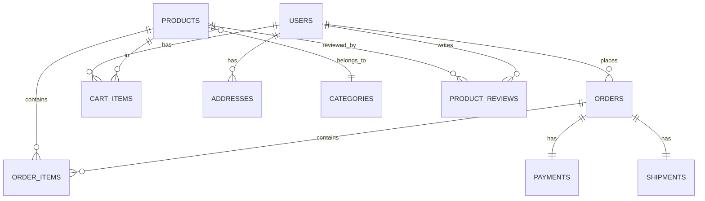

# 数据库设计模式实战演练：从理论到实践

> **创建日期**：2025-01-15
> **最后更新**：2025-01-15
> **版本**：v1.0
> **状态**：实施中

---

## 📋 目录

- [数据库设计模式实战演练：从理论到实践](#数据库设计模式实战演练从理论到实践)
  - [📋 目录](#-目录)
  - [1. 概述](#1-概述)
    - [1.1. 实战演练目标](#11-实战演练目标)
    - [1.2. 实战演练结构](#12-实战演练结构)
  - [2. 实战演练1：电商系统数据库设计](#2-实战演练1电商系统数据库设计)
    - [2.1. 需求分析](#21-需求分析)
    - [2.2. 概念设计](#22-概念设计)
    - [2.3. 逻辑设计](#23-逻辑设计)
    - [2.4. 物理设计优化](#24-物理设计优化)
    - [2.5. 设计评审](#25-设计评审)
  - [3. 实战演练2：推荐系统数据库设计](#3-实战演练2推荐系统数据库设计)
    - [3.1. 需求分析](#31-需求分析)
    - [3.2. 概念设计](#32-概念设计)
    - [3.3. 逻辑设计](#33-逻辑设计)
    - [3.4. 查询设计](#34-查询设计)
  - [4. 实战演练3：IoT监控平台数据库设计](#4-实战演练3iot监控平台数据库设计)
    - [4.1. 需求分析](#41-需求分析)
    - [4.2. 逻辑设计](#42-逻辑设计)
    - [4.3. 连续聚合设计](#43-连续聚合设计)
  - [5. 实战演练4：SaaS多租户系统数据库设计](#5-实战演练4saas多租户系统数据库设计)
    - [5.1. 需求分析](#51-需求分析)
    - [5.2. 逻辑设计](#52-逻辑设计)
  - [6. 实战演练5：企业知识库数据库设计](#6-实战演练5企业知识库数据库设计)
    - [6.1. 需求分析](#61-需求分析)
    - [6.2. 逻辑设计](#62-逻辑设计)
  - [7. 实战演练6：金融支付系统数据库设计](#7-实战演练6金融支付系统数据库设计)
    - [7.1. 需求分析](#71-需求分析)
    - [7.2. 逻辑设计](#72-逻辑设计)
  - [8. 实战演练总结](#8-实战演练总结)
    - [8.1. 设计模式应用总结](#81-设计模式应用总结)
    - [8.2. 设计原则总结](#82-设计原则总结)
  - [9. 参考资料](#9-参考资料)

---

## 1. 概述

本文档提供数据库设计模式的实战演练，通过6个完整的实战案例，帮助开发者将理论知识转化为实际设计能力。

### 1.1. 实战演练目标

- **掌握设计流程**：从需求分析到物理实现的完整流程
- **应用设计模式**：在不同场景下选择合适的设计模式
- **解决实际问题**：处理性能、安全、扩展性等实际问题
- **优化设计方案**：通过评审和优化提升设计质量

### 1.2. 实战演练结构

每个实战演练包含：

- **需求分析**：业务需求、技术需求、性能需求
- **概念设计**：ER图、业务规则
- **逻辑设计**：表结构、关系设计
- **物理设计**：索引、分区、优化
- **代码实现**：完整DDL代码
- **设计评审**：质量检查、优化建议

---

## 2. 实战演练1：电商系统数据库设计

### 2.1. 需求分析

**业务需求**：

- 用户注册、登录、个人信息管理
- 商品管理（分类、属性、库存）
- 购物车、订单管理
- 支付、物流跟踪
- 评价、推荐

**技术需求**：

- 支持高并发读写
- 分布式部署
- 数据一致性保证
- 高可用性

**性能需求**：

- 查询响应时间 < 100ms
- 支持10万+商品
- 支持百万级用户
- 日订单量10万+

### 2.2. 概念设计

**ER图设计**：



### 2.3. 逻辑设计

**表结构设计**：

```sql
CREATE SCHEMA ecommerce;

-- 用户表
CREATE TABLE ecommerce.users (
    user_id BIGSERIAL PRIMARY KEY,
    username VARCHAR(50) NOT NULL UNIQUE,
    email VARCHAR(100) NOT NULL UNIQUE,
    password_hash TEXT NOT NULL,
    phone VARCHAR(20),
    status VARCHAR(20) DEFAULT 'active',
    created_at TIMESTAMPTZ NOT NULL DEFAULT CURRENT_TIMESTAMP,
    updated_at TIMESTAMPTZ NOT NULL DEFAULT CURRENT_TIMESTAMP
);

CREATE INDEX idx_users_email ON ecommerce.users(email);
CREATE INDEX idx_users_status ON ecommerce.users(status);

-- 商品分类表
CREATE TABLE ecommerce.categories (
    category_id SERIAL PRIMARY KEY,
    category_name VARCHAR(100) NOT NULL,
    parent_id INTEGER REFERENCES ecommerce.categories(category_id),
    level INTEGER NOT NULL DEFAULT 1,
    sort_order INTEGER DEFAULT 0,
    created_at TIMESTAMPTZ NOT NULL DEFAULT CURRENT_TIMESTAMP
);

CREATE INDEX idx_categories_parent ON ecommerce.categories(parent_id);

-- 商品表
CREATE TABLE ecommerce.products (
    product_id BIGSERIAL PRIMARY KEY,
    category_id INTEGER NOT NULL REFERENCES ecommerce.categories(category_id),
    product_name VARCHAR(200) NOT NULL,
    description TEXT,
    price DECIMAL(10, 2) NOT NULL,
    stock_quantity INTEGER NOT NULL DEFAULT 0,
    sales_count INTEGER DEFAULT 0,
    status VARCHAR(20) DEFAULT 'active',
    created_at TIMESTAMPTZ NOT NULL DEFAULT CURRENT_TIMESTAMP,
    updated_at TIMESTAMPTZ NOT NULL DEFAULT CURRENT_TIMESTAMP
) PARTITION BY RANGE (created_at);

CREATE INDEX idx_products_category ON ecommerce.products(category_id);
CREATE INDEX idx_products_status ON ecommerce.products(status);
CREATE INDEX idx_products_price ON ecommerce.products(price);

-- 订单表（按月分区）
CREATE TABLE ecommerce.orders (
    order_id BIGSERIAL PRIMARY KEY,
    user_id BIGINT NOT NULL REFERENCES ecommerce.users(user_id),
    order_sn VARCHAR(64) UNIQUE NOT NULL,
    total_amount DECIMAL(12, 2) NOT NULL,
    actual_payment DECIMAL(12, 2) NOT NULL,
    payment_status VARCHAR(20) DEFAULT 'pending',
    order_status VARCHAR(20) DEFAULT 'created',
    shipping_address JSONB,
    created_at TIMESTAMPTZ NOT NULL DEFAULT CURRENT_TIMESTAMP,
    updated_at TIMESTAMPTZ NOT NULL DEFAULT CURRENT_TIMESTAMP
) PARTITION BY RANGE (created_at);

CREATE INDEX idx_orders_user ON ecommerce.orders(user_id, created_at DESC);
CREATE INDEX idx_orders_status ON ecommerce.orders(order_status, created_at DESC);
CREATE INDEX idx_orders_sn ON ecommerce.orders(order_sn);

-- 订单明细表
CREATE TABLE ecommerce.order_items (
    item_id BIGSERIAL PRIMARY KEY,
    order_id BIGINT NOT NULL REFERENCES ecommerce.orders(order_id) ON DELETE CASCADE,
    product_id BIGINT NOT NULL REFERENCES ecommerce.products(product_id),
    quantity INTEGER NOT NULL,
    price DECIMAL(10, 2) NOT NULL,
    subtotal DECIMAL(12, 2) NOT NULL,
    created_at TIMESTAMPTZ NOT NULL DEFAULT CURRENT_TIMESTAMP
);

CREATE INDEX idx_order_items_order ON ecommerce.order_items(order_id);
CREATE INDEX idx_order_items_product ON ecommerce.order_items(product_id);

-- 购物车表
CREATE TABLE ecommerce.cart_items (
    cart_id BIGSERIAL PRIMARY KEY,
    user_id BIGINT NOT NULL REFERENCES ecommerce.users(user_id) ON DELETE CASCADE,
    product_id BIGINT NOT NULL REFERENCES ecommerce.products(product_id),
    quantity INTEGER NOT NULL DEFAULT 1,
    created_at TIMESTAMPTZ NOT NULL DEFAULT CURRENT_TIMESTAMP,
    updated_at TIMESTAMPTZ NOT NULL DEFAULT CURRENT_TIMESTAMP,
    UNIQUE(user_id, product_id)
);

CREATE INDEX idx_cart_items_user ON ecommerce.cart_items(user_id);
```

### 2.4. 物理设计优化

**分区策略**：

```sql
-- 创建订单表分区（按月分区）
CREATE TABLE ecommerce.orders_2025_01 PARTITION OF ecommerce.orders
FOR VALUES FROM ('2025-01-01') TO ('2025-02-01');

CREATE TABLE ecommerce.orders_2025_02 PARTITION OF ecommerce.orders
FOR VALUES FROM ('2025-02-01') TO ('2025-03-01');

-- 创建商品表分区（按创建时间分区）
CREATE TABLE ecommerce.products_2025_01 PARTITION OF ecommerce.products
FOR VALUES FROM ('2025-01-01') TO ('2025-02-01');
```

**性能优化**：

```sql
-- 物化视图：商品销售统计
CREATE MATERIALIZED VIEW ecommerce.mv_product_sales AS
SELECT
    product_id,
    SUM(quantity) AS total_sold,
    SUM(subtotal) AS total_revenue,
    COUNT(DISTINCT order_id) AS order_count
FROM ecommerce.order_items
GROUP BY product_id;

CREATE UNIQUE INDEX ON ecommerce.mv_product_sales(product_id);

-- 定期刷新物化视图
REFRESH MATERIALIZED VIEW CONCURRENTLY ecommerce.mv_product_sales;
```

### 2.5. 设计评审

**质量评分**：

- 命名规范：✅ 符合规范
- 结构设计：✅ 主键、外键完整
- 性能设计：✅ 分区、索引合理
- 安全设计：⚠️ 需要添加RLS策略

**优化建议**：

1. 添加用户密码加密存储
2. 添加订单状态变更审计日志
3. 添加商品库存预警机制
4. 考虑使用Redis缓存热门商品

---

## 3. 实战演练2：推荐系统数据库设计

### 3.1. 需求分析

**业务需求**：

- 用户行为数据收集（浏览、点击、购买）
- 商品向量嵌入存储
- 相似度搜索
- 推荐结果存储

**技术需求**：

- 向量数据库支持
- 实时推荐计算
- 高并发查询

**性能需求**：

- 向量检索响应时间 < 50ms
- 支持百万级商品向量
- 支持实时推荐更新

### 3.2. 概念设计

**数据模型**：

- 用户行为表（时序数据）
- 商品向量表（向量数据）
- 推荐结果表（缓存数据）

### 3.3. 逻辑设计

**表结构设计**：

```sql
CREATE SCHEMA recommendation;

-- 用户行为表（时序数据）
CREATE TABLE recommendation.user_behaviors (
    behavior_id BIGSERIAL PRIMARY KEY,
    user_id BIGINT NOT NULL,
    product_id BIGINT NOT NULL,
    behavior_type VARCHAR(20) NOT NULL, -- view, click, purchase, cart
    behavior_time TIMESTAMPTZ NOT NULL DEFAULT CURRENT_TIMESTAMP,
    context JSONB -- 上下文信息
) PARTITION BY RANGE (behavior_time);

CREATE INDEX idx_behaviors_user_time ON recommendation.user_behaviors(user_id, behavior_time DESC);
CREATE INDEX idx_behaviors_product_time ON recommendation.user_behaviors(product_id, behavior_time DESC);

-- 商品向量表（使用pgvector扩展）
CREATE EXTENSION IF NOT EXISTS vector;

CREATE TABLE recommendation.product_vectors (
    product_id BIGINT PRIMARY KEY,
    product_name VARCHAR(200) NOT NULL,
    category_id INTEGER,
    embedding vector(384) NOT NULL, -- 384维向量
    metadata JSONB,
    created_at TIMESTAMPTZ NOT NULL DEFAULT CURRENT_TIMESTAMP,
    updated_at TIMESTAMPTZ NOT NULL DEFAULT CURRENT_TIMESTAMP
);

-- 创建向量索引（HNSW）
CREATE INDEX idx_product_vectors_embedding ON recommendation.product_vectors
USING hnsw (embedding vector_cosine_ops)
WITH (m = 16, ef_construction = 64);

-- 推荐结果表（缓存）
CREATE TABLE recommendation.recommendations (
    recommendation_id BIGSERIAL PRIMARY KEY,
    user_id BIGINT NOT NULL,
    product_id BIGINT NOT NULL REFERENCES recommendation.product_vectors(product_id),
    score DOUBLE PRECISION NOT NULL,
    recommendation_type VARCHAR(50) NOT NULL, -- collaborative, content-based, hybrid
    created_at TIMESTAMPTZ NOT NULL DEFAULT CURRENT_TIMESTAMP,
    expires_at TIMESTAMPTZ NOT NULL,
    UNIQUE(user_id, product_id, recommendation_type)
);

CREATE INDEX idx_recommendations_user ON recommendation.recommendations(user_id, score DESC);
CREATE INDEX idx_recommendations_expires ON recommendation.recommendations(expires_at);
```

### 3.4. 查询设计

**向量相似度搜索**：

```sql
-- 基于商品相似度的推荐
CREATE OR REPLACE FUNCTION get_similar_products(
    p_product_id BIGINT,
    p_limit INTEGER DEFAULT 10
)
RETURNS TABLE (
    product_id BIGINT,
    product_name VARCHAR,
    similarity DOUBLE PRECISION
) AS $$
BEGIN
    RETURN QUERY
    SELECT
        pv2.product_id,
        pv2.product_name,
        1 - (pv1.embedding <=> pv2.embedding) AS similarity
    FROM recommendation.product_vectors pv1
    CROSS JOIN recommendation.product_vectors pv2
    WHERE pv1.product_id = p_product_id
      AND pv2.product_id != p_product_id
    ORDER BY pv1.embedding <=> pv2.embedding
    LIMIT p_limit;
END;
$$ LANGUAGE plpgsql;

-- 基于用户行为的推荐
CREATE OR REPLACE FUNCTION get_user_recommendations(
    p_user_id BIGINT,
    p_limit INTEGER DEFAULT 20
)
RETURNS TABLE (
    product_id BIGINT,
    product_name VARCHAR,
    score DOUBLE PRECISION
) AS $$
BEGIN
    RETURN QUERY
    WITH user_products AS (
        SELECT DISTINCT product_id
        FROM recommendation.user_behaviors
        WHERE user_id = p_user_id
          AND behavior_type IN ('purchase', 'click')
          AND behavior_time >= CURRENT_TIMESTAMP - INTERVAL '30 days'
    ),
    similar_products AS (
        SELECT DISTINCT
            pv2.product_id,
            pv2.product_name,
            AVG(1 - (pv1.embedding <=> pv2.embedding)) AS avg_similarity
        FROM user_products up
        JOIN recommendation.product_vectors pv1 ON up.product_id = pv1.product_id
        CROSS JOIN recommendation.product_vectors pv2
        WHERE pv2.product_id NOT IN (SELECT product_id FROM user_products)
        GROUP BY pv2.product_id, pv2.product_name
    )
    SELECT
        sp.product_id,
        sp.product_name,
        sp.avg_similarity AS score
    FROM similar_products sp
    ORDER BY sp.avg_similarity DESC
    LIMIT p_limit;
END;
$$ LANGUAGE plpgsql;
```

---

## 4. 实战演练3：IoT监控平台数据库设计

### 4.1. 需求分析

**业务需求**：

- 设备管理（注册、状态监控）
- 传感器数据采集（温度、湿度、压力等）
- 实时告警
- 历史数据查询和分析

**技术需求**：

- 时序数据库支持
- 高写入性能
- 数据压缩和归档

**性能需求**：

- 支持百万级设备
- 每秒百万级数据点写入
- 查询响应时间 < 1秒

### 4.2. 逻辑设计

**表结构设计（使用TimescaleDB）**：

```sql
CREATE SCHEMA iot_monitoring;

-- 设备表
CREATE TABLE iot_monitoring.devices (
    device_id BIGSERIAL PRIMARY KEY,
    device_name VARCHAR(200) NOT NULL,
    device_type VARCHAR(50) NOT NULL,
    location VARCHAR(200),
    status VARCHAR(20) DEFAULT 'active',
    metadata JSONB,
    created_at TIMESTAMPTZ NOT NULL DEFAULT CURRENT_TIMESTAMP
);

CREATE INDEX idx_devices_type ON iot_monitoring.devices(device_type);
CREATE INDEX idx_devices_status ON iot_monitoring.devices(status);

-- 传感器数据表（时序数据）
CREATE TABLE iot_monitoring.sensor_data (
    time TIMESTAMPTZ NOT NULL,
    device_id BIGINT NOT NULL REFERENCES iot_monitoring.devices(device_id),
    sensor_type VARCHAR(50) NOT NULL,
    value DOUBLE PRECISION NOT NULL,
    unit VARCHAR(20),
    quality INTEGER DEFAULT 100, -- 数据质量
    PRIMARY KEY (time, device_id, sensor_type)
);

-- 转换为超表
SELECT create_hypertable('iot_monitoring.sensor_data', 'time',
    chunk_time_interval => INTERVAL '1 day'
);

-- 创建索引
CREATE INDEX idx_sensor_data_device_time ON iot_monitoring.sensor_data(device_id, time DESC);
CREATE INDEX idx_sensor_data_type_time ON iot_monitoring.sensor_data(sensor_type, time DESC);

-- 告警规则表
CREATE TABLE iot_monitoring.alert_rules (
    rule_id SERIAL PRIMARY KEY,
    device_id BIGINT REFERENCES iot_monitoring.devices(device_id),
    sensor_type VARCHAR(50) NOT NULL,
    condition_type VARCHAR(20) NOT NULL, -- gt, lt, eq
    threshold_value DOUBLE PRECISION NOT NULL,
    severity VARCHAR(20) NOT NULL,
    is_active BOOLEAN DEFAULT TRUE,
    created_at TIMESTAMPTZ NOT NULL DEFAULT CURRENT_TIMESTAMP
);

-- 告警记录表
CREATE TABLE iot_monitoring.alerts (
    alert_id BIGSERIAL PRIMARY KEY,
    rule_id INTEGER NOT NULL REFERENCES iot_monitoring.alert_rules(rule_id),
    device_id BIGINT NOT NULL,
    sensor_type VARCHAR(50) NOT NULL,
    alert_value DOUBLE PRECISION NOT NULL,
    threshold_value DOUBLE PRECISION NOT NULL,
    severity VARCHAR(20) NOT NULL,
    status VARCHAR(20) DEFAULT 'firing',
    started_at TIMESTAMPTZ NOT NULL,
    resolved_at TIMESTAMPTZ,
    created_at TIMESTAMPTZ NOT NULL DEFAULT CURRENT_TIMESTAMP
) PARTITION BY RANGE (started_at);

CREATE INDEX idx_alerts_status ON iot_monitoring.alerts(status, started_at DESC);
CREATE INDEX idx_alerts_device ON iot_monitoring.alerts(device_id, started_at DESC);
```

### 4.3. 连续聚合设计

**连续聚合视图**：

```sql
-- 每小时聚合
CREATE MATERIALIZED VIEW iot_monitoring.sensor_data_hourly
WITH (timescaledb.continuous) AS
SELECT
    time_bucket('1 hour', time) AS bucket,
    device_id,
    sensor_type,
    AVG(value) AS avg_value,
    MIN(value) AS min_value,
    MAX(value) AS max_value,
    COUNT(*) AS data_points
FROM iot_monitoring.sensor_data
GROUP BY bucket, device_id, sensor_type;

-- 每天聚合
CREATE MATERIALIZED VIEW iot_monitoring.sensor_data_daily
WITH (timescaledb.continuous) AS
SELECT
    time_bucket('1 day', time) AS bucket,
    device_id,
    sensor_type,
    AVG(value) AS avg_value,
    MIN(value) AS min_value,
    MAX(value) AS max_value,
    COUNT(*) AS data_points
FROM iot_monitoring.sensor_data
GROUP BY bucket, device_id, sensor_type;
```

---

## 5. 实战演练4：SaaS多租户系统数据库设计

### 5.1. 需求分析

**业务需求**：

- 多租户隔离
- 租户资源管理
- 租户数据独立

**技术需求**：

- 使用RLS实现行级安全
- 支持租户数据迁移
- 支持租户资源限制

### 5.2. 逻辑设计

**表结构设计（RLS模式）**：

```sql
CREATE SCHEMA saas_app;

-- 租户表
CREATE TABLE saas_app.tenants (
    tenant_id BIGSERIAL PRIMARY KEY,
    tenant_name VARCHAR(200) NOT NULL UNIQUE,
    max_users INTEGER DEFAULT 50,
    max_projects INTEGER DEFAULT 10,
    is_active BOOLEAN DEFAULT TRUE,
    created_at TIMESTAMPTZ NOT NULL DEFAULT CURRENT_TIMESTAMP
);

-- 用户表（共享，RLS隔离）
CREATE TABLE saas_app.users (
    user_id BIGSERIAL PRIMARY KEY,
    tenant_id BIGINT NOT NULL REFERENCES saas_app.tenants(tenant_id),
    username VARCHAR(100) NOT NULL,
    email VARCHAR(200) NOT NULL,
    password_hash TEXT NOT NULL,
    is_admin BOOLEAN DEFAULT FALSE,
    created_at TIMESTAMPTZ NOT NULL DEFAULT CURRENT_TIMESTAMP,
    UNIQUE(tenant_id, username)
);

-- 启用RLS
ALTER TABLE saas_app.users ENABLE ROW LEVEL SECURITY;

-- RLS策略函数
CREATE OR REPLACE FUNCTION saas_app.get_current_tenant_id()
RETURNS BIGINT AS $$
BEGIN
    RETURN current_setting('app.current_tenant_id', TRUE)::BIGINT;
END;
$$ LANGUAGE plpgsql STABLE;

-- RLS策略
CREATE POLICY tenant_isolation_policy ON saas_app.users
    FOR ALL
    USING (tenant_id = saas_app.get_current_tenant_id())
    WITH CHECK (tenant_id = saas_app.get_current_tenant_id());

-- 项目表
CREATE TABLE saas_app.projects (
    project_id BIGSERIAL PRIMARY KEY,
    tenant_id BIGINT NOT NULL REFERENCES saas_app.tenants(tenant_id),
    project_name VARCHAR(200) NOT NULL,
    description TEXT,
    status VARCHAR(50) DEFAULT 'active',
    created_by BIGINT NOT NULL REFERENCES saas_app.users(user_id),
    created_at TIMESTAMPTZ NOT NULL DEFAULT CURRENT_TIMESTAMP,
    UNIQUE(tenant_id, project_name)
);

ALTER TABLE saas_app.projects ENABLE ROW LEVEL SECURITY;

CREATE POLICY tenant_isolation_policy ON saas_app.projects
    FOR ALL
    USING (tenant_id = saas_app.get_current_tenant_id())
    WITH CHECK (tenant_id = saas_app.get_current_tenant_id());
```

---

## 6. 实战演练5：企业知识库数据库设计

### 6.1. 需求分析

**业务需求**：

- 知识文档管理
- 知识图谱构建
- 向量检索
- 智能问答

**技术需求**：

- 知识图谱存储
- 向量数据库
- 混合检索

### 6.2. 逻辑设计

**表结构设计（知识图谱+向量）**：

```sql
CREATE SCHEMA knowledge_base;

-- 实体表
CREATE TABLE knowledge_base.entities (
    entity_id BIGSERIAL PRIMARY KEY,
    entity_type VARCHAR(50) NOT NULL,
    entity_name VARCHAR(200) NOT NULL,
    properties JSONB NOT NULL DEFAULT '{}',
    embedding vector(384), -- 向量嵌入
    created_at TIMESTAMPTZ NOT NULL DEFAULT CURRENT_TIMESTAMP,
    updated_at TIMESTAMPTZ NOT NULL DEFAULT CURRENT_TIMESTAMP
);

CREATE INDEX idx_entities_type ON knowledge_base.entities(entity_type);
CREATE INDEX idx_entities_name ON knowledge_base.entities(entity_name);
CREATE INDEX idx_entities_embedding ON knowledge_base.entities
USING hnsw (embedding vector_cosine_ops);

-- 关系表（三元组）
CREATE TABLE knowledge_base.relations (
    relation_id BIGSERIAL PRIMARY KEY,
    subject_id BIGINT NOT NULL REFERENCES knowledge_base.entities(entity_id),
    predicate VARCHAR(100) NOT NULL,
    object_id BIGINT NOT NULL REFERENCES knowledge_base.entities(entity_id),
    properties JSONB NOT NULL DEFAULT '{}',
    created_at TIMESTAMPTZ NOT NULL DEFAULT CURRENT_TIMESTAMP,
    UNIQUE(subject_id, predicate, object_id)
);

CREATE INDEX idx_relations_subject ON knowledge_base.relations(subject_id);
CREATE INDEX idx_relations_object ON knowledge_base.relations(object_id);
CREATE INDEX idx_relations_predicate ON knowledge_base.relations(predicate);

-- 文档表
CREATE TABLE knowledge_base.documents (
    document_id BIGSERIAL PRIMARY KEY,
    title VARCHAR(500) NOT NULL,
    content TEXT NOT NULL,
    content_type VARCHAR(50), -- pdf, docx, markdown
    embedding vector(384),
    metadata JSONB,
    created_at TIMESTAMPTZ NOT NULL DEFAULT CURRENT_TIMESTAMP,
    updated_at TIMESTAMPTZ NOT NULL DEFAULT CURRENT_TIMESTAMP
);

CREATE INDEX idx_documents_embedding ON knowledge_base.documents
USING hnsw (embedding vector_cosine_ops);
CREATE INDEX idx_documents_title ON knowledge_base.documents USING GIN(to_tsvector('english', title));
```

---

## 7. 实战演练6：金融支付系统数据库设计

### 7.1. 需求分析

**业务需求**：

- 账户管理
- 交易记录
- 支付处理
- 风控审计

**技术需求**：

- 强一致性
- 事务保证
- 安全加密
- 审计日志

### 7.2. 逻辑设计

**表结构设计**：

```sql
CREATE SCHEMA finance;

-- 账户表
CREATE TABLE finance.accounts (
    account_id BIGSERIAL PRIMARY KEY,
    user_id BIGINT NOT NULL,
    account_type VARCHAR(50) NOT NULL, -- savings, checking, credit
    balance DECIMAL(15, 2) NOT NULL DEFAULT 0,
    currency VARCHAR(3) DEFAULT 'CNY',
    status VARCHAR(20) DEFAULT 'active',
    created_at TIMESTAMPTZ NOT NULL DEFAULT CURRENT_TIMESTAMP,
    updated_at TIMESTAMPTZ NOT NULL DEFAULT CURRENT_TIMESTAMP
);

CREATE INDEX idx_accounts_user ON finance.accounts(user_id);
CREATE INDEX idx_accounts_status ON finance.accounts(status);

-- 交易表
CREATE TABLE finance.transactions (
    transaction_id BIGSERIAL PRIMARY KEY,
    from_account_id BIGINT REFERENCES finance.accounts(account_id),
    to_account_id BIGINT REFERENCES finance.accounts(account_id),
    amount DECIMAL(15, 2) NOT NULL,
    currency VARCHAR(3) NOT NULL,
    transaction_type VARCHAR(50) NOT NULL, -- transfer, deposit, withdrawal
    status VARCHAR(20) DEFAULT 'pending',
    created_at TIMESTAMPTZ NOT NULL DEFAULT CURRENT_TIMESTAMP,
    completed_at TIMESTAMPTZ
) PARTITION BY RANGE (created_at);

CREATE INDEX idx_transactions_from ON finance.transactions(from_account_id, created_at DESC);
CREATE INDEX idx_transactions_to ON finance.transactions(to_account_id, created_at DESC);
CREATE INDEX idx_transactions_status ON finance.transactions(status, created_at DESC);

-- 审计日志表
CREATE TABLE finance.audit_logs (
    log_id BIGSERIAL PRIMARY KEY,
    table_name VARCHAR(100) NOT NULL,
    record_id BIGINT NOT NULL,
    operation VARCHAR(20) NOT NULL, -- INSERT, UPDATE, DELETE
    old_values JSONB,
    new_values JSONB,
    user_id BIGINT,
    ip_address INET,
    created_at TIMESTAMPTZ NOT NULL DEFAULT CURRENT_TIMESTAMP
) PARTITION BY RANGE (created_at);

CREATE INDEX idx_audit_logs_table_record ON finance.audit_logs(table_name, record_id);
CREATE INDEX idx_audit_logs_user ON finance.audit_logs(user_id, created_at DESC);
```

---

## 8. 实战演练总结

### 8.1. 设计模式应用总结

| 实战案例 | 应用的设计模式 | 关键设计决策 |
|---------|--------------|-------------|
| **电商系统** | 分布式数据库、分区、物化视图 | 订单表按月分区、商品销售统计物化视图 |
| **推荐系统** | 向量数据库、时序数据库 | pgvector扩展、HNSW索引、行为数据时序存储 |
| **IoT监控** | 时序数据库、连续聚合 | TimescaleDB超表、连续聚合视图 |
| **SaaS多租户** | 多租户数据库、RLS | 行级安全策略、租户隔离 |
| **知识库** | 知识图谱、向量数据库 | 三元组存储、向量检索、混合检索 |
| **金融支付** | 关系数据库、审计日志 | 强一致性、事务保证、完整审计 |

### 8.2. 设计原则总结

1. **性能优先**：合理使用分区、索引、物化视图
2. **安全第一**：加密存储、RLS策略、审计日志
3. **可扩展性**：分区设计、分布式架构
4. **数据一致性**：外键约束、事务保证
5. **可维护性**：命名规范、文档完整

---

## 9. 参考资料

- [数据库设计模式总结与索引](./07.27-数据库设计模式总结与索引.md)
- [数据库设计案例深度解析](./07.16-数据库设计案例深度解析.md)
- [行业案例库](./07.09-行业案例库.md)

---

**最后更新**：2025-01-15
**维护者**：Data-Science Team
**状态**：实施中
