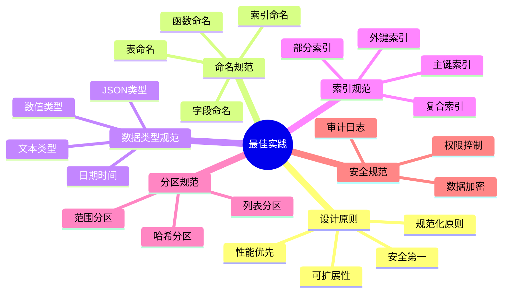
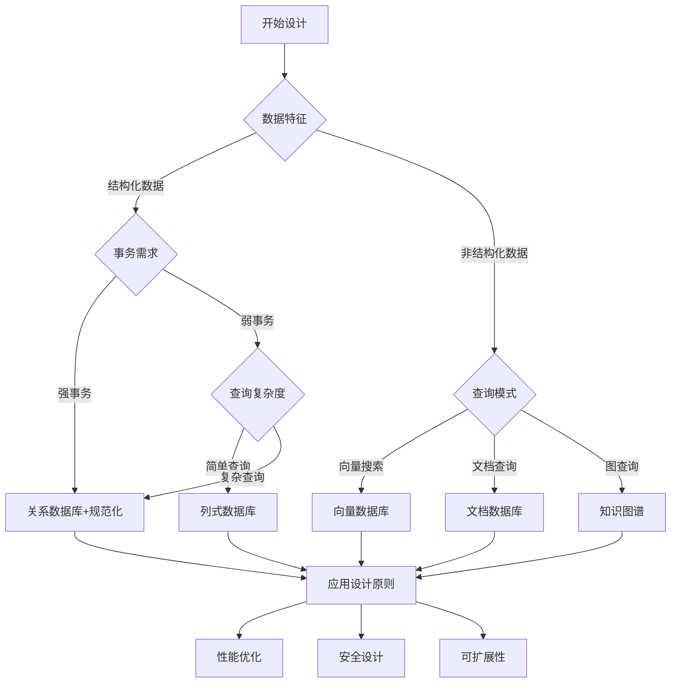

# 数据库设计模式最佳实践总结：核心原则与规范

> **创建日期**：2025-01-15
> **最后更新**：2025-01-15
> **版本**：v1.0
> **状态**：实施中

---

## 📋 目录

- [数据库设计模式最佳实践总结：核心原则与规范](#数据库设计模式最佳实践总结核心原则与规范)
  - [📋 目录](#-目录)
  - [1. 概述](#1-概述)
    - [1.1. 最佳实践分类](#11-最佳实践分类)
  - [2. 核心设计原则](#2-核心设计原则)
    - [2.1. 设计原则矩阵](#21-设计原则矩阵)
    - [2.2. 设计原则决策树](#22-设计原则决策树)
  - [3. 命名规范](#3-命名规范)
    - [3.1. 命名规范矩阵](#31-命名规范矩阵)
    - [3.2. 命名规范检查清单](#32-命名规范检查清单)
  - [4. 数据类型选择规范](#4-数据类型选择规范)
    - [4.1. 数据类型选择决策树](#41-数据类型选择决策树)
    - [4.2. 数据类型选择矩阵](#42-数据类型选择矩阵)
  - [5. 索引设计规范](#5-索引设计规范)
    - [5.1. 索引设计原则](#51-索引设计原则)
    - [5.2. 索引设计检查清单](#52-索引设计检查清单)
  - [6. 分区设计规范](#6-分区设计规范)
    - [6.1. 分区策略选择](#61-分区策略选择)
    - [6.2. 分区设计最佳实践](#62-分区设计最佳实践)
  - [7. 安全设计规范](#7-安全设计规范)
    - [7.1. 安全设计原则](#71-安全设计原则)
    - [7.2. RLS设计规范](#72-rls设计规范)
  - [8. 性能优化规范](#8-性能优化规范)
    - [8.1. 性能优化原则](#81-性能优化原则)
    - [8.2. 查询优化检查清单](#82-查询优化检查清单)
  - [9. 设计模式选择指南](#9-设计模式选择指南)
    - [9.1. 设计模式选择矩阵](#91-设计模式选择矩阵)
  - [10. 常见问题与解决方案](#10-常见问题与解决方案)
    - [10.1. 常见问题矩阵](#101-常见问题矩阵)
    - [10.2. 设计评审检查清单](#102-设计评审检查清单)
  - [11. 参考资料](#11-参考资料)

---

## 1. 概述

本文档总结数据库设计模式的核心最佳实践，提供设计原则、规范和常见问题的解决方案。

### 1.1. 最佳实践分类



---

## 2. 核心设计原则

### 2.1. 设计原则矩阵

**核心设计原则对比**：

| 原则 | 优先级 | 说明 | 适用场景 |
|------|--------|------|---------|
| **规范化原则** | ⭐⭐⭐ | 减少数据冗余，保证数据一致性 | 所有数据库设计 |
| **性能优先** | ⭐⭐⭐ | 合理使用索引、分区、物化视图 | 高并发系统 |
| **安全第一** | ⭐⭐⭐ | 权限控制、数据加密、审计日志 | 敏感数据系统 |
| **可扩展性** | ⭐⭐ | 分区设计、分布式架构 | 大规模系统 |
| **可维护性** | ⭐⭐ | 命名规范、文档完整 | 长期维护系统 |

### 2.2. 设计原则决策树



---

## 3. 命名规范

### 3.1. 命名规范矩阵

**命名规范对比**：

| 对象类型 | 命名规范 | 示例 | 说明 |
|---------|---------|------|------|
| **表名** | 小写字母+下划线，复数形式 | `users`, `order_items` | 清晰表达实体 |
| **字段名** | 小写字母+下划线 | `user_id`, `created_at` | 避免关键字冲突 |
| **索引名** | `idx_` + 表名 + 字段名 | `idx_users_email` | 便于识别 |
| **主键名** | `pk_` + 表名 | `pk_users` | 明确主键 |
| **外键名** | `fk_` + 表名 + 字段名 | `fk_orders_user_id` | 明确外键关系 |
| **函数名** | 动词+名词，小写+下划线 | `get_user_by_id` | 表达功能 |
| **视图名** | `v_` + 描述性名称 | `v_user_statistics` | 区分视图 |

### 3.2. 命名规范检查清单

**命名规范检查清单**：

```sql
-- 命名规范检查函数
CREATE OR REPLACE FUNCTION check_naming_conventions()
RETURNS TABLE (
    object_type VARCHAR,
    object_name VARCHAR,
    issue_type VARCHAR,
    recommendation TEXT
) AS $$
BEGIN
    RETURN QUERY
    -- 检查表名：应该使用小写字母和下划线
    SELECT
        'table'::VARCHAR,
        t.table_name::VARCHAR,
        'warning'::VARCHAR,
        'Table name should use lowercase and underscores'::TEXT
    FROM information_schema.tables t
    WHERE t.table_schema = 'public'
      AND (t.table_name ~ '[A-Z]' OR t.table_name ~ '-')

    UNION ALL

    -- 检查字段名：应该使用小写字母和下划线
    SELECT
        'column'::VARCHAR,
        c.column_name::VARCHAR,
        'warning'::VARCHAR,
        'Column name should use lowercase and underscores'::TEXT
    FROM information_schema.columns c
    WHERE c.table_schema = 'public'
      AND (c.column_name ~ '[A-Z]' OR c.column_name ~ '-')

    UNION ALL

    -- 检查索引名：应该使用idx_前缀
    SELECT
        'index'::VARCHAR,
        i.indexname::VARCHAR,
        'warning'::VARCHAR,
        'Index name should start with idx_'::TEXT
    FROM pg_indexes i
    WHERE i.schemaname = 'public'
      AND NOT i.indexname LIKE 'idx_%'
      AND NOT i.indexname LIKE '%_pkey';
END;
$$ LANGUAGE plpgsql;
```

---

## 4. 数据类型选择规范

### 4.1. 数据类型选择决策树

```mermaid
flowchart TD
    A[选择数据类型] --> B{数据特征}

    B -->|数值| C{整数/小数}
    B -->|文本| D{长度固定}
    B -->|日期时间| E[时间类型]
    B -->|布尔| F[BOOLEAN]
    B -->|二进制| G[BYTEA]
    B -->|JSON| H[JSONB]

    C -->|整数| I{数值范围}
    C -->|小数| J[NUMERIC/DECIMAL]

    I -->|小范围| K[SMALLINT]
    I -->|中范围| L[INTEGER]
    I -->|大范围| M[BIGINT]

    D -->|固定| N[CHAR(n)]
    D -->|可变| O{VARCHAR/TEXT}

    O -->|有上限| P[VARCHAR(n)]
    O -->|无上限| Q[TEXT]

    E -->|仅日期| R[DATE]
    E -->|日期时间| S[TIMESTAMPTZ]
```

### 4.2. 数据类型选择矩阵

**数据类型选择对比**：

| 数据类型 | 存储大小 | 精度 | 适用场景 | 注意事项 |
|---------|---------|------|---------|---------|
| **SMALLINT** | 2 bytes | -32768 to 32767 | 小范围整数 | 节省空间 |
| **INTEGER** | 4 bytes | -2147483648 to 2147483647 | 常用整数 | 默认选择 |
| **BIGINT** | 8 bytes | 大范围整数 | ID、时间戳 | 避免溢出 |
| **NUMERIC** | 可变 | 精确小数 | 金额、精度要求高 | 性能略低 |
| **VARCHAR(n)** | 可变 | 最大n字符 | 有长度限制的文本 | 设置合理上限 |
| **TEXT** | 可变 | 无限制 | 长文本、内容 | 性能良好 |
| **TIMESTAMPTZ** | 8 bytes | 时区感知 | 时间戳 | 推荐使用 |
| **JSONB** | 可变 | JSON数据 | 半结构化数据 | 支持索引 |

---

## 5. 索引设计规范

### 5.1. 索引设计原则

**索引设计原则矩阵**：

| 原则 | 说明 | 示例 |
|------|------|------|
| **主键索引** | 所有表必须有主键 | `PRIMARY KEY (user_id)` |
| **外键索引** | 外键字段必须有索引 | `CREATE INDEX idx_orders_user_id ON orders(user_id)` |
| **查询字段索引** | WHERE、JOIN、ORDER BY字段 | `CREATE INDEX idx_users_email ON users(email)` |
| **复合索引** | 多字段查询使用复合索引 | `CREATE INDEX idx_orders_user_status ON orders(user_id, status)` |
| **部分索引** | 条件查询使用部分索引 | `CREATE INDEX idx_active_users ON users(email) WHERE status = 'active'` |
| **覆盖索引** | 包含查询所需的所有字段 | `CREATE INDEX idx_users_cover ON users(user_id, email, name)` |

### 5.2. 索引设计检查清单

**索引设计检查清单**：

```sql
-- 检查外键是否有索引
CREATE OR REPLACE FUNCTION check_foreign_key_indexes()
RETURNS TABLE (
    table_name VARCHAR,
    column_name VARCHAR,
    has_index BOOLEAN,
    recommendation TEXT
) AS $$
BEGIN
    RETURN QUERY
    SELECT
        tc.table_name::VARCHAR,
        kcu.column_name::VARCHAR,
        CASE WHEN i.indexname IS NOT NULL THEN TRUE ELSE FALSE END AS has_index,
        CASE
            WHEN i.indexname IS NULL THEN
                format('CREATE INDEX idx_%s_%s ON %s(%s)',
                       tc.table_name, kcu.column_name,
                       tc.table_name, kcu.column_name)
            ELSE 'Index exists'
        END AS recommendation
    FROM information_schema.table_constraints tc
    JOIN information_schema.key_column_usage kcu
        ON tc.constraint_name = kcu.constraint_name
    LEFT JOIN pg_indexes i
        ON i.tablename = tc.table_name
        AND i.indexdef LIKE '%' || kcu.column_name || '%'
    WHERE tc.constraint_type = 'FOREIGN KEY'
      AND tc.table_schema = 'public';
END;
$$ LANGUAGE plpgsql;
```

---

## 6. 分区设计规范

### 6.1. 分区策略选择

**分区策略对比矩阵**：

| 分区策略 | 适用场景 | 优点 | 缺点 |
|---------|---------|------|------|
| **范围分区** | 时间序列数据、有序数据 | 查询性能好、易于管理 | 数据分布不均 |
| **列表分区** | 离散值分区 | 灵活、易于管理 | 分区数量限制 |
| **哈希分区** | 数据均匀分布 | 负载均衡 | 查询性能一般 |
| **复合分区** | 复杂场景 | 灵活组合 | 复杂度高 |

### 6.2. 分区设计最佳实践

**分区设计最佳实践**：

```sql
-- 范围分区示例：订单表按月分区
CREATE TABLE orders (
    order_id BIGSERIAL,
    user_id BIGINT NOT NULL,
    order_date TIMESTAMPTZ NOT NULL,
    total_amount DECIMAL(12, 2) NOT NULL,
    PRIMARY KEY (order_id, order_date)
) PARTITION BY RANGE (order_date);

-- 创建分区
CREATE TABLE orders_2025_01 PARTITION OF orders
FOR VALUES FROM ('2025-01-01') TO ('2025-02-01');

CREATE TABLE orders_2025_02 PARTITION OF orders
FOR VALUES FROM ('2025-02-01') TO ('2025-03-01');

-- 自动创建分区函数
CREATE OR REPLACE FUNCTION create_monthly_partitions(
    p_table_name TEXT,
    p_start_date DATE,
    p_end_date DATE
)
RETURNS VOID AS $$
DECLARE
    current_date DATE := p_start_date;
    partition_name TEXT;
BEGIN
    WHILE current_date < p_end_date LOOP
        partition_name := p_table_name || '_' || to_char(current_date, 'YYYY_MM');
        EXECUTE format(
            'CREATE TABLE IF NOT EXISTS %I PARTITION OF %I FOR VALUES FROM (%L) TO (%L)',
            partition_name,
            p_table_name,
            current_date,
            current_date + INTERVAL '1 month'
        );
        current_date := current_date + INTERVAL '1 month';
    END LOOP;
END;
$$ LANGUAGE plpgsql;
```

---

## 7. 安全设计规范

### 7.1. 安全设计原则

**安全设计原则矩阵**：

| 原则 | 说明 | 实现方式 |
|------|------|---------|
| **最小权限原则** | 用户只拥有必要的权限 | RBAC、RLS |
| **数据加密** | 敏感数据加密存储 | `pgcrypto`、字段加密 |
| **审计日志** | 记录所有数据变更 | 触发器、审计表 |
| **访问控制** | 限制数据库访问 | 防火墙、SSL连接 |
| **密码策略** | 强密码要求 | 密码复杂度、定期更换 |

### 7.2. RLS设计规范

**RLS设计最佳实践**：

```sql
-- RLS策略设计示例
CREATE TABLE sensitive_data (
    id BIGSERIAL PRIMARY KEY,
    tenant_id BIGINT NOT NULL,
    data TEXT NOT NULL,
    created_at TIMESTAMPTZ NOT NULL DEFAULT CURRENT_TIMESTAMP
);

-- 启用RLS
ALTER TABLE sensitive_data ENABLE ROW LEVEL SECURITY;

-- 创建策略函数
CREATE OR REPLACE FUNCTION get_current_tenant_id()
RETURNS BIGINT AS $$
BEGIN
    RETURN current_setting('app.current_tenant_id', TRUE)::BIGINT;
END;
$$ LANGUAGE plpgsql STABLE;

-- 创建RLS策略
CREATE POLICY tenant_isolation_policy ON sensitive_data
    FOR ALL
    USING (tenant_id = get_current_tenant_id())
    WITH CHECK (tenant_id = get_current_tenant_id());
```

---

## 8. 性能优化规范

### 8.1. 性能优化原则

**性能优化原则矩阵**：

| 原则 | 说明 | 实现方式 |
|------|------|---------|
| **索引优化** | 合理使用索引 | 分析查询模式、创建合适索引 |
| **查询优化** | 优化SQL查询 | 避免N+1查询、使用JOIN |
| **分区优化** | 大表分区 | 按时间、范围分区 |
| **物化视图** | 预计算聚合 | 创建物化视图、定期刷新 |
| **连接池** | 管理数据库连接 | 使用连接池、限制连接数 |

### 8.2. 查询优化检查清单

**查询优化检查清单**：

```sql
-- 检查慢查询
SELECT
    query,
    calls,
    mean_exec_time,
    max_exec_time,
    (mean_exec_time * calls) AS total_time
FROM pg_stat_statements
WHERE mean_exec_time > 100  -- 超过100ms的查询
ORDER BY total_time DESC
LIMIT 20;

-- 检查未使用的索引
SELECT
    schemaname,
    tablename,
    indexname,
    idx_scan,
    pg_size_pretty(pg_relation_size(indexrelid)) AS index_size
FROM pg_stat_user_indexes
WHERE idx_scan = 0
  AND indexrelid NOT IN (
      SELECT conindid FROM pg_constraint WHERE contype = 'p'
  )
ORDER BY pg_relation_size(indexrelid) DESC;
```

---

## 9. 设计模式选择指南

### 9.1. 设计模式选择矩阵

**设计模式选择对比**：

| 场景 | 推荐模式 | 关键特性 | 文档链接 |
|------|---------|---------|---------|
| **高并发读写** | 关系数据库+分区+索引 | ACID、强一致性 | [07.01](./07.01-Schema设计方法论.md) |
| **AI推荐** | 向量数据库 | 相似度搜索 | [07.10](./07.10-向量数据库设计.md) |
| **LBS服务** | 地理空间数据库 | 空间查询 | [07.11](./07.11-地理空间数据库设计.md) |
| **知识管理** | 知识图谱 | 图查询、推理 | [07.12](./07.12-知识图谱数据库设计实战.md) |
| **IoT监控** | 时序数据库 | 时间序列优化 | [07.18](./07.18-时序数据库设计模式.md) |
| **内容管理** | 文档数据库 | 灵活Schema | [07.19](./07.19-文档数据库设计模式.md) |
| **SaaS平台** | 多租户数据库 | RLS、租户隔离 | [07.20](./07.20-多租户数据库设计模式.md) |
| **数据分析** | 列式数据库 | OLAP优化 | [07.21](./07.21-列式数据库设计模式.md) |
| **缓存系统** | 内存数据库 | 高速访问 | [07.22](./07.22-内存数据库设计模式.md) |
| **微服务** | 分布式数据库 | 分布式事务 | [07.17](./07.17-分布式数据库设计模式.md) |

---

## 10. 常见问题与解决方案

### 10.1. 常见问题矩阵

**常见问题与解决方案**：

| 问题 | 原因 | 解决方案 | 文档链接 |
|------|------|---------|---------|
| **查询慢** | 缺少索引、全表扫描 | 添加索引、优化查询 | [07.08](./07.08-数据库性能调优实战.md) |
| **数据不一致** | 缺少约束、事务问题 | 添加外键、使用事务 | [07.14](./07.14-数据库设计最佳实践库.md) |
| **存储空间不足** | 数据增长快、未分区 | 数据分区、归档 | [07.24](./07.24-数据库备份与恢复设计模式.md) |
| **并发冲突** | 锁竞争、事务冲突 | 优化事务、使用MVCC | [07.17](./07.17-分布式数据库设计模式.md) |
| **安全漏洞** | 权限过大、未加密 | RLS策略、数据加密 | [07.23](./07.23-数据库安全设计模式.md) |

### 10.2. 设计评审检查清单

**设计评审检查清单**：

```sql
-- 设计质量评分函数
CREATE OR REPLACE FUNCTION calculate_design_quality_score(
    p_schema_name VARCHAR,
    p_table_name VARCHAR
)
RETURNS TABLE (
    category VARCHAR,
    score INTEGER,
    max_score INTEGER,
    percentage DOUBLE PRECISION
) AS $$
DECLARE
    v_naming_score INTEGER := 25;
    v_structure_score INTEGER := 25;
    v_performance_score INTEGER := 25;
    v_security_score INTEGER := 25;
BEGIN
    -- 命名规范评分（25分）
    -- 检查命名是否符合规范
    SELECT COUNT(*) INTO v_naming_score
    FROM check_naming_conventions()
    WHERE object_name = p_table_name;

    v_naming_score := GREATEST(0, 25 - v_naming_score * 5);

    -- 结构规范评分（25分）
    -- 检查是否有主键、外键索引等
    SELECT COUNT(*) INTO v_structure_score
    FROM check_structure_conventions(p_schema_name, p_table_name)
    WHERE issue_type = 'error';

    v_structure_score := GREATEST(0, 25 - v_structure_score * 5);

    -- 性能设计评分（25分）
    -- 检查索引设计
    SELECT COUNT(*) INTO v_performance_score
    FROM check_index_design(p_schema_name, p_table_name)
    WHERE issue_type IN ('error', 'critical');

    v_performance_score := GREATEST(0, 25 - v_performance_score * 5);

    -- 安全设计评分（25分）
    -- 检查安全设计
    SELECT COUNT(*) INTO v_security_score
    FROM check_security_design(p_schema_name)
    WHERE issue_type IN ('error', 'critical');

    v_security_score := GREATEST(0, 25 - v_security_score * 5);

    RETURN QUERY
    SELECT 'naming'::VARCHAR, v_naming_score, 25, (v_naming_score::DOUBLE PRECISION / 25 * 100)
    UNION ALL
    SELECT 'structure'::VARCHAR, v_structure_score, 25, (v_structure_score::DOUBLE PRECISION / 25 * 100)
    UNION ALL
    SELECT 'performance'::VARCHAR, v_performance_score, 25, (v_performance_score::DOUBLE PRECISION / 25 * 100)
    UNION ALL
    SELECT 'security'::VARCHAR, v_security_score, 25, (v_security_score::DOUBLE PRECISION / 25 * 100)
    UNION ALL
    SELECT 'total'::VARCHAR,
           v_naming_score + v_structure_score + v_performance_score + v_security_score,
           100,
           ((v_naming_score + v_structure_score + v_performance_score + v_security_score)::DOUBLE PRECISION / 100 * 100);
END;
$$ LANGUAGE plpgsql;
```

---

## 11. 参考资料

- [数据库设计最佳实践库](./07.14-数据库设计最佳实践库.md)
- [数据库设计工具与模板库](./07.15-数据库设计工具与模板库.md)
- [数据库设计评审与质量保证](./07.26-数据库设计评审与质量保证.md)
- [数据库设计模式总结与索引](./07.27-数据库设计模式总结与索引.md)

---

**最后更新**：2025-01-15
**维护者**：Data-Science Team
**状态**：实施中
