# 数据库设计模式最佳实践总结：核心原则与规范

> **创建日期**：2025-01-15
> **最后更新**：2025-12-01
> **版本**：v2.0
> **状态**：已完成 ✅

---

## 📋 目录

- [数据库设计模式最佳实践总结：核心原则与规范](#数据库设计模式最佳实践总结核心原则与规范)
  - [📋 目录](#-目录)
  - [1. 概述](#1-概述)
    - [1.1. 最佳实践分类](#11-最佳实践分类)
  - [2. 核心设计原则](#2-核心设计原则)
    - [2.1. 设计原则矩阵](#21-设计原则矩阵)
    - [2.2. 设计原则决策树](#22-设计原则决策树)
  - [3. 命名规范](#3-命名规范)
    - [3.1. 命名规范矩阵](#31-命名规范矩阵)
    - [3.2. 命名规范检查清单](#32-命名规范检查清单)
  - [4. 数据类型选择规范](#4-数据类型选择规范)
    - [4.1. 数据类型选择决策树](#41-数据类型选择决策树)
    - [4.2. 数据类型选择矩阵](#42-数据类型选择矩阵)
  - [5. 索引设计规范](#5-索引设计规范)
    - [5.1. 索引设计原则](#51-索引设计原则)
    - [5.2. 索引设计检查清单](#52-索引设计检查清单)
  - [6. 分区设计规范](#6-分区设计规范)
    - [6.1. 分区策略选择](#61-分区策略选择)
    - [6.2. 分区设计最佳实践](#62-分区设计最佳实践)
  - [7. 安全设计规范](#7-安全设计规范)
    - [7.1. 安全设计原则](#71-安全设计原则)
    - [7.2. RLS设计规范](#72-rls设计规范)
  - [8. 性能优化规范](#8-性能优化规范)
    - [8.1. 性能优化原则](#81-性能优化原则)
    - [8.2. 查询优化检查清单](#82-查询优化检查清单)
  - [9. 设计模式选择指南](#9-设计模式选择指南)
    - [9.1. 设计模式选择矩阵](#91-设计模式选择矩阵)
  - [10. 常见问题与解决方案](#10-常见问题与解决方案)
    - [10.1. 常见问题矩阵](#101-常见问题矩阵)
    - [10.2. 设计评审检查清单](#102-设计评审检查清单)
  - [11. 2025行业最佳实践对标](#11-2025行业最佳实践对标)
    - [11.1. 权威来源最佳实践对比](#111-权威来源最佳实践对比)
    - [11.2. 2025最佳实践优先级矩阵](#112-2025最佳实践优先级矩阵)
    - [11.3. 行业场景最佳实践速查](#113-行业场景最佳实践速查)
  - [12. 云原生数据库最佳实践](#12-云原生数据库最佳实践)
    - [12.1. Serverless PostgreSQL实践](#121-serverless-postgresql实践)
    - [12.2. 分布式数据库最佳实践（Citus）](#122-分布式数据库最佳实践citus)
  - [13. AI集成最佳实践](#13-ai集成最佳实践)
    - [13.1. RAG系统设计最佳实践](#131-rag系统设计最佳实践)
    - [13.2. 向量数据库性能最佳实践](#132-向量数据库性能最佳实践)
  - [14. 参考资料](#14-参考资料)
    - [14.1. 行业标准与规范](#141-行业标准与规范)
    - [14.2. 相关文档](#142-相关文档)

---

## 1. 概述

本文档总结数据库设计模式的核心最佳实践，提供设计原则、规范和常见问题的解决方案。

### 1.1. 最佳实践分类

```mermaid
mindmap
  root((最佳实践))
    设计原则
      规范化原则
      性能优先
      安全第一
      可扩展性
    命名规范
      表命名
      字段命名
      索引命名
      函数命名
    数据类型规范
      数值类型
      文本类型
      日期时间
      JSON类型
    索引规范
      主键索引
      外键索引
      复合索引
      部分索引
    分区规范
      范围分区
      列表分区
      哈希分区
    安全规范
      权限控制
      数据加密
      审计日志
```



---

## 2. 核心设计原则

### 2.1. 设计原则矩阵

**核心设计原则对比**：

| 原则 | 优先级 | 说明 | 适用场景 |
|------|--------|------|---------|
| **规范化原则** | ⭐⭐⭐ | 减少数据冗余，保证数据一致性 | 所有数据库设计 |
| **性能优先** | ⭐⭐⭐ | 合理使用索引、分区、物化视图 | 高并发系统 |
| **安全第一** | ⭐⭐⭐ | 权限控制、数据加密、审计日志 | 敏感数据系统 |
| **可扩展性** | ⭐⭐ | 分区设计、分布式架构 | 大规模系统 |
| **可维护性** | ⭐⭐ | 命名规范、文档完整 | 长期维护系统 |

### 2.2. 设计原则决策树

```mermaid
flowchart TD
    A[开始设计] --> B{数据特征}

    B -->|结构化数据| C{事务需求}
    B -->|非结构化数据| D{查询模式}

    C -->|强事务| E[关系数据库+规范化]
    C -->|弱事务| F{查询复杂度}

    D -->|向量搜索| G[向量数据库]
    D -->|文档查询| H[文档数据库]
    D -->|图查询| I[知识图谱]

    F -->|简单查询| J[列式数据库]
    F -->|复杂查询| E

    E --> K[应用设计原则]
    G --> K
    H --> K
    I --> K
    J --> K

    K --> L[性能优化]
    K --> M[安全设计]
    K --> N[可扩展性]
```



---

## 3. 命名规范

### 3.1. 命名规范矩阵

**命名规范对比**：

| 对象类型 | 命名规范 | 示例 | 说明 |
|---------|---------|------|------|
| **表名** | 小写字母+下划线，复数形式 | `users`, `order_items` | 清晰表达实体 |
| **字段名** | 小写字母+下划线 | `user_id`, `created_at` | 避免关键字冲突 |
| **索引名** | `idx_` + 表名 + 字段名 | `idx_users_email` | 便于识别 |
| **主键名** | `pk_` + 表名 | `pk_users` | 明确主键 |
| **外键名** | `fk_` + 表名 + 字段名 | `fk_orders_user_id` | 明确外键关系 |
| **函数名** | 动词+名词，小写+下划线 | `get_user_by_id` | 表达功能 |
| **视图名** | `v_` + 描述性名称 | `v_user_statistics` | 区分视图 |

### 3.2. 命名规范检查清单

**命名规范检查清单**：

```sql
-- 命名规范检查函数
CREATE OR REPLACE FUNCTION check_naming_conventions()
RETURNS TABLE (
    object_type VARCHAR,
    object_name VARCHAR,
    issue_type VARCHAR,
    recommendation TEXT
) AS $$
BEGIN
    RETURN QUERY
    -- 检查表名：应该使用小写字母和下划线
    SELECT
        'table'::VARCHAR,
        t.table_name::VARCHAR,
        'warning'::VARCHAR,
        'Table name should use lowercase and underscores'::TEXT
    FROM information_schema.tables t
    WHERE t.table_schema = 'public'
      AND (t.table_name ~ '[A-Z]' OR t.table_name ~ '-')

    UNION ALL

    -- 检查字段名：应该使用小写字母和下划线
    SELECT
        'column'::VARCHAR,
        c.column_name::VARCHAR,
        'warning'::VARCHAR,
        'Column name should use lowercase and underscores'::TEXT
    FROM information_schema.columns c
    WHERE c.table_schema = 'public'
      AND (c.column_name ~ '[A-Z]' OR c.column_name ~ '-')

    UNION ALL

    -- 检查索引名：应该使用idx_前缀
    SELECT
        'index'::VARCHAR,
        i.indexname::VARCHAR,
        'warning'::VARCHAR,
        'Index name should start with idx_'::TEXT
    FROM pg_indexes i
    WHERE i.schemaname = 'public'
      AND NOT i.indexname LIKE 'idx_%'
      AND NOT i.indexname LIKE '%_pkey';
END;
$$ LANGUAGE plpgsql;
```

---

## 4. 数据类型选择规范

### 4.1. 数据类型选择决策树

```mermaid
flowchart TD
    A[选择数据类型] --> B{数据特征}

    B -->|数值| C{整数/小数}
    B -->|文本| D{长度固定}
    B -->|日期时间| E[时间类型]
    B -->|布尔| F[BOOLEAN]
    B -->|二进制| G[BYTEA]
    B -->|JSON| H[JSONB]

    C -->|整数| I{数值范围}
    C -->|小数| J[NUMERIC/DECIMAL]

    I -->|小范围| K[SMALLINT]
    I -->|中范围| L[INTEGER]
    I -->|大范围| M[BIGINT]

    D -->|固定| N[CHAR(n)]
    D -->|可变| O{VARCHAR/TEXT}

    O -->|有上限| P[VARCHAR(n)]
    O -->|无上限| Q[TEXT]

    E -->|仅日期| R[DATE]
    E -->|日期时间| S[TIMESTAMPTZ]
```

### 4.2. 数据类型选择矩阵

**数据类型选择对比**：

| 数据类型 | 存储大小 | 精度 | 适用场景 | 注意事项 |
|---------|---------|------|---------|---------|
| **SMALLINT** | 2 bytes | -32768 to 32767 | 小范围整数 | 节省空间 |
| **INTEGER** | 4 bytes | -2147483648 to 2147483647 | 常用整数 | 默认选择 |
| **BIGINT** | 8 bytes | 大范围整数 | ID、时间戳 | 避免溢出 |
| **NUMERIC** | 可变 | 精确小数 | 金额、精度要求高 | 性能略低 |
| **VARCHAR(n)** | 可变 | 最大n字符 | 有长度限制的文本 | 设置合理上限 |
| **TEXT** | 可变 | 无限制 | 长文本、内容 | 性能良好 |
| **TIMESTAMPTZ** | 8 bytes | 时区感知 | 时间戳 | 推荐使用 |
| **JSONB** | 可变 | JSON数据 | 半结构化数据 | 支持索引 |

---

## 5. 索引设计规范

### 5.1. 索引设计原则

**索引设计原则矩阵**：

| 原则 | 说明 | 示例 |
|------|------|------|
| **主键索引** | 所有表必须有主键 | `PRIMARY KEY (user_id)` |
| **外键索引** | 外键字段必须有索引 | `CREATE INDEX idx_orders_user_id ON orders(user_id)` |
| **查询字段索引** | WHERE、JOIN、ORDER BY字段 | `CREATE INDEX idx_users_email ON users(email)` |
| **复合索引** | 多字段查询使用复合索引 | `CREATE INDEX idx_orders_user_status ON orders(user_id, status)` |
| **部分索引** | 条件查询使用部分索引 | `CREATE INDEX idx_active_users ON users(email) WHERE status = 'active'` |
| **覆盖索引** | 包含查询所需的所有字段 | `CREATE INDEX idx_users_cover ON users(user_id, email, name)` |

### 5.2. 索引设计检查清单

**索引设计检查清单**：

```sql
-- 检查外键是否有索引
CREATE OR REPLACE FUNCTION check_foreign_key_indexes()
RETURNS TABLE (
    table_name VARCHAR,
    column_name VARCHAR,
    has_index BOOLEAN,
    recommendation TEXT
) AS $$
BEGIN
    RETURN QUERY
    SELECT
        tc.table_name::VARCHAR,
        kcu.column_name::VARCHAR,
        CASE WHEN i.indexname IS NOT NULL THEN TRUE ELSE FALSE END AS has_index,
        CASE
            WHEN i.indexname IS NULL THEN
                format('CREATE INDEX idx_%s_%s ON %s(%s)',
                       tc.table_name, kcu.column_name,
                       tc.table_name, kcu.column_name)
            ELSE 'Index exists'
        END AS recommendation
    FROM information_schema.table_constraints tc
    JOIN information_schema.key_column_usage kcu
        ON tc.constraint_name = kcu.constraint_name
    LEFT JOIN pg_indexes i
        ON i.tablename = tc.table_name
        AND i.indexdef LIKE '%' || kcu.column_name || '%'
    WHERE tc.constraint_type = 'FOREIGN KEY'
      AND tc.table_schema = 'public';
END;
$$ LANGUAGE plpgsql;
```

---

## 6. 分区设计规范

### 6.1. 分区策略选择

**分区策略对比矩阵**：

| 分区策略 | 适用场景 | 优点 | 缺点 |
|---------|---------|------|------|
| **范围分区** | 时间序列数据、有序数据 | 查询性能好、易于管理 | 数据分布不均 |
| **列表分区** | 离散值分区 | 灵活、易于管理 | 分区数量限制 |
| **哈希分区** | 数据均匀分布 | 负载均衡 | 查询性能一般 |
| **复合分区** | 复杂场景 | 灵活组合 | 复杂度高 |

### 6.2. 分区设计最佳实践

**分区设计最佳实践**：

```sql
-- 范围分区示例：订单表按月分区
CREATE TABLE orders (
    order_id BIGSERIAL,
    user_id BIGINT NOT NULL,
    order_date TIMESTAMPTZ NOT NULL,
    total_amount DECIMAL(12, 2) NOT NULL,
    PRIMARY KEY (order_id, order_date)
) PARTITION BY RANGE (order_date);

-- 创建分区
CREATE TABLE orders_2025_01 PARTITION OF orders
FOR VALUES FROM ('2025-01-01') TO ('2025-02-01');

CREATE TABLE orders_2025_02 PARTITION OF orders
FOR VALUES FROM ('2025-02-01') TO ('2025-03-01');

-- 自动创建分区函数
CREATE OR REPLACE FUNCTION create_monthly_partitions(
    p_table_name TEXT,
    p_start_date DATE,
    p_end_date DATE
)
RETURNS VOID AS $$
DECLARE
    current_date DATE := p_start_date;
    partition_name TEXT;
BEGIN
    WHILE current_date < p_end_date LOOP
        partition_name := p_table_name || '_' || to_char(current_date, 'YYYY_MM');
        EXECUTE format(
            'CREATE TABLE IF NOT EXISTS %I PARTITION OF %I FOR VALUES FROM (%L) TO (%L)',
            partition_name,
            p_table_name,
            current_date,
            current_date + INTERVAL '1 month'
        );
        current_date := current_date + INTERVAL '1 month';
    END LOOP;
END;
$$ LANGUAGE plpgsql;
```

---

## 7. 安全设计规范

### 7.1. 安全设计原则

**安全设计原则矩阵**：

| 原则 | 说明 | 实现方式 |
|------|------|---------|
| **最小权限原则** | 用户只拥有必要的权限 | RBAC、RLS |
| **数据加密** | 敏感数据加密存储 | `pgcrypto`、字段加密 |
| **审计日志** | 记录所有数据变更 | 触发器、审计表 |
| **访问控制** | 限制数据库访问 | 防火墙、SSL连接 |
| **密码策略** | 强密码要求 | 密码复杂度、定期更换 |

### 7.2. RLS设计规范

**RLS设计最佳实践**：

```sql
-- RLS策略设计示例
CREATE TABLE sensitive_data (
    id BIGSERIAL PRIMARY KEY,
    tenant_id BIGINT NOT NULL,
    data TEXT NOT NULL,
    created_at TIMESTAMPTZ NOT NULL DEFAULT CURRENT_TIMESTAMP
);

-- 启用RLS
ALTER TABLE sensitive_data ENABLE ROW LEVEL SECURITY;

-- 创建策略函数
CREATE OR REPLACE FUNCTION get_current_tenant_id()
RETURNS BIGINT AS $$
BEGIN
    RETURN current_setting('app.current_tenant_id', TRUE)::BIGINT;
END;
$$ LANGUAGE plpgsql STABLE;

-- 创建RLS策略
CREATE POLICY tenant_isolation_policy ON sensitive_data
    FOR ALL
    USING (tenant_id = get_current_tenant_id())
    WITH CHECK (tenant_id = get_current_tenant_id());
```

---

## 8. 性能优化规范

### 8.1. 性能优化原则

**性能优化原则矩阵**：

| 原则 | 说明 | 实现方式 |
|------|------|---------|
| **索引优化** | 合理使用索引 | 分析查询模式、创建合适索引 |
| **查询优化** | 优化SQL查询 | 避免N+1查询、使用JOIN |
| **分区优化** | 大表分区 | 按时间、范围分区 |
| **物化视图** | 预计算聚合 | 创建物化视图、定期刷新 |
| **连接池** | 管理数据库连接 | 使用连接池、限制连接数 |

### 8.2. 查询优化检查清单

**查询优化检查清单**：

```sql
-- 检查慢查询
SELECT
    query,
    calls,
    mean_exec_time,
    max_exec_time,
    (mean_exec_time * calls) AS total_time
FROM pg_stat_statements
WHERE mean_exec_time > 100  -- 超过100ms的查询
ORDER BY total_time DESC
LIMIT 20;

-- 检查未使用的索引
SELECT
    schemaname,
    tablename,
    indexname,
    idx_scan,
    pg_size_pretty(pg_relation_size(indexrelid)) AS index_size
FROM pg_stat_user_indexes
WHERE idx_scan = 0
  AND indexrelid NOT IN (
      SELECT conindid FROM pg_constraint WHERE contype = 'p'
  )
ORDER BY pg_relation_size(indexrelid) DESC;
```

---

## 9. 设计模式选择指南

### 9.1. 设计模式选择矩阵

**设计模式选择对比**：

| 场景 | 推荐模式 | 关键特性 | 文档链接 |
|------|---------|---------|---------|
| **高并发读写** | 关系数据库+分区+索引 | ACID、强一致性 | [07.01](./07.01-Schema设计方法论.md) |
| **AI推荐** | 向量数据库 | 相似度搜索 | [07.10](./07.10-向量数据库设计.md) |
| **LBS服务** | 地理空间数据库 | 空间查询 | [07.11](./07.11-地理空间数据库设计.md) |
| **知识管理** | 知识图谱 | 图查询、推理 | [07.12](./07.12-知识图谱数据库设计实战.md) |
| **IoT监控** | 时序数据库 | 时间序列优化 | [07.18](./07.18-时序数据库设计模式.md) |
| **内容管理** | 文档数据库 | 灵活Schema | [07.19](./07.19-文档数据库设计模式.md) |
| **SaaS平台** | 多租户数据库 | RLS、租户隔离 | [07.20](./07.20-多租户数据库设计模式.md) |
| **数据分析** | 列式数据库 | OLAP优化 | [07.21](./07.21-列式数据库设计模式.md) |
| **缓存系统** | 内存数据库 | 高速访问 | [07.22](./07.22-内存数据库设计模式.md) |
| **微服务** | 分布式数据库 | 分布式事务 | [07.17](./07.17-分布式数据库设计模式.md) |

---

## 10. 常见问题与解决方案

### 10.1. 常见问题矩阵

**常见问题与解决方案**：

| 问题 | 原因 | 解决方案 | 文档链接 |
|------|------|---------|---------|
| **查询慢** | 缺少索引、全表扫描 | 添加索引、优化查询 | [07.08](./07.08-数据库性能调优实战.md) |
| **数据不一致** | 缺少约束、事务问题 | 添加外键、使用事务 | [07.14](./07.14-数据库设计最佳实践库.md) |
| **存储空间不足** | 数据增长快、未分区 | 数据分区、归档 | [07.24](./07.24-数据库备份与恢复设计模式.md) |
| **并发冲突** | 锁竞争、事务冲突 | 优化事务、使用MVCC | [07.17](./07.17-分布式数据库设计模式.md) |
| **安全漏洞** | 权限过大、未加密 | RLS策略、数据加密 | [07.23](./07.23-数据库安全设计模式.md) |

### 10.2. 设计评审检查清单

**设计评审检查清单**：

```sql
-- 设计质量评分函数
CREATE OR REPLACE FUNCTION calculate_design_quality_score(
    p_schema_name VARCHAR,
    p_table_name VARCHAR
)
RETURNS TABLE (
    category VARCHAR,
    score INTEGER,
    max_score INTEGER,
    percentage DOUBLE PRECISION
) AS $$
DECLARE
    v_naming_score INTEGER := 25;
    v_structure_score INTEGER := 25;
    v_performance_score INTEGER := 25;
    v_security_score INTEGER := 25;
BEGIN
    -- 命名规范评分（25分）
    -- 检查命名是否符合规范
    SELECT COUNT(*) INTO v_naming_score
    FROM check_naming_conventions()
    WHERE object_name = p_table_name;

    v_naming_score := GREATEST(0, 25 - v_naming_score * 5);

    -- 结构规范评分（25分）
    -- 检查是否有主键、外键索引等
    SELECT COUNT(*) INTO v_structure_score
    FROM check_structure_conventions(p_schema_name, p_table_name)
    WHERE issue_type = 'error';

    v_structure_score := GREATEST(0, 25 - v_structure_score * 5);

    -- 性能设计评分（25分）
    -- 检查索引设计
    SELECT COUNT(*) INTO v_performance_score
    FROM check_index_design(p_schema_name, p_table_name)
    WHERE issue_type IN ('error', 'critical');

    v_performance_score := GREATEST(0, 25 - v_performance_score * 5);

    -- 安全设计评分（25分）
    -- 检查安全设计
    SELECT COUNT(*) INTO v_security_score
    FROM check_security_design(p_schema_name)
    WHERE issue_type IN ('error', 'critical');

    v_security_score := GREATEST(0, 25 - v_security_score * 5);

    RETURN QUERY
    SELECT 'naming'::VARCHAR, v_naming_score, 25, (v_naming_score::DOUBLE PRECISION / 25 * 100)
    UNION ALL
    SELECT 'structure'::VARCHAR, v_structure_score, 25, (v_structure_score::DOUBLE PRECISION / 25 * 100)
    UNION ALL
    SELECT 'performance'::VARCHAR, v_performance_score, 25, (v_performance_score::DOUBLE PRECISION / 25 * 100)
    UNION ALL
    SELECT 'security'::VARCHAR, v_security_score, 25, (v_security_score::DOUBLE PRECISION / 25 * 100)
    UNION ALL
    SELECT 'total'::VARCHAR,
           v_naming_score + v_structure_score + v_performance_score + v_security_score,
           100,
           ((v_naming_score + v_structure_score + v_performance_score + v_security_score)::DOUBLE PRECISION / 100 * 100);
END;
$$ LANGUAGE plpgsql;
```

---

## 11. 2025行业最佳实践对标

### 11.1. 权威来源最佳实践对比

| 来源 | 核心原则 | 适用场景 | 参考链接 |
|------|---------|---------|---------|
| **AWS Well-Architected** | 可靠性、安全性、成本优化 | 云原生应用 | aws.amazon.com/architecture |
| **Google Cloud** | 12-Factor App、无状态设计 | 微服务架构 | cloud.google.com/architecture |
| **PostgreSQL官方** | MVCC、索引策略、分区 | PostgreSQL项目 | postgresql.org/docs |
| **Martin Fowler PoEAA** | 领域模型、数据映射器 | 企业应用 | martinfowler.com |
| **DDIA (Kleppmann)** | 分布式一致性、数据流 | 大规模系统 | dataintensive.net |

### 11.2. 2025最佳实践优先级矩阵

```mermaid
quadrantChart
    title 2025数据库最佳实践优先级
    x-axis 低投入 --> 高投入
    y-axis 低收益 --> 高收益
    quadrant-1 优先实施
    quadrant-2 战略投资
    quadrant-3 低优先级
    quadrant-4 谨慎评估

    向量索引优化: [0.3, 0.9]
    GitOps迁移: [0.4, 0.85]
    RLS多租户: [0.35, 0.75]
    连接池优化: [0.2, 0.7]
    分布式事务: [0.8, 0.8]
    全面审计: [0.6, 0.6]
    实时CDC: [0.7, 0.75]
    边缘数据库: [0.9, 0.65]
```



### 11.3. 行业场景最佳实践速查

**电商平台**：

| 模块 | 最佳实践 | 关键技术 | 参考 |
|------|---------|---------|------|
| 商品目录 | 读写分离 + 缓存 | PostgreSQL + Redis | Shopify架构 |
| 订单系统 | 分区 + 事件溯源 | CQRS + Event Sourcing | Amazon实践 |
| 搜索推荐 | 向量检索 + 混合搜索 | pgvector + Elasticsearch | Pinterest架构 |
| 库存管理 | 乐观锁 + 幂等性 | SELECT FOR UPDATE | Stripe实践 |

**金融系统**：

| 模块 | 最佳实践 | 关键技术 | 参考 |
|------|---------|---------|------|
| 交易记录 | 强一致性 + 审计 | 2PC + 完整审计日志 | 银行标准 |
| 账户余额 | 行级锁 + 事务隔离 | SERIALIZABLE隔离级别 | Stripe实践 |
| 风控系统 | 实时计算 + 时序分析 | TimescaleDB + 实时流 | 蚂蚁金服架构 |
| 合规存储 | 加密 + 不可变 | TDE + 分区保留策略 | PCI-DSS要求 |

**AI/ML平台**：

| 模块 | 最佳实践 | 关键技术 | 参考 |
|------|---------|---------|------|
| 知识库 | 向量 + 全文混合 | pgvector + RRF融合 | OpenAI实践 |
| 对话历史 | 分区 + Token计量 | 按时间分区 + 元数据 | Anthropic架构 |
| 模型版本 | 版本控制 + 血缘 | MLflow + 元数据管理 | MLOps标准 |
| Agent状态 | 状态机 + 持久化 | JSONB + 事件日志 | LangChain实践 |

---

## 12. 云原生数据库最佳实践

### 12.1. Serverless PostgreSQL实践

```sql
-- Neon/Supabase Serverless最佳实践

-- 1. 连接池优化（Serverless必备）
-- 使用连接池代理（如pgBouncer/Supavisor）
-- 应用层配置：最小连接数=0，最大=10

-- 2. 冷启动优化
-- 避免首次查询触发大量数据加载
CREATE INDEX CONCURRENTLY idx_hot_data ON table(column)
WHERE created_at > NOW() - INTERVAL '7 days';

-- 3. 成本优化：按需计算
-- 使用物化视图减少实时计算
CREATE MATERIALIZED VIEW mv_daily_stats AS
SELECT date_trunc('day', created_at) AS day, COUNT(*) AS cnt
FROM events GROUP BY 1;

-- 定时刷新（而非实时查询）
SELECT cron.schedule('refresh-stats', '0 * * * *',
    $$REFRESH MATERIALIZED VIEW CONCURRENTLY mv_daily_stats$$);
```

### 12.2. 分布式数据库最佳实践（Citus）

```sql
-- Citus分布式最佳实践

-- 1. 选择合适的分布键
-- 高基数、查询频繁、与其他表可colocate
SELECT create_distributed_table('orders', 'tenant_id');
SELECT create_distributed_table('order_items', 'tenant_id',
    colocate_with => 'orders');

-- 2. 本地表用于低基数维度数据
SELECT create_reference_table('countries');
SELECT create_reference_table('currencies');

-- 3. 避免跨分片JOIN
-- 好：同一tenant_id的JOIN（本地执行）
SELECT o.*, oi.* FROM orders o
JOIN order_items oi ON o.order_id = oi.order_id
WHERE o.tenant_id = $1;

-- 差：跨tenant_id的聚合（需要重分布）
SELECT tenant_id, SUM(amount) FROM orders GROUP BY tenant_id;

-- 4. 使用分布式函数
CREATE OR REPLACE FUNCTION get_tenant_stats(p_tenant_id BIGINT)
RETURNS TABLE (total_orders BIGINT, total_amount NUMERIC) AS $$
    SELECT COUNT(*), SUM(amount) FROM orders WHERE tenant_id = p_tenant_id;
$$ LANGUAGE SQL;
```

---

## 13. AI集成最佳实践

### 13.1. RAG系统设计最佳实践

```sql
-- RAG系统最佳实践Schema

-- 1. 文档块表设计
CREATE TABLE rag_chunks (
    chunk_id UUID PRIMARY KEY DEFAULT gen_random_uuid(),
    document_id UUID NOT NULL,
    content TEXT NOT NULL,
    embedding vector(1536),      -- OpenAI text-embedding-3-small
    metadata JSONB DEFAULT '{}', -- 包含source, page, section等
    token_count INTEGER,
    created_at TIMESTAMPTZ DEFAULT NOW()
);

-- 2. HNSW索引（平衡召回率和速度）
CREATE INDEX idx_chunks_embedding ON rag_chunks
USING hnsw (embedding vector_cosine_ops)
WITH (m = 24, ef_construction = 100);  -- 提高召回率

-- 3. 全文搜索索引（混合检索）
CREATE INDEX idx_chunks_content_fts ON rag_chunks
USING GIN(to_tsvector('english', content));

-- 4. 元数据查询索引
CREATE INDEX idx_chunks_metadata ON rag_chunks USING GIN(metadata);
CREATE INDEX idx_chunks_doc ON rag_chunks(document_id);

-- 5. 混合检索函数（RRF融合）
CREATE OR REPLACE FUNCTION hybrid_rag_search(
    p_query TEXT,
    p_embedding vector(1536),
    p_filter JSONB DEFAULT NULL,
    p_limit INTEGER DEFAULT 10,
    p_vector_weight FLOAT DEFAULT 0.7
) RETURNS TABLE (
    chunk_id UUID,
    content TEXT,
    metadata JSONB,
    score FLOAT
) AS $$
WITH params AS (SELECT 60 AS k),  -- RRF常数
vector_search AS (
    SELECT chunk_id, content, metadata,
           ROW_NUMBER() OVER (ORDER BY embedding <=> p_embedding) AS vrank
    FROM rag_chunks
    WHERE (p_filter IS NULL OR metadata @> p_filter)
    ORDER BY embedding <=> p_embedding
    LIMIT p_limit * 3
),
text_search AS (
    SELECT chunk_id, content, metadata,
           ROW_NUMBER() OVER (
               ORDER BY ts_rank_cd(to_tsvector('english', content),
                        websearch_to_tsquery('english', p_query)) DESC
           ) AS trank
    FROM rag_chunks
    WHERE to_tsvector('english', content) @@ websearch_to_tsquery('english', p_query)
      AND (p_filter IS NULL OR metadata @> p_filter)
    LIMIT p_limit * 3
)
SELECT
    COALESCE(v.chunk_id, t.chunk_id),
    COALESCE(v.content, t.content),
    COALESCE(v.metadata, t.metadata),
    (p_vector_weight / ((SELECT k FROM params) + COALESCE(v.vrank, 1000)) +
     (1 - p_vector_weight) / ((SELECT k FROM params) + COALESCE(t.trank, 1000)))::FLOAT
FROM vector_search v
FULL OUTER JOIN text_search t USING (chunk_id)
ORDER BY 4 DESC
LIMIT p_limit;
$$ LANGUAGE SQL STABLE;
```

### 13.2. 向量数据库性能最佳实践

| 场景 | 最佳实践 | 参数配置 | 效果 |
|------|---------|---------|------|
| **高召回率** | 增大HNSW m参数 | `m=32, ef_construction=200` | 召回率+10% |
| **低延迟** | 减小ef_search | `ef_search=40` | 延迟-30% |
| **大规模数据** | IVFFlat + 分区 | `lists=sqrt(n)` | 内存-50% |
| **混合查询** | 预过滤 + 向量 | `WHERE + ORDER BY <=>` | 准确率+20% |
| **批量插入** | 禁用索引后批量 | `DROP INDEX → INSERT → CREATE INDEX` | 速度+5x |

---

## 14. 参考资料

### 14.1. 行业标准与规范

- [AWS Well-Architected Framework - Database](https://aws.amazon.com/architecture/well-architected/)
- [Google Cloud Database Best Practices](https://cloud.google.com/architecture/best-practices-for-databases)
- [PostgreSQL官方Wiki](https://wiki.postgresql.org/)
- [PCI-DSS数据库要求](https://www.pcisecuritystandards.org/)

### 14.2. 相关文档

- [数据库设计最佳实践库](./07.14-数据库设计最佳实践库.md)
- [数据库设计工具与模板库](./07.15-数据库设计工具与模板库.md)
- [数据库设计评审与质量保证](./07.26-数据库设计评审与质量保证.md)
- [数据库设计模式总结与索引](./07.27-数据库设计模式总结与索引.md)
- [向量数据库设计](./07.10-向量数据库设计.md)
- [分布式数据库设计](./07.17-分布式数据库设计模式.md)

---

**最后更新**：2025-12-01
**维护者**：Data-Science Team
**状态**：已完成 ✅
