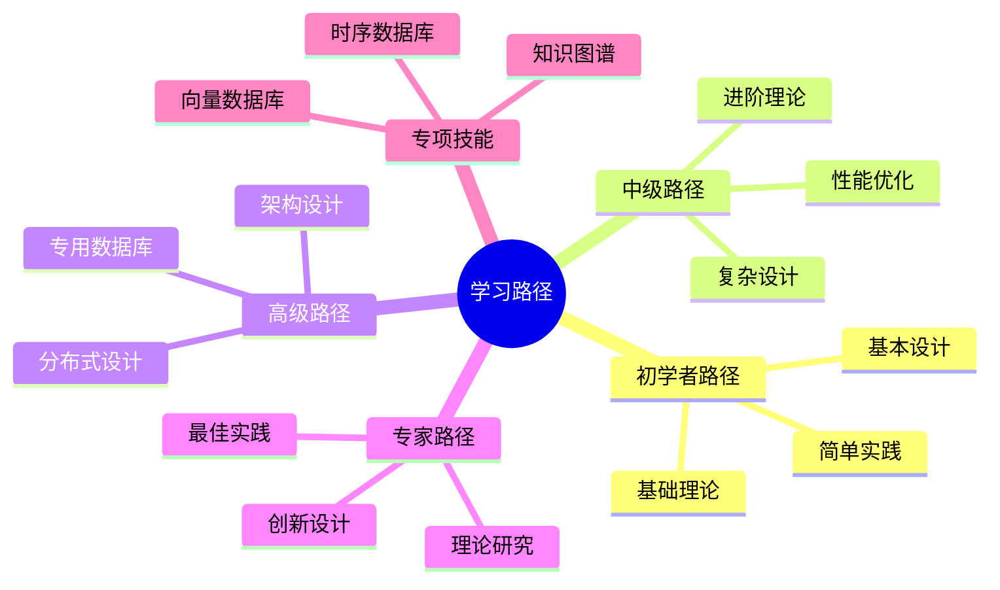
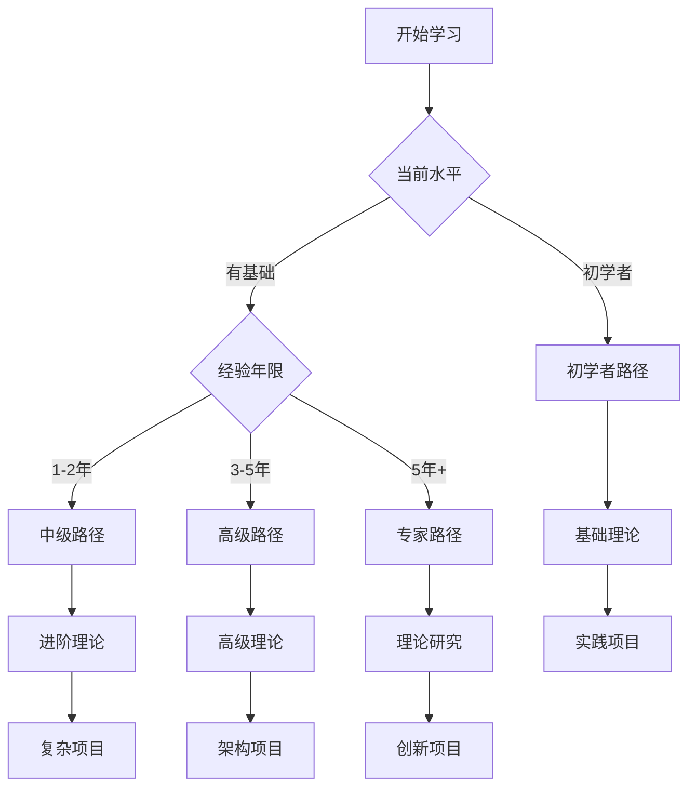
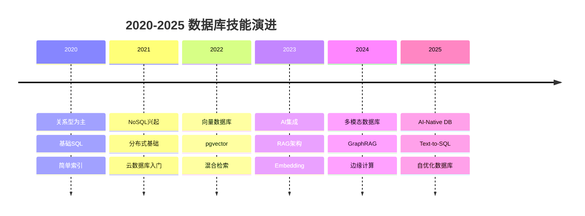
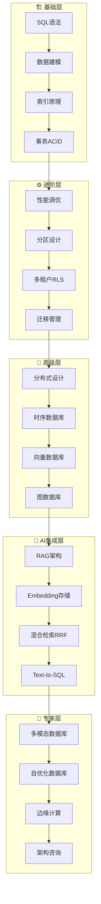
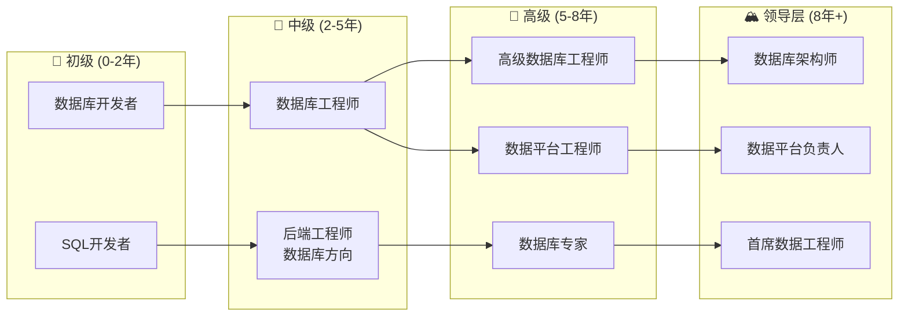

# 数据库设计模式学习路径与进阶指南：系统化学习路线

> **创建日期**：2025-01-15
> **最后更新**：2025-12-01
> **版本**：v2.0
> **状态**：已完成 ✅

---

## 📋 目录

- [数据库设计模式学习路径与进阶指南：系统化学习路线](#数据库设计模式学习路径与进阶指南系统化学习路线)
  - [📋 目录](#-目录)
  - [1. 概述](#1-概述)
    - [1.1. 学习路径分类](#11-学习路径分类)
  - [2. 学习路径概览](#2-学习路径概览)
    - [2.1. 学习路径矩阵](#21-学习路径矩阵)
    - [2.2. 学习路径决策树](#22-学习路径决策树)
  - [3. 初学者路径（0-3个月）](#3-初学者路径0-3个月)
    - [3.1. 学习目标](#31-学习目标)
    - [3.2. 学习内容](#32-学习内容)
    - [3.3. 学习检查点](#33-学习检查点)
  - [4. 中级路径（3-6个月）](#4-中级路径3-6个月)
    - [4.1. 学习目标](#41-学习目标)
    - [4.2. 学习内容](#42-学习内容)
    - [4.3. 学习检查点](#43-学习检查点)
  - [5. 高级路径（6-12个月）](#5-高级路径6-12个月)
    - [5.1. 学习目标](#51-学习目标)
    - [5.2. 学习内容](#52-学习内容)
    - [5.3. 学习检查点](#53-学习检查点)
  - [6. 专家路径（12个月+）](#6-专家路径12个月)
    - [6.1. 学习目标](#61-学习目标)
    - [6.2. 学习内容](#62-学习内容)
    - [6.3. 学习检查点](#63-学习检查点)
  - [7. 专项技能路径](#7-专项技能路径)
    - [7.1. 向量数据库专项](#71-向量数据库专项)
    - [7.2. 知识图谱专项](#72-知识图谱专项)
    - [7.3. 时序数据库专项](#73-时序数据库专项)
  - [8. 实战项目推荐](#8-实战项目推荐)
    - [8.1. 初学者项目](#81-初学者项目)
    - [8.2. 中级项目](#82-中级项目)
    - [8.3. 高级项目](#83-高级项目)
  - [9. 学习资源推荐](#9-学习资源推荐)
    - [9.1. 文档资源](#91-文档资源)
    - [9.2. 学习工具](#92-学习工具)
    - [9.3. 社区资源](#93-社区资源)
  - [10. 2025数据库技能路线图](#10-2025数据库技能路线图)
    - [10.1. 技术趋势演进](#101-技术趋势演进)
    - [10.2. 2025必备技能矩阵](#102-2025必备技能矩阵)
    - [10.3. AI时代数据库工程师技能树](#103-ai时代数据库工程师技能树)
  - [11. 认证路径与职业发展](#11-认证路径与职业发展)
    - [11.1. 数据库认证体系](#111-数据库认证体系)
    - [11.2. 职业发展路径](#112-职业发展路径)
    - [11.3. 2025薪资参考（中国/美国）](#113-2025薪资参考中国美国)
  - [12. AI辅助学习资源](#12-ai辅助学习资源)
    - [12.1. 推荐学习平台（2025）](#121-推荐学习平台2025)
    - [12.2. AI辅助学习工具](#122-ai辅助学习工具)
  - [学生问题](#学生问题)
- [使用示例](#使用示例)
    - [12.3. 实践资源清单](#123-实践资源清单)
  - [13. 参考资料](#13-参考资料)
    - [13.1. 官方文档](#131-官方文档)
    - [13.2. 学习资源](#132-学习资源)
    - [13.3. 相关文档](#133-相关文档)

---

## 1. 概述

本文档提供数据库设计模式的系统化学习路径，帮助不同水平的开发者找到合适的学习路线。

### 1.1. 学习路径分类



---

## 2. 学习路径概览

### 2.1. 学习路径矩阵

**学习路径对比**：

| 路径 | 时间 | 目标 | 核心内容 | 文档链接 |
|------|------|------|---------|---------|
| **初学者路径** | 0-3个月 | 掌握基础设计 | Schema设计、数据建模、基本实践 | [3. 初学者路径](#3-初学者路径0-3个月) |
| **中级路径** | 3-6个月 | 掌握进阶设计 | 性能优化、安全设计、现代模式 | [4. 中级路径](#4-中级路径3-6个月) |
| **高级路径** | 6-12个月 | 掌握高级设计 | 分布式、专用数据库、架构设计 | [5. 高级路径](#5-高级路径6-12个月) |
| **专家路径** | 12个月+ | 成为设计专家 | 理论研究、创新设计、最佳实践 | [6. 专家路径](#6-专家路径12个月) |

### 2.2. 学习路径决策树



---

## 3. 初学者路径（0-3个月）

### 3.1. 学习目标

- 理解数据库设计基本概念
- 掌握Schema设计方法
- 能够设计简单的数据库结构
- 了解基本的设计规范

### 3.2. 学习内容

**第一阶段：理论基础（1个月）**:

| 周次 | 学习内容 | 文档链接 | 学习目标 |
|------|---------|---------|---------|
| **第1周** | 数据库设计概述、基本概念 | [07.01](./07.01-Schema设计方法论.md) | 理解设计流程 |
| **第2周** | 数据建模基础、ER图设计 | [07.03](./07.03-数据建模指导.md) | 掌握ER图绘制 |
| **第3周** | 关系数据库理论 | [01.02](../01-理论模型/01.02-关系数据库理论.md) | 理解关系模型 |
| **第4周** | 范式化理论 | [07.01](./07.01-Schema设计方法论.md) | 掌握范式化方法 |

**第二阶段：实践应用（1个月）**:

| 周次 | 学习内容 | 文档链接 | 学习目标 |
|------|---------|---------|---------|
| **第5周** | Schema设计实践 | [07.01](./07.01-Schema设计方法论.md) | 完成简单Schema设计 |
| **第6周** | 数据分析与查询 | [07.04](./07.04-数据分析与使用指南.md) | 掌握基本查询 |
| **第7周** | 设计最佳实践 | [07.14](./07.14-数据库设计最佳实践库.md) | 学习最佳实践 |
| **第8周** | 实战项目：博客系统 | [07.28](./07.28-数据库设计模式实战演练.md) | 完成第一个项目 |

**第三阶段：巩固提升（1个月）**:

| 周次 | 学习内容 | 文档链接 | 学习目标 |
|------|---------|---------|---------|
| **第9周** | 设计反模式学习 | [07.06](./07.06-数据库设计反模式与解决方案.md) | 避免常见错误 |
| **第10周** | 设计工具使用 | [07.15](./07.15-数据库设计工具与模板库.md) | 掌握设计工具 |
| **第11周** | 设计评审实践 | [07.26](./07.26-数据库设计评审与质量保证.md) | 学习评审方法 |
| **第12周** | 综合项目：小型电商系统 | [07.28](./07.28-数据库设计模式实战演练.md) | 完成综合项目 |

### 3.3. 学习检查点

**学习检查清单**：

完成初学者路径后，您应该能够：

1. **绘制ER图**：能够使用ER图工具（如draw.io、dbdiagram.io）绘制实体关系图，理解实体、属性、关系等概念
2. **设计简单的表结构**：能够根据业务需求设计简单的表结构，包括主键、外键、约束等
3. **理解范式化理论**：理解1NF、2NF、3NF、BCNF等范式理论，能够识别和解决范式化问题
4. **掌握基本查询设计**：能够编写基本的SELECT查询，包括WHERE、JOIN、GROUP BY、ORDER BY等子句
5. **完成至少2个实战项目**：完成至少2个实战项目，如用户管理系统、图书管理系统等，巩固所学知识

**学习检查示例**：

```sql
-- 检查点1：绘制ER图
-- 能够绘制包含以下实体的ER图：
-- - 用户（User）
-- - 订单（Order）
-- - 商品（Product）
-- - 订单项（OrderItem）

-- 检查点2：设计表结构
CREATE TABLE users (
    user_id BIGSERIAL PRIMARY KEY,
    user_name VARCHAR(100) NOT NULL UNIQUE,
    email VARCHAR(255) NOT NULL UNIQUE,
    created_at TIMESTAMPTZ NOT NULL DEFAULT NOW()
);

CREATE TABLE orders (
    order_id BIGSERIAL PRIMARY KEY,
    user_id BIGINT NOT NULL REFERENCES users(user_id),
    order_date DATE NOT NULL,
    total_amount DECIMAL(10,2) NOT NULL
);

-- 检查点3：理解范式化
-- 能够识别以下表是否符合3NF：
-- - 如果不符合，能够进行范式化分解

-- 检查点4：基本查询设计
SELECT u.user_name, o.order_id, o.total_amount
FROM users u
JOIN orders o ON u.user_id = o.user_id
WHERE o.order_date >= '2024-01-01'
ORDER BY o.total_amount DESC;

-- 检查点5：实战项目
-- 完成用户管理系统项目
-- 完成图书管理系统项目
```

---

## 4. 中级路径（3-6个月）

### 4.1. 学习目标

- 掌握性能优化方法
- 理解安全设计原则
- 学习现代设计模式
- 能够设计中等复杂度的系统

### 4.2. 学习内容

**第一阶段：性能优化（1个月）**:

| 周次 | 学习内容 | 文档链接 | 学习目标 |
|------|---------|---------|---------|
| **第1周** | 索引设计优化 | [07.14](./07.14-数据库设计最佳实践库.md) | 掌握索引设计 |
| **第2周** | 查询性能优化 | [07.08](./07.08-数据库性能调优实战.md) | 优化查询性能 |
| **第3周** | 分区设计 | [07.14](./07.14-数据库设计最佳实践库.md) | 掌握分区策略 |
| **第4周** | 物化视图设计 | [07.14](./07.14-数据库设计最佳实践库.md) | 使用物化视图 |

**第二阶段：安全设计（1个月）**:

| 周次 | 学习内容 | 文档链接 | 学习目标 |
|------|---------|---------|---------|
| **第5周** | 数据库安全基础 | [07.23](./07.23-数据库安全设计模式.md) | 理解安全原则 |
| **第6周** | 权限控制设计 | [07.23](./07.23-数据库安全设计模式.md) | 掌握RBAC |
| **第7周** | 数据加密设计 | [07.23](./07.23-数据库安全设计模式.md) | 实现数据加密 |
| **第8周** | 审计日志设计 | [07.23](./07.23-数据库安全设计模式.md) | 设计审计系统 |

**第三阶段：现代模式（1个月）**:

| 周次 | 学习内容 | 文档链接 | 学习目标 |
|------|---------|---------|---------|
| **第9周** | 现代设计模式 | [07.05](./07.05-现代数据库设计模式.md) | 学习微服务模式 |
| **第10周** | 多租户设计 | [07.20](./07.20-多租户数据库设计模式.md) | 掌握多租户模式 |
| **第11周** | 文档数据库设计 | [07.19](./07.19-文档数据库设计模式.md) | 学习文档模型 |
| **第12周** | 综合项目：SaaS平台 | [07.28](./07.28-数据库设计模式实战演练.md) | 完成SaaS项目 |

### 4.3. 学习检查点

**学习检查清单**：

完成中级路径后，您应该能够：

1. **优化查询性能**：能够使用`EXPLAIN ANALYZE`分析查询计划，识别性能瓶颈，优化慢查询
2. **掌握索引设计方法**：能够根据查询模式设计合适的索引，包括单列索引、复合索引、部分索引等
3. **理解安全设计原则**：理解数据库安全设计原则，包括访问控制、数据加密、审计日志等
4. **设计多租户系统**：能够设计多租户系统，包括RLS策略、租户隔离、资源管理等
5. **完成至少3个中级项目**：完成至少3个中级项目，如SaaS平台、电商系统、内容管理系统等

**学习检查示例**：

```sql
-- 检查点1：优化查询性能
EXPLAIN ANALYZE
SELECT u.user_name, COUNT(o.order_id) AS order_count
FROM users u
LEFT JOIN orders o ON u.user_id = o.user_id
WHERE u.created_at >= '2024-01-01'
GROUP BY u.user_id, u.user_name
HAVING COUNT(o.order_id) > 10;

-- 检查点2：索引设计
CREATE INDEX idx_orders_user_date ON orders(user_id, order_date);
CREATE INDEX idx_orders_status ON orders(status) WHERE status = 'pending';

-- 检查点3：安全设计
ALTER TABLE users ENABLE ROW LEVEL SECURITY;
CREATE POLICY user_access_policy ON users
    FOR ALL
    TO authenticated_users
    USING (user_id = current_user_id());

-- 检查点4：多租户设计
CREATE TABLE tenants (
    tenant_id BIGSERIAL PRIMARY KEY,
    tenant_name VARCHAR(100) NOT NULL,
    created_at TIMESTAMPTZ NOT NULL DEFAULT NOW()
);

ALTER TABLE orders ENABLE ROW LEVEL SECURITY;
CREATE POLICY tenant_isolation_policy ON orders
    FOR ALL
    TO authenticated_users
    USING (tenant_id = current_setting('app.current_tenant_id')::BIGINT);

-- 检查点5：实战项目
-- 完成SaaS项目管理平台
-- 完成电商系统
-- 完成内容管理系统
```

---

## 5. 高级路径（6-12个月）

### 5.1. 学习目标

- 掌握分布式数据库设计
- 理解专用数据库设计
- 能够设计大规模系统
- 掌握架构设计方法

### 5.2. 学习内容

**第一阶段：分布式设计（2个月）**:

| 周次 | 学习内容 | 文档链接 | 学习目标 |
|------|---------|---------|---------|
| **第1-2周** | 分布式数据库基础 | [07.17](./07.17-分布式数据库设计模式.md) | 理解分布式概念 |
| **第3-4周** | 分布式事务设计 | [07.17](./07.17-分布式数据库设计模式.md) | 掌握Saga、2PC |
| **第5-6周** | 数据一致性设计 | [07.17](./07.17-分布式数据库设计模式.md) | 理解一致性模型 |
| **第7-8周** | 数据同步设计 | [07.17](./07.17-分布式数据库设计模式.md) | 设计同步机制 |

**第二阶段：专用数据库（2个月）**:

| 周次 | 学习内容 | 文档链接 | 学习目标 |
|------|---------|---------|---------|
| **第9-10周** | 向量数据库设计 | [07.10](./07.10-向量数据库设计.md) | 掌握向量检索 |
| **第11-12周** | 知识图谱设计 | [07.12](./07.12-知识图谱数据库设计实战.md) | 设计知识图谱 |
| **第13-14周** | 时序数据库设计 | [07.18](./07.18-时序数据库设计模式.md) | 掌握时序设计 |
| **第15-16周** | 列式数据库设计 | [07.21](./07.21-列式数据库设计模式.md) | 学习列式存储 |

**第三阶段：架构设计（2个月）**:

| 周次 | 学习内容 | 文档链接 | 学习目标 |
|------|---------|---------|---------|
| **第17-18周** | 系统架构设计 | [07.16](./07.16-数据库设计案例深度解析.md) | 设计复杂系统 |
| **第19-20周** | 性能架构设计 | [07.08](./07.08-数据库性能调优实战.md) | 优化系统性能 |
| **第21-22周** | 高可用架构设计 | [07.24](./07.24-数据库备份与恢复设计模式.md) | 设计高可用系统 |
| **第23-24周** | 综合项目：大型电商平台 | [07.28](./07.28-数据库设计模式实战演练.md) | 完成大型项目 |

### 5.3. 学习检查点

**学习检查清单**：

完成高级路径后，您应该能够：

1. **设计分布式系统**：能够设计分布式数据库系统，包括数据分片、分布式事务、数据一致性等
2. **掌握多种专用数据库**：掌握向量数据库、知识图谱数据库、时序数据库、列式数据库等专用数据库的设计方法
3. **理解架构设计方法**：理解系统架构设计方法，包括微服务架构、事件驱动架构、CQRS模式等
4. **设计大规模系统**：能够设计大规模系统，包括高并发、高可用、可扩展性等设计
5. **完成至少2个大型项目**：完成至少2个大型项目，如大型电商平台、社交网络平台、IoT数据平台等

**学习检查示例**：

```sql
-- 检查点1：分布式系统设计
-- 能够设计数据分片策略
CREATE TABLE orders_0 (
    CHECK (user_id % 4 = 0)
) INHERITS (orders);

CREATE TABLE orders_1 (
    CHECK (user_id % 4 = 1)
) INHERITS (orders);

-- 检查点2：专用数据库设计
-- 向量数据库设计
CREATE TABLE products (
    product_id BIGSERIAL PRIMARY KEY,
    product_name VARCHAR(255) NOT NULL,
    embedding vector(1536)
);
CREATE INDEX idx_products_embedding_hnsw ON products USING hnsw(embedding vector_cosine_ops);

-- 时序数据库设计
CREATE TABLE sensor_data (
    time TIMESTAMPTZ NOT NULL,
    sensor_id INTEGER NOT NULL,
    value DOUBLE PRECISION NOT NULL
);
SELECT create_hypertable('sensor_data', 'time');

-- 检查点3：架构设计
-- 微服务架构：Database per Service
-- 事件驱动架构：事件表设计
CREATE TABLE events (
    event_id BIGSERIAL PRIMARY KEY,
    event_type VARCHAR(50) NOT NULL,
    aggregate_id BIGINT NOT NULL,
    event_data JSONB NOT NULL,
    created_at TIMESTAMPTZ NOT NULL DEFAULT NOW()
);

-- 检查点4：大规模系统设计
-- 高并发设计：连接池、读写分离
-- 高可用设计：主从复制、故障切换
-- 可扩展性设计：水平扩展、垂直扩展

-- 检查点5：实战项目
-- 完成大型电商平台
-- 完成社交网络平台
```

---

## 6. 专家路径（12个月+）

### 6.1. 学习目标

- 深入理论研究
- 创新设计方法
- 总结最佳实践
- 指导团队设计

### 6.2. 学习内容

**第一阶段：理论研究（3个月）**:

| 月份 | 学习内容 | 文档链接 | 学习目标 |
|------|---------|---------|---------|
| **第1月** | 范畴论基础 | [01.01](../01-理论模型/01.01-范畴论基础.md) | 理解范畴论 |
| **第2月** | 形式化方法 | [01.05](../01-理论模型/01.05-形式化方法.md) | 掌握形式化 |
| **第3月** | 知识图谱理论 | [01.04](../01-理论模型/01.04-知识图谱理论.md) | 深入图理论 |

**第二阶段：创新设计（3个月）**:

| 月份 | 学习内容 | 文档链接 | 学习目标 |
|------|---------|---------|---------|
| **第4月** | AI Graph理论 | [01.07](../01-理论模型/01.07-AI Graph理论.md) | 学习AI图理论 |
| **第5月** | 知识推理理论 | [01.06](../01-理论模型/01.06-知识推理与归纳理论.md) | 掌握推理方法 |
| **第6月** | 向量与知识图谱融合 | [07.13](./07.13-向量与知识图谱融合设计.md) | 创新融合设计 |

**第三阶段：最佳实践（3个月）**:

| 月份 | 学习内容 | 文档链接 | 学习目标 |
|------|---------|---------|---------|
| **第7月** | 最佳实践总结 | [07.29](./07.29-数据库设计模式最佳实践总结.md) | 总结最佳实践 |
| **第8月** | 设计模式总结 | [07.27](./07.27-数据库设计模式总结与索引.md) | 整理设计模式 |
| **第9月** | 案例深度解析 | [07.16](./07.16-数据库设计案例深度解析.md) | 分析复杂案例 |

**第四阶段：指导实践（3个月）**:

| 月份 | 学习内容 | 文档链接 | 学习目标 |
|------|---------|---------|---------|
| **第10月** | 设计评审方法 | [07.26](./07.26-数据库设计评审与质量保证.md) | 指导设计评审 |
| **第11月** | 团队协作设计 | [07.15](./07.15-数据库设计工具与模板库.md) | 指导团队设计 |
| **第12月** | 创新项目设计 | 综合应用 | 完成创新项目 |

### 6.3. 学习检查点

**学习检查清单**：

完成专家路径后，您应该能够：

1. **深入理解理论基础**：深入理解范畴论、形式化方法、知识图谱理论等理论基础，能够从理论角度分析和设计数据库
2. **创新设计方法**：能够创新设计方法，结合AI、图神经网络等新技术，提出新的数据库设计模式
3. **总结最佳实践**：能够总结最佳实践，形成设计规范和指导原则，指导团队设计
4. **指导团队设计**：能够指导团队进行数据库设计，包括设计评审、问题诊断、性能优化等
5. **完成创新项目**：完成创新项目，如AI驱动的数据库优化系统、知识图谱+向量融合系统等

**学习检查示例**：

```sql
-- 检查点1：理论基础
-- 能够使用范畴论分析数据库模式
-- 能够使用形式化方法验证数据库设计
-- 能够使用知识图谱理论设计图数据库

-- 检查点2：创新设计方法
-- 向量+知识图谱融合设计
CREATE TABLE entities (
    entity_id BIGSERIAL PRIMARY KEY,
    entity_name VARCHAR(255) NOT NULL,
    entity_type VARCHAR(50) NOT NULL,
    embedding vector(1536),
    properties JSONB
);

CREATE TABLE relations (
    relation_id BIGSERIAL PRIMARY KEY,
    source_entity_id BIGINT NOT NULL REFERENCES entities(entity_id),
    target_entity_id BIGINT NOT NULL REFERENCES entities(entity_id),
    relation_type VARCHAR(50) NOT NULL,
    properties JSONB
);

-- 检查点3：最佳实践总结
-- 能够总结设计规范
-- 能够形成设计指导原则
-- 能够编写设计文档模板

-- 检查点4：指导团队设计
-- 能够进行设计评审
-- 能够诊断设计问题
-- 能够优化设计方案

-- 检查点5：创新项目
-- 完成AI驱动的数据库优化系统
-- 完成知识图谱+向量融合系统
-- 完成多模态数据库系统
```

---

## 7. 专项技能路径

### 7.1. 向量数据库专项

**学习路径**：

1. **基础学习**（2周）
   - [向量数据库设计](./07.10-向量数据库设计.md)
   - 理解向量嵌入概念
   - 掌握相似度搜索

2. **进阶学习**（2周）
   - [向量与知识图谱融合设计](./07.13-向量与知识图谱融合设计.md)
   - 学习混合检索
   - 掌握RAG系统设计

3. **实战项目**（2周）
   - 推荐系统设计
   - 智能问答系统

### 7.2. 知识图谱专项

**学习路径**：

1. **基础学习**（2周）
   - [知识图谱理论](../01-理论模型/01.04-知识图谱理论.md)
   - [知识图谱数据库设计实战](./07.12-知识图谱数据库设计实战.md)
   - 理解三元组模型

2. **进阶学习**（2周）
   - [知识推理与归纳理论](../01-理论模型/01.06-知识推理与归纳理论.md)
   - [AI Graph理论](../01-理论模型/01.07-AI Graph理论.md)
   - 掌握推理方法

3. **实战项目**（2周）
   - 企业知识库设计
   - 智能推荐系统

### 7.3. 时序数据库专项

**学习路径**：

1. **基础学习**（2周）
   - [时序数据库设计模式](./07.18-时序数据库设计模式.md)
   - 理解时序数据特性
   - 掌握超表设计

2. **进阶学习**（2周）
   - 连续聚合设计
   - 数据压缩和归档
   - 告警系统设计

3. **实战项目**（2周）
   - IoT监控平台
   - 金融数据分析系统

---

## 8. 实战项目推荐

### 8.1. 初学者项目

**项目1：博客系统**:

- **难度**：⭐
- **时间**：1-2周
- **技能**：基础Schema设计、简单查询
- **文档**：[07.28](./07.28-数据库设计模式实战演练.md)

**项目2：图书管理系统**:

- **难度**：⭐⭐
- **时间**：2-3周
- **技能**：ER图设计、范式化、基本优化
- **文档**：[07.03](./07.03-数据建模指导.md)

### 8.2. 中级项目

**项目3：SaaS多租户系统**:

- **难度**：⭐⭐⭐
- **时间**：3-4周
- **技能**：多租户设计、RLS、性能优化
- **文档**：[07.20](./07.20-多租户数据库设计模式.md), [07.28](./07.28-数据库设计模式实战演练.md)

**项目4：推荐系统**:

- **难度**：⭐⭐⭐
- **时间**：3-4周
- **技能**：向量数据库、相似度搜索
- **文档**：[07.10](./07.10-向量数据库设计.md), [07.28](./07.28-数据库设计模式实战演练.md)

### 8.3. 高级项目

**项目5：大型电商平台**:

- **难度**：⭐⭐⭐⭐
- **时间**：6-8周
- **技能**：分布式设计、性能优化、高可用
- **文档**：[07.17](./07.17-分布式数据库设计模式.md), [07.28](./07.28-数据库设计模式实战演练.md)

**项目6：IoT监控平台**:

- **难度**：⭐⭐⭐⭐
- **时间**：6-8周
- **技能**：时序数据库、实时告警、数据分析
- **文档**：[07.18](./07.18-时序数据库设计模式.md), [07.28](./07.28-数据库设计模式实战演练.md)

---

## 9. 学习资源推荐

### 9.1. 文档资源

**核心文档**：

- [数据库设计实践目录](./README.md) - 完整文档索引
- [数据库设计模式总结与索引](./07.27-数据库设计模式总结与索引.md) - 快速查找指南
- [数据库设计模式最佳实践总结](./07.29-数据库设计模式最佳实践总结.md) - 最佳实践总结

### 9.2. 学习工具

**推荐工具**：

- **设计工具**：pgAdmin、DBeaver、dbdiagram.io
- **建模工具**：draw.io、Lucidchart、ERDPlus
- **学习平台**：PostgreSQL官方文档、数据库设计教程

### 9.3. 社区资源

**推荐社区**：

- PostgreSQL中文社区
- Stack Overflow数据库设计标签
- GitHub数据库设计项目

---

## 10. 2025数据库技能路线图

### 10.1. 技术趋势演进



### 10.2. 2025必备技能矩阵

| 技能领域 | 初级工程师 | 中级工程师 | 高级工程师 | 架构师 |
|---------|-----------|-----------|-----------|--------|
| **SQL核心** | ⭐⭐⭐⭐⭐ | ⭐⭐⭐⭐⭐ | ⭐⭐⭐⭐⭐ | ⭐⭐⭐⭐⭐ |
| **索引优化** | ⭐⭐⭐ | ⭐⭐⭐⭐ | ⭐⭐⭐⭐⭐ | ⭐⭐⭐⭐⭐ |
| **向量数据库** | ⭐⭐ | ⭐⭐⭐⭐ | ⭐⭐⭐⭐⭐ | ⭐⭐⭐⭐⭐ |
| **分布式设计** | ⭐ | ⭐⭐⭐ | ⭐⭐⭐⭐⭐ | ⭐⭐⭐⭐⭐ |
| **时序数据库** | ⭐ | ⭐⭐⭐ | ⭐⭐⭐⭐ | ⭐⭐⭐⭐⭐ |
| **知识图谱** | - | ⭐⭐ | ⭐⭐⭐⭐ | ⭐⭐⭐⭐⭐ |
| **AI/RAG集成** | - | ⭐⭐⭐ | ⭐⭐⭐⭐⭐ | ⭐⭐⭐⭐⭐ |
| **GitOps迁移** | - | ⭐⭐⭐ | ⭐⭐⭐⭐ | ⭐⭐⭐⭐⭐ |
| **云原生架构** | - | ⭐⭐ | ⭐⭐⭐⭐ | ⭐⭐⭐⭐⭐ |

### 10.3. AI时代数据库工程师技能树



---

## 11. 认证路径与职业发展

### 11.1. 数据库认证体系

| 认证名称 | 发证机构 | 级别 | 费用 | 有效期 | 推荐指数 |
|---------|---------|------|------|-------|---------|
| **PostgreSQL认证** | EDB | 专业级 | $300 | 3年 | ⭐⭐⭐⭐⭐ |
| **AWS数据库专项** | Amazon | 专家级 | $300 | 3年 | ⭐⭐⭐⭐⭐ |
| **GCP数据工程师** | Google | 专业级 | $200 | 2年 | ⭐⭐⭐⭐ |
| **Azure数据工程师** | Microsoft | 专业级 | $165 | 2年 | ⭐⭐⭐⭐ |
| **MongoDB DBA** | MongoDB | 专业级 | $150 | 3年 | ⭐⭐⭐⭐ |
| **Neo4j认证** | Neo4j | 专业级 | $99 | 2年 | ⭐⭐⭐ |
| **ClickHouse认证** | Altinity | 专业级 | 免费 | - | ⭐⭐⭐ |

### 11.2. 职业发展路径



### 11.3. 2025薪资参考（中国/美国）

| 职位 | 中国年薪(万RMB) | 美国年薪($K) | 技能要求 |
|------|-----------------|-------------|---------|
| **初级DBA** | 15-25 | 70-90 | SQL, 基础管理 |
| **数据库工程师** | 25-40 | 90-120 | 性能优化, 迁移 |
| **高级数据库工程师** | 40-60 | 120-160 | 分布式, 架构 |
| **数据库架构师** | 60-100 | 160-220 | 全栈数据库 |
| **AI数据工程师** | 50-80 | 150-200 | 向量DB, RAG |
| **首席数据工程师** | 100+ | 250+ | 技术领导 |

---

## 12. AI辅助学习资源

### 12.1. 推荐学习平台（2025）

| 平台 | 类型 | 特点 | 费用 | 推荐度 |
|------|------|------|------|--------|
| **CMU 15-445** | 课程 | 数据库系统内核 | 免费 | ⭐⭐⭐⭐⭐ |
| **CMU 15-721** | 课程 | 高级数据库系统 | 免费 | ⭐⭐⭐⭐⭐ |
| **Postgres Weekly** | Newsletter | 最新动态 | 免费 | ⭐⭐⭐⭐⭐ |
| **Database Internals** | 书籍 | 深入原理 | $50 | ⭐⭐⭐⭐⭐ |
| **DDIA** | 书籍 | 分布式数据系统 | $50 | ⭐⭐⭐⭐⭐ |
| **pgvector Course** | 课程 | 向量数据库 | 免费 | ⭐⭐⭐⭐ |
| **Supabase Tutorials** | 教程 | 全栈PostgreSQL | 免费 | ⭐⭐⭐⭐ |

### 12.2. AI辅助学习工具

**Text-to-SQL学习**：

```python
# 使用AI辅助学习SQL
from openai import OpenAI

client = OpenAI()

def learn_sql_with_ai(question: str, schema: str) -> str:
    """AI辅助SQL学习"""
    prompt = f"""
你是一位数据库教师。学生提出了以下问题：

## 数据库Schema
```sql
{schema}
```

## 学生问题

{question}

请提供：

1. SQL查询答案
2. 逐步解释
3. 相关知识点
4. 练习建议
"""

    response = client.chat.completions.create(
        model="gpt-4o",
        messages=[{"role": "user", "content": prompt}]
    )

    return response.choices[0].message.content


# 使用示例

schema = """
CREATE TABLE users (id SERIAL PRIMARY KEY, name VARCHAR(100), email VARCHAR(100));
CREATE TABLE orders (id SERIAL PRIMARY KEY, user_id INT REFERENCES users(id), amount DECIMAL);
"""

question = "如何查询每个用户的订单总金额，并按金额降序排列？"

print(learn_sql_with_ai(question, schema))

```
```

### 12.3. 实践资源清单

**在线练习平台**：

- [LeetCode Database](https://leetcode.com/problemset/database/) - SQL题库
- [HackerRank SQL](https://www.hackerrank.com/domains/sql) - 分级练习
- [SQLZoo](https://sqlzoo.net/) - 交互式学习
- [PostgreSQL Exercises](https://pgexercises.com/) - PG专项

**开源项目实践**：

```bash
# 推荐fork学习的开源项目
git clone https://github.com/supabase/supabase     # 全栈PostgreSQL
git clone https://github.com/neondatabase/neon    # Serverless PostgreSQL
git clone https://github.com/timescale/timescaledb # 时序数据库
git clone https://github.com/pgvector/pgvector    # 向量扩展
```

---

## 13. 参考资料

### 13.1. 官方文档

- [PostgreSQL官方文档](https://www.postgresql.org/docs/)
- [pgvector文档](https://github.com/pgvector/pgvector)
- [TimescaleDB文档](https://docs.timescale.com/)

### 13.2. 学习资源

- [CMU 15-445 数据库系统](https://15445.courses.cs.cmu.edu/)
- [CMU 15-721 高级数据库](https://15721.courses.cs.cmu.edu/)
- [Designing Data-Intensive Applications](https://dataintensive.net/)

### 13.3. 相关文档

- [数据库设计实践目录](./README.md)
- [数据库设计模式总结与索引](./07.27-数据库设计模式总结与索引.md)
- [数据库设计模式最佳实践总结](./07.29-数据库设计模式最佳实践总结.md)
- [数据库设计模式实战演练](./07.28-数据库设计模式实战演练.md)

---

**最后更新**：2025-12-01
**维护者**：Data-Science Team
**状态**：已完成 ✅
