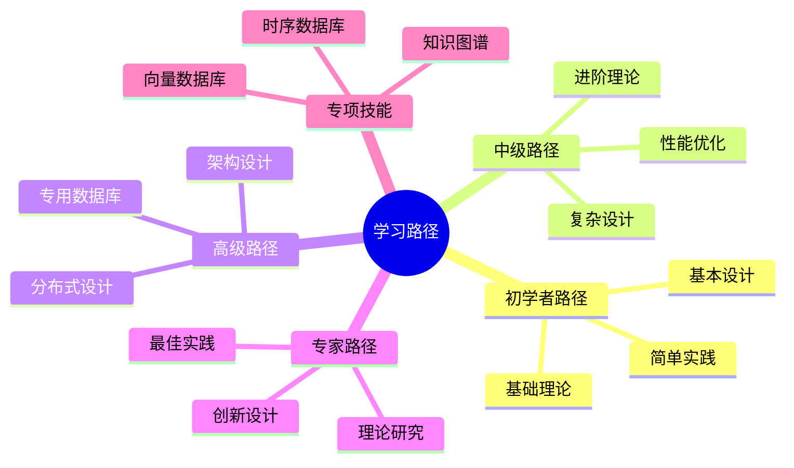
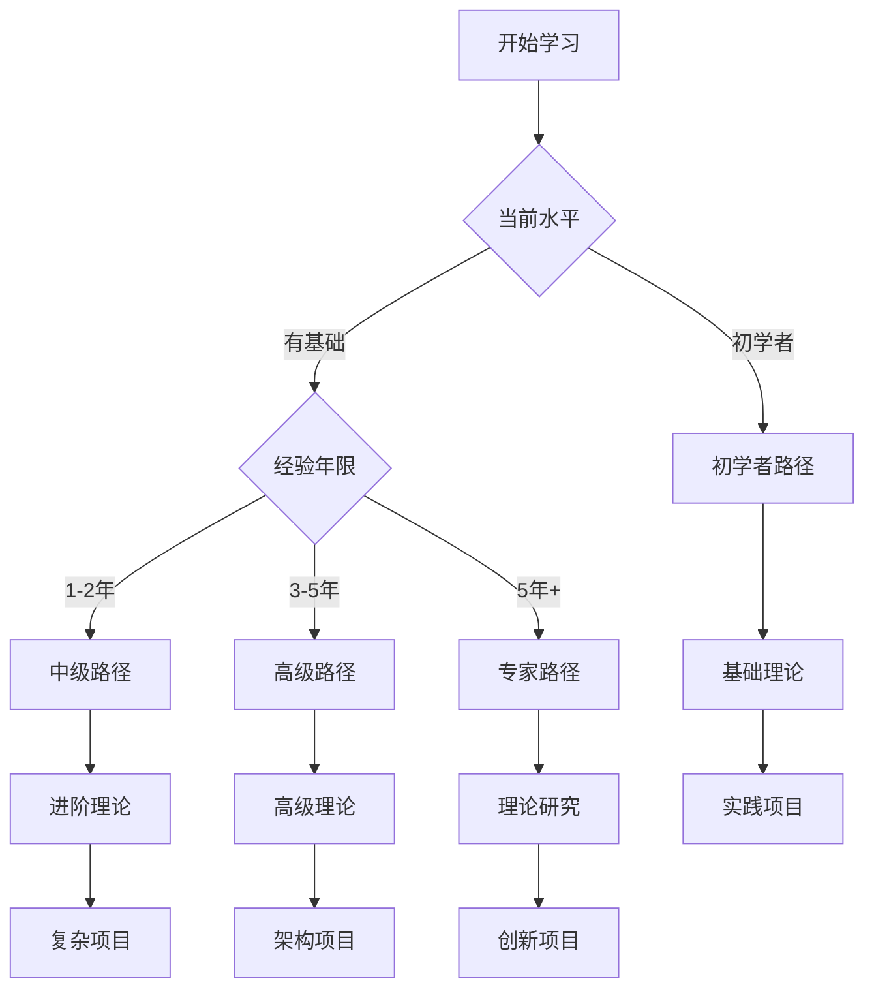

# 数据库设计模式学习路径与进阶指南：系统化学习路线

> **创建日期**：2025-01-15
> **最后更新**：2025-01-15
> **版本**：v1.0
> **状态**：实施中

---

## 📋 目录

- [数据库设计模式学习路径与进阶指南：系统化学习路线](#数据库设计模式学习路径与进阶指南系统化学习路线)
  - [📋 目录](#-目录)
  - [1. 概述](#1-概述)
    - [1.1. 学习路径分类](#11-学习路径分类)
  - [2. 学习路径概览](#2-学习路径概览)
    - [2.1. 学习路径矩阵](#21-学习路径矩阵)
    - [2.2. 学习路径决策树](#22-学习路径决策树)
  - [3. 初学者路径（0-3个月）](#3-初学者路径0-3个月)
    - [3.1. 学习目标](#31-学习目标)
    - [3.2. 学习内容](#32-学习内容)
    - [3.3. 学习检查点](#33-学习检查点)
  - [4. 中级路径（3-6个月）](#4-中级路径3-6个月)
    - [4.1. 学习目标](#41-学习目标)
    - [4.2. 学习内容](#42-学习内容)
    - [4.3. 学习检查点](#43-学习检查点)
  - [5. 高级路径（6-12个月）](#5-高级路径6-12个月)
    - [5.1. 学习目标](#51-学习目标)
    - [5.2. 学习内容](#52-学习内容)
    - [5.3. 学习检查点](#53-学习检查点)
  - [6. 专家路径（12个月+）](#6-专家路径12个月)
    - [6.1. 学习目标](#61-学习目标)
    - [6.2. 学习内容](#62-学习内容)
    - [6.3. 学习检查点](#63-学习检查点)
  - [7. 专项技能路径](#7-专项技能路径)
    - [7.1. 向量数据库专项](#71-向量数据库专项)
    - [7.2. 知识图谱专项](#72-知识图谱专项)
    - [7.3. 时序数据库专项](#73-时序数据库专项)
  - [8. 实战项目推荐](#8-实战项目推荐)
    - [8.1. 初学者项目](#81-初学者项目)
    - [8.2. 中级项目](#82-中级项目)
    - [8.3. 高级项目](#83-高级项目)
  - [9. 学习资源推荐](#9-学习资源推荐)
    - [9.1. 文档资源](#91-文档资源)
    - [9.2. 学习工具](#92-学习工具)
    - [9.3. 社区资源](#93-社区资源)
  - [10. 参考资料](#10-参考资料)

---

## 1. 概述

本文档提供数据库设计模式的系统化学习路径，帮助不同水平的开发者找到合适的学习路线。

### 1.1. 学习路径分类

---

## 2. 学习路径概览

### 2.1. 学习路径矩阵

**学习路径对比**：

| 路径 | 时间 | 目标 | 核心内容 | 文档链接 |
|------|------|------|---------|---------|
| **初学者路径** | 0-3个月 | 掌握基础设计 | Schema设计、数据建模、基本实践 | [3. 初学者路径](#3-初学者路径0-3个月) |
| **中级路径** | 3-6个月 | 掌握进阶设计 | 性能优化、安全设计、现代模式 | [4. 中级路径](#4-中级路径3-6个月) |
| **高级路径** | 6-12个月 | 掌握高级设计 | 分布式、专用数据库、架构设计 | [5. 高级路径](#5-高级路径6-12个月) |
| **专家路径** | 12个月+ | 成为设计专家 | 理论研究、创新设计、最佳实践 | [6. 专家路径](#6-专家路径12个月) |

### 2.2. 学习路径决策树

---

## 3. 初学者路径（0-3个月）

### 3.1. 学习目标

- 理解数据库设计基本概念
- 掌握Schema设计方法
- 能够设计简单的数据库结构
- 了解基本的设计规范

### 3.2. 学习内容

**第一阶段：理论基础（1个月）**:

| 周次 | 学习内容 | 文档链接 | 学习目标 |
|------|---------|---------|---------|
| **第1周** | 数据库设计概述、基本概念 | [07.01](./07.01-Schema设计方法论.md) | 理解设计流程 |
| **第2周** | 数据建模基础、ER图设计 | [07.03](./07.03-数据建模指导.md) | 掌握ER图绘制 |
| **第3周** | 关系数据库理论 | [01.02](../01-理论模型/01.02-关系数据库理论.md) | 理解关系模型 |
| **第4周** | 范式化理论 | [07.01](./07.01-Schema设计方法论.md) | 掌握范式化方法 |

**第二阶段：实践应用（1个月）**:

| 周次 | 学习内容 | 文档链接 | 学习目标 |
|------|---------|---------|---------|
| **第5周** | Schema设计实践 | [07.01](./07.01-Schema设计方法论.md) | 完成简单Schema设计 |
| **第6周** | 数据分析与查询 | [07.04](./07.04-数据分析与使用指南.md) | 掌握基本查询 |
| **第7周** | 设计最佳实践 | [07.14](./07.14-数据库设计最佳实践库.md) | 学习最佳实践 |
| **第8周** | 实战项目：博客系统 | [07.28](./07.28-数据库设计模式实战演练.md) | 完成第一个项目 |

**第三阶段：巩固提升（1个月）**:

| 周次 | 学习内容 | 文档链接 | 学习目标 |
|------|---------|---------|---------|
| **第9周** | 设计反模式学习 | [07.06](./07.06-数据库设计反模式与解决方案.md) | 避免常见错误 |
| **第10周** | 设计工具使用 | [07.15](./07.15-数据库设计工具与模板库.md) | 掌握设计工具 |
| **第11周** | 设计评审实践 | [07.26](./07.26-数据库设计评审与质量保证.md) | 学习评审方法 |
| **第12周** | 综合项目：小型电商系统 | [07.28](./07.28-数据库设计模式实战演练.md) | 完成综合项目 |

### 3.3. 学习检查点

**学习检查清单**：

- [ ] 能够绘制ER图
- [ ] 能够设计简单的表结构
- [ ] 理解范式化理论
- [ ] 掌握基本查询设计
- [ ] 完成至少2个实战项目

---

## 4. 中级路径（3-6个月）

### 4.1. 学习目标

- 掌握性能优化方法
- 理解安全设计原则
- 学习现代设计模式
- 能够设计中等复杂度的系统

### 4.2. 学习内容

**第一阶段：性能优化（1个月）**:

| 周次 | 学习内容 | 文档链接 | 学习目标 |
|------|---------|---------|---------|
| **第1周** | 索引设计优化 | [07.14](./07.14-数据库设计最佳实践库.md) | 掌握索引设计 |
| **第2周** | 查询性能优化 | [07.08](./07.08-数据库性能调优实战.md) | 优化查询性能 |
| **第3周** | 分区设计 | [07.14](./07.14-数据库设计最佳实践库.md) | 掌握分区策略 |
| **第4周** | 物化视图设计 | [07.14](./07.14-数据库设计最佳实践库.md) | 使用物化视图 |

**第二阶段：安全设计（1个月）**:

| 周次 | 学习内容 | 文档链接 | 学习目标 |
|------|---------|---------|---------|
| **第5周** | 数据库安全基础 | [07.23](./07.23-数据库安全设计模式.md) | 理解安全原则 |
| **第6周** | 权限控制设计 | [07.23](./07.23-数据库安全设计模式.md) | 掌握RBAC |
| **第7周** | 数据加密设计 | [07.23](./07.23-数据库安全设计模式.md) | 实现数据加密 |
| **第8周** | 审计日志设计 | [07.23](./07.23-数据库安全设计模式.md) | 设计审计系统 |

**第三阶段：现代模式（1个月）**:

| 周次 | 学习内容 | 文档链接 | 学习目标 |
|------|---------|---------|---------|
| **第9周** | 现代设计模式 | [07.05](./07.05-现代数据库设计模式.md) | 学习微服务模式 |
| **第10周** | 多租户设计 | [07.20](./07.20-多租户数据库设计模式.md) | 掌握多租户模式 |
| **第11周** | 文档数据库设计 | [07.19](./07.19-文档数据库设计模式.md) | 学习文档模型 |
| **第12周** | 综合项目：SaaS平台 | [07.28](./07.28-数据库设计模式实战演练.md) | 完成SaaS项目 |

### 4.3. 学习检查点

**学习检查清单**：

- [ ] 能够优化查询性能
- [ ] 掌握索引设计方法
- [ ] 理解安全设计原则
- [ ] 能够设计多租户系统
- [ ] 完成至少3个中级项目

---

## 5. 高级路径（6-12个月）

### 5.1. 学习目标

- 掌握分布式数据库设计
- 理解专用数据库设计
- 能够设计大规模系统
- 掌握架构设计方法

### 5.2. 学习内容

**第一阶段：分布式设计（2个月）**:

| 周次 | 学习内容 | 文档链接 | 学习目标 |
|------|---------|---------|---------|
| **第1-2周** | 分布式数据库基础 | [07.17](./07.17-分布式数据库设计模式.md) | 理解分布式概念 |
| **第3-4周** | 分布式事务设计 | [07.17](./07.17-分布式数据库设计模式.md) | 掌握Saga、2PC |
| **第5-6周** | 数据一致性设计 | [07.17](./07.17-分布式数据库设计模式.md) | 理解一致性模型 |
| **第7-8周** | 数据同步设计 | [07.17](./07.17-分布式数据库设计模式.md) | 设计同步机制 |

**第二阶段：专用数据库（2个月）**:

| 周次 | 学习内容 | 文档链接 | 学习目标 |
|------|---------|---------|---------|
| **第9-10周** | 向量数据库设计 | [07.10](./07.10-向量数据库设计.md) | 掌握向量检索 |
| **第11-12周** | 知识图谱设计 | [07.12](./07.12-知识图谱数据库设计实战.md) | 设计知识图谱 |
| **第13-14周** | 时序数据库设计 | [07.18](./07.18-时序数据库设计模式.md) | 掌握时序设计 |
| **第15-16周** | 列式数据库设计 | [07.21](./07.21-列式数据库设计模式.md) | 学习列式存储 |

**第三阶段：架构设计（2个月）**:

| 周次 | 学习内容 | 文档链接 | 学习目标 |
|------|---------|---------|---------|
| **第17-18周** | 系统架构设计 | [07.16](./07.16-数据库设计案例深度解析.md) | 设计复杂系统 |
| **第19-20周** | 性能架构设计 | [07.08](./07.08-数据库性能调优实战.md) | 优化系统性能 |
| **第21-22周** | 高可用架构设计 | [07.24](./07.24-数据库备份与恢复设计模式.md) | 设计高可用系统 |
| **第23-24周** | 综合项目：大型电商平台 | [07.28](./07.28-数据库设计模式实战演练.md) | 完成大型项目 |

### 5.3. 学习检查点

**学习检查清单**：

- [ ] 能够设计分布式系统
- [ ] 掌握多种专用数据库
- [ ] 理解架构设计方法
- [ ] 能够设计大规模系统
- [ ] 完成至少2个大型项目

---

## 6. 专家路径（12个月+）

### 6.1. 学习目标

- 深入理论研究
- 创新设计方法
- 总结最佳实践
- 指导团队设计

### 6.2. 学习内容

**第一阶段：理论研究（3个月）**:

| 月份 | 学习内容 | 文档链接 | 学习目标 |
|------|---------|---------|---------|
| **第1月** | 范畴论基础 | [01.01](../01-理论模型/01.01-范畴论基础.md) | 理解范畴论 |
| **第2月** | 形式化方法 | [01.05](../01-理论模型/01.05-形式化方法.md) | 掌握形式化 |
| **第3月** | 知识图谱理论 | [01.04](../01-理论模型/01.04-知识图谱理论.md) | 深入图理论 |

**第二阶段：创新设计（3个月）**:

| 月份 | 学习内容 | 文档链接 | 学习目标 |
|------|---------|---------|---------|
| **第4月** | AI Graph理论 | [01.07](../01-理论模型/01.07-AI Graph理论.md) | 学习AI图理论 |
| **第5月** | 知识推理理论 | [01.06](../01-理论模型/01.06-知识推理与归纳理论.md) | 掌握推理方法 |
| **第6月** | 向量与知识图谱融合 | [07.13](./07.13-向量与知识图谱融合设计.md) | 创新融合设计 |

**第三阶段：最佳实践（3个月）**:

| 月份 | 学习内容 | 文档链接 | 学习目标 |
|------|---------|---------|---------|
| **第7月** | 最佳实践总结 | [07.29](./07.29-数据库设计模式最佳实践总结.md) | 总结最佳实践 |
| **第8月** | 设计模式总结 | [07.27](./07.27-数据库设计模式总结与索引.md) | 整理设计模式 |
| **第9月** | 案例深度解析 | [07.16](./07.16-数据库设计案例深度解析.md) | 分析复杂案例 |

**第四阶段：指导实践（3个月）**:

| 月份 | 学习内容 | 文档链接 | 学习目标 |
|------|---------|---------|---------|
| **第10月** | 设计评审方法 | [07.26](./07.26-数据库设计评审与质量保证.md) | 指导设计评审 |
| **第11月** | 团队协作设计 | [07.15](./07.15-数据库设计工具与模板库.md) | 指导团队设计 |
| **第12月** | 创新项目设计 | 综合应用 | 完成创新项目 |

### 6.3. 学习检查点

**学习检查清单**：

- [ ] 深入理解理论基础
- [ ] 能够创新设计方法
- [ ] 总结最佳实践
- [ ] 指导团队设计
- [ ] 完成创新项目

---

## 7. 专项技能路径

### 7.1. 向量数据库专项

**学习路径**：

1. **基础学习**（2周）
   - [向量数据库设计](./07.10-向量数据库设计.md)
   - 理解向量嵌入概念
   - 掌握相似度搜索

2. **进阶学习**（2周）
   - [向量与知识图谱融合设计](./07.13-向量与知识图谱融合设计.md)
   - 学习混合检索
   - 掌握RAG系统设计

3. **实战项目**（2周）
   - 推荐系统设计
   - 智能问答系统

### 7.2. 知识图谱专项

**学习路径**：

1. **基础学习**（2周）
   - [知识图谱理论](../01-理论模型/01.04-知识图谱理论.md)
   - [知识图谱数据库设计实战](./07.12-知识图谱数据库设计实战.md)
   - 理解三元组模型

2. **进阶学习**（2周）
   - [知识推理与归纳理论](../01-理论模型/01.06-知识推理与归纳理论.md)
   - [AI Graph理论](../01-理论模型/01.07-AI Graph理论.md)
   - 掌握推理方法

3. **实战项目**（2周）
   - 企业知识库设计
   - 智能推荐系统

### 7.3. 时序数据库专项

**学习路径**：

1. **基础学习**（2周）
   - [时序数据库设计模式](./07.18-时序数据库设计模式.md)
   - 理解时序数据特性
   - 掌握超表设计

2. **进阶学习**（2周）
   - 连续聚合设计
   - 数据压缩和归档
   - 告警系统设计

3. **实战项目**（2周）
   - IoT监控平台
   - 金融数据分析系统

---

## 8. 实战项目推荐

### 8.1. 初学者项目

**项目1：博客系统**:

- **难度**：⭐
- **时间**：1-2周
- **技能**：基础Schema设计、简单查询
- **文档**：[07.28](./07.28-数据库设计模式实战演练.md)

**项目2：图书管理系统**:

- **难度**：⭐⭐
- **时间**：2-3周
- **技能**：ER图设计、范式化、基本优化
- **文档**：[07.03](./07.03-数据建模指导.md)

### 8.2. 中级项目

**项目3：SaaS多租户系统**:

- **难度**：⭐⭐⭐
- **时间**：3-4周
- **技能**：多租户设计、RLS、性能优化
- **文档**：[07.20](./07.20-多租户数据库设计模式.md), [07.28](./07.28-数据库设计模式实战演练.md)

**项目4：推荐系统**:

- **难度**：⭐⭐⭐
- **时间**：3-4周
- **技能**：向量数据库、相似度搜索
- **文档**：[07.10](./07.10-向量数据库设计.md), [07.28](./07.28-数据库设计模式实战演练.md)

### 8.3. 高级项目

**项目5：大型电商平台**:

- **难度**：⭐⭐⭐⭐
- **时间**：6-8周
- **技能**：分布式设计、性能优化、高可用
- **文档**：[07.17](./07.17-分布式数据库设计模式.md), [07.28](./07.28-数据库设计模式实战演练.md)

**项目6：IoT监控平台**:

- **难度**：⭐⭐⭐⭐
- **时间**：6-8周
- **技能**：时序数据库、实时告警、数据分析
- **文档**：[07.18](./07.18-时序数据库设计模式.md), [07.28](./07.28-数据库设计模式实战演练.md)

---

## 9. 学习资源推荐

### 9.1. 文档资源

**核心文档**：

- [数据库设计实践目录](./README.md) - 完整文档索引
- [数据库设计模式总结与索引](./07.27-数据库设计模式总结与索引.md) - 快速查找指南
- [数据库设计模式最佳实践总结](./07.29-数据库设计模式最佳实践总结.md) - 最佳实践总结

### 9.2. 学习工具

**推荐工具**：

- **设计工具**：pgAdmin、DBeaver、dbdiagram.io
- **建模工具**：draw.io、Lucidchart、ERDPlus
- **学习平台**：PostgreSQL官方文档、数据库设计教程

### 9.3. 社区资源

**推荐社区**：

- PostgreSQL中文社区
- Stack Overflow数据库设计标签
- GitHub数据库设计项目

---

## 10. 参考资料

- [数据库设计实践目录](./README.md)
- [数据库设计模式总结与索引](./07.27-数据库设计模式总结与索引.md)
- [数据库设计模式最佳实践总结](./07.29-数据库设计模式最佳实践总结.md)
- [数据库设计模式实战演练](./07.28-数据库设计模式实战演练.md)

---

**最后更新**：2025-01-15
**维护者**：Data-Science Team
**状态**：实施中
