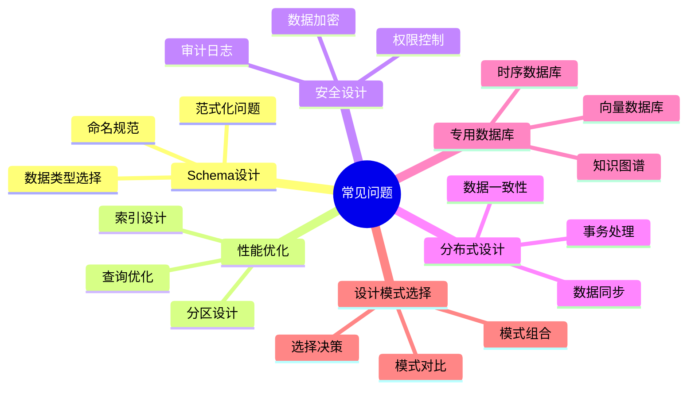
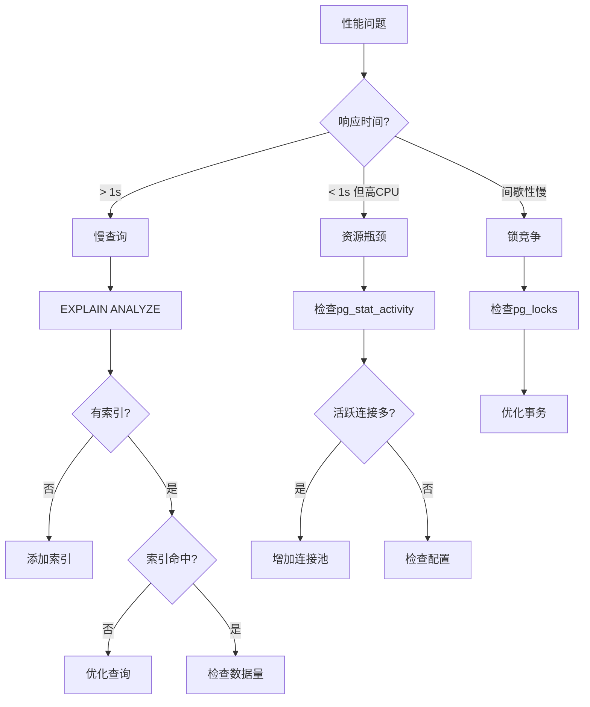

# 数据库设计模式常见问题FAQ：问题解答与最佳实践

> **创建日期**：2025-01-15
> **最后更新**：2025-12-01
> **版本**：v2.0
> **状态**：已完成 ✅

---

## 📋 目录

- [数据库设计模式常见问题FAQ：问题解答与最佳实践](#数据库设计模式常见问题faq问题解答与最佳实践)
  - [📋 目录](#-目录)
  - [1. 概述](#1-概述)
    - [1.1. 问题分类](#11-问题分类)
  - [2. Schema设计常见问题](#2-schema设计常见问题)
    - [2.1. 命名规范问题](#21-命名规范问题)
    - [2.2. 数据类型选择问题](#22-数据类型选择问题)
    - [2.3. 范式化问题](#23-范式化问题)
  - [3. 性能优化常见问题](#3-性能优化常见问题)
    - [3.1. 索引设计问题](#31-索引设计问题)
    - [3.2. 查询优化问题](#32-查询优化问题)
  - [4. 安全设计常见问题](#4-安全设计常见问题)
    - [4.1. 权限控制问题](#41-权限控制问题)
  - [5. 分布式设计常见问题](#5-分布式设计常见问题)
    - [5.1. 事务处理问题](#51-事务处理问题)
  - [6. 专用数据库常见问题](#6-专用数据库常见问题)
    - [6.1. 向量数据库问题](#61-向量数据库问题)
    - [6.2. 知识图谱问题](#62-知识图谱问题)
    - [6.3. 时序数据库问题](#63-时序数据库问题)
  - [7. 设计模式选择常见问题](#7-设计模式选择常见问题)
    - [7.1. 模式对比问题](#71-模式对比问题)
  - [8. 工具使用常见问题](#8-工具使用常见问题)
    - [8.1. 版本管理问题](#81-版本管理问题)
  - [9. 2025热点问题](#9-2025热点问题)
    - [9.1. AI与向量数据库问题](#91-ai与向量数据库问题)
    - [9.2. 云原生与GitOps问题](#92-云原生与gitops问题)
    - [9.3. 性能排错问题](#93-性能排错问题)
  - [10. 排错指南](#10-排错指南)
    - [10.1. 常见错误速查](#101-常见错误速查)
    - [10.2. 性能诊断流程](#102-性能诊断流程)
    - [10.3. 向量检索排错](#103-向量检索排错)
  - [11. 参考资料](#11-参考资料)
    - [11.1. 官方文档](#111-官方文档)
    - [11.2. 相关文档](#112-相关文档)

---

## 1. 概述

本文档收集数据库设计模式中的常见问题，提供详细的解答和最佳实践建议。

### 1.1. 问题分类



---

## 2. Schema设计常见问题

### 2.1. 命名规范问题

**Q1: 表名应该使用单数还是复数？**

**A**: 推荐使用复数形式，因为表存储的是多个实体的集合。

```sql
-- 推荐：复数形式
CREATE TABLE users (...);
CREATE TABLE orders (...);
CREATE TABLE products (...);

-- 不推荐：单数形式
CREATE TABLE user (...);
CREATE TABLE order (...);
```

**Q2: 字段名应该使用下划线还是驼峰命名？**

**A**: 推荐使用小写字母+下划线（snake_case），因为：

- SQL标准兼容性更好
- 避免大小写敏感问题
- 更易读

```sql
-- 推荐：下划线命名
CREATE TABLE users (
    user_id BIGSERIAL PRIMARY KEY,
    created_at TIMESTAMPTZ NOT NULL
);

-- 不推荐：驼峰命名
CREATE TABLE users (
    userId BIGSERIAL PRIMARY KEY,
    createdAt TIMESTAMPTZ NOT NULL
);
```

**Q3: 索引命名规范是什么？**

**A**: 推荐使用 `idx_` 前缀 + 表名 + 字段名。

```sql
-- 推荐
CREATE INDEX idx_users_email ON users(email);
CREATE INDEX idx_orders_user_id ON orders(user_id);

-- 不推荐
CREATE INDEX email_index ON users(email);
CREATE INDEX user_id_idx ON orders(user_id);
```

### 2.2. 数据类型选择问题

**Q4: 什么时候使用VARCHAR，什么时候使用TEXT？**

**A**:

- **VARCHAR(n)**: 当字段有明确的长度上限时使用（如用户名、邮箱）
- **TEXT**: 当字段长度不确定或可能很长时使用（如文章内容、描述）

```sql
-- 推荐：有长度限制使用VARCHAR
CREATE TABLE users (
    username VARCHAR(50) NOT NULL,
    email VARCHAR(100) NOT NULL
);

-- 推荐：长度不确定使用TEXT
CREATE TABLE articles (
    title VARCHAR(200) NOT NULL,
    content TEXT NOT NULL
);
```

**Q5: 时间字段应该使用TIMESTAMP还是TIMESTAMPTZ？**

**A**: 推荐使用 `TIMESTAMPTZ`（带时区），因为：

- 自动处理时区转换
- 避免时区相关bug
- 符合国际化需求

```sql
-- 推荐：使用TIMESTAMPTZ
CREATE TABLE events (
    event_id BIGSERIAL PRIMARY KEY,
    event_time TIMESTAMPTZ NOT NULL DEFAULT CURRENT_TIMESTAMP
);

-- 不推荐：使用TIMESTAMP（不带时区）
CREATE TABLE events (
    event_id BIGSERIAL PRIMARY KEY,
    event_time TIMESTAMP NOT NULL DEFAULT CURRENT_TIMESTAMP
);
```

**Q6: 金额字段应该使用什么数据类型？**

**A**: 推荐使用 `NUMERIC` 或 `DECIMAL`，避免使用 `FLOAT` 或 `DOUBLE`，因为：

- 精确计算，避免浮点数误差
- 适合金融场景

```sql
-- 推荐：使用NUMERIC
CREATE TABLE orders (
    order_id BIGSERIAL PRIMARY KEY,
    total_amount NUMERIC(12, 2) NOT NULL  -- 12位数字，2位小数
);

-- 不推荐：使用FLOAT
CREATE TABLE orders (
    order_id BIGSERIAL PRIMARY KEY,
    total_amount FLOAT NOT NULL  -- 可能有精度问题
);
```

### 2.3. 范式化问题

**Q7: 应该完全范式化还是反范式化？**

**A**: 取决于应用场景：

- **OLTP系统**：推荐范式化（减少冗余、保证一致性）
- **OLAP系统**：可以反范式化（提高查询性能）
- **混合场景**：核心数据范式化，统计数据反范式化

```sql
-- OLTP：范式化设计
CREATE TABLE users (
    user_id BIGSERIAL PRIMARY KEY,
    username VARCHAR(50) NOT NULL
);

CREATE TABLE orders (
    order_id BIGSERIAL PRIMARY KEY,
    user_id BIGINT NOT NULL REFERENCES users(user_id),
    total_amount NUMERIC(12, 2) NOT NULL
);

-- OLAP：反范式化设计（包含用户信息）
CREATE TABLE order_summary (
    order_id BIGSERIAL PRIMARY KEY,
    username VARCHAR(50) NOT NULL,  -- 反范式化
    total_amount NUMERIC(12, 2) NOT NULL
);
```

---

## 3. 性能优化常见问题

### 3.1. 索引设计问题

**Q8: 应该为所有外键创建索引吗？**

**A**: 是的，推荐为所有外键创建索引，因为：

- 提高JOIN性能
- 提高外键约束检查性能
- 提高DELETE CASCADE性能

```sql
-- 推荐：外键字段创建索引
CREATE TABLE orders (
    order_id BIGSERIAL PRIMARY KEY,
    user_id BIGINT NOT NULL REFERENCES users(user_id)
);

CREATE INDEX idx_orders_user_id ON orders(user_id);

-- 不推荐：外键字段没有索引
CREATE TABLE orders (
    order_id BIGSERIAL PRIMARY KEY,
    user_id BIGINT NOT NULL REFERENCES users(user_id)
);
-- 缺少索引
```

**Q9: 复合索引的字段顺序如何选择？**

**A**: 遵循"最左前缀"原则，将选择性高的字段放在前面，或者将WHERE条件中最常用的字段放在前面。

```sql
-- 推荐：选择性高的字段在前
CREATE INDEX idx_orders_user_status_date
ON orders(user_id, status, created_at);
-- 如果查询经常使用 user_id + status，这个顺序合适

-- 如果查询经常使用 status + created_at，应该调整顺序
CREATE INDEX idx_orders_status_date_user
ON orders(status, created_at, user_id);
```

**Q10: 什么时候使用部分索引？**

**A**: 当查询只涉及表中的一部分数据时，使用部分索引可以：

- 减少索引大小
- 提高索引效率
- 减少维护成本

```sql
-- 推荐：只索引活跃用户
CREATE INDEX idx_users_active_email
ON users(email)
WHERE status = 'active';

-- 推荐：只索引未完成的订单
CREATE INDEX idx_orders_pending
ON orders(user_id, created_at)
WHERE status IN ('pending', 'processing');
```

### 3.2. 查询优化问题

**Q11: 如何优化慢查询？**

**A**: 优化步骤：

1. 使用 `EXPLAIN ANALYZE` 分析查询计划
2. 检查是否使用了索引
3. 检查是否有全表扫描
4. 优化JOIN顺序
5. 考虑使用物化视图

```sql
-- 1. 分析查询计划
EXPLAIN ANALYZE
SELECT u.username, o.total_amount
FROM users u
JOIN orders o ON u.user_id = o.user_id
WHERE u.status = 'active'
ORDER BY o.created_at DESC
LIMIT 10;

-- 2. 如果发现全表扫描，添加索引
CREATE INDEX idx_users_status ON users(status);
CREATE INDEX idx_orders_user_created ON orders(user_id, created_at DESC);

-- 3. 如果查询频繁，考虑物化视图
CREATE MATERIALIZED VIEW mv_active_user_orders AS
SELECT u.username, o.total_amount, o.created_at
FROM users u
JOIN orders o ON u.user_id = o.user_id
WHERE u.status = 'active';

CREATE INDEX ON mv_active_user_orders(created_at DESC);
```

**Q12: 如何优化分页查询？**

**A**: 使用游标分页（cursor-based pagination）替代OFFSET分页，特别是大数据量时。

```sql
-- 不推荐：OFFSET分页（大数据量时性能差）
SELECT * FROM orders
ORDER BY created_at DESC
LIMIT 20 OFFSET 10000;  -- 需要跳过10000行

-- 推荐：游标分页
SELECT * FROM orders
WHERE created_at < '2025-01-01'  -- 上次查询的最后时间
ORDER BY created_at DESC
LIMIT 20;
```

---

## 4. 安全设计常见问题

### 4.1. 权限控制问题

**Q13: 如何实现多租户数据隔离？**

**A**: 推荐使用Row Level Security (RLS)实现行级安全。

```sql
-- 启用RLS
ALTER TABLE orders ENABLE ROW LEVEL SECURITY;

-- 创建策略函数
CREATE OR REPLACE FUNCTION get_current_tenant_id()
RETURNS BIGINT AS $$
BEGIN
    RETURN current_setting('app.current_tenant_id', TRUE)::BIGINT;
END;
$$ LANGUAGE plpgsql STABLE;

-- 创建RLS策略
CREATE POLICY tenant_isolation_policy ON orders
    FOR ALL
    USING (tenant_id = get_current_tenant_id())
    WITH CHECK (tenant_id = get_current_tenant_id());
```

**Q14: 敏感数据如何加密存储？**

**A**: 使用PostgreSQL的 `pgcrypto` 扩展进行字段级加密。

```sql
-- 启用pgcrypto扩展
CREATE EXTENSION IF NOT EXISTS pgcrypto;

-- 加密存储密码
CREATE TABLE users (
    user_id BIGSERIAL PRIMARY KEY,
    username VARCHAR(50) NOT NULL,
    password_hash TEXT NOT NULL  -- 使用pgcrypto加密
);

-- 插入加密数据
INSERT INTO users (username, password_hash)
VALUES ('alice', crypt('password123', gen_salt('bf')));

-- 验证密码
SELECT * FROM users
WHERE username = 'alice'
  AND password_hash = crypt('password123', password_hash);
```

---

## 5. 分布式设计常见问题

### 5.1. 事务处理问题

**Q15: 分布式事务如何选择？2PC还是Saga？**

**A**:

- **2PC**: 适合强一致性要求、短事务、参与方少的场景
- **Saga**: 适合最终一致性可接受、长事务、参与方多的场景

```sql
-- 2PC：适合强一致性
-- 优点：强一致性
-- 缺点：性能低、阻塞时间长

-- Saga：适合最终一致性
-- 优点：性能高、不阻塞
-- 缺点：需要补偿逻辑
```

**Q16: 如何保证分布式数据一致性？**

**A**: 根据业务需求选择一致性模型：

- **强一致性**: 使用2PC、分布式锁
- **最终一致性**: 使用Saga、事件溯源
- **弱一致性**: 使用异步复制

---

## 6. 专用数据库常见问题

### 6.1. 向量数据库问题

**Q17: 什么时候使用向量数据库？**

**A**: 当需要相似度搜索、推荐系统、AI应用时使用向量数据库。

```sql
-- 使用pgvector扩展
CREATE EXTENSION IF NOT EXISTS vector;

CREATE TABLE products (
    product_id BIGSERIAL PRIMARY KEY,
    product_name VARCHAR(200) NOT NULL,
    embedding vector(384) NOT NULL  -- 384维向量
);

-- 创建向量索引
CREATE INDEX idx_products_embedding ON products
USING hnsw (embedding vector_cosine_ops);

-- 相似度搜索
SELECT product_id, product_name,
       1 - (embedding <=> $1::vector) AS similarity
FROM products
ORDER BY embedding <=> $1::vector
LIMIT 10;
```

**Q18: 向量维度如何选择？**

**A**: 取决于使用的嵌入模型：

- **OpenAI text-embedding-ada-002**: 1536维
- **sentence-transformers**: 384维或768维
- **BERT**: 768维

### 6.2. 知识图谱问题

**Q19: 知识图谱应该用关系数据库还是图数据库？**

**A**:

- **关系数据库**: 适合小规模、简单查询、已有PostgreSQL基础设施
- **图数据库**: 适合大规模、复杂图查询、需要图算法

```sql
-- 关系数据库存储知识图谱（三元组）
CREATE TABLE relations (
    relation_id BIGSERIAL PRIMARY KEY,
    subject_id BIGINT NOT NULL,
    predicate VARCHAR(100) NOT NULL,
    object_id BIGINT NOT NULL
);

-- 图数据库（Neo4j Cypher）
CREATE (alice:Person {name: "Alice"})
CREATE (bob:Person {name: "Bob"})
CREATE (alice)-[:KNOWS]->(bob)
```

### 6.3. 时序数据库问题

**Q20: 什么时候使用时序数据库？**

**A**: 当需要存储时间序列数据、IoT数据、监控数据时使用时序数据库。

```sql
-- 使用TimescaleDB
CREATE TABLE sensor_data (
    time TIMESTAMPTZ NOT NULL,
    device_id BIGINT NOT NULL,
    sensor_type VARCHAR(50) NOT NULL,
    value DOUBLE PRECISION NOT NULL,
    PRIMARY KEY (time, device_id, sensor_type)
);

-- 转换为超表
SELECT create_hypertable('sensor_data', 'time');
```

---

## 7. 设计模式选择常见问题

### 7.1. 模式对比问题

**Q21: 多租户应该选择哪种模式？**

**A**:

- **独立数据库**: 大型企业客户、高隔离需求
- **共享数据库+Schema**: 中型SaaS、中等隔离需求
- **共享数据库+RLS**: 小型SaaS、低隔离需求

**Q22: 什么时候使用列式数据库？**

**A**: 当需要：

- OLAP分析查询
- 大数据量聚合
- 数据仓库场景

```sql
-- ClickHouse列式数据库
CREATE TABLE analytics.events (
    event_time DateTime,
    user_id UUID,
    event_type String,
    properties Map(String, String)
) ENGINE = MergeTree()
PARTITION BY toYYYYMM(event_time)
ORDER BY (event_time, user_id);
```

---

## 8. 工具使用常见问题

### 8.1. 版本管理问题

**Q23: Flyway和Liquibase如何选择？**

**A**:

- **Flyway**: 简单、基于SQL、适合小团队
- **Liquibase**: 功能丰富、支持多种格式、适合大团队

**Q24: 如何回滚数据库迁移？**

**A**:

- **Flyway**: 使用 `flyway undo`（需要商业版）或手动编写回滚脚本
- **Liquibase**: 使用 `rollback` 标签定义回滚逻辑

```xml
<!-- Liquibase回滚示例 -->
<changeSet id="1" author="developer">
    <createTable tableName="users">
        <column name="id" type="BIGSERIAL">
            <constraints primaryKey="true"/>
        </column>
    </createTable>
    <rollback>
        <dropTable tableName="users"/>
    </rollback>
</changeSet>
```

---

## 9. 2025热点问题

### 9.1. AI与向量数据库问题

**Q25: pgvector和专用向量数据库（Pinecone/Weaviate）如何选择？**

**A**:

| 考虑因素 | pgvector | 专用向量DB |
|---------|----------|-----------|
| **数据规模** | < 1000万向量 | > 1000万向量 |
| **运维复杂度** | 低（复用PostgreSQL） | 高（独立服务） |
| **混合查询** | ✅ 原生支持 | ⚠️ 需要额外集成 |
| **成本** | 低 | 高 |
| **延迟要求** | < 50ms可满足 | < 10ms需要专用 |

```sql
-- pgvector适合场景：RAG知识库
CREATE TABLE documents (
    id UUID PRIMARY KEY,
    content TEXT,
    embedding vector(1536),
    metadata JSONB
);

-- HNSW索引（推荐）
CREATE INDEX idx_docs_embedding ON documents
USING hnsw (embedding vector_cosine_ops)
WITH (m = 16, ef_construction = 64);
```

**Q26: 如何设计RAG系统的数据库Schema？**

**A**:

```sql
-- 推荐的RAG Schema设计
CREATE SCHEMA rag;

-- 知识库
CREATE TABLE rag.knowledge_bases (
    kb_id UUID PRIMARY KEY DEFAULT gen_random_uuid(),
    name VARCHAR(200) NOT NULL,
    embedding_model VARCHAR(100) DEFAULT 'text-embedding-3-small',
    chunk_size INTEGER DEFAULT 512
);

-- 文档块（核心表）
CREATE TABLE rag.chunks (
    chunk_id UUID PRIMARY KEY DEFAULT gen_random_uuid(),
    kb_id UUID NOT NULL REFERENCES rag.knowledge_bases(kb_id),
    content TEXT NOT NULL,
    embedding vector(1536),
    metadata JSONB DEFAULT '{}',
    created_at TIMESTAMPTZ DEFAULT NOW()
);

-- 混合检索函数
CREATE FUNCTION rag.hybrid_search(
    p_kb_id UUID,
    p_query TEXT,
    p_embedding vector(1536),
    p_limit INT DEFAULT 10
) RETURNS TABLE (chunk_id UUID, content TEXT, score FLOAT) AS $$
    WITH vector_search AS (
        SELECT chunk_id, content, 1 - (embedding <=> p_embedding) AS score
        FROM rag.chunks WHERE kb_id = p_kb_id
        ORDER BY embedding <=> p_embedding LIMIT p_limit * 2
    ),
    text_search AS (
        SELECT chunk_id, content,
               ts_rank(to_tsvector('english', content), plainto_tsquery('english', p_query)) AS score
        FROM rag.chunks WHERE kb_id = p_kb_id
        AND to_tsvector('english', content) @@ plainto_tsquery('english', p_query)
        LIMIT p_limit * 2
    )
    SELECT COALESCE(v.chunk_id, t.chunk_id),
           COALESCE(v.content, t.content),
           (0.7 * COALESCE(v.score, 0) + 0.3 * COALESCE(t.score, 0))::FLOAT
    FROM vector_search v FULL OUTER JOIN text_search t USING (chunk_id)
    ORDER BY 3 DESC LIMIT p_limit;
$$ LANGUAGE SQL;
```

**Q27: 如何优化向量检索性能？**

**A**:

1. **索引参数调优**：

    ```sql
    -- 调整HNSW参数
    CREATE INDEX idx_embedding ON table
    USING hnsw (embedding vector_cosine_ops)
    WITH (m = 32, ef_construction = 128);  -- 增大m提高召回率

    -- 查询时调整ef_search
    SET hnsw.ef_search = 100;  -- 增大提高准确率
    ```

2. **向量压缩**：

    ```sql
    -- 使用半精度向量（pgvector 0.7+）
    ALTER TABLE documents
    ALTER COLUMN embedding TYPE halfvec(1536);
    ```

3. **分区存储**：

    ```sql
    -- 按知识库分区
    CREATE TABLE documents (
        id UUID, kb_id UUID, embedding vector(1536)
    ) PARTITION BY HASH (kb_id);
    ```

### 9.2. 云原生与GitOps问题

**Q28: 如何实现GitOps数据库迁移？**

**A**:

```yaml
# .github/workflows/db-migration.yml
name: Database Migration
on:
  push:
    branches: [main]
    paths: ['schema/**', 'migrations/**']

jobs:
  migrate:
    runs-on: ubuntu-latest
    steps:
      - uses: actions/checkout@v4

      - name: Setup Atlas
        uses: ariga/setup-atlas@v0

      - name: Lint Schema
        run: atlas schema lint --env production

      - name: Apply Migration
        run: |
          atlas schema apply \
            --url "${{ secrets.DATABASE_URL }}" \
            --to "file://schema" \
            --auto-approve
```

**Q29: 如何选择云数据库服务？**

**A**:

| 云服务 | 适用场景 | 优势 | 劣势 |
|-------|---------|------|------|
| **RDS PostgreSQL** | 通用OLTP | 稳定、兼容性好 | 扩展有限 |
| **Aurora PostgreSQL** | 高可用OLTP | 自动扩展、高可用 | 成本较高 |
| **Neon** | Serverless | 按需付费、分支 | 新服务 |
| **Supabase** | 全栈应用 | 开发体验好 | 自定义受限 |
| **AlloyDB** | 分析型 | 性能强 | GCP锁定 |

### 9.3. 性能排错问题

**Q30: 如何诊断慢查询？**

**A**:

```sql
-- 启用pg_stat_statements
CREATE EXTENSION pg_stat_statements;

-- 查找最慢查询
SELECT
    query,
    calls,
    total_exec_time / 1000 AS total_sec,
    mean_exec_time AS avg_ms,
    rows
FROM pg_stat_statements
ORDER BY total_exec_time DESC
LIMIT 10;

-- 查找缺失索引的查询
SELECT
    schemaname, tablename,
    seq_scan, seq_tup_read,
    idx_scan, idx_tup_fetch
FROM pg_stat_user_tables
WHERE seq_scan > idx_scan
AND seq_tup_read > 10000
ORDER BY seq_tup_read DESC;
```

**Q31: 如何解决锁等待问题？**

**A**:

```sql
-- 查看当前锁等待
SELECT
    blocked.pid AS blocked_pid,
    blocked.query AS blocked_query,
    blocking.pid AS blocking_pid,
    blocking.query AS blocking_query,
    now() - blocked.query_start AS wait_time
FROM pg_stat_activity blocked
JOIN pg_locks blocked_locks ON blocked.pid = blocked_locks.pid
JOIN pg_locks blocking_locks ON blocked_locks.locktype = blocking_locks.locktype
    AND blocked_locks.relation = blocking_locks.relation
JOIN pg_stat_activity blocking ON blocking_locks.pid = blocking.pid
WHERE blocked_locks.granted = false
AND blocking_locks.granted = true;

-- 终止阻塞进程（谨慎使用）
SELECT pg_terminate_backend(blocking_pid);
```

---

## 10. 排错指南

### 10.1. 常见错误速查

| 错误信息 | 可能原因 | 解决方案 |
|---------|---------|---------|
| `deadlock detected` | 事务死锁 | 检查事务顺序，添加超时 |
| `out of shared memory` | 共享内存不足 | 增加`shared_buffers` |
| `too many connections` | 连接池耗尽 | 使用pgBouncer |
| `index scan too slow` | 索引失效 | REINDEX或VACUUM |
| `vector dimension mismatch` | 向量维度不匹配 | 检查embedding模型 |
| `RLS policy violation` | 租户权限问题 | 检查`SET app.tenant_id` |

### 10.2. 性能诊断流程



### 10.3. 向量检索排错

```sql
-- 检查向量索引状态
SELECT
    indexname,
    indexdef,
    pg_size_pretty(pg_relation_size(indexrelid)) AS size
FROM pg_indexes
WHERE indexdef LIKE '%hnsw%' OR indexdef LIKE '%ivfflat%';

-- 检查索引使用情况
EXPLAIN (ANALYZE, BUFFERS, FORMAT TEXT)
SELECT * FROM documents
ORDER BY embedding <=> '[0.1, 0.2, ...]'::vector
LIMIT 10;

-- 常见问题：索引未使用
-- 原因1：数据量太小（<1000行）
-- 原因2：LIMIT太大（>1000）
-- 原因3：并行查询禁用

-- 解决方案
SET enable_seqscan = off;  -- 强制使用索引
SET hnsw.ef_search = 100;  -- 调整搜索参数
```

---

## 11. 参考资料

### 11.1. 官方文档

- [PostgreSQL官方文档](https://www.postgresql.org/docs/)
- [pgvector文档](https://github.com/pgvector/pgvector)
- [TimescaleDB文档](https://docs.timescale.com/)

### 11.2. 相关文档

- [数据库设计模式最佳实践总结](./07.29-数据库设计模式最佳实践总结.md)
- [数据库设计模式总结与索引](./07.27-数据库设计模式总结与索引.md)
- [数据库设计评审与质量保证](./07.26-数据库设计评审与质量保证.md)
- [向量数据库设计](./07.10-向量数据库设计.md)
- [数据库监控与运维](./07.25-数据库监控与运维设计模式.md)

---

**最后更新**：2025-12-01
**维护者**：Data-Science Team
**状态**：已完成 ✅
