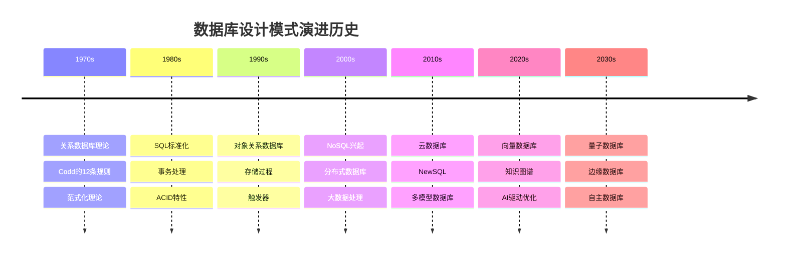
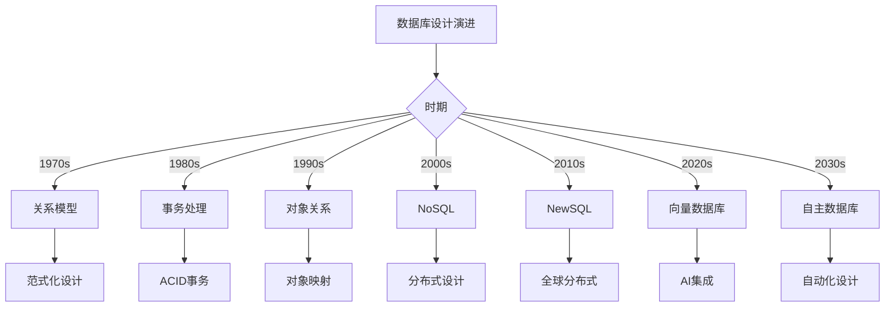
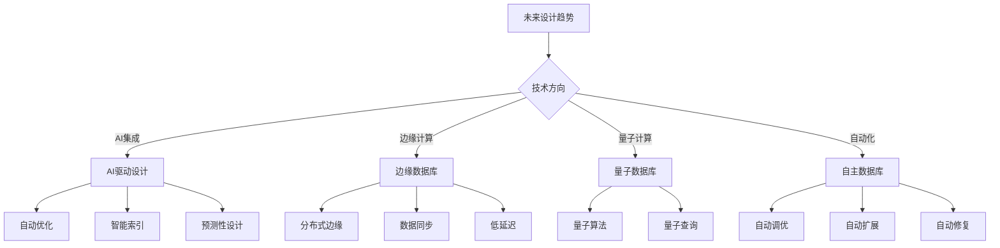
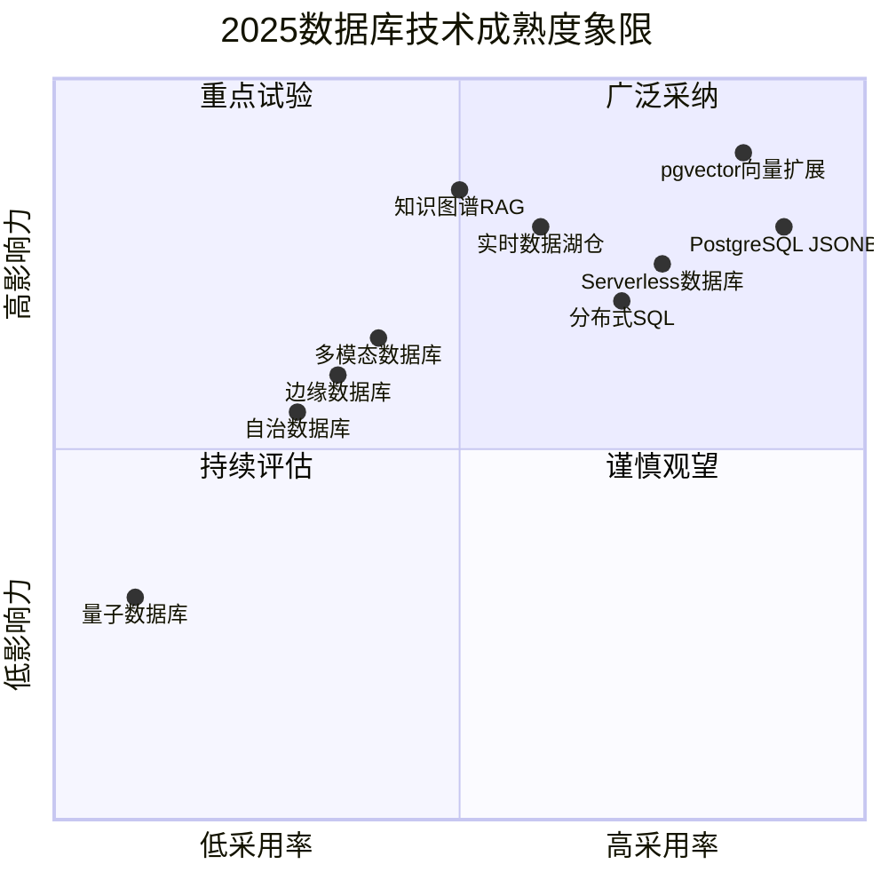

# 数据库设计模式演进历史与未来趋势：从过去到未来

> **创建日期**：2025-01-15
> **最后更新**：2025-12-01
> **版本**：v2.0 (增强版)
> **状态**：实施中

---

## 📋 目录

- [数据库设计模式演进历史与未来趋势：从过去到未来](#数据库设计模式演进历史与未来趋势从过去到未来)
  - [📋 目录](#-目录)
  - [1. 概述](#1-概述)
    - [1.1. 演进历史概览](#11-演进历史概览)
  - [2. 数据库设计演进历史](#2-数据库设计演进历史)
    - [2.1. 1970s：关系数据库理论](#21-1970s关系数据库理论)
    - [2.2. 1980s：SQL标准化与事务处理](#22-1980ssql标准化与事务处理)
    - [2.3. 1990s：对象关系数据库](#23-1990s对象关系数据库)
    - [2.4. 2000s：NoSQL与分布式数据库](#24-2000snosql与分布式数据库)
    - [2.5. 2010s：云数据库与NewSQL](#25-2010s云数据库与newsql)
    - [2.6. 2020s：AI与向量数据库](#26-2020sai与向量数据库)
  - [3. 设计模式演进时间线](#3-设计模式演进时间线)
    - [3.1. 设计模式演进矩阵](#31-设计模式演进矩阵)
    - [3.2. 设计模式演进决策树](#32-设计模式演进决策树)
  - [4. 当前热门设计模式](#4-当前热门设计模式)
    - [4.1. 2024-2025热门模式](#41-2024-2025热门模式)
    - [4.2. 热门模式应用场景](#42-热门模式应用场景)
  - [5. 未来发展趋势](#5-未来发展趋势)
    - [5.1. 技术趋势预测](#51-技术趋势预测)
    - [5.2. 设计模式未来趋势](#52-设计模式未来趋势)
    - [5.3. 未来设计模式预测](#53-未来设计模式预测)
  - [6. 技术趋势预测](#6-技术趋势预测)
    - [6.1. AI驱动优化趋势](#61-ai驱动优化趋势)
    - [6.2. 多模态数据库趋势](#62-多模态数据库趋势)
    - [6.3. 边缘数据库趋势](#63-边缘数据库趋势)
  - [7. 2025技术成熟度雷达](#7-2025技术成熟度雷达)
    - [7.1. 技术成熟度象限分析](#71-技术成熟度象限分析)
    - [7.2. 技术成熟度详细矩阵](#72-技术成熟度详细矩阵)
  - [8. 行业权威预测对标](#8-行业权威预测对标)
    - [8.1. Gartner预测 (2024-2030)](#81-gartner预测-2024-2030)
    - [8.2. DB-Engines趋势分析](#82-db-engines趋势分析)
    - [8.3. 行业专家观点](#83-行业专家观点)
  - [9. 参考资料](#9-参考资料)
    - [9.1. 权威文献](#91-权威文献)
    - [9.2. 在线资源](#92-在线资源)
    - [9.3. 相关文档](#93-相关文档)

---

## 1. 概述

本文档梳理数据库设计模式的演进历史，分析当前热门模式，并预测未来发展趋势。

### 1.1. 演进历史概览



---

## 2. 数据库设计演进历史

### 2.1. 1970s：关系数据库理论

**关键里程碑**：

- **1970年**：Edgar F. Codd发表《A Relational Model of Data for Large Shared Data Banks》
- **1974年**：SQL语言提出
- **1976年**：范式化理论（1NF、2NF、3NF）

**设计特点**：

- 表结构设计
- 范式化理论
- 关系完整性约束

**代表系统**：

- System R（IBM）
- Ingres（UC Berkeley）

### 2.2. 1980s：SQL标准化与事务处理

**关键里程碑**：

- **1986年**：SQL-86标准发布
- **1989年**：SQL-89标准发布
- **1992年**：SQL-92标准发布

**设计特点**：

- SQL标准化
- ACID事务保证
- 存储过程与触发器

**代表系统**：

- Oracle Database
- IBM DB2
- Microsoft SQL Server

### 2.3. 1990s：对象关系数据库

**关键里程碑**：

- **1995年**：PostgreSQL 6.0发布（对象关系数据库）
- **1999年**：SQL:1999标准（对象关系扩展）

**设计特点**：

- 对象关系映射
- 用户定义类型
- 继承关系

**代表系统**：

- PostgreSQL
- Oracle（对象关系扩展）

### 2.4. 2000s：NoSQL与分布式数据库

**关键里程碑**：

- **2000年**：Google Bigtable论文
- **2004年**：Amazon DynamoDB
- **2009年**：MongoDB发布
- **2010年**：Cassandra发布

**设计特点**：

- 非关系数据模型
- 分布式架构
- 最终一致性

**代表系统**：

- MongoDB（文档数据库）
- Cassandra（列式数据库）
- Redis（键值数据库）
- Neo4j（图数据库）

### 2.5. 2010s：云数据库与NewSQL

**关键里程碑**：

- **2010年**：Amazon RDS
- **2012年**：Google Spanner论文
- **2015年**：CockroachDB发布
- **2017年**：TiDB发布

**设计特点**：

- 云原生架构
- 全球分布式
- 强一致性

**代表系统**：

- Amazon RDS/Aurora
- Google Spanner
- CockroachDB
- TiDB

### 2.6. 2020s：AI与向量数据库

**关键里程碑**：

- **2020年**：pgvector扩展发布
- **2022年**：ChatGPT引发AI热潮
- **2023年**：RAG系统普及
- **2024年**：向量数据库成熟

**设计特点**：

- 向量嵌入存储
- 相似度搜索
- AI驱动优化

**代表系统**：

- pgvector（PostgreSQL扩展）
- Pinecone
- Weaviate
- Qdrant

---

## 3. 设计模式演进时间线

### 3.1. 设计模式演进矩阵

**设计模式演进对比**：

| 时期 | 主要模式 | 特点 | 代表技术 |
|------|---------|------|---------|
| **1970s** | 关系模型 | 范式化、ACID | SQL、范式理论 |
| **1980s** | 事务处理 | ACID保证、并发控制 | 两阶段提交、MVCC |
| **1990s** | 对象关系 | 继承、多态 | PostgreSQL、Oracle |
| **2000s** | NoSQL | 非关系、分布式 | MongoDB、Cassandra |
| **2010s** | NewSQL | 分布式、强一致性 | Spanner、CockroachDB |
| **2020s** | 向量数据库 | AI、相似度搜索 | pgvector、Pinecone |
| **2030s** | 自主数据库 | AI驱动、自动化 | Oracle Autonomous DB |

### 3.2. 设计模式演进决策树



---

## 4. 当前热门设计模式

### 4.1. 2024-2025热门模式

**当前热门设计模式矩阵**：

| 模式 | 热度 | 应用场景 | 代表技术 | 文档链接 |
|------|------|---------|---------|---------|
| **向量数据库** | ⭐⭐⭐⭐⭐ | AI应用、推荐系统 | pgvector、Pinecone | [07.10](./07.10-向量数据库设计.md) |
| **知识图谱** | ⭐⭐⭐⭐⭐ | 知识管理、推理 | Neo4j、Apache AGE | [07.12](./07.12-知识图谱数据库设计实战.md) |
| **时序数据库** | ⭐⭐⭐⭐ | IoT、监控 | TimescaleDB、InfluxDB | [07.18](./07.18-时序数据库设计模式.md) |
| **多租户数据库** | ⭐⭐⭐⭐ | SaaS平台 | PostgreSQL RLS | [07.20](./07.20-多租户数据库设计模式.md) |
| **分布式数据库** | ⭐⭐⭐⭐ | 微服务、全球部署 | CockroachDB、TiDB | [07.17](./07.17-分布式数据库设计模式.md) |
| **列式数据库** | ⭐⭐⭐ | 数据分析、OLAP | ClickHouse、Snowflake | [07.21](./07.21-列式数据库设计模式.md) |
| **文档数据库** | ⭐⭐⭐ | 内容管理、非结构化 | MongoDB、PostgreSQL JSONB | [07.19](./07.19-文档数据库设计模式.md) |
| **内存数据库** | ⭐⭐⭐ | 缓存、高速访问 | Redis、Memcached | [07.22](./07.22-内存数据库设计模式.md) |

### 4.2. 热门模式应用场景

**热门模式应用场景矩阵**：

| 应用场景 | 推荐模式 | 热度趋势 | 未来预测 |
|---------|---------|---------|---------|
| **AI应用** | 向量数据库 + 知识图谱 | ⬆️ 上升 | 持续增长 |
| **推荐系统** | 向量数据库 + 知识图谱 | ⬆️ 上升 | 持续增长 |
| **IoT平台** | 时序数据库 + 列式数据库 | ⬆️ 上升 | 持续增长 |
| **SaaS平台** | 多租户数据库 | ➡️ 稳定 | 持续稳定 |
| **微服务** | 分布式数据库 | ➡️ 稳定 | 持续稳定 |
| **数据分析** | 列式数据库 | ⬆️ 上升 | 持续增长 |

---

## 5. 未来发展趋势

### 5.1. 技术趋势预测

**未来技术趋势矩阵**：

| 趋势 | 时间线 | 影响 | 技术方向 |
|------|--------|------|---------|
| **AI驱动优化** | 2025-2027 | ⭐⭐⭐⭐⭐ | 自动索引优化、查询优化 |
| **向量数据库成熟** | 2025-2026 | ⭐⭐⭐⭐⭐ | 标准化、性能提升 |
| **知识图谱普及** | 2025-2027 | ⭐⭐⭐⭐ | 企业知识管理 |
| **边缘数据库** | 2026-2028 | ⭐⭐⭐⭐ | IoT、边缘计算 |
| **量子数据库** | 2030+ | ⭐⭐⭐ | 量子计算应用 |
| **自主数据库** | 2027-2030 | ⭐⭐⭐⭐ | AI自动化管理 |

### 5.2. 设计模式未来趋势

**设计模式未来趋势决策树**：



### 5.3. 未来设计模式预测

**未来设计模式预测**：

| 模式 | 预测时间 | 特点 | 应用场景 |
|------|---------|------|---------|
| **AI驱动设计** | 2025-2027 | 自动优化、智能索引 | 所有数据库 |
| **多模态数据库** | 2026-2028 | 文本、图像、视频统一存储 | 内容平台 |
| **图向量融合** | 2025-2027 | 知识图谱+向量检索 | 智能问答 |
| **时序向量融合** | 2026-2028 | 时序数据+向量检索 | IoT分析 |
| **边缘数据库** | 2026-2028 | 边缘节点数据存储 | IoT、CDN |
| **量子数据库** | 2030+ | 量子算法优化 | 科学计算 |

---

## 6. 技术趋势预测

### 6.1. AI驱动优化趋势

**AI驱动优化应用**：

```sql
-- 未来：AI自动索引优化
-- 系统自动分析查询模式，自动创建和删除索引

-- 未来：AI查询优化
-- 系统自动重写查询，优化执行计划

-- 未来：AI预测性设计
-- 系统预测数据增长，自动调整分区策略
```

### 6.2. 多模态数据库趋势

**多模态数据库设计**：

```sql
-- 未来：多模态数据统一存储
CREATE TABLE multimodal_content (
    content_id BIGSERIAL PRIMARY KEY,
    content_type VARCHAR(50) NOT NULL,  -- text, image, video, audio
    text_content TEXT,
    image_vector vector(512),
    video_vector vector(1024),
    audio_vector vector(256),
    metadata JSONB,
    created_at TIMESTAMPTZ NOT NULL DEFAULT CURRENT_TIMESTAMP
);

-- 多模态检索
CREATE OR REPLACE FUNCTION multimodal_search(
    p_query_text TEXT,
    p_query_image_vector vector(512),
    p_query_type VARCHAR(50)
)
RETURNS TABLE (
    content_id BIGINT,
    content_type VARCHAR,
    score DOUBLE PRECISION
) AS $$
BEGIN
    -- 根据查询类型选择不同的检索策略
    -- 文本查询：使用全文搜索
    -- 图像查询：使用向量相似度搜索
    -- 混合查询：使用多模态融合检索
END;
$$ LANGUAGE plpgsql;
```

### 6.3. 边缘数据库趋势

**边缘数据库设计**：

```sql
-- 未来：边缘数据库架构
-- 中心数据库（云）
CREATE TABLE central_data (
    data_id BIGSERIAL PRIMARY KEY,
    data_content JSONB NOT NULL,
    sync_status VARCHAR(20) DEFAULT 'synced',
    created_at TIMESTAMPTZ NOT NULL DEFAULT CURRENT_TIMESTAMP
);

-- 边缘数据库（边缘节点）
CREATE TABLE edge_data (
    data_id BIGSERIAL PRIMARY KEY,
    data_content JSONB NOT NULL,
    sync_status VARCHAR(20) DEFAULT 'pending',
    last_synced_at TIMESTAMPTZ,
    created_at TIMESTAMPTZ NOT NULL DEFAULT CURRENT_TIMESTAMP
);

-- 数据同步机制
CREATE OR REPLACE FUNCTION sync_edge_to_central()
RETURNS VOID AS $$
BEGIN
    -- 同步边缘数据到中心数据库
    INSERT INTO central_data (data_content, sync_status)
    SELECT data_content, 'synced'
    FROM edge_data
    WHERE sync_status = 'pending';

    UPDATE edge_data
    SET sync_status = 'synced', last_synced_at = CURRENT_TIMESTAMP
    WHERE sync_status = 'pending';
END;
$$ LANGUAGE plpgsql;
```

---

## 7. 2025技术成熟度雷达

### 7.1. 技术成熟度象限分析



### 7.2. 技术成熟度详细矩阵

| 技术 | 成熟度 | 采用率 | 影响力 | 推荐行动 | 时间线 |
|------|--------|--------|--------|---------|--------|
| **pgvector** | ⭐⭐⭐⭐⭐ | 85% | 高 | 立即采纳 | 现在 |
| **知识图谱+RAG** | ⭐⭐⭐⭐ | 50% | 高 | 重点试验 | 2025-2026 |
| **Serverless DB** | ⭐⭐⭐⭐ | 75% | 高 | 生产使用 | 现在 |
| **分布式SQL** | ⭐⭐⭐⭐ | 70% | 中高 | 生产使用 | 现在 |
| **边缘数据库** | ⭐⭐⭐ | 35% | 中 | 试点项目 | 2026-2027 |
| **自治数据库** | ⭐⭐⭐ | 30% | 中 | 评估 | 2027-2028 |
| **多模态数据库** | ⭐⭐⭐ | 40% | 中高 | 试验 | 2025-2026 |
| **量子数据库** | ⭐ | 10% | 低 | 观望 | 2030+ |

---

## 8. 行业权威预测对标

### 8.1. Gartner预测 (2024-2030)

| 预测领域 | 2025预测 | 2027预测 | 2030预测 |
|---------|---------|---------|---------|
| **向量数据库** | 主流采纳 | 标准化 | 原生集成 |
| **云数据库** | 75%迁移 | 85%迁移 | 95%云原生 |
| **AI优化** | 试验期 | 早期采纳 | 主流 |
| **自治数据库** | 概念验证 | 试点项目 | 部分采纳 |
| **边缘数据** | 早期试验 | 试点采纳 | 广泛部署 |

### 8.2. DB-Engines趋势分析

| 数据库类型 | 2020得分 | 2023得分 | 2025预测 | 趋势 |
|-----------|---------|---------|---------|------|
| **关系型** | 100 | 95 | 90 | ↘️ |
| **文档型** | 30 | 35 | 38 | ↗️ |
| **图数据库** | 5 | 12 | 20 | ↗️↗️ |
| **向量数据库** | 1 | 15 | 35 | ↗️↗️↗️ |
| **时序数据库** | 8 | 15 | 22 | ↗️↗️ |
| **NewSQL** | 10 | 18 | 25 | ↗️↗️ |

### 8.3. 行业专家观点

**Martin Fowler (2024)**:
> "数据网格不是关于技术，而是关于组织结构和数据所有权的转变。"

**Andy Pavlo (CMU, 2024)**:
> "向量数据库的崛起标志着数据库从存储系统向智能系统的转变。"

**Amazon CTO Werner Vogels (2024)**:
> "未来的数据库将是多模态、多协议、自适应的。"

---

## 9. 参考资料

### 9.1. 权威文献

**历史文献**：

- Codd, E.F. (1970). "A Relational Model of Data"
- Stonebraker, M. et al. (2007). "The End of an Architectural Era"
- DeCandia, G. et al. (2007). "Dynamo: Amazon's Highly Available Key-value Store"

**现代文献**：

- Kleppmann, M. (2017). "Designing Data-Intensive Applications"
- Dehghani, Z. (2022). "Data Mesh: Delivering Data-Driven Value at Scale"

### 9.2. 在线资源

| 资源 | URL | 描述 |
|------|-----|------|
| **DB-Engines** | <https://db-engines.com> | 数据库排名 |
| **Gartner Magic Quadrant** | <https://gartner.com> | 行业分析 |
| **CMU Database Course** | <https://15445.courses.cs.cmu.edu> | 学术课程 |
| **PostgreSQL发展路线** | <https://wiki.postgresql.org/wiki/Todo> | PG规划 |

### 9.3. 相关文档

- [07.27-数据库设计模式总结与索引](./07.27-数据库设计模式总结与索引.md)
- [07.29-数据库设计模式最佳实践总结](./07.29-数据库设计模式最佳实践总结.md)
- [07.32-数据库设计模式常见问题FAQ](./07.32-数据库设计模式常见问题FAQ.md)
- [07.05-现代数据库设计模式](./07.05-现代数据库设计模式.md)

---

**最后更新**：2025-12-01
**维护者**：Data-Science Team
**状态**：实施中
**版本**：v2.0 (增强版)
