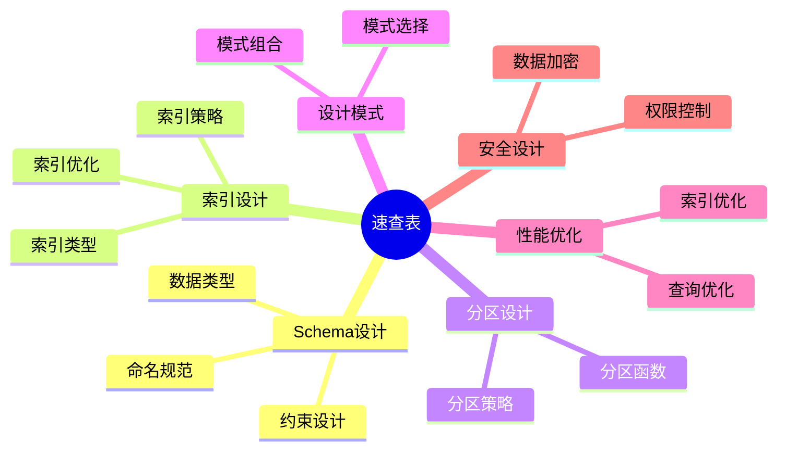

# 数据库设计模式快速参考手册：速查表与快速指南

> **创建日期**：2025-01-15
> **最后更新**：2025-01-15
> **版本**：v1.0
> **状态**：实施中

---

## 📋 目录

- [数据库设计模式快速参考手册：速查表与快速指南](#数据库设计模式快速参考手册速查表与快速指南)
  - [📋 目录](#-目录)
  - [1. 概述](#1-概述)
    - [1.1. 速查表分类](#11-速查表分类)
  - [2. Schema设计速查表](#2-schema设计速查表)
    - [2.1. 命名规范速查表](#21-命名规范速查表)
    - [2.2. 数据类型速查表](#22-数据类型速查表)
    - [2.3. 约束设计速查表](#23-约束设计速查表)
  - [3. 数据类型速查表](#3-数据类型速查表)
    - [3.1. 数值类型选择决策表](#31-数值类型选择决策表)
    - [3.2. 文本类型选择决策表](#32-文本类型选择决策表)
    - [3.3. 时间类型选择决策表](#33-时间类型选择决策表)
  - [4. 索引设计速查表](#4-索引设计速查表)
    - [4.1. 索引类型速查表](#41-索引类型速查表)
    - [4.2. 索引设计决策表](#42-索引设计决策表)
  - [5. 分区设计速查表](#5-分区设计速查表)
    - [5.1. 分区策略速查表](#51-分区策略速查表)
    - [5.2. 分区设计决策表](#52-分区设计决策表)
  - [6. 设计模式速查表](#6-设计模式速查表)
    - [6.1. 数据库类型选择速查表](#61-数据库类型选择速查表)
    - [6.2. 多租户模式选择速查表](#62-多租户模式选择速查表)
    - [6.3. 分布式事务模式选择速查表](#63-分布式事务模式选择速查表)
  - [7. SQL语法速查表](#7-sql语法速查表)
    - [7.1. DDL语法速查表](#71-ddl语法速查表)
    - [7.2. DML语法速查表](#72-dml语法速查表)
  - [8. 性能优化速查表](#8-性能优化速查表)
    - [8.1. 查询优化速查表](#81-查询优化速查表)
    - [8.2. 索引优化速查表](#82-索引优化速查表)
  - [9. 安全设计速查表](#9-安全设计速查表)
    - [9.1. 权限控制速查表](#91-权限控制速查表)
    - [9.2. 数据加密速查表](#92-数据加密速查表)
  - [10. 参考资料](#10-参考资料)

---

## 1. 概述

本文档提供数据库设计模式的快速参考手册，包含各种速查表和快速指南。

### 1.1. 速查表分类

---

## 2. Schema设计速查表

### 2.1. 命名规范速查表

| 对象类型 | 命名规范 | 示例 | 说明 |
|---------|---------|------|------|
| **表名** | 小写+下划线，复数 | `users`, `order_items` | 存储多个实体 |
| **字段名** | 小写+下划线 | `user_id`, `created_at` | 避免关键字冲突 |
| **主键** | `pk_` + 表名 | `pk_users` | 明确主键 |
| **外键** | `fk_` + 表名 + 字段 | `fk_orders_user_id` | 明确外键关系 |
| **索引** | `idx_` + 表名 + 字段 | `idx_users_email` | 便于识别 |
| **唯一约束** | `uk_` + 表名 + 字段 | `uk_users_email` | 明确唯一约束 |
| **检查约束** | `ck_` + 表名 + 字段 | `ck_users_age` | 明确检查约束 |
| **函数** | 动词+名词，小写+下划线 | `get_user_by_id` | 表达功能 |
| **视图** | `v_` + 描述性名称 | `v_user_statistics` | 区分视图 |
| **序列** | `seq_` + 表名 | `seq_users_user_id` | 明确序列 |

### 2.2. 数据类型速查表

| 数据类型 | 存储大小 | 范围/精度 | 适用场景 | 示例 |
|---------|---------|----------|---------|------|
| **SMALLINT** | 2 bytes | -32768 to 32767 | 小范围整数 | 年龄、状态码 |
| **INTEGER** | 4 bytes | -2^31 to 2^31-1 | 常用整数 | ID、计数 |
| **BIGINT** | 8 bytes | -2^63 to 2^63-1 | 大范围整数 | 时间戳、大ID |
| **NUMERIC(p,s)** | 可变 | 精确小数 | 金额、精度要求高 | `NUMERIC(12, 2)` |
| **VARCHAR(n)** | 可变 | 最大n字符 | 有长度限制的文本 | 用户名、邮箱 |
| **TEXT** | 可变 | 无限制 | 长文本 | 文章内容、描述 |
| **BOOLEAN** | 1 byte | true/false | 布尔值 | 是否激活 |
| **DATE** | 4 bytes | 日期 | 仅日期 | 生日、日期 |
| **TIMESTAMP** | 8 bytes | 日期时间（无时区） | 本地时间 | 不推荐 |
| **TIMESTAMPTZ** | 8 bytes | 日期时间（有时区） | 时间戳 | 推荐使用 |
| **JSONB** | 可变 | JSON数据 | 半结构化数据 | 配置、元数据 |
| **UUID** | 16 bytes | UUID | 全局唯一ID | 分布式ID |
| **BYTEA** | 可变 | 二进制数据 | 文件、图片 | 二进制存储 |

### 2.3. 约束设计速查表

| 约束类型 | SQL语法 | 示例 | 说明 |
|---------|---------|------|------|
| **主键** | `PRIMARY KEY` | `user_id BIGSERIAL PRIMARY KEY` | 唯一标识 |
| **外键** | `FOREIGN KEY` | `FOREIGN KEY (user_id) REFERENCES users(user_id)` | 引用完整性 |
| **唯一约束** | `UNIQUE` | `email VARCHAR(100) UNIQUE` | 唯一值 |
| **非空约束** | `NOT NULL` | `username VARCHAR(50) NOT NULL` | 必填字段 |
| **检查约束** | `CHECK` | `CHECK (age >= 0 AND age <= 150)` | 值范围检查 |
| **默认值** | `DEFAULT` | `created_at TIMESTAMPTZ DEFAULT CURRENT_TIMESTAMP` | 默认值 |

---

## 3. 数据类型速查表

### 3.1. 数值类型选择决策表

| 需求 | 推荐类型 | 示例 |
|------|---------|------|
| **小范围整数（-32768 to 32767）** | SMALLINT | 年龄、状态码 |
| **常用整数（-2^31 to 2^31-1）** | INTEGER | ID、计数 |
| **大范围整数（-2^63 to 2^63-1）** | BIGINT | 时间戳、大ID |
| **精确小数（金额）** | NUMERIC(12, 2) | 金额、价格 |
| **浮点数（科学计算）** | DOUBLE PRECISION | 科学计算 |

### 3.2. 文本类型选择决策表

| 需求 | 推荐类型 | 示例 |
|------|---------|------|
| **固定长度文本** | CHAR(n) | 国家代码（2字符） |
| **有长度限制文本** | VARCHAR(n) | 用户名（50字符）、邮箱（100字符） |
| **长文本（无限制）** | TEXT | 文章内容、描述 |
| **半结构化数据** | JSONB | 配置、元数据 |

### 3.3. 时间类型选择决策表

| 需求 | 推荐类型 | 示例 |
|------|---------|------|
| **仅日期** | DATE | 生日、日期 |
| **日期时间（推荐）** | TIMESTAMPTZ | 时间戳、创建时间 |
| **时间间隔** | INTERVAL | 持续时间 |

---

## 4. 索引设计速查表

### 4.1. 索引类型速查表

| 索引类型 | SQL语法 | 适用场景 | 示例 |
|---------|---------|---------|------|
| **B-Tree索引** | `CREATE INDEX` | 默认索引，通用场景 | `CREATE INDEX idx_users_email ON users(email)` |
| **唯一索引** | `CREATE UNIQUE INDEX` | 唯一值约束 | `CREATE UNIQUE INDEX uk_users_email ON users(email)` |
| **部分索引** | `CREATE INDEX ... WHERE` | 条件查询 | `CREATE INDEX idx_active_users ON users(email) WHERE status = 'active'` |
| **表达式索引** | `CREATE INDEX ... ON ... (表达式)` | 函数查询 | `CREATE INDEX idx_users_lower_email ON users(LOWER(email))` |
| **复合索引** | `CREATE INDEX ... ON ... (col1, col2)` | 多字段查询 | `CREATE INDEX idx_orders_user_status ON orders(user_id, status)` |
| **覆盖索引** | 包含查询所需字段 | 避免回表 | `CREATE INDEX idx_users_cover ON users(user_id, email, name)` |
| **GIN索引** | `CREATE INDEX ... USING GIN` | 全文搜索、数组 | `CREATE INDEX idx_articles_content ON articles USING GIN(to_tsvector('english', content))` |
| **GiST索引** | `CREATE INDEX ... USING GIST` | 地理空间数据 | `CREATE INDEX idx_locations_geom ON locations USING GIST(geom)` |
| **HNSW索引** | `CREATE INDEX ... USING hnsw` | 向量相似度搜索 | `CREATE INDEX idx_products_embedding ON products USING hnsw (embedding vector_cosine_ops)` |

### 4.2. 索引设计决策表

| 场景 | 推荐索引 | SQL示例 |
|------|---------|---------|
| **主键字段** | 自动创建主键索引 | `PRIMARY KEY (user_id)` |
| **外键字段** | B-Tree索引 | `CREATE INDEX idx_orders_user_id ON orders(user_id)` |
| **WHERE条件字段** | B-Tree索引 | `CREATE INDEX idx_users_status ON users(status)` |
| **ORDER BY字段** | B-Tree索引 | `CREATE INDEX idx_orders_created_at ON orders(created_at DESC)` |
| **JOIN字段** | B-Tree索引 | `CREATE INDEX idx_orders_user_id ON orders(user_id)` |
| **全文搜索** | GIN索引 | `CREATE INDEX idx_articles_content ON articles USING GIN(to_tsvector('english', content))` |
| **地理空间查询** | GiST索引 | `CREATE INDEX idx_locations_geom ON locations USING GIST(geom)` |
| **向量相似度搜索** | HNSW索引 | `CREATE INDEX idx_products_embedding ON products USING hnsw (embedding vector_cosine_ops)` |
| **条件查询（部分数据）** | 部分索引 | `CREATE INDEX idx_active_users ON users(email) WHERE status = 'active'` |
| **函数查询** | 表达式索引 | `CREATE INDEX idx_users_lower_email ON users(LOWER(email))` |

---

## 5. 分区设计速查表

### 5.1. 分区策略速查表

| 分区策略 | SQL语法 | 适用场景 | 示例 |
|---------|---------|---------|------|
| **范围分区** | `PARTITION BY RANGE` | 时间序列数据、有序数据 | `PARTITION BY RANGE (created_at)` |
| **列表分区** | `PARTITION BY LIST` | 离散值分区 | `PARTITION BY LIST (region)` |
| **哈希分区** | `PARTITION BY HASH` | 数据均匀分布 | `PARTITION BY HASH (user_id)` |
| **复合分区** | 组合多种策略 | 复杂场景 | `PARTITION BY RANGE (created_at), LIST (region)` |

### 5.2. 分区设计决策表

| 场景 | 推荐分区策略 | SQL示例 |
|------|------------|---------|
| **时间序列数据** | 范围分区（按月/年） | `PARTITION BY RANGE (created_at)` |
| **按地区分区** | 列表分区 | `PARTITION BY LIST (region)` |
| **数据均匀分布** | 哈希分区 | `PARTITION BY HASH (user_id)` |
| **大表查询优化** | 范围分区 + 索引 | `PARTITION BY RANGE (created_at)` + 索引 |

---

## 6. 设计模式速查表

### 6.1. 数据库类型选择速查表

| 数据特征 | 推荐数据库类型 | 代表系统 | 文档链接 |
|---------|--------------|---------|---------|
| **结构化数据 + 强事务** | 关系数据库 | PostgreSQL、MySQL | [07.01](./07.01-Schema设计方法论.md) |
| **向量数据 + 相似度搜索** | 向量数据库 | pgvector、Pinecone | [07.10](./07.10-向量数据库设计.md) |
| **地理数据 + 空间查询** | 地理空间数据库 | PostGIS | [07.11](./07.11-地理空间数据库设计.md) |
| **图数据 + 图查询** | 知识图谱 | Neo4j、Apache AGE | [07.12](./07.12-知识图谱数据库设计实战.md) |
| **时序数据 + 时间窗口查询** | 时序数据库 | TimescaleDB、InfluxDB | [07.18](./07.18-时序数据库设计模式.md) |
| **文档数据 + 灵活Schema** | 文档数据库 | MongoDB、PostgreSQL JSONB | [07.19](./07.19-文档数据库设计模式.md) |
| **分析数据 + 聚合查询** | 列式数据库 | ClickHouse、Snowflake | [07.21](./07.21-列式数据库设计模式.md) |
| **缓存数据 + 高速访问** | 内存数据库 | Redis、Memcached | [07.22](./07.22-内存数据库设计模式.md) |

### 6.2. 多租户模式选择速查表

| 租户规模 | 隔离需求 | 推荐模式 | 文档链接 |
|---------|---------|---------|---------|
| **大型企业** | 高隔离 | 独立数据库 | [07.20](./07.20-多租户数据库设计模式.md) |
| **中型企业** | 中隔离 | 共享数据库+Schema | [07.20](./07.20-多租户数据库设计模式.md) |
| **小型企业** | 低隔离 | 共享数据库+RLS | [07.20](./07.20-多租户数据库设计模式.md) |

### 6.3. 分布式事务模式选择速查表

| 一致性需求 | 事务复杂度 | 推荐模式 | 文档链接 |
|-----------|-----------|---------|---------|
| **强一致性** | 简单/复杂 | 2PC | [07.17](./07.17-分布式数据库设计模式.md) |
| **最终一致性** | 简单事务 | Saga | [07.17](./07.17-分布式数据库设计模式.md) |
| **最终一致性** | 复杂事务 + 审计需求 | 事件溯源 | [07.17](./07.17-分布式数据库设计模式.md) |
| **最终一致性** | 复杂事务 + 补偿需求 | TCC | [07.17](./07.17-分布式数据库设计模式.md) |

---

## 7. SQL语法速查表

### 7.1. DDL语法速查表

| 操作 | SQL语法 | 示例 |
|------|---------|------|
| **创建表** | `CREATE TABLE` | `CREATE TABLE users (user_id BIGSERIAL PRIMARY KEY, username VARCHAR(50) NOT NULL)` |
| **修改表** | `ALTER TABLE` | `ALTER TABLE users ADD COLUMN email VARCHAR(100)` |
| **删除表** | `DROP TABLE` | `DROP TABLE users CASCADE` |
| **创建索引** | `CREATE INDEX` | `CREATE INDEX idx_users_email ON users(email)` |
| **删除索引** | `DROP INDEX` | `DROP INDEX idx_users_email` |
| **创建视图** | `CREATE VIEW` | `CREATE VIEW v_active_users AS SELECT * FROM users WHERE status = 'active'` |
| **创建函数** | `CREATE FUNCTION` | `CREATE FUNCTION get_user(id BIGINT) RETURNS TABLE AS $$ ... $$` |
| **创建触发器** | `CREATE TRIGGER` | `CREATE TRIGGER trg_update_timestamp BEFORE UPDATE ON users FOR EACH ROW EXECUTE FUNCTION update_timestamp()` |

### 7.2. DML语法速查表

| 操作 | SQL语法 | 示例 |
|------|---------|------|
| **插入数据** | `INSERT INTO` | `INSERT INTO users (username, email) VALUES ('alice', 'alice@example.com')` |
| **更新数据** | `UPDATE` | `UPDATE users SET email = 'new@example.com' WHERE user_id = 1` |
| **删除数据** | `DELETE FROM` | `DELETE FROM users WHERE user_id = 1` |
| **查询数据** | `SELECT` | `SELECT * FROM users WHERE status = 'active'` |
| **JOIN查询** | `JOIN` | `SELECT * FROM users u JOIN orders o ON u.user_id = o.user_id` |
| **聚合查询** | `GROUP BY` | `SELECT user_id, COUNT(*) FROM orders GROUP BY user_id` |
| **子查询** | `SELECT ... WHERE ... IN (SELECT ...)` | `SELECT * FROM users WHERE user_id IN (SELECT user_id FROM orders)` |

---

## 8. 性能优化速查表

### 8.1. 查询优化速查表

| 问题 | 优化方法 | SQL示例 |
|------|---------|---------|
| **全表扫描** | 添加索引 | `CREATE INDEX idx_users_email ON users(email)` |
| **N+1查询** | 使用JOIN | `SELECT u.*, o.* FROM users u LEFT JOIN orders o ON u.user_id = o.user_id` |
| **慢分页查询** | 使用游标分页 | `SELECT * FROM orders WHERE created_at < $1 ORDER BY created_at DESC LIMIT 20` |
| **重复计算** | 使用物化视图 | `CREATE MATERIALIZED VIEW mv_user_stats AS SELECT ...` |
| **大表查询** | 使用分区 | `PARTITION BY RANGE (created_at)` |

### 8.2. 索引优化速查表

| 场景 | 优化方法 | SQL示例 |
|------|---------|---------|
| **外键字段** | 创建索引 | `CREATE INDEX idx_orders_user_id ON orders(user_id)` |
| **WHERE条件字段** | 创建索引 | `CREATE INDEX idx_users_status ON users(status)` |
| **ORDER BY字段** | 创建索引 | `CREATE INDEX idx_orders_created_at ON orders(created_at DESC)` |
| **复合查询** | 创建复合索引 | `CREATE INDEX idx_orders_user_status ON orders(user_id, status)` |
| **条件查询** | 创建部分索引 | `CREATE INDEX idx_active_users ON users(email) WHERE status = 'active'` |
| **函数查询** | 创建表达式索引 | `CREATE INDEX idx_users_lower_email ON users(LOWER(email))` |

---

## 9. 安全设计速查表

### 9.1. 权限控制速查表

| 需求 | 实现方法 | SQL示例 |
|------|---------|---------|
| **行级安全** | RLS策略 | `ALTER TABLE orders ENABLE ROW LEVEL SECURITY; CREATE POLICY ...` |
| **列级权限** | GRANT列权限 | `GRANT SELECT (username, email) ON users TO app_user` |
| **角色权限** | RBAC | `CREATE ROLE app_user; GRANT SELECT ON users TO app_user` |
| **多租户隔离** | RLS + 租户ID | `CREATE POLICY tenant_isolation ON orders USING (tenant_id = get_current_tenant_id())` |

### 9.2. 数据加密速查表

| 需求 | 实现方法 | SQL示例 |
|------|---------|---------|
| **字段加密** | pgcrypto | `INSERT INTO users (password_hash) VALUES (crypt('password', gen_salt('bf')))` |
| **传输加密** | SSL/TLS | `ALTER SYSTEM SET ssl = on` |
| **存储加密** | TDE | 数据库级别加密 |

---

## 10. 参考资料

- [数据库设计模式总结与索引](./07.27-数据库设计模式总结与索引.md)
- [数据库设计模式最佳实践总结](./07.29-数据库设计模式最佳实践总结.md)
- [数据库设计模式常见问题FAQ](./07.32-数据库设计模式常见问题FAQ.md)

---

**最后更新**：2025-01-15
**维护者**：Data-Science Team
**状态**：实施中
