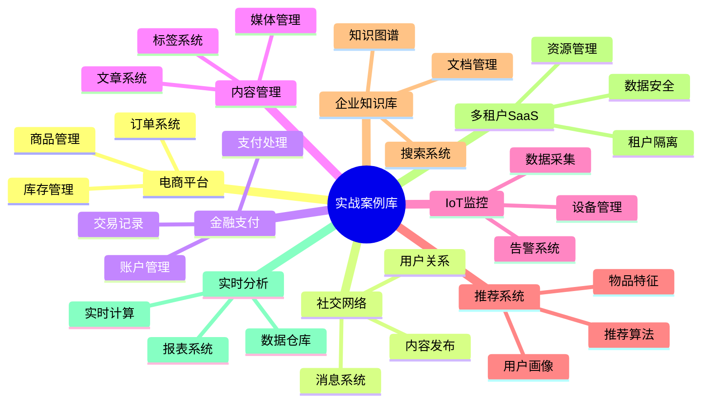

# 数据库设计模式实战案例库：真实场景与解决方案

> **创建日期**：2025-01-15
> **最后更新**：2025-01-15
> **版本**：v1.0
> **状态**：实施中

---

## 📋 目录

- [数据库设计模式实战案例库：真实场景与解决方案](#数据库设计模式实战案例库真实场景与解决方案)
  - [📋 目录](#-目录)
  - [1. 概述](#1-概述)
    - [1.1. 案例分类](#11-案例分类)
  - [2. 电商平台案例](#2-电商平台案例)
    - [2.1. 场景描述](#21-场景描述)
    - [2.2. 设计方案](#22-设计方案)
    - [2.3. 核心功能实现](#23-核心功能实现)
  - [3. 社交网络案例](#3-社交网络案例)
    - [3.1. 场景描述](#31-场景描述)
    - [3.2. 设计方案](#32-设计方案)
    - [3.3. 核心功能实现](#33-核心功能实现)
  - [4. 金融支付案例](#4-金融支付案例)
    - [4.1. 场景描述](#41-场景描述)
    - [4.2. 设计方案](#42-设计方案)
    - [4.3. 核心功能实现](#43-核心功能实现)
  - [5. 内容管理案例](#5-内容管理案例)
    - [5.1. 场景描述](#51-场景描述)
    - [5.2. 设计方案](#52-设计方案)
    - [5.3. 核心功能实现](#53-核心功能实现)
  - [6. IoT监控案例](#6-iot监控案例)
    - [6.1. 场景描述](#61-场景描述)
    - [6.2. 设计方案](#62-设计方案)
    - [6.3. 核心功能实现](#63-核心功能实现)
  - [7. 推荐系统案例](#7-推荐系统案例)
    - [7.1. 场景描述](#71-场景描述)
    - [7.2. 设计方案](#72-设计方案)
    - [7.3. 核心功能实现](#73-核心功能实现)
  - [8. 企业知识库案例](#8-企业知识库案例)
    - [8.1. 场景描述](#81-场景描述)
    - [8.2. 设计方案](#82-设计方案)
    - [8.3. 核心功能实现](#83-核心功能实现)
  - [9. 多租户SaaS案例](#9-多租户saas案例)
    - [9.1. 场景描述](#91-场景描述)
    - [9.2. 设计方案](#92-设计方案)
    - [9.3. 核心功能实现](#93-核心功能实现)
  - [10. 实时分析案例](#10-实时分析案例)
    - [10.1. 场景描述](#101-场景描述)
    - [10.2. 设计方案](#102-设计方案)
    - [10.3. 核心功能实现](#103-核心功能实现)
  - [11. 参考资料](#11-参考资料)

---

## 1. 概述

本文档提供数据库设计模式的实战案例库，包含真实场景和解决方案。

### 1.1. 案例分类



---

## 2. 电商平台案例

### 2.1. 场景描述

**业务需求**：

- 支持千万级用户
- 日订单量百万级
- 商品SKU百万级
- 实时库存管理
- 订单状态追踪
- 支付流程完整

### 2.2. 设计方案

**核心表结构**：

```sql
-- 用户表（分表）
CREATE TABLE user_domain.users_0 (
    user_id BIGSERIAL PRIMARY KEY,
    username VARCHAR(50) NOT NULL UNIQUE,
    email VARCHAR(100) NOT NULL UNIQUE,
    phone VARCHAR(20),
    password_hash TEXT NOT NULL,
    status VARCHAR(20) DEFAULT 'active',
    created_at TIMESTAMPTZ NOT NULL DEFAULT CURRENT_TIMESTAMP,
    updated_at TIMESTAMPTZ NOT NULL DEFAULT CURRENT_TIMESTAMP
) PARTITION BY HASH (user_id);

-- 商品表（分表）
CREATE TABLE product_domain.products (
    product_id BIGSERIAL PRIMARY KEY,
    product_name VARCHAR(200) NOT NULL,
    category_id INTEGER NOT NULL,
    price DECIMAL(12, 2) NOT NULL,
    stock INTEGER NOT NULL DEFAULT 0,
    sales_count INTEGER DEFAULT 0,
    status VARCHAR(20) DEFAULT 'active',
    created_at TIMESTAMPTZ NOT NULL DEFAULT CURRENT_TIMESTAMP,
    updated_at TIMESTAMPTZ NOT NULL DEFAULT CURRENT_TIMESTAMP
) PARTITION BY HASH (product_id);

-- 订单表（按月分区）
CREATE TABLE order_domain.orders (
    order_id BIGINT PRIMARY KEY,
    user_id BIGINT NOT NULL,
    order_sn VARCHAR(64) UNIQUE NOT NULL,
    total_amount DECIMAL(12, 2) NOT NULL,
    actual_payment DECIMAL(12, 2) NOT NULL,
    payment_status VARCHAR(20) DEFAULT 'pending',
    order_status VARCHAR(20) DEFAULT 'created',
    shipping_address JSONB,
    payment_method VARCHAR(50),
    created_at TIMESTAMPTZ NOT NULL DEFAULT CURRENT_TIMESTAMP,
    updated_at TIMESTAMPTZ NOT NULL DEFAULT CURRENT_TIMESTAMP,
    payment_at TIMESTAMPTZ,
    shipped_at TIMESTAMPTZ,
    completed_at TIMESTAMPTZ
) PARTITION BY RANGE (created_at);

-- 订单明细表
CREATE TABLE order_domain.order_items (
    item_id BIGSERIAL PRIMARY KEY,
    order_id BIGINT NOT NULL,
    product_id BIGINT NOT NULL,
    quantity INTEGER NOT NULL,
    price DECIMAL(12, 2) NOT NULL,
    amount DECIMAL(12, 2) NOT NULL,
    created_at TIMESTAMPTZ NOT NULL DEFAULT CURRENT_TIMESTAMP
) PARTITION BY RANGE (created_at);

-- 库存表（分表）
CREATE TABLE inventory_domain.stock (
    stock_id BIGSERIAL PRIMARY KEY,
    product_id BIGINT NOT NULL UNIQUE,
    available_stock INTEGER NOT NULL DEFAULT 0,
    reserved_stock INTEGER NOT NULL DEFAULT 0,
    total_stock INTEGER NOT NULL DEFAULT 0,
    updated_at TIMESTAMPTZ NOT NULL DEFAULT CURRENT_TIMESTAMP
) PARTITION BY HASH (product_id);
```

**关键设计点**：

- 用户表按HASH分表（10个分表）
- 商品表按HASH分表（10个分表）
- 订单表按月分区（自动创建分区）
- 库存表按HASH分表（10个分表）
- 订单状态触发器自动更新库存

### 2.3. 核心功能实现

**库存扣减函数**：

```sql
CREATE OR REPLACE FUNCTION inventory_domain.decrease_stock(
    p_product_id BIGINT,
    p_quantity INTEGER
)
RETURNS BOOLEAN AS $$
DECLARE
    v_available_stock INTEGER;
BEGIN
    -- 检查可用库存
    SELECT available_stock INTO v_available_stock
    FROM inventory_domain.stock
    WHERE product_id = p_product_id
    FOR UPDATE;

    IF v_available_stock < p_quantity THEN
        RETURN FALSE;
    END IF;

    -- 扣减库存
    UPDATE inventory_domain.stock
    SET available_stock = available_stock - p_quantity,
        reserved_stock = reserved_stock + p_quantity,
        updated_at = CURRENT_TIMESTAMP
    WHERE product_id = p_product_id;

    RETURN TRUE;
END;
$$ LANGUAGE plpgsql;
```

**订单创建函数**：

```sql
CREATE OR REPLACE FUNCTION order_domain.create_order(
    p_user_id BIGINT,
    p_items JSONB,
    p_shipping_address JSONB,
    p_payment_method VARCHAR(50)
)
RETURNS BIGINT AS $$
DECLARE
    v_order_id BIGINT;
    v_total_amount DECIMAL(12, 2) := 0;
    v_item JSONB;
BEGIN
    -- 生成订单ID
    v_order_id := nextval('order_domain.order_id_seq');

    -- 计算总金额并扣减库存
    FOR v_item IN SELECT * FROM jsonb_array_elements(p_items)
    LOOP
        -- 扣减库存
        IF NOT inventory_domain.decrease_stock(
            (v_item->>'product_id')::BIGINT,
            (v_item->>'quantity')::INTEGER
        ) THEN
            RAISE EXCEPTION 'Insufficient stock for product %', v_item->>'product_id';
        END IF;

        -- 累加总金额
        v_total_amount := v_total_amount +
            (v_item->>'price')::DECIMAL(12, 2) * (v_item->>'quantity')::INTEGER;
    END LOOP;

    -- 创建订单
    INSERT INTO order_domain.orders (
        order_id, user_id, order_sn, total_amount, actual_payment,
        shipping_address, payment_method, order_status
    )
    VALUES (
        v_order_id, p_user_id, 'ORD' || v_order_id, v_total_amount, v_total_amount,
        p_shipping_address, p_payment_method, 'created'
    );

    -- 创建订单明细
    INSERT INTO order_domain.order_items (order_id, product_id, quantity, price, amount)
    SELECT
        v_order_id,
        (item->>'product_id')::BIGINT,
        (item->>'quantity')::INTEGER,
        (item->>'price')::DECIMAL(12, 2),
        (item->>'price')::DECIMAL(12, 2) * (item->>'quantity')::INTEGER
    FROM jsonb_array_elements(p_items) AS item;

    RETURN v_order_id;
END;
$$ LANGUAGE plpgsql;
```

---

## 3. 社交网络案例

### 3.1. 场景描述

**业务需求**：

- 支持亿级用户
- 用户关系管理（关注、粉丝）
- 内容发布（文字、图片、视频）
- 消息系统（私信、通知）
- 实时Feed流

### 3.2. 设计方案

**核心表结构**：

```sql
-- 用户表（分表）
CREATE TABLE social_domain.users (
    user_id BIGSERIAL PRIMARY KEY,
    username VARCHAR(50) NOT NULL UNIQUE,
    nickname VARCHAR(100),
    avatar_url TEXT,
    bio TEXT,
    follower_count INTEGER DEFAULT 0,
    following_count INTEGER DEFAULT 0,
    post_count INTEGER DEFAULT 0,
    created_at TIMESTAMPTZ NOT NULL DEFAULT CURRENT_TIMESTAMP
) PARTITION BY HASH (user_id);

-- 用户关系表（分表）
CREATE TABLE social_domain.user_relations (
    relation_id BIGSERIAL PRIMARY KEY,
    follower_id BIGINT NOT NULL,
    following_id BIGINT NOT NULL,
    status VARCHAR(20) DEFAULT 'active',
    created_at TIMESTAMPTZ NOT NULL DEFAULT CURRENT_TIMESTAMP,
    UNIQUE (follower_id, following_id)
) PARTITION BY HASH (follower_id);

-- 内容表（分表）
CREATE TABLE social_domain.posts (
    post_id BIGSERIAL PRIMARY KEY,
    user_id BIGINT NOT NULL,
    content_type VARCHAR(20) NOT NULL, -- text, image, video
    content TEXT,
    media_urls JSONB,
    like_count INTEGER DEFAULT 0,
    comment_count INTEGER DEFAULT 0,
    share_count INTEGER DEFAULT 0,
    created_at TIMESTAMPTZ NOT NULL DEFAULT CURRENT_TIMESTAMP
) PARTITION BY HASH (user_id);

-- Feed流表（分表）
CREATE TABLE social_domain.feeds (
    feed_id BIGSERIAL PRIMARY KEY,
    user_id BIGINT NOT NULL,
    post_id BIGINT NOT NULL,
    post_user_id BIGINT NOT NULL,
    score DOUBLE PRECISION NOT NULL, -- 排序分数
    created_at TIMESTAMPTZ NOT NULL DEFAULT CURRENT_TIMESTAMP
) PARTITION BY HASH (user_id);

-- 消息表（分表）
CREATE TABLE social_domain.messages (
    message_id BIGSERIAL PRIMARY KEY,
    sender_id BIGINT NOT NULL,
    receiver_id BIGINT NOT NULL,
    message_type VARCHAR(20) NOT NULL, -- text, image, system
    content TEXT NOT NULL,
    is_read BOOLEAN DEFAULT FALSE,
    created_at TIMESTAMPTZ NOT NULL DEFAULT CURRENT_TIMESTAMP
) PARTITION BY HASH (receiver_id);
```

**关键设计点**：

- 用户表按HASH分表（100个分表）
- 用户关系表按follower_id分表（100个分表）
- 内容表按user_id分表（100个分表）
- Feed流表按user_id分表（100个分表）
- 消息表按receiver_id分表（100个分表）

### 3.3. 核心功能实现

**关注用户函数**：

```sql
CREATE OR REPLACE FUNCTION social_domain.follow_user(
    p_follower_id BIGINT,
    p_following_id BIGINT
)
RETURNS BOOLEAN AS $$
BEGIN
    -- 检查是否已关注
    IF EXISTS (
        SELECT 1 FROM social_domain.user_relations
        WHERE follower_id = p_follower_id AND following_id = p_following_id
    ) THEN
        RETURN FALSE;
    END IF;

    -- 创建关注关系
    INSERT INTO social_domain.user_relations (follower_id, following_id)
    VALUES (p_follower_id, p_following_id);

    -- 更新关注数
    UPDATE social_domain.users
    SET following_count = following_count + 1
    WHERE user_id = p_follower_id;

    -- 更新粉丝数
    UPDATE social_domain.users
    SET follower_count = follower_count + 1
    WHERE user_id = p_following_id;

    RETURN TRUE;
END;
$$ LANGUAGE plpgsql;
```

**生成Feed流函数**：

```sql
CREATE OR REPLACE FUNCTION social_domain.generate_feed(
    p_user_id BIGINT,
    p_limit INTEGER DEFAULT 20
)
RETURNS TABLE (
    post_id BIGINT,
    user_id BIGINT,
    content TEXT,
    created_at TIMESTAMPTZ
) AS $$
BEGIN
    RETURN QUERY
    SELECT
        p.post_id,
        p.user_id,
        p.content,
        p.created_at
    FROM social_domain.posts p
    WHERE p.user_id IN (
        SELECT following_id
        FROM social_domain.user_relations
        WHERE follower_id = p_user_id AND status = 'active'
    )
    ORDER BY p.created_at DESC
    LIMIT p_limit;
END;
$$ LANGUAGE plpgsql;
```

---

## 4. 金融支付案例

### 4.1. 场景描述

**业务需求**：

- 高并发支付处理
- 资金安全保证
- 交易记录完整
- 账户余额管理
- 对账功能

### 4.2. 设计方案

**核心表结构**：

```sql
-- 账户表（分表）
CREATE TABLE finance_domain.accounts (
    account_id BIGSERIAL PRIMARY KEY,
    user_id BIGINT NOT NULL UNIQUE,
    balance DECIMAL(18, 2) NOT NULL DEFAULT 0,
    frozen_balance DECIMAL(18, 2) NOT NULL DEFAULT 0,
    currency VARCHAR(10) DEFAULT 'CNY',
    status VARCHAR(20) DEFAULT 'active',
    created_at TIMESTAMPTZ NOT NULL DEFAULT CURRENT_TIMESTAMP,
    updated_at TIMESTAMPTZ NOT NULL DEFAULT CURRENT_TIMESTAMP
) PARTITION BY HASH (user_id);

-- 交易记录表（按月分区）
CREATE TABLE finance_domain.transactions (
    transaction_id BIGSERIAL PRIMARY KEY,
    account_id BIGINT NOT NULL,
    transaction_type VARCHAR(20) NOT NULL, -- deposit, withdraw, transfer, payment
    amount DECIMAL(18, 2) NOT NULL,
    balance_before DECIMAL(18, 2) NOT NULL,
    balance_after DECIMAL(18, 2) NOT NULL,
    status VARCHAR(20) DEFAULT 'pending', -- pending, completed, failed
    related_transaction_id BIGINT,
    remark TEXT,
    created_at TIMESTAMPTZ NOT NULL DEFAULT CURRENT_TIMESTAMP,
    completed_at TIMESTAMPTZ
) PARTITION BY RANGE (created_at);

-- 支付订单表（按月分区）
CREATE TABLE finance_domain.payment_orders (
    order_id BIGSERIAL PRIMARY KEY,
    user_id BIGINT NOT NULL,
    account_id BIGINT NOT NULL,
    order_sn VARCHAR(64) UNIQUE NOT NULL,
    amount DECIMAL(18, 2) NOT NULL,
    payment_method VARCHAR(50) NOT NULL,
    status VARCHAR(20) DEFAULT 'pending',
    created_at TIMESTAMPTZ NOT NULL DEFAULT CURRENT_TIMESTAMP,
    paid_at TIMESTAMPTZ
) PARTITION BY RANGE (created_at);
```

**关键设计点**：

- 账户表按HASH分表（10个分表）
- 交易记录表按月分区（自动创建分区）
- 支付订单表按月分区（自动创建分区）
- 使用事务保证资金安全

### 4.3. 核心功能实现

**支付处理函数**：

```sql
CREATE OR REPLACE FUNCTION finance_domain.process_payment(
    p_account_id BIGINT,
    p_amount DECIMAL(18, 2),
    p_order_sn VARCHAR(64),
    p_payment_method VARCHAR(50)
)
RETURNS BIGINT AS $$
DECLARE
    v_transaction_id BIGINT;
    v_balance_before DECIMAL(18, 2);
    v_balance_after DECIMAL(18, 2);
BEGIN
    -- 检查账户余额
    SELECT balance INTO v_balance_before
    FROM finance_domain.accounts
    WHERE account_id = p_account_id AND status = 'active'
    FOR UPDATE;

    IF v_balance_before < p_amount THEN
        RAISE EXCEPTION 'Insufficient balance';
    END IF;

    -- 计算余额
    v_balance_after := v_balance_before - p_amount;

    -- 更新账户余额
    UPDATE finance_domain.accounts
    SET balance = v_balance_after,
        updated_at = CURRENT_TIMESTAMP
    WHERE account_id = p_account_id;

    -- 创建交易记录
    INSERT INTO finance_domain.transactions (
        account_id, transaction_type, amount,
        balance_before, balance_after, status
    )
    VALUES (
        p_account_id, 'payment', p_amount,
        v_balance_before, v_balance_after, 'completed'
    )
    RETURNING transaction_id INTO v_transaction_id;

    -- 创建支付订单
    INSERT INTO finance_domain.payment_orders (
        user_id, account_id, order_sn, amount, payment_method, status, paid_at
    )
    SELECT
        user_id, p_account_id, p_order_sn, p_amount, p_payment_method,
        'completed', CURRENT_TIMESTAMP
    FROM finance_domain.accounts
    WHERE account_id = p_account_id;

    RETURN v_transaction_id;
END;
$$ LANGUAGE plpgsql;
```

---

## 5. 内容管理案例

### 5.1. 场景描述

**业务需求**：

- 文章管理系统
- 媒体文件管理
- 标签系统
- 全文搜索
- 评论系统

### 5.2. 设计方案

**核心表结构**：

```sql
-- 文章表
CREATE TABLE cms_domain.articles (
    article_id BIGSERIAL PRIMARY KEY,
    author_id BIGINT NOT NULL,
    title VARCHAR(200) NOT NULL,
    content TEXT NOT NULL,
    excerpt TEXT,
    status VARCHAR(20) DEFAULT 'draft', -- draft, published, archived
    view_count INTEGER DEFAULT 0,
    like_count INTEGER DEFAULT 0,
    comment_count INTEGER DEFAULT 0,
    published_at TIMESTAMPTZ,
    created_at TIMESTAMPTZ NOT NULL DEFAULT CURRENT_TIMESTAMP,
    updated_at TIMESTAMPTZ NOT NULL DEFAULT CURRENT_TIMESTAMP
);

-- 全文搜索索引
CREATE INDEX idx_articles_content_fts ON cms_domain.articles
USING GIN(to_tsvector('english', title || ' ' || content));

-- 标签表
CREATE TABLE cms_domain.tags (
    tag_id SERIAL PRIMARY KEY,
    tag_name VARCHAR(50) NOT NULL UNIQUE,
    tag_count INTEGER DEFAULT 0,
    created_at TIMESTAMPTZ NOT NULL DEFAULT CURRENT_TIMESTAMP
);

-- 文章标签关联表
CREATE TABLE cms_domain.article_tags (
    article_id BIGINT NOT NULL REFERENCES cms_domain.articles(article_id),
    tag_id INTEGER NOT NULL REFERENCES cms_domain.tags(tag_id),
    PRIMARY KEY (article_id, tag_id)
);

-- 媒体文件表
CREATE TABLE cms_domain.media (
    media_id BIGSERIAL PRIMARY KEY,
    article_id BIGINT REFERENCES cms_domain.articles(article_id),
    media_type VARCHAR(20) NOT NULL, -- image, video, audio
    file_url TEXT NOT NULL,
    file_size BIGINT,
    mime_type VARCHAR(100),
    created_at TIMESTAMPTZ NOT NULL DEFAULT CURRENT_TIMESTAMP
);

-- 评论表（分表）
CREATE TABLE cms_domain.comments (
    comment_id BIGSERIAL PRIMARY KEY,
    article_id BIGINT NOT NULL,
    user_id BIGINT NOT NULL,
    parent_comment_id BIGINT REFERENCES cms_domain.comments(comment_id),
    content TEXT NOT NULL,
    like_count INTEGER DEFAULT 0,
    status VARCHAR(20) DEFAULT 'active',
    created_at TIMESTAMPTZ NOT NULL DEFAULT CURRENT_TIMESTAMP
) PARTITION BY HASH (article_id);
```

**关键设计点**：

- 文章表使用GIN索引支持全文搜索
- 标签表使用关联表设计
- 评论表按article_id分表（10个分表）
- 媒体文件表支持多种媒体类型

### 5.3. 核心功能实现

**全文搜索函数**：

```sql
CREATE OR REPLACE FUNCTION cms_domain.search_articles(
    p_query TEXT,
    p_limit INTEGER DEFAULT 20
)
RETURNS TABLE (
    article_id BIGINT,
    title VARCHAR(200),
    excerpt TEXT,
    rank DOUBLE PRECISION
) AS $$
BEGIN
    RETURN QUERY
    SELECT
        a.article_id,
        a.title,
        a.excerpt,
        ts_rank(to_tsvector('english', a.title || ' ' || a.content),
                plainto_tsquery('english', p_query)) AS rank
    FROM cms_domain.articles a
    WHERE a.status = 'published'
      AND to_tsvector('english', a.title || ' ' || a.content)
          @@ plainto_tsquery('english', p_query)
    ORDER BY rank DESC
    LIMIT p_limit;
END;
$$ LANGUAGE plpgsql;
```

---

## 6. IoT监控案例

### 6.1. 场景描述

**业务需求**：

- 设备管理（百万级设备）
- 数据采集（每秒百万条数据）
- 实时告警
- 历史数据查询
- 数据分析

### 6.2. 设计方案

**核心表结构**：

```sql
-- 设备表
CREATE TABLE iot_domain.devices (
    device_id BIGSERIAL PRIMARY KEY,
    device_name VARCHAR(200) NOT NULL,
    device_type VARCHAR(50) NOT NULL,
    location VARCHAR(200),
    status VARCHAR(20) DEFAULT 'online',
    tags JSONB,
    created_at TIMESTAMPTZ NOT NULL DEFAULT CURRENT_TIMESTAMP
);

-- 指标定义表
CREATE TABLE iot_domain.metrics (
    metric_id SERIAL PRIMARY KEY,
    metric_name VARCHAR(200) NOT NULL UNIQUE,
    metric_type VARCHAR(50) NOT NULL, -- counter, gauge, histogram
    unit VARCHAR(20),
    description TEXT
);

-- 监控数据表（时序数据，使用TimescaleDB）
CREATE TABLE iot_domain.metric_data (
    time TIMESTAMPTZ NOT NULL,
    device_id BIGINT NOT NULL REFERENCES iot_domain.devices(device_id),
    metric_id INTEGER NOT NULL REFERENCES iot_domain.metrics(metric_id),
    value DOUBLE PRECISION NOT NULL,
    labels JSONB,
    PRIMARY KEY (time, device_id, metric_id)
);

-- 转换为超表
SELECT create_hypertable('iot_domain.metric_data', 'time',
    chunk_time_interval => INTERVAL '1 day'
);

-- 告警规则表
CREATE TABLE iot_domain.alert_rules (
    rule_id SERIAL PRIMARY KEY,
    rule_name VARCHAR(200) NOT NULL,
    device_id BIGINT REFERENCES iot_domain.devices(device_id),
    metric_id INTEGER NOT NULL REFERENCES iot_domain.metrics(metric_id),
    condition_type VARCHAR(20) NOT NULL, -- gt, lt, eq
    threshold_value DOUBLE PRECISION NOT NULL,
    severity VARCHAR(20) NOT NULL, -- critical, warning, info
    is_active BOOLEAN DEFAULT TRUE
);

-- 告警记录表
CREATE TABLE iot_domain.alerts (
    alert_id BIGSERIAL PRIMARY KEY,
    rule_id INTEGER NOT NULL REFERENCES iot_domain.alert_rules(rule_id),
    device_id BIGINT NOT NULL,
    metric_id INTEGER NOT NULL,
    alert_value DOUBLE PRECISION NOT NULL,
    status VARCHAR(20) DEFAULT 'firing', -- firing, resolved
    started_at TIMESTAMPTZ NOT NULL,
    resolved_at TIMESTAMPTZ
);
```

**关键设计点**：

- 使用TimescaleDB处理时序数据
- 按天分区（chunk_time_interval）
- 告警规则支持多种条件
- 告警记录追踪告警状态

### 6.3. 核心功能实现

**数据采集函数**：

```sql
CREATE OR REPLACE FUNCTION iot_domain.insert_metric_data(
    p_device_id BIGINT,
    p_metric_id INTEGER,
    p_value DOUBLE PRECISION,
    p_labels JSONB DEFAULT '{}'::JSONB
)
RETURNS VOID AS $$
BEGIN
    INSERT INTO iot_domain.metric_data (
        time, device_id, metric_id, value, labels
    )
    VALUES (
        CURRENT_TIMESTAMP, p_device_id, p_metric_id, p_value, p_labels
    );
END;
$$ LANGUAGE plpgsql;
```

**告警检测函数**：

```sql
CREATE OR REPLACE FUNCTION iot_domain.check_alerts()
RETURNS TABLE (
    rule_id INTEGER,
    device_id BIGINT,
    metric_id INTEGER,
    alert_value DOUBLE PRECISION
) AS $$
BEGIN
    RETURN QUERY
    WITH recent_metrics AS (
        SELECT
            device_id,
            metric_id,
            AVG(value) AS avg_value
        FROM iot_domain.metric_data
        WHERE time >= CURRENT_TIMESTAMP - INTERVAL '5 minutes'
        GROUP BY device_id, metric_id
    )
    SELECT
        ar.rule_id,
        rm.device_id,
        rm.metric_id,
        rm.avg_value AS alert_value
    FROM iot_domain.alert_rules ar
    JOIN recent_metrics rm ON ar.metric_id = rm.metric_id
    WHERE ar.is_active = TRUE
      AND (
          (ar.device_id IS NULL OR ar.device_id = rm.device_id) AND
          (
              (ar.condition_type = 'gt' AND rm.avg_value > ar.threshold_value) OR
              (ar.condition_type = 'lt' AND rm.avg_value < ar.threshold_value) OR
              (ar.condition_type = 'eq' AND rm.avg_value = ar.threshold_value)
          )
      )
      AND NOT EXISTS (
          SELECT 1 FROM iot_domain.alerts a
          WHERE a.rule_id = ar.rule_id
            AND a.device_id = rm.device_id
            AND a.status = 'firing'
      );
END;
$$ LANGUAGE plpgsql;
```

---

## 7. 推荐系统案例

### 7.1. 场景描述

**业务需求**：

- 用户画像管理
- 物品特征管理
- 推荐算法支持
- 推荐结果存储
- 推荐效果评估

### 7.2. 设计方案

**核心表结构**：

```sql
-- 用户画像表（分表）
CREATE TABLE recommendation_domain.user_profiles (
    user_id BIGINT PRIMARY KEY,
    age INTEGER,
    gender VARCHAR(10),
    interests JSONB,
    behavior_vector vector(128), -- 行为向量
    preference_vector vector(128), -- 偏好向量
    updated_at TIMESTAMPTZ NOT NULL DEFAULT CURRENT_TIMESTAMP
) PARTITION BY HASH (user_id);

-- 物品特征表（分表）
CREATE TABLE recommendation_domain.item_features (
    item_id BIGINT PRIMARY KEY,
    category VARCHAR(50),
    tags JSONB,
    content_vector vector(128), -- 内容向量
    popularity_score DOUBLE PRECISION DEFAULT 0,
    updated_at TIMESTAMPTZ NOT NULL DEFAULT CURRENT_TIMESTAMP
) PARTITION BY HASH (item_id);

-- 用户行为表（分表）
CREATE TABLE recommendation_domain.user_behaviors (
    behavior_id BIGSERIAL PRIMARY KEY,
    user_id BIGINT NOT NULL,
    item_id BIGINT NOT NULL,
    behavior_type VARCHAR(20) NOT NULL, -- view, click, purchase, like
    behavior_score DOUBLE PRECISION DEFAULT 1.0,
    created_at TIMESTAMPTZ NOT NULL DEFAULT CURRENT_TIMESTAMP
) PARTITION BY HASH (user_id);

-- 推荐结果表（分表）
CREATE TABLE recommendation_domain.recommendations (
    recommendation_id BIGSERIAL PRIMARY KEY,
    user_id BIGINT NOT NULL,
    item_id BIGINT NOT NULL,
    recommendation_type VARCHAR(20) NOT NULL, -- collaborative, content, hybrid
    score DOUBLE PRECISION NOT NULL,
    rank INTEGER NOT NULL,
    created_at TIMESTAMPTZ NOT NULL DEFAULT CURRENT_TIMESTAMP,
    UNIQUE (user_id, item_id, recommendation_type)
) PARTITION BY HASH (user_id);

-- 向量索引（HNSW）
CREATE INDEX idx_user_profiles_behavior_vector ON recommendation_domain.user_profiles
USING hnsw (behavior_vector vector_cosine_ops);

CREATE INDEX idx_item_features_content_vector ON recommendation_domain.item_features
USING hnsw (content_vector vector_cosine_ops);
```

**关键设计点**：

- 用户画像表使用向量存储行为特征
- 物品特征表使用向量存储内容特征
- 推荐结果表存储推荐结果和分数
- 使用HNSW索引支持向量相似度搜索

### 7.3. 核心功能实现

**协同过滤推荐函数**：

```sql
CREATE OR REPLACE FUNCTION recommendation_domain.collaborative_filtering(
    p_user_id BIGINT,
    p_limit INTEGER DEFAULT 20
)
RETURNS TABLE (
    item_id BIGINT,
    score DOUBLE PRECISION
) AS $$
BEGIN
    RETURN QUERY
    WITH user_similarity AS (
        SELECT
            ub2.item_id,
            SUM(ub1.behavior_score * ub2.behavior_score) AS similarity_score
        FROM recommendation_domain.user_behaviors ub1
        JOIN recommendation_domain.user_behaviors ub2
            ON ub1.item_id = ub2.item_id AND ub1.user_id != ub2.user_id
        WHERE ub1.user_id = p_user_id
        GROUP BY ub2.item_id
    )
    SELECT
        us.item_id,
        us.similarity_score AS score
    FROM user_similarity us
    WHERE NOT EXISTS (
        SELECT 1 FROM recommendation_domain.user_behaviors ub
        WHERE ub.user_id = p_user_id AND ub.item_id = us.item_id
    )
    ORDER BY us.similarity_score DESC
    LIMIT p_limit;
END;
$$ LANGUAGE plpgsql;
```

**内容推荐函数（向量相似度）**：

```sql
CREATE OR REPLACE FUNCTION recommendation_domain.content_based_recommendation(
    p_user_id BIGINT,
    p_limit INTEGER DEFAULT 20
)
RETURNS TABLE (
    item_id BIGINT,
    score DOUBLE PRECISION
) AS $$
DECLARE
    v_user_vector vector(128);
BEGIN
    -- 获取用户偏好向量
    SELECT preference_vector INTO v_user_vector
    FROM recommendation_domain.user_profiles
    WHERE user_id = p_user_id;

    IF v_user_vector IS NULL THEN
        RETURN;
    END IF;

    -- 基于向量相似度推荐
    RETURN QUERY
    SELECT
        if.item_id,
        1 - (if.content_vector <=> v_user_vector) AS score
    FROM recommendation_domain.item_features if
    WHERE NOT EXISTS (
        SELECT 1 FROM recommendation_domain.user_behaviors ub
        WHERE ub.user_id = p_user_id AND ub.item_id = if.item_id
    )
    ORDER BY if.content_vector <=> v_user_vector
    LIMIT p_limit;
END;
$$ LANGUAGE plpgsql;
```

---

## 8. 企业知识库案例

### 8.1. 场景描述

**业务需求**：

- 知识图谱管理
- 文档管理
- 智能搜索
- 知识推理
- 问答系统

### 8.2. 设计方案

**核心表结构**：

```sql
-- 实体表（知识图谱）
CREATE TABLE knowledge_domain.entities (
    entity_id BIGSERIAL PRIMARY KEY,
    entity_type VARCHAR(50) NOT NULL,
    entity_name VARCHAR(200) NOT NULL,
    properties JSONB NOT NULL DEFAULT '{}',
    embedding vector(768), -- 向量嵌入
    created_at TIMESTAMPTZ NOT NULL DEFAULT CURRENT_TIMESTAMP,
    updated_at TIMESTAMPTZ NOT NULL DEFAULT CURRENT_TIMESTAMP
);

-- 关系表（三元组）
CREATE TABLE knowledge_domain.relations (
    relation_id BIGSERIAL PRIMARY KEY,
    subject_id BIGINT NOT NULL REFERENCES knowledge_domain.entities(entity_id),
    predicate VARCHAR(100) NOT NULL,
    object_id BIGINT NOT NULL REFERENCES knowledge_domain.entities(entity_id),
    properties JSONB NOT NULL DEFAULT '{}',
    created_at TIMESTAMPTZ NOT NULL DEFAULT CURRENT_TIMESTAMP,
    UNIQUE (subject_id, predicate, object_id)
);

-- 文档表
CREATE TABLE knowledge_domain.documents (
    document_id BIGSERIAL PRIMARY KEY,
    title VARCHAR(200) NOT NULL,
    content TEXT NOT NULL,
    content_type VARCHAR(50) NOT NULL, -- text, pdf, markdown
    embedding vector(768), -- 文档向量
    created_at TIMESTAMPTZ NOT NULL DEFAULT CURRENT_TIMESTAMP,
    updated_at TIMESTAMPTZ NOT NULL DEFAULT CURRENT_TIMESTAMP
);

-- 文档实体关联表
CREATE TABLE knowledge_domain.document_entities (
    document_id BIGINT NOT NULL REFERENCES knowledge_domain.documents(document_id),
    entity_id BIGINT NOT NULL REFERENCES knowledge_domain.entities(entity_id),
    PRIMARY KEY (document_id, entity_id)
);

-- 向量索引（HNSW）
CREATE INDEX idx_entities_embedding ON knowledge_domain.entities
USING hnsw (embedding vector_cosine_ops);

CREATE INDEX idx_documents_embedding ON knowledge_domain.documents
USING hnsw (embedding vector_cosine_ops);

-- 全文搜索索引
CREATE INDEX idx_documents_content_fts ON knowledge_domain.documents
USING GIN(to_tsvector('english', title || ' ' || content));
```

**关键设计点**：

- 实体表使用向量存储实体嵌入
- 关系表存储三元组（知识图谱）
- 文档表支持全文搜索和向量搜索
- 使用HNSW索引支持向量相似度搜索

### 8.3. 核心功能实现

**知识图谱查询函数**：

```sql
CREATE OR REPLACE FUNCTION knowledge_domain.query_knowledge_graph(
    p_entity_name VARCHAR(200),
    p_depth INTEGER DEFAULT 2
)
RETURNS TABLE (
    entity_id BIGINT,
    entity_name VARCHAR(200),
    relation_path TEXT,
    depth INTEGER
) AS $$
BEGIN
    RETURN QUERY
    WITH RECURSIVE graph_traversal AS (
        -- 起始实体
        SELECT
            e.entity_id,
            e.entity_name,
            ''::TEXT AS relation_path,
            0 AS depth
        FROM knowledge_domain.entities e
        WHERE e.entity_name = p_entity_name

        UNION ALL

        -- 递归查询关系
        SELECT
            e.entity_id,
            e.entity_name,
            gt.relation_path || ' -> ' || r.predicate || ' -> ' || e.entity_name,
            gt.depth + 1
        FROM graph_traversal gt
        JOIN knowledge_domain.relations r ON r.subject_id = gt.entity_id
        JOIN knowledge_domain.entities e ON e.entity_id = r.object_id
        WHERE gt.depth < p_depth
    )
    SELECT
        gt.entity_id,
        gt.entity_name,
        gt.relation_path,
        gt.depth
    FROM graph_traversal gt
    ORDER BY gt.depth, gt.entity_name;
END;
$$ LANGUAGE plpgsql;
```

**混合搜索函数（向量+全文）**：

```sql
CREATE OR REPLACE FUNCTION knowledge_domain.hybrid_search(
    p_query_text TEXT,
    p_query_vector vector(768),
    p_limit INTEGER DEFAULT 20
)
RETURNS TABLE (
    document_id BIGINT,
    title VARCHAR(200),
    score DOUBLE PRECISION
) AS $$
BEGIN
    RETURN QUERY
    WITH vector_results AS (
        SELECT
            d.document_id,
            d.title,
            1 - (d.embedding <=> p_query_vector) AS vector_score,
            ROW_NUMBER() OVER (ORDER BY d.embedding <=> p_query_vector) AS rank
        FROM knowledge_domain.documents d
        ORDER BY d.embedding <=> p_query_vector
        LIMIT p_limit * 2
    ),
    text_results AS (
        SELECT
            d.document_id,
            d.title,
            ts_rank(to_tsvector('english', d.title || ' ' || d.content),
                    plainto_tsquery('english', p_query_text)) AS text_score,
            ROW_NUMBER() OVER (ORDER BY ts_rank(to_tsvector('english', d.title || ' ' || d.content),
                    plainto_tsquery('english', p_query_text)) DESC) AS rank
        FROM knowledge_domain.documents d
        WHERE to_tsvector('english', d.title || ' ' || d.content)
              @@ plainto_tsquery('english', p_query_text)
        ORDER BY text_score DESC
        LIMIT p_limit * 2
    ),
    combined_results AS (
        SELECT
            COALESCE(v.document_id, t.document_id) AS document_id,
            COALESCE(v.title, t.title) AS title,
            COALESCE(v.vector_score, 0) * 0.6 +
            COALESCE(t.text_score, 0) * 0.4 AS combined_score
        FROM vector_results v
        FULL OUTER JOIN text_results t ON v.document_id = t.document_id
    )
    SELECT
        cr.document_id,
        cr.title,
        cr.combined_score AS score
    FROM combined_results cr
    ORDER BY cr.combined_score DESC
    LIMIT p_limit;
END;
$$ LANGUAGE plpgsql;
```

---

## 9. 多租户SaaS案例

### 9.1. 场景描述

**业务需求**：

- 多租户隔离
- 资源管理
- 数据安全
- 租户配置
- 计费管理

### 9.2. 设计方案

**核心表结构**：

```sql
-- 租户表
CREATE TABLE saas_domain.tenants (
    tenant_id BIGSERIAL PRIMARY KEY,
    tenant_name VARCHAR(200) NOT NULL UNIQUE,
    max_users INTEGER DEFAULT 10,
    max_storage_gb INTEGER DEFAULT 10,
    max_api_calls INTEGER DEFAULT 10000,
    is_active BOOLEAN DEFAULT TRUE,
    created_at TIMESTAMPTZ NOT NULL DEFAULT CURRENT_TIMESTAMP
);

-- 用户表（共享，RLS隔离）
CREATE TABLE saas_domain.users (
    user_id BIGSERIAL PRIMARY KEY,
    tenant_id BIGINT NOT NULL REFERENCES saas_domain.tenants(tenant_id),
    username VARCHAR(100) NOT NULL,
    email VARCHAR(200) NOT NULL UNIQUE,
    password_hash TEXT NOT NULL,
    is_admin BOOLEAN DEFAULT FALSE,
    created_at TIMESTAMPTZ NOT NULL DEFAULT CURRENT_TIMESTAMP,
    UNIQUE (tenant_id, username)
);

-- 启用RLS
ALTER TABLE saas_domain.users ENABLE ROW LEVEL SECURITY;

-- RLS策略函数
CREATE OR REPLACE FUNCTION saas_domain.get_current_tenant_id()
RETURNS BIGINT AS $$
BEGIN
    RETURN current_setting('app.current_tenant_id', TRUE)::BIGINT;
END;
$$ LANGUAGE plpgsql STABLE;

-- RLS策略
CREATE POLICY tenant_isolation_policy ON saas_domain.users
    FOR ALL
    USING (tenant_id = saas_domain.get_current_tenant_id())
    WITH CHECK (tenant_id = saas_domain.get_current_tenant_id());

-- 项目表（共享，RLS隔离）
CREATE TABLE saas_domain.projects (
    project_id BIGSERIAL PRIMARY KEY,
    tenant_id BIGINT NOT NULL REFERENCES saas_domain.tenants(tenant_id),
    project_name VARCHAR(200) NOT NULL,
    description TEXT,
    status VARCHAR(50) DEFAULT 'active',
    created_by BIGINT NOT NULL REFERENCES saas_domain.users(user_id),
    created_at TIMESTAMPTZ NOT NULL DEFAULT CURRENT_TIMESTAMP,
    UNIQUE (tenant_id, project_name)
);

ALTER TABLE saas_domain.projects ENABLE ROW LEVEL SECURITY;

CREATE POLICY tenant_isolation_policy ON saas_domain.projects
    FOR ALL
    USING (tenant_id = saas_domain.get_current_tenant_id())
    WITH CHECK (tenant_id = saas_domain.get_current_tenant_id());

-- 资源使用统计表
CREATE TABLE saas_domain.resource_usage (
    usage_id BIGSERIAL PRIMARY KEY,
    tenant_id BIGINT NOT NULL REFERENCES saas_domain.tenants(tenant_id),
    usage_date DATE NOT NULL,
    user_count INTEGER DEFAULT 0,
    storage_gb DOUBLE PRECISION DEFAULT 0,
    api_calls INTEGER DEFAULT 0,
    created_at TIMESTAMPTZ NOT NULL DEFAULT CURRENT_TIMESTAMP,
    UNIQUE (tenant_id, usage_date)
);
```

**关键设计点**：

- 使用RLS实现多租户隔离
- 租户表管理租户配置和限制
- 资源使用统计表追踪资源使用情况
- 所有表都启用RLS策略

### 9.3. 核心功能实现

**租户资源检查函数**：

```sql
CREATE OR REPLACE FUNCTION saas_domain.check_tenant_limits(
    p_tenant_id BIGINT,
    p_resource_type VARCHAR(50)
)
RETURNS BOOLEAN AS $$
DECLARE
    v_max_limit INTEGER;
    v_current_usage INTEGER;
BEGIN
    IF p_resource_type = 'users' THEN
        SELECT max_users INTO v_max_limit
        FROM saas_domain.tenants
        WHERE tenant_id = p_tenant_id;

        SELECT COUNT(*) INTO v_current_usage
        FROM saas_domain.users
        WHERE tenant_id = p_tenant_id;

        RETURN v_current_usage < v_max_limit;
    ELSIF p_resource_type = 'api_calls' THEN
        SELECT max_api_calls INTO v_max_limit
        FROM saas_domain.tenants
        WHERE tenant_id = p_tenant_id;

        SELECT COALESCE(SUM(api_calls), 0) INTO v_current_usage
        FROM saas_domain.resource_usage
        WHERE tenant_id = p_tenant_id
          AND usage_date = CURRENT_DATE;

        RETURN v_current_usage < v_max_limit;
    END IF;

    RETURN TRUE;
END;
$$ LANGUAGE plpgsql;
```

---

## 10. 实时分析案例

### 10.1. 场景描述

**业务需求**：

- 实时数据采集
- 实时计算
- 实时报表
- 数据仓库
- OLAP分析

### 10.2. 设计方案

**核心表结构**：

```sql
-- 数据源表
CREATE TABLE analytics_domain.data_sources (
    source_id SERIAL PRIMARY KEY,
    source_name VARCHAR(200) NOT NULL UNIQUE,
    source_type VARCHAR(50) NOT NULL, -- kafka, api, database
    config JSONB NOT NULL,
    is_active BOOLEAN DEFAULT TRUE,
    created_at TIMESTAMPTZ NOT NULL DEFAULT CURRENT_TIMESTAMP
);

-- 实时数据表（时序数据，使用TimescaleDB）
CREATE TABLE analytics_domain.real_time_data (
    time TIMESTAMPTZ NOT NULL,
    source_id INTEGER NOT NULL REFERENCES analytics_domain.data_sources(source_id),
    metric_name VARCHAR(200) NOT NULL,
    metric_value DOUBLE PRECISION NOT NULL,
    dimensions JSONB,
    PRIMARY KEY (time, source_id, metric_name)
);

-- 转换为超表
SELECT create_hypertable('analytics_domain.real_time_data', 'time',
    chunk_time_interval => INTERVAL '1 hour'
);

-- 数据仓库表（列式存储，使用ClickHouse或cstore_fdw）
CREATE TABLE analytics_domain.data_warehouse (
    date DATE NOT NULL,
    hour INTEGER NOT NULL,
    source_id INTEGER NOT NULL,
    metric_name VARCHAR(200) NOT NULL,
    metric_value DOUBLE PRECISION NOT NULL,
    dimensions JSONB,
    PRIMARY KEY (date, hour, source_id, metric_name)
);

-- 物化视图（实时聚合）
CREATE MATERIALIZED VIEW analytics_domain.mv_hourly_metrics
AS
SELECT
    time_bucket('1 hour', time) AS hour,
    source_id,
    metric_name,
    AVG(metric_value) AS avg_value,
    MAX(metric_value) AS max_value,
    MIN(metric_value) AS min_value,
    COUNT(*) AS count
FROM analytics_domain.real_time_data
GROUP BY hour, source_id, metric_name;
```

**关键设计点**：

- 使用TimescaleDB处理实时时序数据
- 使用物化视图实现实时聚合
- 数据仓库表支持OLAP分析
- 按小时分区优化查询性能

### 10.3. 核心功能实现

**实时数据插入函数**：

```sql
CREATE OR REPLACE FUNCTION analytics_domain.insert_real_time_data(
    p_source_id INTEGER,
    p_metric_name VARCHAR(200),
    p_metric_value DOUBLE PRECISION,
    p_dimensions JSONB DEFAULT '{}'::JSONB
)
RETURNS VOID AS $$
BEGIN
    INSERT INTO analytics_domain.real_time_data (
        time, source_id, metric_name, metric_value, dimensions
    )
    VALUES (
        CURRENT_TIMESTAMP, p_source_id, p_metric_name, p_metric_value, p_dimensions
    );
END;
$$ LANGUAGE plpgsql;
```

**实时报表查询函数**：

```sql
CREATE OR REPLACE FUNCTION analytics_domain.get_real_time_report(
    p_source_id INTEGER,
    p_start_time TIMESTAMPTZ,
    p_end_time TIMESTAMPTZ
)
RETURNS TABLE (
    metric_name VARCHAR(200),
    avg_value DOUBLE PRECISION,
    max_value DOUBLE PRECISION,
    min_value DOUBLE PRECISION,
    count BIGINT
) AS $$
BEGIN
    RETURN QUERY
    SELECT
        rtd.metric_name,
        AVG(rtd.metric_value) AS avg_value,
        MAX(rtd.metric_value) AS max_value,
        MIN(rtd.metric_value) AS min_value,
        COUNT(*) AS count
    FROM analytics_domain.real_time_data rtd
    WHERE rtd.source_id = p_source_id
      AND rtd.time >= p_start_time
      AND rtd.time <= p_end_time
    GROUP BY rtd.metric_name
    ORDER BY rtd.metric_name;
END;
$$ LANGUAGE plpgsql;
```

---

## 11. 参考资料

- [数据库设计案例深度解析](./07.16-数据库设计案例深度解析.md)
- [数据库设计模式实战演练](./07.28-数据库设计模式实战演练.md)
- [数据库设计模式总结与索引](./07.27-数据库设计模式总结与索引.md)

---

**最后更新**：2025-01-15
**维护者**：Data-Science Team
**状态**：实施中
