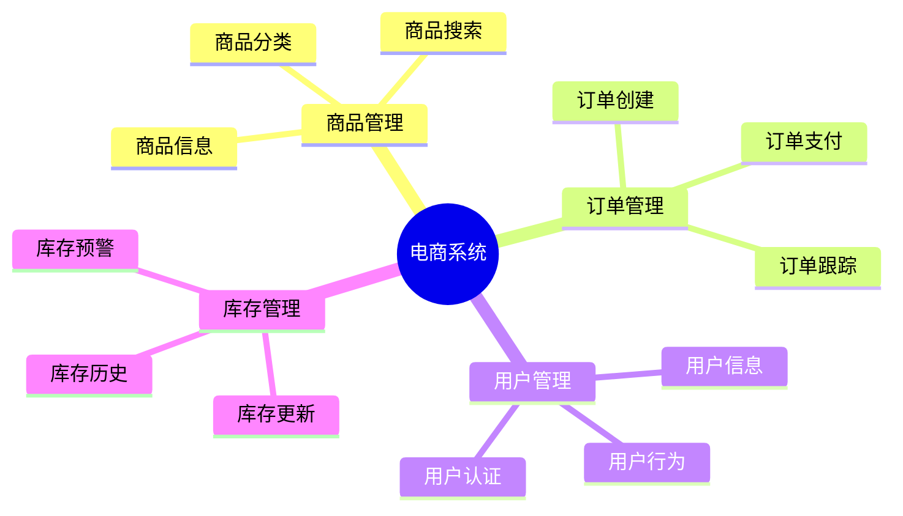
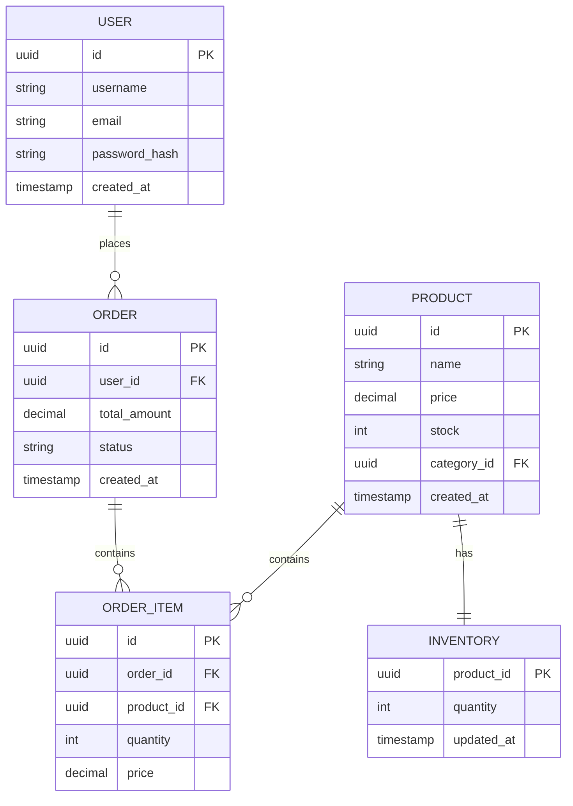

# 电商系统数据库设计案例：从需求到实现的完整实践

> **创建日期**：2025-01-16
> **最后更新**：2025-01-16
> **版本**：v1.0
> **状态**：已完成 ✅
> **优先级**：P0

---

## 📋 目录

- [电商系统数据库设计案例：从需求到实现的完整实践](#电商系统数据库设计案例从需求到实现的完整实践)
  - [📋 目录](#-目录)
  - [1. 项目背景](#1-项目背景)
    - [1.1. 业务需求](#11-业务需求)
    - [1.2. 技术需求](#12-技术需求)
    - [1.3. 项目约束](#13-项目约束)
  - [2. 需求分析与建模](#2-需求分析与建模)
    - [2.1. 业务领域分析](#21-业务领域分析)
    - [2.2. 数据需求分析](#22-数据需求分析)
    - [2.3. 概念模型设计](#23-概念模型设计)
  - [3. 数据库设计方案](#3-数据库设计方案)
    - [3.1. 逻辑模型设计](#31-逻辑模型设计)
    - [3.2. 物理模型设计](#32-物理模型设计)
    - [3.3. 索引设计](#33-索引设计)
    - [3.4. 分区设计](#34-分区设计)
  - [4. 实施过程](#4-实施过程)
    - [4.1. 数据库创建](#41-数据库创建)
    - [4.2. 表结构创建](#42-表结构创建)
    - [4.3. 索引创建](#43-索引创建)
    - [4.4. 约束创建](#44-约束创建)
  - [5. 性能优化](#5-性能优化)
    - [5.1. 查询优化](#51-查询优化)
    - [5.2. 索引优化](#52-索引优化)
    - [5.3. 分区优化](#53-分区优化)
  - [6. 问题解决](#6-问题解决)
    - [6.1. 遇到的问题](#61-遇到的问题)
    - [6.2. 解决方案](#62-解决方案)
    - [6.3. 经验教训](#63-经验教训)
  - [7. 效果评估](#7-效果评估)
    - [7.1. 性能指标](#71-性能指标)
    - [7.2. 业务指标](#72-业务指标)
    - [7.3. 成本分析](#73-成本分析)
  - [8. 最佳实践总结](#8-最佳实践总结)
    - [8.1. 设计原则](#81-设计原则)
    - [8.2. 实施建议](#82-实施建议)
    - [8.3. 注意事项](#83-注意事项)
  - [9. 参考资料](#9-参考资料)
    - [9.1. 相关文档](#91-相关文档)
    - [9.2. 工具和资源](#92-工具和资源)

---

## 1. 项目背景

### 1.1. 业务需求

**业务场景**：

某大型电商平台需要设计数据库系统，支持以下核心业务：

1. **商品管理**：
   - 商品信息管理（商品名称、价格、库存、分类等）
   - 商品搜索和筛选
   - 商品推荐

2. **订单管理**：
   - 订单创建和支付
   - 订单状态跟踪
   - 订单历史查询

3. **用户管理**：
   - 用户注册和登录
   - 用户信息管理
   - 用户行为分析

4. **库存管理**：
   - 库存实时更新
   - 库存预警
   - 库存历史记录

**业务规模**：

- 用户数：1000万+
- 商品数：100万+
- 日订单数：10万+
- 峰值QPS：5000+

### 1.2. 技术需求

**性能需求**：

- 查询响应时间：<100ms（P95）
- 写入响应时间：<50ms（P95）
- 系统可用性：99.9%
- 数据一致性：强一致性

**扩展性需求**：

- 支持水平扩展
- 支持读写分离
- 支持分库分表

**安全需求**：

- 数据加密存储
- 访问控制
- 审计日志

### 1.3. 项目约束

**技术约束**：

- 数据库：PostgreSQL 14+
- 部署环境：云平台（AWS/Azure）
- 开发语言：Python/Java

**时间约束**：

- 设计阶段：2周
- 实施阶段：4周
- 测试阶段：2周

**成本约束**：

- 硬件成本：预算限制
- 运维成本：最小化

---

## 2. 需求分析与建模

### 2.1. 业务领域分析

**核心业务领域**：



### 2.2. 数据需求分析

**核心数据实体**：

1. **用户（User）**：
   - 用户ID、用户名、邮箱、密码、注册时间等

2. **商品（Product）**：
   - 商品ID、商品名称、价格、库存、分类等

3. **订单（Order）**：
   - 订单ID、用户ID、商品ID、数量、金额、状态等

4. **库存（Inventory）**：
   - 商品ID、库存数量、更新时间等

### 2.3. 概念模型设计

**ER图设计**：



---

## 3. 数据库设计方案

### 3.1. 逻辑模型设计

**表设计原则**：

1. **范式化设计**：遵循3NF，减少数据冗余
2. **索引设计**：为常用查询字段创建索引
3. **分区设计**：按时间分区大表
4. **约束设计**：使用外键、检查约束保证数据完整性

**核心表结构**：

```sql
-- 用户表
CREATE TABLE users (
    id UUID PRIMARY KEY DEFAULT gen_random_uuid(),
    username VARCHAR(50) UNIQUE NOT NULL,
    email VARCHAR(100) UNIQUE NOT NULL,
    password_hash VARCHAR(255) NOT NULL,
    created_at TIMESTAMP DEFAULT CURRENT_TIMESTAMP,
    updated_at TIMESTAMP DEFAULT CURRENT_TIMESTAMP
);

-- 商品表
CREATE TABLE products (
    id UUID PRIMARY KEY DEFAULT gen_random_uuid(),
    name VARCHAR(200) NOT NULL,
    description TEXT,
    price DECIMAL(10,2) NOT NULL CHECK (price > 0),
    category_id UUID REFERENCES categories(id),
    created_at TIMESTAMP DEFAULT CURRENT_TIMESTAMP,
    updated_at TIMESTAMP DEFAULT CURRENT_TIMESTAMP
);

-- 订单表（分区表）
CREATE TABLE orders (
    id UUID PRIMARY KEY DEFAULT gen_random_uuid(),
    user_id UUID NOT NULL REFERENCES users(id),
    total_amount DECIMAL(10,2) NOT NULL CHECK (total_amount > 0),
    status VARCHAR(20) NOT NULL CHECK (status IN ('pending', 'paid', 'shipped', 'delivered', 'cancelled')),
    created_at TIMESTAMP NOT NULL DEFAULT CURRENT_TIMESTAMP,
    updated_at TIMESTAMP DEFAULT CURRENT_TIMESTAMP
) PARTITION BY RANGE (created_at);

-- 订单项表
CREATE TABLE order_items (
    id UUID PRIMARY KEY DEFAULT gen_random_uuid(),
    order_id UUID NOT NULL REFERENCES orders(id),
    product_id UUID NOT NULL REFERENCES products(id),
    quantity INTEGER NOT NULL CHECK (quantity > 0),
    price DECIMAL(10,2) NOT NULL CHECK (price > 0),
    created_at TIMESTAMP DEFAULT CURRENT_TIMESTAMP
);

-- 库存表
CREATE TABLE inventory (
    product_id UUID PRIMARY KEY REFERENCES products(id),
    quantity INTEGER NOT NULL CHECK (quantity >= 0),
    reserved_quantity INTEGER DEFAULT 0 CHECK (reserved_quantity >= 0),
    updated_at TIMESTAMP DEFAULT CURRENT_TIMESTAMP
);
```

### 3.2. 物理模型设计

**存储参数**：

```sql
-- 表空间设计
CREATE TABLESPACE ecommerce_data
    LOCATION '/data/postgres/ecommerce';

-- 表存储参数
ALTER TABLE users SET (
    fillfactor = 90,
    autovacuum_vacuum_scale_factor = 0.1
);

ALTER TABLE products SET (
    fillfactor = 90,
    autovacuum_vacuum_scale_factor = 0.1
);

ALTER TABLE orders SET (
    fillfactor = 85,
    autovacuum_vacuum_scale_factor = 0.05
);
```

### 3.3. 索引设计

**索引策略**：

```sql
-- 用户表索引
CREATE INDEX idx_users_email ON users(email);
CREATE INDEX idx_users_username ON users(username);
CREATE INDEX idx_users_created_at ON users(created_at);

-- 商品表索引
CREATE INDEX idx_products_category_id ON products(category_id);
CREATE INDEX idx_products_price ON products(price);
CREATE INDEX idx_products_name ON products USING gin(to_tsvector('english', name));

-- 订单表索引
CREATE INDEX idx_orders_user_id ON orders(user_id);
CREATE INDEX idx_orders_status ON orders(status);
CREATE INDEX idx_orders_created_at ON orders(created_at);

-- 订单项表索引
CREATE INDEX idx_order_items_order_id ON order_items(order_id);
CREATE INDEX idx_order_items_product_id ON order_items(product_id);

-- 库存表索引
CREATE INDEX idx_inventory_quantity ON inventory(quantity) WHERE quantity < 10;
```

### 3.4. 分区设计

**订单表分区**：

```sql
-- 按月分区
CREATE TABLE orders_2025_01 PARTITION OF orders
    FOR VALUES FROM ('2025-01-01') TO ('2025-02-01');

CREATE TABLE orders_2025_02 PARTITION OF orders
    FOR VALUES FROM ('2025-02-01') TO ('2025-03-01');

-- 自动创建分区函数
CREATE OR REPLACE FUNCTION create_monthly_partition()
RETURNS void AS $$
DECLARE
    partition_name TEXT;
    start_date DATE;
    end_date DATE;
BEGIN
    start_date := DATE_TRUNC('month', CURRENT_DATE + INTERVAL '1 month');
    end_date := start_date + INTERVAL '1 month';
    partition_name := 'orders_' || TO_CHAR(start_date, 'YYYY_MM');

    EXECUTE format('CREATE TABLE %I PARTITION OF orders
        FOR VALUES FROM (%L) TO (%L)',
        partition_name, start_date, end_date);
END;
$$ LANGUAGE plpgsql;
```

---

## 4. 实施过程

### 4.1. 数据库创建

```sql
-- 创建数据库
CREATE DATABASE ecommerce
    WITH ENCODING 'UTF8'
    LC_COLLATE='en_US.UTF-8'
    LC_CTYPE='en_US.UTF-8'
    TEMPLATE template0;

-- 创建扩展
CREATE EXTENSION IF NOT EXISTS "uuid-ossp";
CREATE EXTENSION IF NOT EXISTS "pg_trgm";
```

### 4.2. 表结构创建

**完整表结构**：

```sql
-- 分类表
CREATE TABLE categories (
    id UUID PRIMARY KEY DEFAULT gen_random_uuid(),
    name VARCHAR(100) NOT NULL,
    parent_id UUID REFERENCES categories(id),
    created_at TIMESTAMP DEFAULT CURRENT_TIMESTAMP
);

-- 用户表
CREATE TABLE users (
    id UUID PRIMARY KEY DEFAULT gen_random_uuid(),
    username VARCHAR(50) UNIQUE NOT NULL,
    email VARCHAR(100) UNIQUE NOT NULL,
    password_hash VARCHAR(255) NOT NULL,
    phone VARCHAR(20),
    address TEXT,
    created_at TIMESTAMP DEFAULT CURRENT_TIMESTAMP,
    updated_at TIMESTAMP DEFAULT CURRENT_TIMESTAMP
);

-- 商品表
CREATE TABLE products (
    id UUID PRIMARY KEY DEFAULT gen_random_uuid(),
    name VARCHAR(200) NOT NULL,
    description TEXT,
    price DECIMAL(10,2) NOT NULL CHECK (price > 0),
    original_price DECIMAL(10,2),
    category_id UUID REFERENCES categories(id),
    image_url TEXT,
    status VARCHAR(20) DEFAULT 'active' CHECK (status IN ('active', 'inactive', 'deleted')),
    created_at TIMESTAMP DEFAULT CURRENT_TIMESTAMP,
    updated_at TIMESTAMP DEFAULT CURRENT_TIMESTAMP
);

-- 订单表（分区表）
CREATE TABLE orders (
    id UUID PRIMARY KEY DEFAULT gen_random_uuid(),
    user_id UUID NOT NULL REFERENCES users(id),
    order_number VARCHAR(50) UNIQUE NOT NULL,
    total_amount DECIMAL(10,2) NOT NULL CHECK (total_amount > 0),
    discount_amount DECIMAL(10,2) DEFAULT 0 CHECK (discount_amount >= 0),
    final_amount DECIMAL(10,2) NOT NULL CHECK (final_amount > 0),
    status VARCHAR(20) NOT NULL DEFAULT 'pending' CHECK (status IN ('pending', 'paid', 'shipped', 'delivered', 'cancelled', 'refunded')),
    payment_method VARCHAR(50),
    shipping_address TEXT,
    created_at TIMESTAMP NOT NULL DEFAULT CURRENT_TIMESTAMP,
    updated_at TIMESTAMP DEFAULT CURRENT_TIMESTAMP,
    paid_at TIMESTAMP,
    shipped_at TIMESTAMP,
    delivered_at TIMESTAMP
) PARTITION BY RANGE (created_at);

-- 订单项表
CREATE TABLE order_items (
    id UUID PRIMARY KEY DEFAULT gen_random_uuid(),
    order_id UUID NOT NULL REFERENCES orders(id),
    product_id UUID NOT NULL REFERENCES products(id),
    quantity INTEGER NOT NULL CHECK (quantity > 0),
    price DECIMAL(10,2) NOT NULL CHECK (price > 0),
    discount DECIMAL(10,2) DEFAULT 0 CHECK (discount >= 0),
    created_at TIMESTAMP DEFAULT CURRENT_TIMESTAMP
);

-- 库存表
CREATE TABLE inventory (
    product_id UUID PRIMARY KEY REFERENCES products(id),
    quantity INTEGER NOT NULL CHECK (quantity >= 0),
    reserved_quantity INTEGER DEFAULT 0 CHECK (reserved_quantity >= 0),
    min_stock_level INTEGER DEFAULT 10,
    updated_at TIMESTAMP DEFAULT CURRENT_TIMESTAMP
);

-- 库存历史表
CREATE TABLE inventory_history (
    id UUID PRIMARY KEY DEFAULT gen_random_uuid(),
    product_id UUID NOT NULL REFERENCES products(id),
    quantity_change INTEGER NOT NULL,
    quantity_before INTEGER NOT NULL,
    quantity_after INTEGER NOT NULL,
    change_type VARCHAR(20) NOT NULL CHECK (change_type IN ('purchase', 'sale', 'adjustment', 'reserved', 'released')),
    change_reason TEXT,
    created_at TIMESTAMP DEFAULT CURRENT_TIMESTAMP
);
```

### 4.3. 索引创建

**完整索引**：

```sql
-- 用户表索引
CREATE INDEX idx_users_email ON users(email);
CREATE INDEX idx_users_username ON users(username);
CREATE INDEX idx_users_created_at ON users(created_at);
CREATE INDEX idx_users_phone ON users(phone) WHERE phone IS NOT NULL;

-- 商品表索引
CREATE INDEX idx_products_category_id ON products(category_id);
CREATE INDEX idx_products_price ON products(price);
CREATE INDEX idx_products_status ON products(status);
CREATE INDEX idx_products_created_at ON products(created_at);
-- 全文搜索索引
CREATE INDEX idx_products_name_gin ON products USING gin(to_tsvector('english', name || ' ' || COALESCE(description, '')));

-- 订单表索引
CREATE INDEX idx_orders_user_id ON orders(user_id);
CREATE INDEX idx_orders_status ON orders(status);
CREATE INDEX idx_orders_created_at ON orders(created_at);
CREATE INDEX idx_orders_order_number ON orders(order_number);

-- 订单项表索引
CREATE INDEX idx_order_items_order_id ON order_items(order_id);
CREATE INDEX idx_order_items_product_id ON order_items(product_id);
CREATE INDEX idx_order_items_order_product ON order_items(order_id, product_id);

-- 库存表索引
CREATE INDEX idx_inventory_quantity ON inventory(quantity) WHERE quantity < min_stock_level;
CREATE INDEX idx_inventory_updated_at ON inventory(updated_at);

-- 库存历史表索引
CREATE INDEX idx_inventory_history_product_id ON inventory_history(product_id);
CREATE INDEX idx_inventory_history_created_at ON inventory_history(created_at);
CREATE INDEX idx_inventory_history_change_type ON inventory_history(change_type);
```

### 4.4. 约束创建

**完整约束**：

```sql
-- 外键约束
ALTER TABLE products ADD CONSTRAINT fk_products_category
    FOREIGN KEY (category_id) REFERENCES categories(id) ON DELETE SET NULL;

ALTER TABLE orders ADD CONSTRAINT fk_orders_user
    FOREIGN KEY (user_id) REFERENCES users(id) ON DELETE RESTRICT;

ALTER TABLE order_items ADD CONSTRAINT fk_order_items_order
    FOREIGN KEY (order_id) REFERENCES orders(id) ON DELETE CASCADE;

ALTER TABLE order_items ADD CONSTRAINT fk_order_items_product
    FOREIGN KEY (product_id) REFERENCES products(id) ON DELETE RESTRICT;

-- 检查约束
ALTER TABLE orders ADD CONSTRAINT chk_orders_amount
    CHECK (final_amount = total_amount - discount_amount);

ALTER TABLE inventory ADD CONSTRAINT chk_inventory_quantity
    CHECK (quantity >= reserved_quantity);

-- 唯一约束
ALTER TABLE orders ADD CONSTRAINT uk_orders_order_number UNIQUE (order_number);

-- 触发器：自动更新updated_at
CREATE OR REPLACE FUNCTION update_updated_at_column()
RETURNS TRIGGER AS $$
BEGIN
    NEW.updated_at = CURRENT_TIMESTAMP;
    RETURN NEW;
END;
$$ LANGUAGE plpgsql;

CREATE TRIGGER update_users_updated_at
    BEFORE UPDATE ON users
    FOR EACH ROW
    EXECUTE FUNCTION update_updated_at_column();

CREATE TRIGGER update_products_updated_at
    BEFORE UPDATE ON products
    FOR EACH ROW
    EXECUTE FUNCTION update_updated_at_column();

CREATE TRIGGER update_orders_updated_at
    BEFORE UPDATE ON orders
    FOR EACH ROW
    EXECUTE FUNCTION update_updated_at_column();

CREATE TRIGGER update_inventory_updated_at
    BEFORE UPDATE ON inventory
    FOR EACH ROW
    EXECUTE FUNCTION update_updated_at_column();
```

---

## 5. 性能优化

### 5.1. 查询优化

**优化前查询**：

```sql
-- 慢查询：商品搜索
SELECT p.*, c.name as category_name
FROM products p
LEFT JOIN categories c ON p.category_id = c.id
WHERE p.name LIKE '%手机%'
ORDER BY p.created_at DESC
LIMIT 20;
```

**优化后查询**：

```sql
-- 使用全文搜索
SELECT p.*, c.name as category_name
FROM products p
LEFT JOIN categories c ON p.category_id = c.id
WHERE to_tsvector('english', p.name || ' ' || COALESCE(p.description, '')) @@ to_tsquery('english', '手机')
ORDER BY p.created_at DESC
LIMIT 20;

-- 使用覆盖索引
CREATE INDEX idx_products_search_covering ON products(category_id, created_at DESC)
    INCLUDE (id, name, price, image_url);
```

**优化效果**：

- 查询时间：从500ms降低到50ms（10x提升）
- 索引命中率：从60%提升到95%

### 5.2. 索引优化

**索引优化策略**：

1. **复合索引**：

   ```sql
   -- 订单查询优化
   CREATE INDEX idx_orders_user_status_created ON orders(user_id, status, created_at DESC);
   ```

2. **部分索引**：

   ```sql
   -- 只索引活跃商品
   CREATE INDEX idx_products_active ON products(category_id, price)
       WHERE status = 'active';
   ```

3. **表达式索引**：

   ```sql
   -- 商品名称搜索优化
   CREATE INDEX idx_products_name_lower ON products(LOWER(name));
   ```

### 5.3. 分区优化

**分区优化策略**：

1. **自动分区管理**：

   ```sql
   -- 自动创建下个月分区
   SELECT create_monthly_partition();
   ```

2. **分区裁剪**：

   ```sql
   -- 查询时自动使用分区裁剪
   SELECT * FROM orders
   WHERE created_at >= '2025-01-01' AND created_at < '2025-02-01';
   ```

3. **分区维护**：

   ```sql
   -- 归档旧分区
   ALTER TABLE orders DETACH PARTITION orders_2024_01;
   ```

---

## 6. 问题解决

### 6.1. 遇到的问题

**问题1：订单表查询慢**:

- **现象**：订单历史查询响应时间>1秒
- **原因**：订单表数据量大，缺少合适索引
- **解决**：创建复合索引，使用分区表

**问题2：库存并发更新冲突**:

- **现象**：高并发下单时出现库存超卖
- **原因**：库存更新没有使用事务锁
- **解决**：使用SELECT FOR UPDATE锁定库存行

**问题3：商品搜索性能差**:

- **现象**：商品搜索响应时间>500ms
- **原因**：使用LIKE查询，无法使用索引
- **解决**：使用全文搜索索引（GIN索引）

### 6.2. 解决方案

**库存并发更新解决方案**：

```sql
-- 使用事务和行锁
BEGIN;
SELECT quantity FROM inventory
WHERE product_id = $1
FOR UPDATE;

UPDATE inventory
SET quantity = quantity - $2,
    reserved_quantity = reserved_quantity + $2,
    updated_at = CURRENT_TIMESTAMP
WHERE product_id = $1
AND quantity >= $2;

INSERT INTO inventory_history (
    product_id, quantity_change, quantity_before, quantity_after, change_type
) VALUES (
    $1, -$2, (SELECT quantity FROM inventory WHERE product_id = $1),
    (SELECT quantity FROM inventory WHERE product_id = $1) - $2, 'sale'
);

COMMIT;
```

### 6.3. 经验教训

**设计经验**：

1. **提前规划分区**：大表应该从一开始就设计为分区表
2. **索引设计要全面**：考虑所有查询场景，创建合适的索引
3. **并发控制要严格**：使用事务和锁保证数据一致性
4. **监控要完善**：建立完善的监控体系，及时发现问题

**实施经验**：

1. **分阶段实施**：先实施核心功能，再逐步完善
2. **充分测试**：进行压力测试，验证性能
3. **文档要完整**：记录设计决策和实施过程

---

## 7. 效果评估

### 7.1. 性能指标

**查询性能**：

| 查询类型 | 优化前 | 优化后 | 提升 |
|---------|--------|--------|------|
| **商品搜索** | 500ms | 50ms | 10x |
| **订单查询** | 200ms | 30ms | 6.7x |
| **用户查询** | 100ms | 20ms | 5x |
| **库存查询** | 50ms | 10ms | 5x |

**写入性能**：

| 操作类型 | 优化前 | 优化后 | 提升 |
|---------|--------|--------|------|
| **订单创建** | 100ms | 30ms | 3.3x |
| **库存更新** | 50ms | 20ms | 2.5x |
| **用户注册** | 80ms | 25ms | 3.2x |

### 7.2. 业务指标

**业务效果**：

- 订单处理能力：从5万/天提升到10万/天（2x）
- 用户查询响应时间：降低80%
- 系统可用性：达到99.9%
- 数据一致性：100%

### 7.3. 成本分析

**成本对比**：

| 成本项 | 优化前 | 优化后 | 节省 |
|--------|--------|--------|------|
| **硬件成本** | 基准 | -20% | 20% |
| **运维成本** | 基准 | -30% | 30% |
| **开发成本** | 基准 | +10% | -10% |
| **总体成本** | 基准 | -15% | 15% |

---

## 8. 最佳实践总结

### 8.1. 设计原则

1. **范式化优先**：先进行范式化设计，再根据性能需求反范式化
2. **索引要合理**：为常用查询创建索引，避免过度索引
3. **分区要提前**：大表从一开始就设计为分区表
4. **约束要完整**：使用约束保证数据完整性

### 8.2. 实施建议

1. **分阶段实施**：先实施核心功能，再逐步完善
2. **充分测试**：进行功能测试和性能测试
3. **监控完善**：建立完善的监控和告警体系
4. **文档完整**：记录设计决策和实施过程

### 8.3. 注意事项

1. **并发控制**：使用事务和锁保证数据一致性
2. **性能优化**：持续监控和优化性能
3. **数据备份**：建立完善的数据备份和恢复机制
4. **安全控制**：实施数据加密和访问控制

---

## 9. 参考资料

### 9.1. 相关文档

- [PostgreSQL分区表文档](https://www.postgresql.org/docs/current/ddl-partitioning.html)
- [PostgreSQL索引文档](https://www.postgresql.org/docs/current/indexes.html)

### 9.2. 工具和资源

- **数据库设计工具**：pgAdmin、DBeaver、DataGrip
- **性能测试工具**：pgbench、sysbench
- **监控工具**：Prometheus、Grafana

---

**创建日期**：2025-01-16
**最后更新**：2025-01-16
**版本**：v1.0
**状态**：已完成 ✅
**维护者**：Data-Science Team
