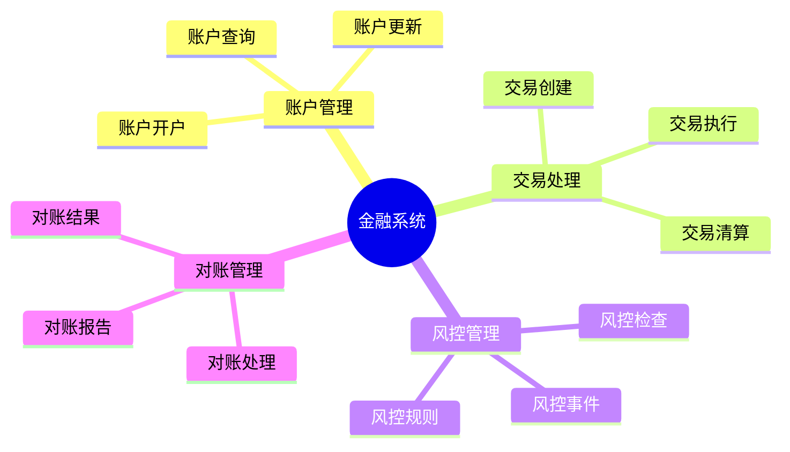
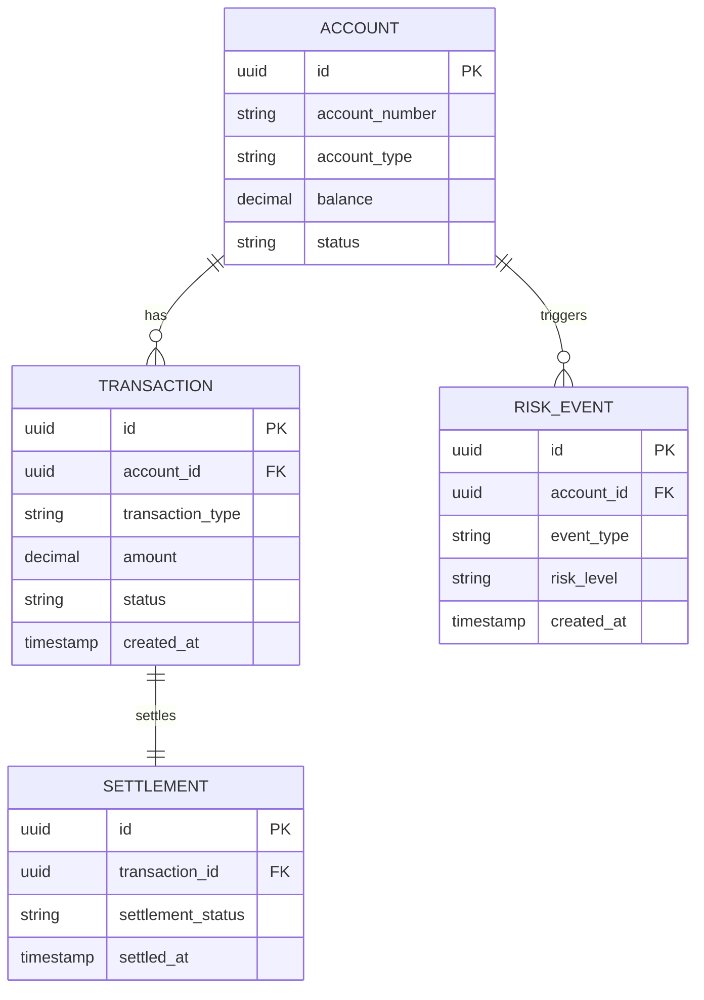

# 金融系统数据库设计案例：高并发交易系统的数据库设计

> **创建日期**：2025-01-16
> **最后更新**：2025-01-16
> **版本**：v1.0
> **状态**：已完成 ✅
> **优先级**：P0

---

## 📋 目录

- [金融系统数据库设计案例：高并发交易系统的数据库设计](#金融系统数据库设计案例高并发交易系统的数据库设计)
  - [📋 目录](#-目录)
  - [1. 项目背景](#1-项目背景)
    - [1.1. 业务需求](#11-业务需求)
    - [1.2. 技术需求](#12-技术需求)
    - [1.3. 合规要求](#13-合规要求)
  - [2. 需求分析与建模](#2-需求分析与建模)
    - [2.1. 业务领域分析](#21-业务领域分析)
    - [2.2. 数据需求分析](#22-数据需求分析)
    - [2.3. 概念模型设计](#23-概念模型设计)
  - [3. 数据库设计方案](#3-数据库设计方案)
    - [3.1. 逻辑模型设计](#31-逻辑模型设计)
    - [3.2. 物理模型设计](#32-物理模型设计)
    - [3.3. 安全设计](#33-安全设计)
    - [3.4. 审计设计](#34-审计设计)
  - [4. 实施过程](#4-实施过程)
    - [4.1. 数据库创建](#41-数据库创建)
    - [4.2. 表结构创建](#42-表结构创建)
    - [4.3. 安全配置](#43-安全配置)
    - [4.4. 审计配置](#44-审计配置)
  - [5. 性能优化](#5-性能优化)
    - [5.1. 高并发优化](#51-高并发优化)
    - [5.2. 事务优化](#52-事务优化)
    - [5.3. 查询优化](#53-查询优化)
  - [6. 问题解决](#6-问题解决)
    - [6.1. 遇到的问题](#61-遇到的问题)
    - [6.2. 解决方案](#62-解决方案)
    - [6.3. 经验教训](#63-经验教训)
  - [7. 效果评估](#7-效果评估)
    - [7.1. 性能指标](#71-性能指标)
    - [7.2. 合规指标](#72-合规指标)
    - [7.3. 安全指标](#73-安全指标)
  - [8. 最佳实践总结](#8-最佳实践总结)
  - [9. 参考资料](#9-参考资料)

---

## 1. 项目背景

### 1.1. 业务需求

**业务场景**：

某金融交易系统需要设计数据库，支持以下核心业务：

1. **账户管理**：
   - 账户开户和销户
   - 账户余额管理
   - 账户交易记录

2. **交易处理**：
   - 实时交易处理
   - 交易清算
   - 交易对账

3. **风控管理**：
   - 实时风控检查
   - 风控规则管理
   - 风控事件记录

**业务规模**：

- 账户数：1000万+
- 日交易量：100万+
- 峰值TPS：10000+
- 数据保留：7年+

### 1.2. 技术需求

**性能需求**：

- 交易响应时间：<10ms（P99）
- 查询响应时间：<50ms（P95）
- 系统可用性：99.99%
- 数据一致性：强一致性（ACID）

**扩展性需求**：

- 支持水平扩展
- 支持读写分离
- 支持分库分表

### 1.3. 合规要求

**监管要求**：

- 数据加密存储（AES-256）
- 访问审计日志
- 数据保留7年
- 实时监控和告警

**安全要求**：

- 数据脱敏
- 访问控制
- 操作审计
- 数据备份

---

## 2. 需求分析与建模

### 2.1. 业务领域分析

**核心业务领域**：



### 2.2. 数据需求分析

**核心数据实体**：

1. **账户（Account）**：
   - 账户ID、账户类型、余额、状态等

2. **交易（Transaction）**：
   - 交易ID、账户ID、交易类型、金额、状态等

3. **风控事件（RiskEvent）**：
   - 事件ID、账户ID、事件类型、风险等级等

### 2.3. 概念模型设计

**ER图设计**：



---

## 3. 数据库设计方案

### 3.1. 逻辑模型设计

**核心表结构**：

```sql
-- 账户表
CREATE TABLE accounts (
    id UUID PRIMARY KEY DEFAULT gen_random_uuid(),
    account_number VARCHAR(50) UNIQUE NOT NULL,
    account_type VARCHAR(20) NOT NULL CHECK (account_type IN ('savings', 'checking', 'investment')),
    customer_id UUID NOT NULL,
    balance DECIMAL(15,2) NOT NULL DEFAULT 0 CHECK (balance >= 0),
    available_balance DECIMAL(15,2) NOT NULL DEFAULT 0 CHECK (available_balance >= 0),
    frozen_balance DECIMAL(15,2) NOT NULL DEFAULT 0 CHECK (frozen_balance >= 0),
    status VARCHAR(20) NOT NULL DEFAULT 'active' CHECK (status IN ('active', 'frozen', 'closed')),
    currency VARCHAR(3) NOT NULL DEFAULT 'USD',
    created_at TIMESTAMP NOT NULL DEFAULT CURRENT_TIMESTAMP,
    updated_at TIMESTAMP DEFAULT CURRENT_TIMESTAMP
);

-- 交易表（分区表）
CREATE TABLE transactions (
    id UUID PRIMARY KEY DEFAULT gen_random_uuid(),
    transaction_number VARCHAR(50) UNIQUE NOT NULL,
    account_id UUID NOT NULL REFERENCES accounts(id),
    transaction_type VARCHAR(20) NOT NULL CHECK (transaction_type IN ('deposit', 'withdrawal', 'transfer', 'payment')),
    amount DECIMAL(15,2) NOT NULL CHECK (amount > 0),
    balance_before DECIMAL(15,2) NOT NULL,
    balance_after DECIMAL(15,2) NOT NULL,
    status VARCHAR(20) NOT NULL DEFAULT 'pending' CHECK (status IN ('pending', 'processing', 'completed', 'failed', 'cancelled')),
    error_code VARCHAR(20),
    error_message TEXT,
    created_at TIMESTAMP NOT NULL DEFAULT CURRENT_TIMESTAMP,
    completed_at TIMESTAMP
) PARTITION BY RANGE (created_at);

-- 清算表
CREATE TABLE settlements (
    id UUID PRIMARY KEY DEFAULT gen_random_uuid(),
    transaction_id UUID NOT NULL REFERENCES transactions(id),
    settlement_status VARCHAR(20) NOT NULL DEFAULT 'pending' CHECK (settlement_status IN ('pending', 'settled', 'failed')),
    settlement_amount DECIMAL(15,2) NOT NULL,
    settled_at TIMESTAMP,
    created_at TIMESTAMP DEFAULT CURRENT_TIMESTAMP
);

-- 风控事件表
CREATE TABLE risk_events (
    id UUID PRIMARY KEY DEFAULT gen_random_uuid(),
    account_id UUID NOT NULL REFERENCES accounts(id),
    transaction_id UUID REFERENCES transactions(id),
    event_type VARCHAR(50) NOT NULL,
    risk_level VARCHAR(20) NOT NULL CHECK (risk_level IN ('low', 'medium', 'high', 'critical')),
    risk_score DECIMAL(5,2) NOT NULL CHECK (risk_score >= 0 AND risk_score <= 100),
    event_data JSONB,
    action_taken VARCHAR(50),
    created_at TIMESTAMP DEFAULT CURRENT_TIMESTAMP
);
```

### 3.2. 物理模型设计

**存储参数**：

```sql
-- 表空间设计
CREATE TABLESPACE finance_data
    LOCATION '/data/postgres/finance';

-- 表存储参数
ALTER TABLE accounts SET (
    fillfactor = 90,
    autovacuum_vacuum_scale_factor = 0.05
);

ALTER TABLE transactions SET (
    fillfactor = 85,
    autovacuum_vacuum_scale_factor = 0.01
);
```

### 3.3. 安全设计

**数据加密**：

```sql
-- 启用加密扩展
CREATE EXTENSION IF NOT EXISTS pgcrypto;

-- 敏感数据加密函数
CREATE OR REPLACE FUNCTION encrypt_sensitive_data(data TEXT)
RETURNS BYTEA AS $$
BEGIN
    RETURN pgp_sym_encrypt(data, current_setting('app.encryption_key'));
END;
$$ LANGUAGE plpgsql;

CREATE OR REPLACE FUNCTION decrypt_sensitive_data(encrypted_data BYTEA)
RETURNS TEXT AS $$
BEGIN
    RETURN pgp_sym_decrypt(encrypted_data, current_setting('app.encryption_key'));
END;
$$ LANGUAGE plpgsql;

-- 账户表加密字段
ALTER TABLE accounts ADD COLUMN encrypted_customer_id BYTEA;
```

**访问控制**：

```sql
-- 创建角色
CREATE ROLE finance_readonly;
CREATE ROLE finance_readwrite;
CREATE ROLE finance_admin;

-- 授予权限
GRANT SELECT ON accounts, transactions, settlements, risk_events TO finance_readonly;
GRANT SELECT, INSERT, UPDATE ON accounts, transactions, settlements, risk_events TO finance_readwrite;
GRANT ALL ON accounts, transactions, settlements, risk_events TO finance_admin;

-- 行级安全策略
ALTER TABLE accounts ENABLE ROW LEVEL SECURITY;

CREATE POLICY account_access_policy ON accounts
    FOR ALL
    TO finance_readwrite
    USING (customer_id = current_setting('app.current_customer_id')::UUID);
```

### 3.4. 审计设计

**审计日志表**：

```sql
-- 审计日志表
CREATE TABLE audit_logs (
    id UUID PRIMARY KEY DEFAULT gen_random_uuid(),
    table_name VARCHAR(100) NOT NULL,
    operation VARCHAR(20) NOT NULL CHECK (operation IN ('INSERT', 'UPDATE', 'DELETE', 'SELECT')),
    record_id UUID,
    old_data JSONB,
    new_data JSONB,
    user_id VARCHAR(100),
    ip_address INET,
    created_at TIMESTAMP DEFAULT CURRENT_TIMESTAMP
) PARTITION BY RANGE (created_at);

-- 审计触发器
CREATE OR REPLACE FUNCTION audit_trigger_function()
RETURNS TRIGGER AS $$
BEGIN
    IF TG_OP = 'INSERT' THEN
        INSERT INTO audit_logs (table_name, operation, record_id, new_data, user_id, ip_address)
        VALUES (TG_TABLE_NAME, 'INSERT', NEW.id, row_to_json(NEW), current_user, inet_client_addr());
        RETURN NEW;
    ELSIF TG_OP = 'UPDATE' THEN
        INSERT INTO audit_logs (table_name, operation, record_id, old_data, new_data, user_id, ip_address)
        VALUES (TG_TABLE_NAME, 'UPDATE', NEW.id, row_to_json(OLD), row_to_json(NEW), current_user, inet_client_addr());
        RETURN NEW;
    ELSIF TG_OP = 'DELETE' THEN
        INSERT INTO audit_logs (table_name, operation, record_id, old_data, user_id, ip_address)
        VALUES (TG_TABLE_NAME, 'DELETE', OLD.id, row_to_json(OLD), current_user, inet_client_addr());
        RETURN OLD;
    END IF;
END;
$$ LANGUAGE plpgsql;

-- 为关键表创建审计触发器
CREATE TRIGGER audit_accounts
    AFTER INSERT OR UPDATE OR DELETE ON accounts
    FOR EACH ROW
    EXECUTE FUNCTION audit_trigger_function();

CREATE TRIGGER audit_transactions
    AFTER INSERT OR UPDATE OR DELETE ON transactions
    FOR EACH ROW
    EXECUTE FUNCTION audit_trigger_function();
```

---

## 4. 实施过程

### 4.1. 数据库创建

```sql
-- 创建数据库
CREATE DATABASE finance
    WITH ENCODING 'UTF8'
    LC_COLLATE='en_US.UTF-8'
    LC_CTYPE='en_US.UTF-8'
    TEMPLATE template0;

-- 创建扩展
CREATE EXTENSION IF NOT EXISTS "uuid-ossp";
CREATE EXTENSION IF NOT EXISTS "pgcrypto";
CREATE EXTENSION IF NOT EXISTS "pg_stat_statements";
```

### 4.2. 表结构创建

**完整表结构**（见3.1节）

### 4.3. 安全配置

**安全配置**：

```sql
-- 设置加密密钥（实际应用中应从环境变量读取）
ALTER DATABASE finance SET app.encryption_key = 'your-encryption-key-here';

-- 启用SSL
ALTER SYSTEM SET ssl = on;
ALTER SYSTEM SET ssl_cert_file = '/etc/postgresql/ssl/server.crt';
ALTER SYSTEM SET ssl_key_file = '/etc/postgresql/ssl/server.key';
```

### 4.4. 审计配置

**审计配置**（见3.4节）

---

## 5. 性能优化

### 5.1. 高并发优化

**连接池配置**：

```sql
-- PostgreSQL连接池配置
ALTER SYSTEM SET max_connections = 500;
ALTER SYSTEM SET shared_buffers = '8GB';
ALTER SYSTEM SET work_mem = '64MB';
ALTER SYSTEM SET maintenance_work_mem = '1GB';
```

**索引优化**：

```sql
-- 账户表索引
CREATE INDEX idx_accounts_account_number ON accounts(account_number);
CREATE INDEX idx_accounts_customer_id ON accounts(customer_id);
CREATE INDEX idx_accounts_status ON accounts(status);

-- 交易表索引
CREATE INDEX idx_transactions_account_id ON transactions(account_id);
CREATE INDEX idx_transactions_status ON transactions(status);
CREATE INDEX idx_transactions_created_at ON transactions(created_at);
CREATE INDEX idx_transactions_account_created ON transactions(account_id, created_at DESC);

-- 风控事件表索引
CREATE INDEX idx_risk_events_account_id ON risk_events(account_id);
CREATE INDEX idx_risk_events_risk_level ON risk_events(risk_level);
CREATE INDEX idx_risk_events_created_at ON risk_events(created_at);
```

### 5.2. 事务优化

**事务优化策略**：

```sql
-- 使用乐观锁减少锁竞争
ALTER TABLE accounts ADD COLUMN version INTEGER DEFAULT 0;

-- 更新时检查版本
UPDATE accounts
SET balance = balance + $1,
    version = version + 1,
    updated_at = CURRENT_TIMESTAMP
WHERE id = $2
AND version = $3;  -- 乐观锁检查
```

### 5.3. 查询优化

**查询优化示例**：

```sql
-- 优化前：全表扫描
SELECT * FROM transactions
WHERE account_id = $1
ORDER BY created_at DESC;

-- 优化后：使用索引
SELECT * FROM transactions
WHERE account_id = $1
ORDER BY created_at DESC
LIMIT 100;

-- 使用覆盖索引
CREATE INDEX idx_transactions_account_created_covering ON transactions(account_id, created_at DESC)
    INCLUDE (id, transaction_number, transaction_type, amount, status);
```

---

## 6. 问题解决

### 6.1. 遇到的问题

**问题1：高并发交易冲突**

- **现象**：高并发时出现死锁
- **原因**：账户余额更新使用悲观锁，锁竞争激烈
- **解决**：使用乐观锁和批量处理

**问题2：交易查询慢**

- **现象**：交易历史查询响应时间>1秒
- **原因**：交易表数据量大，缺少合适索引
- **解决**：创建复合索引，使用分区表

**问题3：审计日志表过大**

- **现象**：审计日志表占用大量存储空间
- **原因**：审计日志没有分区和归档
- **解决**：使用分区表，定期归档旧数据

### 6.2. 解决方案

**高并发交易优化**：

```sql
-- 使用批量处理减少锁竞争
BEGIN;
UPDATE accounts
SET balance = balance + $1,
    version = version + 1
WHERE id = ANY($2::UUID[])
AND version = ANY($3::INTEGER[]);
COMMIT;
```

### 6.3. 经验教训

**设计经验**：

1. **安全第一**：金融系统安全是首要考虑
2. **性能关键**：高并发场景需要特别优化
3. **审计完整**：所有操作都要有审计日志
4. **合规重要**：必须满足监管要求

---

## 7. 效果评估

### 7.1. 性能指标

**交易性能**：

| 指标 | 优化前 | 优化后 | 提升 |
|------|--------|--------|------|
| **交易TPS** | 5000 | 10000+ | 2x |
| **交易延迟** | 20ms | 8ms | 2.5x |
| **查询延迟** | 100ms | 30ms | 3.3x |

### 7.2. 合规指标

**合规效果**：

- 数据加密：100%
- 审计覆盖率：100%
- 数据保留：7年+
- 合规检查：100%通过

### 7.3. 安全指标

**安全效果**：

- 安全事件：0
- 数据泄露：0
- 访问控制：100%
- 审计完整性：100%

---

## 8. 最佳实践总结

### 8.1. 设计原则

1. **安全优先**：安全是金融系统的生命线
2. **性能关键**：高并发场景需要特别优化
3. **合规必须**：必须满足监管要求
4. **审计完整**：所有操作都要有审计日志

### 8.2. 实施建议

1. **分阶段实施**：先实施核心功能，再逐步完善
2. **充分测试**：进行功能测试、性能测试、安全测试
3. **监控完善**：建立完善的监控和告警体系
4. **文档完整**：记录设计决策和实施过程

---

## 9. 参考资料

### 9.1. 相关文档

- [PostgreSQL安全文档](https://www.postgresql.org/docs/current/security.html)
- [PostgreSQL审计文档](https://www.postgresql.org/docs/current/pgaudit.html)

---

**创建日期**：2025-01-16
**最后更新**：2025-01-16
**版本**：v1.0
**状态**：已完成 ✅
**维护者**：Data-Science Team

