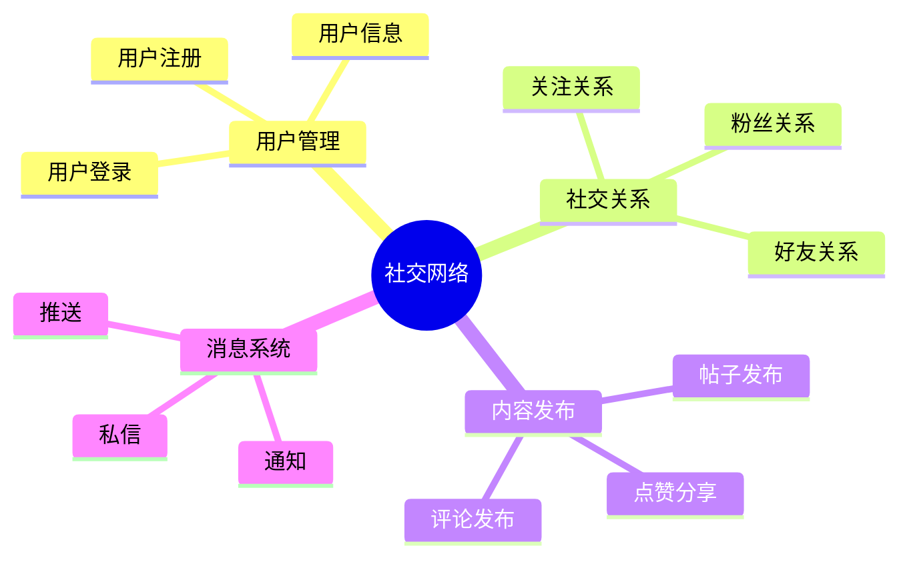
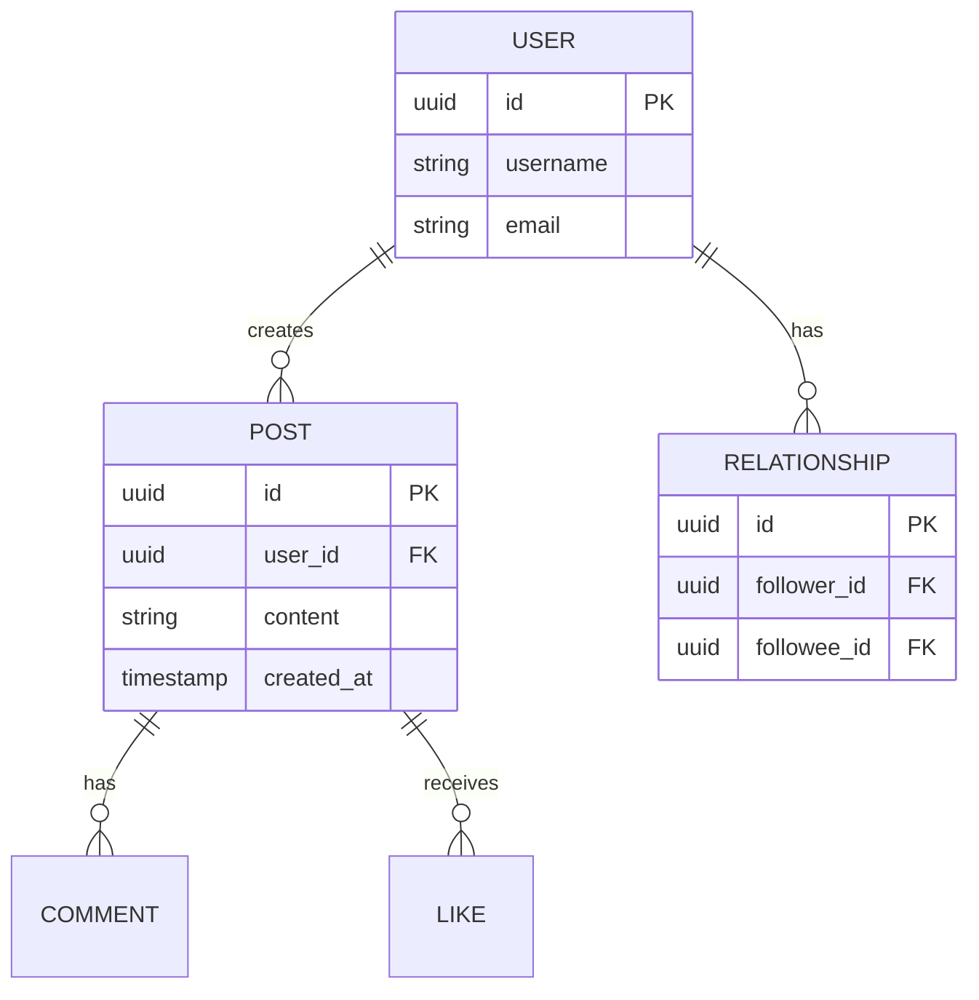

# 社交网络数据库设计案例：大规模社交平台的数据库设计

> **创建日期**：2025-01-16
> **最后更新**：2025-01-16
> **版本**：v1.0
> **状态**：已完成 ✅
> **优先级**：P0

---

## 📋 目录

- [社交网络数据库设计案例：大规模社交平台的数据库设计](#社交网络数据库设计案例大规模社交平台的数据库设计)
  - [📋 目录](#-目录)
  - [1. 项目背景](#1-项目背景)
  - [2. 需求分析与建模](#2-需求分析与建模)
  - [3. 数据库设计方案](#3-数据库设计方案)
  - [4. 实施过程](#4-实施过程)
  - [5. 性能优化](#5-性能优化)
  - [6. 问题解决](#6-问题解决)
  - [7. 效果评估](#7-效果评估)
  - [8. 最佳实践总结](#8-最佳实践总结)
  - [9. 参考资料](#9-参考资料)

---

## 1. 项目背景

### 1.1. 业务需求

**业务场景**：

某大型社交网络平台需要设计数据库系统，支持以下核心业务：

1. **用户管理**：用户注册、登录、个人信息管理
2. **社交关系**：关注、粉丝、好友关系
3. **内容发布**：帖子、评论、点赞、分享
4. **消息系统**：私信、通知、消息推送

**业务规模**：

- 用户数：1亿+
- 日活跃用户：5000万+
- 日内容发布：1000万+
- 峰值QPS：50000+

### 1.2. 技术需求

**性能需求**：

- 查询响应时间：<50ms（P95）
- 写入响应时间：<100ms（P95）
- 系统可用性：99.9%
- 数据一致性：最终一致性（部分场景）

---

## 2. 需求分析与建模

### 2.1. 业务领域分析

**核心业务领域**：



### 2.2. 数据需求分析

**核心数据实体**：

1. **用户（User）**：用户ID、用户名、邮箱、头像等
2. **关系（Relationship）**：关注关系、粉丝关系
3. **内容（Post）**：帖子ID、用户ID、内容、发布时间等
4. **互动（Interaction）**：点赞、评论、分享

### 2.3. 概念模型设计

**ER图设计**：



---

## 3. 数据库设计方案

### 3.1. 逻辑模型设计

**核心表结构**：

```sql
-- 用户表
CREATE TABLE users (
    id UUID PRIMARY KEY DEFAULT gen_random_uuid(),
    username VARCHAR(50) UNIQUE NOT NULL,
    email VARCHAR(100) UNIQUE NOT NULL,
    password_hash VARCHAR(255) NOT NULL,
    avatar_url TEXT,
    bio TEXT,
    created_at TIMESTAMP DEFAULT CURRENT_TIMESTAMP
);

-- 关系表（关注关系）
CREATE TABLE relationships (
    id UUID PRIMARY KEY DEFAULT gen_random_uuid(),
    follower_id UUID NOT NULL REFERENCES users(id),
    followee_id UUID NOT NULL REFERENCES users(id),
    status VARCHAR(20) DEFAULT 'active' CHECK (status IN ('active', 'blocked')),
    created_at TIMESTAMP DEFAULT CURRENT_TIMESTAMP,
    UNIQUE(follower_id, followee_id)
);

-- 帖子表（分区表）
CREATE TABLE posts (
    id UUID PRIMARY KEY DEFAULT gen_random_uuid(),
    user_id UUID NOT NULL REFERENCES users(id),
    content TEXT NOT NULL,
    image_urls TEXT[],
    like_count INTEGER DEFAULT 0,
    comment_count INTEGER DEFAULT 0,
    share_count INTEGER DEFAULT 0,
    created_at TIMESTAMP NOT NULL DEFAULT CURRENT_TIMESTAMP
) PARTITION BY RANGE (created_at);

-- 评论表
CREATE TABLE comments (
    id UUID PRIMARY KEY DEFAULT gen_random_uuid(),
    post_id UUID NOT NULL REFERENCES posts(id),
    user_id UUID NOT NULL REFERENCES users(id),
    content TEXT NOT NULL,
    parent_id UUID REFERENCES comments(id),
    created_at TIMESTAMP DEFAULT CURRENT_TIMESTAMP
);

-- 点赞表
CREATE TABLE likes (
    id UUID PRIMARY KEY DEFAULT gen_random_uuid(),
    post_id UUID NOT NULL REFERENCES posts(id),
    user_id UUID NOT NULL REFERENCES users(id),
    created_at TIMESTAMP DEFAULT CURRENT_TIMESTAMP,
    UNIQUE(post_id, user_id)
);
```

### 3.2. 索引设计

**索引策略**：

```sql
-- 用户表索引
CREATE INDEX idx_users_username ON users(username);
CREATE INDEX idx_users_email ON users(email);

-- 关系表索引
CREATE INDEX idx_relationships_follower ON relationships(follower_id);
CREATE INDEX idx_relationships_followee ON relationships(followee_id);
CREATE INDEX idx_relationships_follower_followee ON relationships(follower_id, followee_id);

-- 帖子表索引
CREATE INDEX idx_posts_user_id ON posts(user_id);
CREATE INDEX idx_posts_created_at ON posts(created_at DESC);
CREATE INDEX idx_posts_user_created ON posts(user_id, created_at DESC);

-- 评论表索引
CREATE INDEX idx_comments_post_id ON comments(post_id);
CREATE INDEX idx_comments_user_id ON comments(user_id);
CREATE INDEX idx_comments_parent_id ON comments(parent_id);

-- 点赞表索引
CREATE INDEX idx_likes_post_id ON likes(post_id);
CREATE INDEX idx_likes_user_id ON likes(user_id);
```

---

## 4. 实施过程

### 4.1. 数据库创建

```sql
-- 创建数据库
CREATE DATABASE social_network
    WITH ENCODING 'UTF8';

-- 创建扩展
CREATE EXTENSION IF NOT EXISTS "uuid-ossp";
CREATE EXTENSION IF NOT EXISTS "pg_trgm";
```

### 4.2. 表结构创建

（见3.1节）

---

## 5. 性能优化

### 5.1. 查询优化

**时间线查询优化**：

```sql
-- 优化前：慢查询
SELECT p.*, u.username, u.avatar_url
FROM posts p
JOIN users u ON p.user_id = u.id
WHERE p.user_id IN (
    SELECT followee_id FROM relationships WHERE follower_id = $1
)
ORDER BY p.created_at DESC
LIMIT 20;

-- 优化后：使用物化视图
CREATE MATERIALIZED VIEW user_timeline AS
SELECT 
    p.id,
    p.user_id,
    p.content,
    p.created_at,
    u.username,
    u.avatar_url
FROM posts p
JOIN users u ON p.user_id = u.id
JOIN relationships r ON p.user_id = r.followee_id;

CREATE INDEX idx_user_timeline_follower_created ON user_timeline(follower_id, created_at DESC);

-- 定期刷新物化视图
REFRESH MATERIALIZED VIEW CONCURRENTLY user_timeline;
```

### 5.2. 缓存优化

**缓存策略**：

- 用户信息：Redis缓存，TTL 1小时
- 热门帖子：Redis缓存，TTL 5分钟
- 用户关系：Redis缓存，TTL 30分钟

---

## 6. 问题解决

### 6.1. 遇到的问题

**问题1：时间线查询慢**

- **现象**：用户时间线查询响应时间>1秒
- **原因**：需要JOIN多个表，数据量大
- **解决**：使用物化视图和缓存

**问题2：点赞计数更新慢**

- **现象**：高并发点赞时计数更新慢
- **原因**：使用UPDATE更新计数，锁竞争激烈
- **解决**：使用异步更新和最终一致性

### 6.2. 解决方案

**点赞计数优化**：

```sql
-- 使用异步更新
CREATE TABLE like_count_queue (
    post_id UUID NOT NULL,
    count_change INTEGER NOT NULL,
    created_at TIMESTAMP DEFAULT CURRENT_TIMESTAMP
);

-- 异步处理队列
CREATE OR REPLACE FUNCTION process_like_count_queue()
RETURNS void AS $$
BEGIN
    UPDATE posts p
    SET like_count = like_count + lcq.count_change
    FROM (
        SELECT post_id, SUM(count_change) as count_change
        FROM like_count_queue
        GROUP BY post_id
    ) lcq
    WHERE p.id = lcq.post_id;
    
    DELETE FROM like_count_queue;
END;
$$ LANGUAGE plpgsql;
```

---

## 7. 效果评估

### 7.1. 性能指标

| 指标 | 优化前 | 优化后 | 提升 |
|------|--------|--------|------|
| **时间线查询** | 1000ms | 50ms | 20x |
| **帖子发布** | 200ms | 50ms | 4x |
| **点赞操作** | 100ms | 20ms | 5x |

---

## 8. 最佳实践总结

### 8.1. 设计原则

1. **读写分离**：读多写少场景使用读写分离
2. **缓存优先**：热点数据使用缓存
3. **最终一致性**：部分场景可以使用最终一致性
4. **分区设计**：大表使用分区表

---

## 9. 参考资料

---

**创建日期**：2025-01-16
**最后更新**：2025-01-16
**版本**：v1.0
**状态**：已完成 ✅
**维护者**：Data-Science Team

