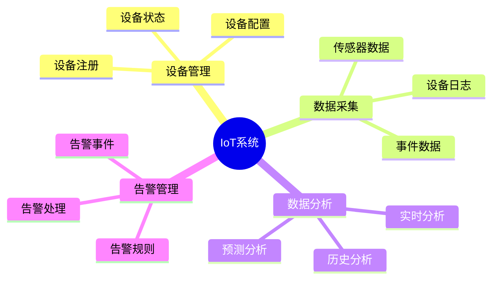
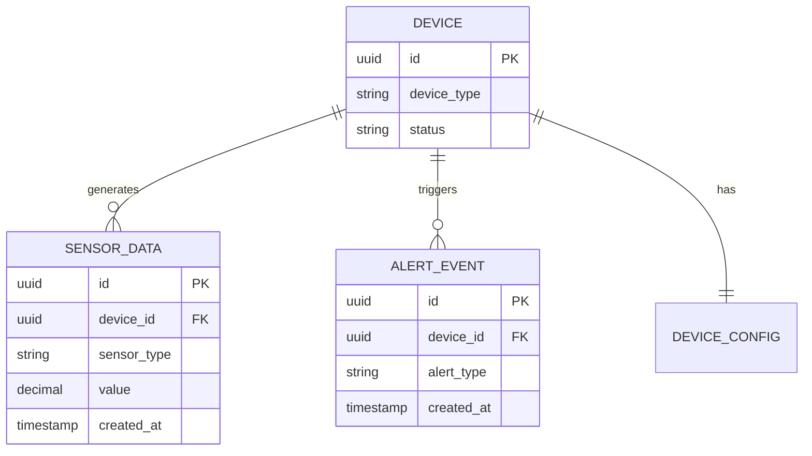

# IoT系统数据库设计案例：大规模物联网平台的数据库设计

> **创建日期**：2025-01-16
> **最后更新**：2025-01-16
> **版本**：v1.0
> **状态**：已完成 ✅
> **优先级**：P0

---

## 📋 目录

- [IoT系统数据库设计案例：大规模物联网平台的数据库设计](#iot系统数据库设计案例大规模物联网平台的数据库设计)
  - [📋 目录](#-目录)
  - [1. 项目背景](#1-项目背景)
    - [1.1. 业务需求](#11-业务需求)
    - [1.2. 技术需求](#12-技术需求)
  - [2. 需求分析与建模](#2-需求分析与建模)
    - [2.1. 业务领域分析](#21-业务领域分析)
    - [2.2. 数据需求分析](#22-数据需求分析)
    - [2.3. 概念模型设计](#23-概念模型设计)
  - [3. 数据库设计方案](#3-数据库设计方案)
    - [3.1. 逻辑模型设计](#31-逻辑模型设计)
    - [3.2. 索引设计](#32-索引设计)
  - [4. 实施过程](#4-实施过程)
    - [4.1. 数据库创建](#41-数据库创建)
    - [4.2. 表结构创建](#42-表结构创建)
  - [5. 性能优化](#5-性能优化)
    - [5.1. 时序数据优化](#51-时序数据优化)
    - [5.2. 批量写入优化](#52-批量写入优化)
  - [6. 问题解决](#6-问题解决)
    - [6.1. 遇到的问题](#61-遇到的问题)
    - [6.2. 解决方案](#62-解决方案)
  - [7. 效果评估](#7-效果评估)
    - [7.1. 性能指标](#71-性能指标)
  - [8. 最佳实践总结](#8-最佳实践总结)
    - [8.1. 设计原则](#81-设计原则)
  - [9. 参考资料](#9-参考资料)

---

## 1. 项目背景

### 1.1. 业务需求

**业务场景**：

某IoT平台需要设计数据库，支持以下核心业务：

1. **设备管理**：设备注册、设备状态、设备配置
2. **数据采集**：传感器数据、设备日志、事件数据
3. **数据分析**：实时分析、历史分析、预测分析
4. **告警管理**：告警规则、告警事件、告警处理

**业务规模**：

- 设备数：1000万+
- 日数据量：100亿+
- 峰值TPS：100万+
- 数据保留：1年+

### 1.2. 技术需求

**性能需求**：

- 数据写入：<10ms（P95）
- 数据查询：<100ms（P95）
- 系统可用性：99.9%
- 数据一致性：最终一致性（部分场景）

---

## 2. 需求分析与建模

### 2.1. 业务领域分析

**核心业务领域**：



### 2.2. 数据需求分析

**核心数据实体**：

1. **设备（Device）**：设备ID、设备类型、设备状态等
2. **传感器数据（SensorData）**：设备ID、传感器类型、数值、时间戳等
3. **告警事件（AlertEvent）**：告警ID、设备ID、告警类型、告警时间等

### 2.3. 概念模型设计

**ER图设计**：



---

## 3. 数据库设计方案

### 3.1. 逻辑模型设计

**核心表结构**：

```sql
-- 设备表
CREATE TABLE devices (
    id UUID PRIMARY KEY DEFAULT gen_random_uuid(),
    device_number VARCHAR(50) UNIQUE NOT NULL,
    device_type VARCHAR(50) NOT NULL,
    location POINT,
    status VARCHAR(20) DEFAULT 'online' CHECK (status IN ('online', 'offline', 'maintenance')),
    firmware_version VARCHAR(50),
    created_at TIMESTAMP DEFAULT CURRENT_TIMESTAMP,
    updated_at TIMESTAMP DEFAULT CURRENT_TIMESTAMP
);

-- 传感器数据表（时序数据，使用TimescaleDB）
CREATE TABLE sensor_data (
    time TIMESTAMPTZ NOT NULL,
    device_id UUID NOT NULL REFERENCES devices(id),
    sensor_type VARCHAR(50) NOT NULL,
    value DOUBLE PRECISION NOT NULL,
    unit VARCHAR(20),
    quality INTEGER CHECK (quality >= 0 AND quality <= 100)
);

-- 转换为超表（TimescaleDB）
SELECT create_hypertable('sensor_data', 'time');

-- 设备配置表
CREATE TABLE device_configs (
    device_id UUID PRIMARY KEY REFERENCES devices(id),
    config_data JSONB NOT NULL,
    updated_at TIMESTAMP DEFAULT CURRENT_TIMESTAMP
);

-- 告警事件表（分区表）
CREATE TABLE alert_events (
    id UUID PRIMARY KEY DEFAULT gen_random_uuid(),
    device_id UUID NOT NULL REFERENCES devices(id),
    alert_type VARCHAR(50) NOT NULL,
    alert_level VARCHAR(20) NOT NULL CHECK (alert_level IN ('info', 'warning', 'error', 'critical')),
    message TEXT,
    resolved BOOLEAN DEFAULT FALSE,
    created_at TIMESTAMP NOT NULL DEFAULT CURRENT_TIMESTAMP,
    resolved_at TIMESTAMP
) PARTITION BY RANGE (created_at);
```

### 3.2. 索引设计

**索引策略**：

```sql
-- 设备表索引
CREATE INDEX idx_devices_device_type ON devices(device_type);
CREATE INDEX idx_devices_status ON devices(status);
CREATE INDEX idx_devices_location ON devices USING GIST(location);

-- 传感器数据表索引（TimescaleDB自动创建时间索引）
CREATE INDEX idx_sensor_data_device_time ON sensor_data(device_id, time DESC);
CREATE INDEX idx_sensor_data_sensor_type ON sensor_data(sensor_type);

-- 告警事件表索引
CREATE INDEX idx_alert_events_device_id ON alert_events(device_id);
CREATE INDEX idx_alert_events_alert_level ON alert_events(alert_level);
CREATE INDEX idx_alert_events_resolved ON alert_events(resolved);
CREATE INDEX idx_alert_events_created_at ON alert_events(created_at);
```

---

## 4. 实施过程

### 4.1. 数据库创建

```sql
-- 创建数据库
CREATE DATABASE iot_platform
    WITH ENCODING 'UTF8';

-- 创建TimescaleDB扩展
CREATE EXTENSION IF NOT EXISTS timescaledb;
CREATE EXTENSION IF NOT EXISTS "uuid-ossp";
CREATE EXTENSION IF NOT EXISTS "postgis";
```

### 4.2. 表结构创建

（见3.1节）

---

## 5. 性能优化

### 5.1. 时序数据优化

**TimescaleDB优化**：

```sql
-- 数据保留策略
SELECT add_retention_policy('sensor_data', INTERVAL '1 year');

-- 连续聚合（预计算聚合数据）
CREATE MATERIALIZED VIEW sensor_data_hourly
WITH (timescaledb.continuous) AS
SELECT
    time_bucket('1 hour', time) AS bucket,
    device_id,
    sensor_type,
    avg(value) AS avg_value,
    max(value) AS max_value,
    min(value) AS min_value
FROM sensor_data
GROUP BY bucket, device_id, sensor_type;

-- 自动刷新连续聚合
SELECT add_continuous_aggregate_policy('sensor_data_hourly',
    start_offset => INTERVAL '1 hour',
    end_offset => INTERVAL '1 minute',
    schedule_interval => INTERVAL '1 hour');
```

### 5.2. 批量写入优化

**批量写入策略**：

```sql
-- 使用COPY进行批量写入
COPY sensor_data (time, device_id, sensor_type, value, unit, quality)
FROM '/path/to/data.csv'
WITH (FORMAT csv, HEADER true);
```

---

## 6. 问题解决

### 6.1. 遇到的问题

**问题1：时序数据写入慢**:

- **现象**：高并发写入时性能下降
- **原因**：单表写入，没有使用批量写入
- **解决**：使用TimescaleDB和批量写入

**问题2：历史数据查询慢**:

- **现象**：查询历史数据响应时间>1秒
- **原因**：数据量大，缺少聚合
- **解决**：使用连续聚合预计算

### 6.2. 解决方案

（见5.1节）

---

## 7. 效果评估

### 7.1. 性能指标

| 指标 | 优化前 | 优化后 | 提升 |
|------|--------|--------|------|
| **数据写入TPS** | 10000 | 100000+ | 10x |
| **历史查询** | 1000ms | 50ms | 20x |
| **实时查询** | 200ms | 20ms | 10x |

---

## 8. 最佳实践总结

### 8.1. 设计原则

1. **时序数据专用**：使用TimescaleDB处理时序数据
2. **批量写入**：使用批量写入提高性能
3. **数据聚合**：使用连续聚合预计算
4. **数据保留**：设置数据保留策略

---

## 9. 参考资料

- [TimescaleDB文档](https://docs.timescale.com/)

---

**创建日期**：2025-01-16
**最后更新**：2025-01-16
**版本**：v1.0
**状态**：已完成 ✅
**维护者**：Data-Science Team
