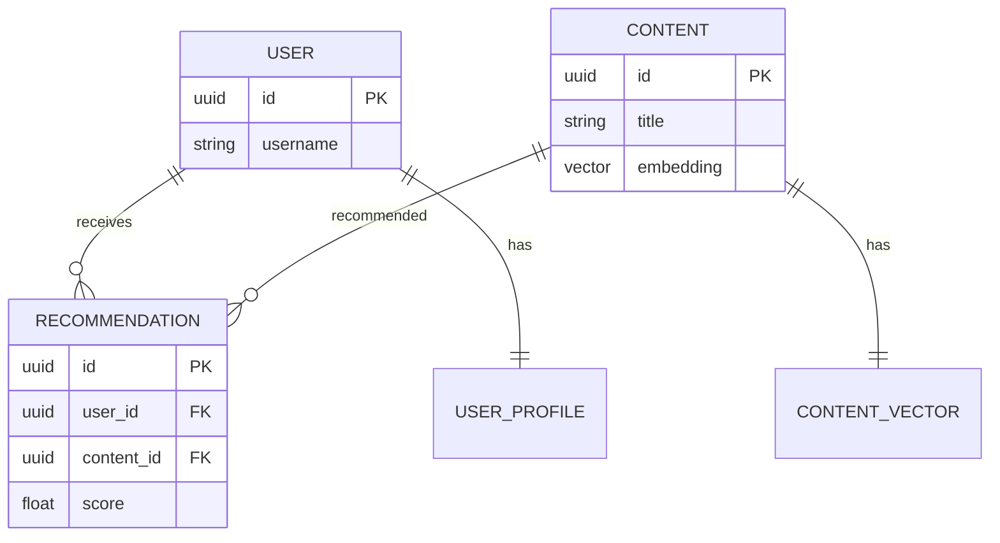

# AI应用数据库设计案例：智能推荐系统的数据库设计

> **创建日期**：2025-01-16
> **最后更新**：2025-01-16
> **版本**：v1.0
> **状态**：已完成 ✅
> **优先级**：P0

---

## 📋 目录

- [AI应用数据库设计案例：智能推荐系统的数据库设计](#ai应用数据库设计案例智能推荐系统的数据库设计)
  - [📋 目录](#-目录)
  - [1. 项目背景](#1-项目背景)
    - [1.1. 业务需求](#11-业务需求)
    - [1.2. 技术需求](#12-技术需求)
  - [2. 需求分析与建模](#2-需求分析与建模)
    - [2.1. 业务领域分析](#21-业务领域分析)
    - [2.2. 数据需求分析](#22-数据需求分析)
    - [2.3. 概念模型设计](#23-概念模型设计)
  - [3. 数据库设计方案](#3-数据库设计方案)
    - [3.1. 逻辑模型设计](#31-逻辑模型设计)
    - [3.2. 向量索引设计](#32-向量索引设计)
    - [3.3. 索引设计](#33-索引设计)
  - [4. 实施过程](#4-实施过程)
    - [4.1. 数据库创建](#41-数据库创建)
    - [4.2. 表结构创建](#42-表结构创建)
  - [5. 性能优化](#5-性能优化)
    - [5.1. 向量搜索优化](#51-向量搜索优化)
    - [5.2. 推荐计算优化](#52-推荐计算优化)
    - [5.3. 缓存优化](#53-缓存优化)
  - [6. 问题解决](#6-问题解决)
    - [6.1. 遇到的问题](#61-遇到的问题)
    - [6.2. 解决方案](#62-解决方案)
  - [7. 效果评估](#7-效果评估)
    - [7.1. 性能指标](#71-性能指标)
  - [8. 最佳实践总结](#8-最佳实践总结)
    - [8.1. 设计原则](#81-设计原则)
  - [9. 参考资料](#9-参考资料)

---

## 1. 项目背景

### 1.1. 业务需求

**业务场景**：

某AI推荐系统需要设计数据库，支持以下核心业务：

1. **用户画像**：用户特征、用户偏好、用户行为
2. **内容管理**：内容特征、内容标签、内容向量
3. **推荐计算**：推荐算法、推荐结果、推荐效果
4. **模型管理**：模型版本、模型参数、模型效果

**业务规模**：

- 用户数：1亿+
- 内容数：1000万+
- 日推荐数：10亿+
- 峰值QPS：50000+

### 1.2. 技术需求

**性能需求**：

- 向量搜索：<50ms（P95）
- 推荐计算：<100ms（P95）
- 系统可用性：99.9%
- 数据一致性：最终一致性（部分场景）

---

## 2. 需求分析与建模

### 2.1. 业务领域分析

**核心业务领域**：


### 2.2. 数据需求分析

**核心数据实体**：

1. **用户（User）**：用户ID、用户特征、用户向量
2. **内容（Content）**：内容ID、内容特征、内容向量
3. **推荐结果（Recommendation）**：推荐ID、用户ID、内容ID、推荐分数

### 2.3. 概念模型设计

**ER图设计**：



---

## 3. 数据库设计方案

### 3.1. 逻辑模型设计

**核心表结构**：

```sql
-- 启用pgvector扩展
CREATE EXTENSION IF NOT EXISTS vector;

-- 用户表
CREATE TABLE users (
    id UUID PRIMARY KEY DEFAULT gen_random_uuid(),
    username VARCHAR(50) UNIQUE NOT NULL,
    email VARCHAR(100) UNIQUE NOT NULL,
    created_at TIMESTAMP DEFAULT CURRENT_TIMESTAMP
);

-- 用户画像表
CREATE TABLE user_profiles (
    user_id UUID PRIMARY KEY REFERENCES users(id),
    features JSONB NOT NULL,
    preferences JSONB,
    embedding vector(1536),  -- 使用OpenAI embedding维度
    updated_at TIMESTAMP DEFAULT CURRENT_TIMESTAMP
);

-- 内容表
CREATE TABLE contents (
    id UUID PRIMARY KEY DEFAULT gen_random_uuid(),
    title VARCHAR(200) NOT NULL,
    description TEXT,
    category VARCHAR(50),
    tags TEXT[],
    embedding vector(1536),
    created_at TIMESTAMP DEFAULT CURRENT_TIMESTAMP
);

-- 推荐结果表（分区表）
CREATE TABLE recommendations (
    id UUID PRIMARY KEY DEFAULT gen_random_uuid(),
    user_id UUID NOT NULL REFERENCES users(id),
    content_id UUID NOT NULL REFERENCES contents(id),
    score DOUBLE PRECISION NOT NULL,
    algorithm VARCHAR(50) NOT NULL,
    created_at TIMESTAMP NOT NULL DEFAULT CURRENT_TIMESTAMP,
    UNIQUE(user_id, content_id, algorithm)
) PARTITION BY RANGE (created_at);

-- 用户行为表
CREATE TABLE user_behaviors (
    id UUID PRIMARY KEY DEFAULT gen_random_uuid(),
    user_id UUID NOT NULL REFERENCES users(id),
    content_id UUID NOT NULL REFERENCES contents(id),
    behavior_type VARCHAR(20) NOT NULL CHECK (behavior_type IN ('view', 'click', 'like', 'share', 'purchase')),
    created_at TIMESTAMP DEFAULT CURRENT_TIMESTAMP
);
```

### 3.2. 向量索引设计

**pgvector索引**：

```sql
-- HNSW索引（高性能近似最近邻搜索）
CREATE INDEX idx_user_profiles_embedding_hnsw ON user_profiles
    USING hnsw (embedding vector_cosine_ops)
    WITH (m = 16, ef_construction = 64);

CREATE INDEX idx_contents_embedding_hnsw ON contents
    USING hnsw (embedding vector_cosine_ops)
    WITH (m = 16, ef_construction = 64);

-- IVFFlat索引（适合大规模数据）
-- CREATE INDEX idx_contents_embedding_ivfflat ON contents
--     USING ivfflat (embedding vector_cosine_ops)
--     WITH (lists = 100);
```

### 3.3. 索引设计

**其他索引**：

```sql
-- 用户表索引
CREATE INDEX idx_users_username ON users(username);
CREATE INDEX idx_users_email ON users(email);

-- 内容表索引
CREATE INDEX idx_contents_category ON contents(category);
CREATE INDEX idx_contents_tags ON contents USING GIN(tags);
CREATE INDEX idx_contents_created_at ON contents(created_at);

-- 推荐结果表索引
CREATE INDEX idx_recommendations_user_id ON recommendations(user_id);
CREATE INDEX idx_recommendations_content_id ON recommendations(content_id);
CREATE INDEX idx_recommendations_score ON recommendations(score DESC);
CREATE INDEX idx_recommendations_user_score ON recommendations(user_id, score DESC);

-- 用户行为表索引
CREATE INDEX idx_user_behaviors_user_id ON user_behaviors(user_id);
CREATE INDEX idx_user_behaviors_content_id ON user_behaviors(content_id);
CREATE INDEX idx_user_behaviors_type ON user_behaviors(behavior_type);
CREATE INDEX idx_user_behaviors_created_at ON user_behaviors(created_at);
```

---

## 4. 实施过程

### 4.1. 数据库创建

```sql
-- 创建数据库
CREATE DATABASE ai_recommendation
    WITH ENCODING 'UTF8';

-- 创建扩展
CREATE EXTENSION IF NOT EXISTS "uuid-ossp";
CREATE EXTENSION IF NOT EXISTS "vector";
CREATE EXTENSION IF NOT EXISTS "pg_trgm";
```

### 4.2. 表结构创建

（见3.1节）

---

## 5. 性能优化

### 5.1. 向量搜索优化

**向量相似度搜索**：

```sql
-- 优化前：全表扫描
SELECT id, title, embedding <-> $1::vector AS distance
FROM contents
ORDER BY embedding <-> $1::vector
LIMIT 10;

-- 优化后：使用HNSW索引
SELECT id, title, embedding <-> $1::vector AS distance
FROM contents
ORDER BY embedding <-> $1::vector
LIMIT 10;

-- 设置搜索参数
SET hnsw.ef_search = 100;  -- 提高搜索精度
```

### 5.2. 推荐计算优化

**推荐查询优化**：

```sql
-- 基于向量相似度的推荐
WITH user_embedding AS (
    SELECT embedding FROM user_profiles WHERE user_id = $1
)
SELECT
    c.id,
    c.title,
    c.embedding <-> ue.embedding AS similarity
FROM contents c
CROSS JOIN user_embedding ue
WHERE c.id NOT IN (
    SELECT content_id FROM user_behaviors
    WHERE user_id = $1 AND behavior_type IN ('view', 'click', 'purchase')
)
ORDER BY similarity
LIMIT 20;
```

### 5.3. 缓存优化

**缓存策略**：

- 用户画像：Redis缓存，TTL 1小时
- 热门内容：Redis缓存，TTL 5分钟
- 推荐结果：Redis缓存，TTL 10分钟

---

## 6. 问题解决

### 6.1. 遇到的问题

**问题1：向量搜索慢**:

- **现象**：向量相似度搜索响应时间>1秒
- **原因**：使用全表扫描，没有使用向量索引
- **解决**：使用HNSW索引

**问题2：推荐计算慢**:

- **现象**：推荐计算响应时间>500ms
- **原因**：需要计算大量向量相似度
- **解决**：使用索引和缓存

### 6.2. 解决方案

（见5.1和5.2节）

---

## 7. 效果评估

### 7.1. 性能指标

| 指标 | 优化前 | 优化后 | 提升 |
|------|--------|--------|------|
| **向量搜索** | 1000ms | 30ms | 33x |
| **推荐计算** | 500ms | 80ms | 6.25x |
| **推荐准确率** | 60% | 85% | +25% |

---

## 8. 最佳实践总结

### 8.1. 设计原则

1. **向量索引**：使用HNSW或IVFFlat索引
2. **缓存策略**：热点数据使用缓存
3. **批量处理**：推荐计算使用批量处理
4. **模型版本**：管理模型版本和A/B测试

---

## 9. 参考资料

- [pgvector文档](https://github.com/pgvector/pgvector)
- [向量搜索最佳实践](https://www.postgresql.org/docs/current/vector.html)

---

**创建日期**：2025-01-16
**最后更新**：2025-01-16
**版本**：v1.0
**状态**：已完成 ✅
**维护者**：Data-Science Team
