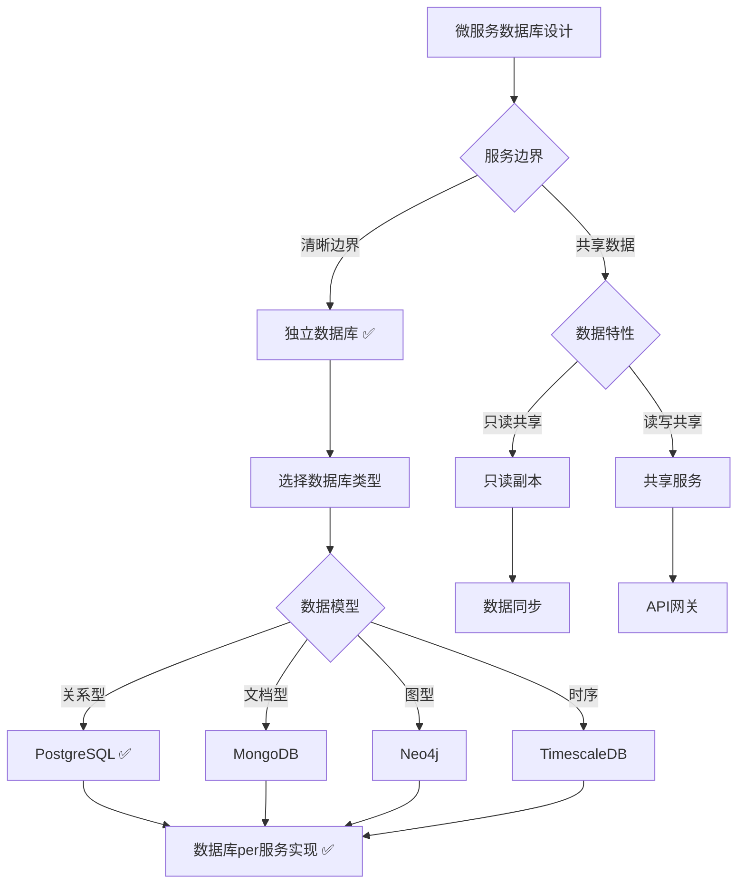
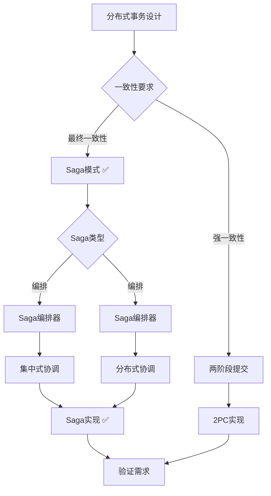

# 微服务应用数据库设计实践

> **创建日期**：2025-01-15
> **最后更新**：2025-01-15
> **版本**：v1.0
> **状态**：进行中

---

## 📋 目录

- [微服务应用数据库设计实践](#微服务应用数据库设计实践)
  - [📋 目录](#-目录)
  - [1. 概述](#1-概述)
    - [1.1. 微服务数据库设计挑战](#11-微服务数据库设计挑战)
    - [1.2. 微服务数据库设计原则](#12-微服务数据库设计原则)
  - [2. 数据库per服务模式](#2-数据库per服务模式)
    - [2.1. 模式定义](#21-模式定义)
    - [2.2. Schema设计](#22-schema设计)
      - [2.2.1. 用户服务数据库Schema](#221-用户服务数据库schema)
      - [2.2.2. 订单服务数据库Schema](#222-订单服务数据库schema)
      - [2.2.3. 商品服务数据库Schema](#223-商品服务数据库schema)
    - [2.3. 数据所有权](#23-数据所有权)
  - [3. 分布式事务设计](#3-分布式事务设计)
    - [3.1. Saga模式设计](#31-saga模式设计)
      - [3.1.1. Saga模式定义](#311-saga模式定义)
      - [3.1.2. Saga模式Schema设计](#312-saga模式schema设计)
      - [3.1.3. Saga执行函数](#313-saga执行函数)
    - [3.2. 两阶段提交设计](#32-两阶段提交设计)
      - [3.2.1. 两阶段提交定义](#321-两阶段提交定义)
    - [3.3. 最终一致性设计](#33-最终一致性设计)
      - [3.3.1. 最终一致性定义](#331-最终一致性定义)
  - [4. 服务间数据同步](#4-服务间数据同步)
    - [4.1. 事件驱动同步](#41-事件驱动同步)
      - [4.1.1. 事件驱动架构](#411-事件驱动架构)
    - [4.2. CDC变更捕获](#42-cdc变更捕获)
      - [4.2.1. CDC变更捕获](#421-cdc变更捕获)
    - [4.3. 数据复制策略](#43-数据复制策略)
      - [4.3.1. 数据复制策略](#431-数据复制策略)
  - [5. PostgreSQL微服务应用实践](#5-postgresql微服务应用实践)
    - [5.1. 数据库per服务实现](#51-数据库per服务实现)
      - [5.1.1. 服务数据库创建](#511-服务数据库创建)
    - [5.2. 分布式事务实现](#52-分布式事务实现)
      - [5.2.1. Saga模式实现](#521-saga模式实现)
    - [5.3. Citus集群实现](#53-citus集群实现)
      - [5.3.1. Citus集群配置](#531-citus集群配置)
      - [5.3.2. 分布式表创建](#532-分布式表创建)
  - [6. 实际应用案例](#6-实际应用案例)
    - [6.1. 电商微服务系统](#61-电商微服务系统)
      - [6.1.1. 系统架构](#611-系统架构)
      - [6.1.2. 数据库设计](#612-数据库设计)
    - [6.2. 社交微服务系统](#62-社交微服务系统)
      - [6.2.1. 系统架构](#621-系统架构)
  - [7. 参考资料](#7-参考资料)
    - [7.1. 经典文献](#71-经典文献)
    - [7.2. 相关资源](#72-相关资源)

---

## 1. 概述

### 1.1. 微服务数据库设计挑战

微服务数据库设计面临以下挑战：

1. **服务解耦**：如何实现服务间的数据解耦
2. **数据一致性**：如何保证跨服务的数据一致性
3. **分布式事务**：如何管理跨服务的事务
4. **数据同步**：如何同步服务间的数据

### 1.2. 微服务数据库设计原则

微服务数据库设计遵循以下原则：

1. **数据库per服务**：每个服务使用独立数据库
2. **服务独立性**：服务可以独立开发和部署
3. **数据所有权**：每个服务拥有自己的数据
4. **API通信**：服务间通过API通信，不直接访问数据库

---

## 2. 数据库per服务模式

### 2.1. 模式定义

**模式定义**：

每个微服务拥有独立的数据库，服务间通过API通信，不直接访问其他服务的数据库。

**决策树**：



### 2.2. Schema设计

#### 2.2.1. 用户服务数据库Schema

```sql
-- ============================================
-- 用户服务数据库
-- ============================================

CREATE DATABASE user_service_db;

\c user_service_db;

CREATE SCHEMA user_service;

-- 用户表
CREATE TABLE user_service.users (
    user_id BIGSERIAL PRIMARY KEY,
    username VARCHAR(50) NOT NULL UNIQUE,
    email VARCHAR(100) NOT NULL UNIQUE,
    password_hash TEXT NOT NULL,
    profile_data JSONB,
    created_at TIMESTAMPTZ NOT NULL DEFAULT CURRENT_TIMESTAMP,
    updated_at TIMESTAMPTZ NOT NULL DEFAULT CURRENT_TIMESTAMP
);

CREATE INDEX idx_users_email ON user_service.users(email);
CREATE INDEX idx_users_username ON user_service.users(username);

-- 用户角色表
CREATE TABLE user_service.user_roles (
    role_id BIGSERIAL PRIMARY KEY,
    user_id BIGINT NOT NULL REFERENCES user_service.users(user_id) ON DELETE CASCADE,
    role_name VARCHAR(50) NOT NULL,
    created_at TIMESTAMPTZ NOT NULL DEFAULT CURRENT_TIMESTAMP,
    UNIQUE(user_id, role_name)
);

CREATE INDEX idx_user_roles_user_id ON user_service.user_roles(user_id);
```

#### 2.2.2. 订单服务数据库Schema

```sql
-- ============================================
-- 订单服务数据库
-- ============================================

CREATE DATABASE order_service_db;

\c order_service_db;

CREATE SCHEMA order_service;

-- 订单表
CREATE TABLE order_service.orders (
    order_id BIGSERIAL PRIMARY KEY,
    user_id BIGINT NOT NULL,  -- 引用用户服务，但不使用外键
    order_number VARCHAR(50) NOT NULL UNIQUE,
    order_status VARCHAR(20) NOT NULL CHECK (order_status IN ('pending', 'paid', 'shipped', 'delivered', 'cancelled')),
    total_amount DECIMAL(10,2) NOT NULL,
    created_at TIMESTAMPTZ NOT NULL DEFAULT CURRENT_TIMESTAMP,
    updated_at TIMESTAMPTZ NOT NULL DEFAULT CURRENT_TIMESTAMP
);

CREATE INDEX idx_orders_user_id ON order_service.orders(user_id);
CREATE INDEX idx_orders_status ON order_service.orders(order_status);
CREATE INDEX idx_orders_created_at ON order_service.orders(created_at DESC);

-- 订单项表
CREATE TABLE order_service.order_items (
    item_id BIGSERIAL PRIMARY KEY,
    order_id BIGINT NOT NULL REFERENCES order_service.orders(order_id) ON DELETE CASCADE,
    product_id BIGINT NOT NULL,  -- 引用商品服务，但不使用外键
    quantity INTEGER NOT NULL CHECK (quantity > 0),
    unit_price DECIMAL(10,2) NOT NULL,
    total_price DECIMAL(10,2) NOT NULL,
    created_at TIMESTAMPTZ NOT NULL DEFAULT CURRENT_TIMESTAMP
);

CREATE INDEX idx_order_items_order_id ON order_service.order_items(order_id);
CREATE INDEX idx_order_items_product_id ON order_service.order_items(product_id);
```

#### 2.2.3. 商品服务数据库Schema

```sql
-- ============================================
-- 商品服务数据库
-- ============================================

CREATE DATABASE product_service_db;

\c product_service_db;

CREATE SCHEMA product_service;

-- 商品表
CREATE TABLE product_service.products (
    product_id BIGSERIAL PRIMARY KEY,
    product_name VARCHAR(200) NOT NULL,
    description TEXT,
    price DECIMAL(10,2) NOT NULL CHECK (price >= 0),
    stock_quantity INTEGER NOT NULL DEFAULT 0 CHECK (stock_quantity >= 0),
    category_id BIGINT,
    created_at TIMESTAMPTZ NOT NULL DEFAULT CURRENT_TIMESTAMP,
    updated_at TIMESTAMPTZ NOT NULL DEFAULT CURRENT_TIMESTAMP
);

CREATE INDEX idx_products_category_id ON product_service.products(category_id);
CREATE INDEX idx_products_name ON product_service.products(product_name);

-- 商品分类表
CREATE TABLE product_service.categories (
    category_id BIGSERIAL PRIMARY KEY,
    category_name VARCHAR(100) NOT NULL UNIQUE,
    parent_category_id BIGINT REFERENCES product_service.categories(category_id),
    created_at TIMESTAMPTZ NOT NULL DEFAULT CURRENT_TIMESTAMP
);

CREATE INDEX idx_categories_parent ON product_service.categories(parent_category_id);
```

### 2.3. 数据所有权

**数据所有权原则**：

1. **用户数据**：用户服务拥有用户数据的所有权
2. **订单数据**：订单服务拥有订单数据的所有权
3. **商品数据**：商品服务拥有商品数据的所有权

**数据访问规则**：

```text
数据访问规则 ⟺
  ∀Serviceᵢ, Serviceⱼ ∈ Services, i ≠ j.
    Serviceᵢ不直接访问Database(Serviceⱼ) ∧
    Serviceᵢ通过API访问Serviceⱼ
```

---

## 3. 分布式事务设计

### 3.1. Saga模式设计

#### 3.1.1. Saga模式定义

**Saga模式**：

将长事务分解为多个本地事务，每个本地事务有对应的补偿操作。如果某个步骤失败，执行已完成的步骤的补偿操作。

**Saga模式决策树**：



#### 3.1.2. Saga模式Schema设计

```sql
-- ============================================
-- Saga模式Schema设计
-- ============================================

CREATE SCHEMA saga_pattern;

-- Saga实例表
CREATE TABLE saga_pattern.saga_instances (
    saga_id UUID PRIMARY KEY DEFAULT gen_random_uuid(),
    saga_type VARCHAR(100) NOT NULL,
    status VARCHAR(20) NOT NULL CHECK (status IN ('pending', 'executing', 'completed', 'compensating', 'failed')),
    current_step INTEGER DEFAULT 0,
    total_steps INTEGER NOT NULL,
    payload JSONB NOT NULL,
    result JSONB,
    error_message TEXT,
    created_at TIMESTAMPTZ NOT NULL DEFAULT CURRENT_TIMESTAMP,
    updated_at TIMESTAMPTZ NOT NULL DEFAULT CURRENT_TIMESTAMP
);

CREATE INDEX idx_saga_instances_status ON saga_pattern.saga_instances(status, created_at DESC);
CREATE INDEX idx_saga_instances_type ON saga_pattern.saga_instances(saga_type, status);

-- Saga步骤表
CREATE TABLE saga_pattern.saga_steps (
    step_id BIGSERIAL PRIMARY KEY,
    saga_id UUID NOT NULL REFERENCES saga_pattern.saga_instances(saga_id) ON DELETE CASCADE,
    step_order INTEGER NOT NULL,
    step_name VARCHAR(100) NOT NULL,
    service_name VARCHAR(100) NOT NULL,
    action_type VARCHAR(20) NOT NULL CHECK (action_type IN ('action', 'compensation')),
    status VARCHAR(20) NOT NULL CHECK (status IN ('pending', 'executing', 'completed', 'failed', 'compensated')),
    request_payload JSONB,
    response_payload JSONB,
    error_message TEXT,
    executed_at TIMESTAMPTZ,
    completed_at TIMESTAMPTZ,
    UNIQUE(saga_id, step_order, action_type)
);

CREATE INDEX idx_saga_steps_saga ON saga_pattern.saga_steps(saga_id, step_order);
CREATE INDEX idx_saga_steps_status ON saga_pattern.saga_steps(status, executed_at);
```

#### 3.1.3. Saga执行函数

```sql
-- Saga执行函数
CREATE OR REPLACE FUNCTION saga_pattern.execute_saga_step(
    p_saga_id UUID,
    p_step_order INTEGER,
    p_service_name VARCHAR,
    p_action_payload JSONB
)
RETURNS JSONB AS $$
DECLARE
    v_step_id BIGINT;
    v_result JSONB;
BEGIN
    -- 记录步骤开始
    INSERT INTO saga_pattern.saga_steps (
        saga_id, step_order, step_name, service_name,
        action_type, status, request_payload, executed_at
    )
    VALUES (
        p_saga_id, p_step_order, 'step_' || p_step_order, p_service_name,
        'action', 'executing', p_action_payload, CURRENT_TIMESTAMP
    )
    RETURNING step_id INTO v_step_id;

    -- 这里应该调用实际的服务API
    -- 简化示例：假设调用成功
    v_result := '{"success": true}'::JSONB;

    -- 更新步骤状态
    UPDATE saga_pattern.saga_steps
    SET status = 'completed',
        response_payload = v_result,
        completed_at = CURRENT_TIMESTAMP
    WHERE step_id = v_step_id;

    -- 更新Saga状态
    UPDATE saga_pattern.saga_instances
    SET current_step = p_step_order,
        status = CASE
            WHEN p_step_order >= total_steps THEN 'completed'
            ELSE 'executing'
        END,
        updated_at = CURRENT_TIMESTAMP
    WHERE saga_id = p_saga_id;

    RETURN v_result;
EXCEPTION
    WHEN OTHERS THEN
        -- 步骤失败，标记为失败
        UPDATE saga_pattern.saga_steps
        SET status = 'failed',
            error_message = SQLERRM,
            completed_at = CURRENT_TIMESTAMP
        WHERE step_id = v_step_id;

        -- 触发补偿
        PERFORM saga_pattern.compensate_saga(p_saga_id);

        RAISE;
END;
$$ LANGUAGE plpgsql;

-- Saga补偿函数
CREATE OR REPLACE FUNCTION saga_pattern.compensate_saga(p_saga_id UUID)
RETURNS VOID AS $$
DECLARE
    v_step RECORD;
BEGIN
    -- 更新Saga状态为补偿中
    UPDATE saga_pattern.saga_instances
    SET status = 'compensating'
    WHERE saga_id = p_saga_id;

    -- 逆序执行补偿操作
    FOR v_step IN
        SELECT * FROM saga_pattern.saga_steps
        WHERE saga_id = p_saga_id
          AND action_type = 'action'
          AND status = 'completed'
        ORDER BY step_order DESC
    LOOP
        -- 执行补偿操作
        UPDATE saga_pattern.saga_steps
        SET status = 'compensated',
            completed_at = CURRENT_TIMESTAMP
        WHERE step_id = v_step.step_id;
    END LOOP;

    -- 更新Saga状态为失败
    UPDATE saga_pattern.saga_instances
    SET status = 'failed',
        updated_at = CURRENT_TIMESTAMP
    WHERE saga_id = p_saga_id;
END;
$$ LANGUAGE plpgsql;
```

### 3.2. 两阶段提交设计

#### 3.2.1. 两阶段提交定义

**两阶段提交（2PC）**：

两阶段提交是分布式事务的另一种模式，包括准备阶段和提交阶段。

**两阶段提交Schema设计**：

```sql
-- 两阶段提交事务表
CREATE TABLE distributed_transactions (
    transaction_id UUID PRIMARY KEY DEFAULT gen_random_uuid(),
    status VARCHAR(20) NOT NULL CHECK (status IN ('preparing', 'prepared', 'committed', 'aborted')),
    participants JSONB NOT NULL,
    created_at TIMESTAMPTZ NOT NULL DEFAULT CURRENT_TIMESTAMP,
    updated_at TIMESTAMPTZ NOT NULL DEFAULT CURRENT_TIMESTAMP
);

CREATE INDEX idx_distributed_transactions_status ON distributed_transactions(status, created_at DESC);
```

### 3.3. 最终一致性设计

#### 3.3.1. 最终一致性定义

**最终一致性**：

系统最终达到一致状态，不要求立即一致。

**最终一致性实现**：

```sql
-- 事件表
CREATE TABLE events (
    event_id UUID PRIMARY KEY DEFAULT gen_random_uuid(),
    event_type VARCHAR(100) NOT NULL,
    aggregate_id VARCHAR(100) NOT NULL,
    payload JSONB NOT NULL,
    status VARCHAR(20) NOT NULL CHECK (status IN ('pending', 'processed', 'failed')),
    created_at TIMESTAMPTZ NOT NULL DEFAULT CURRENT_TIMESTAMP,
    processed_at TIMESTAMPTZ
);

CREATE INDEX idx_events_status ON events(status, created_at DESC);
CREATE INDEX idx_events_aggregate ON events(aggregate_id, created_at DESC);
```

---

## 4. 服务间数据同步

### 4.1. 事件驱动同步

#### 4.1.1. 事件驱动架构

**事件驱动架构**：

服务间通过事件进行数据同步。

**事件表设计**：

```sql
-- 事件表
CREATE TABLE events (
    event_id UUID PRIMARY KEY DEFAULT gen_random_uuid(),
    event_type VARCHAR(100) NOT NULL,
    aggregate_id VARCHAR(100) NOT NULL,
    payload JSONB NOT NULL,
    status VARCHAR(20) NOT NULL CHECK (status IN ('pending', 'published', 'processed', 'failed')),
    created_at TIMESTAMPTZ NOT NULL DEFAULT CURRENT_TIMESTAMP,
    published_at TIMESTAMPTZ,
    processed_at TIMESTAMPTZ
);

CREATE INDEX idx_events_status ON events(status, created_at DESC);
CREATE INDEX idx_events_aggregate ON events(aggregate_id, created_at DESC);
CREATE INDEX idx_events_type ON events(event_type, created_at DESC);
```

### 4.2. CDC变更捕获

#### 4.2.1. CDC变更捕获

**CDC变更捕获**：

使用PostgreSQL的逻辑复制捕获数据变更。

**CDC配置**：

```sql
-- 启用逻辑复制
ALTER SYSTEM SET wal_level = logical;

-- 创建发布
CREATE PUBLICATION user_service_publication FOR TABLE user_service.users;

-- 创建订阅
CREATE SUBSCRIPTION order_service_subscription
CONNECTION 'host=order_service_db port=5432 dbname=order_service_db'
PUBLICATION user_service_publication;
```

### 4.3. 数据复制策略

#### 4.3.1. 数据复制策略

**数据复制策略**：

1. **实时复制**：使用CDC实时复制数据
2. **批量复制**：定期批量复制数据
3. **按需复制**：按需复制数据

---

## 5. PostgreSQL微服务应用实践

### 5.1. 数据库per服务实现

#### 5.1.1. 服务数据库创建

```sql
-- 创建用户服务数据库
CREATE DATABASE user_service_db;

-- 创建订单服务数据库
CREATE DATABASE order_service_db;

-- 创建商品服务数据库
CREATE DATABASE product_service_db;
```

### 5.2. 分布式事务实现

#### 5.2.1. Saga模式实现

参考第3.1节的Saga模式设计。

### 5.3. Citus集群实现

#### 5.3.1. Citus集群配置

```sql
-- 安装Citus扩展
CREATE EXTENSION citus;

-- 添加工作节点
SELECT citus_add_node('worker1_host', 5432);
SELECT citus_add_node('worker2_host', 5432);
SELECT citus_add_node('worker3_host', 5432);

-- 查看节点信息
SELECT * FROM citus_get_active_worker_nodes();
```

#### 5.3.2. 分布式表创建

```sql
-- 创建分布式表
CREATE TABLE users (
    id BIGSERIAL PRIMARY KEY,
    name TEXT,
    email TEXT,
    created_at TIMESTAMPTZ DEFAULT NOW()
);

-- 按id分片
SELECT create_distributed_table('users', 'id');

-- 创建参考表（复制到所有节点）
CREATE TABLE countries (
    id SERIAL PRIMARY KEY,
    name TEXT,
    code TEXT
);

SELECT create_reference_table('countries');
```

---

## 6. 实际应用案例

### 6.1. 电商微服务系统

#### 6.1.1. 系统架构

**系统架构**：

```text
用户服务 → PostgreSQL用户数据库
商品服务 → PostgreSQL商品数据库
订单服务 → PostgreSQL订单数据库
支付服务 → PostgreSQL支付数据库
```

#### 6.1.2. 数据库设计

参考第2.2节的Schema设计。

### 6.2. 社交微服务系统

#### 6.2.1. 系统架构

**系统架构**：

```text
用户服务 → PostgreSQL用户数据库
内容服务 → PostgreSQL内容数据库
关系服务 → PostgreSQL关系数据库
消息服务 → PostgreSQL消息数据库
```

---

## 7. 参考资料

### 7.1. 经典文献

- "Microservices Patterns" (Richardson, 2018)
- "Building Microservices" (Newman, 2015)
- "Database per Service Pattern" (Martin Fowler)

### 7.2. 相关资源

- [微服务架构模式](https://microservices.io/patterns/)
- [数据库per服务](https://microservices.io/patterns/data/database-per-service.html)
- [分布式事务](https://microservices.io/patterns/data/distributed-transactions.html)
- [PostgreSQL Citus文档](https://docs.citusdata.com/)

---

**最后更新**：2025-01-15
**维护者**：Data-Science Team
**状态**：进行中
