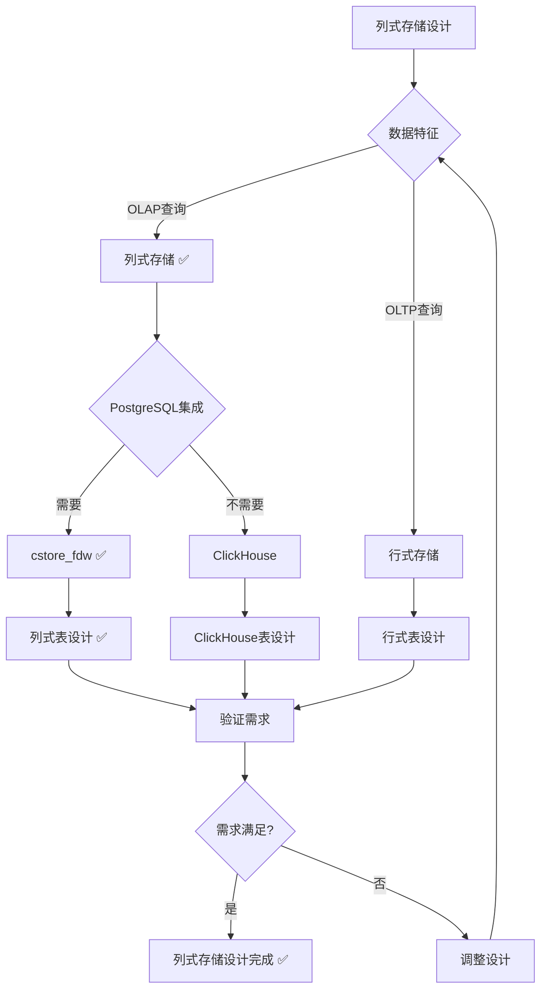

# 数据分析应用数据库设计实践

> **创建日期**：2025-01-15
> **最后更新**：2025-01-15
> **版本**：v1.0
> **状态**：进行中

---

## 📋 目录

- [数据分析应用数据库设计实践](#数据分析应用数据库设计实践)
  - [📋 目录](#-目录)
  - [1. 概述](#1-概述)
    - [1.1. 数据分析数据库设计挑战](#11-数据分析数据库设计挑战)
    - [1.2. 数据分析数据库设计原则](#12-数据分析数据库设计原则)
  - [2. 列式存储设计](#2-列式存储设计)
    - [2.1. cstore\_fdw设计](#21-cstore_fdw设计)
      - [2.1.1. cstore\_fdw安装和配置](#211-cstore_fdw安装和配置)
      - [2.1.2. 列式表设计决策树](#212-列式表设计决策树)
    - [2.2. 列式表设计](#22-列式表设计)
      - [2.2.1. 列式表Schema设计](#221-列式表schema设计)
      - [2.2.2. 列式表查询优化](#222-列式表查询优化)
    - [2.3. 列式查询优化](#23-列式查询优化)
      - [2.3.1. 列式查询优化原则](#231-列式查询优化原则)
  - [3. 数据仓库设计](#3-数据仓库设计)
    - [3.1. 星型模型设计](#31-星型模型设计)
      - [3.1.1. 星型模型Schema设计](#311-星型模型schema设计)
    - [3.2. 雪花模型设计](#32-雪花模型设计)
      - [3.2.1. 雪花模型Schema设计](#321-雪花模型schema设计)
    - [3.3. 事实表设计](#33-事实表设计)
      - [3.3.1. 事实表设计原则](#331-事实表设计原则)
      - [3.3.2. 事实表Schema设计](#332-事实表schema设计)
    - [3.4. 维度表设计](#34-维度表设计)
      - [3.4.1. 维度表设计原则](#341-维度表设计原则)
      - [3.4.2. 维度表Schema设计](#342-维度表schema设计)
  - [4. 物化视图设计](#4-物化视图设计)
    - [4.1. 物化视图创建](#41-物化视图创建)
      - [4.1.1. 物化视图Schema设计](#411-物化视图schema设计)
    - [4.2. 物化视图刷新](#42-物化视图刷新)
      - [4.2.1. 物化视图刷新策略](#421-物化视图刷新策略)
      - [4.2.2. 物化视图刷新实现](#422-物化视图刷新实现)
    - [4.3. 物化视图优化](#43-物化视图优化)
      - [4.3.1. 物化视图优化原则](#431-物化视图优化原则)
  - [5. PostgreSQL数据分析应用实践](#5-postgresql数据分析应用实践)
    - [5.1. 列式存储实现](#51-列式存储实现)
      - [5.1.1. cstore\_fdw实现](#511-cstore_fdw实现)
    - [5.2. 数据仓库实现](#52-数据仓库实现)
      - [5.2.1. 星型模型实现](#521-星型模型实现)
    - [5.3. OLAP分析实现](#53-olap分析实现)
      - [5.3.1. OLAP查询实现](#531-olap查询实现)
  - [6. 实际应用案例](#6-实际应用案例)
    - [6.1. 商业智能系统](#61-商业智能系统)
      - [6.1.1. 系统架构](#611-系统架构)
      - [6.1.2. 数据库设计](#612-数据库设计)
    - [6.2. 数据科学平台](#62-数据科学平台)
      - [6.2.1. 系统架构](#621-系统架构)
  - [7. 参考资料](#7-参考资料)
    - [7.1. 经典文献](#71-经典文献)
    - [7.2. 相关资源](#72-相关资源)

---

## 1. 概述

### 1.1. 数据分析数据库设计挑战

数据分析数据库设计面临以下挑战：

1. **数据规模**：大规模数据存储和分析
2. **查询性能**：快速响应OLAP查询
3. **数据一致性**：保证数据一致性
4. **实时性**：支持实时分析

### 1.2. 数据分析数据库设计原则

数据分析数据库设计遵循以下原则：

1. **列式存储**：使用列式存储优化OLAP查询
2. **数据仓库**：使用数据仓库模型组织数据
3. **物化视图**：使用物化视图加速查询
4. **分区策略**：使用分区策略优化查询性能

---

## 2. 列式存储设计

### 2.1. cstore_fdw设计

#### 2.1.1. cstore_fdw安装和配置

```sql
-- 安装cstore_fdw扩展
CREATE EXTENSION cstore_fdw;

-- 创建外部服务器
CREATE SERVER cstore_server
FOREIGN DATA WRAPPER cstore_fdw;
```

#### 2.1.2. 列式表设计决策树



### 2.2. 列式表设计

#### 2.2.1. 列式表Schema设计

```sql
-- ============================================
-- 列式存储表设计
-- ============================================

-- 创建列式存储表
CREATE FOREIGN TABLE sales_columnar (
    sale_id BIGINT,
    product_id BIGINT,
    customer_id BIGINT,
    sale_date DATE,
    amount DECIMAL(10,2),
    quantity INTEGER
)
SERVER cstore_server
OPTIONS (
    compression 'pglz',
    stripe_row_count '150000'
);

-- 插入数据
INSERT INTO sales_columnar
SELECT
    sale_id,
    product_id,
    customer_id,
    sale_date,
    amount,
    quantity
FROM sales;
```

#### 2.2.2. 列式表查询优化

```sql
-- 列式查询优化：只查询需要的列
SELECT
    product_id,
    SUM(amount) AS total_amount,
    COUNT(*) AS sale_count
FROM sales_columnar
WHERE sale_date >= '2024-01-01'
GROUP BY product_id;
```

### 2.3. 列式查询优化

#### 2.3.1. 列式查询优化原则

**优化原则**：

1. **只查询需要的列**：列式存储只读取需要的列
2. **避免全表扫描**：使用过滤条件减少扫描数据
3. **利用聚合**：列式存储适合聚合操作

---

## 3. 数据仓库设计

### 3.1. 星型模型设计

#### 3.1.1. 星型模型Schema设计

```sql
-- ============================================
-- 星型模型设计
-- ============================================

-- 事实表：销售事实
CREATE TABLE fact_sales (
    sale_id BIGSERIAL PRIMARY KEY,
    product_id BIGINT NOT NULL REFERENCES dim_products(product_id),
    customer_id BIGINT NOT NULL REFERENCES dim_customers(customer_id),
    date_id BIGINT NOT NULL REFERENCES dim_dates(date_id),
    amount DECIMAL(10,2) NOT NULL,
    quantity INTEGER NOT NULL,
    discount DECIMAL(10,2) DEFAULT 0,
    created_at TIMESTAMPTZ NOT NULL DEFAULT CURRENT_TIMESTAMP
);

CREATE INDEX idx_fact_sales_product ON fact_sales(product_id);
CREATE INDEX idx_fact_sales_customer ON fact_sales(customer_id);
CREATE INDEX idx_fact_sales_date ON fact_sales(date_id);

-- 维度表：产品维度
CREATE TABLE dim_products (
    product_id BIGSERIAL PRIMARY KEY,
    product_name VARCHAR(200) NOT NULL,
    category_id BIGINT NOT NULL REFERENCES dim_categories(category_id),
    brand_id BIGINT NOT NULL REFERENCES dim_brands(brand_id),
    price DECIMAL(10,2) NOT NULL,
    cost DECIMAL(10,2) NOT NULL,
    created_at TIMESTAMPTZ NOT NULL DEFAULT CURRENT_TIMESTAMP
);

CREATE INDEX idx_dim_products_category ON dim_products(category_id);
CREATE INDEX idx_dim_products_brand ON dim_products(brand_id);

-- 维度表：客户维度
CREATE TABLE dim_customers (
    customer_id BIGSERIAL PRIMARY KEY,
    customer_name VARCHAR(200) NOT NULL,
    region_id BIGINT NOT NULL REFERENCES dim_regions(region_id),
    customer_type VARCHAR(50) NOT NULL,
    created_at TIMESTAMPTZ NOT NULL DEFAULT CURRENT_TIMESTAMP
);

CREATE INDEX idx_dim_customers_region ON dim_customers(region_id);

-- 维度表：日期维度
CREATE TABLE dim_dates (
    date_id BIGSERIAL PRIMARY KEY,
    date DATE NOT NULL UNIQUE,
    year INTEGER NOT NULL,
    quarter INTEGER NOT NULL CHECK (quarter BETWEEN 1 AND 4),
    month INTEGER NOT NULL CHECK (month BETWEEN 1 AND 12),
    day INTEGER NOT NULL CHECK (day BETWEEN 1 AND 31),
    day_of_week INTEGER NOT NULL CHECK (day_of_week BETWEEN 1 AND 7),
    is_weekend BOOLEAN NOT NULL,
    is_holiday BOOLEAN NOT NULL DEFAULT FALSE
);

CREATE INDEX idx_dim_dates_date ON dim_dates(date);
CREATE INDEX idx_dim_dates_year_month ON dim_dates(year, month);
```

### 3.2. 雪花模型设计

#### 3.2.1. 雪花模型Schema设计

```sql
-- ============================================
-- 雪花模型设计
-- ============================================

-- 事实表：销售事实
CREATE TABLE fact_sales (
    sale_id BIGSERIAL PRIMARY KEY,
    product_id BIGINT NOT NULL REFERENCES dim_products(product_id),
    customer_id BIGINT NOT NULL REFERENCES dim_customers(customer_id),
    date_id BIGINT NOT NULL REFERENCES dim_dates(date_id),
    amount DECIMAL(10,2) NOT NULL,
    quantity INTEGER NOT NULL
);

-- 维度表：产品维度（规范化）
CREATE TABLE dim_products (
    product_id BIGSERIAL PRIMARY KEY,
    product_name VARCHAR(200) NOT NULL,
    category_id BIGINT NOT NULL REFERENCES dim_categories(category_id),
    brand_id BIGINT NOT NULL REFERENCES dim_brands(brand_id),
    price DECIMAL(10,2) NOT NULL
);

-- 子维度表：产品类别
CREATE TABLE dim_categories (
    category_id BIGSERIAL PRIMARY KEY,
    category_name VARCHAR(100) NOT NULL UNIQUE,
    parent_category_id BIGINT REFERENCES dim_categories(category_id)
);

-- 子维度表：品牌
CREATE TABLE dim_brands (
    brand_id BIGSERIAL PRIMARY KEY,
    brand_name VARCHAR(100) NOT NULL UNIQUE,
    manufacturer_id BIGINT NOT NULL REFERENCES dim_manufacturers(manufacturer_id)
);

-- 子维度表：制造商
CREATE TABLE dim_manufacturers (
    manufacturer_id BIGSERIAL PRIMARY KEY,
    manufacturer_name VARCHAR(100) NOT NULL UNIQUE,
    country VARCHAR(50) NOT NULL
);
```

### 3.3. 事实表设计

#### 3.3.1. 事实表设计原则

**设计原则**：

1. **粒度**：确定事实表的粒度
2. **度量**：选择度量字段
3. **外键**：外键指向维度表
4. **索引**：为外键创建索引

#### 3.3.2. 事实表Schema设计

```sql
-- 事实表：销售事实（详细粒度）
CREATE TABLE fact_sales (
    sale_id BIGSERIAL PRIMARY KEY,
    product_id BIGINT NOT NULL REFERENCES dim_products(product_id),
    customer_id BIGINT NOT NULL REFERENCES dim_customers(customer_id),
    date_id BIGINT NOT NULL REFERENCES dim_dates(date_id),
    store_id BIGINT NOT NULL REFERENCES dim_stores(store_id),
    -- 度量字段
    amount DECIMAL(10,2) NOT NULL,
    quantity INTEGER NOT NULL,
    discount DECIMAL(10,2) DEFAULT 0,
    tax DECIMAL(10,2) DEFAULT 0,
    -- 时间戳
    created_at TIMESTAMPTZ NOT NULL DEFAULT CURRENT_TIMESTAMP
);

-- 创建索引
CREATE INDEX idx_fact_sales_product ON fact_sales(product_id);
CREATE INDEX idx_fact_sales_customer ON fact_sales(customer_id);
CREATE INDEX idx_fact_sales_date ON fact_sales(date_id);
CREATE INDEX idx_fact_sales_store ON fact_sales(store_id);
CREATE INDEX idx_fact_sales_date_product ON fact_sales(date_id, product_id);
```

### 3.4. 维度表设计

#### 3.4.1. 维度表设计原则

**设计原则**：

1. **缓慢变化维度**：处理维度数据的变化
2. **代理键**：使用代理键而非自然键
3. **层次结构**：支持层次结构查询

#### 3.4.2. 维度表Schema设计

```sql
-- 维度表：产品维度（SCD Type 2）
CREATE TABLE dim_products (
    product_id BIGSERIAL PRIMARY KEY,
    product_sk BIGINT NOT NULL UNIQUE,  -- 代理键
    product_code VARCHAR(50) NOT NULL,  -- 自然键
    product_name VARCHAR(200) NOT NULL,
    category_id BIGINT NOT NULL REFERENCES dim_categories(category_id),
    price DECIMAL(10,2) NOT NULL,
    -- SCD字段
    effective_date DATE NOT NULL,
    expiry_date DATE,
    is_current BOOLEAN NOT NULL DEFAULT TRUE,
    created_at TIMESTAMPTZ NOT NULL DEFAULT CURRENT_TIMESTAMP
);

CREATE INDEX idx_dim_products_sk ON dim_products(product_sk);
CREATE INDEX idx_dim_products_code ON dim_products(product_code);
CREATE INDEX idx_dim_products_current ON dim_products(is_current);
```

---

## 4. 物化视图设计

### 4.1. 物化视图创建

#### 4.1.1. 物化视图Schema设计

```sql
-- ============================================
-- 物化视图设计
-- ============================================

-- 创建物化视图：销售汇总
CREATE MATERIALIZED VIEW mv_sales_summary AS
SELECT
    d.year,
    d.quarter,
    d.month,
    p.category_id,
    c.region_id,
    SUM(f.amount) AS total_amount,
    SUM(f.quantity) AS total_quantity,
    COUNT(*) AS sale_count,
    AVG(f.amount) AS avg_amount
FROM fact_sales f
JOIN dim_dates d ON f.date_id = d.date_id
JOIN dim_products p ON f.product_id = p.product_id
JOIN dim_customers c ON f.customer_id = c.customer_id
GROUP BY d.year, d.quarter, d.month, p.category_id, c.region_id;

-- 创建索引
CREATE INDEX idx_mv_sales_summary_year_month
ON mv_sales_summary(year, month);

CREATE INDEX idx_mv_sales_summary_category
ON mv_sales_summary(category_id);

CREATE INDEX idx_mv_sales_summary_region
ON mv_sales_summary(region_id);
```

### 4.2. 物化视图刷新

#### 4.2.1. 物化视图刷新策略

**刷新策略**：

1. **手动刷新**：手动执行刷新
2. **定时刷新**：使用定时任务刷新
3. **增量刷新**：只刷新变化的数据

#### 4.2.2. 物化视图刷新实现

```sql
-- 手动刷新（全量刷新）
REFRESH MATERIALIZED VIEW mv_sales_summary;

-- 并发刷新（增量刷新）
REFRESH MATERIALIZED VIEW CONCURRENTLY mv_sales_summary;

-- 定时刷新（使用pg_cron扩展）
SELECT cron.schedule(
    'refresh-sales-summary',
    '0 2 * * *',  -- 每天凌晨2点
    $$REFRESH MATERIALIZED VIEW CONCURRENTLY mv_sales_summary$$
);
```

### 4.3. 物化视图优化

#### 4.3.1. 物化视图优化原则

**优化原则**：

1. **索引优化**：为物化视图创建索引
2. **分区优化**：对物化视图进行分区
3. **查询优化**：优化物化视图查询

---

## 5. PostgreSQL数据分析应用实践

### 5.1. 列式存储实现

#### 5.1.1. cstore_fdw实现

参考第2.1节的cstore_fdw设计。

### 5.2. 数据仓库实现

#### 5.2.1. 星型模型实现

参考第3.1节的星型模型设计。

### 5.3. OLAP分析实现

#### 5.3.1. OLAP查询实现

```sql
-- OLAP查询：销售分析
SELECT
    d.year,
    d.quarter,
    p.category_id,
    SUM(f.amount) AS total_amount,
    SUM(f.quantity) AS total_quantity,
    COUNT(*) AS sale_count
FROM fact_sales f
JOIN dim_dates d ON f.date_id = d.date_id
JOIN dim_products p ON f.product_id = p.product_id
WHERE d.year = 2024
GROUP BY
    ROLLUP(d.year, d.quarter),
    p.category_id
ORDER BY d.year, d.quarter, p.category_id;
```

---

## 6. 实际应用案例

### 6.1. 商业智能系统

#### 6.1.1. 系统架构

**系统架构**：

```text
数据源 → ETL → 数据仓库 → OLAP → 商业智能工具
```

#### 6.1.2. 数据库设计

参考第3节的数据仓库设计。

### 6.2. 数据科学平台

#### 6.2.1. 系统架构

**系统架构**：

```text
数据源 → 数据湖 → 数据仓库 → 数据分析 → 机器学习
```

---

## 7. 参考资料

### 7.1. 经典文献

- "The Data Warehouse Toolkit" (Kimball, 2013)
- "Building the Data Warehouse" (Inmon, 2005)
- "Column-Stores vs. Row-Stores" (Abadi et al., 2008)

### 7.2. 相关资源

- [PostgreSQL cstore_fdw文档](https://github.com/citusdata/cstore_fdw)
- [PostgreSQL物化视图文档](https://www.postgresql.org/docs/current/sql-creatematerializedview.html)
- [数据仓库设计指南](https://www.kimballgroup.com/data-warehouse-business-intelligence-resources/)

---

**最后更新**：2025-01-15
**维护者**：Data-Science Team
**状态**：进行中
