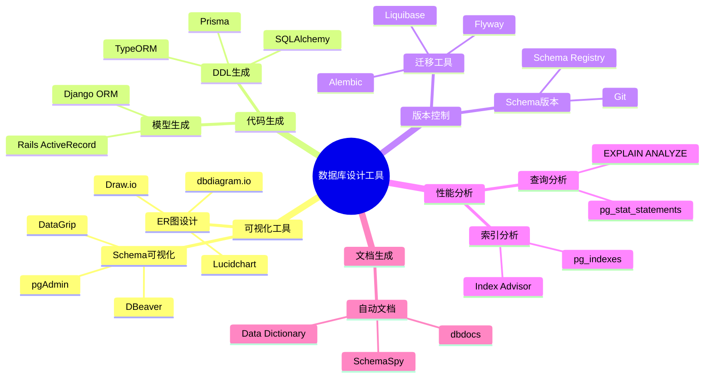
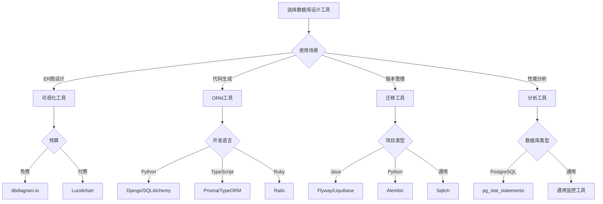

# 数据库设计工具集成指南：工具对比与自动化实践

> **创建日期**：2025-01-16
> **最后更新**：2025-01-16
> **版本**：v1.0
> **状态**：已完成 ✅
> **优先级**：P0

---

## 📋 目录

- [数据库设计工具集成指南：工具对比与自动化实践](#数据库设计工具集成指南工具对比与自动化实践)
  - [📋 目录](#-目录)
  - [1. 概述](#1-概述)
    - [1.1. 工具分类](#11-工具分类)
    - [1.2. 工具选择思维导图](#12-工具选择思维导图)
  - [2. 数据库设计工具对比](#2-数据库设计工具对比)
    - [2.1. 可视化设计工具](#21-可视化设计工具)
    - [2.2. 代码生成工具](#22-代码生成工具)
    - [2.3. 版本控制工具](#23-版本控制工具)
    - [2.4. 工具对比矩阵](#24-工具对比矩阵)
    - [2.5. 工具选择决策树](#25-工具选择决策树)
  - [3. 自动化脚本库](#3-自动化脚本库)
    - [3.1. Schema生成脚本](#31-schema生成脚本)
    - [3.2. 索引优化脚本](#32-索引优化脚本)
    - [3.3. 性能分析脚本](#33-性能分析脚本)
    - [3.4. 反模式检测脚本](#34-反模式检测脚本)
    - [3.5. 文档生成脚本](#35-文档生成脚本)
  - [4. CI/CD集成](#4-cicd集成)
    - [4.1. GitHub Actions集成](#41-github-actions集成)
    - [4.2. GitLab CI集成](#42-gitlab-ci集成)
    - [4.3. Jenkins集成](#43-jenkins集成)
  - [5. 实际案例](#5-实际案例)
    - [5.1. 案例1：自动化Schema生成](#51-案例1自动化schema生成)
    - [5.2. 案例2：自动化性能优化](#52-案例2自动化性能优化)
    - [5.3. 案例3：自动化文档生成](#53-案例3自动化文档生成)
  - [6. 最佳实践总结](#6-最佳实践总结)
    - [6.1. 工具选择原则](#61-工具选择原则)
    - [6.2. 自动化原则](#62-自动化原则)
  - [7. 参考资料](#7-参考资料)
    - [7.1. 工具资源](#71-工具资源)
    - [7.2. 相关文档](#72-相关文档)

---

## 1. 概述

本文档提供数据库设计工具的全面对比和自动化实践指南，帮助团队选择合适工具并实现自动化工作流。

### 1.1. 工具分类

**工具分类**：

1. **可视化设计工具**：ER图设计、Schema可视化
2. **代码生成工具**：从设计生成DDL、从DDL生成模型代码
3. **版本控制工具**：Schema版本管理、迁移管理
4. **性能分析工具**：查询分析、索引分析
5. **文档生成工具**：自动生成数据库文档

### 1.2. 工具选择思维导图



---

## 2. 数据库设计工具对比

### 2.1. 可视化设计工具

**工具对比**：

| 工具 | 类型 | 功能 | 价格 | 易用性 | 推荐度 |
|------|------|------|------|--------|--------|
| **dbdiagram.io** | 在线 | ER图设计、DDL生成 | 免费/付费 | ⭐⭐⭐⭐⭐ | ⭐⭐⭐⭐⭐ |
| **Draw.io** | 桌面/在线 | 通用图表设计 | 免费 | ⭐⭐⭐⭐ | ⭐⭐⭐⭐ |
| **Lucidchart** | 在线 | 专业图表设计 | 付费 | ⭐⭐⭐⭐⭐ | ⭐⭐⭐⭐ |
| **pgAdmin** | 桌面 | PostgreSQL管理 | 免费 | ⭐⭐⭐⭐ | ⭐⭐⭐⭐ |
| **DBeaver** | 桌面 | 通用数据库工具 | 免费/付费 | ⭐⭐⭐⭐⭐ | ⭐⭐⭐⭐⭐ |
| **DataGrip** | IDE | 数据库IDE | 付费 | ⭐⭐⭐⭐⭐ | ⭐⭐⭐⭐⭐ |

**dbdiagram.io示例**：

```dbml
// dbdiagram.io语法示例
Table users {
  id uuid [primary key]
  username varchar(50) [unique, not null]
  email varchar(100) [unique, not null]
  created_at timestamp [default: `now()`]
}

Table orders {
  id uuid [primary key]
  user_id uuid [ref: > users.id]
  total_amount decimal(10,2) [not null]
  created_at timestamp [default: `now()`]
}

Ref: orders.user_id > users.id [delete: cascade]
```

### 2.2. 代码生成工具

**工具对比**：

| 工具 | 语言 | 功能 | 易用性 | 推荐度 |
|------|------|------|--------|--------|
| **SQLAlchemy** | Python | ORM、DDL生成 | ⭐⭐⭐⭐ | ⭐⭐⭐⭐⭐ |
| **TypeORM** | TypeScript | ORM、迁移 | ⭐⭐⭐⭐ | ⭐⭐⭐⭐⭐ |
| **Prisma** | TypeScript | ORM、迁移 | ⭐⭐⭐⭐⭐ | ⭐⭐⭐⭐⭐ |
| **Django ORM** | Python | ORM、迁移 | ⭐⭐⭐⭐⭐ | ⭐⭐⭐⭐⭐ |
| **Rails ActiveRecord** | Ruby | ORM、迁移 | ⭐⭐⭐⭐⭐ | ⭐⭐⭐⭐⭐ |

**Prisma示例**：

```prisma
// schema.prisma
model User {
  id        String   @id @default(uuid())
  username  String   @unique
  email     String   @unique
  orders    Order[]
  createdAt DateTime @default(now())
}

model Order {
  id          String   @id @default(uuid())
  userId      String
  user        User     @relation(fields: [userId], references: [id])
  totalAmount Decimal  @db.Decimal(10, 2)
  createdAt   DateTime @default(now())
}
```

### 2.3. 版本控制工具

**工具对比**（见迁移文档7.1节）

### 2.4. 工具对比矩阵

| 工具类别 | 最佳工具 | 适用场景 | 推荐度 |
|---------|---------|---------|--------|
| **可视化设计** | dbdiagram.io | ER图设计、快速原型 | ⭐⭐⭐⭐⭐ |
| **数据库管理** | DBeaver | 通用数据库管理 | ⭐⭐⭐⭐⭐ |
| **代码生成** | Prisma | TypeScript项目 | ⭐⭐⭐⭐⭐ |
| **版本控制** | Flyway/Liquibase | Java项目 | ⭐⭐⭐⭐⭐ |
| **性能分析** | pg_stat_statements | PostgreSQL性能分析 | ⭐⭐⭐⭐⭐ |

### 2.5. 工具选择决策树



---

## 3. 自动化脚本库

### 3.1. Schema生成脚本

**Python Schema生成器**：

```python
# schema_generator.py
from typing import Dict, List
import psycopg2

class SchemaGenerator:
    def __init__(self, connection_string: str):
        self.conn = psycopg2.connect(connection_string)

    def generate_table_ddl(self, table_def: Dict) -> str:
        """生成表DDL"""
        ddl = f"CREATE TABLE {table_def['name']} (\n"

        columns = []
        for col in table_def['columns']:
            col_def = f"    {col['name']} {col['type']}"
            if col.get('not_null'):
                col_def += " NOT NULL"
            if col.get('default'):
                col_def += f" DEFAULT {col['default']}"
            columns.append(col_def)

        ddl += ",\n".join(columns)

        if table_def.get('primary_key'):
            ddl += f",\n    PRIMARY KEY ({', '.join(table_def['primary_key'])})"

        ddl += "\n);"
        return ddl

    def generate_index_ddl(self, index_def: Dict) -> str:
        """生成索引DDL"""
        unique = "UNIQUE " if index_def.get('unique') else ""
        ddl = f"CREATE {unique}INDEX {index_def['name']} ON {index_def['table']}"

        if index_def.get('method'):
            ddl += f" USING {index_def['method']}"

        ddl += f" ({', '.join(index_def['columns'])});"
        return ddl

    def generate_foreign_key_ddl(self, fk_def: Dict) -> str:
        """生成外键DDL"""
        ddl = f"ALTER TABLE {fk_def['table']}\n"
        ddl += f"    ADD CONSTRAINT {fk_def['name']}\n"
        ddl += f"    FOREIGN KEY ({fk_def['column']})\n"
        ddl += f"    REFERENCES {fk_def['referenced_table']}({fk_def['referenced_column']})"

        if fk_def.get('on_delete'):
            ddl += f"\n    ON DELETE {fk_def['on_delete']}"
        if fk_def.get('on_update'):
            ddl += f"\n    ON UPDATE {fk_def['on_update']}"

        ddl += ";"
        return ddl
```

### 3.2. 索引优化脚本

**索引优化脚本**：

```python
# index_optimizer.py
import psycopg2
from typing import List, Dict

class IndexOptimizer:
    def __init__(self, connection_string: str):
        self.conn = psycopg2.connect(connection_string)

    def analyze_index_usage(self) -> List[Dict]:
        """分析索引使用情况"""
        query = """
        SELECT
            schemaname,
            tablename,
            indexname,
            idx_scan,
            idx_tup_read,
            idx_tup_fetch
        FROM pg_stat_user_indexes
        WHERE idx_scan = 0
        ORDER BY idx_tup_read DESC;
        """
        cursor = self.conn.cursor()
        cursor.execute(query)
        return [{
            'schema': row[0],
            'table': row[1],
            'index': row[2],
            'scans': row[3],
            'reads': row[4],
            'fetches': row[5]
        } for row in cursor.fetchall()]

    def suggest_indexes(self, table_name: str) -> List[Dict]:
        """建议索引"""
        query = """
        SELECT
            schemaname,
            tablename,
            seq_scan,
            seq_tup_read,
            idx_scan,
            seq_scan - idx_scan AS too_many_seq_scans
        FROM pg_stat_user_tables
        WHERE tablename = %s
        AND seq_scan > idx_scan + 1000;
        """
        cursor = self.conn.cursor()
        cursor.execute(query, (table_name,))
        results = cursor.fetchall()

        suggestions = []
        for row in results:
            if row[5] > 10000:  # 太多顺序扫描
                suggestions.append({
                    'table': row[1],
                    'issue': 'too_many_seq_scans',
                    'suggestion': f'Consider adding indexes on frequently queried columns'
                })

        return suggestions
```

### 3.3. 性能分析脚本

**性能分析脚本**：

```python
# performance_analyzer.py
import psycopg2
from typing import List, Dict

class PerformanceAnalyzer:
    def __init__(self, connection_string: str):
        self.conn = psycopg2.connect(connection_string)

    def get_slow_queries(self, threshold_ms: int = 1000) -> List[Dict]:
        """获取慢查询"""
        query = """
        SELECT
            query,
            calls,
            total_exec_time,
            mean_exec_time,
            max_exec_time
        FROM pg_stat_statements
        WHERE mean_exec_time > %s
        ORDER BY mean_exec_time DESC
        LIMIT 20;
        """
        cursor = self.conn.cursor()
        cursor.execute(query, (threshold_ms,))
        return [{
            'query': row[0][:100],  # 截断长查询
            'calls': row[1],
            'total_time': row[2],
            'mean_time': row[3],
            'max_time': row[4]
        } for row in cursor.fetchall()]

    def analyze_table_statistics(self) -> List[Dict]:
        """分析表统计信息"""
        query = """
        SELECT
            schemaname,
            tablename,
            n_live_tup,
            n_dead_tup,
            last_vacuum,
            last_autovacuum
        FROM pg_stat_user_tables
        ORDER BY n_dead_tup DESC;
        """
        cursor = self.conn.cursor()
        cursor.execute(query)
        return [{
            'schema': row[0],
            'table': row[1],
            'live_tuples': row[2],
            'dead_tuples': row[3],
            'last_vacuum': row[4],
            'last_autovacuum': row[5]
        } for row in cursor.fetchall()]
```

### 3.4. 反模式检测脚本

**反模式检测脚本**（见反模式文档8.3节）

### 3.5. 文档生成脚本

**文档生成脚本**：

```python
# doc_generator.py
import psycopg2
from typing import Dict, List
import json

class DocGenerator:
    def __init__(self, connection_string: str):
        self.conn = psycopg2.connect(connection_string)

    def generate_schema_doc(self) -> str:
        """生成Schema文档"""
        tables = self.get_tables()

        doc = "# Database Schema Documentation\n\n"
        doc += f"Generated on: {datetime.now()}\n\n"

        for table in tables:
            doc += f"## Table: {table['name']}\n\n"
            doc += f"**Description**: {table.get('comment', 'N/A')}\n\n"

            doc += "### Columns\n\n"
            doc += "| Column | Type | Nullable | Default | Description |\n"
            doc += "|--------|------|----------|---------|-------------|\n"

            for col in table['columns']:
                doc += f"| {col['name']} | {col['type']} | "
                doc += f"{'Yes' if col['nullable'] else 'No'} | "
                doc += f"{col.get('default', 'N/A')} | {col.get('comment', '')} |\n"

            doc += "\n"

        return doc

    def get_tables(self) -> List[Dict]:
        """获取所有表信息"""
        query = """
        SELECT
            t.table_name,
            obj_description(c.oid) as table_comment
        FROM information_schema.tables t
        JOIN pg_class c ON c.relname = t.table_name
        WHERE t.table_schema = 'public'
        AND t.table_type = 'BASE TABLE'
        ORDER BY t.table_name;
        """
        cursor = self.conn.cursor()
        cursor.execute(query)

        tables = []
        for row in cursor.fetchall():
            table = {
                'name': row[0],
                'comment': row[1],
                'columns': self.get_columns(row[0])
            }
            tables.append(table)

        return tables

    def get_columns(self, table_name: str) -> List[Dict]:
        """获取表列信息"""
        query = """
        SELECT
            column_name,
            data_type,
            is_nullable,
            column_default,
            col_description(c.oid, a.attnum) as column_comment
        FROM information_schema.columns c
        JOIN pg_class cl ON cl.relname = %s
        JOIN pg_attribute a ON a.attrelid = cl.oid AND a.attname = c.column_name
        WHERE table_name = %s
        ORDER BY ordinal_position;
        """
        cursor = self.conn.cursor()
        cursor.execute(query, (table_name, table_name))

        return [{
            'name': row[0],
            'type': row[1],
            'nullable': row[2] == 'YES',
            'default': row[3],
            'comment': row[4]
        } for row in cursor.fetchall()]
```

---

## 4. CI/CD集成

### 4.1. GitHub Actions集成

**GitHub Actions工作流**：

```yaml
# .github/workflows/db-migration.yml
name: Database Migration

on:
  push:
    branches: [ main ]
    paths:
      - 'migrations/**'

jobs:
  migrate:
    runs-on: ubuntu-latest
    steps:
      - uses: actions/checkout@v2

      - name: Setup PostgreSQL
        uses: harmon758/postgresql-action@v1
        with:
          postgresql version: '14'
          postgresql db: 'test_db'
          postgresql user: 'postgres'
          postgresql password: 'postgres'

      - name: Run Migrations
        run: |
          flyway migrate \
            -url=jdbc:postgresql://localhost:5432/test_db \
            -user=postgres \
            -password=postgres \
            -locations=filesystem:migrations

      - name: Run Tests
        run: |
          pytest tests/
```

### 4.2. GitLab CI集成

**GitLab CI配置**：

```yaml
# .gitlab-ci.yml
stages:
  - migrate
  - test

migrate:
  stage: migrate
  image: postgres:14
  services:
    - postgres:14
  variables:
    POSTGRES_DB: test_db
    POSTGRES_USER: postgres
    POSTGRES_PASSWORD: postgres
  script:
    - flyway migrate
      -url=jdbc:postgresql://postgres:5432/test_db
      -user=postgres
      -password=postgres
      -locations=filesystem:migrations

test:
  stage: test
  image: python:3.9
  script:
    - pip install -r requirements.txt
    - pytest tests/
```

### 4.3. Jenkins集成

**Jenkins Pipeline**：

```groovy
// Jenkinsfile
pipeline {
    agent any

    stages {
        stage('Migrate') {
            steps {
                sh '''
                    flyway migrate \
                        -url=jdbc:postgresql://localhost:5432/test_db \
                        -user=postgres \
                        -password=postgres \
                        -locations=filesystem:migrations
                '''
            }
        }

        stage('Test') {
            steps {
                sh 'pytest tests/'
            }
        }
    }
}
```

---

## 5. 实际案例

### 5.1. 案例1：自动化Schema生成

**场景**：从YAML定义自动生成PostgreSQL Schema

**实现**：

```python
# 使用Schema生成器
generator = SchemaGenerator(connection_string)

table_def = {
    'name': 'users',
    'columns': [
        {'name': 'id', 'type': 'UUID', 'not_null': True, 'default': 'gen_random_uuid()'},
        {'name': 'username', 'type': 'VARCHAR(50)', 'not_null': True},
        {'name': 'email', 'type': 'VARCHAR(100)', 'not_null': True}
    ],
    'primary_key': ['id']
}

ddl = generator.generate_table_ddl(table_def)
print(ddl)
```

### 5.2. 案例2：自动化性能优化

**场景**：自动检测并优化慢查询

**实现**：

```python
# 使用性能分析器
analyzer = PerformanceAnalyzer(connection_string)

# 获取慢查询
slow_queries = analyzer.get_slow_queries(threshold_ms=1000)

# 自动优化
for query in slow_queries:
    suggestions = optimizer.suggest_indexes(query['table'])
    print(f"Query: {query['query']}")
    print(f"Suggestions: {suggestions}")
```

### 5.3. 案例3：自动化文档生成

**场景**：自动生成数据库文档

**实现**：

```python
# 使用文档生成器
generator = DocGenerator(connection_string)

# 生成文档
doc = generator.generate_schema_doc()

# 保存到文件
with open('schema_doc.md', 'w') as f:
    f.write(doc)
```

---

## 6. 最佳实践总结

### 6.1. 工具选择原则

1. **需求驱动**：根据实际需求选择工具
2. **团队熟悉度**：选择团队熟悉的工具
3. **成本考虑**：平衡功能和成本
4. **可扩展性**：考虑未来扩展需求

### 6.2. 自动化原则

1. **逐步自动化**：从简单任务开始
2. **测试充分**：自动化脚本要充分测试
3. **文档完善**：记录自动化流程
4. **持续改进**：根据反馈持续改进

---

## 7. 参考资料

### 7.1. 工具资源

- [dbdiagram.io](https://dbdiagram.io/)
- [Prisma文档](https://www.prisma.io/docs)
- [Flyway文档](https://flywaydb.org/)
- [DBeaver文档](https://dbeaver.io/)

### 7.2. 相关文档

- [数据库设计工具与模板库](./07.15-数据库设计工具与模板库.md)
- [数据库迁移与版本管理](./07.07-数据库迁移与版本管理.md)
- [数据库性能调优实战](./07.08-数据库性能调优实战.md)

---

**创建日期**：2025-01-16
**最后更新**：2025-01-16
**版本**：v1.0
**状态**：已完成 ✅
**维护者**：Data-Science Team
