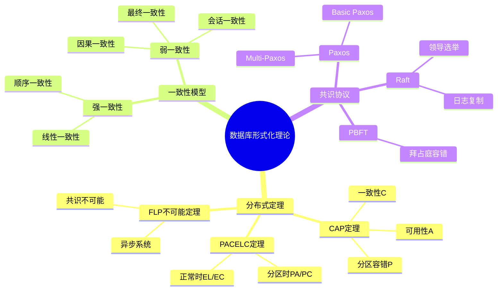
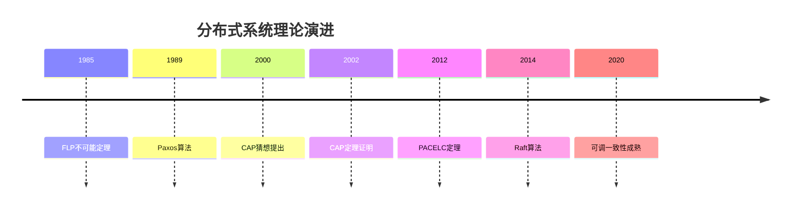
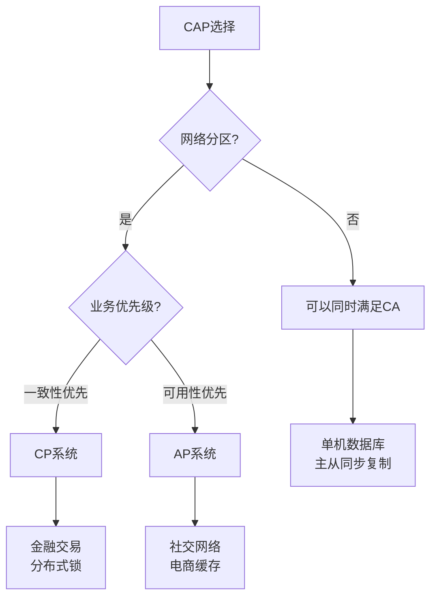
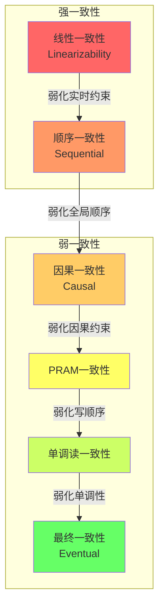
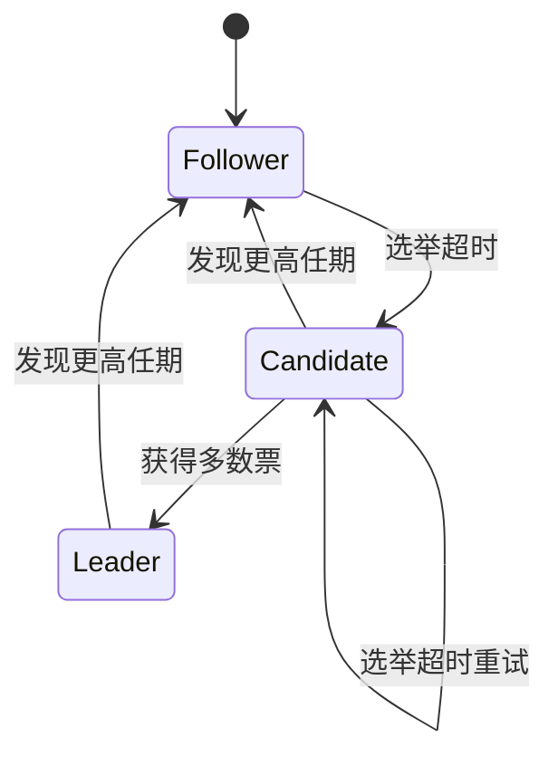

# 数据库设计形式化理论：CAP、PACELC与一致性模型

> **创建日期**：2025-12-01
> **最后更新**：2025-12-01
> **版本**：v1.0
> **状态**：实施中

---

## 📋 目录

- [数据库设计形式化理论：CAP、PACELC与一致性模型](#数据库设计形式化理论cappacelc与一致性模型)
  - [📋 目录](#-目录)
  - [1. 概述](#1-概述)
    - [1.1. 形式化理论知识图谱](#11-形式化理论知识图谱)
    - [1.2. 理论发展时间线](#12-理论发展时间线)
  - [2. CAP定理](#2-cap定理)
    - [2.1. 形式化定义](#21-形式化定义)
    - [2.2. CAP定理证明](#22-cap定理证明)
    - [2.3. CAP权衡决策矩阵](#23-cap权衡决策矩阵)
  - [3. PACELC定理](#3-pacelc定理)
    - [3.1. 形式化定义](#31-形式化定义)
    - [3.2. PACELC系统分类](#32-pacelc系统分类)
  - [4. 一致性模型层级](#4-一致性模型层级)
    - [4.1. 一致性模型形式化](#41-一致性模型形式化)
    - [4.2. 一致性模型对比](#42-一致性模型对比)
  - [5. 共识协议](#5-共识协议)
    - [5.1. Paxos算法](#51-paxos算法)
    - [5.2. Raft算法](#52-raft算法)
  - [6. 参考资料](#6-参考资料)
    - [6.1. 权威文献](#61-权威文献)
    - [6.2. 在线资源](#62-在线资源)
    - [6.3. 相关文档](#63-相关文档)

---

## 1. 概述

本文档提供数据库设计的形式化理论基础，包括分布式系统的核心定理和一致性模型。

### 1.1. 形式化理论知识图谱



### 1.2. 理论发展时间线



---

## 2. CAP定理

### 2.1. 形式化定义

**定理2.1（CAP定理 - Brewer, 2000; Gilbert & Lynch, 2002）**

在分布式系统中，不可能同时保证以下三个属性：

**形式化模型**：

```text
设分布式系统 S = (N, L, R, W) 其中：
- N = {n₁, n₂, ..., nₖ} 是节点集合
- L ⊆ N × N 是网络链接
- R: N → V 是读操作（返回值V）
- W: N × V → Bool 是写操作

定义三个属性：

1. 一致性 (Consistency):
   ∀n₁, n₂ ∈ N, ∀t: R(n₁, t) = R(n₂, t) after W(nₓ, v, t-1)
   即：所有节点在同一时刻看到相同的数据

2. 可用性 (Availability):
   ∀n ∈ N, ∀r ∈ Request: ∃response ∈ Response such that
   respond(n, r) within bounded time T
   即：每个请求都能得到响应

3. 分区容错 (Partition Tolerance):
   System continues to operate despite
   arbitrary partitioning due to network failures
   即：网络分区时系统继续运行

CAP定理: ¬(C ∧ A ∧ P)
```

### 2.2. CAP定理证明

**证明（反证法）**：

```text
假设存在系统S同时满足C、A、P。

构造场景：
1. 设网络分区将节点分为两组 G₁ 和 G₂
2. 客户端c₁连接到G₁，执行写操作 W(v₁)
3. 客户端c₂连接到G₂，执行读操作 R()

分析：
Case 1: 如果系统满足A（可用性）
  - G₂必须响应c₂的读请求
  - 由于网络分区，G₂无法获取G₁的最新写入
  - 因此R()返回旧值，违反C（一致性）

Case 2: 如果系统满足C（一致性）
  - G₂必须返回最新值v₁
  - 但G₂无法与G₁通信获取v₁
  - 因此G₂必须拒绝请求或无限等待，违反A（可用性）

结论：在P（分区）发生时，系统必须在C和A之间选择
因此 ¬(C ∧ A ∧ P) ∎
```

### 2.3. CAP权衡决策矩阵



| 选择 | 牺牲 | 行为 | 代表系统 | 适用场景 |
|------|------|------|---------|---------|
| **CP** | 可用性 | 分区时拒绝服务 | ZooKeeper, etcd, Consul | 配置管理、分布式锁 |
| **AP** | 一致性 | 分区时返回可能过期数据 | Cassandra, DynamoDB, CouchDB | 高可用服务、缓存 |
| **CA** | 分区容错 | 不处理分区（单机/同步复制） | PostgreSQL单机, MySQL主从 | 传统数据库 |

---

## 3. PACELC定理

### 3.1. 形式化定义

**定理3.1（PACELC定理 - Abadi, 2012）**

扩展CAP定理，考虑无分区时的延迟-一致性权衡：

```text
PACELC定理形式化：

设系统S的行为函数：
  behavior(S) = (partition_behavior, else_behavior)

分区时行为：
  partition_behavior ∈ {PA, PC}
  - PA: 选择可用性（Availability）
  - PC: 选择一致性（Consistency）

正常时行为：
  else_behavior ∈ {EL, EC}
  - EL: 选择低延迟（Latency）
  - EC: 选择一致性（Consistency）

完整分类：
  PACELC(S) = partition_behavior / else_behavior
  可能值：PA/EL, PA/EC, PC/EL, PC/EC
```

### 3.2. PACELC系统分类

| 系统 | 分区时(P) | 正常时(E) | 一致性级别 | 延迟 |
|------|----------|----------|-----------|------|
| **DynamoDB** | PA | EL | 最终一致 | 低 |
| **Cassandra** | PA | EL | 可调 | 低 |
| **MongoDB** | PA | EC | 可调 | 中 |
| **PostgreSQL** | PC | EC | 强一致 | 中高 |
| **CockroachDB** | PC | EL | 强一致 | 中 |
| **Spanner** | PC | EC | 强一致 | 高 |

```mermaid
quadrantChart
    title PACELC系统分类
    x-axis 低延迟(EL) --> 强一致(EC)
    y-axis 可用性(PA) --> 一致性(PC)
    quadrant-1 PC/EC强一致高延迟
    quadrant-2 PC/EL强一致低延迟
    quadrant-3 PA/EL高可用低延迟
    quadrant-4 PA/EC高可用强一致
    DynamoDB: [0.2, 0.2]
    Cassandra: [0.3, 0.25]
    MongoDB: [0.7, 0.3]
    PostgreSQL: [0.85, 0.8]
    CockroachDB: [0.4, 0.85]
    Spanner: [0.9, 0.9]
```

---

## 4. 一致性模型层级

### 4.1. 一致性模型形式化

**定义4.1（线性一致性 - Herlihy & Wing, 1990）**

```text
历史H是线性一致的，当且仅当存在线性扩展H'：
1. H'是H的一个排列
2. H'保持所有操作的实时顺序
3. H'中每个读操作返回最近写入的值

形式化：
∀op₁, op₂ ∈ H:
  end(op₁) < start(op₂) ⟹ op₁ <_H' op₂
  且 ∀read r: value(r) = value(most_recent_write_before(r))
```

**定义4.2（顺序一致性 - Lamport, 1979）**

```text
历史H是顺序一致的，当且仅当存在全序S：
1. S包含H中所有操作
2. S保持每个进程内的程序顺序
3. S中每个读操作返回最近写入的值

形式化：
∀process p, ∀op₁, op₂ ∈ H_p:
  op₁ <_program op₂ ⟹ op₁ <_S op₂
```

**定义4.3（因果一致性）**

```text
历史H是因果一致的，当且仅当：
对于任意两个因果相关的操作op₁ →_causal op₂，
所有进程看到op₁先于op₂

因果关系定义：
- 同进程程序顺序
- 读操作依赖于写操作
- 传递性

形式化：
∀op₁, op₂: op₁ →_causal op₂ ⟹ ∀p: see_order_p(op₁) < see_order_p(op₂)
```

### 4.2. 一致性模型对比



| 一致性级别 | 全局顺序 | 实时顺序 | 因果顺序 | 延迟 | 可用性 |
|-----------|---------|---------|---------|------|--------|
| **线性一致** | ✅ | ✅ | ✅ | 高 | 低 |
| **顺序一致** | ✅ | ❌ | ✅ | 中高 | 中 |
| **因果一致** | ❌ | ❌ | ✅ | 中 | 中高 |
| **最终一致** | ❌ | ❌ | ❌ | 低 | 高 |

---

## 5. 共识协议

### 5.1. Paxos算法

**Basic Paxos形式化**：

```text
角色：
- Proposer: 提出提案
- Acceptor: 接受提案
- Learner: 学习决定

两阶段协议：

Phase 1 (Prepare):
  Proposer → Acceptors: prepare(n)  // n是提案编号
  Acceptor响应:
    if n > max_seen_n then
      promise(n, accepted_value)
      max_seen_n = n
    else
      reject

Phase 2 (Accept):
  if Proposer收到多数派promise then
    Proposer → Acceptors: accept(n, v)
    Acceptor响应:
      if n >= max_seen_n then
        accepted(n, v)
      else
        reject

决定条件：
  if 多数派Acceptors accepted(n, v) then
    v is decided
```

### 5.2. Raft算法

**Raft状态机**：



**Raft日志复制**：

```text
Leader日志复制流程：

1. 客户端请求：client → Leader
2. Leader追加日志：log.append(entry)
3. 复制请求：Leader → Followers: AppendEntries(entries)
4. Follower响应：
   if log匹配 then
     追加entries
     响应success
   else
     响应failure
5. 提交决定：
   if 多数派success then
     commit(entry)
     响应client
```

---

## 6. 参考资料

### 6.1. 权威文献

**分布式系统理论**：

- Gilbert, S. & Lynch, N. (2002). "Brewer's Conjecture and the Feasibility of Consistent, Available, Partition-Tolerant Web Services"
- Abadi, D. (2012). "Consistency Tradeoffs in Modern Distributed Database System Design"
- Lamport, L. (1998). "The Part-Time Parliament" (Paxos)
- Ongaro, D. & Ousterhout, J. (2014). "In Search of an Understandable Consensus Algorithm" (Raft)
- Herlihy, M. & Wing, J. (1990). "Linearizability: A Correctness Condition for Concurrent Objects"

### 6.2. 在线资源

| 资源 | URL | 描述 |
|------|-----|------|
| **Raft可视化** | <https://raft.github.io> | Raft算法可视化 |
| **Jepsen测试** | <https://jepsen.io> | 分布式系统测试 |
| **MIT 6.824** | <https://pdos.csail.mit.edu/6.824/> | 分布式系统课程 |

### 6.3. 相关文档

- [07.05-现代数据库设计模式](./07.05-现代数据库设计模式.md)
- [07.17-分布式数据库设计模式](./07.17-分布式数据库设计模式.md)

---

**最后更新**：2025-12-01
**维护者**：Data-Science Team
**状态**：实施中
**版本**：v1.0
