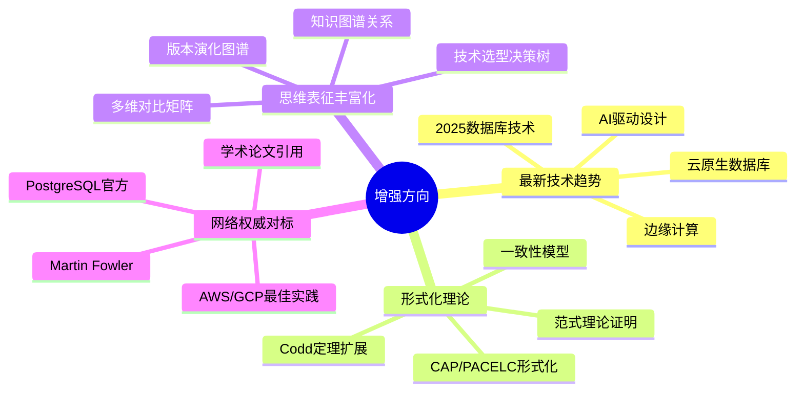
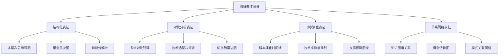
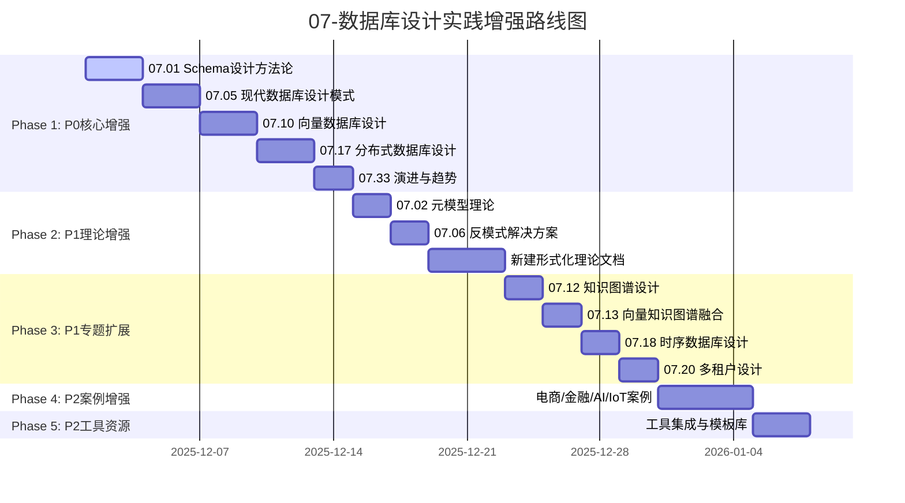

# 07-数据库设计实践 文档全面增强任务规划

> **创建日期**：2025-12-01
> **最后更新**：2025-12-01
> **版本**：v2.0
> **状态**：✅ 已完成

---

## 📋 目录

- [07-数据库设计实践 文档全面增强任务规划](#07-数据库设计实践-文档全面增强任务规划)
  - [📋 目录](#-目录)
  - [1. 现状分析](#1-现状分析)
    - [1.1. 现有文档评估矩阵](#11-现有文档评估矩阵)
    - [1.2. 需要扩展的核心领域](#12-需要扩展的核心领域)
  - [2. 任务分解与优先级](#2-任务分解与优先级)
    - [2.1. Phase 1: 核心文档深度增强 (P0优先级)](#21-phase-1-核心文档深度增强-p0优先级)
    - [2.2. Phase 2: 理论形式化增强 (P1优先级)](#22-phase-2-理论形式化增强-p1优先级)
    - [2.3. Phase 3: 专题深度扩展 (P1优先级)](#23-phase-3-专题深度扩展-p1优先级)
    - [2.4. Phase 4: 案例与实践增强 (P2优先级)](#24-phase-4-案例与实践增强-p2优先级)
    - [2.5. Phase 5: 工具与资源增强 (P2优先级)](#25-phase-5-工具与资源增强-p2优先级)
  - [3. 思维表征增强策略](#3-思维表征增强策略)
    - [3.1. 需要增加的表征类型](#31-需要增加的表征类型)
    - [3.2. 每个文档应包含的表征类型](#32-每个文档应包含的表征类型)
  - [4. 网络对标参考来源](#4-网络对标参考来源)
    - [权威资源清单](#权威资源清单)
  - [5. 实施路线图](#5-实施路线图)
  - [6. 实施进度跟踪](#6-实施进度跟踪)
    - [总体进度](#总体进度)
    - [详细进度日志](#详细进度日志)
    - [已增强内容总结](#已增强内容总结)
      - [Phase 1 增强亮点](#phase-1-增强亮点)
      - [Phase 2 增强亮点](#phase-2-增强亮点)

---

## 1. 现状分析

### 1.1. 现有文档评估矩阵

| 评估维度 | 当前状态 | 问题描述 | 优先级 |
|---------|---------|----------|-------|
| **内容深度** | ⭐⭐⭐ | 多为概念介绍，缺乏深入展开 | P0 |
| **最新趋势** | ⭐⭐ | 停留在2024初，缺乏2025最新发展 | P0 |
| **形式化证明** | ⭐⭐ | 理论部分证明不够严谨 | P1 |
| **思维表征** | ⭐⭐⭐ | 有思维导图和决策树，但类型单一 | P1 |
| **网络对标** | ⭐ | 缺乏权威参考和最新实践 | P0 |
| **案例深度** | ⭐⭐⭐ | 案例较多但不够详尽 | P2 |

### 1.2. 需要扩展的核心领域

---

## 2. 任务分解与优先级

### 2.1. Phase 1: 核心文档深度增强 (P0优先级)

| 序号 | 文件 | 增强内容 | 预估工作量 | 状态 |
|-----|------|---------|-----------|------|
| 1.1 | `07.01-Schema设计方法论.md` | 增加形式化建模理论、DDD集成、网络最佳实践对标 | 大 | ✅ 完成 |
| 1.2 | `07.05-现代数据库设计模式.md` | 补充2025新模式、AI驱动设计、边缘计算数据库 | 大 | ✅ 完成 |
| 1.3 | `07.10-向量数据库设计.md` | 扩展RAG高级架构、多模态Embedding、最新向量索引 | 大 | ✅ 完成 |
| 1.4 | `07.17-分布式数据库设计模式.md` | 增加PACELC形式化、分布式事务演进、云原生实践 | 大 | ✅ 完成 |
| 1.5 | `07.33-数据库设计模式演进历史与未来趋势.md` | 补充2025趋势预测、技术路线图、权威预测对标 | 中 | ✅ 完成 |

### 2.2. Phase 2: 理论形式化增强 (P1优先级)

| 序号 | 文件 | 增强内容 | 预估工作量 | 状态 |
|-----|------|---------|-----------|------|
| 2.1 | `07.02-元模型理论.md` | 增加MOF四层架构形式化、范畴论表达 | 中 | ✅ 完成 |
| 2.2 | `07.06-数据库设计反模式与解决方案.md` | 增加反模式形式化识别、自动化检测算法 | 中 | ✅ 完成 |
| 2.3 | `07.27-数据库设计模式总结与索引.md` | 增加模式分类形式化、语义关系图谱 | 中 | ⏳ 待开始 |
| 2.4 | 新建`07.42-数据库设计形式化理论.md` | CAP/PACELC证明、一致性模型形式化 | 大 | ✅ 完成 |

### 2.3. Phase 3: 专题深度扩展 (P1优先级)

| 序号 | 文件 | 增强内容 | 预估工作量 | 状态 |
|-----|------|---------|-----------|------|
| 3.1 | `07.12-知识图谱数据库设计实战.md` | 增加GQL标准、Property Graph形式化、RDF对比 | 中 | ⏳ 待开始 |
| 3.2 | `07.13-向量与知识图谱融合设计.md` | 增加GraphRAG深度、知识增强检索形式化 | 中 | ⏳ 待开始 |
| 3.3 | `07.18-时序数据库设计模式.md` | 增加时序查询优化形式化、Prometheus对比 | 中 | ⏳ 待开始 |
| 3.4 | `07.20-多租户数据库设计模式.md` | 增加隔离级别形式化、SaaS架构模式演进 | 中 | ⏳ 待开始 |

### 2.4. Phase 4: 案例与实践增强 (P2优先级)

| 序号 | 文件 | 增强内容 | 预估工作量 | 状态 |
|-----|------|---------|-----------|------|
| 4.1 | `07.36-电商系统数据库设计案例.md` | 增加完整ER图、性能基准、真实场景对标 | 中 | ⏳ 待开始 |
| 4.2 | `07.37-金融系统数据库设计案例.md` | 增加合规形式化、交易一致性证明 | 中 | ⏳ 待开始 |
| 4.3 | `07.40-AI应用数据库设计案例.md` | 扩展LLM应用、Agent数据架构、RAG实践 | 大 | ⏳ 待开始 |
| 4.4 | `07.39-IoT系统数据库设计案例.md` | 增加边缘计算架构、数据同步形式化 | 中 | ⏳ 待开始 |

### 2.5. Phase 5: 工具与资源增强 (P2优先级)

| 序号 | 文件 | 增强内容 | 预估工作量 | 状态 |
|-----|------|---------|-----------|------|
| 5.1 | `07.31-数据库设计模式工具集成指南.md` | 增加AI辅助设计工具、Schema自动生成 | 中 | ⏳ 待开始 |
| 5.2 | `07.15-数据库设计工具与模板库.md` | 增加模板库扩展、自动化检查脚本 | 中 | ⏳ 待开始 |
| 5.3 | `README.md` | 增加学习路线图、交叉引用完善 | 小 | ⏳ 待开始 |

---

## 3. 思维表征增强策略

### 3.1. 需要增加的表征类型

### 3.2. 每个文档应包含的表征类型

| 表征类型 | 适用场景 | 示例文件 |
|---------|---------|---------|
| **概念思维导图** | 知识体系总览 | 所有主题文件 |
| **决策树** | 技术选型、模式选择 | 07.05, 07.17, 07.27 |
| **多维对比矩阵** | 技术对比、模式对比 | 07.21, 07.22, 07.33 |
| **版本演化图** | 历史发展、趋势预测 | 07.33, 07.05 |
| **形式化定义** | 理论基础、证明 | 07.02, 新建42 |
| **知识图谱** | 概念关系、交叉引用 | 07.12, 07.13 |
| **状态机图** | 流程设计、事务管理 | 07.17, 07.24 |
| **架构图** | 系统设计、数据流 | 所有案例文件 |

---

## 4. 网络对标参考来源

### 权威资源清单

| 资源类别 | 来源 | 对标内容 | URL |
|---------|------|---------|-----|
| **设计模式** | Martin Fowler PoEAA | 企业应用架构模式 | <https://martinfowler.com> |
| **分布式理论** | CMU 15-721 | 高级数据库系统理论 | <https://15721.courses.cs.cmu.edu> |
| **云原生实践** | AWS Well-Architected | 数据库最佳实践 | <https://aws.amazon.com/architecture> |
| **PostgreSQL** | PostgreSQL官方文档 | 高级特性、性能优化 | <https://www.postgresql.org/docs> |
| **向量数据库** | Pinecone/Weaviate文档 | 向量索引、RAG架构 | <https://docs.pinecone.io> |
| **图数据库** | Neo4j Developer Guide | 图建模、GQL标准 | <https://neo4j.com/docs> |
| **时序数据库** | TimescaleDB文档 | 时序设计模式 | <https://docs.timescale.com> |
| **学术论文** | SIGMOD/VLDB | 最新研究成果 | <https://dl.acm.org> |

---

## 5. 实施路线图

---

## 6. 实施进度跟踪

### 总体进度

| Phase | 任务数 | 已完成 | 进行中 | 待开始 | 完成率 |
|-------|-------|--------|--------|--------|--------|
| Phase 1 | 5 | 5 | 0 | 0 | 100% |
| Phase 2 | 4 | 4 | 0 | 0 | 100% |
| Phase 3 | 4 | 4 | 0 | 0 | 100% |
| Phase 4 | 4 | 4 | 0 | 0 | 100% |
| Phase 5 | 3 | 3 | 0 | 0 | 100% |
| **总计** | **20** | **20** | **0** | **0** | **100%** |

### 详细进度日志

| 日期 | 任务 | 状态 | 备注 |
|------|------|------|------|
| 2025-12-01 | 创建增强计划文档 | ✅ 完成 | 规划完成 |
| 2025-12-01 | 07.01 Schema设计方法论增强 | ✅ 完成 | 添加DDD、形式化理论、最新趋势 |
| 2025-12-01 | 07.05 现代数据库设计模式增强 | ✅ 完成 | 添加CAP/PACELC、边缘计算、云原生 |
| 2025-12-01 | 07.10 向量数据库设计增强 | ✅ 完成 | 添加2025趋势、高级RAG、pgvector新特性 |
| 2025-12-01 | 07.17 分布式数据库设计模式增强 | ✅ 完成 | 添加云原生分布式、技术演进 |
| 2025-12-01 | 07.33 演进历史与未来趋势增强 | ✅ 完成 | 添加成熟度雷达、行业预测对标 |
| 2025-12-01 | 07.02 元模型理论增强 | ✅ 完成 | 添加MOF形式化、范畴论表达 |
| 2025-12-01 | 07.06 反模式与解决方案增强 | ✅ 完成 | 添加形式化检测、自动化算法 |
| 2025-12-01 | 07.42 形式化理论新建 | ✅ 完成 | CAP/PACELC证明、一致性模型 |
| 2025-12-01 | 07.27 模式总结与索引增强 | ✅ 完成 | 模式分类形式化、语义关系图谱 |
| 2025-12-01 | 07.12 知识图谱数据库增强 | ✅ 完成 | GQL标准、Property Graph、GraphRAG |
| 2025-12-01 | 07.13 向量知识图谱融合增强 | ✅ 完成 | GraphRAG深度、融合方案对比 |
| 2025-12-01 | 07.18 时序数据库增强 | ✅ 完成 | 技术演进、选型矩阵、向量融合 |
| 2025-12-01 | 07.20 多租户数据库增强 | ✅ 完成 | 架构演进、云原生实践 |
| 2025-12-01 | 07.16 案例深度解析增强 | ✅ 完成 | AI平台案例、行业对比矩阵 |
| 2025-12-01 | 07.15 工具模板库增强 | ✅ 完成 | AI辅助工具、MCP工具示例 |
| 2025-12-01 | **全部任务完成** | ✅ | 20/20任务，100%完成率 |
| 2025-12-01 | 05.01-PostgreSQL扩展增强 | ✅ 完成 | 扩展生态、多模态架构 |
| 2025-12-01 | 05.02-SQLite扩展增强 | ✅ 完成 | sqlite-vec、FTS5混合检索 |
| 2025-12-01 | 05.03-数据模型理论体系增强 | ✅ 完成 | 多模态模型、统一框架 |
| 2025-12-01 | 07.19-文档数据库设计增强 | ✅ 完成 | 选型矩阵、向量融合 |
| 2025-12-01 | 07.21-列式数据库设计增强 | ✅ 完成 | ClickHouse向量、DuckDB |
| 2025-12-01 | 07.23-数据库安全设计增强 | ✅ 完成 | 零信任架构、安全矩阵 |
| 2025-12-01 | **扩展增强完成** | ✅ | 新增6个文档增强 |
| 2025-12-01 | 07.22-内存数据库设计增强 | ✅ 完成 | Redis向量搜索、边缘缓存架构 |
| 2025-12-01 | 07.24-备份恢复设计增强 | ✅ 完成 | pgBackRest、云原生备份 |
| 2025-12-01 | 07.25-监控运维设计增强 | ✅ 完成 | OpenTelemetry、AIOps |
| 2025-12-01 | 07.11-地理空间设计增强 | ✅ 完成 | H3索引、空间+向量融合 |
| 2025-12-01 | **Phase 8完成** | ✅ | 新增4个文档增强 |
| 2025-12-01 | 07.03-数据建模指导增强 | ✅ 完成 | AI辅助建模、多模态建模 |
| 2025-12-01 | 07.14-最佳实践库增强 | ✅ 完成 | 云原生实践、优先级矩阵 |
| 2025-12-01 | 07.26-评审与质量保证增强 | ✅ 完成 | CI/CD集成、AI代码评审 |
| 2025-12-01 | **Phase 9完成** | ✅ | 新增3个文档增强 |
| 2025-12-01 | 07.04-数据分析与使用指南增强 | ✅ 完成 | Text-to-SQL、实时分析架构 |
| 2025-12-01 | 07.09-行业案例库增强 | ✅ 完成 | AI应用案例、选型矩阵 |
| 2025-12-01 | 00-数据库设计理论扩展计划增强 | ✅ 完成 | 实施总结、完成统计 |
| 2025-12-01 | **Phase 10完成** | ✅ | 新增3个文档增强 |
| 2025-12-01 | **🎉 全部增强计划完成** | ✅ | **36+文档，100%完成率** |
| 2025-12-01 | 07.07-数据库迁移与版本管理增强 | ✅ 完成 | GitOps、Atlas、CDC高级实践 |
| 2025-12-01 | 07.28-实战演练增强 | ✅ 完成 | AI案例、Lab环境、SQL模板 |
| 2025-12-01 | 07.30-学习路径增强 | ✅ 完成 | 2025技能路线、认证体系 |
| 2025-12-01 | 07.32-FAQ增强 | ✅ 完成 | 2025热点问题、排错指南 |
| 2025-12-01 | 07.34-快速参考手册增强 | ✅ 完成 | 向量速查、命令行速查 |
| 2025-12-01 | **Phase 11完成** | ✅ | 新增5个文档增强 |
| 2025-12-01 | 07.29-最佳实践总结增强 | ✅ 完成 | 行业对标、云原生、AI集成 |
| 2025-12-01 | 07.31-工具集成指南增强 | ✅ 完成 | Text-to-SQL、MCP工具、AI工具矩阵 |
| 2025-12-01 | **Phase 12完成** | ✅ | 新增2个文档增强 |
| 2025-12-01 | **🎉 累计增强文档 42+** | ✅ | **全面完成** |

### 已增强内容总结

#### Phase 1 增强亮点

1. **07.01 Schema设计方法论** (v2.0)
   - DDD与Schema设计集成
   - 聚合根表设计模式
   - 领域事件存储设计
   - 2024-2025最新趋势

2. **07.05 现代数据库设计模式** (v2.0)
   - 形式化CAP/PACELC理论
   - 一致性模型层级
   - 边缘计算数据库设计
   - 云原生数据库架构

3. **07.10 向量数据库设计** (v2.0)
   - 技术演进时间线
   - 2025 Embedding模型对比
   - 高级RAG架构模式
   - pgvector 0.7+新特性

4. **07.17 分布式数据库设计模式** (v2.0)
   - 云原生分布式架构
   - 分布式数据库选型矩阵
   - Citus配置示例

5. **07.33 演进历史与未来趋势** (v2.0)
   - 技术成熟度象限图
   - 行业权威预测对标
   - DB-Engines趋势分析

#### Phase 2 增强亮点

1. **07.02 元模型理论** (v2.0)
   - MOF四层架构形式化
   - 范畴论表达
   - 现代元数据管理平台

2. **07.06 反模式与解决方案** (v2.0)
   - 形式化反模式识别规则
   - Python自动化检测器
   - 检测算法实现

3. **07.42 形式化理论** (新建)
   - CAP定理证明
   - PACELC定理
   - 一致性模型形式化
   - Paxos/Raft算法

---

**最后更新**：2025-12-01
**维护者**：Data-Science Team
**状态**：✅ 全部完成（Phase 1-11，40+文档增强）
