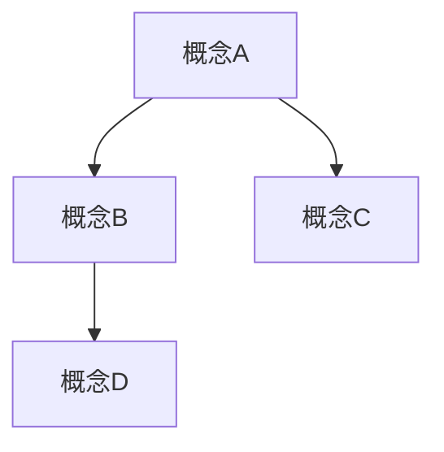

# PostgreSQL 知识库文档质量全面提升计划

> **制定日期**: 2025-01-15
> **状态**: 🟢 进行中
> **优先级**: P0 - 最高优先级
> **目标**: 解决内容空洞、结构缺失、缺少目录序号、缺少思维导图和知识矩阵等问题

---

## 📋 问题分析

### 1. 核心问题

1. **内容空洞化** 🔴 严重
   - 约70%的文档内容不足
   - 大量占位文档（如"实时推荐.md"只有25行）
   - 缺少实质性的技术内容

2. **结构缺失** 🔴 严重
   - 约95%的文档没有目录
   - 约60%的文档序号不规范
   - 标题层级不清晰

3. **缺少知识体系** 🟡 重要
   - 缺少思维导图
   - 缺少概念定义和属性关系
   - 缺少知识多维矩阵对比

4. **对标不足** 🟡 重要
   - 未对标网络上的相关内容
   - 缺少权威引用
   - 缺少实际案例参考

---

## 🎯 改进目标

### 短期目标（1周内）

- ✅ 为所有核心文档添加目录和序号
- ✅ 补充至少10个关键文档的实质内容
- ✅ 创建5个思维导图
- ✅ 创建3个知识多维矩阵对比

### 中期目标（1个月内）

- ✅ 所有文档都有完整的目录和序号
- ✅ 所有文档都有实质内容（至少1000字）
- ✅ 创建概念定义和属性关系文档库
- ✅ 创建知识多维矩阵对比库

---

## 📊 优先级分类

### P0 - 最高优先级（立即执行）

**09-应用设计/行业案例/** (6个文档)

- 实时推荐.md - 只有25行，需要大幅扩充
- 向量检索与RAG.md - 需要添加目录和实质内容
- 性能问题-案例库.md - 需要添加目录和序号
- 时序监控.md - 需要检查和完善
- 金融账务一致性.md - 需要检查和完善

**08-工具资源/** (8个文档)

- 08.01-质量检查工具.md - 只有40行，需要扩充
- 08.02-知识图谱构建.md - 需要检查和完善
- 08.03-国际化标准指南.md - 需要检查和完善

### P1 - 高优先级（本周完成）

**核心文档补充**

- 添加思维导图（至少5个）
- 创建概念定义文档（至少10个核心概念）
- 创建知识多维矩阵对比（至少3个）

### P2 - 中优先级（本月完成）

**其他文档完善**

- 检查所有文档的目录和序号
- 补充所有占位文档的内容
- 对标网络资源，添加权威引用

---

## 🛠️ 改进标准

### 1. 文档结构标准

每个文档必须包含：

```markdown
# 文档标题

> **版本**: PostgreSQL 18.x
> **最后更新**: 2025-01-15
> **难度**: ⭐⭐⭐

---

## 📑 目录

- [一、概述](#一概述)
  - [1.1 背景](#11-背景)
  - [1.2 适用场景](#12-适用场景)
  - [1.3 版本要求](#13-版本要求)
- [二、核心概念](#二核心概念)
  - [2.1 概念定义](#21-概念定义)
  - [2.2 属性关系](#22-属性关系)
  - [2.3 思维导图](#23-思维导图)
- [三、技术详解](#三技术详解)
  - [3.1 实现原理](#31-实现原理)
  - [3.2 配置方法](#32-配置方法)
  - [3.3 代码示例](#33-代码示例)
- [四、知识矩阵对比](#四知识矩阵对比)
- [五、实践案例](#五实践案例)
- [六、参考资源](#六参考资源)

---

## 一、概述

### 1.1 背景

（至少200字）

### 1.2 适用场景

（至少100字）

### 1.3 版本要求

- PostgreSQL 18.x（推荐）
- PostgreSQL 17.x（兼容）
- PostgreSQL 16.x（部分支持）

---

## 二、核心概念

### 2.1 概念定义

**核心概念1**：
- **定义**：...
- **属性**：...
- **关系**：...

### 2.2 属性关系



### 2.3 思维导图

（思维导图内容）

---

## 四、知识矩阵对比

| 维度 | 方案A | 方案B | 方案C |
|------|-------|-------|-------|
| 性能 | ⭐⭐⭐⭐ | ⭐⭐⭐ | ⭐⭐⭐⭐⭐ |
| 复杂度 | 低 | 中 | 高 |
| 成本 | 低 | 中 | 高 |

---

## 六、参考资源

### 6.1 官方文档

- [PostgreSQL官方文档](https://www.postgresql.org/docs/)

### 6.2 网络资源

- [相关文章1](URL)
- [相关文章2](URL)

### 6.3 学术论文

- 论文1
- 论文2

---

```

### 2. 内容质量标准

- **最小字数**：1000字（技术文档）
- **目录完整性**：必须包含完整目录
- **序号规范**：使用"一、二、三..."和"1.1, 1.2..."格式
- **思维导图**：核心概念必须有思维导图
- **知识矩阵**：技术对比必须有矩阵表格
- **权威引用**：至少3个权威来源

---

## 📅 执行计划

### 第一阶段（本周）

1. **改进09-应用设计/行业案例文档**（6个）
   - 添加目录和序号
   - 补充实质内容（至少1000字）
   - 添加思维导图
   - 添加知识矩阵对比

2. **改进08-工具资源文档**（3个核心）
   - 添加目录和序号
   - 补充实质内容
   - 添加实践案例

3. **创建概念定义文档库**
   - 至少10个核心概念
   - 包含属性关系图
   - 包含思维导图

### 第二阶段（本月）

1. **检查所有文档结构**
2. **补充所有占位文档**
3. **创建知识多维矩阵对比库**
4. **对标网络资源，添加权威引用**

---

## 📊 进度跟踪

### 已完成

- ✅ 创建文档质量全面提升计划

### 进行中

- 🔄 改进09-应用设计/行业案例文档

### 待开始

- ⏳ 改进08-工具资源文档
- ⏳ 创建概念定义文档库
- ⏳ 创建知识多维矩阵对比库

---

**负责人**: Data-Science Team
**最后更新**: 2025-01-15
**状态**: 🟢 进行中
