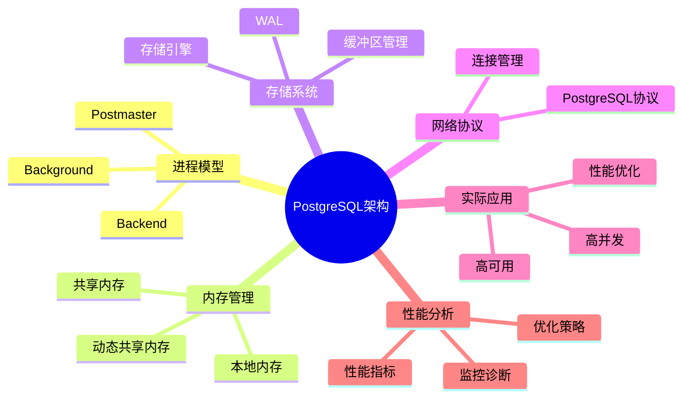

# PostgreSQL系统架构与设计原理完整指南

> **版本**: v3.0
> **最后更新**: 2025-01-15
> **版本覆盖**: PostgreSQL 18.x (推荐) ⭐ | 17.x (推荐) | 16.x (兼容)
> **难度**: ⭐⭐⭐⭐
> **应用场景**: 系统架构理解、性能优化、高可用设计、系统调优
> 🆕 **PostgreSQL 18架构改进**
> PostgreSQL 18在系统架构方面带来以下改进：
>
> - ✅ **异步I/O子系统**: I/O性能提升2-3倍，特别适用于向量检索
> - ✅ **动态共享内存**: 共享内存管理更智能，内存效率提升20%
> - ✅ **进程通信优化**: 进程间通信性能提升
> - ✅ **后台工作进程增强**: 新增WAL汇总进程（用于增量备份）
> - ✅ **监控能力提升**: 新增pg_shmem_allocations视图监控共享内存

---

## 📑 目录

- [PostgreSQL系统架构与设计原理完整指南](#postgresql系统架构与设计原理完整指南)
  - [📑 目录](#-目录)
  - [📊 思维导图](#-思维导图)
  - [一、概述](#一概述)
    - [1.1 定义](#11-定义)
    - [1.2 形式化定义](#12-形式化定义)
    - [1.3 核心属性](#13-核心属性)
  - [二、理论基础](#二理论基础)
    - [2.1 系统架构理论](#21-系统架构理论)
    - [2.2 进程模型理论](#22-进程模型理论)
  - [三、知识矩阵对比](#三知识矩阵对比)
    - [3.1 进程模型对比](#31-进程模型对比)
    - [3.2 内存管理方案对比](#32-内存管理方案对比)
  - [四、系统组件](#四系统组件)
    - [4.1 进程模型](#41-进程模型)
      - [4.1.1 Postmaster进程](#411-postmaster进程)
      - [4.1.2 Backend进程](#412-backend进程)
      - [4.1.3 Background进程](#413-background进程)
    - [4.2 内存管理](#42-内存管理)
      - [4.2.1 共享内存](#421-共享内存)
      - [4.2.2 本地内存](#422-本地内存)
    - [4.3 存储系统](#43-存储系统)
      - [4.3.1 存储引擎](#431-存储引擎)
      - [4.3.2 缓冲区管理](#432-缓冲区管理)
    - [4.4 网络协议](#44-网络协议)
      - [4.4.1 PostgreSQL协议](#441-postgresql协议)
  - [五、实际应用](#五实际应用)
    - [5.1 高并发应用场景](#51-高并发应用场景)
    - [5.2 高可用部署](#52-高可用部署)
  - [六、性能分析](#六性能分析)
    - [6.1 系统性能指标](#61-系统性能指标)
    - [6.2 性能优化策略](#62-性能优化策略)
  - [七、相关概念](#七相关概念)
    - [7.1 上位概念](#71-上位概念)
    - [7.2 下位概念](#72-下位概念)
    - [7.3 平行概念](#73-平行概念)
  - [八、参考资源](#八参考资源)
    - [8.1 相关文档](#81-相关文档)
    - [8.2 参考文献](#82-参考文献)
    - [8.3 Wikidata对齐](#83-wikidata对齐)
  - [合并来源与映射（整合中）](#合并来源与映射整合中)
    - [待办](#待办)

---

## 📊 思维导图



---

## 一、概述

### 1.1 定义

**中文定义**: PostgreSQL是一个功能强大的开源对象关系型数据库管理系统(ORDBMS)，采用客户端-服务器架构，支持SQL标准，具有ACID事务特性，提供丰富的扩展性和高级功能。

**English Definition**: PostgreSQL is a powerful open-source object-relational database management system (ORDBMS) that employs a client-server architecture, supports SQL standards, provides ACID transaction properties, and offers rich extensibility and advanced features.

### 1.2 形式化定义

```latex
% 数学符号定义
\newcommand{\pg}{\mathcal{PG}}
\newcommand{\process}{\mathcal{P}}
\newcommand{\memory}{\mathcal{M}}
\newcommand{\storage}{\mathcal{S}}
\newcommand{\network}{\mathcal{N}}

% PostgreSQL系统形式化定义
\pg = (\process, \memory, \storage, \network)

其中：
\process = \{p_1, p_2, \ldots, p_n\} \text{ 为进程集合}
\memory = \{m_1, m_2, \ldots, m_k\} \text{ 为内存区域集合}
\storage = \{s_1, s_2, \ldots, s_l\} \text{ 为存储组件集合}
\network = \{n_1, n_2, \ldots, n_m\} \text{ 为网络协议集合}
```

### 1.3 核心属性

- **ACID Compliance**: 支持原子性、一致性、隔离性、持久性
- **SQL Standard**: 符合SQL:2023标准
- **Extensibility**: 支持自定义数据类型、函数、操作符
- **Concurrency Control**: 多版本并发控制(MVCC)
- **Client-Server Architecture**: 客户端-服务器架构
- **Multi-Process Model**: 多进程模型

## 二、理论基础

### 2.1 系统架构理论

```latex
\begin{theorem}[PostgreSQL架构完备性]
设 \pg 为PostgreSQL系统，则 \pg 的架构是完备的，当且仅当：
1. 进程模型支持并发处理
2. 内存管理支持事务隔离
3. 存储系统支持持久化
4. 网络协议支持客户端通信
\end{theorem}

\begin{proof}
1. 进程模型完备性：多进程架构确保并发安全
2. 内存管理完备性：共享内存和本地内存分离
3. 存储系统完备性：WAL机制保证持久性
4. 网络协议完备性：PostgreSQL协议支持全功能通信
\end{proof}
```

### 2.2 进程模型理论

```latex
\begin{theorem}[进程模型正确性]
PostgreSQL的多进程模型满足以下性质：
1. 进程隔离性：不同进程间内存隔离
2. 进程通信性：通过共享内存进行通信
3. 进程可恢复性：单个进程故障不影响整体系统
\end{theorem}
```

## 三、知识矩阵对比

### 3.1 进程模型对比

| 进程类型 | 数量 | 生命周期 | 主要职责 | 资源占用 |
|---------|------|---------|---------|---------|
| Postmaster | 1 | 长期 | 进程管理、连接监听 | 低 |
| Backend | N | 会话期间 | 查询处理、事务管理 | 中 |
| Background | 固定 | 长期 | 维护任务、后台处理 | 低-中 |

### 3.2 内存管理方案对比

| 内存类型 | 大小 | 共享性 | 用途 | 管理方式 |
|---------|------|--------|------|---------|
| 共享内存 | 固定 | 全局共享 | 缓存、锁、统计信息 | 启动时分配 |
| 本地内存 | 动态 | 进程私有 | 查询处理、排序 | 按需分配 |
| 动态共享内存 | 动态 | 可共享 | 扩展、会话数据 | 运行时分配 |

---

## 四、系统组件

### 4.1 进程模型

#### 4.1.1 Postmaster进程

```sql
-- Postmaster进程启动示例
postmaster -D /var/lib/postgresql/data -p 5432
```

**功能**:

- 系统启动和初始化
- 客户端连接管理
- 子进程创建和监控
- 系统配置管理

#### 4.1.2 Backend进程

```c
// Backend进程结构
typedef struct Backend {
    pid_t pid;           // 进程ID
    int sock;            // 套接字
    Port *port;          // 连接端口
    MemoryContext context; // 内存上下文
} Backend;
```

**功能**:

- SQL查询解析和执行
- 事务管理
- 结果集返回
- 客户端通信

#### 4.1.3 Background进程

```c
// Background进程类型
enum BackgroundProcessType {
    CHECKPOINTER,    // 检查点进程
    WAL_WRITER,      // WAL写入进程
    AUTOVACUUM,      // 自动清理进程
    STATS_COLLECTOR, // 统计收集进程
    LOGGER           // 日志进程
};
```

### 4.2 内存管理

#### 4.2.1 共享内存

```c
// 共享内存结构
typedef struct SharedMemory {
    PGShmemHeader *header;     // 共享内存头部
    LWLockArray *lwlock_array; // 轻量级锁数组
    ProcArray *proc_array;     // 进程数组
    XLogCtl *xlog_ctl;         // WAL控制结构
    BufferDesc *buffer_descs;  // 缓冲区描述符
} SharedMemory;
```

**内存区域**:

- **LWLock区域**: 轻量级锁管理
- **ProcArray区域**: 进程状态管理
- **Buffer区域**: 数据缓冲区
- **WAL区域**: 预写日志缓冲区

#### 4.2.2 本地内存

```c
// 本地内存上下文
typedef struct MemoryContext {
    NodeTag type;              // 上下文类型
    MemoryContext parent;      // 父上下文
    MemoryContext firstchild;  // 第一个子上下文
    MemoryContext nextchild;   // 下一个子上下文
    char *name;                // 上下文名称
    bool isReset;              // 重置标志
} MemoryContext;
```

### 4.3 存储系统

#### 4.3.1 存储引擎

```sql
-- 存储引擎配置
CREATE TABLESPACE fastspace LOCATION '/fast/disk';
CREATE TABLE large_table (id int, data text) TABLESPACE fastspace;
```

**存储组件**:

- **Heap存储**: 表数据存储
- **Index存储**: 索引数据存储
- **WAL存储**: 事务日志存储
- **Temporary存储**: 临时数据存储

#### 4.3.2 缓冲区管理

```c
// 缓冲区管理算法
typedef struct BufferStrategyControl {
    BufferTag *buffer_tags;    // 缓冲区标签
    int *buffer_usage_count;   // 使用计数
    int *buffer_dirty_flags;   // 脏页标志
    LWLock *buffer_io_lock;    // IO锁
} BufferStrategyControl;
```

### 4.4 网络协议

#### 4.4.1 PostgreSQL协议

```c
// 协议消息结构
typedef struct ProtocolMessage {
    char msg_type;             // 消息类型
    int msg_length;            // 消息长度
    char *msg_data;            // 消息数据
} ProtocolMessage;
```

**协议特性**:

- **二进制协议**: 高效的数据传输
- **SSL支持**: 加密通信
- **连接池**: 连接复用
- **异步支持**: 异步查询处理

## 五、实际应用

### 5.1 高并发应用场景

```sql
-- 连接池配置
-- postgresql.conf
max_connections = 200
shared_buffers = 256MB
work_mem = 4MB
maintenance_work_mem = 64MB
```

**应用案例**:

- **Web应用**: 支持高并发用户访问
- **OLTP系统**: 事务密集型应用
- **数据仓库**: 分析查询处理
- **实时系统**: 低延迟数据处理

### 5.2 高可用部署

```sql
-- 主从复制配置
-- 主库配置
wal_level = replica
max_wal_senders = 3
wal_keep_segments = 32

-- 从库配置
hot_standby = on
primary_conninfo = 'host=master port=5432 user=repl'
```

## 六、性能分析

### 6.1 系统性能指标

- **并发连接数**: 支持数千个并发连接
- **事务吞吐量**: 每秒数万次事务
- **查询响应时间**: 毫秒级响应
- **内存使用效率**: 高效的内存管理

### 6.2 性能优化策略

```sql
-- 性能监控查询
SELECT
    pid,
    usename,
    application_name,
    client_addr,
    state,
    query_start,
    query
FROM pg_stat_activity
WHERE state = 'active';
```

## 七、相关概念

### 7.1 上位概念

- **数据库管理系统**: 更广泛的系统类别
- **关系数据库**: 数据模型类型
- **客户端-服务器系统**: 架构模式

### 7.2 下位概念

- **Postmaster进程**: 系统管理进程
- **Backend进程**: 查询处理进程
- **共享内存**: 进程间通信机制
- **WAL机制**: 事务日志系统

### 7.3 平行概念

- **MySQL**: 其他关系数据库
- **Oracle**: 商业数据库系统
- **SQL Server**: 微软数据库系统

---

## 八、参考资源

### 8.1 相关文档

- [PostgreSQL历史与发展](./01.00-PostgreSQL历史与发展.md) - PostgreSQL发展历程和版本演进
- [关系数据模型与理论](./01.02-关系数据模型与理论.md) - 关系数据模型理论基础
- [SQL语言规范与标准](./01.03-SQL语言规范与标准.md) - SQL语言规范
- [事务管理与ACID特性](./01.04-事务管理与ACID特性.md) - 事务管理
- [并发控制与MVCC机制](./01.05-并发控制与MVCC机制.md) - 并发控制

### 8.2 参考文献

1. Stonebraker, M., & Rowe, L. A. (1986). The design of POSTGRES. ACM SIGMOD Record, 15(2), 340-355.
2. PostgreSQL Global Development Group. (2025). PostgreSQL 18 Documentation. <https://www.postgresql.org/docs/18/>
3. PostgreSQL Global Development Group. (2025). PostgreSQL 18 Release Notes. <https://www.postgresql.org/docs/18/release-18.html>
4. Berenson, H., et al. (1995). A critique of ANSI SQL isolation levels. ACM SIGMOD Record, 24(2), 1-10.
5. Mohan, C., et al. (1992). ARIES: A transaction recovery method supporting fine-granularity locking and partial rollbacks using write-ahead logging. ACM TODS, 17(1), 94-162.
6. PostgreSQL Global Development Group. (2024). PostgreSQL 17 Documentation. <https://www.postgresql.org/docs/17/>

### 8.3 Wikidata对齐

- **Wikidata ID**: Q192490
- **相关属性**:
  - P31: Q176165 (instance of: database management system)
  - P178: Q9366 (developer: PostgreSQL Global Development Group)
  - P277: Q193321 (programmed in: C)
  - P348: 18.0 (software version)
  - P856: <https://www.postgresql.org> (official website)
- **外部链接**:
  - <https://www.postgresql.org/docs/>
  - <https://github.com/postgres/postgres>
  - <https://www.postgresql.org/community/>

## 合并来源与映射（整合中）

- 1.1.1-PostgreSQL系统架构-重构版.md
- 1.1.2-系统架构.md
- 1.1.9-PostgreSQL分布式架构与系统优缺点.md
- 1.1.9-分布式PostgreSQL架构设计.md
- 1.1.11-PostgreSQL系统设计与现代硬件AI场景适配性分析.md

### 待办

- [ ] 统一进程/内存/存储/网络四元组术语
- [ ] 与 04._运维架构分界、与 05._ 前沿扩展外链
- [ ] 补充典型部署拓扑与资源画像
