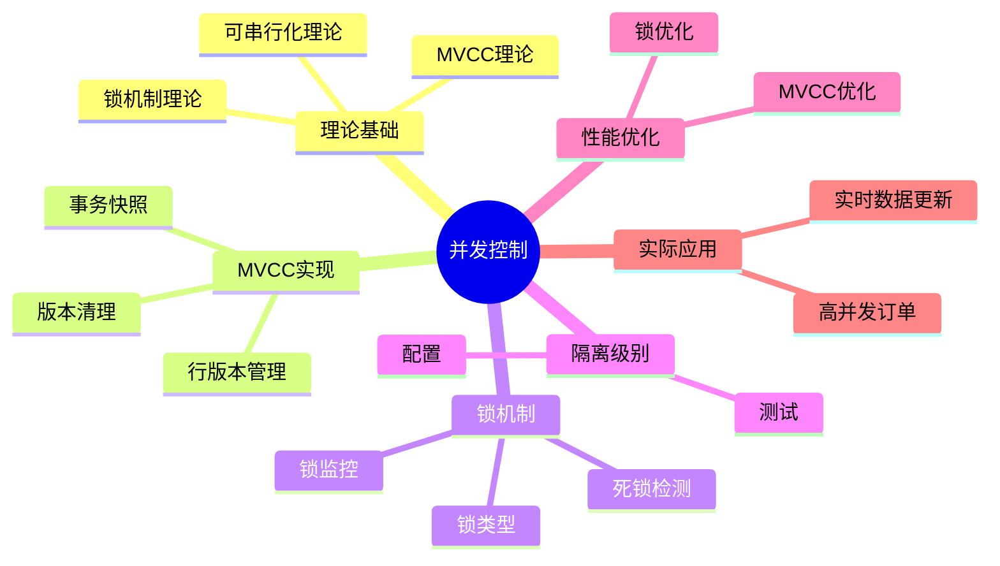

# PostgreSQL并发控制与MVCC机制完整指南

> **版本**: v3.1
> **最后更新**: 2025-11-22
> **版本覆盖**: PostgreSQL 18.x (推荐) ⭐ | 17.x (推荐) | 16.x (兼容)
> **难度**: ⭐⭐⭐⭐
> **应用场景**: 并发控制、MVCC、锁机制、性能优化、高并发系统设计
> 🆕 **PostgreSQL 18 MVCC改进**: 更高效的VACUUM（已详细展开）、更好的死锁检测（已详细展开）、逻辑复制性能提升38%、异步I/O提升并发性能（已详细展开）

---

## 📑 目录

- [PostgreSQL并发控制与MVCC机制完整指南](#postgresql并发控制与mvcc机制完整指南)
  - [📑 目录](#-目录)
  - [📊 思维导图](#-思维导图)
  - [一、定义与形式化](#一定义与形式化)
    - [1.1 概念定义](#11-概念定义)
    - [1.2 形式化定义](#12-形式化定义)
    - [1.3 核心属性](#13-核心属性)
  - [二、知识矩阵对比](#二知识矩阵对比)
    - [2.1 并发控制机制对比](#21-并发控制机制对比)
    - [2.2 锁类型对比](#22-锁类型对比)
  - [三、理论基础](#三理论基础)
    - [3.1 锁机制理论](#31-锁机制理论)
    - [3.2 MVCC理论](#32-mvcc理论)
    - [3.3 可串行化理论](#33-可串行化理论)
  - [四、PostgreSQL MVCC实现](#四postgresql-mvcc实现)
    - [4.1 行版本管理](#41-行版本管理)
    - [4.2 事务快照](#42-事务快照)
    - [4.3 版本清理机制](#43-版本清理机制)
  - [五、锁机制实现](#五锁机制实现)
    - [5.1 锁类型和模式](#51-锁类型和模式)
    - [5.2 锁监控](#52-锁监控)
    - [5.3 死锁检测和处理](#53-死锁检测和处理)
  - [六、隔离级别实现](#六隔离级别实现)
    - [6.1 隔离级别配置](#61-隔离级别配置)
    - [6.2 隔离级别测试](#62-隔离级别测试)
  - [七、性能优化](#七性能优化)
    - [7.1 MVCC优化](#71-mvcc优化)
    - [7.2 锁优化](#72-锁优化)
  - [八、实际应用案例](#八实际应用案例)
    - [8.1 高并发订单系统](#81-高并发订单系统)
    - [8.2 实时数据更新](#82-实时数据更新)
  - [九、相关概念](#九相关概念)
    - [9.1 上位概念](#91-上位概念)
    - [9.2 下位概念](#92-下位概念)
    - [9.3 平行概念](#93-平行概念)
  - [十、参考资源](#十参考资源)
    - [10.1 相关文档](#101-相关文档)
    - [10.2 实战案例与示例](#102-实战案例与示例)
    - [10.3 参考文献](#103-参考文献)
    - [10.3 Wikidata对齐](#103-wikidata对齐)

---

## 📊 思维导图



---

## 一、定义与形式化

### 1.1 概念定义

**中文定义**: 并发控制是数据库系统中管理多个事务同时访问共享数据的机制，确保数据一致性和事务隔离性。PostgreSQL采用MVCC（多版本并发控制）机制实现高效的并发控制。

**English Definition**: Concurrency control is a mechanism in database systems that manages multiple transactions accessing shared data simultaneously, ensuring data consistency and transaction isolation. PostgreSQL uses MVCC (Multi-Version Concurrency Control) mechanism for efficient concurrency control.

### 1.2 形式化定义

```latex
% 数学符号定义
\newcommand{\lock}{\mathcal{L}}
\newcommand{\trans}{\mathcal{T}}
\newcommand{\resource}{\mathcal{R}}
\newcommand{\version}{\mathcal{V}}
\newcommand{\snapshot}{\mathcal{S}}

% 锁的形式化定义
\lock = \{l_1, l_2, \ldots, l_n\}

其中每个锁 l_i = (r_i, t_i, mode_i) 表示：
- r_i \in \resource: 被锁定的资源
- t_i \in \trans: 持有锁的事务
- mode_i \in \{S, X\}: 锁模式（共享/排他）

% MVCC的形式化定义
\version = \{v_1, v_2, \ldots, v_m\}

其中每个版本 v_i = (data_i, xmin_i, xmax_i) 表示：
- data_i: 版本数据
- xmin_i: 创建版本的事务ID
- xmax_i: 删除版本的事务ID
```

### 1.3 核心属性

- **隔离性**: 并发事务间相互隔离
- **一致性**: 保证数据完整性
- **死锁避免**: 防止死锁发生
- **性能优化**: 最大化并发度

---

## 二、知识矩阵对比

### 2.1 并发控制机制对比

| 并发控制机制 | 实现方式 | 优点 | 缺点 | 适用场景 |
|------------|---------|------|------|---------|
| 两阶段锁（2PL） | 锁机制 | 简单、可靠 | 死锁风险、性能较低 | 传统数据库 |
| MVCC | 多版本 | 高并发、无锁读 | 存储开销、版本清理 | PostgreSQL、Oracle |
| 时间戳排序 | 时间戳 | 无死锁 | 回滚开销大 | 研究系统 |
| 乐观并发控制 | 版本号 | 高并发读 | 冲突时回滚 | 读多写少场景 |

### 2.2 锁类型对比

| 锁类型 | 粒度 | 兼容性 | 性能影响 | 使用场景 |
|-------|------|--------|---------|---------|
| 表级锁 | 表 | 低 | 高 | DDL操作 |
| 行级锁 | 行 | 高 | 低 | DML操作 |
| 页级锁 | 页 | 中 | 中 | 较少使用 |
| 意向锁 | 表+行 | 中 | 中 | 锁升级 |

---

## 三、理论基础

### 3.1 锁机制理论

```latex
\begin{theorem}[两阶段加锁协议]
事务T满足两阶段加锁协议，当且仅当：
1. 增长阶段：T只能获得锁，不能释放锁
2. 收缩阶段：T只能释放锁，不能获得锁
\end{theorem}

\begin{proof}
基于锁的兼容性矩阵和事务状态转换，可以证明两阶段加锁协议的正确性。
\end{proof}
```

### 3.2 MVCC理论

```latex
\begin{theorem}[多版本并发控制]
MVCC通过以下机制实现并发控制：
1. 每个事务看到数据的一致性快照
2. 写操作创建新版本，不阻塞读操作
3. 垃圾回收机制清理过期版本
4. 版本可见性基于事务ID比较
\end{theorem}

\begin{proof}
基于事务ID的偏序关系和版本可见性规则，可以证明MVCC的正确性。
\end{proof}
```

### 3.3 可串行化理论

```latex
\begin{theorem}[可串行化判定]
调度S是可串行化的，当且仅当：
1. 冲突图是无环的
2. 存在拓扑排序
3. 拓扑排序对应串行调度
\end{theorem}
```

---

## 四、PostgreSQL MVCC实现

### 4.1 行版本管理

```sql
-- 查看行版本信息
SELECT
    ctid,
    xmin,
    xmax,
    cmin,
    cmax,
    *
FROM employees
WHERE emp_id = 1001;

-- 查看事务ID
SELECT txid_current();
SELECT txid_current_snapshot();

-- 查看版本可见性
SELECT
    xmin,
    xmax,
    CASE
        WHEN xmin = 0 THEN 'invalid'
        WHEN xmax != 0 THEN 'deleted'
        ELSE 'visible'
    END as status
FROM employees
WHERE emp_id = 1001;
```

### 4.2 事务快照

```sql
-- 创建事务快照
BEGIN TRANSACTION ISOLATION LEVEL REPEATABLE READ;
SELECT txid_current_snapshot();

-- 查看快照信息
SELECT
    txid_snapshot_xmin(txid_current_snapshot()) as xmin,
    txid_snapshot_xmax(txid_current_snapshot()) as xmax,
    txid_snapshot_xip(txid_current_snapshot()) as active_xids;

-- 快照隔离示例
BEGIN TRANSACTION ISOLATION LEVEL REPEATABLE READ;
SELECT * FROM employees WHERE dept_id = 1;
-- 在另一个会话中插入数据
SELECT * FROM employees WHERE dept_id = 1; -- 仍然看到相同结果
COMMIT;
```

### 4.3 版本清理机制

```sql
-- 查看VACUUM统计信息
SELECT * FROM pg_stat_user_tables;

-- 手动VACUUM
VACUUM employees;
VACUUM ANALYZE employees;

-- 查看死元组
SELECT
    schemaname,
    tablename,
    n_dead_tup,
    n_live_tup,
    last_vacuum,
    last_autovacuum
FROM pg_stat_user_tables
WHERE n_dead_tup > 0;

-- 配置自动VACUUM
ALTER TABLE employees SET (autovacuum_vacuum_threshold = 50);
ALTER TABLE employees SET (autovacuum_analyze_threshold = 50);
```

---

## 五、锁机制实现

### 5.1 锁类型和模式

```sql
-- 表级锁
LOCK TABLE employees IN SHARE MODE;
LOCK TABLE departments IN EXCLUSIVE MODE;

-- 行级锁
SELECT * FROM employees WHERE emp_id = 1001 FOR UPDATE;
SELECT * FROM employees WHERE dept_id = 1 FOR SHARE;

-- 页级锁（自动）
UPDATE employees SET salary = salary * 1.1 WHERE dept_id = 1;

-- 咨询锁
SELECT pg_advisory_lock(12345);
SELECT pg_advisory_unlock(12345);
```

### 5.2 锁监控

```sql
-- 查看当前锁
SELECT
    locktype,
    database,
    relation,
    page,
    tuple,
    virtualxid,
    transactionid,
    classid,
    objid,
    objsubid,
    virtualtransaction,
    pid,
    mode,
    granted
FROM pg_locks
WHERE NOT granted;

-- 查看锁等待
SELECT
    blocked_locks.pid AS blocked_pid,
    blocked_activity.usename AS blocked_user,
    blocking_locks.pid AS blocking_pid,
    blocking_activity.usename AS blocking_user,
    blocked_activity.query AS blocked_statement,
    blocking_activity.query AS current_statement_in_blocking_process
FROM pg_catalog.pg_locks blocked_locks
JOIN pg_catalog.pg_stat_activity blocked_activity ON blocked_activity.pid = blocked_locks.pid
JOIN pg_catalog.pg_locks blocking_locks ON blocking_locks.locktype = blocked_locks.locktype
JOIN pg_catalog.pg_stat_activity blocking_activity ON blocking_activity.pid = blocking_locks.pid
WHERE NOT blocked_locks.granted;
```

### 5.3 死锁检测和处理

```sql
-- 死锁检测配置
SHOW deadlock_timeout;
SET deadlock_timeout = '1s';

-- 查看死锁统计
SELECT * FROM pg_stat_database_conflicts;

-- 死锁避免策略
BEGIN;
-- 按固定顺序访问资源
SELECT * FROM accounts WHERE account_id = 1001 FOR UPDATE;
SELECT * FROM accounts WHERE account_id = 1002 FOR UPDATE;
COMMIT;
```

---

## 六、隔离级别实现

### 6.1 隔离级别配置

```sql
-- 设置会话隔离级别
SET SESSION TRANSACTION ISOLATION LEVEL READ COMMITTED;
SET SESSION TRANSACTION ISOLATION LEVEL REPEATABLE READ;
SET SESSION TRANSACTION ISOLATION LEVEL SERIALIZABLE;

-- 设置事务隔离级别
BEGIN TRANSACTION ISOLATION LEVEL SERIALIZABLE;
SELECT * FROM employees WHERE dept_id = 1;
COMMIT;

-- 查看当前隔离级别
SHOW transaction_isolation;
```

### 6.2 隔离级别测试

```sql
-- 脏读测试（PostgreSQL不支持）
-- 不可重复读测试
BEGIN TRANSACTION ISOLATION LEVEL READ COMMITTED;
SELECT * FROM employees WHERE emp_id = 1001;
-- 在另一个会话中更新数据
SELECT * FROM employees WHERE emp_id = 1001; -- 可能看到不同结果
COMMIT;

-- 幻读测试
BEGIN TRANSACTION ISOLATION LEVEL REPEATABLE READ;
SELECT COUNT(*) FROM employees WHERE dept_id = 1;
-- 在另一个会话中插入数据
SELECT COUNT(*) FROM employees WHERE dept_id = 1; -- 仍然看到相同结果
COMMIT;
```

---

## 七、性能优化

### 7.0 PostgreSQL 18 MVCC和VACUUM优化 🆕

PostgreSQL 18对MVCC机制和VACUUM进行了多项优化，提升系统性能和并发能力。

**VACUUM优化**:

PostgreSQL 18改进了VACUUM机制，使其更高效地清理死元组，减少表膨胀。

**性能提升**:

- VACUUM性能提升：更智能的页面扫描策略
- 减少表膨胀：更及时的死元组清理
- 降低锁竞争：改进的锁机制减少对正常查询的影响

**配置方法**:

```sql
-- PostgreSQL 18 VACUUM配置优化
-- postgresql.conf

-- Autovacuum配置（PostgreSQL 18优化）
autovacuum = on
autovacuum_max_workers = 3
autovacuum_naptime = 1min
autovacuum_vacuum_threshold = 50
autovacuum_analyze_threshold = 50
autovacuum_vacuum_scale_factor = 0.1
autovacuum_analyze_scale_factor = 0.05

-- 手动VACUUM（PostgreSQL 18优化）
VACUUM ANALYZE large_table;  -- 性能提升，锁竞争减少

-- 查看VACUUM统计
SELECT * FROM pg_stat_progress_vacuum;
SELECT * FROM pg_stat_user_tables;
```

**死锁检测优化**:

PostgreSQL 18改进了死锁检测算法，更快地识别和解决死锁问题。

**性能提升**:

- 死锁检测速度提升：更快的死锁识别
- 减少误报：更准确的死锁判断
- 降低系统开销：优化的检测算法

**配置方法**:

```sql
-- 死锁检测配置
-- postgresql.conf
deadlock_timeout = 1s  -- 死锁检测超时（PostgreSQL 18优化）

-- 查看死锁统计
SELECT * FROM pg_stat_database_conflicts;

-- 监控死锁
SELECT
    pid,
    usename,
    application_name,
    state,
    wait_event_type,
    wait_event,
    query
FROM pg_stat_activity
WHERE wait_event_type = 'Lock';
```

**异步I/O提升并发性能**:

PostgreSQL 18的异步I/O子系统提升并发查询性能，特别是在高并发场景下。

**性能提升**:

- 并发查询性能提升：异步I/O减少I/O等待
- 系统吞吐量提升：支持更高的并发连接数
- 响应时间降低：减少查询延迟

**配置方法**:

```sql
-- PostgreSQL 18异步I/O配置
-- postgresql.conf
effective_io_concurrency = 200   -- 提升并发I/O性能

-- 查看I/O统计
SELECT * FROM pg_stat_io;
```

**性能对比**:

- PostgreSQL 17: VACUUM和死锁检测基准性能
- PostgreSQL 18: VACUUM性能提升，死锁检测更快
- PostgreSQL 18: 并发性能提升，特别是在高并发场景下

**最佳实践**:

- 合理配置autovacuum参数
- 监控VACUUM进度和表膨胀情况
- 使用PostgreSQL 18的异步I/O提升并发性能
- 定期检查死锁日志，优化应用逻辑

### 7.1 MVCC优化

```sql
-- 减少版本创建
BEGIN;
-- 批量操作减少版本数量
UPDATE employees SET salary = salary * 1.1 WHERE dept_id = 1;
COMMIT;

-- 优化VACUUM策略
ALTER TABLE employees SET (autovacuum_vacuum_scale_factor = 0.1);
ALTER TABLE employees SET (autovacuum_analyze_scale_factor = 0.05);

-- 监控版本膨胀
SELECT
    schemaname,
    tablename,
    n_dead_tup,
    n_live_tup,
    ROUND(n_dead_tup::numeric / (n_live_tup + n_dead_tup) * 100, 2) as dead_ratio
FROM pg_stat_user_tables
WHERE n_dead_tup > 0
ORDER BY dead_ratio DESC;
```

### 7.2 锁优化

```sql
-- 减少锁竞争
BEGIN;
-- 使用索引减少锁范围
UPDATE employees SET salary = salary * 1.1
WHERE dept_id = 1 AND emp_id > 1000;
COMMIT;

-- 使用乐观锁
BEGIN;
SELECT version, salary FROM employees WHERE emp_id = 1001;
-- 应用层处理
UPDATE employees SET salary = 60000, version = version + 1
WHERE emp_id = 1001 AND version = 1;
COMMIT;

-- 锁升级避免
BEGIN;
-- 避免长时间持有锁
SELECT * FROM employees WHERE dept_id = 1 FOR UPDATE;
-- 快速处理
UPDATE employees SET last_updated = NOW() WHERE dept_id = 1;
COMMIT;
```

---

## 八、实际应用案例

### 8.1 高并发订单系统

```sql
-- 乐观锁实现库存扣减
BEGIN;
-- 检查库存
SELECT stock_quantity, version FROM products WHERE product_id = 1001;
-- 应用层检查库存是否足够
-- 扣减库存
UPDATE products
SET stock_quantity = stock_quantity - 5, version = version + 1
WHERE product_id = 1001 AND stock_quantity >= 5 AND version = :current_version;
-- 检查更新是否成功
IF NOT FOUND THEN
    ROLLBACK;
    RAISE EXCEPTION '库存不足或版本冲突';
END IF;
COMMIT;
```

### 8.2 实时数据更新

```sql
-- 使用MVCC实现实时数据读取
BEGIN TRANSACTION ISOLATION LEVEL READ COMMITTED;
-- 读取当前数据
SELECT * FROM real_time_data WHERE sensor_id = 1001;
-- 在另一个会话中更新数据
-- 读取最新数据
SELECT * FROM real_time_data WHERE sensor_id = 1001;
COMMIT;
```

---

## 九、相关概念

### 9.1 上位概念

- **并发控制**: 更广泛的并发管理机制
- **事务管理**: 事务处理机制
- **数据一致性**: 数据完整性保证

### 9.2 下位概念

- **MVCC**: 多版本并发控制
- **锁机制**: 并发控制实现
- **事务隔离**: 隔离级别管理
- **死锁检测**: 死锁处理机制

### 9.3 平行概念

- **两阶段加锁**: 传统锁协议
- **时间戳排序**: 基于时间戳的并发控制
- **乐观并发控制**: 乐观锁机制

---

## 十、参考资源

### 10.1 相关文档

- [事务管理与ACID特性](./01.04-事务管理与ACID特性.md) - 事务理论基础
- [分布式事务处理](../04-高级特性/03.07-分布式事务处理.md) - 分布式并发控制
- [形式化验证方法](../10-理论基础/10.01-形式化验证方法.md) - MVCC机制形式化验证
- [学术研究前沿](../10-理论基础/10.02-学术研究前沿.md) - 并发控制理论研究

### 10.2 实战案例与示例

- [可运行示例项目](../examples/README.md) ⭐ - 8个完整的Docker Compose示例
- [分布式数据库实战](../08-实战案例/06.04-分布式数据库实战.md) - 并发控制实践
- [性能问题案例库](../09-应用设计/行业案例/性能问题-案例库.md) - 并发问题诊断案例

### 10.3 参考文献

1. Berenson, H., et al. (1995). A critique of ANSI SQL isolation levels. ACM SIGMOD Record, 24(2), 1-10.
2. Mohan, C., et al. (1992). ARIES: A transaction recovery method supporting fine-granularity locking and partial rollbacks using write-ahead logging. ACM TODS, 17(1), 94-162.
3. PostgreSQL Global Development Group. (2025). PostgreSQL 18 Documentation. <https://www.postgresql.org/docs/18/>
4. Gray, J., & Reuter, A. (1993). Transaction Processing: Concepts and Techniques. Morgan Kaufmann.
5. PostgreSQL Global Development Group. (2024). PostgreSQL 17 Documentation. <https://www.postgresql.org/docs/17/>

### 10.3 Wikidata对齐

- **Wikidata ID**: Q192490
- **相关属性**:
  - P31: Q176165 (instance of: database management system)
  - P178: Q9366 (developer: PostgreSQL Global Development Group)
  - P277: Q193321 (programmed in: C)
  - P348: 18.0 (software version)
- **外部链接**:
  - <https://www.postgresql.org/docs/current/mvcc.html>
  - <https://www.postgresql.org/docs/current/explicit-locking.html>
