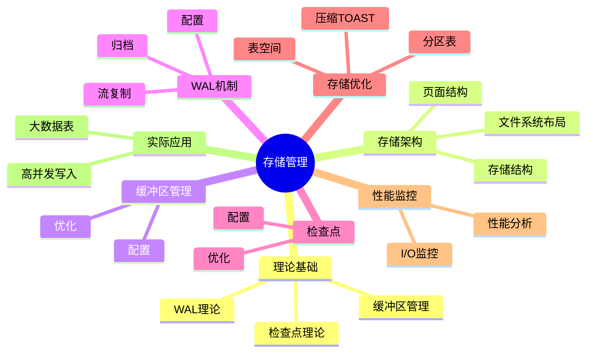

# PostgreSQL存储管理与数据持久化完整指南

> **版本**: v3.0
> **最后更新**: 2025-01-15
> **版本覆盖**: PostgreSQL 18.x (推荐) ⭐ | 17.x (推荐) | 16.x (兼容)
> **难度**: ⭐⭐⭐⭐
> **应用场景**: 存储管理、数据持久化、I/O优化、性能调优、高可用设计
> 🆕 **PostgreSQL 18存储改进**: 异步I/O子系统（I/O性能提升2-3倍）、增量备份（节省94%时间）、WAL汇总机制、动态共享内存（提升20%效率）

---

## 📑 目录

- [PostgreSQL存储管理与数据持久化完整指南](#postgresql存储管理与数据持久化完整指南)
  - [📑 目录](#-目录)
  - [📊 思维导图](#-思维导图)
  - [一、定义与形式化](#一定义与形式化)
    - [1.1 概念定义](#11-概念定义)
    - [1.2 形式化定义](#12-形式化定义)
    - [1.3 核心属性](#13-核心属性)
  - [二、知识矩阵对比](#二知识矩阵对比)
    - [2.1 存储管理机制对比](#21-存储管理机制对比)
    - [2.2 缓冲区替换策略对比](#22-缓冲区替换策略对比)
  - [三、理论基础](#三理论基础)
    - [3.1 缓冲区管理理论](#31-缓冲区管理理论)
    - [3.2 WAL理论](#32-wal理论)
    - [3.3 检查点理论](#33-检查点理论)
  - [四、PostgreSQL存储架构](#四postgresql存储架构)
    - [4.1 存储结构](#41-存储结构)
    - [4.2 页面结构](#42-页面结构)
    - [4.3 文件系统布局](#43-文件系统布局)
  - [五、缓冲区管理](#五缓冲区管理)
    - [5.1 缓冲区配置](#51-缓冲区配置)
    - [5.2 缓冲区优化](#52-缓冲区优化)
  - [六、WAL机制](#六wal机制)
    - [6.1 WAL配置](#61-wal配置)
    - [6.2 WAL归档](#62-wal归档)
    - [6.3 流复制](#63-流复制)
  - [七、检查点机制](#七检查点机制)
    - [7.1 检查点配置](#71-检查点配置)
    - [7.2 检查点优化](#72-检查点优化)
  - [八、存储优化](#八存储优化)
    - [8.1 表空间管理](#81-表空间管理)
    - [8.2 分区表优化](#82-分区表优化)
    - [8.3 压缩和TOAST](#83-压缩和toast)
  - [九、性能监控](#九性能监控)
    - [9.1 I/O性能监控](#91-io性能监控)
    - [9.2 存储性能分析](#92-存储性能分析)
  - [十、实际应用案例](#十实际应用案例)
    - [10.1 大数据表优化](#101-大数据表优化)
    - [10.2 高并发写入优化](#102-高并发写入优化)
  - [十一、相关概念](#十一相关概念)
    - [11.1 上位概念](#111-上位概念)
    - [11.2 下位概念](#112-下位概念)
    - [11.3 平行概念](#113-平行概念)
  - [十二、参考资源](#十二参考资源)
    - [12.1 相关文档](#121-相关文档)
    - [12.2 参考文献](#122-参考文献)
    - [12.3 Wikidata对齐](#123-wikidata对齐)

---

## 📊 思维导图



---

## 一、定义与形式化

### 1.1 概念定义

**中文定义**: 存储管理是数据库系统中管理数据持久化存储的机制，包括缓冲区管理、WAL日志、检查点等核心组件。PostgreSQL通过高效的存储管理确保数据的持久性和系统的高性能。

**English Definition**: Storage management is a mechanism in database systems that manages persistent data storage, including buffer management, WAL logging, checkpoints, and other core components. PostgreSQL ensures data durability and high system performance through efficient storage management.

### 1.2 形式化定义

```latex
% 数学符号定义
\newcommand{\storage}{\mathcal{S}}
\newcommand{\buffer}{\mathcal{B}}
\newcommand{\wal}{\mathcal{W}}
\newcommand{\page}{\mathcal{P}}
\newcommand{\disk}{\mathcal{D}}

% 存储系统的形式化定义
\storage = (\buffer, \wal, \page, \disk)

其中：
\buffer = \{b_1, b_2, \ldots, b_n\}: 缓冲区页面集合
\wal = \{w_1, w_2, \ldots, w_m\}: WAL日志记录集合
\page = \{p_1, p_2, \ldots, p_k\}: 磁盘页面集合
\disk = \{d_1, d_2, \ldots, d_l\}: 磁盘存储集合
```

### 1.3 核心属性

- **持久性**: 确保数据永久保存
- **一致性**: 保证数据完整性
- **性能**: 优化I/O操作效率
- **可恢复性**: 支持故障恢复

---

## 二、知识矩阵对比

### 2.1 存储管理机制对比

| 存储管理机制 | 实现方式 | 优点 | 缺点 | 适用场景 |
|------------|---------|------|------|---------|
| 直接I/O | 绕过OS缓存 | 控制精确 | 性能较低 | 特殊需求 |
| 缓冲I/O | OS缓存 | 性能高 | 控制有限 | 通用场景 |
| 异步I/O | 异步操作 | 高并发 | 实现复杂 | PostgreSQL 18+ |
| 同步I/O | 同步操作 | 可靠性高 | 性能较低 | 关键数据 |

### 2.2 缓冲区替换策略对比

| 替换策略 | 算法复杂度 | 命中率 | 实现难度 | 适用场景 |
|---------|-----------|--------|---------|---------|
| LRU | O(1) | 高 | 中 | 通用场景 |
| LFU | O(log n) | 中 | 高 | 访问模式稳定 |
| FIFO | O(1) | 低 | 低 | 简单场景 |
| Clock | O(1) | 中 | 中 | 内存受限 |

---

## 三、理论基础

### 3.1 缓冲区管理理论

```latex
\begin{theorem}[缓冲区替换策略]
LRU (Least Recently Used) 策略：
1. 最近最少使用的页面优先被替换
2. 时间复杂度：O(1) 查找和更新
3. 空间复杂度：O(n) 存储开销
\end{theorem}

\begin{proof}
基于访问时间戳和双向链表结构，可以证明LRU策略的正确性。
\end{proof}
```

### 3.2 WAL理论

```latex
\begin{theorem}[WAL协议]
Write-Ahead Logging协议要求：
1. 在修改数据页面前，必须先写WAL日志
2. 日志记录必须持久化到磁盘
3. 检查点机制确保数据页面的持久化
\end{theorem}

\begin{proof}
基于故障恢复的需求和日志的完整性，可以证明WAL协议的正确性。
\end{proof}
```

### 3.3 检查点理论

```latex
\begin{theorem}[检查点一致性]
检查点确保：
1. 所有脏页被写入磁盘
2. WAL日志被截断
3. 系统状态一致
\end{theorem}
```

---

## 四、PostgreSQL存储架构

### 4.1 存储结构

```sql
-- 查看数据库大小
SELECT
    datname,
    pg_size_pretty(pg_database_size(datname)) as size
FROM pg_database
ORDER BY pg_database_size(datname) DESC;

-- 查看表大小
SELECT
    schemaname,
    tablename,
    pg_size_pretty(pg_total_relation_size(schemaname||'.'||tablename)) as size,
    pg_size_pretty(pg_relation_size(schemaname||'.'||tablename)) as table_size,
    pg_size_pretty(pg_indexes_size(schemaname||'.'||tablename)) as indexes_size
FROM pg_tables
ORDER BY pg_total_relation_size(schemaname||'.'||tablename) DESC;

-- 查看表空间
SELECT
    spcname,
    pg_size_pretty(pg_tablespace_size(spcname)) as size
FROM pg_tablespace;
```

### 4.2 页面结构

```sql
-- 查看页面信息
SELECT
    relname,
    relpages,
    reltuples,
    relallvisible,
    relfrozenxid
FROM pg_class
WHERE relkind = 'r'
ORDER BY relpages DESC;

-- 查看页面统计
SELECT
    schemaname,
    tablename,
    n_tup_ins,
    n_tup_upd,
    n_tup_del,
    n_live_tup,
    n_dead_tup,
    last_vacuum,
    last_autovacuum
FROM pg_stat_user_tables;
```

### 4.3 文件系统布局

```sql
-- 查看数据目录
SHOW data_directory;

-- 查看WAL目录
SHOW log_directory;

-- 查看配置文件位置
SHOW config_file;
SHOW hba_file;
SHOW ident_file;
```

---

## 五、缓冲区管理

### 5.1 缓冲区配置

```sql
-- 查看缓冲区配置
SHOW shared_buffers;
SHOW effective_cache_size;
SHOW work_mem;
SHOW maintenance_work_mem;

-- 查看缓冲区统计
SELECT * FROM pg_stat_bgwriter;

-- 查看缓冲区使用情况
SELECT
    c.relname,
    c.relkind,
    pg_size_pretty(pg_relation_size(c.oid)) as size,
    pg_stat_get_tuples_returned(c.oid) as tuples_returned,
    pg_stat_get_tuples_fetched(c.oid) as tuples_fetched,
    pg_stat_get_tuples_inserted(c.oid) as tuples_inserted,
    pg_stat_get_tuples_updated(c.oid) as tuples_updated,
    pg_stat_get_tuples_deleted(c.oid) as tuples_deleted
FROM pg_class c
WHERE c.relkind IN ('r', 'i')
ORDER BY pg_relation_size(c.oid) DESC;
```

### 5.2 缓冲区优化

```sql
-- 缓冲区命中率
SELECT
    round(100.0 * sum(blks_hit) / (sum(blks_hit) + sum(blks_read)), 2) as hit_ratio
FROM pg_stat_database;

-- 表级缓冲区统计
SELECT
    schemaname,
    tablename,
    heap_blks_read,
    heap_blks_hit,
    round(100.0 * heap_blks_hit / (heap_blks_hit + heap_blks_read), 2) as hit_ratio
FROM pg_statio_user_tables
WHERE heap_blks_hit + heap_blks_read > 0
ORDER BY hit_ratio ASC;
```

---

## 六、WAL机制

### 6.1 WAL配置

```sql
-- WAL配置参数
SHOW wal_level;
SHOW wal_buffers;
SHOW checkpoint_timeout;
SHOW max_wal_size;
SHOW min_wal_size;
SHOW wal_compression;
SHOW wal_log_hints;

-- WAL统计信息
SELECT * FROM pg_stat_wal;

-- WAL位置信息
SELECT pg_current_wal_lsn();
SELECT pg_walfile_name(pg_current_wal_lsn());
SELECT pg_walfile_name_offset(pg_current_wal_lsn());
```

### 6.2 WAL归档

```sql
-- WAL归档配置
SHOW archive_mode;
SHOW archive_command;
SHOW archive_timeout;

-- 查看归档状态
SELECT * FROM pg_stat_archiver;

-- 手动归档
SELECT pg_switch_wal();

-- 查看WAL文件
SELECT
    name,
    size,
    modification
FROM pg_ls_waldir()
ORDER BY modification DESC;
```

### 6.3 流复制

```sql
-- 流复制配置
SHOW wal_sender_timeout;
SHOW wal_receiver_timeout;
SHOW max_wal_senders;
SHOW max_replication_slots;

-- 查看复制状态
SELECT * FROM pg_stat_replication;

-- 查看复制槽
SELECT * FROM pg_replication_slots;
```

---

## 七、检查点机制

### 7.1 检查点配置

```sql
-- 检查点配置
SHOW checkpoint_timeout;
SHOW checkpoint_completion_target;
SHOW max_wal_size;
SHOW min_wal_size;

-- 查看检查点统计
SELECT * FROM pg_stat_bgwriter;

-- 手动检查点
CHECKPOINT;
```

### 7.2 检查点优化

```sql
-- 检查点性能分析
SELECT
    checkpoints_timed,
    checkpoints_req,
    checkpoint_write_time,
    checkpoint_sync_time,
    buffers_checkpoint,
    buffers_clean,
    buffers_backend,
    buffers_backend_fsync,
    buffers_alloc
FROM pg_stat_bgwriter;

-- 检查点频率分析
SELECT
    checkpoints_timed + checkpoints_req as total_checkpoints,
    round(extract(epoch from now() - pg_postmaster_start_time()) / (checkpoints_timed + checkpoints_req), 2) as avg_interval_seconds
FROM pg_stat_bgwriter;
```

---

## 八、存储优化

### 8.1 表空间管理

```sql
-- 创建表空间
CREATE TABLESPACE fastspace LOCATION '/fast/disk/postgresql';

-- 在表空间创建表
CREATE TABLE large_table (
    id SERIAL PRIMARY KEY,
    data TEXT
) TABLESPACE fastspace;

-- 移动表到新表空间
ALTER TABLE large_table SET TABLESPACE fastspace;

-- 查看表空间使用情况
SELECT
    t.spcname,
    pg_size_pretty(pg_tablespace_size(t.spcname)) as size
FROM pg_tablespace t;
```

### 8.2 分区表优化

```sql
-- 创建分区表
CREATE TABLE sales (
    id SERIAL,
    sale_date DATE,
    amount DECIMAL(10,2)
) PARTITION BY RANGE (sale_date);

-- 创建分区
CREATE TABLE sales_2023 PARTITION OF sales
FOR VALUES FROM ('2023-01-01') TO ('2024-01-01')
TABLESPACE fastspace;

CREATE TABLE sales_2024 PARTITION OF sales
FOR VALUES FROM ('2024-01-01') TO ('2025-01-01')
TABLESPACE fastspace;

-- 查看分区信息
SELECT
    schemaname,
    tablename,
    pg_size_pretty(pg_total_relation_size(schemaname||'.'||tablename)) as size
FROM pg_tables
WHERE tablename LIKE 'sales_%'
ORDER BY pg_total_relation_size(schemaname||'.'||tablename) DESC;
```

### 8.3 压缩和TOAST

```sql
-- 查看TOAST表
SELECT
    c.relname,
    t.relname as toast_table,
    pg_size_pretty(pg_total_relation_size(t.oid)) as toast_size
FROM pg_class c
JOIN pg_class t ON t.oid = c.reltoastrelid
WHERE c.relkind = 'r'
ORDER BY pg_total_relation_size(t.oid) DESC;

-- 压缩配置
ALTER TABLE large_table SET (toast_tuple_target = 128);
ALTER TABLE large_table SET (fillfactor = 80);
```

---

## 九、性能监控

### 9.1 I/O性能监控

```sql
-- 数据库I/O统计
SELECT
    datname,
    blks_read,
    blks_hit,
    round(100.0 * blks_hit / (blks_hit + blks_read), 2) as hit_ratio,
    tup_returned,
    tup_fetched,
    tup_inserted,
    tup_updated,
    tup_deleted
FROM pg_stat_database
WHERE datname = current_database();

-- 表I/O统计
SELECT
    schemaname,
    tablename,
    heap_blks_read,
    heap_blks_hit,
    idx_blks_read,
    idx_blks_hit,
    round(100.0 * heap_blks_hit / (heap_blks_hit + heap_blks_read), 2) as heap_hit_ratio,
    round(100.0 * idx_blks_hit / (idx_blks_hit + idx_blks_read), 2) as idx_hit_ratio
FROM pg_statio_user_tables
ORDER BY heap_blks_read + heap_blks_hit DESC;
```

### 9.2 存储性能分析

```sql
-- 存储使用分析
SELECT
    schemaname,
    tablename,
    pg_size_pretty(pg_total_relation_size(schemaname||'.'||tablename)) as total_size,
    pg_size_pretty(pg_relation_size(schemaname||'.'||tablename)) as table_size,
    pg_size_pretty(pg_indexes_size(schemaname||'.'||tablename)) as indexes_size,
    round(100.0 * pg_indexes_size(schemaname||'.'||tablename) / pg_total_relation_size(schemaname||'.'||tablename), 2) as index_ratio
FROM pg_tables
ORDER BY pg_total_relation_size(schemaname||'.'||tablename) DESC;
```

---

## 十、实际应用案例

### 10.1 大数据表优化

```sql
-- 大表分区策略
CREATE TABLE log_entries (
    id BIGSERIAL,
    log_time TIMESTAMP,
    level VARCHAR(10),
    message TEXT,
    source VARCHAR(100)
) PARTITION BY RANGE (log_time);

-- 按月分区
CREATE TABLE log_entries_2024_01 PARTITION OF log_entries
FOR VALUES FROM ('2024-01-01') TO ('2024-02-01');

CREATE TABLE log_entries_2024_02 PARTITION OF log_entries
FOR VALUES FROM ('2024-02-01') TO ('2024-03-01');

-- 自动分区管理
CREATE OR REPLACE FUNCTION create_monthly_partition(table_name text, start_date date)
RETURNS void AS $$
DECLARE
    partition_name text;
    end_date date;
BEGIN
    partition_name := table_name || '_' || to_char(start_date, 'YYYY_MM');
    end_date := start_date + interval '1 month';

    EXECUTE format('CREATE TABLE %I PARTITION OF %I FOR VALUES FROM (%L) TO (%L)',
                   partition_name, table_name, start_date, end_date);
END;
$$ LANGUAGE plpgsql;
```

### 10.2 高并发写入优化

```sql
-- 批量插入优化
BEGIN;
INSERT INTO large_table (col1, col2, col3)
SELECT
    generate_series(1, 1000000),
    'data' || generate_series(1, 1000000),
    random() * 1000;
COMMIT;

-- 并行写入优化
SET max_parallel_workers_per_gather = 4;
SET parallel_tuple_cost = 0.1;
SET parallel_setup_cost = 1000;

-- 使用并行查询
EXPLAIN (ANALYZE, BUFFERS)
SELECT COUNT(*) FROM large_table WHERE col1 > 500000;
```

---

## 十一、相关概念

### 11.1 上位概念

- **数据库管理系统**: 更广泛的系统类别
- **存储系统**: 数据持久化机制
- **文件系统**: 底层存储管理

### 11.2 下位概念

- **缓冲区管理**: 内存缓存机制
- **WAL日志**: 事务日志系统
- **检查点**: 数据一致性保证
- **页面管理**: 数据页面组织

### 11.3 平行概念

- **内存数据库**: 基于内存的存储
- **分布式存储**: 跨节点存储管理
- **云存储**: 云端存储服务

---

## 十二、参考资源

### 12.1 相关文档

- [事务管理与ACID特性](./01.04-事务管理与ACID特性.md) - WAL机制理论基础
- [并发控制与MVCC机制](./01.05-并发控制与MVCC机制.md) - 并发控制实现
- [备份与恢复](../04-部署运维/04.05-备份与恢复.md) - 数据持久化实践
- [性能调优实践](../04-部署运维/04.06-性能调优实践.md) - 存储性能优化

### 12.2 参考文献

1. Mohan, C., et al. (1992). ARIES: A transaction recovery method supporting fine-granularity locking and partial rollbacks using write-ahead logging. ACM TODS, 17(1), 94-162.
2. PostgreSQL Global Development Group. (2025). PostgreSQL 18 Documentation. <https://www.postgresql.org/docs/18/>
3. Gray, J., & Reuter, A. (1993). Transaction Processing: Concepts and Techniques. Morgan Kaufmann.
4. Silberschatz, A., Galvin, P. B., & Gagne, G. (2018). Operating System Concepts (10th ed.). John Wiley & Sons.
5. PostgreSQL Global Development Group. (2024). PostgreSQL 17 Documentation. <https://www.postgresql.org/docs/17/>

### 12.3 Wikidata对齐

- **Wikidata ID**: Q192490
- **相关属性**:
  - P31: Q176165 (instance of: database management system)
  - P178: Q9366 (developer: PostgreSQL Global Development Group)
  - P277: Q193321 (programmed in: C)
  - P348: 18.0 (software version)
- **外部链接**:
  - <https://www.postgresql.org/docs/current/storage.html>
  - <https://www.postgresql.org/docs/current/wal.html>
