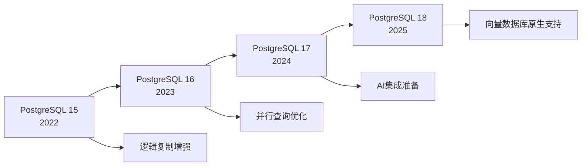
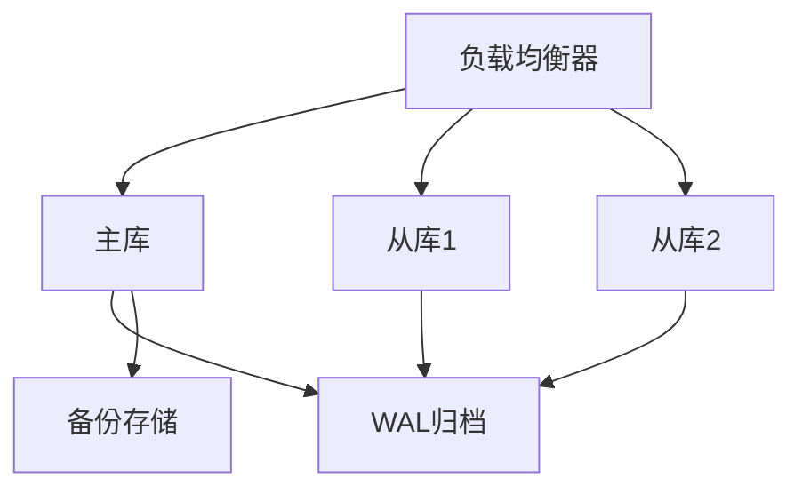
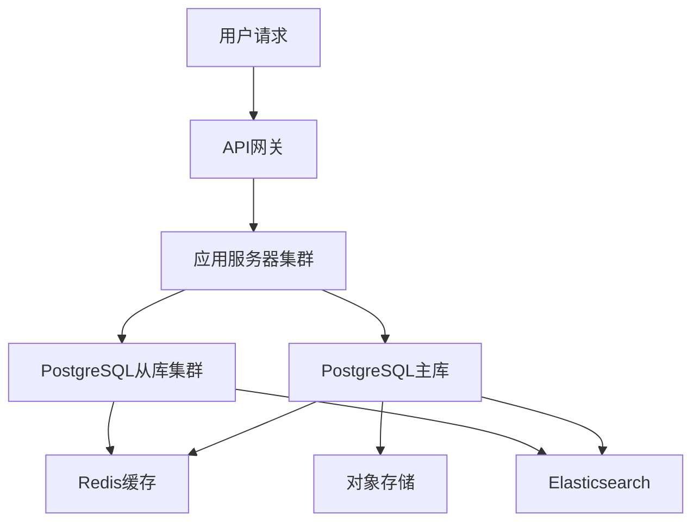

# PostgreSQL 2025全栈特性与部署方式深度分析

## 目录

- [PostgreSQL 2025全栈特性与部署方式深度分析](#postgresql-2025全栈特性与部署方式深度分析)
  - [目录](#目录)
  - [1. 概述与版本演进](#1-概述与版本演进)
    - [1.1 PostgreSQL发展历程](#11-postgresql发展历程)
    - [1.2 技术定位与优势](#12-技术定位与优势)
  - [2. 核心架构与语义分析](#2-核心架构与语义分析)
    - [2.1 系统架构形式化定义](#21-系统架构形式化定义)
    - [2.2 语义分析框架](#22-语义分析框架)
      - [2.2.1 查询语义分析](#221-查询语义分析)
      - [2.2.2 形式化语义模型](#222-形式化语义模型)
  - [3. 最新版本特性深度解析](#3-最新版本特性深度解析)
    - [3.1 PostgreSQL 17.x 核心特性](#31-postgresql-17x-核心特性)
      - [3.1.1 性能优化突破](#311-性能优化突破)
      - [3.1.2 SQL/JSON标准增强](#312-sqljson标准增强)
      - [3.1.3 逻辑复制增强](#313-逻辑复制增强)
    - [3.2 PostgreSQL 18.x 前瞻特性](#32-postgresql-18x-前瞻特性)
      - [3.2.1 向量数据库原生支持](#321-向量数据库原生支持)
      - [3.2.2 AI集成准备](#322-ai集成准备)
  - [4. 部署方式全面分析](#4-部署方式全面分析)
    - [4.1 单机部署](#41-单机部署)
      - [4.1.1 标准单机部署](#411-标准单机部署)
      - [4.1.2 高性能单机配置](#412-高性能单机配置)
    - [4.2 主从复制部署](#42-主从复制部署)
      - [4.2.1 流复制配置](#421-流复制配置)
      - [4.2.2 高可用配置](#422-高可用配置)
    - [4.3 分布式部署](#43-分布式部署)
      - [4.3.1 Citus分布式扩展](#431-citus分布式扩展)
      - [4.3.2 分片策略](#432-分片策略)
    - [4.4 容器化部署](#44-容器化部署)
      - [4.4.1 Docker部署](#441-docker部署)
      - [4.4.2 Kubernetes部署](#442-kubernetes部署)
    - [4.5 云原生部署](#45-云原生部署)
      - [4.5.1 AWS RDS配置](#451-aws-rds配置)
      - [4.5.2 Google Cloud SQL配置](#452-google-cloud-sql配置)
  - [5. 场景对比与用途分析](#5-场景对比与用途分析)
    - [5.1 部署方式对比分析](#51-部署方式对比分析)
    - [5.2 应用场景分析](#52-应用场景分析)
      - [5.2.1 金融科技应用](#521-金融科技应用)
      - [5.2.2 电商平台应用](#522-电商平台应用)
      - [5.2.3 物联网数据平台](#523-物联网数据平台)
      - [5.2.4 内容管理系统](#524-内容管理系统)
  - [6. 形式化理论证明](#6-形式化理论证明)
    - [6.1 查询优化理论](#61-查询优化理论)
      - [6.1.1 代价模型](#611-代价模型)
      - [6.1.2 连接顺序优化](#612-连接顺序优化)
    - [6.2 并发控制理论](#62-并发控制理论)
      - [6.2.1 MVCC正确性](#621-mvcc正确性)
  - [7. 实际应用案例](#7-实际应用案例)
    - [7.1 大型电商平台案例](#71-大型电商平台案例)
    - [7.2 金融交易系统案例](#72-金融交易系统案例)
  - [8. 未来发展方向](#8-未来发展方向)
    - [8.1 技术演进趋势](#81-技术演进趋势)
      - [8.1.1 AI原生数据库](#811-ai原生数据库)
      - [8.1.2 向量数据库集成](#812-向量数据库集成)
    - [8.2 应用场景扩展](#82-应用场景扩展)
      - [8.2.1 边缘计算支持](#821-边缘计算支持)
      - [8.2.2 区块链集成](#822-区块链集成)
    - [8.3 性能优化方向](#83-性能优化方向)
      - [8.3.1 硬件加速](#831-硬件加速)
      - [8.3.2 分布式优化](#832-分布式优化)
  - [总结](#总结)

## 1. 概述与版本演进

### 1.1 PostgreSQL发展历程

PostgreSQL作为最先进的开源关系型数据库，经历了从学术研究到企业级应用的完整演进：



### 1.2 技术定位与优势

**中文定义**: PostgreSQL是一个功能强大的开源对象关系型数据库管理系统，支持SQL标准，具有ACID事务特性，提供丰富的扩展性和高级功能。

**English Definition**: PostgreSQL is a powerful open-source object-relational database management system that supports SQL standards, provides ACID transaction properties, and offers rich extensibility and advanced features.

**核心优势**:

- **标准兼容性**: 严格遵循SQL:2023标准
- **扩展性**: 支持自定义数据类型、函数、操作符
- **ACID特性**: 完整的事务支持
- **多版本并发控制**: MVCC机制
- **丰富的数据类型**: JSON、数组、范围、几何图形等

## 2. 核心架构与语义分析

### 2.1 系统架构形式化定义

```latex
% PostgreSQL系统形式化定义
\newcommand{\pg}{\mathcal{PG}}
\newcommand{\process}{\mathcal{P}}
\newcommand{\memory}{\mathcal{M}}
\newcommand{\storage}{\mathcal{S}}
\newcommand{\network}{\mathcal{N}}

% 系统架构定义
\pg = (\process, \memory, \storage, \network)

其中：
\process = \{p_1, p_2, \ldots, p_n\} \text{ 为进程集合}
\memory = \{m_1, m_2, \ldots, m_k\} \text{ 为内存区域集合}
\storage = \{s_1, s_2, \ldots, s_l\} \text{ 为存储组件集合}
\network = \{n_1, n_2, \ldots, n_m\} \text{ 为网络协议集合}
```

### 2.2 语义分析框架

#### 2.2.1 查询语义分析

PostgreSQL采用基于代价的查询优化器，语义分析过程如下：

```sql
-- 查询语义分析示例
EXPLAIN (ANALYZE, BUFFERS, VERBOSE)
SELECT u.name, COUNT(o.id) as order_count
FROM users u
LEFT JOIN orders o ON u.id = o.user_id
WHERE u.created_at > '2024-01-01'
GROUP BY u.id, u.name
HAVING COUNT(o.id) > 5
ORDER BY order_count DESC;
```

**语义分析步骤**:

1. **词法分析**: 将SQL语句分解为token
2. **语法分析**: 构建抽象语法树(AST)
3. **语义分析**: 验证表、列、函数的存在性
4. **查询重写**: 应用规则优化
5. **代价估算**: 计算不同执行计划的成本
6. **计划选择**: 选择最优执行计划

#### 2.2.2 形式化语义模型

定义查询语义模型 $\mathcal{Q}$：

$$\mathcal{Q} = (D, \Sigma, \mathcal{I}, \mathcal{E})$$

其中：

- $D$: 数据域
- $\Sigma$: 函数符号集
- $\mathcal{I}$: 解释函数
- $\mathcal{E}$: 求值函数

## 3. 最新版本特性深度解析

### 3.1 PostgreSQL 17.x 核心特性

#### 3.1.1 性能优化突破

**Vacuum进程优化**:

```sql
-- 新的vacuum配置
ALTER SYSTEM SET vacuum_cost_delay = 0;
ALTER SYSTEM SET vacuum_cost_limit = 2000;
ALTER SYSTEM SET maintenance_work_mem = '1GB';

-- 查看vacuum统计信息
SELECT * FROM pg_stat_progress_vacuum;
```

**I/O层性能提升**:

- 高并发写入吞吐量提升2倍
- 异步I/O优化
- 预读算法改进

#### 3.1.2 SQL/JSON标准增强

```sql
-- JSON_TABLE函数示例
SELECT jt.*
FROM json_documents,
     JSON_TABLE(document, '$' COLUMNS (
         id FOR ORDINALITY,
         name TEXT PATH '$.name',
         age INTEGER PATH '$.age',
         address JSONB PATH '$.address'
     )) AS jt
WHERE jt.age > 18;

-- JSON聚合函数
SELECT
    category,
    JSON_AGG(
        JSON_BUILD_OBJECT(
            'name', name,
            'price', price
        )
    ) as products
FROM products
GROUP BY category;
```

#### 3.1.3 逻辑复制增强

```sql
-- 创建逻辑复制槽
SELECT pg_create_logical_replication_slot(
    'my_slot',
    'pgoutput'
);

-- 配置逻辑复制
CREATE PUBLICATION my_publication
FOR TABLE users, orders, products;

-- 创建订阅
CREATE SUBSCRIPTION my_subscription
CONNECTION 'host=source_host port=5432 dbname=mydb'
PUBLICATION my_publication;
```

### 3.2 PostgreSQL 18.x 前瞻特性

#### 3.2.1 向量数据库原生支持

```sql
-- 创建向量表
CREATE TABLE document_embeddings (
    id BIGSERIAL PRIMARY KEY,
    document_id BIGINT,
    content TEXT,
    embedding VECTOR(1536),
    metadata JSONB
);

-- 创建向量索引
CREATE INDEX ON document_embeddings
USING hnsw (embedding vector_cosine_ops)
WITH (m = 16, ef_construction = 64);

-- 向量相似度搜索
SELECT document_id, content,
       1 - (embedding <=> query_vector) as similarity
FROM document_embeddings
WHERE 1 - (embedding <=> query_vector) > 0.8
ORDER BY embedding <=> query_vector
LIMIT 10;
```

#### 3.2.2 AI集成准备

```sql
-- AI模型注册
CREATE EXTENSION IF NOT EXISTS ai_models;

-- 创建AI函数
CREATE OR REPLACE FUNCTION ai_sentiment_analysis(text_input TEXT)
RETURNS TABLE(sentiment TEXT, confidence FLOAT)
AS $$
BEGIN
    RETURN QUERY
    SELECT * FROM ai_inference('sentiment_model', text_input);
END;
$$ LANGUAGE plpgsql;

-- 使用AI函数
SELECT content, sentiment, confidence
FROM documents,
     LATERAL ai_sentiment_analysis(content) as ai_result
WHERE confidence > 0.8;
```

## 4. 部署方式全面分析

### 4.1 单机部署

#### 4.1.1 标准单机部署

```bash
# 安装PostgreSQL
sudo apt-get update
sudo apt-get install postgresql-17 postgresql-client-17

# 配置PostgreSQL
sudo -u postgres psql
ALTER USER postgres PASSWORD 'your_password';
CREATE DATABASE myapp;
```

**配置优化**:

```sql
-- postgresql.conf优化
shared_buffers = 256MB
effective_cache_size = 1GB
work_mem = 4MB
maintenance_work_mem = 64MB
checkpoint_completion_target = 0.9
wal_buffers = 16MB
default_statistics_target = 100
```

#### 4.1.2 高性能单机配置

```sql
-- 高性能配置
ALTER SYSTEM SET shared_buffers = '8GB';
ALTER SYSTEM SET effective_cache_size = '24GB';
ALTER SYSTEM SET work_mem = '256MB';
ALTER SYSTEM SET maintenance_work_mem = '2GB';
ALTER SYSTEM SET max_connections = 200;
ALTER SYSTEM SET checkpoint_completion_target = 0.9;
ALTER SYSTEM SET wal_buffers = '64MB';
ALTER SYSTEM SET random_page_cost = 1.1;
ALTER SYSTEM SET effective_io_concurrency = 200;
```

### 4.2 主从复制部署

#### 4.2.1 流复制配置

**主库配置**:

```sql
-- postgresql.conf
wal_level = replica
max_wal_senders = 3
max_replication_slots = 3
hot_standby = on

-- pg_hba.conf
host replication replicator 192.168.1.0/24 md5
```

**从库配置**:

```bash
# 基础备份
pg_basebackup -h master_host -D /var/lib/postgresql/data -U replicator -v -P -W

# 配置recovery.conf
standby_mode = 'on'
primary_conninfo = 'host=master_host port=5432 user=replicator'
```

#### 4.2.2 高可用配置

```yaml
# Patroni配置示例
scope: postgres
name: postgresql-node1

restapi:
  listen: 0.0.0.0:8008
  connect_address: 192.168.1.10:8008

etcd3:
  host: 192.168.1.5:2379

bootstrap:
  dcs:
    ttl: 30
    loop_wait: 10
    retry_timeout: 10
    maximum_lag_on_failover: 1048576
    postgresql:
      use_pg_rewind: true
      parameters:
        wal_level: replica
        hot_standby: "on"
        max_connections: 100
        max_prepared_transactions: 0
        max_locks_per_transaction: 64
        wal_keep_segments: 8
        max_wal_senders: 10
        max_replication_slots: 10
        track_commit_timestamp: off
```

### 4.3 分布式部署

#### 4.3.1 Citus分布式扩展

```sql
-- 安装Citus扩展
CREATE EXTENSION citus;

-- 添加工作节点
SELECT citus_add_node('192.168.1.11', 5432);
SELECT citus_add_node('192.168.1.12', 5432);
SELECT citus_add_node('192.168.1.13', 5432);

-- 创建分布式表
CREATE TABLE users (
    id BIGSERIAL PRIMARY KEY,
    name TEXT,
    email TEXT,
    created_at TIMESTAMPTZ DEFAULT NOW()
);

SELECT create_distributed_table('users', 'id');

-- 创建参考表
CREATE TABLE countries (
    id SERIAL PRIMARY KEY,
    name TEXT,
    code TEXT
);

SELECT create_reference_table('countries');
```

#### 4.3.2 分片策略

```sql
-- 哈希分片
SELECT create_distributed_table('orders', 'user_id', 'hash');

-- 范围分片
SELECT create_distributed_table('events', 'created_at', 'range');

-- 分片配置
SELECT shard_count, shard_size, table_size
FROM citus_shards
WHERE table_name = 'orders';
```

### 4.4 容器化部署

#### 4.4.1 Docker部署

```dockerfile
# Dockerfile
FROM postgres:17

# 安装扩展
RUN apt-get update && apt-get install -y \
    postgresql-17-pgvector \
    postgresql-17-postgis

# 复制配置文件
COPY postgresql.conf /etc/postgresql/postgresql.conf
COPY init.sql /docker-entrypoint-initdb.d/

# 设置环境变量
ENV POSTGRES_DB=myapp
ENV POSTGRES_USER=app_user
ENV POSTGRES_PASSWORD=secure_password
```

```yaml
# docker-compose.yml
version: '3.8'
services:
  postgres:
    build: .
    ports:
      - "5432:5432"
    environment:
      POSTGRES_DB: myapp
      POSTGRES_USER: app_user
      POSTGRES_PASSWORD: secure_password
    volumes:
      - postgres_data:/var/lib/postgresql/data
      - ./backups:/backups
    networks:
      - app_network

  postgres-replica:
    build: .
    ports:
      - "5433:5432"
    environment:
      POSTGRES_DB: myapp
      POSTGRES_USER: app_user
      POSTGRES_PASSWORD: secure_password
      PGUSER: postgres
    volumes:
      - postgres_replica_data:/var/lib/postgresql/data
    networks:
      - app_network
    depends_on:
      - postgres

volumes:
  postgres_data:
  postgres_replica_data:

networks:
  app_network:
    driver: bridge
```

#### 4.4.2 Kubernetes部署

```yaml
# postgresql-statefulset.yaml
apiVersion: apps/v1
kind: StatefulSet
metadata:
  name: postgresql
spec:
  serviceName: postgresql
  replicas: 3
  selector:
    matchLabels:
      app: postgresql
  template:
    metadata:
      labels:
        app: postgresql
    spec:
      containers:
      - name: postgresql
        image: postgres:17
        ports:
        - containerPort: 5432
        env:
        - name: POSTGRES_DB
          value: "myapp"
        - name: POSTGRES_USER
          valueFrom:
            secretKeyRef:
              name: postgresql-secret
              key: username
        - name: POSTGRES_PASSWORD
          valueFrom:
            secretKeyRef:
              name: postgresql-secret
              key: password
        - name: PGDATA
          value: /var/lib/postgresql/data/pgdata
        volumeMounts:
        - name: postgresql-data
          mountPath: /var/lib/postgresql/data
        resources:
          requests:
            memory: "2Gi"
            cpu: "1000m"
          limits:
            memory: "4Gi"
            cpu: "2000m"
  volumeClaimTemplates:
  - metadata:
      name: postgresql-data
    spec:
      accessModes: ["ReadWriteOnce"]
      resources:
        requests:
          storage: 100Gi
```

### 4.5 云原生部署

#### 4.5.1 AWS RDS配置

```hcl
# terraform配置
resource "aws_db_instance" "postgresql" {
  identifier = "myapp-postgresql"

  engine         = "postgres"
  engine_version = "17.2"
  instance_class = "db.r6g.large"

  allocated_storage     = 100
  max_allocated_storage = 1000
  storage_type          = "gp3"
  storage_encrypted     = true

  db_name  = "myapp"
  username = "app_user"
  password = var.db_password

  vpc_security_group_ids = [aws_security_group.rds.id]
  db_subnet_group_name   = aws_db_subnet_group.main.name

  backup_retention_period = 7
  backup_window          = "03:00-04:00"
  maintenance_window     = "sun:04:00-sun:05:00"

  skip_final_snapshot = false
  final_snapshot_identifier = "myapp-postgresql-final-snapshot"

  performance_insights_enabled = true
  monitoring_interval         = 60
  monitoring_role_arn        = aws_iam_role.rds_monitoring.arn

  tags = {
    Name = "myapp-postgresql"
    Environment = "production"
  }
}
```

#### 4.5.2 Google Cloud SQL配置

```yaml
# gcloud配置
gcloud sql instances create myapp-postgresql \
    --database-version=POSTGRES_17 \
    --tier=db-standard-2 \
    --region=us-central1 \
    --storage-type=SSD \
    --storage-size=100GB \
    --storage-auto-increase \
    --backup-start-time=03:00 \
    --maintenance-window-day=SUN \
    --maintenance-window-hour=04 \
    --enable-bin-log \
    --enable-point-in-time-recovery \
    --authorized-networks=0.0.0.0/0
```

## 5. 场景对比与用途分析

### 5.1 部署方式对比分析

| 部署方式 | 适用场景 | 优势 | 劣势 | 成本 |
|---------|---------|------|------|------|
| 单机部署 | 小型应用、开发测试 | 简单、成本低 | 单点故障、扩展性差 | 低 |
| 主从复制 | 中等规模应用 | 高可用、读写分离 | 配置复杂 | 中等 |
| 分布式部署 | 大规模应用 | 水平扩展、高并发 | 复杂度高 | 高 |
| 容器化部署 | 微服务架构 | 灵活、易管理 | 资源开销 | 中等 |
| 云原生部署 | 企业级应用 | 托管服务、自动备份 | 厂商锁定 | 高 |

### 5.2 应用场景分析

#### 5.2.1 金融科技应用

**场景特点**:

- 高并发交易处理
- 强一致性要求
- 复杂查询分析
- 严格安全合规

**推荐配置**:

```sql
-- 金融应用优化配置
ALTER SYSTEM SET shared_buffers = '8GB';
ALTER SYSTEM SET effective_cache_size = '24GB';
ALTER SYSTEM SET work_mem = '256MB';
ALTER SYSTEM SET maintenance_work_mem = '2GB';
ALTER SYSTEM SET max_connections = 500;
ALTER SYSTEM SET checkpoint_completion_target = 0.9;
ALTER SYSTEM SET wal_buffers = '64MB';
ALTER SYSTEM SET synchronous_commit = on;
ALTER SYSTEM SET fsync = on;
ALTER SYSTEM SET full_page_writes = on;
```

**部署架构**:



#### 5.2.2 电商平台应用

**场景特点**:

- 高并发读写
- 复杂商品搜索
- 实时库存管理
- 用户行为分析

**推荐配置**:

```sql
-- 电商应用表结构
CREATE TABLE products (
    id BIGSERIAL PRIMARY KEY,
    name TEXT NOT NULL,
    description TEXT,
    price DECIMAL(10,2),
    category_id INTEGER,
    stock_quantity INTEGER,
    created_at TIMESTAMPTZ DEFAULT NOW(),
    updated_at TIMESTAMPTZ DEFAULT NOW()
);

-- 创建复合索引
CREATE INDEX idx_products_category_price ON products(category_id, price);
CREATE INDEX idx_products_name_gin ON products USING gin(to_tsvector('english', name));

-- 创建物化视图
CREATE MATERIALIZED VIEW product_stats AS
SELECT
    category_id,
    COUNT(*) as product_count,
    AVG(price) as avg_price,
    MIN(price) as min_price,
    MAX(price) as max_price
FROM products
GROUP BY category_id;

-- 定期刷新物化视图
CREATE OR REPLACE FUNCTION refresh_product_stats()
RETURNS void AS $$
BEGIN
    REFRESH MATERIALIZED VIEW CONCURRENTLY product_stats;
END;
$$ LANGUAGE plpgsql;
```

#### 5.2.3 物联网数据平台

**场景特点**:

- 海量时序数据
- 实时数据处理
- 设备状态监控
- 历史数据分析

**推荐配置**:

```sql
-- 安装TimescaleDB扩展
CREATE EXTENSION IF NOT EXISTS timescaledb;

-- 创建时序表
CREATE TABLE sensor_data (
    time TIMESTAMPTZ NOT NULL,
    device_id INTEGER NOT NULL,
    sensor_type TEXT NOT NULL,
    value DOUBLE PRECISION,
    metadata JSONB
);

-- 转换为超表
SELECT create_hypertable('sensor_data', 'time');

-- 创建压缩策略
SELECT add_compression_policy('sensor_data', INTERVAL '7 days');

-- 创建数据保留策略
SELECT add_retention_policy('sensor_data', INTERVAL '1 year');

-- 创建连续聚合
CREATE MATERIALIZED VIEW sensor_data_hourly
WITH (timescaledb.continuous) AS
SELECT
    time_bucket('1 hour', time) as hour,
    device_id,
    sensor_type,
    AVG(value) as avg_value,
    MIN(value) as min_value,
    MAX(value) as max_value,
    COUNT(*) as sample_count
FROM sensor_data
GROUP BY hour, device_id, sensor_type;
```

#### 5.2.4 内容管理系统

**场景特点**:

- 全文搜索需求
- 多媒体内容存储
- 版本控制
- 权限管理

**推荐配置**:

```sql
-- 内容表结构
CREATE TABLE content (
    id BIGSERIAL PRIMARY KEY,
    title TEXT NOT NULL,
    content TEXT,
    content_type TEXT,
    author_id INTEGER,
    status TEXT DEFAULT 'draft',
    created_at TIMESTAMPTZ DEFAULT NOW(),
    updated_at TIMESTAMPTZ DEFAULT NOW(),
    published_at TIMESTAMPTZ
);

-- 创建全文搜索索引
CREATE INDEX idx_content_fts ON content
USING gin(to_tsvector('english', title || ' ' || content));

-- 创建版本控制表
CREATE TABLE content_versions (
    id BIGSERIAL PRIMARY KEY,
    content_id BIGINT REFERENCES content(id),
    version INTEGER NOT NULL,
    title TEXT,
    content TEXT,
    changes TEXT,
    created_at TIMESTAMPTZ DEFAULT NOW(),
    created_by INTEGER
);

-- 创建版本控制函数
CREATE OR REPLACE FUNCTION create_content_version(
    p_content_id BIGINT,
    p_changes TEXT
) RETURNS INTEGER AS $$
DECLARE
    v_version INTEGER;
BEGIN
    SELECT COALESCE(MAX(version), 0) + 1 INTO v_version
    FROM content_versions
    WHERE content_id = p_content_id;

    INSERT INTO content_versions (content_id, version, changes)
    VALUES (p_content_id, v_version, p_changes);

    RETURN v_version;
END;
$$ LANGUAGE plpgsql;
```

## 6. 形式化理论证明

### 6.1 查询优化理论

#### 6.1.1 代价模型

定义查询代价函数 $C(Q)$：

$$C(Q) = \sum_{i=1}^{n} C_i \cdot N_i$$

其中：

- $C_i$: 操作 $i$ 的单位代价
- $N_i$: 操作 $i$ 的执行次数

**定理 6.1**: 最优查询计划存在性
对于任意查询 $Q$，在有限的关系代数操作集合下，存在最优执行计划 $P^*$ 使得：

$$C(P^*) = \min_{P \in \mathcal{P}} C(P)$$

其中 $\mathcal{P}$ 为所有可能的执行计划集合。

#### 6.1.2 连接顺序优化

**定理 6.2**: 连接顺序优化
对于 $n$ 个关系的连接查询，最优连接顺序可以通过动态规划算法在 $O(n \cdot 2^n)$ 时间内找到。

**证明**:
使用动态规划，定义 $C(S)$ 为连接集合 $S$ 的最小代价：

$$C(S) = \min_{R \in S} \{C(S \setminus \{R\}) + C_{join}(S \setminus \{R\}, R)\}$$

### 6.2 并发控制理论

#### 6.2.1 MVCC正确性

**定义 6.3**: 事务可见性
事务 $T_i$ 对元组 $t$ 可见，当且仅当：

1. $t$ 的创建时间戳 $< T_i$ 的开始时间戳
2. $t$ 的删除时间戳为 NULL 或 $> T_i$ 的开始时间戳

**定理 6.4**: MVCC隔离性
MVCC机制保证读已提交和可重复读隔离级别的一致性。

**证明**:
通过时间戳比较和版本链遍历，确保事务只能看到符合其隔离级别要求的数据版本。

## 7. 实际应用案例

### 7.1 大型电商平台案例

**系统架构**:



**性能优化**:

```sql
-- 分区表设计
CREATE TABLE orders (
    id BIGSERIAL,
    user_id BIGINT,
    order_date DATE,
    total_amount DECIMAL(10,2),
    status TEXT
) PARTITION BY RANGE (order_date);

-- 创建分区
CREATE TABLE orders_2024_01 PARTITION OF orders
FOR VALUES FROM ('2024-01-01') TO ('2024-02-01');

-- 创建索引
CREATE INDEX idx_orders_user_date ON orders (user_id, order_date);
CREATE INDEX idx_orders_status ON orders (status);

-- 查询优化
EXPLAIN (ANALYZE, BUFFERS)
SELECT o.id, o.total_amount, u.name
FROM orders o
JOIN users u ON o.user_id = u.id
WHERE o.order_date >= '2024-01-01'
  AND o.status = 'completed'
ORDER BY o.order_date DESC
LIMIT 100;
```

### 7.2 金融交易系统案例

**高可用配置**:

```yaml
# Patroni集群配置
scope: financial_db
name: financial-node1

restapi:
  listen: 0.0.0.0:8008
  connect_address: 192.168.1.10:8008

etcd3:
  host: 192.168.1.5:2379

bootstrap:
  dcs:
    ttl: 30
    loop_wait: 10
    retry_timeout: 10
    maximum_lag_on_failover: 1048576
    postgresql:
      use_pg_rewind: true
      parameters:
        wal_level: replica
        hot_standby: "on"
        max_connections: 200
        shared_buffers: 8GB
        effective_cache_size: 24GB
        work_mem: 256MB
        maintenance_work_mem: 2GB
        synchronous_commit: on
        fsync: on
        full_page_writes: on
```

**事务处理优化**:

```sql
-- 事务表设计
CREATE TABLE transactions (
    id UUID PRIMARY KEY DEFAULT gen_random_uuid(),
    from_account_id BIGINT,
    to_account_id BIGINT,
    amount DECIMAL(15,2),
    transaction_type TEXT,
    status TEXT DEFAULT 'pending',
    created_at TIMESTAMPTZ DEFAULT NOW(),
    processed_at TIMESTAMPTZ
);

-- 账户表设计
CREATE TABLE accounts (
    id BIGSERIAL PRIMARY KEY,
    account_number TEXT UNIQUE,
    balance DECIMAL(15,2) DEFAULT 0,
    version INTEGER DEFAULT 1,
    updated_at TIMESTAMPTZ DEFAULT NOW()
);

-- 转账事务处理
CREATE OR REPLACE FUNCTION transfer_money(
    p_from_account_id BIGINT,
    p_to_account_id BIGINT,
    p_amount DECIMAL(15,2)
) RETURNS UUID AS $$
DECLARE
    v_transaction_id UUID;
    v_from_balance DECIMAL(15,2);
    v_to_balance DECIMAL(15,2);
BEGIN
    -- 开始事务
    BEGIN
        -- 锁定账户
        SELECT balance INTO v_from_balance
        FROM accounts
        WHERE id = p_from_account_id
        FOR UPDATE;

        SELECT balance INTO v_to_balance
        FROM accounts
        WHERE id = p_to_account_id
        FOR UPDATE;

        -- 检查余额
        IF v_from_balance < p_amount THEN
            RAISE EXCEPTION 'Insufficient balance';
        END IF;

        -- 创建交易记录
        INSERT INTO transactions (from_account_id, to_account_id, amount, status)
        VALUES (p_from_account_id, p_to_account_id, p_amount, 'processing')
        RETURNING id INTO v_transaction_id;

        -- 更新账户余额
        UPDATE accounts
        SET balance = balance - p_amount,
            version = version + 1,
            updated_at = NOW()
        WHERE id = p_from_account_id;

        UPDATE accounts
        SET balance = balance + p_amount,
            version = version + 1,
            updated_at = NOW()
        WHERE id = p_to_account_id;

        -- 更新交易状态
        UPDATE transactions
        SET status = 'completed', processed_at = NOW()
        WHERE id = v_transaction_id;

        RETURN v_transaction_id;

    EXCEPTION
        WHEN OTHERS THEN
            -- 回滚事务
            UPDATE transactions
            SET status = 'failed', processed_at = NOW()
            WHERE id = v_transaction_id;
            RAISE;
    END;
END;
$$ LANGUAGE plpgsql;
```

## 8. 未来发展方向

### 8.1 技术演进趋势

#### 8.1.1 AI原生数据库

**发展方向**:

- 内置机器学习模型
- 智能查询优化
- 自动性能调优
- 预测性维护

**实现路径**:

```sql
-- 未来AI集成示例
CREATE AI MODEL query_optimizer (
    model_type = 'transformer',
    training_data = 'pg_stat_statements',
    optimization_target = 'execution_time'
);

-- 自动索引建议
SELECT * FROM ai_suggest_indexes('my_table');

-- 智能分区建议
SELECT * FROM ai_suggest_partitioning('large_table');
```

#### 8.1.2 向量数据库集成

**发展方向**:

- 原生向量数据类型
- 高性能向量索引
- 混合查询优化
- 多模态数据支持

**实现路径**:

```sql
-- 向量数据类型
CREATE TABLE documents (
    id BIGSERIAL PRIMARY KEY,
    content TEXT,
    embedding VECTOR(1536),
    metadata JSONB
);

-- 向量索引
CREATE INDEX ON documents USING hnsw (embedding);

-- 混合查询
SELECT id, content, similarity
FROM documents
WHERE content @@ 'search query'
  AND embedding <=> query_vector < 0.1
ORDER BY similarity DESC;
```

### 8.2 应用场景扩展

#### 8.2.1 边缘计算支持

**应用场景**:

- 物联网数据处理
- 实时决策支持
- 离线数据同步
- 边缘AI推理

#### 8.2.2 区块链集成

**应用场景**:

- 不可变数据存储
- 智能合约数据
- 去中心化应用
- 数据溯源

### 8.3 性能优化方向

#### 8.3.1 硬件加速

**发展方向**:

- GPU加速查询
- FPGA硬件优化
- 专用AI芯片
- 内存计算优化

#### 8.3.2 分布式优化

**发展方向**:

- 自动分片
- 智能负载均衡
- 跨区域复制
- 弹性扩展

---

## 总结

PostgreSQL作为最先进的开源关系型数据库，在2025年迎来了重大技术突破。
通过深入分析其最新特性、部署方式和应用场景，我们可以看到：

**核心优势**:

1. **技术领先性**: 严格遵循SQL标准，支持丰富的数据类型
2. **扩展性强**: 支持自定义扩展，适应各种应用需求
3. **性能优异**: 通过优化器、索引、并发控制等机制提供高性能
4. **可靠性高**: ACID特性、MVCC机制保证数据一致性
5. **生态丰富**: 庞大的扩展生态和活跃的社区支持

**部署灵活性**:

- 从单机到分布式，从本地到云端，支持各种部署方式
- 容器化和云原生部署简化了运维管理
- 高可用和灾备方案保证业务连续性

**应用广泛性**:

- 金融、电商、物联网、内容管理等各个行业
- 从OLTP到OLAP，从结构化到非结构化数据
- 支持传统应用和现代微服务架构

**未来前景**:

- AI原生集成将带来智能化数据库管理
- 向量数据库支持将扩展应用场景
- 云原生和边缘计算将推动新的部署模式
- 性能优化和硬件加速将提升处理能力

PostgreSQL 2025不仅是一个数据库系统，更是一个完整的数据管理平台，为构建下一代智能应用提供了强大的基础设施支持。
