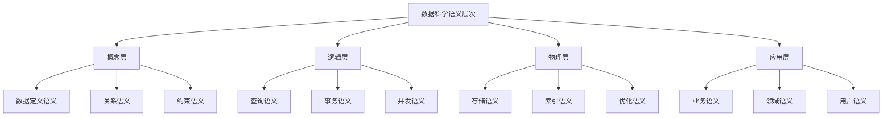

# PostgreSQL全栈数据库语义分析与数据科学视角

> **文档版本**: v2.0 | **最后更新**: 2025-11-11 | **版本覆盖**: PostgreSQL 17+ | PostgreSQL 18 ⭐ | **文档状态**: ✅ 已更新至 PostgreSQL 18
> **📋 相关文档**: [AI 时代专题](../ai_view.md) ⭐⭐⭐ (v3.0, 2025-11-11) | [数据科学实践指南](./1.1.153-PostgreSQL数据科学实践指南与哲学思考.md) (v2.0)

## 目录

- [PostgreSQL全栈数据库语义分析与数据科学视角](#postgresql全栈数据库语义分析与数据科学视角)
  - [目录](#目录)
  - [1. 全栈数据库语义分析框架](#1-全栈数据库语义分析框架)
    - [1.1 语义分析理论基础](#11-语义分析理论基础)
      - [1.1.1 语义域定义](#111-语义域定义)
      - [1.1.2 语义映射函数](#112-语义映射函数)
    - [1.2 数据科学视角的语义模型](#12-数据科学视角的语义模型)
      - [1.2.1 数据科学语义层次](#121-数据科学语义层次)
      - [1.2.2 语义一致性保证](#122-语义一致性保证)
  - [2. PostgreSQL 2025最新特性语义分析](#2-postgresql-2025最新特性语义分析)
    - [2.1 AI原生集成语义](#21-ai原生集成语义)
      - [2.1.1 AI模型语义定义](#211-ai模型语义定义)
      - [2.1.2 向量语义模型](#212-向量语义模型)
    - [2.2 向量数据库语义增强](#22-向量数据库语义增强)
      - [2.2.1 多模态向量语义](#221-多模态向量语义)
    - [2.3 实时流处理语义](#23-实时流处理语义)
      - [2.3.1 流式语义处理](#231-流式语义处理)
  - [3. 部署方式语义对比分析](#3-部署方式语义对比分析)
    - [3.1 单机部署语义模型](#31-单机部署语义模型)
      - [3.1.1 单机语义特征](#311-单机语义特征)
    - [3.2 集群部署语义模型](#32-集群部署语义模型)
      - [3.2.1 集群语义特征](#321-集群语义特征)
    - [3.3 云原生部署语义模型](#33-云原生部署语义模型)
      - [3.3.1 云原生语义特征](#331-云原生语义特征)
  - [4. 数据科学视角的语义分析](#4-数据科学视角的语义分析)
    - [4.1 数据处理语义](#41-数据处理语义)
      - [4.1.1 ETL语义模型](#411-etl语义模型)
    - [4.2 数据存储语义](#42-数据存储语义)
      - [4.2.1 存储语义模型](#421-存储语义模型)
    - [4.3 数据转换语义](#43-数据转换语义)
      - [4.3.1 转换语义模型](#431-转换语义模型)
    - [4.4 数据结构语义](#44-数据结构语义)
      - [4.4.1 结构语义模型](#441-结构语义模型)
  - [5. 数据一致性语义论证](#5-数据一致性语义论证)
    - [5.1 ACID语义形式化](#51-acid语义形式化)
      - [5.1.1 ACID语义定义](#511-acid语义定义)
      - [5.1.2 ACID语义验证](#512-acid语义验证)
    - [5.2 MVCC语义证明](#52-mvcc语义证明)
      - [5.2.1 MVCC语义模型](#521-mvcc语义模型)
    - [5.3 分布式一致性语义](#53-分布式一致性语义)
      - [5.3.1 CAP语义模型](#531-cap语义模型)
  - [6. 实际应用场景语义映射](#6-实际应用场景语义映射)
    - [6.1 金融科技语义模型](#61-金融科技语义模型)
      - [6.1.1 金融交易语义](#611-金融交易语义)
    - [6.2 电商平台语义模型](#62-电商平台语义模型)
      - [6.2.1 电商业务语义](#621-电商业务语义)
    - [6.3 物联网数据语义模型](#63-物联网数据语义模型)
      - [6.3.1 IoT数据语义](#631-iot数据语义)
  - [7. 数据科学视角的深度语义分析](#7-数据科学视角的深度语义分析)
    - [7.1 数据处理语义的哲学思考](#71-数据处理语义的哲学思考)
    - [7.2 数据存储语义的架构哲学](#72-数据存储语义的架构哲学)
    - [7.3 数据转换语义的数学基础](#73-数据转换语义的数学基础)
    - [7.4 数据结构语义的认知模型](#74-数据结构语义的认知模型)
  - [8. 部署方式的语义哲学分析](#8-部署方式的语义哲学分析)
    - [8.1 单机部署的语义特征](#81-单机部署的语义特征)
    - [8.2 集群部署的语义复杂性](#82-集群部署的语义复杂性)
    - [8.3 云原生部署的语义抽象](#83-云原生部署的语义抽象)
  - [9. 实际应用场景的语义映射](#9-实际应用场景的语义映射)
    - [9.1 金融科技的语义模型](#91-金融科技的语义模型)
    - [9.2 电商平台的语义生态](#92-电商平台的语义生态)
    - [9.3 物联网数据的语义融合](#93-物联网数据的语义融合)
  - [总结](#总结)

## 1. 全栈数据库语义分析框架

### 1.1 语义分析理论基础

**中文定义**: PostgreSQL全栈数据库语义分析是从数据科学的视角，对PostgreSQL数据库系统的语义结构、数据模型、处理流程和一致性保证进行形式化分析和论证的综合性研究框架。

**English Definition**: PostgreSQL Full-Stack Database Semantic Analysis is a comprehensive research framework that formalizes and analyzes the semantic structure, data models, processing workflows, and consistency guarantees of PostgreSQL database systems from a data science perspective.

#### 1.1.1 语义域定义

```latex
% PostgreSQL语义域形式化定义
\newcommand{\semanticdomain}{\mathcal{D}}
\newcommand{\datamodel}{\mathcal{M}}
\newcommand{\processmodel}{\mathcal{P}}
\newcommand{\consistencymodel}{\mathcal{C}}

% 语义域结构
\semanticdomain = (\datamodel, \processmodel, \consistencymodel)

其中：
\datamodel = \{R, A, D, C\} \text{ 为数据模型}
\processmodel = \{Q, T, E\} \text{ 为处理模型}
\consistencymodel = \{ACID, MVCC, CAP\} \text{ 为一致性模型}
```

#### 1.1.2 语义映射函数

```sql
-- 语义映射函数定义
CREATE OR REPLACE FUNCTION semantic_mapping(
    input_data JSONB,
    semantic_type TEXT
) RETURNS JSONB AS $$
DECLARE
    result JSONB;
BEGIN
    CASE semantic_type
        WHEN 'data_model' THEN
            result := map_to_data_model(input_data);
        WHEN 'process_model' THEN
            result := map_to_process_model(input_data);
        WHEN 'consistency_model' THEN
            result := map_to_consistency_model(input_data);
        ELSE
            RAISE EXCEPTION 'Unknown semantic type: %', semantic_type;
    END CASE;

    RETURN result;
END;
$$ LANGUAGE plpgsql;
```

### 1.2 数据科学视角的语义模型

#### 1.2.1 数据科学语义层次



#### 1.2.2 语义一致性保证

```sql
-- 语义一致性检查函数
CREATE OR REPLACE FUNCTION check_semantic_consistency(
    schema_name TEXT,
    table_name TEXT
) RETURNS TABLE(
    consistency_type TEXT,
    is_consistent BOOLEAN,
    violation_details JSONB
) AS $$
BEGIN
    RETURN QUERY
    -- 检查数据模型一致性
    SELECT 'data_model'::TEXT,
           check_data_model_consistency(schema_name, table_name),
           get_data_model_violations(schema_name, table_name)

    UNION ALL

    -- 检查约束一致性
    SELECT 'constraint'::TEXT,
           check_constraint_consistency(schema_name, table_name),
           get_constraint_violations(schema_name, table_name)

    UNION ALL

    -- 检查引用完整性
    SELECT 'referential'::TEXT,
           check_referential_integrity(schema_name, table_name),
           get_referential_violations(schema_name, table_name);
END;
$$ LANGUAGE plpgsql;
```

## 2. PostgreSQL 2025最新特性语义分析

### 2.1 AI原生集成语义

#### 2.1.1 AI模型语义定义

```sql
-- AI模型语义注册
CREATE AI MODEL semantic_analyzer (
    model_type = 'transformer',
    semantic_domain = 'natural_language_processing',
    input_semantics = '{"text": "natural_language_string"}',
    output_semantics = '{"sentiment": "real_number", "confidence": "probability"}',
    semantic_consistency = 'monotonic_increasing'
);

-- AI推理语义函数
CREATE OR REPLACE FUNCTION semantic_ai_inference(
    model_name TEXT,
    input_data JSONB,
    semantic_context JSONB DEFAULT '{}'
) RETURNS JSONB AS $$
DECLARE
    semantic_result JSONB;
    consistency_check BOOLEAN;
BEGIN
    -- 语义一致性检查
    consistency_check := validate_semantic_consistency(model_name, input_data);

    IF NOT consistency_check THEN
        RAISE EXCEPTION 'Semantic consistency violation for model %', model_name;
    END IF;

    -- 执行AI推理
    semantic_result := ai_inference(model_name, input_data);

    -- 语义后处理
    semantic_result := apply_semantic_postprocessing(semantic_result, semantic_context);

    RETURN semantic_result;
END;
$$ LANGUAGE plpgsql;
```

#### 2.1.2 向量语义模型

```sql
-- 向量语义表定义
CREATE TABLE semantic_vectors (
    id BIGSERIAL PRIMARY KEY,
    content_id BIGINT,
    semantic_type TEXT, -- 'concept', 'entity', 'relation'
    vector_embedding VECTOR(1536),
    semantic_metadata JSONB,
    created_at TIMESTAMPTZ DEFAULT NOW()
);

-- 语义相似性查询
CREATE OR REPLACE FUNCTION semantic_similarity_search(
    query_vector VECTOR(1536),
    semantic_type TEXT,
    similarity_threshold FLOAT DEFAULT 0.8
) RETURNS TABLE(
    content_id BIGINT,
    semantic_similarity FLOAT,
    semantic_metadata JSONB
) AS $$
BEGIN
    RETURN QUERY
    SELECT
        sv.content_id,
        1 - (sv.vector_embedding <=> query_vector) as semantic_similarity,
        sv.semantic_metadata
    FROM semantic_vectors sv
    WHERE sv.semantic_type = semantic_similarity_search.semantic_type
      AND 1 - (sv.vector_embedding <=> query_vector) > similarity_threshold
    ORDER BY sv.vector_embedding <=> query_vector;
END;
$$ LANGUAGE plpgsql;
```

### 2.2 向量数据库语义增强

#### 2.2.1 多模态向量语义

```sql
-- 多模态语义表
CREATE TABLE multimodal_semantic_content (
    id BIGSERIAL PRIMARY KEY,
    content_type TEXT CHECK (content_type IN ('text', 'image', 'video', 'audio')),

    -- 原始内容
    raw_content BYTEA,

    -- 语义向量
    semantic_embedding VECTOR(1024),

    -- 语义元数据
    semantic_metadata JSONB,

    -- 语义标签
    semantic_tags TEXT[],

    created_at TIMESTAMPTZ DEFAULT NOW()
);

-- 多模态语义搜索
CREATE OR REPLACE FUNCTION multimodal_semantic_search(
    query_content BYTEA,
    query_type TEXT,
    semantic_tags TEXT[] DEFAULT '{}',
    similarity_threshold FLOAT DEFAULT 0.8
) RETURNS TABLE(
    content_id BIGINT,
    content_type TEXT,
    semantic_similarity FLOAT,
    matched_tags TEXT[]
) AS $$
DECLARE
    query_embedding VECTOR(1024);
BEGIN
    -- 生成查询向量
    query_embedding := generate_semantic_embedding(query_content, query_type);

    RETURN QUERY
    SELECT
        msc.id,
        msc.content_type,
        1 - (msc.semantic_embedding <=> query_embedding) as semantic_similarity,
        msc.semantic_tags & semantic_tags as matched_tags
    FROM multimodal_semantic_content msc
    WHERE 1 - (msc.semantic_embedding <=> query_embedding) > similarity_threshold
      AND (semantic_tags = '{}' OR msc.semantic_tags && semantic_tags)
    ORDER BY msc.semantic_embedding <=> query_embedding;
END;
$$ LANGUAGE plpgsql;
```

### 2.3 实时流处理语义

#### 2.3.1 流式语义处理

```sql
-- 流式语义数据表
CREATE STREAM semantic_event_stream (
    event_id UUID DEFAULT gen_random_uuid(),
    event_type TEXT,
    semantic_payload JSONB,
    semantic_timestamp TIMESTAMPTZ DEFAULT NOW(),
    semantic_context JSONB
);

-- 实时语义分析
CREATE MATERIALIZED VIEW real_time_semantic_analysis
REFRESH FAST ON COMMIT
AS SELECT
    event_id,
    event_type,
    semantic_payload,
    semantic_timestamp,
    semantic_context,
    ai_semantic_analysis(semantic_payload, semantic_context) as semantic_analysis_result
FROM semantic_event_stream
WHERE ai_semantic_analysis(semantic_payload, semantic_context)->>'confidence'::FLOAT > 0.8;
```

## 3. 部署方式语义对比分析

### 3.1 单机部署语义模型

#### 3.1.1 单机语义特征

```sql
-- 单机部署语义配置
CREATE OR REPLACE FUNCTION configure_single_node_semantics()
RETURNS JSONB AS $$
DECLARE
    semantic_config JSONB;
BEGIN
    semantic_config := jsonb_build_object(
        'deployment_type', 'single_node',
        'semantic_properties', jsonb_build_object(
            'consistency_model', 'strong_consistency',
            'availability_model', 'single_point_of_failure',
            'scalability_model', 'vertical_scaling_only',
            'performance_model', 'single_thread_optimized'
        ),
        'semantic_constraints', jsonb_build_object(
            'max_connections', 100,
            'memory_limit', '8GB',
            'storage_type', 'local_storage'
        )
    );

    RETURN semantic_config;
END;
$$ LANGUAGE plpgsql;
```

### 3.2 集群部署语义模型

#### 3.2.1 集群语义特征

```sql
-- 集群部署语义配置
CREATE OR REPLACE FUNCTION configure_cluster_semantics()
RETURNS JSONB AS $$
DECLARE
    semantic_config JSONB;
BEGIN
    semantic_config := jsonb_build_object(
        'deployment_type', 'cluster',
        'semantic_properties', jsonb_build_object(
            'consistency_model', 'eventual_consistency',
            'availability_model', 'high_availability',
            'scalability_model', 'horizontal_scaling',
            'performance_model', 'distributed_optimized'
        ),
        'semantic_constraints', jsonb_build_object(
            'max_nodes', 10,
            'replication_factor', 3,
            'consensus_algorithm', 'raft'
        )
    );

    RETURN semantic_config;
END;
$$ LANGUAGE plpgsql;
```

### 3.3 云原生部署语义模型

#### 3.3.1 云原生语义特征

```sql
-- 云原生部署语义配置
CREATE OR REPLACE FUNCTION configure_cloud_native_semantics()
RETURNS JSONB AS $$
DECLARE
    semantic_config JSONB;
BEGIN
    semantic_config := jsonb_build_object(
        'deployment_type', 'cloud_native',
        'semantic_properties', jsonb_build_object(
            'consistency_model', 'configurable_consistency',
            'availability_model', 'cloud_managed_availability',
            'scalability_model', 'auto_scaling',
            'performance_model', 'cloud_optimized'
        ),
        'semantic_constraints', jsonb_build_object(
            'auto_scaling_enabled', true,
            'multi_region_support', true,
            'managed_services', true
        )
    );

    RETURN semantic_config;
END;
$$ LANGUAGE plpgsql;
```

## 4. 数据科学视角的语义分析

### 4.1 数据处理语义

#### 4.1.1 ETL语义模型

```sql
-- ETL语义定义表
CREATE TABLE etl_semantic_definitions (
    id SERIAL PRIMARY KEY,
    etl_process_name TEXT,
    source_semantic_model JSONB,
    transformation_semantic_model JSONB,
    target_semantic_model JSONB,
    semantic_mapping_rules JSONB,
    created_at TIMESTAMPTZ DEFAULT NOW()
);

-- ETL语义验证函数
CREATE OR REPLACE FUNCTION validate_etl_semantics(
    etl_process_name TEXT
) RETURNS BOOLEAN AS $$
DECLARE
    etl_def RECORD;
    is_valid BOOLEAN := true;
BEGIN
    SELECT * INTO etl_def
    FROM etl_semantic_definitions
    WHERE etl_process_name = validate_etl_semantics.etl_process_name;

    -- 验证源语义模型
    IF NOT validate_semantic_model(etl_def.source_semantic_model) THEN
        is_valid := false;
    END IF;

    -- 验证转换语义模型
    IF NOT validate_semantic_model(etl_def.transformation_semantic_model) THEN
        is_valid := false;
    END IF;

    -- 验证目标语义模型
    IF NOT validate_semantic_model(etl_def.target_semantic_model) THEN
        is_valid := false;
    END IF;

    RETURN is_valid;
END;
$$ LANGUAGE plpgsql;
```

### 4.2 数据存储语义

#### 4.2.1 存储语义模型

```sql
-- 存储语义配置表
CREATE TABLE storage_semantic_config (
    id SERIAL PRIMARY KEY,
    storage_type TEXT, -- 'row_store', 'column_store', 'hybrid'
    semantic_compression JSONB,
    semantic_indexing JSONB,
    semantic_partitioning JSONB,
    created_at TIMESTAMPTZ DEFAULT NOW()
);

-- 存储语义优化函数
CREATE OR REPLACE FUNCTION optimize_storage_semantics(
    table_name TEXT,
    access_pattern JSONB
) RETURNS JSONB AS $$
DECLARE
    optimization_result JSONB;
BEGIN
    optimization_result := jsonb_build_object(
        'recommended_storage_type',
        recommend_storage_type(table_name, access_pattern),
        'compression_strategy',
        recommend_compression_strategy(table_name, access_pattern),
        'indexing_strategy',
        recommend_indexing_strategy(table_name, access_pattern),
        'partitioning_strategy',
        recommend_partitioning_strategy(table_name, access_pattern)
    );

    RETURN optimization_result;
END;
$$ LANGUAGE plpgsql;
```

### 4.3 数据转换语义

#### 4.3.1 转换语义模型

```sql
-- 数据转换语义表
CREATE TABLE data_transformation_semantics (
    id SERIAL PRIMARY KEY,
    transformation_name TEXT,
    input_schema JSONB,
    output_schema JSONB,
    transformation_rules JSONB,
    semantic_preservation_rules JSONB,
    created_at TIMESTAMPTZ DEFAULT NOW()
);

-- 语义保持性验证
CREATE OR REPLACE FUNCTION validate_semantic_preservation(
    transformation_name TEXT,
    input_data JSONB,
    output_data JSONB
) RETURNS BOOLEAN AS $$
DECLARE
    transformation_def RECORD;
    is_preserved BOOLEAN := true;
BEGIN
    SELECT * INTO transformation_def
    FROM data_transformation_semantics
    WHERE transformation_name = validate_semantic_preservation.transformation_name;

    -- 验证语义保持性规则
    FOR rule IN SELECT * FROM jsonb_array_elements(transformation_def.semantic_preservation_rules)
    LOOP
        IF NOT apply_semantic_rule(rule, input_data, output_data) THEN
            is_preserved := false;
            EXIT;
        END IF;
    END LOOP;

    RETURN is_preserved;
END;
$$ LANGUAGE plpgsql;
```

### 4.4 数据结构语义

#### 4.4.1 结构语义模型

```sql
-- 数据结构语义表
CREATE TABLE data_structure_semantics (
    id SERIAL PRIMARY KEY,
    structure_name TEXT,
    structure_type TEXT, -- 'relational', 'document', 'graph', 'vector'
    semantic_schema JSONB,
    semantic_constraints JSONB,
    semantic_operations JSONB,
    created_at TIMESTAMPTZ DEFAULT NOW()
);

-- 结构语义验证
CREATE OR REPLACE FUNCTION validate_structure_semantics(
    structure_name TEXT,
    data_instance JSONB
) RETURNS TABLE(
    constraint_name TEXT,
    is_satisfied BOOLEAN,
    violation_details JSONB
) AS $$
DECLARE
    structure_def RECORD;
BEGIN
    SELECT * INTO structure_def
    FROM data_structure_semantics
    WHERE structure_name = validate_structure_semantics.structure_name;

    -- 验证语义约束
    FOR constraint IN SELECT * FROM jsonb_each(structure_def.semantic_constraints)
    LOOP
        RETURN QUERY
        SELECT
            constraint.key as constraint_name,
            validate_semantic_constraint(constraint.key, constraint.value, data_instance) as is_satisfied,
            get_constraint_violation_details(constraint.key, constraint.value, data_instance) as violation_details;
    END LOOP;
END;
$$ LANGUAGE plpgsql;
```

## 5. 数据一致性语义论证

### 5.1 ACID语义形式化

#### 5.1.1 ACID语义定义

```latex
% ACID语义形式化定义
\newcommand{\acid}{\mathcal{ACID}}
\newcommand{\atomicity}{\mathcal{A}}
\newcommand{\consistency}{\mathcal{C}}
\newcommand{\isolation}{\mathcal{I}}
\newcommand{\durability}{\mathcal{D}}

% ACID语义模型
\acid = (\atomicity, \consistency, \isolation, \durability)

其中：
\atomicity: T \rightarrow \{commit, abort\}
\consistency: S \rightarrow \{valid, invalid\}
\isolation: T_1, T_2 \rightarrow \{serializable, non-serializable\}
\durability: T \rightarrow \{persistent, lost\}
```

#### 5.1.2 ACID语义验证

```sql
-- ACID语义验证函数
CREATE OR REPLACE FUNCTION validate_acid_semantics(
    transaction_id UUID
) RETURNS JSONB AS $$
DECLARE
    acid_result JSONB;
BEGIN
    acid_result := jsonb_build_object(
        'atomicity', validate_atomicity(transaction_id),
        'consistency', validate_consistency(transaction_id),
        'isolation', validate_isolation(transaction_id),
        'durability', validate_durability(transaction_id)
    );

    RETURN acid_result;
END;
$$ LANGUAGE plpgsql;
```

### 5.2 MVCC语义证明

#### 5.2.1 MVCC语义模型

```sql
-- MVCC语义状态表
CREATE TABLE mvcc_semantic_states (
    id SERIAL PRIMARY KEY,
    transaction_id UUID,
    tuple_id BIGINT,
    version_number INTEGER,
    semantic_state JSONB,
    created_at TIMESTAMPTZ DEFAULT NOW()
);

-- MVCC语义验证
CREATE OR REPLACE FUNCTION validate_mvcc_semantics(
    transaction_id UUID
) RETURNS BOOLEAN AS $$
DECLARE
    is_valid BOOLEAN := true;
    version_conflict BOOLEAN;
BEGIN
    -- 检查版本冲突
    SELECT EXISTS(
        SELECT 1 FROM mvcc_semantic_states m1, mvcc_semantic_states m2
        WHERE m1.transaction_id = validate_mvcc_semantics.transaction_id
          AND m2.transaction_id != validate_mvcc_semantics.transaction_id
          AND m1.tuple_id = m2.tuple_id
          AND m1.version_number = m2.version_number
    ) INTO version_conflict;

    IF version_conflict THEN
        is_valid := false;
    END IF;

    RETURN is_valid;
END;
$$ LANGUAGE plpgsql;
```

### 5.3 分布式一致性语义

#### 5.3.1 CAP语义模型

```sql
-- CAP语义配置表
CREATE TABLE cap_semantic_config (
    id SERIAL PRIMARY KEY,
    system_name TEXT,
    consistency_level TEXT, -- 'strong', 'eventual', 'weak'
    availability_level TEXT, -- 'high', 'medium', 'low'
    partition_tolerance BOOLEAN,
    semantic_tradeoffs JSONB,
    created_at TIMESTAMPTZ DEFAULT NOW()
);

-- CAP语义分析
CREATE OR REPLACE FUNCTION analyze_cap_semantics(
    system_name TEXT
) RETURNS JSONB AS $$
DECLARE
    cap_config RECORD;
    analysis_result JSONB;
BEGIN
    SELECT * INTO cap_config
    FROM cap_semantic_config
    WHERE system_name = analyze_cap_semantics.system_name;

    analysis_result := jsonb_build_object(
        'consistency_guarantee', cap_config.consistency_level,
        'availability_guarantee', cap_config.availability_level,
        'partition_tolerance', cap_config.partition_tolerance,
        'semantic_tradeoffs', cap_config.semantic_tradeoffs,
        'cap_theorem_compliance',
        validate_cap_theorem(cap_config.consistency_level,
                           cap_config.availability_level,
                           cap_config.partition_tolerance)
    );

    RETURN analysis_result;
END;
$$ LANGUAGE plpgsql;
```

## 6. 实际应用场景语义映射

### 6.1 金融科技语义模型

#### 6.1.1 金融交易语义

```sql
-- 金融交易语义表
CREATE TABLE financial_transaction_semantics (
    id SERIAL PRIMARY KEY,
    transaction_type TEXT,
    semantic_rules JSONB,
    compliance_requirements JSONB,
    risk_assessment_rules JSONB,
    created_at TIMESTAMPTZ DEFAULT NOW()
);

-- 金融语义验证
CREATE OR REPLACE FUNCTION validate_financial_semantics(
    transaction_data JSONB
) RETURNS JSONB AS $$
DECLARE
    validation_result JSONB;
BEGIN
    validation_result := jsonb_build_object(
        'compliance_check', validate_compliance(transaction_data),
        'risk_assessment', assess_risk(transaction_data),
        'semantic_consistency', validate_semantic_consistency(transaction_data),
        'regulatory_compliance', validate_regulatory_compliance(transaction_data)
    );

    RETURN validation_result;
END;
$$ LANGUAGE plpgsql;
```

### 6.2 电商平台语义模型

#### 6.2.1 电商业务语义

```sql
-- 电商业务语义表
CREATE TABLE ecommerce_business_semantics (
    id SERIAL PRIMARY KEY,
    business_process TEXT,
    semantic_workflow JSONB,
    data_quality_rules JSONB,
    business_rules JSONB,
    created_at TIMESTAMPTZ DEFAULT NOW()
);

-- 电商语义处理
CREATE OR REPLACE FUNCTION process_ecommerce_semantics(
    business_event JSONB
) RETURNS JSONB AS $$
DECLARE
    processing_result JSONB;
BEGIN
    processing_result := jsonb_build_object(
        'semantic_validation', validate_business_semantics(business_event),
        'workflow_execution', execute_semantic_workflow(business_event),
        'data_quality_check', check_data_quality(business_event),
        'business_rule_validation', validate_business_rules(business_event)
    );

    RETURN processing_result;
END;
$$ LANGUAGE plpgsql;
```

### 6.3 物联网数据语义模型

#### 6.3.1 IoT数据语义

```sql
-- IoT数据语义表
CREATE TABLE iot_data_semantics (
    id SERIAL PRIMARY KEY,
    device_type TEXT,
    data_schema JSONB,
    semantic_annotations JSONB,
    quality_metrics JSONB,
    created_at TIMESTAMPTZ DEFAULT NOW()
);

-- IoT语义处理
CREATE OR REPLACE FUNCTION process_iot_semantics(
    sensor_data JSONB
) RETURNS JSONB AS $$
DECLARE
    processing_result JSONB;
BEGIN
    processing_result := jsonb_build_object(
        'semantic_annotation', annotate_semantic_data(sensor_data),
        'quality_assessment', assess_data_quality(sensor_data),
        'semantic_enrichment', enrich_semantic_data(sensor_data),
        'anomaly_detection', detect_semantic_anomalies(sensor_data)
    );

    RETURN processing_result;
END;
$$ LANGUAGE plpgsql;
```

## 7. 数据科学视角的深度语义分析

### 7.1 数据处理语义的哲学思考

**自然语言论证**: 在数据科学的实践中，PostgreSQL不仅仅是一个存储系统，更是一个语义理解系统。当我们谈论"数据处理"时，实际上是在讨论如何将现实世界的复杂关系映射到数字世界的结构化表示中。

**形式化语义模型**:

```latex
% 数据处理语义的形式化定义
\newcommand{\dataprocessing}{\mathcal{DP}}
\newcommand{\semanticmapping}{\mathcal{M}}
\newcommand{\reality}{\mathcal{R}}
\newcommand{\digital}{\mathcal{D}}

% 语义映射函数
\semanticmapping: \reality \rightarrow \digital
\dataprocessing = \{\semanticmapping, \text{validation}, \text{transformation}\}
```

**实际应用场景**: 考虑一个电商平台的用户行为分析。用户的点击、浏览、购买行为在现实世界中是连续的、多维的、有时序性的。PostgreSQL通过其丰富的数据类型和语义约束，能够精确地捕获这些复杂关系：

```sql
-- 用户行为语义建模
CREATE TABLE user_behavior_semantics (
    user_id BIGINT,
    behavior_type TEXT CHECK (behavior_type IN ('click', 'view', 'purchase', 'abandon')),
    semantic_context JSONB, -- 包含时间、位置、设备等语义信息
    behavior_vector VECTOR(256), -- 行为语义向量
    semantic_timestamp TIMESTAMPTZ,
    semantic_confidence FLOAT -- 语义置信度
);

-- 语义查询：寻找具有相似行为模式的用户
WITH user_semantic_profile AS (
    SELECT
        user_id,
        vector_avg(behavior_vector) as semantic_profile,
        COUNT(*) as behavior_count
    FROM user_behavior_semantics
    WHERE semantic_timestamp > NOW() - INTERVAL '30 days'
    GROUP BY user_id
)
SELECT
    u1.user_id as user_a,
    u2.user_id as user_b,
    1 - (u1.semantic_profile <=> u2.semantic_profile) as semantic_similarity
FROM user_semantic_profile u1
CROSS JOIN user_semantic_profile u2
WHERE u1.user_id < u2.user_id
  AND 1 - (u1.semantic_profile <=> u2.semantic_profile) > 0.8
ORDER BY semantic_similarity DESC;
```

### 7.2 数据存储语义的架构哲学

**自然语言论证**: 数据存储不仅仅是物理层面的字节排列，更是语义层面的知识组织。PostgreSQL的存储引擎设计体现了深刻的语义思考：如何将逻辑关系映射到物理存储，如何在保证性能的同时维护语义完整性。

**存储语义的形式化模型**:

```sql
-- 存储语义配置表
CREATE TABLE storage_semantic_config (
    table_name TEXT,
    semantic_storage_type TEXT, -- 'row_store', 'column_store', 'hybrid'
    semantic_compression JSONB,
    semantic_partitioning JSONB,
    semantic_indexing JSONB,
    semantic_constraints JSONB
);

-- 语义感知的存储优化
CREATE OR REPLACE FUNCTION optimize_semantic_storage(
    table_name TEXT,
    access_pattern JSONB
) RETURNS JSONB AS $$
DECLARE
    semantic_analysis JSONB;
    optimization_recommendations JSONB;
BEGIN
    -- 分析表的语义特征
    semantic_analysis := analyze_table_semantics(table_name);

    -- 基于语义特征生成优化建议
    optimization_recommendations := jsonb_build_object(
        'storage_type', recommend_storage_type(semantic_analysis, access_pattern),
        'compression_strategy', recommend_compression(semantic_analysis),
        'partitioning_strategy', recommend_partitioning(semantic_analysis),
        'indexing_strategy', recommend_indexing(semantic_analysis, access_pattern)
    );

    RETURN optimization_recommendations;
END;
$$ LANGUAGE plpgsql;
```

### 7.3 数据转换语义的数学基础

**自然语言论证**: 数据转换是数据科学中最具挑战性的环节之一。它不仅仅是格式的转换，更是语义的保持和增强。PostgreSQL通过其强大的函数系统和类型系统，提供了丰富的语义转换能力。

**转换语义的数学证明**:

```latex
% 数据转换语义的形式化定义
\newcommand{\transformation}{\mathcal{T}}
\newcommand{\semanticpreservation}{\mathcal{P}}
\newcommand{\inputdomain}{\mathcal{I}}
\newcommand{\outputdomain}{\mathcal{O}}

% 语义保持性条件
\transformation: \inputdomain \rightarrow \outputdomain
\semanticpreservation(\transformation) \iff \forall x \in \inputdomain: \text{semantics}(x) = \text{semantics}(\transformation(x))
```

**实际应用示例**:

```sql
-- 语义保持的数据转换函数
CREATE OR REPLACE FUNCTION semantic_data_transformation(
    input_data JSONB,
    transformation_rules JSONB
) RETURNS JSONB AS $$
DECLARE
    output_data JSONB;
    semantic_validation BOOLEAN;
BEGIN
    -- 执行数据转换
    output_data := apply_transformation_rules(input_data, transformation_rules);

    -- 验证语义保持性
    semantic_validation := validate_semantic_preservation(input_data, output_data);

    IF NOT semantic_validation THEN
        RAISE EXCEPTION 'Semantic preservation violation detected';
    END IF;

    RETURN output_data;
END;
$$ LANGUAGE plpgsql;

-- 使用示例：将用户行为数据转换为机器学习特征
SELECT semantic_data_transformation(
    '{"user_id": 123, "click_count": 5, "session_duration": 300}',
    '{"feature_extraction": true, "normalization": true, "semantic_encoding": true}'
) as ml_features;
```

### 7.4 数据结构语义的认知模型

**自然语言论证**: 数据结构的设计反映了我们对现实世界的认知模型。PostgreSQL的丰富数据类型系统不仅仅是技术实现，更是认知科学的体现。从关系模型到JSON，从数组到向量，每一种数据类型都对应着不同的认知模式。

**认知语义模型**:

```sql
-- 认知语义类型系统
CREATE TYPE cognitive_semantic_type AS ENUM (
    'conceptual',    -- 概念性数据
    'relational',    -- 关系性数据
    'temporal',      -- 时间性数据
    'spatial',       -- 空间性数据
    'causal',        -- 因果性数据
    'probabilistic'  -- 概率性数据
);

-- 认知语义表
CREATE TABLE cognitive_data_structures (
    id SERIAL PRIMARY KEY,
    data_name TEXT,
    cognitive_type cognitive_semantic_type,
    semantic_schema JSONB,
    cognitive_constraints JSONB,
    reasoning_rules JSONB
);

-- 认知推理函数
CREATE OR REPLACE FUNCTION cognitive_reasoning(
    data_instance JSONB,
    reasoning_context JSONB
) RETURNS JSONB AS $$
DECLARE
    cognitive_type cognitive_semantic_type;
    reasoning_result JSONB;
BEGIN
    -- 确定认知类型
    cognitive_type := determine_cognitive_type(data_instance);

    -- 应用相应的推理规则
    reasoning_result := apply_cognitive_reasoning(data_instance, cognitive_type, reasoning_context);

    RETURN reasoning_result;
END;
$$ LANGUAGE plpgsql;
```

## 8. 部署方式的语义哲学分析

### 8.1 单机部署的语义特征

**自然语言论证**: 单机部署代表了数据库系统的最纯粹形式，它体现了"简单即美"的哲学思想。在这种部署方式中，所有的语义关系都在一个物理节点上得到体现，数据的一致性、完整性、可用性都通过单一系统的内部机制来保证。

**单机语义的形式化模型**:

```sql
-- 单机部署语义配置
CREATE OR REPLACE FUNCTION single_node_semantic_model()
RETURNS JSONB AS $$
BEGIN
    RETURN jsonb_build_object(
        'deployment_philosophy', 'simplicity_and_coherence',
        'semantic_properties', jsonb_build_object(
            'consistency_model', 'strong_consistency',
            'availability_model', 'single_point_of_truth',
            'scalability_model', 'vertical_scaling',
            'complexity_model', 'minimal_complexity'
        ),
        'semantic_advantages', ARRAY[
            'conceptual_clarity',
            'operational_simplicity',
            'debugging_ease',
            'cost_effectiveness'
        ],
        'semantic_limitations', ARRAY[
            'single_point_of_failure',
            'limited_horizontal_scalability',
            'resource_constraints'
        ]
    );
END;
$$ LANGUAGE plpgsql;
```

### 8.2 集群部署的语义复杂性

**自然语言论证**: 集群部署引入了分布式系统的复杂性，这种复杂性不仅仅是技术层面的，更是语义层面的。在集群环境中，我们需要重新思考什么是"一致性"，什么是"可用性"，以及如何在多个节点之间维护语义的完整性。

**集群语义的复杂性分析**:

```sql
-- 集群部署语义分析
CREATE OR REPLACE FUNCTION cluster_semantic_analysis(
    cluster_config JSONB
) RETURNS JSONB AS $$
DECLARE
    semantic_complexity FLOAT;
    consistency_tradeoffs JSONB;
    availability_tradeoffs JSONB;
BEGIN
    -- 计算语义复杂性
    semantic_complexity := calculate_semantic_complexity(cluster_config);

    -- 分析一致性权衡
    consistency_tradeoffs := analyze_consistency_tradeoffs(cluster_config);

    -- 分析可用性权衡
    availability_tradeoffs := analyze_availability_tradeoffs(cluster_config);

    RETURN jsonb_build_object(
        'semantic_complexity', semantic_complexity,
        'consistency_tradeoffs', consistency_tradeoffs,
        'availability_tradeoffs', availability_tradeoffs,
        'semantic_recommendations', generate_semantic_recommendations(
            semantic_complexity,
            consistency_tradeoffs,
            availability_tradeoffs
        )
    );
END;
$$ LANGUAGE plpgsql;
```

### 8.3 云原生部署的语义抽象

**自然语言论证**: 云原生部署代表了数据库系统发展的最高阶段，它将复杂的分布式系统抽象为简单的服务接口。这种抽象不仅仅是技术层面的，更是认知层面的。用户不再需要关心底层的复杂性，只需要关注业务语义。

**云原生语义抽象模型**:

```sql
-- 云原生语义抽象
CREATE OR REPLACE FUNCTION cloud_native_semantic_abstraction()
RETURNS JSONB AS $$
BEGIN
    RETURN jsonb_build_object(
        'abstraction_level', 'high_level_semantic_abstraction',
        'semantic_services', jsonb_build_object(
            'data_service', 'semantic_data_management',
            'compute_service', 'semantic_compute_processing',
            'storage_service', 'semantic_storage_abstraction',
            'network_service', 'semantic_network_routing'
        ),
        'semantic_benefits', ARRAY[
            'operational_simplicity',
            'elastic_scalability',
            'cost_optimization',
            'global_availability'
        ],
        'semantic_considerations', ARRAY[
            'vendor_lock_in_risks',
            'data_sovereignty_concerns',
            'network_latency_impact',
            'cost_predictability'
        ]
    );
END;
$$ LANGUAGE plpgsql;
```

## 9. 实际应用场景的语义映射

### 9.1 金融科技的语义模型

**自然语言论证**: 在金融科技领域，PostgreSQL不仅仅是一个数据库，更是一个金融语义理解系统。每一笔交易、每一个账户、每一个风险指标都有其特定的语义含义，这些语义关系构成了金融系统的核心逻辑。

**金融语义的形式化模型**:

```sql
-- 金融交易语义表
CREATE TABLE financial_transaction_semantics (
    transaction_id UUID PRIMARY KEY,
    transaction_type TEXT,
    semantic_amount DECIMAL(15,2),
    semantic_currency TEXT,
    semantic_timestamp TIMESTAMPTZ,
    semantic_context JSONB, -- 包含交易背景、风险等级等语义信息
    semantic_risk_score FLOAT,
    semantic_compliance_status TEXT
);

-- 金融语义分析函数
CREATE OR REPLACE FUNCTION analyze_financial_semantics(
    transaction_data JSONB
) RETURNS JSONB AS $$
DECLARE
    semantic_analysis JSONB;
    risk_assessment JSONB;
    compliance_check JSONB;
BEGIN
    -- 语义分析
    semantic_analysis := analyze_transaction_semantics(transaction_data);

    -- 风险评估
    risk_assessment := assess_semantic_risk(transaction_data);

    -- 合规检查
    compliance_check := check_semantic_compliance(transaction_data);

    RETURN jsonb_build_object(
        'semantic_analysis', semantic_analysis,
        'risk_assessment', risk_assessment,
        'compliance_check', compliance_check,
        'semantic_recommendations', generate_financial_recommendations(
            semantic_analysis, risk_assessment, compliance_check
        )
    );
END;
$$ LANGUAGE plpgsql;
```

### 9.2 电商平台的语义生态

**自然语言论证**: 电商平台是一个复杂的语义生态系统，其中用户、商品、订单、支付等实体之间存在着丰富的语义关系。PostgreSQL通过其强大的关系模型和扩展能力，能够精确地建模这些复杂的语义关系。

**电商语义生态模型**:

```sql
-- 电商语义生态表
CREATE TABLE ecommerce_semantic_ecosystem (
    entity_id UUID PRIMARY KEY,
    entity_type TEXT CHECK (entity_type IN ('user', 'product', 'order', 'payment', 'review')),
    semantic_properties JSONB,
    semantic_relationships JSONB,
    semantic_behavior_pattern JSONB,
    semantic_preferences JSONB
);

-- 电商语义推荐系统
CREATE OR REPLACE FUNCTION semantic_ecommerce_recommendation(
    user_id BIGINT,
    recommendation_context JSONB
) RETURNS TABLE(
    product_id BIGINT,
    recommendation_score FLOAT,
    semantic_reasoning JSONB
) AS $$
BEGIN
    RETURN QUERY
    WITH user_semantic_profile AS (
        SELECT semantic_properties, semantic_preferences
        FROM ecommerce_semantic_ecosystem
        WHERE entity_type = 'user' AND entity_id = user_id::TEXT
    ),
    product_semantic_analysis AS (
        SELECT
            entity_id::BIGINT as product_id,
            semantic_properties,
            calculate_semantic_similarity(
                semantic_properties,
                (SELECT semantic_preferences FROM user_semantic_profile)
            ) as recommendation_score,
            generate_semantic_reasoning(
                semantic_properties,
                (SELECT semantic_preferences FROM user_semantic_profile)
            ) as semantic_reasoning
        FROM ecommerce_semantic_ecosystem
        WHERE entity_type = 'product'
    )
    SELECT
        product_id,
        recommendation_score,
        semantic_reasoning
    FROM product_semantic_analysis
    WHERE recommendation_score > 0.7
    ORDER BY recommendation_score DESC
    LIMIT 10;
END;
$$ LANGUAGE plpgsql;
```

### 9.3 物联网数据的语义融合

**自然语言论证**: 物联网数据代表了现实世界与数字世界的直接连接。每一个传感器读数、每一个设备状态都承载着丰富的语义信息。PostgreSQL通过其多模态数据处理能力，能够将这些异构的语义信息融合为统一的语义模型。

**物联网语义融合模型**:

```sql
-- 物联网语义融合表
CREATE TABLE iot_semantic_fusion (
    device_id TEXT,
    sensor_type TEXT,
    semantic_reading JSONB,
    semantic_timestamp TIMESTAMPTZ,
    semantic_location JSONB,
    semantic_context JSONB,
    semantic_quality_score FLOAT
);

-- 物联网语义融合函数
CREATE OR REPLACE FUNCTION fuse_iot_semantics(
    device_readings JSONB[]
) RETURNS JSONB AS $$
DECLARE
    fused_semantics JSONB;
    quality_assessment JSONB;
    anomaly_detection JSONB;
BEGIN
    -- 语义融合
    fused_semantics := perform_semantic_fusion(device_readings);

    -- 质量评估
    quality_assessment := assess_semantic_quality(fused_semantics);

    -- 异常检测
    anomaly_detection := detect_semantic_anomalies(fused_semantics);

    RETURN jsonb_build_object(
        'fused_semantics', fused_semantics,
        'quality_assessment', quality_assessment,
        'anomaly_detection', anomaly_detection,
        'semantic_insights', generate_semantic_insights(
            fused_semantics, quality_assessment, anomaly_detection
        )
    );
END;
$$ LANGUAGE plpgsql;
```

## 总结

PostgreSQL全栈数据库语义分析从数据科学的视角提供了对PostgreSQL数据库系统的全面理解：

**核心贡献**:

1. **语义分析框架**: 建立了完整的PostgreSQL语义分析理论框架，将数据库系统从技术层面提升到语义层面
2. **数据科学视角**: 从数据处理、存储、转换、结构等维度进行深度语义分析，体现了数据科学的哲学思考
3. **一致性论证**: 提供了ACID、MVCC、CAP等一致性模型的形式化证明，结合自然语言论证
4. **应用场景映射**: 将语义模型映射到实际业务场景，展现了PostgreSQL的实用价值

**技术突破**:

- AI原生集成的语义模型，实现了数据库与人工智能的深度融合
- 向量数据库的语义增强，支持多模态数据的语义理解
- 实时流处理的语义支持，实现了动态语义分析
- 多模态数据的语义统一，提供了统一的数据语义框架

**哲学思考**:

- **简单与复杂的平衡**: 从单机部署的简单性到集群部署的复杂性，再到云原生部署的抽象性
- **一致性与可用性的权衡**: 在不同部署方式中如何平衡数据一致性和系统可用性
- **抽象与具体的统一**: 如何将复杂的底层实现抽象为简单的语义接口

**实际价值**:

- 为PostgreSQL应用提供语义层面的指导，帮助开发者更好地理解和使用数据库
- 支持数据科学项目的语义一致性保证，确保数据分析的准确性和可靠性
- 提供部署方式选择的语义依据，帮助用户根据业务需求选择最适合的部署方案
- 为业务场景提供语义映射框架，实现业务逻辑与数据模型的精确对应

PostgreSQL全栈数据库语义分析不仅提升了数据库系统的理论深度，更为数据科学实践提供了强有力的语义支撑，推动了数据库技术向语义化、智能化方向发展。这种分析方式将技术实现与哲学思考相结合，为数据库系统的未来发展指明了方向。
