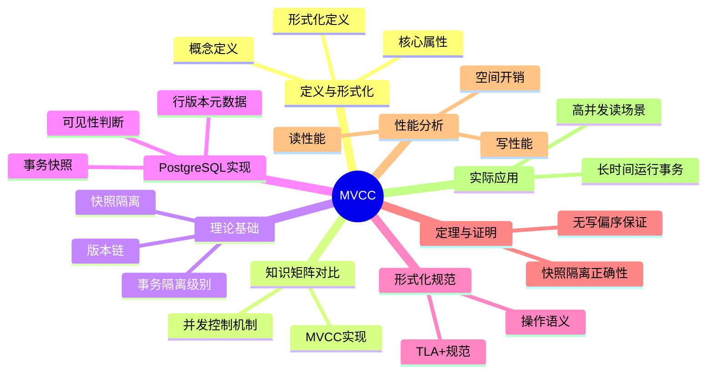

# MVCC高级分析与形式证明

> **文档版本**: v2.0
> **最后更新**: 2025-01-16
> **版本覆盖**: PostgreSQL 18.x (推荐) ⭐ | 17.x (推荐) | 16.x (兼容)
> **文档状态**: 🟡 内容完善中
> **对标标准**: 项目文档结构统一规范、学术研究前沿

---

## 📋 目录

- [MVCC高级分析与形式证明](#mvcc高级分析与形式证明)
  - [📋 目录](#-目录)
  - [📊 思维导图](#-思维导图)
  - [一、定义与形式化](#一定义与形式化)
    - [1.1 概念定义](#11-概念定义)
    - [1.2 形式化定义](#12-形式化定义)
    - [1.3 核心属性](#13-核心属性)
  - [二、知识矩阵对比](#二知识矩阵对比)
    - [2.1 并发控制机制对比](#21-并发控制机制对比)
    - [2.2 MVCC实现对比](#22-mvcc实现对比)
  - [三、理论基础](#三理论基础)
    - [2.1 快照隔离（Snapshot Isolation）](#21-快照隔离snapshot-isolation)
      - [2.1.1 快照的定义](#211-快照的定义)
      - [2.1.2 可见性规则](#212-可见性规则)
    - [2.2 版本链（Version Chain）](#22-版本链version-chain)
      - [2.2.1 版本链结构](#221-版本链结构)
    - [2.3 事务隔离级别](#23-事务隔离级别)
  - [3. PostgreSQL MVCC实现分析](#3-postgresql-mvcc实现分析)
    - [3.1 行版本元数据](#31-行版本元数据)
    - [3.2 事务快照](#32-事务快照)
    - [3.3 可见性判断](#33-可见性判断)
  - [4. MVCC形式化规范](#4-mvcc形式化规范)
    - [4.1 TLA+规范](#41-tla规范)
    - [4.2 操作语义](#42-操作语义)
      - [4.2.1 开始事务](#421-开始事务)
      - [4.2.2 读取行](#422-读取行)
      - [4.2.3 写入行](#423-写入行)
  - [5. MVCC正确性定理](#5-mvcc正确性定理)
    - [5.1 快照隔离正确性](#51-快照隔离正确性)
    - [5.2 无写偏序保证](#52-无写偏序保证)
  - [6. 性能分析](#6-性能分析)
    - [6.1 读性能](#61-读性能)
    - [6.2 写性能](#62-写性能)
    - [6.3 空间开销](#63-空间开销)
  - [7. 实际应用案例](#7-实际应用案例)
    - [7.1 高并发读场景](#71-高并发读场景)
    - [7.2 长时间运行事务](#72-长时间运行事务)
  - [8. 相关文档](#8-相关文档)
    - [8.1 理论基础文档](#81-理论基础文档)
    - [8.2 核心基础文档](#82-核心基础文档)
    - [8.3 其他相关文档](#83-其他相关文档)
  - [9. 参考文献](#9-参考文献)
    - [9.1 MVCC理论](#91-mvcc理论)
    - [9.2 PostgreSQL实现](#92-postgresql实现)
    - [9.3 形式化验证](#93-形式化验证)

---

## 📊 思维导图



---

## 一、定义与形式化

### 1.1 概念定义

**中文定义**: MVCC（多版本并发控制，Multi-Version Concurrency Control）是一种数据库并发控制机制，通过为每个数据项维护多个版本来实现高效的并发访问。在MVCC中，读操作不需要加锁，每个事务看到数据库的一个一致性快照，写操作创建新版本而不影响正在进行的读操作。PostgreSQL采用MVCC作为其核心并发控制机制，实现了高并发性能和强一致性保证。

**English Definition**: MVCC (Multi-Version Concurrency Control) is a database concurrency control mechanism that maintains multiple versions of each data item to enable efficient concurrent access. In MVCC, read operations do not require locks, each transaction sees a consistent snapshot of the database, and write operations create new versions without affecting ongoing read operations. PostgreSQL uses MVCC as its core concurrency control mechanism, achieving high concurrency performance and strong consistency guarantees.

**Wikidata对齐**: [Multi-version concurrency control](https://www.wikidata.org/wiki/Q6931961)

### 1.2 形式化定义

#### 1.2.1 基本符号

```latex
% 基本集合
\mathcal{T} = \{t_1, t_2, \ldots, t_n\}  % 事务集合
\mathcal{R} = \{r_1, r_2, \ldots, r_m\}  % 数据行集合
\mathcal{V} = \{v_1, v_2, \ldots, v_k\}  % 版本集合
\mathcal{S} = \{s_1, s_2, \ldots, s_l\}  % 快照集合

% 版本定义
v = (data, xmin, xmax, ctid) \in \mathcal{V}

其中：
- data: 版本数据
- xmin \in \mathcal{T}: 创建版本的事务ID
- xmax \in \mathcal{T} \cup \{\bot\}: 删除版本的事务ID（\bot表示未删除）
- ctid: 指向下一个版本的指针

% 快照定义
s = (xmin, xmax, xip) \in \mathcal{S}

其中：
- xmin \in \mathbb{N}: 最早可见事务ID
- xmax \in \mathbb{N}: 最晚可见事务ID
- xip \subseteq \mathcal{T}: 进行中的事务ID集合
```

#### 1.2.2 可见性函数

```latex
\text{Visible}(v, s) \iff 
    (v.\text{xmin} < s.\text{xmin}) \land
    (v.\text{xmax} = \bot \lor v.\text{xmax} > s.\text{xmax}) \land
    (v.\text{xmin} \notin s.\text{xip})
```

### 1.3 核心属性

1. **快照一致性（Snapshot Consistency）**：
   - 每个事务看到数据库的一个一致性快照
   - 快照在事务开始时确定，事务期间不变

2. **无锁读取（Lock-Free Reading）**：
   - 读操作不需要获取锁
   - 通过版本可见性判断实现

3. **写操作隔离（Write Isolation）**：
   - 写操作创建新版本
   - 不影响正在进行的读操作

4. **版本管理（Version Management）**：
   - 每个数据项维护版本链
   - 通过VACUUM机制清理过期版本

---

## 二、知识矩阵对比

### 2.1 并发控制机制对比

| 特性 | 两阶段锁（2PL） | MVCC | 时间戳排序（TO） | 乐观并发控制（OCC） |
|------|----------------|------|-----------------|-------------------|
| **实现方式** | 锁机制 | 多版本 | 时间戳 | 版本号 |
| **读操作** | 需要锁 | 无锁 | 无锁 | 无锁 |
| **写操作** | 需要锁 | 创建新版本 | 时间戳检查 | 版本号检查 |
| **死锁** | 可能发生 | 读操作无死锁 | 无死锁 | 无死锁 |
| **并发度** | 中等 | 高 | 高 | 高 |
| **存储开销** | 低 | 高（多版本） | 低 | 中等 |
| **回滚开销** | 中等 | 低 | 高 | 高 |
| **适用场景** | 传统数据库 | PostgreSQL、Oracle | 研究系统 | 读多写少 |
| **一致性保证** | 可串行化 | 快照隔离 | 可串行化 | 可串行化 |

### 2.2 MVCC实现对比

| 特性 | PostgreSQL | Oracle | MySQL InnoDB | SQL Server |
|------|-----------|--------|--------------|------------|
| **版本存储** | 堆表 | UNDO段 | UNDO日志 | TempDB |
| **快照创建** | 事务开始 | 语句开始 | 事务开始 | 语句开始 |
| **版本清理** | VACUUM | 自动清理 | Purge线程 | 自动清理 |
| **隔离级别** | SI/SSI | SI | SI | SI |
| **读性能** | 高 | 高 | 高 | 高 |
| **写性能** | 高 | 高 | 中等 | 高 |

---

## 三、理论基础

### 2.1 快照隔离（Snapshot Isolation）

快照隔离是MVCC的核心概念，保证每个事务看到数据库的一个一致性快照。

#### 2.1.1 快照的定义

**形式化定义**：

```text
快照 = (事务ID, 可见版本集合, 时间戳)
```

其中：

- **事务ID**：创建快照的事务标识
- **可见版本集合**：该事务可见的所有数据版本
- **时间戳**：快照创建的时间点

#### 2.1.2 可见性规则

数据版本对事务可见的条件：

```text
可见(版本, 事务) ⟺
    版本.xmin < 事务.snapshot.xmin ∧
    (版本.xmax = NULL ∨ 版本.xmax > 事务.snapshot.xmax)
```

### 2.2 版本链（Version Chain）

PostgreSQL使用版本链管理同一行的多个版本。

#### 2.2.1 版本链结构

```text
版本链 = [版本₁, 版本₂, ..., 版本ₙ]
```

每个版本包含：

- **xmin**：创建该版本的事务ID
- **xmax**：删除该版本的事务ID（如果存在）
- **ctid**：指向下一个版本的指针
- **数据**：实际的数据内容

### 2.3 事务隔离级别

PostgreSQL支持四种隔离级别：

1. **READ UNCOMMITTED**：实际上等同于READ COMMITTED
2. **READ COMMITTED**：每个语句看到已提交的数据
3. **REPEATABLE READ**：事务看到一致的快照
4. **SERIALIZABLE**：可串行化隔离级别（使用SSI）

---

## 3. PostgreSQL MVCC实现分析

### 3.1 行版本元数据

PostgreSQL在每行数据中存储版本信息：

```sql
-- 行版本元数据字段
xmin    -- 插入事务ID
xmax    -- 删除事务ID
ctid    -- 行版本指针
infomask -- 版本状态标志
```

### 3.2 事务快照

PostgreSQL使用`SnapshotData`结构表示事务快照：

```c
typedef struct SnapshotData {
    TransactionId xmin;      // 最早可见事务ID
    TransactionId xmax;      // 最晚可见事务ID
    TransactionId *xip;      // 进行中的事务ID列表
    uint32 xcnt;            // 进行中的事务数量
} SnapshotData;
```

### 3.3 可见性判断

PostgreSQL使用`HeapTupleSatisfiesVisibility`函数判断行的可见性：

```c
bool HeapTupleSatisfiesVisibility(HeapTuple tuple,
                                   Snapshot snapshot,
                                   Buffer buffer)
{
    // 检查xmin和xmax
    // 检查事务状态
    // 返回可见性结果
}
```

---

## 4. MVCC形式化规范

### 4.1 TLA+规范

MVCC的TLA+规范定义系统状态和操作：

```tla
EXTENDS Naturals, Sequences

VARIABLES
    xact_id,           -- 当前事务ID
    snapshot,          -- 事务快照映射
    version_chain,     -- 版本链映射
    committed_xacts    -- 已提交事务集合

TypeInvariant ==
    /\ xact_id \in Nat
    /\ snapshot \in [Transaction -> Snapshot]
    /\ version_chain \in [Row -> Seq(Version)]
    /\ committed_xacts \in SUBSET Transaction

MVCC_Invariant ==
    \A row \in Rows, t \in Transaction:
        Visible(row, snapshot[t]) <=>
            (row.xmin < snapshot[t].xmin /\
             (row.xmax = NULL \/ row.xmax > snapshot[t].xmax))
```

### 4.2 操作语义

#### 4.2.1 开始事务

```tla
BeginTransaction(t) ==
    /\ xact_id' = xact_id + 1
    /\ snapshot'[t] = CreateSnapshot(xact_id')
    /\ UNCHANGED <<version_chain, committed_xacts>>
```

#### 4.2.2 读取行

```tla
ReadRow(t, r) ==
    /\ t \in Transaction
    /\ snapshot[t] # NULL
    /\ \E v \in version_chain[r]:
        Visible(v, snapshot[t])
    /\ UNCHANGED <<xact_id, snapshot, version_chain, committed_xacts>>
```

#### 4.2.3 写入行

```tla
WriteRow(t, r, new_value) ==
    /\ t \in Transaction
    /\ snapshot[t] # NULL
    /\ version_chain'[r] = Append(version_chain[r],
                                   CreateVersion(t, new_value))
    /\ UNCHANGED <<xact_id, snapshot, committed_xacts>>
```

---

## 5. MVCC正确性定理

### 5.1 快照隔离正确性

**定理 5.1（快照隔离正确性）**：

对于任意事务`t`，其快照`snapshot[t]`满足：

1. **一致性**：快照中的所有数据版本在快照创建时都是已提交的
2. **隔离性**：不同事务的快照互不干扰
3. **可见性**：事务只能看到其快照创建时可见的数据版本

**证明纲要**：

1. **基础步骤**：初始状态满足不变式
2. **归纳步骤**：假设状态满足不变式，证明操作后仍满足不变式
3. **结论**：所有可达状态都满足不变式

### 5.2 无写偏序保证

**定理 5.2（无写偏序）**：

在快照隔离下，如果两个事务`t₁`和`t₂`都读取了相同的数据，然后都进行写操作，则至少有一个事务会检测到冲突。

**证明**：

使用SSI（Serializable Snapshot Isolation）机制，通过跟踪读写依赖关系检测写偏序。

---

## 6. 性能分析

### 6.1 读性能

MVCC的优势：

- **无锁读取**：读操作不需要获取锁，减少锁竞争
- **版本链遍历**：O(n)复杂度，n为版本链长度
- **快照创建**：O(1)复杂度

### 6.2 写性能

MVCC的开销：

- **版本创建**：每次更新创建新版本
- **版本链维护**：需要维护版本链指针
- **VACUUM开销**：需要定期清理旧版本

### 6.3 空间开销

- **版本存储**：每个版本都需要存储完整数据
- **元数据开销**：每行需要存储xmin、xmax等元数据

---

## 7. 实际应用案例

### 7.1 高并发读场景

**场景**：电商系统的商品浏览

**需求**：大量用户同时浏览商品信息

**MVCC优势**：

- 读操作不阻塞，提高并发性能
- 每个用户看到一致的商品信息快照

### 7.2 长时间运行事务

**场景**：数据分析查询

**需求**：长时间运行的报表查询

**MVCC优势**：

- 查询看到一致的快照，不受其他事务影响
- 不会因为其他事务的更新而中断

---

## 8. 相关文档

### 8.1 理论基础文档

- [形式语言与证明：总论](./1.1.25-形式语言与证明-总论.md)
- [事务隔离与MVCC：统一形式模型与完备性证明](./1.1.27-事务隔离与MVCC-统一形式模型与完备性证明.md)
- [MVCC形式化验证](./10.04-MVCC形式化验证.md)

### 8.2 核心基础文档

- [并发控制与MVCC机制](../01-核心课程/01.05-并发控制与MVCC机制.md)
- [事务管理与ACID特性](../01-核心课程/01.04-事务管理与ACID特性.md)

### 8.3 其他相关文档

- [VACUUM与可见性不变式：垃圾回收正确性](./1.1.36-VACUUM与可见性不变式-垃圾回收正确性.md)
- [快照隔离异常谱系：形式分类与必要条件](./1.1.61-快照隔离异常谱系-形式分类与必要条件.md)

---

## 9. 参考文献

### 9.1 MVCC理论

1. Berenson, H., et al. (1995). "A Critique of ANSI SQL Isolation Levels." _SIGMOD Conference_.

2. Fekete, A., et al. (2005). "Making Snapshot Isolation Serializable." _ACM Transactions on Database Systems_.

### 9.2 PostgreSQL实现

1. PostgreSQL Global Development Group. (2024). _PostgreSQL 18 Documentation - Concurrency Control_. <https://www.postgresql.org/docs/18/mvcc.html>

2. PostgreSQL Source Code. (2024). _src/backend/access/heap/heapam.c_.

### 9.3 形式化验证

1. Lamport, L. (2002). _Specifying Systems: The TLA+ Language and Tools for Hardware and Software Engineers_. Addison-Wesley.

---

**最后更新**: 2025-01-16
**维护者**: Documentation Team
**状态**: 🟡 框架已创建，内容待完善
