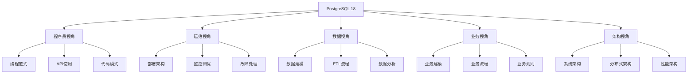

# PostgreSQL 18 全面使用分析

> **版本**: v1.0
> **最后更新**: 2025-01-15
> **版本覆盖**: PostgreSQL 18.x (推荐) ⭐
> **状态**: ✅ 已完成

---

## 📋 项目概述

本项目从**多视角**全面分析PostgreSQL 18的使用，涵盖：

- **程序员视角**：编程范式、API使用、代码模式
- **运维视角**：部署架构、监控、调优、故障处理
- **数据视角**：数据建模、ETL、分析、质量
- **业务视角**：业务建模、规则、流程、需求
- **架构视角**：系统设计、分布式、微服务、性能

---

## 🗺️ 导航

### 按视角导航

- [👨‍💻 程序员视角](../01-程序员视角/) - 开发实践、编程范式、代码模式
- [🔧 运维视角](../02-运维视角/) - 部署、监控、调优、故障处理
- [📊 数据视角](../03-数据视角/) - 数据建模、ETL、分析、质量
- [💼 业务视角](../04-业务视角/) - 业务建模、规则、流程、需求
- [🏗️ 架构视角](../05-架构视角/) - 系统设计、分布式、微服务、性能

### 按主题导航

- [📚 知识体系](../06-知识体系/) - 知识图谱、学习路径、技术依赖
- [🔍 问题梳理](../07-问题梳理/) - 常见问题、解决方案、最佳实践
- [⚖️ 模型权衡](../08-模型权衡/) - 技术选型、性能权衡、成本权衡
- [💡 实践案例](../09-实践案例/) - 真实案例、经验总结、最佳实践

---

## 📖 快速开始

### 1. 选择你的角色

- **我是程序员** → [程序员视角](../01-程序员视角/)
- **我是运维工程师** → [运维视角](../02-运维视角/)
- **我是数据分析师** → [数据视角](../03-数据视角/)
- **我是业务分析师** → [业务视角](../04-业务视角/)
- **我是架构师** → [架构视角](../05-架构视角/)

### 2. 了解知识体系

- [知识体系总览](./知识体系总览.md)
- [核心知识体系](../06-知识体系/06.01-核心知识体系.md)
- [架构知识体系](../06-知识体系/06.04-架构知识体系.md)

### 3. 解决问题

- [性能问题梳理](../07-问题梳理/07.01-性能问题梳理.md)
- [可用性问题梳理](../07-问题梳理/07.02-可用性问题梳理.md)
- [数据问题梳理](../07-问题梳理/07.03-数据问题梳理.md)

---

## 🎯 核心内容

### 知识体系

- **核心概念**：数据库、表、索引、事务
- **高级特性**：分区、复制、分片、分布式
- **应用场景**：OLTP、OLAP、HTAP、时序

### 编程范式

- **函数式编程**：PL/pgSQL函数式特性
- **面向对象编程**：类型系统、继承
- **声明式编程**：SQL声明式特性
- **响应式编程**：LISTEN/NOTIFY、逻辑复制
- **事件驱动编程**：触发器、事件流

### 数据处理

- **数据建模**：概念建模、逻辑建模、物理建模
- **ETL流程**：提取、转换、加载
- **数据分析**：OLAP、数据挖掘、机器学习
- **数据质量**：数据校验、数据清洗

### 架构设计

- **系统架构**：分层架构、微服务架构
- **分布式架构**：分片、分布式事务
- **高可用架构**：主从复制、集群
- **性能架构**：缓存、读写分离、分库分表

### 业务建模

- **领域建模**：DDD、领域分析
- **业务流程**：BPMN、工作流
- **业务规则**：规则引擎、决策表
- **多租户**：租户隔离、数据共享

---

## 📊 知识图谱

---

## 🔗 相关文档

- [完整分析计划](../../00-项目导航/01-项目计划/PostgreSQL-18-全面使用分析计划.md)
- [PostgreSQL 18新特性](../../02-版本特性/02.01-PostgreSQL-18-新特性.md)
- [核心课程](../../01-核心课程/)
- [实战案例](../../06-实战案例/)

---

**最后更新**: 2025-01-15
**维护者**: PostgreSQL Documentation Team
