# PostgreSQL 18 故障排查与恢复

> **版本**: v1.0
> **最后更新**: 2025-01-15
> **版本覆盖**: PostgreSQL 18.x (推荐) ⭐ | 17.x (推荐) | 16.x (兼容)
> **文档状态**: ✅ 已完成

---

## 📑 目录

- [PostgreSQL 18 故障排查与恢复](#postgresql-18-故障排查与恢复)
  - [📑 目录](#-目录)
  - [📊 思维导图](#-思维导图)
  - [一、概述](#一概述)
  - [二、知识矩阵对比](#二知识矩阵对比)
    - [2.1 故障类型对比](#21-故障类型对比)
    - [2.2 恢复策略对比](#22-恢复策略对比)
  - [三、常见故障诊断](#三常见故障诊断)
    - [3.1 连接问题](#31-连接问题)
      - [3.1.1 连接数耗尽问题](#311-连接数耗尽问题)
    - [3.2 性能问题](#32-性能问题)
    - [3.3 锁问题](#33-锁问题)
    - [3.4 数据损坏](#34-数据损坏)
  - [四、故障排查流程](#四故障排查流程)
    - [4.1 问题定位](#41-问题定位)
    - [4.2 日志分析](#42-日志分析)
    - [4.3 系统检查](#43-系统检查)
  - [五、故障恢复](#五故障恢复)
    - [5.1 主从切换](#51-主从切换)
    - [5.2 数据恢复](#52-数据恢复)
    - [5.3 服务恢复](#53-服务恢复)
  - [六、灾难恢复](#六灾难恢复)
    - [6.1 备份恢复](#61-备份恢复)
    - [6.2 PITR恢复](#62-pitr恢复)
    - [6.3 增量备份恢复](#63-增量备份恢复)
  - [七、预防措施](#七预防措施)
    - [7.1 监控告警](#71-监控告警)
    - [7.2 定期演练](#72-定期演练)
    - [7.3 最佳实践](#73-最佳实践)
  - [八、相关文档](#八相关文档)

---

## 📊 思维导图

```mermaid
mindmap
  root((故障排查与恢复))
    故障诊断
      连接问题
      性能问题
      锁问题
      数据损坏
    排查流程
      问题定位
      日志分析
      系统检查
    故障恢复
      主从切换
      数据恢复
      服务恢复
    灾难恢复
      备份恢复
      PITR恢复
      增量备份
    预防措施
      监控告警
      定期演练
      最佳实践
```



---

## 一、概述

本文档介绍PostgreSQL 18的故障排查与恢复实践，帮助运维人员快速定位和解决生产环境问题。

**核心特点**：

- **系统性**：完整的故障排查流程
- **实用性**：基于实际故障案例
- **快速响应**：提供快速诊断方法
- **恢复策略**：多种恢复方案

**PostgreSQL 18 新特性支持**：

- ✅ **增量备份**：更快的备份和恢复
- ✅ **改进的日志**：更详细的错误信息
- ✅ **增强的监控**：更好的故障诊断能力

---

## 二、知识矩阵对比

### 2.1 故障类型对比

| 故障类型 | 频率 | 影响 | 恢复难度 | 预防难度 |
|---------|------|------|---------|---------|
| **连接问题** | 高 | 中 | ⭐⭐ | ⭐⭐ |
| **性能问题** | 高 | 中 | ⭐⭐⭐ | ⭐⭐⭐ |
| **锁问题** | 中 | 高 | ⭐⭐⭐ | ⭐⭐⭐ |
| **数据损坏** | 低 | 极高 | ⭐⭐⭐⭐⭐ | ⭐⭐⭐⭐ |

### 2.2 恢复策略对比

| 恢复策略 | RTO | RPO | 复杂度 | 推荐度 |
|---------|-----|-----|--------|--------|
| **主从切换** | 分钟级 | 秒级 | ⭐⭐⭐ | ⭐⭐⭐⭐⭐ |
| **备份恢复** | 小时级 | 小时级 | ⭐⭐ | ⭐⭐⭐⭐ |
| **PITR恢复** | 小时级 | 分钟级 | ⭐⭐⭐⭐ | ⭐⭐⭐⭐⭐ |
| **增量备份恢复** | 分钟级 | 分钟级 | ⭐⭐⭐ | ⭐⭐⭐⭐⭐ |

---

## 三、常见故障诊断

### 3.1 连接问题

#### 3.1.1 连接数耗尽问题

**为什么会出现连接数耗尽**：

连接数耗尽是PostgreSQL最常见的故障之一，原因包括：

1. **连接泄漏**：应用没有正确关闭连接
2. **连接池配置不当**：连接池大小超过max_connections
3. **长时间事务**：事务持有连接时间过长
4. **僵尸连接**：连接处于idle状态但未释放

**连接数耗尽的危害**：

| 危害 | 影响 | 严重程度 |
|-----|------|---------|
| **新连接无法建立** | 服务不可用 | ⭐⭐⭐⭐⭐ |
| **应用报错** | 用户体验差 | ⭐⭐⭐⭐⭐ |
| **系统负载高** | 性能下降 | ⭐⭐⭐⭐ |

**连接数耗尽诊断**：

```sql
-- 场景：诊断连接数耗尽问题
-- 需求：快速识别连接数使用情况和问题连接
-- 用途：故障排查和容量规划

-- 查询1：检查连接数使用情况
SELECT
    COUNT(*) as total_connections,
    (SELECT setting::int FROM pg_settings WHERE name = 'max_connections') as max_connections,
    ROUND(100.0 * COUNT(*) / (SELECT setting::int FROM pg_settings WHERE name = 'max_connections'), 2) as usage_percent,
    CASE
        WHEN 100.0 * COUNT(*) / (SELECT setting::int FROM pg_settings WHERE name = 'max_connections') > 90
        THEN 'CRITICAL: Connection usage > 90%'
        WHEN 100.0 * COUNT(*) / (SELECT setting::int FROM pg_settings WHERE name = 'max_connections') > 80
        THEN 'WARNING: Connection usage > 80%'
        ELSE 'OK'
    END as status
FROM pg_stat_activity;

-- 查询结果分析：
-- - total_connections: 当前连接数
-- - max_connections: 最大连接数
-- - usage_percent: 连接数使用率
-- - status: 状态（OK/WARNING/CRITICAL）

-- 查询2：查看连接详情（按状态分类）
SELECT
    datname,
    usename,
    application_name,
    client_addr,
    state,
    COUNT(*) as connection_count,
    MAX(EXTRACT(EPOCH FROM (NOW() - state_change))) as max_idle_seconds
FROM pg_stat_activity
WHERE datname IS NOT NULL
GROUP BY datname, usename, application_name, client_addr, state
ORDER BY connection_count DESC;

-- 查询结果分析：
-- - 识别占用连接数最多的应用
-- - 识别长时间空闲的连接
-- - 识别异常状态的连接

-- 查询3：查找长时间空闲的连接（可能的连接泄漏）
SELECT
    pid,
    datname,
    usename,
    application_name,
    client_addr,
    state,
    EXTRACT(EPOCH FROM (NOW() - state_change)) as idle_seconds,
    query_start,
    state_change,
    query
FROM pg_stat_activity
WHERE state = 'idle'
  AND EXTRACT(EPOCH FROM (NOW() - state_change)) > 300  -- 空闲超过5分钟
ORDER BY state_change;

-- 解决方案：
-- 1. 终止长时间空闲的连接
SELECT pg_terminate_backend(pid) FROM pg_stat_activity
WHERE state = 'idle' AND EXTRACT(EPOCH FROM (NOW() - state_change)) > 3600;

-- 2. 检查应用连接池配置
-- 3. 优化应用代码，确保连接正确关闭
-- 4. 增加max_connections（临时方案）
```

**连接超时问题**：

```sql
-- 场景：诊断连接超时问题
-- 问题：应用连接数据库时超时
-- 原因：网络问题、防火墙、连接数耗尽、数据库负载高

-- 查询1：检查长时间运行的查询（可能导致连接超时）
SELECT
    pid,
    datname,
    usename,
    application_name,
    state,
    EXTRACT(EPOCH FROM (NOW() - query_start)) as query_duration_seconds,
    wait_event_type,
    wait_event,
    query
FROM pg_stat_activity
WHERE state = 'active'
  AND EXTRACT(EPOCH FROM (NOW() - query_start)) > 60  -- 运行超过1分钟
ORDER BY query_start;

-- 查询结果分析：
-- - query_duration_seconds: 查询运行时间
-- - wait_event_type: 等待事件类型（可能表示锁等待、I/O等待等）
-- - wait_event: 具体等待事件

-- 解决方案：
-- 1. 优化慢查询
-- 2. 终止长时间运行的查询（如果允许）
SELECT pg_terminate_backend(pid) FROM pg_stat_activity
WHERE state = 'active' AND EXTRACT(EPOCH FROM (NOW() - query_start)) > 300;

-- 3. 检查网络连接
-- 4. 检查防火墙配置
-- 5. 检查数据库负载
    query
FROM pg_stat_activity
WHERE state != 'idle'
AND now() - query_start > interval '5 minutes'
ORDER BY query_start;
```

### 3.2 性能问题

**慢查询诊断**：

```sql
-- 使用pg_stat_statements查找慢查询
SELECT
    query,
    calls,
    mean_exec_time,
    max_exec_time,
    total_exec_time
FROM pg_stat_statements
WHERE mean_exec_time > 1000
ORDER BY total_exec_time DESC
LIMIT 10;
```

**资源瓶颈**：

```sql
-- 检查等待事件
SELECT
    wait_event_type,
    wait_event,
    COUNT(*) as count
FROM pg_stat_activity
WHERE wait_event IS NOT NULL
GROUP BY wait_event_type, wait_event
ORDER BY count DESC;
```

### 3.3 锁问题

**锁等待诊断**：

```sql
-- 查看锁等待
SELECT
    blocked_locks.pid AS blocked_pid,
    blocked_activity.usename AS blocked_user,
    blocking_locks.pid AS blocking_pid,
    blocking_activity.usename AS blocking_user,
    blocked_activity.query AS blocked_statement,
    blocking_activity.query AS blocking_statement
FROM pg_catalog.pg_locks blocked_locks
JOIN pg_catalog.pg_stat_activity blocked_activity ON blocked_activity.pid = blocked_locks.pid
JOIN pg_catalog.pg_locks blocking_locks
    ON blocking_locks.locktype = blocked_locks.locktype
    AND blocking_locks.database IS NOT DISTINCT FROM blocked_locks.database
    AND blocking_locks.relation IS NOT DISTINCT FROM blocked_locks.relation
    AND blocking_locks.page IS NOT DISTINCT FROM blocked_locks.page
    AND blocking_locks.tuple IS NOT DISTINCT FROM blocked_locks.tuple
    AND blocking_locks.virtualxid IS NOT DISTINCT FROM blocked_locks.virtualxid
    AND blocking_locks.transactionid IS NOT DISTINCT FROM blocked_locks.transactionid
    AND blocking_locks.classid IS NOT DISTINCT FROM blocked_locks.classid
    AND blocking_locks.objid IS NOT DISTINCT FROM blocked_locks.objid
    AND blocking_locks.objsubid IS NOT DISTINCT FROM blocked_locks.objsubid
    AND blocking_locks.pid != blocked_locks.pid
JOIN pg_catalog.pg_stat_activity blocking_activity ON blocking_activity.pid = blocking_locks.pid
WHERE NOT blocked_locks.granted;
```

**死锁处理**：

```sql
-- 终止阻塞的查询
SELECT pg_terminate_backend(pid)
FROM pg_stat_activity
WHERE pid IN (
    SELECT blocking_pid
    FROM (
        -- 使用上面的锁等待查询
    ) blocked_queries
);
```

### 3.4 数据损坏

**数据完整性检查**：

```sql
-- 检查表损坏
SELECT
    schemaname,
    tablename,
    pg_size_pretty(pg_total_relation_size(schemaname||'.'||tablename)) as size
FROM pg_tables
WHERE schemaname = 'public';

-- 使用pg_amcheck检查（PostgreSQL 14+）
-- pg_amcheck -d mydb -t public.users
```

---

## 四、故障排查流程

### 4.1 问题定位

**问题定位步骤**：

1. 收集错误信息
2. 检查日志文件
3. 检查系统资源
4. 检查数据库状态
5. 分析问题原因

### 4.2 日志分析

**日志位置**：

```bash
# 日志目录
/var/log/postgresql/
# 或
/var/lib/postgresql/18/data/log/

# 查看最新日志
tail -f /var/log/postgresql/postgresql-*.log

# 查找错误
grep ERROR /var/log/postgresql/postgresql-*.log

# 查找慢查询
grep "duration:" /var/log/postgresql/postgresql-*.log | \
    awk '{print $NF}' | sort -n | tail -20
```

### 4.3 系统检查

**系统资源检查**：

```bash
# CPU使用率
top -p $(pgrep -f postgres)

# 内存使用
free -h
ps aux | grep postgres

# 磁盘使用
df -h
du -sh /var/lib/postgresql/18/data/

# I/O统计
iostat -x 1
```

---

## 五、故障恢复

### 5.1 主从切换

**自动切换（Patroni）**：

```bash
# 查看集群状态
patronictl -c /etc/patroni/patroni.yml list

# 手动切换
patronictl -c /etc/patroni/patroni.yml switchover

# 故障转移
patronictl -c /etc/patroni/patroni.yml failover
```

**手动切换**：

```sql
-- 在从库上提升为主库
SELECT pg_promote();

-- 或使用pg_ctl
pg_ctl promote -D /var/lib/postgresql/18/data
```

### 5.2 数据恢复

**从备份恢复**：

```bash
# 停止PostgreSQL
sudo systemctl stop postgresql

# 备份当前数据
sudo mv /var/lib/postgresql/18/data /var/lib/postgresql/18/data.backup

# 恢复备份
pg_restore -d mydb /backup/mydb_backup.dump

# 或使用pg_basebackup
pg_basebackup -h primary_host -U replicator -D /var/lib/postgresql/18/data -X stream -R
```

### 5.3 服务恢复

**服务重启**：

```bash
# 正常重启
sudo systemctl restart postgresql

# 强制重启
sudo systemctl stop postgresql
sudo systemctl start postgresql

# 检查状态
sudo systemctl status postgresql
```

---

## 六、灾难恢复

### 6.1 备份恢复

**逻辑备份恢复**：

```bash
# 恢复数据库
pg_restore -d mydb -v /backup/mydb_backup.dump

# 或使用psql
psql -d mydb < /backup/mydb_backup.sql
```

**物理备份恢复**：

```bash
# 使用pg_basebackup恢复
pg_basebackup -h primary_host -U replicator \
    -D /var/lib/postgresql/18/data \
    -X stream -R -C -S replica1
```

### 6.2 PITR恢复

**PITR恢复步骤**：

```bash
# 1. 恢复基础备份
pg_combinebackup /backup/base_backup -o /restore/data

# 2. 配置恢复参数
cat > /restore/data/postgresql.auto.conf <<EOF
restore_command = 'cp /backup/wal_archive/%f %p'
recovery_target_time = '2024-01-15 10:00:00'
EOF

# 3. 启动数据库
pg_ctl -D /restore/data start
```

### 6.3 增量备份恢复

**PostgreSQL 18增量备份恢复**：

```bash
# 恢复增量备份
pg_combinebackup \
    --manifest=/backup/manifest \
    --backup=/backup/base_backup \
    --incremental=/backup/incremental_backup \
    -o /restore/data
```

---

## 七、预防措施

### 7.1 监控告警

**关键监控指标**：

- 连接数使用率
- 查询响应时间
- 锁等待时间
- 复制延迟
- 磁盘使用率

### 7.2 定期演练

**演练计划**：

- 每月进行故障切换演练
- 每季度进行备份恢复演练
- 每年进行灾难恢复演练

### 7.3 最佳实践

**预防措施清单**：

- ✅ 配置监控告警
- ✅ 定期备份
- ✅ 测试恢复流程
- ✅ 文档化操作流程
- ✅ 培训运维人员

---

## 八、相关文档

- [部署架构设计](./02.01-部署架构设计.md)
- [监控与可观测性](./02.02-监控与可观测性.md)
- [性能调优实践](./02.03-性能调优实践.md)
- [备份与恢复](../../04-部署运维/04.05-备份与恢复.md)
- [故障切换与订阅重建](../../06-运维实践/运维手册/故障切换与订阅重建.md)

---

**最后更新**: 2025-01-15
**维护者**: PostgreSQL Documentation Team
