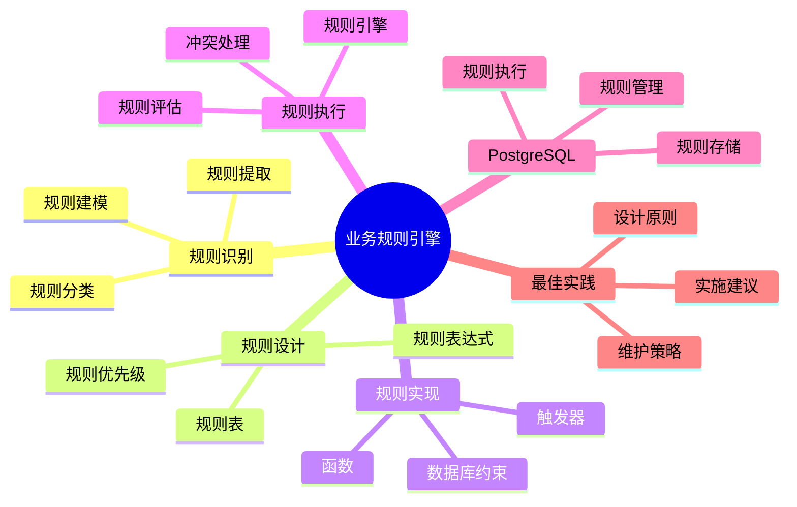

# PostgreSQL 18 业务规则引擎

> **版本**: v1.0
> **最后更新**: 2025-01-15
> **版本覆盖**: PostgreSQL 18.x (推荐) ⭐ | 17.x (推荐) | 16.x (兼容)
> **文档状态**: ✅ 已完成

---

## 📑 目录

- [PostgreSQL 18 业务规则引擎](#postgresql-18-业务规则引擎)
  - [📑 目录](#-目录)
  - [📊 思维导图](#-思维导图)
  - [一、概述](#一概述)
  - [二、知识矩阵对比](#二知识矩阵对比)
    - [2.1 规则引擎方案对比](#21-规则引擎方案对比)
    - [2.2 规则实现方式对比](#22-规则实现方式对比)
  - [三、规则识别](#三规则识别)
    - [3.1 业务规则分类](#31-业务规则分类)
      - [3.1.1 业务规则分类的重要性](#311-业务规则分类的重要性)
      - [3.1.2 业务规则分类实现](#312-业务规则分类实现)
    - [3.2 规则提取](#32-规则提取)
      - [3.2.1 规则提取的重要性](#321-规则提取的重要性)
      - [3.2.2 规则提取实现](#322-规则提取实现)
    - [3.3 规则建模](#33-规则建模)
      - [3.3.1 规则建模的重要性](#331-规则建模的重要性)
      - [3.3.2 规则建模实现](#332-规则建模实现)
  - [四、规则设计](#四规则设计)
    - [4.1 规则表设计](#41-规则表设计)
    - [4.2 规则表达式](#42-规则表达式)
    - [4.3 规则优先级](#43-规则优先级)
  - [五、规则实现](#五规则实现)
    - [5.1 数据库约束](#51-数据库约束)
    - [5.2 触发器规则](#52-触发器规则)
    - [5.3 函数规则](#53-函数规则)
  - [六、规则执行](#六规则执行)
    - [6.1 规则引擎](#61-规则引擎)
    - [6.2 规则评估](#62-规则评估)
    - [6.3 规则冲突处理](#63-规则冲突处理)
  - [七、PostgreSQL实现](#七postgresql实现)
    - [7.1 规则存储](#71-规则存储)
    - [7.2 规则执行](#72-规则执行)
    - [7.3 规则管理](#73-规则管理)
  - [八、最佳实践](#八最佳实践)
    - [8.1 设计原则](#81-设计原则)
    - [8.2 实施建议](#82-实施建议)
    - [8.3 维护策略](#83-维护策略)
  - [九、相关文档](#九相关文档)

---

## 📊 思维导图



---

## 一、概述

本文档从业务视角介绍PostgreSQL 18中的业务规则引擎设计，帮助业务分析师实现灵活的业务规则管理。

**核心特点**：

- **规则驱动**：基于规则的业务逻辑
- **灵活配置**：支持动态规则配置
- **可维护性**：规则易于管理和修改
- **PostgreSQL实现**：在PostgreSQL中实现规则引擎

---

## 二、知识矩阵对比

### 2.1 规则引擎方案对比

| 方案 | 特点 | 适用场景 | 复杂度 | 推荐度 |
|-----|------|---------|--------|--------|
| **数据库约束** | 简单直接 | 简单规则 | ⭐ | ⭐⭐⭐⭐ |
| **触发器** | 自动化 | 数据规则 | ⭐⭐ | ⭐⭐⭐⭐ |
| **规则表** | 灵活 | 复杂规则 | ⭐⭐⭐ | ⭐⭐⭐⭐⭐ |
| **外部引擎** | 功能全 | 企业级 | ⭐⭐⭐⭐⭐ | ⭐⭐⭐ |

### 2.2 规则实现方式对比

| 方式 | 性能 | 灵活性 | 可维护性 | 推荐度 |
|-----|------|--------|---------|--------|
| **CHECK约束** | ⭐⭐⭐⭐⭐ | ⭐⭐ | ⭐⭐ | ⭐⭐⭐ |
| **触发器** | ⭐⭐⭐⭐ | ⭐⭐⭐ | ⭐⭐⭐ | ⭐⭐⭐⭐ |
| **规则表** | ⭐⭐⭐ | ⭐⭐⭐⭐⭐ | ⭐⭐⭐⭐⭐ | ⭐⭐⭐⭐⭐ |

---

## 三、规则识别

### 3.1 业务规则分类

#### 3.1.1 业务规则分类的重要性

**为什么需要业务规则分类**：

业务规则分类帮助理解和管理业务规则：

1. **规则理解**：明确不同类型的规则
2. **规则管理**：便于规则的组织和管理
3. **规则实现**：不同类型的规则有不同的实现方式
4. **规则优化**：可以针对不同类型的规则进行优化

**业务规则分类**：

| 规则类型 | 说明 | 实现方式 | 重要性 |
|---------|------|---------|--------|
| **数据规则** | 数据约束、格式验证 | CHECK约束、触发器 | ⭐⭐⭐⭐⭐ |
| **业务规则** | 业务逻辑、计算规则 | 函数、触发器 | ⭐⭐⭐⭐⭐ |
| **工作流规则** | 流程控制、状态转换 | 状态机、触发器 | ⭐⭐⭐⭐ |
| **权限规则** | 访问控制、权限验证 | RLS、权限管理 | ⭐⭐⭐⭐⭐ |

#### 3.1.2 业务规则分类实现

**规则分类示例**：

```text
业务规则分类体系：

1. 数据规则（Data Rules）
   - 数据格式验证（邮箱格式、电话号码格式）
   - 数据范围验证（金额范围、数量范围）
   - 数据完整性（必填字段、外键约束）
   - 数据唯一性（唯一约束）

2. 业务规则（Business Rules）
   - 计算规则（折扣计算、税费计算）
   - 业务逻辑（订单状态转换、库存扣减）
   - 业务约束（最小订单金额、最大购买数量）
   - 业务验证（用户权限验证、业务状态验证）

3. 工作流规则（Workflow Rules）
   - 流程控制（审批流程、状态转换）
   - 流程条件（条件分支、并行处理）
   - 流程异常（异常处理、回滚规则）
   - 流程通知（通知规则、提醒规则）

4. 权限规则（Permission Rules）
   - 访问控制（用户权限、角色权限）
   - 数据隔离（租户隔离、部门隔离）
   - 操作权限（读、写、删除权限）
   - 字段权限（字段级别的权限控制）
```

### 3.2 规则提取

#### 3.2.1 规则提取的重要性

**为什么需要规则提取**：

规则提取是业务规则引擎的基础：

1. **规则发现**：从业务中提取规则
2. **规则整理**：整理和规范化规则
3. **规则验证**：验证规则的完整性和正确性
4. **规则实现**：为规则实现提供依据

**规则提取的方法**：

| 方法 | 说明 | 适用场景 | 推荐度 |
|-----|------|---------|--------|
| **业务文档分析** | 从业务文档中提取规则 | 有完整文档 | ⭐⭐⭐⭐ |
| **业务访谈** | 通过访谈提取规则 | 规则复杂 | ⭐⭐⭐⭐⭐ |
| **代码分析** | 从现有代码中提取规则 | 已有系统 | ⭐⭐⭐⭐ |
| **数据模式分析** | 从数据模式中提取规则 | 数据驱动 | ⭐⭐⭐ |

#### 3.2.2 规则提取实现

**规则提取方法**：

```text
规则提取流程：

1. 业务文档分析
   - 阅读业务需求文档
   - 识别业务规则描述
   - 提取规则条件和动作
   - 验证规则的完整性

2. 业务访谈
   - 与业务专家访谈
   - 了解业务规则细节
   - 确认规则的正确性
   - 补充遗漏的规则

3. 代码分析
   - 分析现有代码逻辑
   - 提取隐含的业务规则
   - 识别规则实现方式
   - 整理规则文档

4. 数据模式分析
   - 分析数据库约束
   - 识别数据规则
   - 分析触发器逻辑
   - 提取业务规则
```

### 3.3 规则建模

#### 3.3.1 规则建模的重要性

**为什么需要规则建模**：

规则建模帮助规范化业务规则：

1. **规则标准化**：统一规则的表示方式
2. **规则理解**：便于理解和沟通规则
3. **规则实现**：为规则实现提供标准
4. **规则管理**：便于规则的管理和维护

#### 3.3.2 规则建模实现

**规则模型**：

```text
业务规则模型：

业务规则
  ├── 规则标识（Rule ID）
  │   └── 唯一标识规则
  ├── 规则名称（Rule Name）
  │   └── 规则的业务名称
  ├── 规则类型（Rule Type）
  │   ├── validation（验证规则）
  │   ├── calculation（计算规则）
  │   ├── workflow（工作流规则）
  │   └── permission（权限规则）
  ├── 实体类型（Entity Type）
  │   └── 规则适用的实体（如order、user）
  ├── 条件（Condition）
  │   ├── 条件表达式
  │   └── 条件参数
  ├── 动作（Action）
  │   ├── 动作类型（验证、计算、通知）
  │   └── 动作表达式
  ├── 优先级（Priority）
  │   └── 规则执行优先级
  ├── 状态（Status）
  │   ├── active（激活）
  │   └── inactive（停用）
  └── 元数据（Metadata）
      ├── 创建时间
      ├── 更新时间
      └── 描述信息
```

**规则模型示例**：

```sql
-- 规则模型在数据库中的表示
CREATE TABLE business_rules (
    id SERIAL PRIMARY KEY,
    rule_name VARCHAR(100) NOT NULL UNIQUE,
    rule_type VARCHAR(50) NOT NULL,  -- 'validation', 'calculation', 'workflow', 'permission'
    entity_type VARCHAR(50) NOT NULL,  -- 'order', 'user', etc.
    condition_expression TEXT NOT NULL,  -- 条件表达式
    action_expression TEXT,  -- 动作表达式
    priority INTEGER NOT NULL DEFAULT 0,  -- 优先级
    is_active BOOLEAN NOT NULL DEFAULT TRUE,  -- 是否激活
    description TEXT,  -- 描述
    created_at TIMESTAMP NOT NULL DEFAULT CURRENT_TIMESTAMP,
    updated_at TIMESTAMP NOT NULL DEFAULT CURRENT_TIMESTAMP
);

-- 规则模型示例
INSERT INTO business_rules (rule_name, rule_type, entity_type, condition_expression, action_expression, priority) VALUES
('订单金额验证', 'validation', 'order', 'amount > 0 AND amount <= 1000000', 'RAISE EXCEPTION ''Invalid order amount''', 100),
('折扣计算', 'calculation', 'order', 'user_type = ''premium'' AND total_amount > 1000', 'discount = total_amount * 0.1', 50);
```

---

## 四、规则设计

### 4.1 规则表设计

**规则表设计**：

```sql
-- 业务规则表
CREATE TABLE business_rules (
    id SERIAL PRIMARY KEY,
    rule_name VARCHAR(100) NOT NULL UNIQUE,
    rule_type VARCHAR(50) NOT NULL,  -- 'validation', 'calculation', 'workflow'
    entity_type VARCHAR(50) NOT NULL,  -- 'order', 'user', etc.
    condition_expression TEXT NOT NULL,
    action_expression TEXT,
    priority INTEGER NOT NULL DEFAULT 0,
    is_active BOOLEAN NOT NULL DEFAULT TRUE,
    description TEXT,
    created_at TIMESTAMP DEFAULT CURRENT_TIMESTAMP,
    updated_at TIMESTAMP DEFAULT CURRENT_TIMESTAMP
);

-- 规则执行历史
CREATE TABLE rule_execution_log (
    id SERIAL PRIMARY KEY,
    rule_id INTEGER NOT NULL REFERENCES business_rules(id),
    entity_type VARCHAR(50) NOT NULL,
    entity_id INTEGER NOT NULL,
    execution_result VARCHAR(50) NOT NULL,  -- 'passed', 'failed', 'error'
    execution_message TEXT,
    executed_at TIMESTAMP DEFAULT CURRENT_TIMESTAMP
);
```

### 4.2 规则表达式

**规则表达式示例**：

```sql
-- 规则表达式示例
INSERT INTO business_rules (rule_name, rule_type, entity_type, condition_expression, action_expression) VALUES
('Order Amount Validation', 'validation', 'order',
 'amount > 0 AND amount <= 1000000',
 NULL),
('Discount Calculation', 'calculation', 'order',
 'user_type = ''premium'' AND total_amount > 1000',
 'discount = total_amount * 0.1');
```

### 4.3 规则优先级

**规则优先级**：

```sql
-- 规则按优先级排序
SELECT * FROM business_rules
WHERE entity_type = 'order'
AND is_active = TRUE
ORDER BY priority DESC, id;
```

---

## 五、规则实现

### 5.1 数据库约束

**约束规则**：

```sql
-- CHECK约束
ALTER TABLE orders
ADD CONSTRAINT orders_amount_positive CHECK (total_amount > 0),
ADD CONSTRAINT orders_status_valid CHECK (status IN ('pending', 'paid', 'shipped', 'delivered', 'completed', 'cancelled'));

-- 外键约束
ALTER TABLE orders
ADD CONSTRAINT orders_user_fk FOREIGN KEY (user_id) REFERENCES users(id);
```

### 5.2 触发器规则

**触发器规则**：

```sql
-- 业务规则触发器
CREATE OR REPLACE FUNCTION apply_business_rules()
RETURNS TRIGGER AS $$
DECLARE
    v_rule RECORD;
    v_result BOOLEAN;
BEGIN
    -- 获取适用的规则
    FOR v_rule IN
        SELECT * FROM business_rules
        WHERE entity_type = TG_TABLE_NAME
        AND is_active = TRUE
        ORDER BY priority DESC
    LOOP
        -- 评估规则条件
        EXECUTE format('SELECT (%s)', v_rule.condition_expression)
        USING NEW
        INTO v_result;

        IF NOT v_result THEN
            RAISE EXCEPTION 'Business rule violation: %', v_rule.rule_name;
        END IF;

        -- 执行规则动作
        IF v_rule.action_expression IS NOT NULL THEN
            EXECUTE format('SELECT (%s)', v_rule.action_expression)
            USING NEW;
        END IF;
    END LOOP;

    RETURN NEW;
END;
$$ LANGUAGE plpgsql;

CREATE TRIGGER order_business_rules_trigger
BEFORE INSERT OR UPDATE ON orders
FOR EACH ROW
EXECUTE FUNCTION apply_business_rules();
```

### 5.3 函数规则

**规则函数**：

```sql
-- 规则评估函数
CREATE OR REPLACE FUNCTION evaluate_rule(
    p_rule_id INTEGER,
    p_entity_data JSONB
) RETURNS BOOLEAN AS $$
DECLARE
    v_rule RECORD;
    v_result BOOLEAN;
BEGIN
    SELECT * INTO v_rule
    FROM business_rules
    WHERE id = p_rule_id;

    -- 评估规则
    EXECUTE format('SELECT (%s)', v_rule.condition_expression)
    USING p_entity_data
    INTO v_result;

    RETURN v_result;
END;
$$ LANGUAGE plpgsql;
```

---

## 六、规则执行

### 6.1 规则引擎

**规则引擎函数**：

```sql
-- 规则引擎
CREATE OR REPLACE FUNCTION execute_rules(
    p_entity_type VARCHAR,
    p_entity_data JSONB
) RETURNS JSONB AS $$
DECLARE
    v_rule RECORD;
    v_result JSONB := '{}'::JSONB;
    v_passed BOOLEAN;
BEGIN
    FOR v_rule IN
        SELECT * FROM business_rules
        WHERE entity_type = p_entity_type
        AND is_active = TRUE
        ORDER BY priority DESC
    LOOP
        -- 评估规则
        EXECUTE format('SELECT (%s)', v_rule.condition_expression)
        USING p_entity_data
        INTO v_passed;

        v_result := v_result || jsonb_build_object(
            v_rule.rule_name,
            jsonb_build_object(
                'passed', v_passed,
                'priority', v_rule.priority
            )
        );

        IF NOT v_passed THEN
            EXIT;  -- 规则失败，停止执行
        END IF;
    END LOOP;

    RETURN v_result;
END;
$$ LANGUAGE plpgsql;
```

### 6.2 规则评估

**规则评估示例**：

```sql
-- 评估订单规则
SELECT execute_rules(
    'order',
    jsonb_build_object(
        'amount', 1000,
        'user_type', 'premium',
        'status', 'pending'
    )
);
```

### 6.3 规则冲突处理

**冲突处理策略**：

- 优先级处理
- 规则组合
- 规则互斥
- 规则覆盖

---

## 七、PostgreSQL实现

### 7.1 规则存储

**规则存储设计**：

```sql
-- 规则版本管理
CREATE TABLE rule_versions (
    id SERIAL PRIMARY KEY,
    rule_id INTEGER NOT NULL REFERENCES business_rules(id),
    version_number INTEGER NOT NULL,
    condition_expression TEXT NOT NULL,
    action_expression TEXT,
    effective_from TIMESTAMP NOT NULL,
    effective_to TIMESTAMP,
    UNIQUE(rule_id, version_number)
);
```

### 7.2 规则执行

**规则执行优化**：

- 规则缓存
- 规则预编译
- 批量执行
- 并行执行

### 7.3 规则管理

**规则管理功能**：

- 规则CRUD
- 规则版本管理
- 规则测试
- 规则部署

---

## 八、最佳实践

### 8.1 设计原则

**设计原则**：

- 规则独立
- 规则可配置
- 规则可测试
- 规则可追溯

### 8.2 实施建议

**实施建议**：

- 从简单规则开始
- 逐步增加复杂度
- 规则文档化
- 规则测试

### 8.3 维护策略

**维护策略**：

- 定期审查规则
- 规则版本控制
- 规则性能监控
- 规则优化

---

## 九、相关文档

- [业务建模方法论](./04.01-业务建模方法论.md)
- [业务流程建模](./04.03-业务流程建模.md)
- [多租户架构设计](./04.05-多租户架构设计.md)

---

**最后更新**: 2025-01-15
**维护者**: PostgreSQL Documentation Team
