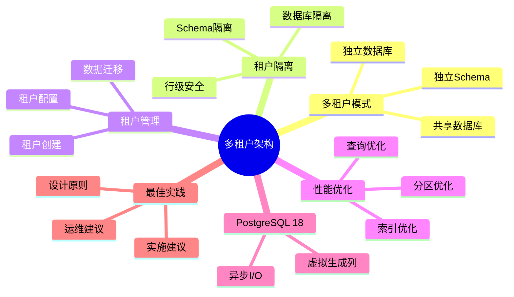

# PostgreSQL 18 多租户架构设计

> **版本**: v1.0
> **最后更新**: 2025-01-15
> **版本覆盖**: PostgreSQL 18.x (推荐) ⭐ | 17.x (推荐) | 16.x (兼容)
> **文档状态**: ✅ 已完成

---

## 📑 目录

- [PostgreSQL 18 多租户架构设计](#postgresql-18-多租户架构设计)
  - [📑 目录](#-目录)
  - [📊 思维导图](#-思维导图)
  - [一、概述](#一概述)
  - [二、知识矩阵对比](#二知识矩阵对比)
    - [2.1 多租户方案对比](#21-多租户方案对比)
    - [2.2 隔离策略对比](#22-隔离策略对比)
  - [三、多租户模式](#三多租户模式)
    - [3.1 共享数据库共享Schema](#31-共享数据库共享schema)
      - [3.1.1 共享数据库共享Schema的原理](#311-共享数据库共享schema的原理)
      - [3.1.2 共享数据库共享Schema实现](#312-共享数据库共享schema实现)
    - [3.2 共享数据库独立Schema](#32-共享数据库独立schema)
      - [3.2.1 共享数据库独立Schema的原理](#321-共享数据库独立schema的原理)
      - [3.2.2 共享数据库独立Schema实现](#322-共享数据库独立schema实现)
    - [3.3 独立数据库](#33-独立数据库)
      - [3.3.1 独立数据库的原理](#331-独立数据库的原理)
      - [3.3.2 独立数据库实现](#332-独立数据库实现)
  - [四、租户隔离](#四租户隔离)
    - [4.1 行级安全（RLS）](#41-行级安全rls)
    - [4.2 Schema隔离](#42-schema隔离)
    - [4.3 数据库隔离](#43-数据库隔离)
  - [五、租户管理](#五租户管理)
    - [5.1 租户创建](#51-租户创建)
    - [5.2 租户配置](#52-租户配置)
    - [5.3 租户数据迁移](#53-租户数据迁移)
  - [六、性能优化](#六性能优化)
    - [6.1 查询优化](#61-查询优化)
    - [6.2 索引优化](#62-索引优化)
    - [6.3 分区优化](#63-分区优化)
  - [七、PostgreSQL 18优化](#七postgresql-18优化)
    - [7.1 虚拟生成列应用](#71-虚拟生成列应用)
    - [7.2 异步I/O优化](#72-异步io优化)
  - [八、最佳实践](#八最佳实践)
    - [8.1 设计原则](#81-设计原则)
    - [8.2 实施建议](#82-实施建议)
    - [8.3 运维建议](#83-运维建议)
  - [九、相关文档](#九相关文档)

---

## 📊 思维导图



---

## 一、概述

本文档从业务视角介绍PostgreSQL 18的多租户架构设计，帮助架构师设计支持多租户的数据库系统。

**核心特点**：

- **多模式支持**：支持多种多租户模式
- **隔离完善**：提供完善的租户隔离
- **性能优化**：针对多租户场景优化
- **PostgreSQL 18**：利用新特性优化

---

## 二、知识矩阵对比

### 2.1 多租户方案对比

| 方案 | 隔离性 | 性能 | 成本 | 复杂度 | 推荐度 |
|-----|--------|------|------|--------|--------|
| **共享数据库共享Schema** | ⭐⭐ | ⭐⭐⭐⭐⭐ | ⭐⭐⭐⭐⭐ | ⭐⭐ | ⭐⭐⭐⭐ |
| **共享数据库独立Schema** | ⭐⭐⭐ | ⭐⭐⭐⭐ | ⭐⭐⭐⭐ | ⭐⭐⭐ | ⭐⭐⭐⭐ |
| **独立数据库** | ⭐⭐⭐⭐⭐ | ⭐⭐⭐ | ⭐⭐ | ⭐⭐⭐⭐ | ⭐⭐⭐ |

### 2.2 隔离策略对比

| 策略 | 隔离性 | 性能影响 | 实施难度 | 推荐度 |
|-----|--------|---------|---------|--------|
| **行级安全（RLS）** | ⭐⭐⭐ | ⭐⭐⭐⭐ | ⭐⭐ | ⭐⭐⭐⭐⭐ |
| **Schema隔离** | ⭐⭐⭐⭐ | ⭐⭐⭐⭐ | ⭐⭐⭐ | ⭐⭐⭐⭐ |
| **数据库隔离** | ⭐⭐⭐⭐⭐ | ⭐⭐⭐ | ⭐⭐⭐⭐ | ⭐⭐⭐ |

---

## 三、多租户模式

### 3.1 共享数据库共享Schema

#### 3.1.1 共享数据库共享Schema的原理

**为什么需要共享数据库共享Schema**：

这是最常见的多租户模式，它提供了：

1. **成本效益**：共享资源，成本低
2. **管理简单**：统一管理，运维简单
3. **扩展性好**：可以支持大量租户
4. **数据隔离**：通过RLS实现数据隔离

**共享数据库共享Schema的优缺点**：

| 优点 | 缺点 |
|-----|------|
| ✅ 成本低 | ❌ 数据隔离依赖RLS |
| ✅ 管理简单 | ❌ 单个租户数据量大时性能影响 |
| ✅ 扩展性好 | ❌ 备份恢复复杂 |
| ✅ 资源利用率高 | ❌ 租户间可能相互影响 |

#### 3.1.2 共享数据库共享Schema实现

**RLS实现**：

```sql
-- 场景：使用RLS实现多租户数据隔离
-- 需求：在共享数据库中隔离不同租户的数据
-- 策略：使用tenant_id + RLS策略

-- 步骤1：所有表添加tenant_id
CREATE TABLE users (
    id SERIAL PRIMARY KEY,
    tenant_id INTEGER NOT NULL,
    username VARCHAR(50) NOT NULL,
    email VARCHAR(100) NOT NULL,
    created_at TIMESTAMP NOT NULL DEFAULT CURRENT_TIMESTAMP,
    UNIQUE(tenant_id, username)  -- 租户内唯一
);

CREATE TABLE orders (
    id SERIAL PRIMARY KEY,
    tenant_id INTEGER NOT NULL,
    user_id INTEGER NOT NULL,
    total_amount DECIMAL(10,2) NOT NULL,
    created_at TIMESTAMP NOT NULL DEFAULT CURRENT_TIMESTAMP,
    FOREIGN KEY (tenant_id, user_id) REFERENCES users(tenant_id, id)
);

-- 步骤2：为tenant_id创建索引（提升RLS性能）
CREATE INDEX idx_users_tenant_id ON users(tenant_id);
CREATE INDEX idx_orders_tenant_id ON orders(tenant_id);

-- 步骤3：启用行级安全
ALTER TABLE users ENABLE ROW LEVEL SECURITY;
ALTER TABLE orders ENABLE ROW LEVEL SECURITY;

-- 步骤4：创建RLS策略
CREATE POLICY tenant_isolation_policy ON users
    FOR ALL
    TO application_user
    USING (tenant_id = current_setting('app.current_tenant', TRUE)::INTEGER)
    WITH CHECK (tenant_id = current_setting('app.current_tenant', TRUE)::INTEGER);

CREATE POLICY tenant_isolation_policy ON orders
    FOR ALL
    TO application_user
    USING (tenant_id = current_setting('app.current_tenant', TRUE)::INTEGER)
    WITH CHECK (tenant_id = current_setting('app.current_tenant', TRUE)::INTEGER);

-- 步骤5：在应用中设置当前租户
SET app.current_tenant = '123';

-- 步骤6：查询数据（自动过滤租户数据）
SELECT * FROM users;  -- 只返回租户123的用户
SELECT * FROM orders;  -- 只返回租户123的订单

-- 性能分析：
-- - RLS过滤开销：<5%（有索引时）
-- - 查询性能：与手动WHERE条件相当
-- - 安全性：自动保证，不会遗漏
```

### 3.2 共享数据库独立Schema

#### 3.2.1 共享数据库独立Schema的原理

**为什么需要共享数据库独立Schema**：

这种模式提供了更好的数据隔离：

1. **数据隔离**：Schema级别的隔离，更安全
2. **管理灵活**：可以为不同租户定制Schema
3. **性能优化**：可以为不同租户优化
4. **迁移方便**：可以方便地迁移租户数据

**共享数据库独立Schema的优缺点**：

| 优点 | 缺点 |
|-----|------|
| ✅ 数据隔离好 | ❌ Schema数量有限（PostgreSQL限制） |
| ✅ 管理灵活 | ❌ 管理复杂度增加 |
| ✅ 性能优化 | ❌ 资源利用率略低 |
| ✅ 迁移方便 | ❌ 跨Schema查询复杂 |

#### 3.2.2 共享数据库独立Schema实现

**Schema隔离**：

```sql
-- 场景：使用Schema实现多租户数据隔离
-- 需求：为每个租户创建独立的Schema
-- 策略：每个租户一个Schema

-- 步骤1：为每个租户创建Schema
CREATE SCHEMA tenant_123;
CREATE SCHEMA tenant_456;

-- 步骤2：在每个Schema中创建表
CREATE TABLE tenant_123.users (
    id SERIAL PRIMARY KEY,
    username VARCHAR(50) NOT NULL,
    email VARCHAR(100) NOT NULL,
    created_at TIMESTAMP NOT NULL DEFAULT CURRENT_TIMESTAMP
);

CREATE TABLE tenant_123.orders (
    id SERIAL PRIMARY KEY,
    user_id INTEGER NOT NULL REFERENCES tenant_123.users(id),
    total_amount DECIMAL(10,2) NOT NULL,
    created_at TIMESTAMP NOT NULL DEFAULT CURRENT_TIMESTAMP
);

CREATE TABLE tenant_456.users (
    id SERIAL PRIMARY KEY,
    username VARCHAR(50) NOT NULL,
    email VARCHAR(100) NOT NULL,
    created_at TIMESTAMP NOT NULL DEFAULT CURRENT_TIMESTAMP
);

CREATE TABLE tenant_456.orders (
    id SERIAL PRIMARY KEY,
    user_id INTEGER NOT NULL REFERENCES tenant_456.users(id),
    total_amount DECIMAL(10,2) NOT NULL,
    created_at TIMESTAMP NOT NULL DEFAULT CURRENT_TIMESTAMP
);

-- 步骤3：在应用中切换Schema
SET search_path TO tenant_123;

-- 步骤4：查询数据（自动使用当前Schema）
SELECT * FROM users;  -- 查询tenant_123.users
SELECT * FROM orders;  -- 查询tenant_123.orders

-- 步骤5：跨Schema查询（需要指定Schema）
SELECT * FROM tenant_123.users;
SELECT * FROM tenant_456.users;

-- 性能分析：
-- - Schema切换开销：极低
-- - 查询性能：与单Schema相当
-- - 数据隔离：完全隔离
```

### 3.3 独立数据库

#### 3.3.1 独立数据库的原理

**为什么需要独立数据库**：

这种模式提供了最强的数据隔离：

1. **完全隔离**：数据库级别的隔离，最安全
2. **独立管理**：可以为每个租户独立管理
3. **性能最优**：不受其他租户影响
4. **灵活扩展**：可以独立扩展每个租户

**独立数据库的优缺点**：

| 优点 | 缺点 |
|-----|------|
| ✅ 完全隔离 | ❌ 成本高 |
| ✅ 独立管理 | ❌ 管理复杂度高 |
| ✅ 性能最优 | ❌ 资源利用率低 |
| ✅ 灵活扩展 | ❌ 连接数限制 |

#### 3.3.2 独立数据库实现

**独立数据库**：

```sql
-- 场景：为每个租户创建独立数据库
-- 需求：最强的数据隔离
-- 策略：每个租户一个数据库

-- 步骤1：为每个租户创建独立数据库
CREATE DATABASE tenant_123;
CREATE DATABASE tenant_456;

-- 步骤2：在每个数据库中创建表结构
-- 连接到tenant_123数据库
\c tenant_123

CREATE TABLE users (
    id SERIAL PRIMARY KEY,
    username VARCHAR(50) NOT NULL,
    email VARCHAR(100) NOT NULL,
    created_at TIMESTAMP NOT NULL DEFAULT CURRENT_TIMESTAMP
);

CREATE TABLE orders (
    id SERIAL PRIMARY KEY,
    user_id INTEGER NOT NULL REFERENCES users(id),
    total_amount DECIMAL(10,2) NOT NULL,
    created_at TIMESTAMP NOT NULL DEFAULT CURRENT_TIMESTAMP
);

-- 连接到tenant_456数据库
\c tenant_456

CREATE TABLE users (
    id SERIAL PRIMARY KEY,
    username VARCHAR(50) NOT NULL,
    email VARCHAR(100) NOT NULL,
    created_at TIMESTAMP NOT NULL DEFAULT CURRENT_TIMESTAMP
);

CREATE TABLE orders (
    id SERIAL PRIMARY KEY,
    user_id INTEGER NOT NULL REFERENCES users(id),
    total_amount DECIMAL(10,2) NOT NULL,
    created_at TIMESTAMP NOT NULL DEFAULT CURRENT_TIMESTAMP
);

-- 步骤3：在应用中连接对应数据库
-- Python示例：
-- conn = psycopg2.connect("dbname=tenant_123 user=postgres")

-- 性能分析：
-- - 数据库连接开销：中等
-- - 查询性能：最优（不受其他租户影响）
-- - 数据隔离：完全隔离
-- - 资源消耗：高（每个租户一个数据库）
```

---

## 四、租户隔离

### 4.1 行级安全（RLS）

**RLS策略设计**：

```sql
-- 通用RLS策略函数
CREATE OR REPLACE FUNCTION get_current_tenant()
RETURNS INTEGER AS $$
BEGIN
    RETURN current_setting('app.current_tenant', TRUE)::INTEGER;
END;
$$ LANGUAGE plpgsql STABLE;

-- 应用RLS策略
CREATE POLICY tenant_isolation ON users
    FOR ALL
    USING (tenant_id = get_current_tenant());
```

### 4.2 Schema隔离

**Schema管理**：

```sql
-- 租户Schema管理表
CREATE TABLE tenant_schemas (
    tenant_id INTEGER PRIMARY KEY,
    schema_name VARCHAR(63) NOT NULL UNIQUE,
    created_at TIMESTAMP DEFAULT CURRENT_TIMESTAMP
);

-- 创建租户Schema
CREATE OR REPLACE FUNCTION create_tenant_schema(p_tenant_id INTEGER)
RETURNS VOID AS $$
DECLARE
    v_schema_name VARCHAR(63);
BEGIN
    v_schema_name := 'tenant_' || p_tenant_id;
    EXECUTE format('CREATE SCHEMA IF NOT EXISTS %I', v_schema_name);

    INSERT INTO tenant_schemas (tenant_id, schema_name)
    VALUES (p_tenant_id, v_schema_name);
END;
$$ LANGUAGE plpgsql;
```

### 4.3 数据库隔离

**数据库管理**：

```sql
-- 租户数据库管理
CREATE DATABASE tenant_123 WITH OWNER = postgres;
CREATE DATABASE tenant_456 WITH OWNER = postgres;
```

---

## 五、租户管理

### 5.1 租户创建

**租户创建流程**：

```sql
-- 租户表
CREATE TABLE tenants (
    id SERIAL PRIMARY KEY,
    name VARCHAR(100) NOT NULL,
    subdomain VARCHAR(100) UNIQUE NOT NULL,
    status VARCHAR(20) NOT NULL DEFAULT 'active',
    created_at TIMESTAMP DEFAULT CURRENT_TIMESTAMP
);

-- 创建租户函数
CREATE OR REPLACE FUNCTION create_tenant(
    p_name VARCHAR,
    p_subdomain VARCHAR
) RETURNS INTEGER AS $$
DECLARE
    v_tenant_id INTEGER;
BEGIN
    -- 创建租户记录
    INSERT INTO tenants (name, subdomain)
    VALUES (p_name, p_subdomain)
    RETURNING id INTO v_tenant_id;

    -- 创建租户Schema
    PERFORM create_tenant_schema(v_tenant_id);

    RETURN v_tenant_id;
END;
$$ LANGUAGE plpgsql;
```

### 5.2 租户配置

**租户配置表**：

```sql
-- 租户配置表
CREATE TABLE tenant_configurations (
    tenant_id INTEGER PRIMARY KEY REFERENCES tenants(id),
    config JSONB NOT NULL DEFAULT '{}'::JSONB,
    updated_at TIMESTAMP DEFAULT CURRENT_TIMESTAMP
);
```

### 5.3 租户数据迁移

**数据迁移**：

```sql
-- 租户数据迁移函数
CREATE OR REPLACE FUNCTION migrate_tenant_data(
    p_from_tenant_id INTEGER,
    p_to_tenant_id INTEGER
) RETURNS VOID AS $$
BEGIN
    -- 迁移数据逻辑
    INSERT INTO users (tenant_id, username, email)
    SELECT p_to_tenant_id, username, email
    FROM users
    WHERE tenant_id = p_from_tenant_id;
END;
$$ LANGUAGE plpgsql;
```

---

## 六、性能优化

### 6.1 查询优化

**查询优化**：

```sql
-- 确保tenant_id上有索引
CREATE INDEX idx_users_tenant_id ON users(tenant_id);
CREATE INDEX idx_orders_tenant_id ON orders(tenant_id);

-- 复合索引
CREATE INDEX idx_users_tenant_username ON users(tenant_id, username);
```

### 6.2 索引优化

**索引策略**：

- tenant_id作为索引前缀
- 复合索引包含tenant_id
- 分区表按tenant_id分区

### 6.3 分区优化

**按租户分区**：

```sql
-- 按租户分区
CREATE TABLE orders (
    id SERIAL,
    tenant_id INTEGER NOT NULL,
    user_id INTEGER NOT NULL,
    amount DECIMAL(10,2) NOT NULL,
    created_at TIMESTAMP DEFAULT CURRENT_TIMESTAMP
) PARTITION BY HASH (tenant_id);

-- 创建分区
CREATE TABLE orders_tenant_0 PARTITION OF orders
    FOR VALUES WITH (MODULUS 4, REMAINDER 0);
```

---

## 七、PostgreSQL 18优化

### 7.1 虚拟生成列应用

**租户相关计算列**：

```sql
-- 使用虚拟生成列
CREATE TABLE orders (
    id SERIAL PRIMARY KEY,
    tenant_id INTEGER NOT NULL,
    subtotal DECIMAL(10,2) NOT NULL,
    tax_rate DECIMAL(5,2) NOT NULL,
    total_amount DECIMAL(10,2) GENERATED ALWAYS AS (
        subtotal * (1 + tax_rate / 100)
    ) STORED
);
```

### 7.2 异步I/O优化

**多租户I/O优化**：

- 异步I/O提升并发性能
- 减少租户间I/O竞争

---

## 八、最佳实践

### 8.1 设计原则

**设计原则**：

- 租户隔离
- 数据安全
- 性能优化
- 易于管理

### 8.2 实施建议

**实施建议**：

- 选择合适的隔离模式
- 完善RLS策略
- 优化查询性能
- 监控租户资源

### 8.3 运维建议

**运维建议**：

- 租户资源监控
- 租户数据备份
- 租户迁移流程
- 租户清理策略

---

## 九、相关文档

- [业务建模方法论](./04.01-业务建模方法论.md)
- [领域驱动设计](./04.02-领域驱动设计.md)
- [业务流程建模](./04.03-业务流程建模.md)
- [系统架构设计](../05-架构视角/05.01-系统架构设计.md)

---

**最后更新**: 2025-01-15
**维护者**: PostgreSQL Documentation Team
