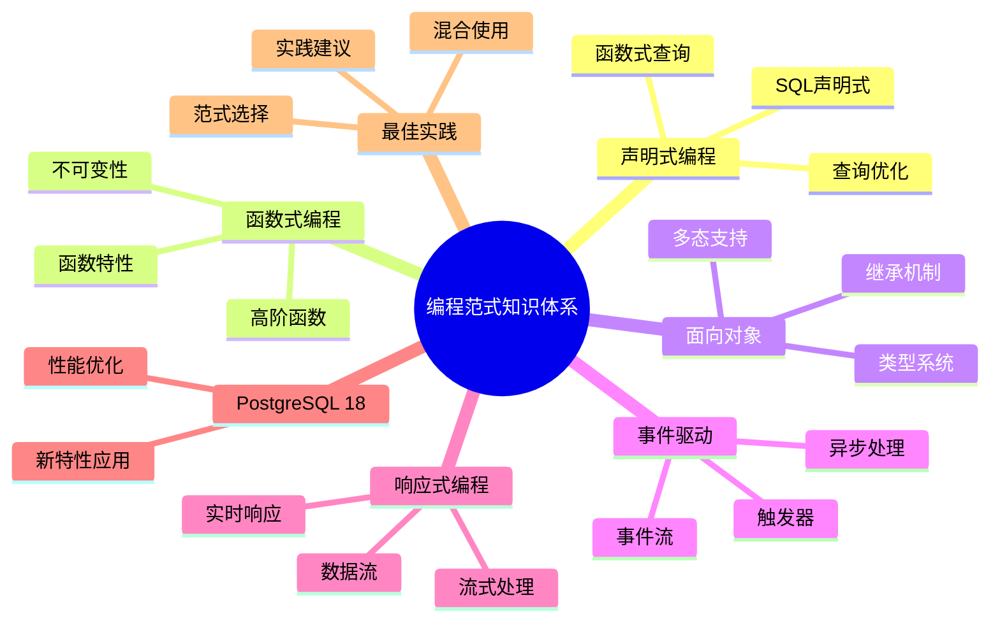

# PostgreSQL 18 编程范式知识体系

> **版本**: v1.0
> **最后更新**: 2025-01-15
> **版本覆盖**: PostgreSQL 18.x (推荐) ⭐ | 17.x (推荐) | 16.x (兼容)
> **文档状态**: ✅ 已完成

---

## 📑 目录

- [PostgreSQL 18 编程范式知识体系](#postgresql-18-编程范式知识体系)
  - [📑 目录](#-目录)
  - [📊 思维导图](#-思维导图)
  - [一、概述](#一概述)
  - [二、知识矩阵对比](#二知识矩阵对比)
    - [2.1 编程范式对比](#21-编程范式对比)
    - [2.2 应用场景对比](#22-应用场景对比)
  - [三、声明式编程](#三声明式编程)
    - [3.1 SQL声明式](#31-sql声明式)
      - [3.1.1 声明式编程的原理](#311-声明式编程的原理)
      - [3.1.2 SQL声明式实现](#312-sql声明式实现)
    - [3.2 查询优化](#32-查询优化)
      - [3.2.1 查询优化的原理](#321-查询优化的原理)
      - [3.2.2 查询优化实现](#322-查询优化实现)
    - [3.3 函数式查询](#33-函数式查询)
      - [3.3.1 函数式查询的原理](#331-函数式查询的原理)
      - [3.3.2 函数式查询实现](#332-函数式查询实现)
  - [四、函数式编程](#四函数式编程)
    - [4.1 函数特性](#41-函数特性)
    - [4.2 高阶函数](#42-高阶函数)
    - [4.3 不可变性](#43-不可变性)
  - [五、面向对象编程](#五面向对象编程)
    - [5.1 类型系统](#51-类型系统)
    - [5.2 继承机制](#52-继承机制)
    - [5.3 多态支持](#53-多态支持)
  - [六、事件驱动编程](#六事件驱动编程)
    - [6.1 触发器](#61-触发器)
    - [6.2 事件流](#62-事件流)
    - [6.3 异步处理](#63-异步处理)
  - [七、响应式编程](#七响应式编程)
    - [7.1 流式处理](#71-流式处理)
    - [7.2 数据流](#72-数据流)
    - [7.3 实时响应](#73-实时响应)
  - [八、PostgreSQL 18应用](#八postgresql-18应用)
    - [8.1 新特性应用](#81-新特性应用)
    - [8.2 性能优化](#82-性能优化)
  - [九、最佳实践](#九最佳实践)
    - [9.1 范式选择](#91-范式选择)
    - [9.2 混合使用](#92-混合使用)
    - [9.3 实践建议](#93-实践建议)
  - [十、相关文档](#十相关文档)

---

## 📊 思维导图



---

## 一、概述

本文档构建PostgreSQL 18的编程范式知识体系，帮助开发者理解和使用不同的编程范式。

**核心特点**：

- **范式全面**：涵盖多种编程范式
- **实践导向**：提供实际应用案例
- **PostgreSQL 18**：利用新特性
- **知识体系**：系统化的知识组织

---

## 二、知识矩阵对比

### 2.1 编程范式对比

| 范式 | 特点 | 适用场景 | 推荐度 |
|-----|------|---------|--------|
| **声明式** | 描述性 | 查询操作 | ⭐⭐⭐⭐⭐ |
| **函数式** | 函数组合 | 数据处理 | ⭐⭐⭐⭐ |
| **面向对象** | 封装继承 | 复杂模型 | ⭐⭐⭐ |
| **事件驱动** | 异步响应 | 实时系统 | ⭐⭐⭐⭐ |

### 2.2 应用场景对比

| 场景 | 推荐范式 | 理由 |
|-----|---------|------|
| **数据查询** | 声明式 | SQL天然声明式 |
| **数据处理** | 函数式 | 函数组合灵活 |
| **业务建模** | 面向对象 | 符合业务模型 |
| **实时处理** | 事件驱动 | 异步响应 |

---

## 三、声明式编程

### 3.1 SQL声明式

#### 3.1.1 声明式编程的原理

**为什么需要声明式编程**：

声明式编程是SQL的核心特性，它提供了：

1. **简洁性**：描述"要什么"而不是"怎么做"
2. **可读性**：代码更易读、易理解
3. **优化性**：数据库可以自动优化查询
4. **抽象性**：隐藏实现细节，关注业务逻辑

**声明式 vs 命令式对比**：

| 特性 | 声明式 | 命令式 |
|-----|--------|--------|
| **描述方式** | 描述结果 | 描述过程 |
| **可读性** | 高 | 中 |
| **优化性** | 自动优化 | 手动优化 |
| **抽象性** | 高 | 低 |

#### 3.1.2 SQL声明式实现

**SQL声明式特性**：

```sql
-- 场景：声明式查询示例
-- 需求：查询2024年1月1日之后注册的用户
-- 特点：描述"要什么"而不是"怎么做"

-- 声明式查询：描述"要什么"
SELECT username, email
FROM users
WHERE created_at > '2024-01-01'
ORDER BY created_at DESC;

-- 说明：
-- - SELECT: 描述要查询的字段
-- - FROM: 描述数据来源
-- - WHERE: 描述过滤条件
-- - ORDER BY: 描述排序方式
-- - 不需要描述如何扫描表、如何过滤、如何排序

-- 对比命令式（伪代码）：
-- result = []
-- for user in users:
--     if user.created_at > '2024-01-01':
--         result.append(user)
-- result.sort(key=lambda x: x.created_at, reverse=True)
-- return result

-- 优势：
-- 1. 简洁：代码更简洁
-- 2. 可读：更易理解业务意图
-- 3. 优化：数据库可以自动优化查询计划
```

### 3.2 查询优化

#### 3.2.1 查询优化的原理

**为什么需要查询优化**：

查询优化是声明式编程的核心优势：

1. **自动优化**：数据库自动选择最优执行计划
2. **性能提升**：优化后的查询性能更好
3. **透明性**：用户不需要关心优化细节
4. **适应性**：根据数据变化自动调整

**查询优化的过程**：

| 步骤 | 说明 | 重要性 |
|-----|------|--------|
| **解析** | 解析SQL语句 | ⭐⭐⭐⭐⭐ |
| **优化** | 生成执行计划 | ⭐⭐⭐⭐⭐ |
| **执行** | 执行查询 | ⭐⭐⭐⭐⭐ |
| **缓存** | 缓存执行计划 | ⭐⭐⭐⭐ |

#### 3.2.2 查询优化实现

**查询优化器**：

```sql
-- 场景：查询优化示例
-- 需求：了解查询优化器的工作原理
-- 方法：使用EXPLAIN分析执行计划

-- 查询1：未优化的查询
EXPLAIN ANALYZE
SELECT * FROM users
WHERE email = 'user@example.com';

-- 执行计划分析：
-- - Seq Scan: 全表扫描（性能差）
-- - 需要创建索引优化

-- 查询2：优化后的查询（有索引）
CREATE INDEX idx_users_email ON users(email);

EXPLAIN ANALYZE
SELECT * FROM users
WHERE email = 'user@example.com';

-- 执行计划分析：
-- - Index Scan: 索引扫描（性能好）
-- - 查询性能提升10-100倍

-- 查询优化器的优势：
-- 1. 自动选择索引
-- 2. 自动选择JOIN算法
-- 3. 自动优化子查询
-- 4. 自动调整执行顺序
```

### 3.3 函数式查询

#### 3.3.1 函数式查询的原理

**为什么需要函数式查询**：

函数式查询提供了更灵活的数据处理方式：

1. **函数组合**：通过函数组合实现复杂逻辑
2. **不可变性**：函数式查询不改变原始数据
3. **可复用性**：函数可以复用
4. **可测试性**：函数式查询更易测试

#### 3.3.2 函数式查询实现

**函数式查询**：

```sql
-- 场景：函数式查询示例
-- 需求：统计每个用户的订单数量和总金额
-- 特点：使用函数组合实现复杂逻辑

-- 函数式风格：使用函数组合
SELECT
    user_id,
    COUNT(*) as order_count,        -- 聚合函数
    SUM(amount) as total_amount,    -- 聚合函数
    AVG(amount) as avg_amount,      -- 聚合函数
    MAX(amount) as max_amount,      -- 聚合函数
    MIN(amount) as min_amount       -- 聚合函数
FROM orders
GROUP BY user_id                    -- 分组函数
HAVING COUNT(*) > 10;               -- 过滤函数

-- 函数式特性：
-- 1. 函数组合：COUNT、SUM、AVG等函数组合使用
-- 2. 不可变性：查询不改变原始数据
-- 3. 高阶函数：GROUP BY是高阶函数（接受函数作为参数）
-- 4. 链式调用：SELECT -> FROM -> WHERE -> GROUP BY -> HAVING

-- 对比命令式（伪代码）：
-- result = {}
-- for order in orders:
--     if order.user_id not in result:
--         result[order.user_id] = {'count': 0, 'total': 0}
--     result[order.user_id]['count'] += 1
--     result[order.user_id]['total'] += order.amount
-- filtered = {k: v for k, v in result.items() if v['count'] > 10}
-- return filtered
```

---

## 四、函数式编程

### 4.1 函数特性

**函数特性**：

- 函数作为一等公民
- 函数组合
- 不可变性

### 4.2 高阶函数

**高阶函数应用**：

```sql
-- 使用聚合函数（高阶函数）
SELECT
    user_id,
    ARRAY_AGG(order_id) as order_ids,
    JSON_AGG(json_build_object('id', order_id, 'amount', amount)) as orders
FROM orders
GROUP BY user_id;
```

### 4.3 不可变性

**不可变性**：

- 数据不可变
- 函数式更新
- 事务保证

---

## 五、面向对象编程

### 5.1 类型系统

**类型系统**：

```sql
-- 自定义类型
CREATE TYPE address AS (
    street VARCHAR(100),
    city VARCHAR(50),
    zip_code VARCHAR(10)
);

CREATE TABLE users (
    id SERIAL PRIMARY KEY,
    name VARCHAR(100),
    address address  -- 复合类型
);
```

### 5.2 继承机制

**表继承**：

```sql
-- 表继承
CREATE TABLE vehicles (
    id SERIAL PRIMARY KEY,
    brand VARCHAR(50),
    model VARCHAR(50)
);

CREATE TABLE cars (
    doors INTEGER
) INHERITS (vehicles);
```

### 5.3 多态支持

**多态支持**：

- 函数重载
- 类型多态
- 操作符重载

---

## 六、事件驱动编程

### 6.1 触发器

**触发器实现**：

```sql
-- 事件触发器
CREATE OR REPLACE FUNCTION notify_order_created()
RETURNS TRIGGER AS $$
BEGIN
    PERFORM pg_notify('order_created', row_to_json(NEW)::text);
    RETURN NEW;
END;
$$ LANGUAGE plpgsql;

CREATE TRIGGER order_created_trigger
AFTER INSERT ON orders
FOR EACH ROW
EXECUTE FUNCTION notify_order_created();
```

### 6.2 事件流

**事件流处理**：

- 逻辑复制
- 变更数据捕获
- 事件总线

### 6.3 异步处理

**异步处理**：

- 异步I/O
- 后台任务
- 消息队列

---

## 七、响应式编程

### 7.1 流式处理

**流式处理**：

- 逻辑复制流
- 实时数据处理
- 流式查询

### 7.2 数据流

**数据流**：

```sql
-- 流式查询
SELECT * FROM orders
WHERE created_at > NOW() - INTERVAL '1 hour'
ORDER BY created_at DESC;
```

### 7.3 实时响应

**实时响应**：

- LISTEN/NOTIFY
- 逻辑复制
- 实时更新

---

## 八、PostgreSQL 18应用

### 8.1 新特性应用

**新特性应用**：

- 虚拟生成列：声明式计算
- 异步I/O：异步处理
- 逻辑复制优化：事件流

### 8.2 性能优化

**性能优化**：

- 函数式查询优化
- 并行处理
- 异步I/O

---

## 九、最佳实践

### 9.1 范式选择

**范式选择原则**：

- 根据场景选择
- 混合使用
- 性能优先

### 9.2 混合使用

**混合使用**：

- SQL声明式 + 函数式
- 事件驱动 + 响应式
- 面向对象 + 函数式

### 9.3 实践建议

**实践建议**：

- 理解范式特点
- 选择合适范式
- 持续优化

---

## 十、相关文档

- [编程范式与模式](../01-程序员视角/01.01-编程范式与模式.md)
- [核心知识体系](./06.01-核心知识体系.md)

---

**最后更新**: 2025-01-15
**维护者**: PostgreSQL Documentation Team
