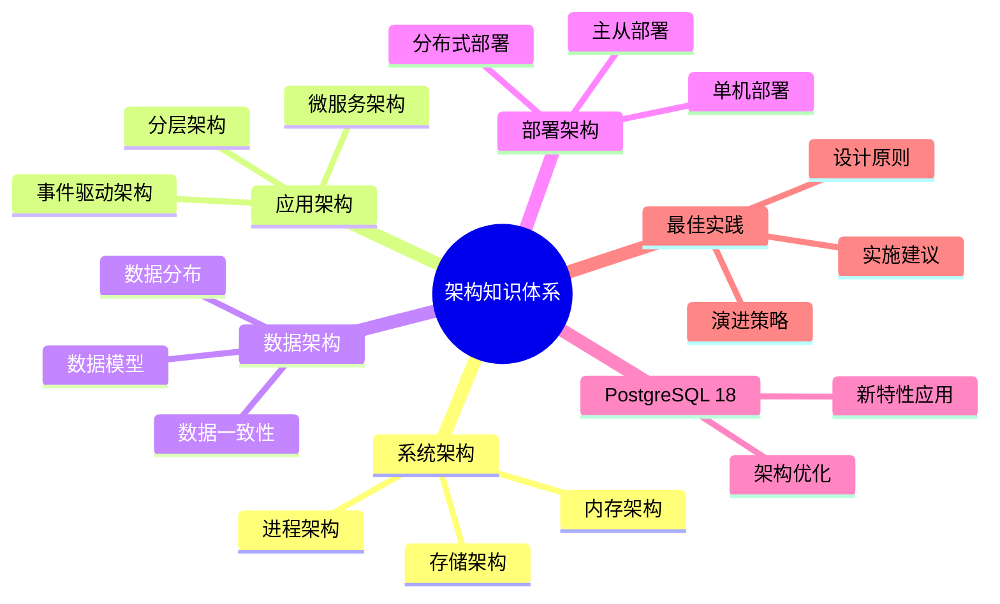

# PostgreSQL 18 架构知识体系

> **版本**: v1.0
> **最后更新**: 2025-01-15
> **版本覆盖**: PostgreSQL 18.x (推荐) ⭐ | 17.x (推荐) | 16.x (兼容)
> **文档状态**: ✅ 已完成

---

## 📑 目录

- [PostgreSQL 18 架构知识体系](#postgresql-18-架构知识体系)
  - [📑 目录](#-目录)
  - [📊 思维导图](#-思维导图)
  - [一、概述](#一概述)
  - [二、知识矩阵对比](#二知识矩阵对比)
    - [2.1 架构模式对比](#21-架构模式对比)
    - [2.2 架构层次对比](#22-架构层次对比)
  - [三、系统架构](#三系统架构)
    - [3.1 进程架构](#31-进程架构)
      - [3.1.1 进程架构的原理](#311-进程架构的原理)
      - [3.1.2 进程架构实现](#312-进程架构实现)
    - [3.2 内存架构](#32-内存架构)
      - [3.2.1 内存架构的原理](#321-内存架构的原理)
      - [3.2.2 内存架构实现](#322-内存架构实现)
    - [3.3 存储架构](#33-存储架构)
      - [3.3.1 存储架构的原理](#331-存储架构的原理)
      - [3.3.2 存储架构实现](#332-存储架构实现)
  - [四、应用架构](#四应用架构)
    - [4.1 分层架构](#41-分层架构)
    - [4.2 微服务架构](#42-微服务架构)
    - [4.3 事件驱动架构](#43-事件驱动架构)
  - [五、数据架构](#五数据架构)
    - [5.1 数据模型](#51-数据模型)
    - [5.2 数据分布](#52-数据分布)
    - [5.3 数据一致性](#53-数据一致性)
  - [六、部署架构](#六部署架构)
    - [6.1 单机部署](#61-单机部署)
    - [6.2 主从部署](#62-主从部署)
    - [6.3 分布式部署](#63-分布式部署)
  - [七、PostgreSQL 18应用](#七postgresql-18应用)
    - [7.1 新特性应用](#71-新特性应用)
    - [7.2 架构优化](#72-架构优化)
  - [八、最佳实践](#八最佳实践)
    - [8.1 设计原则](#81-设计原则)
    - [8.2 实施建议](#82-实施建议)
    - [8.3 演进策略](#83-演进策略)
  - [九、相关文档](#九相关文档)

---

## 📊 思维导图



---

## 一、概述

本文档构建PostgreSQL 18的架构知识体系，帮助架构师系统掌握架构设计方法。

**核心特点**：

- **架构全面**：覆盖系统、应用、数据、部署架构
- **模式多样**：多种架构模式
- **PostgreSQL 18**：利用新特性
- **知识体系**：系统化的知识组织

---

## 二、知识矩阵对比

### 2.1 架构模式对比

| 模式 | 特点 | 适用场景 | 复杂度 | 推荐度 |
|-----|------|---------|--------|--------|
| **分层架构** | 简单清晰 | 传统应用 | ⭐⭐ | ⭐⭐⭐⭐ |
| **微服务架构** | 灵活可扩展 | 大型系统 | ⭐⭐⭐⭐ | ⭐⭐⭐⭐⭐ |
| **事件驱动** | 解耦异步 | 复杂系统 | ⭐⭐⭐⭐ | ⭐⭐⭐⭐ |

### 2.2 架构层次对比

| 层次 | 职责 | 技术栈 | 推荐度 |
|-----|------|--------|--------|
| **表现层** | 用户交互 | Web/Mobile | ⭐⭐⭐⭐⭐ |
| **业务层** | 业务逻辑 | Application | ⭐⭐⭐⭐⭐ |
| **数据层** | 数据存储 | PostgreSQL | ⭐⭐⭐⭐⭐ |

---

## 三、系统架构

### 3.1 进程架构

#### 3.1.1 进程架构的原理

**为什么需要了解进程架构**：

进程架构是PostgreSQL系统的基础，它提供了：

1. **并发处理**：多进程架构支持并发
2. **资源隔离**：每个连接独立进程
3. **稳定性**：进程崩溃不影响其他进程
4. **扩展性**：可以扩展到多核系统

**PostgreSQL进程架构**：

| 进程类型 | 说明 | 数量 | 作用 |
|---------|------|------|------|
| **主进程** | postmaster | 1 | 管理所有进程 |
| **后台进程** | 系统进程 | 多个 | 系统维护 |
| **工作进程** | 连接进程 | 多个 | 处理客户端连接 |

#### 3.1.2 进程架构实现

**进程架构说明**：

```text
PostgreSQL进程架构：

主进程（postmaster）
  ├── 后台进程
  │   ├── WAL Writer（WAL写入）
  │   ├── Checkpointer（检查点）
  │   ├── Background Writer（后台写入）
  │   ├── Autovacuum Launcher（自动清理启动器）
  │   ├── Autovacuum Worker（自动清理工作进程）
  │   ├── Stats Collector（统计收集器）
  │   └── Logger（日志进程）
  └── 工作进程（每个连接一个）
      ├── 客户端连接1 -> 工作进程1
      ├── 客户端连接2 -> 工作进程2
      └── ...

进程管理：
- 主进程负责创建和管理所有进程
- 工作进程处理客户端请求
- 后台进程执行系统维护任务
- 进程间通过共享内存通信
```

### 3.2 内存架构

#### 3.2.1 内存架构的原理

**为什么需要了解内存架构**：

内存架构直接影响系统性能：

1. **缓存机制**：共享内存缓存数据
2. **性能优化**：合理配置内存提升性能
3. **资源管理**：合理分配内存资源
4. **调优依据**：为性能调优提供依据

**PostgreSQL内存架构**：

| 内存类型 | 说明 | 配置参数 | 用途 |
|---------|------|---------|------|
| **共享内存** | 所有进程共享 | shared_buffers | 数据缓存 |
| **本地内存** | 每个进程独立 | work_mem | 排序、哈希 |
| **工作内存** | 维护操作 | maintenance_work_mem | VACUUM、索引 |

#### 3.2.2 内存架构实现

**内存架构说明**：

```text
PostgreSQL内存架构：

共享内存（shared_buffers）
  ├── 数据页缓存
  ├── WAL缓冲区
  └── 锁表

本地内存（每个进程）
  ├── work_mem（排序、哈希）
  ├── temp_buffers（临时表）
  └── 查询执行内存

工作内存（维护操作）
  └── maintenance_work_mem（VACUUM、索引）

内存配置原则：
- shared_buffers: 系统内存的25%
- work_mem: 根据并发数计算
- maintenance_work_mem: 系统内存的10-20%
- effective_cache_size: 系统内存的50-75%
```

### 3.3 存储架构

#### 3.3.1 存储架构的原理

**为什么需要了解存储架构**：

存储架构影响数据存储和性能：

1. **数据组织**：了解数据如何存储
2. **性能优化**：优化存储提升性能
3. **备份恢复**：了解存储结构便于备份
4. **故障诊断**：了解存储结构便于诊断

**PostgreSQL存储架构**：

| 存储类型 | 说明 | 位置 | 用途 |
|---------|------|------|------|
| **数据文件** | 表数据 | $PGDATA/base | 存储表数据 |
| **WAL文件** | 事务日志 | $PGDATA/pg_wal | 事务日志 |
| **索引文件** | 索引数据 | $PGDATA/base | 存储索引 |

#### 3.3.2 存储架构实现

**存储架构说明**：

```text
PostgreSQL存储架构：

$PGDATA/
  ├── base/（数据库目录）
  │   ├── 数据库OID/
  │   │   ├── 表文件（OID）
  │   │   ├── 索引文件（OID）
  │   │   └── ...
  ├── pg_wal/（WAL文件）
  │   ├── 000000010000000000000001
  │   └── ...
  ├── pg_tblspc/（表空间）
  └── ...

存储特点：
- 数据文件：按表组织，支持TOAST
- WAL文件：循环使用，支持归档
- 索引文件：独立文件，支持多种索引类型
- 表空间：可以跨文件系统
```

---

## 四、应用架构

### 4.1 分层架构

**分层架构**：

- 表现层
- 业务层
- 数据层

### 4.2 微服务架构

**微服务架构**：

- 服务拆分
- 服务通信
- 数据管理

### 4.3 事件驱动架构

**事件驱动架构**：

- 事件总线
- 事件流
- 事件处理

---

## 五、数据架构

### 5.1 数据模型

**数据模型**：

- 关系模型
- 维度模型
- 文档模型

### 5.2 数据分布

**数据分布**：

- 分片策略
- 数据路由
- 数据平衡

### 5.3 数据一致性

**数据一致性**：

- 强一致性
- 最终一致性
- 一致性协议

---

## 六、部署架构

### 6.1 单机部署

**单机部署**：

- 单实例
- 参数优化
- 性能调优

### 6.2 主从部署

**主从部署**：

- 流式复制
- 读写分离
- 高可用

### 6.3 分布式部署

**分布式部署**：

- Citus
- 分片
- 分布式事务

---

## 七、PostgreSQL 18应用

### 7.1 新特性应用

**新特性应用**：

- 逻辑复制优化：分布式架构
- 异步I/O：性能优化
- 增量备份：部署优化

### 7.2 架构优化

**架构优化**：

- 性能优化
- 可扩展性
- 高可用性

---

## 八、最佳实践

### 8.1 设计原则

**设计原则**：

- 单一职责
- 开闭原则
- 依赖倒置

### 8.2 实施建议

**实施建议**：

- 渐进式演进
- 持续重构
- 监控评估

### 8.3 演进策略

**演进策略**：

- 从简单开始
- 逐步演进
- 持续优化

---

## 九、相关文档

- [系统架构设计](../05-架构视角/05.01-系统架构设计.md)
- [分布式架构设计](../05-架构视角/05.02-分布式架构设计.md)
- [高可用架构设计](../05-架构视角/05.03-高可用架构设计.md)

---

**最后更新**: 2025-01-15
**维护者**: PostgreSQL Documentation Team
