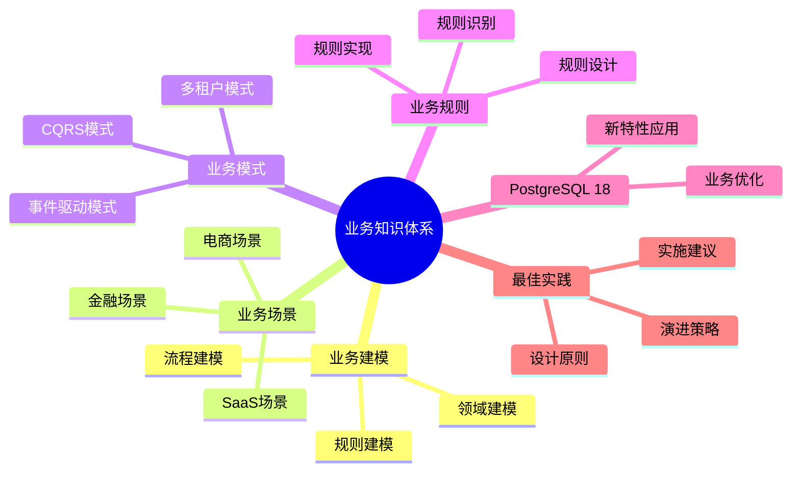

# PostgreSQL 18 业务知识体系

> **版本**: v1.0
> **最后更新**: 2025-01-15
> **版本覆盖**: PostgreSQL 18.x (推荐) ⭐ | 17.x (推荐) | 16.x (兼容)
> **文档状态**: ✅ 已完成

---

## 📑 目录

- [PostgreSQL 18 业务知识体系](#postgresql-18-业务知识体系)
  - [📑 目录](#-目录)
  - [📊 思维导图](#-思维导图)
  - [一、概述](#一概述)
  - [二、知识矩阵对比](#二知识矩阵对比)
    - [2.1 业务建模方法对比](#21-业务建模方法对比)
    - [2.2 业务场景对比](#22-业务场景对比)
  - [三、业务建模](#三业务建模)
    - [3.1 领域建模](#31-领域建模)
      - [3.1.1 领域建模的原理](#311-领域建模的原理)
      - [3.1.2 领域建模实现](#312-领域建模实现)
    - [3.2 流程建模](#32-流程建模)
      - [3.2.1 流程建模的原理](#321-流程建模的原理)
      - [3.2.2 流程建模实现](#322-流程建模实现)
    - [3.3 规则建模](#33-规则建模)
      - [3.3.1 规则建模的原理](#331-规则建模的原理)
      - [3.3.2 规则建模实现](#332-规则建模实现)
  - [四、业务场景](#四业务场景)
    - [4.1 电商场景](#41-电商场景)
    - [4.2 金融场景](#42-金融场景)
    - [4.3 SaaS场景](#43-saas场景)
  - [五、业务模式](#五业务模式)
    - [5.1 多租户模式](#51-多租户模式)
    - [5.2 事件驱动模式](#52-事件驱动模式)
    - [5.3 CQRS模式](#53-cqrs模式)
  - [六、业务规则](#六业务规则)
    - [6.1 规则识别](#61-规则识别)
    - [6.2 规则设计](#62-规则设计)
    - [6.3 规则实现](#63-规则实现)
  - [七、PostgreSQL 18应用](#七postgresql-18应用)
    - [7.1 新特性应用](#71-新特性应用)
    - [7.2 业务优化](#72-业务优化)
  - [八、最佳实践](#八最佳实践)
    - [8.1 设计原则](#81-设计原则)
    - [8.2 实施建议](#82-实施建议)
    - [8.3 演进策略](#83-演进策略)
  - [九、相关文档](#九相关文档)

---

## 📊 思维导图



---

## 一、概述

本文档构建PostgreSQL 18的业务知识体系，帮助业务分析师系统掌握业务建模方法。

**核心特点**：

- **业务导向**：以业务需求为中心
- **方法系统**：完整的业务建模方法
- **PostgreSQL 18**：利用新特性
- **知识体系**：系统化的知识组织

---

## 二、知识矩阵对比

### 2.1 业务建模方法对比

| 方法 | 特点 | 适用场景 | 推荐度 |
|-----|------|---------|--------|
| **ER建模** | 简单直观 | 传统业务 | ⭐⭐⭐⭐ |
| **DDD** | 领域驱动 | 复杂业务 | ⭐⭐⭐⭐⭐ |
| **事件建模** | 事件驱动 | 现代应用 | ⭐⭐⭐⭐ |

### 2.2 业务场景对比

| 场景 | 特点 | 技术重点 | 推荐度 |
|-----|------|---------|--------|
| **电商** | 高并发 | 性能、一致性 | ⭐⭐⭐⭐⭐ |
| **金融** | 高安全 | 安全、ACID | ⭐⭐⭐⭐⭐ |
| **SaaS** | 多租户 | 隔离、扩展 | ⭐⭐⭐⭐⭐ |

---

## 三、业务建模

### 3.1 领域建模

#### 3.1.1 领域建模的原理

**为什么需要领域建模**：

领域建模是业务建模的基础，它提供了：

1. **业务理解**：深入理解业务领域
2. **实体识别**：识别业务实体
3. **关系建模**：建立实体之间的关系
4. **系统设计**：为系统设计提供依据

**领域建模的方法**：

| 方法 | 说明 | 适用场景 | 推荐度 |
|-----|------|---------|--------|
| **ER建模** | 实体关系建模 | 传统业务 | ⭐⭐⭐⭐ |
| **DDD** | 领域驱动设计 | 复杂业务 | ⭐⭐⭐⭐⭐ |
| **UML** | 统一建模语言 | 系统设计 | ⭐⭐⭐⭐ |

#### 3.1.2 领域建模实现

**领域建模示例**：

```text
电商领域建模：

领域：电商
  ├── 子领域：用户管理
  │   ├── 实体：用户（User）
  │   ├── 实体：地址（Address）
  │   └── 关系：用户-地址（1对多）
  ├── 子领域：商品管理
  │   ├── 实体：商品（Product）
  │   ├── 实体：分类（Category）
  │   └── 关系：商品-分类（多对1）
  └── 子领域：订单管理
      ├── 实体：订单（Order）
      ├── 实体：订单项（OrderItem）
      └── 关系：订单-订单项（1对多）

领域建模步骤：
1. 识别领域和子领域
2. 识别实体和值对象
3. 建立实体关系
4. 定义聚合边界
```

### 3.2 流程建模

#### 3.2.1 流程建模的原理

**为什么需要流程建模**：

流程建模帮助理解业务流程：

1. **流程理解**：理解业务流程的每个步骤
2. **流程优化**：识别流程中的问题和改进点
3. **系统设计**：为系统设计提供流程依据
4. **自动化**：支持流程自动化

**流程建模的方法**：

| 方法 | 说明 | 适用场景 | 推荐度 |
|-----|------|---------|--------|
| **状态机** | 状态转换模型 | 简单流程 | ⭐⭐⭐⭐ |
| **BPMN** | 业务流程建模 | 复杂流程 | ⭐⭐⭐⭐ |
| **工作流** | 工作流引擎 | 自动化流程 | ⭐⭐⭐⭐ |

#### 3.2.2 流程建模实现

**流程建模示例**：

```text
订单流程建模：

订单流程：
  开始
    ↓
  创建订单（pending）
    ↓
  支付订单（paid）
    ↓
  发货（shipped）
    ↓
  确认收货（delivered）
    ↓
  完成订单（completed）
    ↓
  结束

异常流程：
  - 取消订单（cancelled）：在pending或paid状态可以取消
  - 退款流程：在paid或shipped状态可以申请退款

流程建模步骤：
1. 识别业务流程
2. 识别流程步骤
3. 识别流程状态
4. 定义状态转换规则
```

### 3.3 规则建模

#### 3.3.1 规则建模的原理

**为什么需要规则建模**：

规则建模帮助管理业务规则：

1. **规则管理**：集中管理业务规则
2. **规则复用**：规则可以复用
3. **规则维护**：便于规则的维护和修改
4. **规则执行**：支持规则的自动执行

**规则建模的方法**：

| 方法 | 说明 | 适用场景 | 推荐度 |
|-----|------|---------|--------|
| **规则表** | 数据库规则表 | 简单规则 | ⭐⭐⭐⭐ |
| **规则引擎** | 专业规则引擎 | 复杂规则 | ⭐⭐⭐⭐ |
| **代码实现** | 代码中实现 | 固定规则 | ⭐⭐⭐ |

#### 3.3.2 规则建模实现

**规则建模示例**：

```text
业务规则建模：

规则分类：
  1. 数据规则
     - 订单金额 > 0
     - 库存 >= 0
  2. 业务规则
     - 订单金额 >= 100 免运费
     - VIP用户享受9折优惠
  3. 工作流规则
     - 订单状态转换规则
     - 审批流程规则
  4. 权限规则
     - 用户只能查看自己的订单
     - 管理员可以查看所有订单

规则建模步骤：
1. 识别业务规则
2. 分类规则
3. 定义规则表达式
4. 实现规则执行
```

---

## 四、业务场景

### 4.1 电商场景

**电商场景**：

- 高并发读写
- 强一致性
- 复杂查询

### 4.2 金融场景

**金融场景**：

- 强一致性
- 高安全性
- 审计要求

### 4.3 SaaS场景

**SaaS场景**：

- 多租户
- 数据隔离
- 可扩展

---

## 五、业务模式

### 5.1 多租户模式

**多租户模式**：

- 行级安全
- Schema隔离
- 数据库隔离

### 5.2 事件驱动模式

**事件驱动模式**：

- 领域事件
- 事件流
- 事件处理

### 5.3 CQRS模式

**CQRS模式**：

- 命令端
- 查询端
- 数据同步

---

## 六、业务规则

### 6.1 规则识别

**规则识别**：

- 业务文档分析
- 业务访谈
- 代码分析

### 6.2 规则设计

**规则设计**：

- 规则表设计
- 规则表达式
- 规则优先级

### 6.3 规则实现

**规则实现**：

- 数据库约束
- 触发器
- 函数

---

## 七、PostgreSQL 18应用

### 7.1 新特性应用

**新特性应用**：

- 虚拟生成列：业务计算
- OAuth 2.0：现代认证
- 逻辑复制：事件同步

### 7.2 业务优化

**业务优化**：

- 性能优化
- 可扩展性
- 安全性

---

## 八、最佳实践

### 8.1 设计原则

**设计原则**：

- 业务驱动
- 领域聚焦
- 持续演进

### 8.2 实施建议

**实施建议**：

- 需求分析
- 渐进实施
- 持续优化

### 8.3 演进策略

**演进策略**：

- 从小开始
- 逐步演进
- 持续重构

---

## 九、相关文档

- [业务建模方法论](../04-业务视角/04.01-业务建模方法论.md)
- [领域驱动设计](../04-业务视角/04.02-领域驱动设计.md)
- [业务场景案例](../04-业务视角/04.06-业务场景案例.md)

---

**最后更新**: 2025-01-15
**维护者**: PostgreSQL Documentation Team
