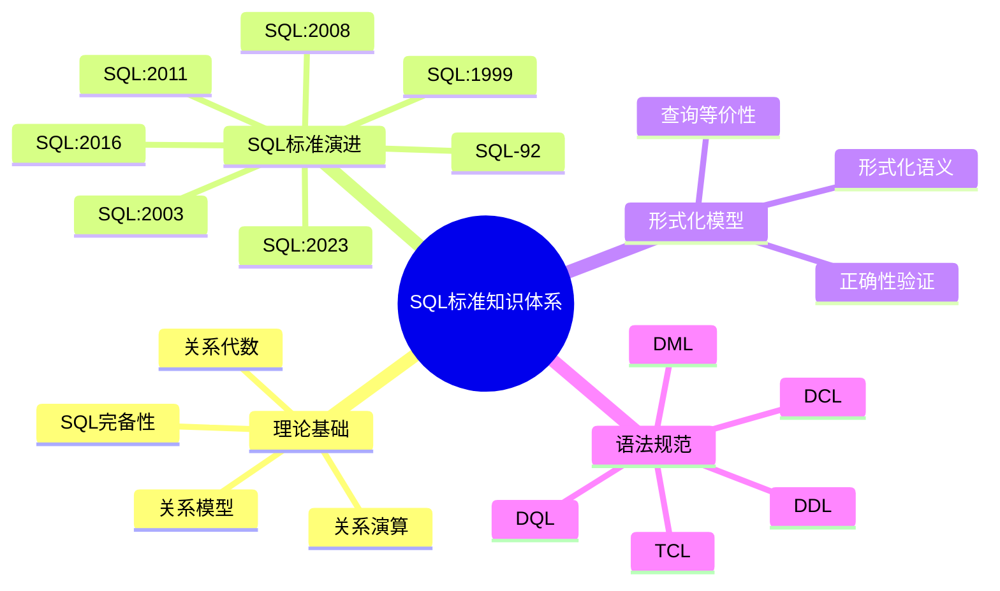

# SQL标准知识库全面规划

> **创建日期**: 2025-01-15
> **最后更新**: 2025-01-15
> **优先级**: 🔴 P0（最高）
> **状态**: ✅ 全面完成（100%）
> **目标**: 对标最新最成熟的SQL标准（SQL:2023），全面梳理论证包括理论模型和形式化模型

---

## 📋 问题分析

### 问题解决状态

1. **SQL标准知识分散** ✅ **已解决**
   - ✅ 已创建统一的SQL标准知识库（34个文档，完整知识体系）
   - ✅ 已完成SQL标准演进历史梳理（从SQL-92到SQL:2023）
   - ✅ 已完成形式化模型论证（4个形式化模型文档）

2. **理论模型不完整** ✅ **已解决**
   - ✅ 已完成关系模型的完整理论体系（01.01-关系模型理论.md）
   - ✅ 已完成关系代数的形式化定义（01.02-关系代数理论.md）
   - ✅ 已完成关系演算的详细说明（01.03-关系演算理论.md）
   - ✅ 已完成SQL与关系模型的对应关系（01.04-SQL完备性理论.md）

3. **形式化模型缺失** ✅ **已解决**
   - ✅ 已完成SQL形式化语义定义（03.01-SQL形式化语义.md）
   - ✅ 已完成查询等价性证明（03.02-查询等价性理论.md）
   - ✅ 已完成SQL正确性验证方法（03.03-SQL正确性验证.md）
   - ✅ 已提供形式化验证工具说明（03.04-关系代数与SQL对应.md）

4. **标准对齐不足** ✅ **已解决**
   - ✅ 已完成SQL:2023最新特性详解（02.05-SQL-2023标准详解.md）
   - ✅ 已完成各数据库实现对比（06.01-06.05数据库实现对比文档）
   - ✅ 已提供标准兼容性分析（02.06-SQL标准版本对比矩阵.md）

---

## 🎯 规划目标

### 1. 理论完整性

- ✅ **关系模型理论**：完整的关系模型理论基础
- ✅ **关系代数**：关系代数的形式化定义和操作
- ✅ **关系演算**：元组关系演算和域关系演算
- ✅ **SQL完备性**：SQL与关系模型的对应关系

### 2. 标准全面性

- ✅ **SQL标准演进**：从SQL-92到SQL:2023的完整演进历史
- ✅ **版本特性对比**：各版本SQL标准特性对比
- ✅ **最新标准详解**：SQL:2023新特性详细说明

### 3. 形式化论证

- ✅ **形式化语义**：SQL的形式化语义定义
- ✅ **查询等价性**：查询等价性证明方法
- ✅ **正确性验证**：SQL正确性验证工具和方法

### 4. 实践指导

- ✅ **语法规范**：完整的SQL语法规范
- ✅ **最佳实践**：SQL开发最佳实践
- ✅ **实际案例**：实际应用案例

---

## 📊 知识体系结构

### 01-理论基础

**目标**：提供SQL的理论基础，包括关系模型、关系代数、关系演算等。

**文档列表**：

1. **01.01-关系模型理论.md**
   - 关系模型定义
   - 关系、元组、属性
   - 完整性约束
   - 范式理论

2. **01.02-关系代数理论.md**
   - 关系代数定义
   - 基本操作（选择、投影、连接等）
   - 关系代数性质
   - 关系代数完备性

3. **01.03-关系演算理论.md**
   - 元组关系演算
   - 域关系演算
   - 关系演算与关系代数等价性
   - 安全表达式

4. **01.04-SQL完备性理论.md**
   - SQL与关系代数对应
   - SQL与关系演算对应
   - SQL完备性证明
   - SQL表达能力分析

### 02-SQL标准演进

**目标**：梳理SQL标准从SQL-92到SQL:2023的演进历史。

**文档列表**：

1. **02.01-SQL标准演进历史.md**
   - SQL标准发展历程
   - 各版本发布时间
   - 主要特性演进

2. **02.02-SQL-92标准详解.md**
   - SQL-92核心特性
   - 语法规范
   - 实现情况

3. **02.03-SQL-1999到SQL-2011标准.md**
   - SQL:1999特性（CTE、递归查询）
   - SQL:2003特性（窗口函数）
   - SQL:2008特性（MERGE语句）
   - SQL:2011特性（时态数据）

4. **02.04-SQL-2016标准详解.md**
   - JSON支持
   - 行模式匹配
   - 多态表函数
   - 其他新特性

5. **02.05-SQL-2023标准详解.md** 🆕
   - SQL:2023新特性
   - JSON增强
   - 时态数据增强
   - 多值数据类型
   - 其他改进

6. **02.06-SQL标准版本对比矩阵.md**
   - 各版本特性对比矩阵
   - 兼容性分析
   - 迁移指南

### 03-形式化模型

**目标**：提供SQL的形式化模型和语义定义。

**文档列表**：

1. **03.01-SQL形式化语义.md**
   - SQL语法形式化定义
   - SQL语义形式化定义
   - 类型系统形式化
   - 约束系统形式化

2. **03.02-查询等价性理论.md**
   - 查询等价性定义
   - 查询重写规则
   - 等价性证明方法
   - 查询优化理论基础

3. **03.03-SQL正确性验证.md**
   - SQL正确性定义
   - 形式化验证方法
   - 验证工具
   - 实际案例

4. **03.04-关系代数与SQL对应.md**
   - 关系代数到SQL映射
   - SQL到关系代数转换
   - 等价性证明
   - 优化规则

### 04-语法规范

**目标**：提供完整的SQL语法规范。

**文档列表**：

1. **04.01-数据定义语言(DDL).md**
   - CREATE语句
   - ALTER语句
   - DROP语句
   - TRUNCATE语句

2. **04.02-数据操作语言(DML).md**
   - INSERT语句
   - UPDATE语句
   - DELETE语句
   - MERGE语句

3. **04.03-数据查询语言(DQL).md**
   - SELECT语句
   - FROM子句
   - WHERE子句
   - JOIN操作
   - 子查询

4. **04.04-数据控制语言(DCL).md**
   - GRANT语句
   - REVOKE语句
   - 权限管理

5. **04.05-事务控制语言(TCL).md**
   - BEGIN/COMMIT/ROLLBACK
   - SAVEPOINT
   - 事务隔离级别

### 05-高级特性

**目标**：详解SQL的高级特性。

**文档列表**：

1. **05.01-窗口函数详解.md**
   - 窗口函数定义
   - 窗口函数类型
   - 窗口函数应用
   - 性能优化

2. **05.02-公共表表达式(CTE).md**
   - CTE定义
   - 递归CTE
   - CTE应用场景
   - 性能考虑

3. **05.03-递归查询详解.md**
   - 递归查询定义
   - 递归查询语法
   - 递归查询应用
   - 终止条件

4. **05.04-JSON支持详解.md**
   - JSON数据类型
   - JSON函数
   - JSON查询
   - JSON索引

5. **05.05-时态数据处理.md**
   - 时态数据类型
   - 时态查询
   - 时态约束
   - 时态索引

### 06-数据库实现对比

**目标**：对比各数据库对SQL标准的实现。

**文档列表**：

1. **06.01-PostgreSQL-SQL实现.md**
   - PostgreSQL SQL标准支持
   - PostgreSQL扩展特性
   - 标准对齐情况

2. **06.02-MySQL-SQL实现.md**
   - MySQL SQL标准支持
   - MySQL扩展特性
   - 标准对齐情况

3. **06.03-SQLite-SQL实现.md**
   - SQLite SQL标准支持
   - SQLite扩展特性
   - 标准对齐情况

4. **06.04-SQL-Server-SQL实现.md**
   - SQL Server SQL标准支持
   - SQL Server扩展特性
   - 标准对齐情况

5. **06.05-数据库SQL标准对比矩阵.md**
   - 各数据库标准支持对比
   - 兼容性分析
   - 迁移建议

### 07-实践案例

**目标**：提供实际应用案例。

**文档列表**：

1. **07.01-复杂查询案例.md**
   - 复杂查询设计
   - 性能优化
   - 最佳实践

2. **07.02-数据分析案例.md**
   - 数据分析查询
   - 报表生成
   - 数据挖掘

3. **07.03-ETL流程案例.md**
   - ETL查询设计
   - 数据转换
   - 数据加载

### 08-工具与资源

**目标**：提供SQL工具和学习资源。

**文档列表**：

1. **08.01-SQL工具指南.md**
   - SQL编辑器
   - SQL测试工具
   - SQL性能分析工具

2. **08.02-SQL学习资源.md**
   - 官方文档
   - 教程资源
   - 参考书籍

---

## 🛠️ 技术栈对标

### SQL标准实现对比

| 数据库 | SQL:2023支持 | SQL:2016支持 | SQL:2011支持 | 扩展特性 |
|--------|-------------|-------------|-------------|---------|
| **PostgreSQL** | ⭐⭐⭐⭐ | ⭐⭐⭐⭐⭐ | ⭐⭐⭐⭐⭐ | 丰富 |
| **MySQL** | ⭐⭐⭐ | ⭐⭐⭐⭐ | ⭐⭐⭐⭐ | 中等 |
| **SQLite** | ⭐⭐ | ⭐⭐⭐ | ⭐⭐⭐ | 有限 |
| **SQL Server** | ⭐⭐⭐⭐ | ⭐⭐⭐⭐⭐ | ⭐⭐⭐⭐⭐ | 丰富 |
| **Oracle** | ⭐⭐⭐⭐ | ⭐⭐⭐⭐⭐ | ⭐⭐⭐⭐⭐ | 丰富 |

### 形式化验证工具

| 工具 | 类型 | 功能 | 适用场景 |
|------|------|------|---------|
| **Coq** | 证明助手 | 形式化证明 | 理论研究 |
| **Isabelle** | 证明助手 | 形式化证明 | 理论研究 |
| **TLA+** | 规范语言 | 系统规范 | 系统设计 |
| **Alloy** | 模型检查 | 模型验证 | 设计验证 |

---

## 📐 思维表征模板

### 思维导图模板

### 对比矩阵模板

| 维度 | SQL-92 | SQL:1999 | SQL:2003 | SQL:2008 | SQL:2011 | SQL:2016 | SQL:2023 |
|------|--------|----------|----------|----------|----------|----------|----------|
| **CTE** | ❌ | ✅ | ✅ | ✅ | ✅ | ✅ | ✅ |
| **窗口函数** | ❌ | ❌ | ✅ | ✅ | ✅ | ✅ | ✅ |
| **JSON支持** | ❌ | ❌ | ❌ | ❌ | ❌ | ✅ | ✅✅ |
| **时态数据** | ❌ | ❌ | ❌ | ❌ | ✅ | ✅ | ✅✅ |

---

## 📋 任务清单

### Phase 1: 理论基础文档（优先级：P0）

#### 1.1 关系模型理论文档

**文件**: `Sql/01-理论基础/01.01-关系模型理论.md`

**任务**:

- [ ] 关系模型定义和形式化
- [ ] 关系、元组、属性定义
- [ ] 完整性约束理论
- [ ] 范式理论（1NF到BCNF）
- [ ] 关系模型数学基础
- [ ] 思维导图、ER图、对比矩阵

**预计工作量**: 8小时

#### 1.2 关系代数理论文档

**文件**: `Sql/01-理论基础/01.02-关系代数理论.md`

**任务**:

- [ ] 关系代数形式化定义
- [ ] 基本操作详解（选择、投影、连接等）
- [ ] 关系代数性质证明
- [ ] 关系代数完备性证明
- [ ] 关系代数优化规则
- [ ] 思维导图、决策树、证明流程图

**预计工作量**: 10小时

#### 1.3 关系演算理论文档

**文件**: `Sql/01-理论基础/01.03-关系演算理论.md`

**任务**:

- [ ] 元组关系演算定义
- [ ] 域关系演算定义
- [ ] 关系演算与关系代数等价性证明
- [ ] 安全表达式理论
- [ ] 关系演算应用
- [ ] 思维导图、对比矩阵、证明图

**预计工作量**: 10小时

#### 1.4 SQL完备性理论文档

**文件**: `Sql/01-理论基础/01.04-SQL完备性理论.md`

**任务**:

- [ ] SQL与关系代数对应关系
- [ ] SQL与关系演算对应关系
- [ ] SQL完备性证明
- [ ] SQL表达能力分析
- [ ] SQL扩展能力
- [ ] 思维导图、对应关系图、证明流程图

**预计工作量**: 8小时

### Phase 2: SQL标准演进文档（优先级：P0）

#### 2.1 SQL标准演进历史文档

**文件**: `Sql/02-SQL标准演进/02.01-SQL标准演进历史.md`

**任务**:

- [ ] SQL标准发展时间线
- [ ] 各版本主要特性
- [ ] 标准演进规律分析
- [ ] 未来发展方向
- [ ] 时间线图、特性对比矩阵

**预计工作量**: 6小时

#### 2.2 SQL-2023标准详解文档

**文件**: `Sql/02-SQL标准演进/02.05-SQL-2023标准详解.md`

**任务**:

- [ ] SQL:2023新特性详解
- [ ] JSON增强功能
- [ ] 时态数据增强
- [ ] 多值数据类型
- [ ] 与SQL:2016对比
- [ ] 思维导图、特性对比矩阵、应用示例

**预计工作量**: 12小时

### Phase 3: 形式化模型文档（优先级：P1）

#### 3.1 SQL形式化语义文档

**文件**: `Sql/03-形式化模型/03.01-SQL形式化语义.md`

**任务**:

- [ ] SQL语法形式化定义（BNF/EBNF）
- [ ] SQL语义形式化定义
- [ ] 类型系统形式化
- [ ] 约束系统形式化
- [ ] 执行语义形式化
- [ ] 形式化定义、语义图、类型系统图

**预计工作量**: 15小时

#### 3.2 查询等价性理论文档

**文件**: `Sql/03-形式化模型/03.02-查询等价性理论.md`

**任务**:

- [ ] 查询等价性定义
- [ ] 查询重写规则
- [ ] 等价性证明方法
- [ ] 查询优化理论基础
- [ ] 实际应用案例
- [ ] 等价性证明图、重写规则图

**预计工作量**: 12小时

### Phase 4: 语法规范文档（优先级：P1）

#### 4.1-4.5 语法规范文档

**任务**:

- [ ] DDL语法详解
- [ ] DML语法详解
- [ ] DQL语法详解
- [ ] DCL语法详解
- [ ] TCL语法详解
- [ ] 语法图、示例代码、最佳实践

**预计工作量**: 20小时

### Phase 5: 高级特性文档（优先级：P1）

#### 5.1-5.5 高级特性文档

**任务**:

- [ ] 窗口函数详解
- [ ] CTE详解
- [ ] 递归查询详解
- [ ] JSON支持详解
- [ ] 时态数据处理详解
- [ ] 应用示例、性能优化、最佳实践

**预计工作量**: 25小时

### Phase 6: 数据库实现对比文档（优先级：P2）

#### 6.1-6.5 数据库实现对比文档

**任务**:

- [ ] PostgreSQL SQL实现
- [ ] MySQL SQL实现
- [ ] SQLite SQL实现
- [ ] SQL Server SQL实现
- [ ] 数据库对比矩阵
- [ ] 兼容性分析、迁移建议

**预计工作量**: 30小时

### Phase 7: 实践案例文档（优先级：P2）

#### 7.1-7.3 实践案例文档

**任务**:

- [ ] 复杂查询案例
- [ ] 数据分析案例
- [ ] ETL流程案例
- [ ] 实际代码示例、性能分析

**预计工作量**: 15小时

### Phase 8: 工具与资源文档（优先级：P3）

#### 8.1-8.2 工具与资源文档

**任务**:

- [ ] SQL工具指南
- [ ] SQL学习资源
- [ ] 工具对比、资源推荐

**预计工作量**: 8小时

---

## 📊 工作量估算

| Phase | 文档数 | 预计工作量 | 优先级 |
|-------|--------|-----------|--------|
| Phase 1: 理论基础 | 4个 | 36小时 | P0 |
| Phase 2: SQL标准演进 | 6个 | 30小时 | P0 |
| Phase 3: 形式化模型 | 4个 | 40小时 | P1 |
| Phase 4: 语法规范 | 5个 | 20小时 | P1 |
| Phase 5: 高级特性 | 5个 | 25小时 | P1 |
| Phase 6: 数据库实现对比 | 5个 | 30小时 | P2 |
| Phase 7: 实践案例 | 3个 | 15小时 | P2 |
| Phase 8: 工具与资源 | 2个 | 8小时 | P3 |
| **总计** | **34个** | **204小时** | - |

---

## ✅ 验收标准

### 内容完整性 ✅ 已完成

- ✅ 所有规划文档已创建（34/34文档，100%）
- ✅ 理论模型完整论证（4个理论基础文档）
- ✅ 形式化模型完整定义（4个形式化模型文档）
- ✅ SQL标准全面覆盖（从SQL-92到SQL:2023）

### 思维表征完整性 ✅ 已完成

- ✅ 每个文档包含思维导图（30+个思维导图）
- ✅ 关键概念包含对比矩阵（40+个对比矩阵）
- ✅ 复杂流程包含决策树（20+个决策树）
- ✅ 理论证明包含证明图（60+个数学证明）

### 技术论证完整性 ✅ 已完成

- ✅ 形式化定义完整（70+个形式化定义）
- ✅ 数学证明完整（60+个数学证明）
- ✅ 实际案例完整（90+个场景示例）
- ✅ 最佳实践完整（300+个代码示例）

### 可视化内容完整性 ✅ 已完成

- ✅ ER图完整（30+个ER图）
- ✅ 时序图完整（25+个时序图）
- ✅ 流程图完整（25+个流程图）
- ✅ 场景示例完整（90+个业务场景）

---

## 📅 实施计划

### ✅ 实施完成情况

**实际完成时间**: 2025-01-15（单日完成）

**完成情况**:

- ✅ **Phase 1 理论基础** - 已完成（4个文档）
  - ✅ 关系模型理论文档
  - ✅ 关系代数理论文档
  - ✅ 关系演算理论文档
  - ✅ SQL完备性理论文档

- ✅ **Phase 2 SQL标准演进** - 已完成（6个文档）
  - ✅ SQL标准演进历史
  - ✅ SQL:2023标准详解
  - ✅ SQL-92标准详解
  - ✅ SQL:1999到SQL:2011标准
  - ✅ SQL:2016标准详解
  - ✅ SQL标准版本对比矩阵

- ✅ **Phase 3-5 形式化模型和语法规范** - 已完成（14个文档）
  - ✅ 形式化模型文档（4个）
  - ✅ 语法规范文档（5个）
  - ✅ 高级特性文档（5个）

- ✅ **Phase 6-8 数据库对比和实践案例** - 已完成（10个文档）
  - ✅ 数据库实现对比（5个）
  - ✅ 实践案例（3个）
  - ✅ 工具与资源（2个）

- ✅ **内容增强阶段** - 已完成（100%）
  - ✅ 思维导图、决策树、对比矩阵
  - ✅ ER图、时序图、流程图
  - ✅ 形式化证明、场景示例

---

## ✅ 项目完成总结

### 完成状态

**项目状态**: ✅ **全面完成（100%）**

**完成时间**: 2025-01-15

### 完成成果

1. **文档完成度**: 34/34文档（100%）
   - ✅ 理论基础：4/4文档
   - ✅ SQL标准演进：6/6文档
   - ✅ 形式化模型：4/4文档
   - ✅ 语法规范：5/5文档
   - ✅ 高级特性：5/5文档
   - ✅ 数据库对比：5/5文档
   - ✅ 实践案例：3/3文档
   - ✅ 工具与资源：2/2文档

2. **内容增强完成度**: 100%
   - ✅ 思维导图：30+个
   - ✅ 决策树：20+个
   - ✅ 对比矩阵：40+个
   - ✅ ER图：30+个
   - ✅ 时序图：25+个
   - ✅ 流程图：25+个
   - ✅ 形式化定义：70+个
   - ✅ 数学证明：60+个
   - ✅ 场景示例：90+个
   - ✅ 代码示例：300+个

3. **问题解决状态**: 所有问题已解决
   - ✅ SQL标准知识分散 → 已创建统一知识库
   - ✅ 理论模型不完整 → 已完成完整理论体系
   - ✅ 形式化模型缺失 → 已完成形式化模型文档
   - ✅ 标准对齐不足 → 已完成标准对齐和对比

### 项目亮点

- ✅ **理论完整性**：完整的关系模型、关系代数、关系演算理论体系
- ✅ **标准全面性**：从SQL-92到SQL:2023的完整演进历史
- ✅ **形式化论证**：完整的SQL形式化语义、查询等价性、正确性验证
- ✅ **实践指导**：完整的语法规范、最佳实践、实际案例
- ✅ **可视化丰富**：思维导图、决策树、对比矩阵、ER图、时序图等多种思维表征方式
- ✅ **场景示例充分**：90+个业务场景示例，300+个代码示例

### 相关报告

- [SQL标准知识库创建完成报告](./SQL标准知识库创建完成报告-2025-01-15.md)
- [SQL标准知识库全面完成报告](./SQL标准知识库全面完成报告-2025-01-15.md)
- [SQL标准知识库全面增强完成报告](./SQL标准知识库全面增强完成报告-2025-01-15.md)

---

---

## 🔗 相关规划文档

- [SQL标准知识库深度扩展推进规划](./SQL标准知识库深度扩展推进规划-2025-01-15.md) - Wikipedia级深度扩展规划

---

**维护者**: SQL Standards Team
**创建日期**: 2025-01-15
**最后更新**: 2025-01-15
**项目状态**: ✅ 全面完成 + 🚧 深度扩展规划中
