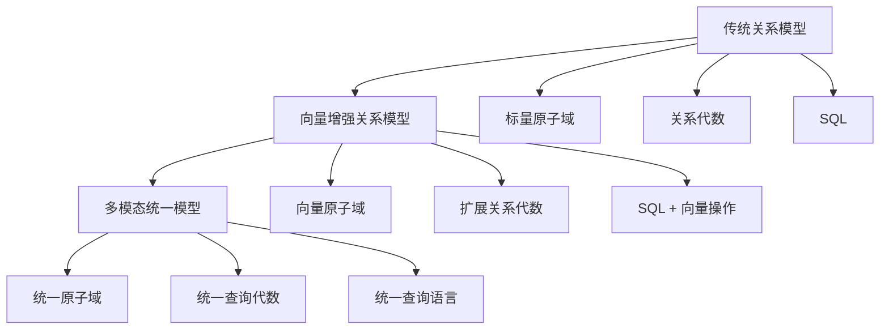

# 关系模型理论

> **创建日期**：2025-01-15
> **最后更新**：2025-12-01
> **版本**：v2.0.0
> **难度**：⭐⭐⭐⭐
> **应用场景**：数据库理论基础、数据建模、SQL设计、向量数据库

---

## 📋 目录

- [关系模型理论](#关系模型理论)
  - [📋 目录](#-目录)
  - [一、概述](#一概述)
    - [1.1 关系模型定义](#11-关系模型定义)
    - [1.2 关系模型历史](#12-关系模型历史)
      - [1.2.1 Codd的原始论文（1970）](#121-codd的原始论文1970)
      - [1.2.2 关系模型发展历程](#122-关系模型发展历程)
      - [1.2.2.1 1970-1975：理论奠基期](#1221-1970-1975理论奠基期)
      - [1.2.2.2 1976-1985：系统实现期](#1222-1976-1985系统实现期)
      - [1.2.2.3 1986-1999：标准化期](#1223-1986-1999标准化期)
      - [1.2.2.4 2000-至今：持续演进期](#1224-2000-至今持续演进期)
      - [1.2.3 重要人物和贡献](#123-重要人物和贡献)
      - [1.2.4 关系模型与其他数据模型的对比](#124-关系模型与其他数据模型的对比)
      - [1.2.5 关系模型优势与局限](#125-关系模型优势与局限)
    - [1.3 关系模型重要性](#13-关系模型重要性)
    - [1.4 关系模型知识体系思维导图](#14-关系模型知识体系思维导图)
  - [二、关系模型核心概念](#二关系模型核心概念)
    - [2.1 关系（Relation）](#21-关系relation)
    - [2.2 元组（Tuple）](#22-元组tuple)
      - [2.2.1 元组的定义](#221-元组的定义)
      - [2.2.2 元组的数学定义](#222-元组的数学定义)
      - [2.2.3 元组的性质](#223-元组的性质)
      - [2.2.4 元组的历史演进](#224-元组的历史演进)
    - [2.3 属性（Attribute）](#23-属性attribute)
      - [2.3.1 属性的定义](#231-属性的定义)
      - [2.3.2 属性的数学定义](#232-属性的数学定义)
      - [2.3.3 属性的性质](#233-属性的性质)
      - [2.3.4 属性的分类](#234-属性的分类)
    - [2.4 域（Domain）](#24-域domain)
    - [2.5 关系模式（Relation Schema）](#25-关系模式relation-schema)
  - [三、关系模型形式化定义](#三关系模型形式化定义)
    - [3.1 关系的形式化定义](#31-关系的形式化定义)
    - [3.2 关系模式的形式化定义](#32-关系模式的形式化定义)
    - [3.3 关系数据库的形式化定义](#33-关系数据库的形式化定义)
  - [四、完整性约束](#四完整性约束)
    - [4.0 完整性约束概述](#40-完整性约束概述)
    - [4.1 实体完整性（Entity Integrity）](#41-实体完整性entity-integrity)
      - [4.1.1 实体完整性的定义](#411-实体完整性的定义)
      - [4.1.2 实体完整性的形式化定义](#412-实体完整性的形式化定义)
      - [4.1.3 实体完整性的数学证明](#413-实体完整性的数学证明)
      - [4.1.4 实体完整性的历史演进](#414-实体完整性的历史演进)
      - [4.1.5 实体完整性的应用场景](#415-实体完整性的应用场景)
    - [4.2 参照完整性（Referential Integrity）](#42-参照完整性referential-integrity)
      - [4.2.1 参照完整性的定义](#421-参照完整性的定义)
      - [4.2.2 参照完整性的形式化定义](#422-参照完整性的形式化定义)
      - [4.2.3 参照完整性的数学证明](#423-参照完整性的数学证明)
      - [4.2.4 参照完整性的级联操作](#424-参照完整性的级联操作)
      - [4.2.5 参照完整性的历史演进](#425-参照完整性的历史演进)
    - [4.3 用户定义完整性（User-Defined Integrity）](#43-用户定义完整性user-defined-integrity)
      - [4.3.1 用户定义完整性的定义](#431-用户定义完整性的定义)
      - [4.3.2 域约束（Domain Constraints）](#432-域约束domain-constraints)
      - [4.3.3 检查约束（Check Constraints）](#433-检查约束check-constraints)
      - [4.3.4 唯一性约束（Unique Constraints）](#434-唯一性约束unique-constraints)
      - [4.3.5 非空约束（NOT NULL Constraints）](#435-非空约束not-null-constraints)
      - [4.3.6 完整性约束的完整分类](#436-完整性约束的完整分类)
  - [五、范式理论](#五范式理论)
    - [5.0 范式理论概述与历史背景](#50-范式理论概述与历史背景)
      - [5.0.1 范式理论的历史演进](#501-范式理论的历史演进)
      - [5.0.2 范式理论概述与决策树](#502-范式理论概述与决策树)
    - [5.1 第一范式（1NF）](#51-第一范式1nf)
    - [场景1：学生选课系统](#场景1学生选课系统)
    - [场景2：订单系统](#场景2订单系统)
    - [5.2 第二范式（2NF）](#52-第二范式2nf)
      - [5.2.1 2NF的定义](#521-2nf的定义)
      - [5.2.2 2NF的必要性和充分性证明](#522-2nf的必要性和充分性证明)
    - [5.3 第三范式（3NF）](#53-第三范式3nf)
      - [5.3.1 3NF的定义](#531-3nf的定义)
      - [5.3.2 3NF的必要性和充分性证明](#532-3nf的必要性和充分性证明)
    - [5.4 BCNF（Boyce-Codd范式）](#54-bcnfboyce-codd范式)
      - [5.4.1 BCNF的定义](#541-bcnf的定义)
      - [5.4.2 BCNF的形式化定义](#542-bcnf的形式化定义)
      - [5.4.3 BCNF的数学证明](#543-bcnf的数学证明)
      - [5.4.4 BCNF与3NF的对比](#544-bcnf与3nf的对比)
    - [5.5 范式对比矩阵](#55-范式对比矩阵)
  - [六、关系模型数学基础](#六关系模型数学基础)
    - [6.1 集合论基础](#61-集合论基础)
    - [6.2 关系作为集合](#62-关系作为集合)
    - [6.3 关系运算的数学性质](#63-关系运算的数学性质)
  - [七、关系模型优势与局限](#七关系模型优势与局限)
    - [7.1 关系模型优势](#71-关系模型优势)
    - [7.2 关系模型局限](#72-关系模型局限)
  - [八、关系模型与SQL对应](#八关系模型与sql对应)
    - [8.1 关系模型到SQL映射](#81-关系模型到sql映射)
    - [8.2 SQL到关系模型映射](#82-sql到关系模型映射)
  - [九、关系模型概念关系网络](#九关系模型概念关系网络)
    - [9.1 概念关系思维导图](#91-概念关系思维导图)
    - [9.2 属性关系矩阵](#92-属性关系矩阵)
    - [9.3 概念依赖关系图](#93-概念依赖关系图)
  - [十、2025关系模型扩展：向量数据模型](#十2025关系模型扩展向量数据模型)
    - [10.1 向量数据类型的关系模型表示](#101-向量数据类型的关系模型表示)
    - [10.2 向量检索的关系代数扩展](#102-向量检索的关系代数扩展)
    - [10.3 混合查询的形式化](#103-混合查询的形式化)
    - [10.4 2025数据模型演进对比](#104-2025数据模型演进对比)
    - [10.5 关系模型与向量模型的统一](#105-关系模型与向量模型的统一)
  - [十一、相关资源](#十一相关资源)
    - [相关文档](#相关文档)
    - [经典论文](#经典论文)
    - [2025新文献](#2025新文献)
    - [经典教材](#经典教材)
    - [在线资源](#在线资源)

---

## 一、概述

### 1.1 关系模型定义

**关系模型（Relational Model）**是由埃德加·科德（Edgar F. Codd）于1970年提出的数据模型，是现代关系数据库的理论基础。

**形式化定义**：

```latex
关系模型 = (数据结构, 操作集合, 完整性约束)

其中：
数据结构 = {关系, 元组, 属性, 域}
操作集合 = {关系代数操作, 关系演算操作}
完整性约束 = {实体完整性, 参照完整性, 用户定义完整性}
```

### 1.2 关系模型历史

#### 1.2.1 Codd的原始论文（1970）

**历史背景**：

1970年，IBM研究员埃德加·科德（Edgar F. Codd）在《Communications of the ACM》杂志上发表了具有里程碑意义的论文："A Relational Model of Data for Large Shared Data Banks"（大型共享数据库的关系模型）。

**论文核心贡献**：

1. **数学基础**：首次将数据组织建立在严格的数学基础（集合论和谓词逻辑）之上
2. **数据独立性**：提出了物理数据独立性和逻辑数据独立性的概念
3. **关系代数**：定义了关系代数作为数据操作语言
4. **规范化理论**：奠定了后续范式理论的基础

**论文影响**：

- 彻底改变了数据库领域的发展方向
- 为关系数据库系统奠定了理论基础
- 启发了SQL语言的开发
- 至今仍是数据库理论的核心文献

**论文引用**：

```text
Codd, E. F. (1970). "A Relational Model of Data for Large Shared Data Banks".
Communications of the ACM, 13(6), 377-387.
```

#### 1.2.2 关系模型发展历程

**重要里程碑时间线**：


**详细发展历程**：

#### 1.2.2.1 1970-1975：理论奠基期

- **1970年**：Codd发表关系模型论文，提出关系模型的基本概念
- **1971年**：Codd提出关系代数操作符
- **1972年**：Codd提出关系演算（元组关系演算和域关系演算）
- **1974年**：IBM的Donald Chamberlin和Raymond Boyce提出SEQUEL（Structured English Query Language），后改名为SQL
- **1975年**：Codd提出范式理论（1NF、2NF、3NF）

#### 1.2.2.2 1976-1985：系统实现期

- **1976年**：IBM启动System R项目，实现第一个关系数据库系统原型
- **1977年**：加州大学伯克利分校启动INGRES项目
- **1979年**：Oracle公司发布第一个商业关系数据库系统
- **1981年**：IBM发布SQL/DS（SQL/Data System）
- **1982年**：IBM发布DB2，成为企业级关系数据库的标准
- **1983年**：PostgreSQL的前身POSTGRES项目启动

#### 1.2.2.3 1986-1999：标准化期

- **1986年**：ANSI发布SQL-86标准（第一个SQL标准）
- **1989年**：ISO发布SQL-89标准（增加了完整性约束）
- **1992年**：ISO发布SQL-92标准（大幅扩展，成为主流标准）
- **1999年**：ISO发布SQL:1999标准（增加了递归查询、触发器、存储过程等）

#### 1.2.2.4 2000-至今：持续演进期

- **2003年**：SQL:2003标准（增加了窗口函数、XML支持等）
- **2008年**：SQL:2008标准（增加了MERGE语句、时态数据支持等）
- **2011年**：SQL:2011标准（增强了时态数据支持）
- **2016年**：SQL:2016标准（增加了JSON支持、行模式匹配等）
- **2023年**：SQL:2023标准（增强了JSON功能、多值数据类型等）

#### 1.2.3 重要人物和贡献

**核心人物**：

| 人物 | 贡献 | 时间 |
|------|------|------|
| **Edgar F. Codd** | 提出关系模型理论 | 1970 |
| **Donald Chamberlin** | 设计SQL语言 | 1974 |
| **Raymond Boyce** | 设计SQL语言，提出BCNF | 1974 |
| **Jim Gray** | 事务处理理论，ACID特性 | 1970s-1980s |
| **Michael Stonebraker** | INGRES和PostgreSQL开发 | 1970s-至今 |

**Edgar F. Codd（1923-2003）**：

- 英国计算机科学家
- IBM研究员
- 关系模型理论的创始人
- 1981年获得图灵奖
- 主要贡献：
  - 关系模型理论
  - 关系代数
  - 范式理论
  - 数据独立性概念

**Donald Chamberlin**：

- IBM研究员
- SQL语言的主要设计者之一
- 与Raymond Boyce共同设计SEQUEL（SQL前身）
- 主要贡献：
  - SQL语言设计
  - 查询语言理论

**Raymond Boyce（1947-1974）**：

- IBM研究员
- SQL语言的主要设计者之一
- 提出Boyce-Codd范式（BCNF）
- 不幸在27岁时因脑动脉瘤去世

#### 1.2.4 关系模型与其他数据模型的对比

**数据模型演进**：


**数据模型对比矩阵**：

| 特性 | 层次模型 | 网状模型 | 关系模型 | 对象关系模型 | NoSQL模型 |
|------|---------|---------|---------|------------|----------|
| **数据结构** | 树形结构 | 图结构 | 二维表 | 表+对象 | 多样化 |
| **数据独立性** | 低 | 中 | 高 | 高 | 中 |
| **查询语言** | 导航式 | 导航式 | 声明式（SQL） | SQL扩展 | 多样化 |
| **理论基础** | 无 | 无 | 集合论 | 集合论+OO | 无 |
| **标准化** | 无 | CODASYL | SQL标准 | SQL标准扩展 | 无 |
| **典型系统** | IMS | IDMS | Oracle, DB2, PostgreSQL | PostgreSQL | MongoDB, Redis |
| **优势** | 简单 | 灵活 | 标准化、易用 | 支持复杂类型 | 高性能、可扩展 |
| **劣势** | 不灵活 | 复杂 | 性能限制 | 复杂性 | 缺乏标准 |

#### 1.2.5 关系模型优势与局限

**关系模型优势**：

1. **数学基础**：基于集合论和谓词逻辑，理论严谨
2. **数据独立性**：物理和逻辑数据独立性，易于维护
3. **标准化**：SQL标准统一，易于学习和使用
4. **声明式查询**：用户只需描述"做什么"，不需要描述"怎么做"
5. **完整性约束**：支持实体完整性、参照完整性等约束

**关系模型局限**：

1. **性能限制**：对于某些应用场景（如大规模分布式系统）性能可能不足
2. **复杂类型支持**：传统关系模型对复杂数据类型支持有限
3. **扩展性**：水平扩展相对困难
4. **灵活性**：严格的模式定义可能限制某些应用场景

**关系模型适用场景**：

- ✅ 事务处理系统（OLTP）
- ✅ 数据仓库（OLAP）
- ✅ 企业信息系统
- ✅ 需要ACID保证的应用
- ✅ 需要标准化查询语言的应用

**关系模型不适用场景**：

- ❌ 超大规模分布式系统（可能需要NoSQL）
- ❌ 实时流处理（可能需要流数据库）
- ❌ 图数据查询（可能需要图数据库）
- ❌ 文档存储（可能需要文档数据库）

### 1.3 关系模型重要性

关系模型的重要性体现在：

1. **理论基础**：为关系数据库提供坚实的数学基础
2. **标准化**：SQL标准基于关系模型
3. **广泛应用**：现代数据库系统的基础
4. **形式化**：支持形式化验证和证明

### 1.4 关系模型知识体系思维导图


---

## 二、关系模型核心概念

### 2.1 关系（Relation）

**定义**：关系是一个二维表，由行和列组成。

**形式化定义**：

```latex
关系 R 是域 D₁ × D₂ × ... × Dₙ 的子集

R ⊆ D₁ × D₂ × ... × Dₙ

其中：
- Dᵢ 是第 i 个属性的域
- n 是属性的数量（关系的度）
```

**示例**：

```text
关系：学生（Student）

| 学号 | 姓名 | 年龄 | 专业 |
|------|------|------|------|
| 001  | 张三 | 20   | 计算机 |
| 002  | 李四 | 21   | 数学   |
| 003  | 王五 | 19   | 物理   |
```

### 2.2 元组（Tuple）

#### 2.2.1 元组的定义

**元组（Tuple）**是关系中的一行，表示一个实体实例。

**直观理解**：

元组是关系中的一个记录，包含了一组相关的属性值。

**示例**：

在Student关系中，`(001, 张三, 20, 计算机)` 是一个元组，表示一个学生的完整信息。

#### 2.2.2 元组的数学定义

**元组的数学定义**：

```latex
设关系 R 有属性集合 A = {A₁, A₂, ..., Aₙ}，对应的域为 D = {D₁, D₂, ..., Dₙ}

元组 t 是一个有序对序列：
t = (v₁, v₂, ..., vₙ)

其中：
- vᵢ ∈ Dᵢ，表示属性 Aᵢ 的值
- t ∈ D₁ × D₂ × ... × Dₙ
```

**形式化定义**：

```latex
元组 t 是一个函数：
t: A → ∪ᵢ Dᵢ

满足：
\forall Aᵢ \in A: t(Aᵢ) \in Dᵢ
```

#### 2.2.3 元组的性质

**元组的性质**：

1. **有序性**：元组中的属性值是有序的（按属性顺序）
2. **完整性**：元组必须包含所有属性的值（或NULL）
3. **唯一性**：在关系中，每个元组都是唯一的

#### 2.2.4 元组的历史演进

**术语来源**：

- **数学来源**：元组概念来源于数学中的"有序n元组"（n-tuple）
- **数据库应用**：Codd将元组概念引入关系模型
- **SQL术语**：在SQL中，元组通常称为"行"（Row）或"记录"（Record）

**术语对比**：

| 数学术语 | 关系模型术语 | SQL术语 | 说明 |
|---------|------------|---------|------|
| n元组（n-tuple） | 元组（Tuple） | 行（Row） | 有序的值序列 |
| 记录（Record） | 元组（Tuple） | 行（Row） | 数据库中的记录 |

### 2.3 属性（Attribute）

#### 2.3.1 属性的定义

**属性（Attribute）**是关系中的一列，表示实体的特征或性质。

**直观理解**：

属性定义了关系的结构，描述了实体或关系的特征。

**示例**：

在Student关系中，`学号`、`姓名`、`年龄`、`专业`都是属性。

#### 2.3.2 属性的数学定义

**属性的数学定义**：

```latex
属性 A 是一个有序对 (A, D)

其中：
- A 是属性名
- D 是属性的域（Domain），即属性值的集合
```

**形式化定义**：

```latex
设关系模式 R 有属性集合 A = {A₁, A₂, ..., Aₙ}

每个属性 Aᵢ 关联一个域 Dᵢ：
Aᵢ: Dᵢ

表示属性 Aᵢ 的值必须来自域 Dᵢ
```

#### 2.3.3 属性的性质

**属性的性质**：

1. **唯一性**：在关系模式中，属性名必须唯一
2. **类型性**：每个属性都有特定的数据类型（域）
3. **原子性**：属性的值必须是原子的（不可再分）

#### 2.3.4 属性的分类

**按功能分类**：

1. **主属性（Prime Attribute）**：属于候选键的属性
2. **非主属性（Non-Prime Attribute）**：不属于候选键的属性
3. **键属性（Key Attribute）**：属于主键的属性

**按值分类**：

1. **单值属性（Single-Valued Attribute）**：每个元组只有一个值
2. **多值属性（Multi-Valued Attribute）**：每个元组可以有多个值（违反1NF）

**按可空性分类**：

1. **必需属性（Required Attribute）**：不能为NULL
2. **可选属性（Optional Attribute）**：可以为NULL

### 2.4 域（Domain）

**定义**：域是属性的取值范围。

**形式化定义**：

```latex
域 D 是一个值的集合

D = {v₁, v₂, ..., vₘ}

其中：
- vᵢ 是域中的一个值
- m 是域中值的数量（可以是无限的）
```

**示例**：

```text
域示例：
- 学号域：{001, 002, 003, ...}
- 年龄域：{0, 1, 2, ..., 150}
- 姓名域：所有可能的字符串
```

### 2.5 关系模式（Relation Schema）

**定义**：关系模式是关系的结构定义，包括关系名和属性列表。

**形式化定义**：

```latex
关系模式 R(A₁, A₂, ..., Aₙ)

其中：
- R 是关系名
- Aᵢ 是属性名
- n 是属性的数量（关系的度）
```

**示例**：

```text
关系模式：
Student(学号, 姓名, 年龄, 专业)

对应的关系实例：
| 学号 | 姓名 | 年龄 | 专业 |
|------|------|------|------|
| 001  | 张三 | 20   | 计算机 |
```

---

## 三、关系模型形式化定义

### 3.1 关系的形式化定义

**关系的形式化定义**：

```latex
设 D₁, D₂, ..., Dₙ 是 n 个域

关系 R 是笛卡尔积 D₁ × D₂ × ... × Dₙ 的子集

R ⊆ D₁ × D₂ × ... × Dₙ

关系的性质：
1. 元组的顺序无关紧要
2. 元组必须唯一（无重复）
3. 属性的顺序无关紧要（通过属性名引用）
```

**数学证明**：

```latex
\begin{theorem}[关系的集合性质]
关系 R 是一个集合，满足：
1. 无序性：元组的顺序不影响关系
2. 唯一性：关系中没有重复的元组
3. 确定性：每个元组要么属于关系，要么不属于
\end{theorem}

\begin{proof}
1. 无序性：由于关系是集合，集合的元素是无序的
2. 唯一性：集合的定义要求元素唯一
3. 确定性：集合的成员关系是确定的（二值逻辑）
\end{proof}
```

### 3.2 关系模式的形式化定义

**关系模式的形式化定义**：

```latex
关系模式 R 是一个有序对 (R, A)

其中：
- R 是关系名
- A = {A₁, A₂, ..., Aₙ} 是属性集合

每个属性 Aᵢ 关联一个域 Dᵢ

Aᵢ: Dᵢ
```

### 3.3 关系数据库的形式化定义

**关系数据库的形式化定义**：

```latex
关系数据库 DB = {R₁, R₂, ..., Rₘ}

其中：
- Rᵢ 是一个关系
- m 是关系的数量

关系数据库模式：
Schema(DB) = {Schema(R₁), Schema(R₂), ..., Schema(Rₘ)}
```

---

## 四、完整性约束

### 4.0 完整性约束概述

**完整性约束（Integrity Constraints）**是关系模型中用于保证数据正确性和一致性的规则。

**完整性约束的分类**：


**完整性约束对比矩阵**：

| 约束类型 | 作用范围 | 检查时机 | 违反后果 | 实现方式 |
|---------|---------|---------|---------|---------|
| **实体完整性** | 单个关系 | 插入、更新 | 拒绝操作 | PRIMARY KEY |
| **参照完整性** | 关系之间 | 插入、更新、删除 | 拒绝操作或级联 | FOREIGN KEY |
| **用户定义完整性** | 单个关系 | 插入、更新 | 拒绝操作 | CHECK, UNIQUE, NOT NULL |

### 4.1 实体完整性（Entity Integrity）

#### 4.1.1 实体完整性的定义

**实体完整性（Entity Integrity）**是Codd在1970年的论文中提出的完整性约束，要求主键不能为空，且必须唯一。

**Codd的原始定义**：

在Codd的原始论文中，实体完整性被定义为：

- 每个关系必须有一个主键
- 主键的每个属性都不能为NULL
- 主键的值必须唯一

#### 4.1.2 实体完整性的形式化定义

**形式化定义**：

```latex
设关系 R 的主键为 K = {A₁, A₂, ..., Aₖ}

实体完整性约束：
\forall t \in R:
  \forall Aᵢ \in K: t[Aᵢ] \neq NULL
  \land \nexists t' \in R, t' \neq t: t'[K] = t[K]
```

**详细说明**：

1. **非空约束**：主键的每个属性都不能为NULL

   ```latex
   \forall t \in R, \forall Aᵢ \in K: t[Aᵢ] \neq NULL
   ```

2. **唯一性约束**：主键的值必须唯一

   ```latex
   \forall t₁, t₂ \in R, t₁ \neq t₂: t₁[K] \neq t₂[K]
   ```

#### 4.1.3 实体完整性的数学证明

**定理**：

```latex
\begin{theorem}[实体完整性必要性]
如果主键可以为空或重复，则无法唯一标识元组。
\end{theorem}
```

**证明**：

```latex
\begin{proof}
1. 非空性必要性：
   假设主键 K 可以为空：
   - 如果 t[K] = NULL，则无法区分不同的元组
   - 违反关系的唯一性要求
   - 无法唯一标识实体

   因此，主键必须非空。

2. 唯一性必要性：
   假设主键 K 可以重复：
   - 如果 t₁[K] = t₂[K]，则无法唯一标识元组
   - 违反主键的唯一性要求
   - 无法区分不同的实体

   因此，主键必须唯一。
\end{proof}
```

#### 4.1.4 实体完整性的历史演进

**历史背景**：

- **1970年**：Codd在关系模型论文中首次提出实体完整性概念
- **1986年**：SQL-86标准正式定义了PRIMARY KEY约束
- **1992年**：SQL-92标准增强了实体完整性的定义

**SQL实现**：

```sql
-- SQL中的实体完整性实现
CREATE TABLE Student (
    student_id INTEGER PRIMARY KEY,  -- 主键约束
    name VARCHAR(100) NOT NULL,
    age INTEGER
);

-- 复合主键
CREATE TABLE Enrollment (
    student_id INTEGER,
    course_id INTEGER,
    PRIMARY KEY (student_id, course_id)  -- 复合主键
);
```

#### 4.1.5 实体完整性的应用场景

**场景示例：学生管理系统**:

```sql
-- 学生表：学号作为主键
CREATE TABLE Student (
    student_id INTEGER PRIMARY KEY,  -- 实体完整性：学号唯一且非空
    name VARCHAR(100) NOT NULL,
    email VARCHAR(100) UNIQUE
);

-- 插入数据
INSERT INTO Student VALUES (1, 'Alice', 'alice@example.com');  -- ✅ 成功
INSERT INTO Student VALUES (1, 'Bob', 'bob@example.com');      -- ❌ 违反唯一性
INSERT INTO Student VALUES (NULL, 'Charlie', 'charlie@example.com');  -- ❌ 违反非空性
```

### 4.2 参照完整性（Referential Integrity）

#### 4.2.1 参照完整性的定义

**参照完整性（Referential Integrity）**是Codd在1970年的论文中提出的完整性约束，要求外键值必须在被引用关系的主键中存在。

**Codd的原始定义**：

在Codd的原始论文中，参照完整性被定义为：

- 如果关系R₁的属性A引用关系R₂的主键K
- 则R₁中每个元组的A值必须在R₂的K值中存在，或者为NULL

#### 4.2.2 参照完整性的形式化定义

**形式化定义**：

```latex
设关系 R₁ 有外键 FK 引用关系 R₂ 的主键 PK

参照完整性约束：
\forall t₁ \in R₁:
  t₁[FK] = NULL \lor \exists t₂ \in R₂: t₂[PK] = t₁[FK]
```

**详细说明**：

1. **引用存在性**：外键值必须在被引用关系的主键中存在

   ```latex
   \forall t₁ \in R₁, t₁[FK] \neq NULL:
     \exists t₂ \in R₂: t₂[PK] = t₁[FK]
   ```

2. **NULL值处理**：外键可以为NULL（表示无引用）

   ```latex
   \forall t₁ \in R₁: t₁[FK] = NULL \lor \exists t₂ \in R₂: t₂[PK] = t₁[FK]
   ```

#### 4.2.3 参照完整性的数学证明

**定理**：

```latex
\begin{theorem}[参照完整性一致性]
参照完整性确保关系之间的一致性。
\end{theorem}
```

**证明**：

```latex
\begin{proof}
假设外键 FK 的值不在被引用关系的主键中：
- 存在"悬空引用"（dangling reference）
- 破坏关系之间的逻辑一致性
- 无法保证数据的完整性
- 查询时可能出现逻辑错误

因此，参照完整性是必要的。
\end{proof}
```

#### 4.2.4 参照完整性的级联操作

**级联操作类型**：

| 操作 | CASCADE | SET NULL | SET DEFAULT | RESTRICT | NO ACTION |
|------|---------|----------|-------------|----------|-----------|
| **DELETE** | 删除被引用行时，删除引用行 | 删除被引用行时，设置外键为NULL | 删除被引用行时，设置外键为默认值 | 禁止删除被引用行 | 禁止删除被引用行 |
| **UPDATE** | 更新被引用主键时，更新外键 | 更新被引用主键时，设置外键为NULL | 更新被引用主键时，设置外键为默认值 | 禁止更新被引用主键 | 禁止更新被引用主键 |

**SQL实现**：

```sql
-- 参照完整性实现
CREATE TABLE Course (
    course_id INTEGER PRIMARY KEY,
    course_name VARCHAR(100)
);

CREATE TABLE Enrollment (
    student_id INTEGER,
    course_id INTEGER,
    FOREIGN KEY (course_id) REFERENCES Course(course_id)
        ON DELETE CASCADE      -- 删除课程时，删除选课记录
        ON UPDATE CASCADE      -- 更新课程ID时，更新选课记录
);
```

#### 4.2.5 参照完整性的历史演进

**历史背景**：

- **1970年**：Codd在关系模型论文中首次提出参照完整性概念
- **1986年**：SQL-86标准正式定义了FOREIGN KEY约束
- **1992年**：SQL-92标准增加了级联操作（CASCADE、SET NULL等）

**应用场景**：

```sql
-- 场景：学生选课系统
CREATE TABLE Student (
    student_id INTEGER PRIMARY KEY,
    name VARCHAR(100)
);

CREATE TABLE Course (
    course_id INTEGER PRIMARY KEY,
    course_name VARCHAR(100)
);

CREATE TABLE Enrollment (
    student_id INTEGER,
    course_id INTEGER,
    FOREIGN KEY (student_id) REFERENCES Student(student_id),
    FOREIGN KEY (course_id) REFERENCES Course(course_id),
    PRIMARY KEY (student_id, course_id)
);

-- 插入数据
INSERT INTO Student VALUES (1, 'Alice');
INSERT INTO Course VALUES (101, 'Database');
INSERT INTO Enrollment VALUES (1, 101);  -- ✅ 成功

-- 违反参照完整性
INSERT INTO Enrollment VALUES (999, 101);  -- ❌ 学生999不存在
INSERT INTO Enrollment VALUES (1, 999);    -- ❌ 课程999不存在
```

### 4.3 用户定义完整性（User-Defined Integrity）

#### 4.3.1 用户定义完整性的定义

**用户定义完整性（User-Defined Integrity）**是用户根据应用需求定义的约束，用于保证数据的业务正确性。

**分类**：

1. **域约束（Domain Constraints）**：限制属性的取值范围
2. **检查约束（Check Constraints）**：限制属性值必须满足的条件
3. **唯一性约束（Unique Constraints）**：保证属性值的唯一性
4. **非空约束（NOT NULL Constraints）**：保证属性值不为空

#### 4.3.2 域约束（Domain Constraints）

**定义**：域约束限制属性的取值范围。

**形式化定义**：

```latex
设属性 A 的域为 D

域约束：
\forall t \in R: t[A] \in D \lor t[A] = NULL
```

**SQL实现**：

```sql
-- 域约束示例
CREATE TABLE Student (
    student_id INTEGER PRIMARY KEY,
    name VARCHAR(100),
    age INTEGER CHECK (age >= 0 AND age <= 150),  -- 域约束：年龄范围
    email VARCHAR(100) CHECK (email LIKE '%@%')    -- 域约束：邮箱格式
);
```

#### 4.3.3 检查约束（Check Constraints）

**定义**：检查约束限制属性值必须满足的条件。

**形式化定义**：

```latex
设检查约束 C 是一个谓词

C: R → {True, False}

约束条件：
\forall t \in R: C(t) = True
```

**SQL实现**：

```sql
-- 检查约束示例
CREATE TABLE Account (
    account_id INTEGER PRIMARY KEY,
    balance DECIMAL(10,2) CHECK (balance >= 0),  -- 余额不能为负
    account_type VARCHAR(20) CHECK (account_type IN ('Savings', 'Checking'))
);
```

#### 4.3.4 唯一性约束（Unique Constraints）

**定义**：唯一性约束保证属性值的唯一性。

**形式化定义**：

```latex
设属性集合 U = {A₁, A₂, ..., Aₖ} 有唯一性约束

唯一性约束：
\forall t₁, t₂ \in R, t₁ \neq t₂: t₁[U] \neq t₂[U]
```

**SQL实现**：

```sql
-- 唯一性约束示例
CREATE TABLE Student (
    student_id INTEGER PRIMARY KEY,
    name VARCHAR(100),
    email VARCHAR(100) UNIQUE,  -- 邮箱唯一
    phone VARCHAR(20) UNIQUE    -- 电话唯一
);

-- 复合唯一性约束
CREATE TABLE Enrollment (
    student_id INTEGER,
    course_id INTEGER,
    semester VARCHAR(20),
    UNIQUE (student_id, course_id, semester)  -- 复合唯一性
);
```

#### 4.3.5 非空约束（NOT NULL Constraints）

**定义**：非空约束保证属性值不为空。

**形式化定义**：

```latex
设属性 A 有非空约束

非空约束：
\forall t \in R: t[A] \neq NULL
```

**SQL实现**：

```sql
-- 非空约束示例
CREATE TABLE Student (
    student_id INTEGER PRIMARY KEY,
    name VARCHAR(100) NOT NULL,      -- 姓名不能为空
    email VARCHAR(100) NOT NULL,     -- 邮箱不能为空
    phone VARCHAR(20)                -- 电话可以为空
);
```

#### 4.3.6 完整性约束的完整分类

**完整性约束分类体系**：


**完整性约束对比矩阵（详细）**：

| 约束类型 | 子类型 | SQL语法 | 检查时机 | 违反处理 | 示例 |
|---------|--------|---------|---------|---------|------|
| **实体完整性** | 主键约束 | PRIMARY KEY | 插入、更新 | 拒绝操作 | `PRIMARY KEY (id)` |
| **实体完整性** | 候选键约束 | UNIQUE | 插入、更新 | 拒绝操作 | `UNIQUE (email)` |
| **参照完整性** | 外键约束 | FOREIGN KEY | 插入、更新、删除 | 拒绝或级联 | `FOREIGN KEY (cid) REFERENCES Course(id)` |
| **用户定义完整性** | 域约束 | CHECK | 插入、更新 | 拒绝操作 | `CHECK (age >= 0)` |
| **用户定义完整性** | 唯一性约束 | UNIQUE | 插入、更新 | 拒绝操作 | `UNIQUE (email)` |
| **用户定义完整性** | 非空约束 | NOT NULL | 插入、更新 | 拒绝操作 | `NOT NULL` |

---

## 五、范式理论

### 5.0 范式理论概述与历史背景

#### 5.0.1 范式理论的历史演进

**范式理论的发展历程**：

- **1970年**：Codd在关系模型论文中首次提出规范化概念
- **1971年**：Codd提出第一范式（1NF）、第二范式（2NF）、第三范式（3NF）
- **1974年**：Raymond Boyce和Codd提出Boyce-Codd范式（BCNF）
- **1977年**：Fagin提出第四范式（4NF）
- **1979年**：Fagin提出第五范式（5NF，也称为投影-连接范式）
- **1980年代**：范式理论进一步完善，成为数据库设计的标准方法

**重要人物**：

| 人物 | 贡献 | 时间 |
|------|------|------|
| **Edgar F. Codd** | 提出1NF、2NF、3NF | 1971 |
| **Raymond Boyce** | 与Codd共同提出BCNF | 1974 |
| **Ronald Fagin** | 提出4NF、5NF | 1977, 1979 |

**范式理论的目的**：

1. **消除数据冗余**：减少数据存储空间
2. **避免更新异常**：防止数据不一致
3. **简化数据结构**：提高数据模型的清晰度
4. **保证数据完整性**：确保数据的正确性

#### 5.0.2 范式理论概述与决策树

**范式选择决策树**：


**范式对比矩阵**：

| 范式 | 消除问题 | 函数依赖要求 | 冗余度 | 查询性能 | 更新性能 | 适用场景 |
|------|---------|-------------|--------|---------|---------|---------|
| **1NF** | 重复组 | 无要求 | 高 | 中 | 差 | 基础要求 |
| **2NF** | 部分依赖 | 完全函数依赖 | 中 | 中 | 中 | 一般应用 |
| **3NF** | 传递依赖 | 无传递依赖 | 低 | 中 | 好 | 推荐标准 |
| **BCNF** | 所有依赖 | 所有依赖都是候选键 | 最低 | 中 | 最好 | 严格规范 |

**范式应用场景对比**：

| 场景 | 推荐范式 | 理由 | 示例 |
|------|---------|------|------|
| **OLTP系统** | 3NF | 减少冗余，保证一致性 | 订单系统、用户系统 |
| **OLAP系统** | 1NF-2NF | 允许冗余，提高查询性能 | 数据仓库、报表系统 |
| **高并发系统** | 3NF | 减少更新冲突 | 电商系统、支付系统 |
| **分析系统** | 星型/雪花模式 | 优化查询性能 | BI系统、数据分析 |

### 5.1 第一范式（1NF）

**定义**：关系的每个属性都是原子的（不可再分）。

**形式化定义**：

```latex
关系 R 满足 1NF ⟺
\forall Aᵢ \in Attributes(R), \forall t \in R:
  t[Aᵢ] 是原子值（不是集合、列表或嵌套结构）
```

**场景示例**：

### 场景1：学生选课系统

```text
❌ 违反1NF的设计：
学生表：
| 学号 | 姓名 | 课程 |
|------|------|------|
| 001  | 张三 | 数学,物理,化学 |

问题：
- 课程属性包含多个值
- 无法对单个课程进行查询
- 无法建立课程与学生的关联索引

✅ 符合1NF的设计：
学生表：
| 学号 | 姓名 |
|------|------|
| 001  | 张三 |

选课表：
| 学号 | 课程 |
|------|------|
| 001  | 数学 |
| 001  | 物理 |
| 001  | 化学 |

优势：
- 每个属性都是原子值
- 可以单独查询课程
- 可以建立索引优化查询
```

### 场景2：订单系统

```text
❌ 违反1NF的设计：
订单表：
| 订单号 | 客户 | 商品列表 |
|--------|------|----------|
| O001   | 张三 | [商品A×2, 商品B×1] |

✅ 符合1NF的设计：
订单表：
| 订单号 | 客户 |
|--------|------|
| O001   | 张三 |

订单明细表：
| 订单号 | 商品 | 数量 |
|--------|------|------|
| O001   | 商品A | 2 |
| O001   | 商品B | 1 |
```

**形式化证明**：

```latex
\begin{theorem}[1NF的必要性]
如果关系不满足1NF，则无法进行关系运算。
\end{theorem}

\begin{proof}
假设关系 R 有非原子属性 A：
- 选择操作 σ_{A=value}(R) 无法执行（A 包含多个值）
- 投影操作 π_A(R) 结果不明确
- 连接操作无法正确匹配
因此，1NF是关系模型的基本要求。
\end{proof}
```

### 5.2 第二范式（2NF）

#### 5.2.1 2NF的定义

**定义**：在1NF基础上，非主属性完全依赖于主键。

**形式化定义**：

```latex
关系 R 满足 2NF ⟺
R 满足 1NF
\land \forall 非主属性 A, \forall 主键 K:
  A 完全函数依赖于 K（不存在部分函数依赖）
```

**函数依赖定义**：

```latex
函数依赖 X → Y：
\forall t₁, t₂ \in R:
  t₁[X] = t₂[X] ⟹ t₁[Y] = t₂[Y]

完全函数依赖 X → Y：
X → Y \land \forall X' \subset X: X' \nrightarrow Y
```

#### 5.2.2 2NF的必要性和充分性证明

**定理**：

```latex
\begin{theorem}[2NF的必要性]
如果关系不满足2NF，则存在部分函数依赖，导致数据冗余和更新异常。
\end{theorem}

\begin{proof}[2NF必要性证明]
假设关系 R 不满足2NF，存在部分函数依赖 K' → A（其中 K' 是主键 K 的真子集）：

1. 数据冗余：
   - 如果 K' → A，则对于每个 K' 值，A 值重复存储
   - 导致数据冗余

2. 更新异常：
   - 更新 A 值时，需要更新所有相关的元组
   - 如果更新不完整，会导致数据不一致

3. 插入异常：
   - 如果 K' 值不存在，无法插入 A 值

4. 删除异常：
   - 删除包含 K' 的元组时，可能丢失 A 值

因此，2NF是必要的。
\end{proof}

\begin{theorem}[2NF的充分性]
如果关系满足2NF，则消除了部分函数依赖，减少了数据冗余。
\end{theorem}

\begin{proof}[2NF充分性证明]
如果关系 R 满足2NF：
- 所有非主属性都完全函数依赖于主键
- 不存在部分函数依赖
- 减少了数据冗余
- 减少了更新异常

因此，2NF是充分的。
\end{proof}
```

### 5.3 第三范式（3NF）

#### 5.3.1 3NF的定义

**定义**：在2NF基础上，非主属性不传递依赖于主键。

**形式化定义**：

```latex
关系 R 满足 3NF ⟺
R 满足 2NF
\land \forall 非主属性 A, \forall 主键 K:
  不存在传递依赖 K → X → A（其中 X 不是超键）
```

**传递依赖定义**：

```latex
传递依赖 K → X → A：
K → X \land X → A \land X \nrightarrow K \land X 不是超键
```

#### 5.3.2 3NF的必要性和充分性证明

**定理**：

```latex
\begin{theorem}[3NF的必要性]
如果关系不满足3NF，则存在传递依赖，导致数据冗余和更新异常。
\end{theorem}

\begin{proof}[3NF必要性证明]
假设关系 R 不满足3NF，存在传递依赖 K → X → A（其中 X 不是超键）：

1. 数据冗余：
   - 如果 X → A，则对于每个 X 值，A 值重复存储
   - 导致数据冗余

2. 更新异常：
   - 更新 A 值时，需要更新所有相关的元组
   - 如果更新不完整，会导致数据不一致

3. 插入异常：
   - 如果 X 值不存在，无法插入 A 值

4. 删除异常：
   - 删除包含 X 的元组时，可能丢失 A 值

因此，3NF是必要的。
\end{proof}

\begin{theorem}[3NF的充分性]
如果关系满足3NF，则消除了传递依赖，进一步减少了数据冗余。
\end{theorem}

\begin{proof}[3NF充分性证明]
如果关系 R 满足3NF：
- 所有非主属性都直接依赖于主键
- 不存在传递依赖
- 进一步减少了数据冗余
- 进一步减少了更新异常

因此，3NF是充分的。
\end{proof}
```

### 5.4 BCNF（Boyce-Codd范式）

#### 5.4.1 BCNF的定义

**Boyce-Codd范式（Boyce-Codd Normal Form, BCNF）**是Raymond Boyce和Codd在1974年共同提出的范式要求。

**定义**：在3NF基础上，每个决定因素都是超键。

**历史背景**：

- **1974年**：Raymond Boyce和Codd共同提出BCNF
- **原因**：发现3NF在某些情况下仍然存在冗余
- **目的**：进一步消除数据冗余，达到更强的规范化

**BCNF与3NF的关系**：

- BCNF是3NF的强化版本
- 所有满足BCNF的关系都满足3NF
- 但满足3NF的关系不一定满足BCNF

#### 5.4.2 BCNF的形式化定义

**形式化定义**：

```latex
关系 R 满足 BCNF ⟺
\forall 函数依赖 X → Y:
  X 是超键 \lor Y ⊆ X
```

**详细说明**：

1. **决定因素是超键**：每个函数依赖的决定因素必须是超键

   ```latex
   \forall 函数依赖 X → Y:
     X 是超键 \lor Y ⊆ X
   ```

2. **超键定义**：超键是能够唯一标识元组的属性集合

   ```latex
   X 是超键 ⟺ X → Attributes(R)
   ```

#### 5.4.3 BCNF的数学证明

**定理**：

```latex
\begin{theorem}[BCNF的必要性]
如果关系不满足BCNF，则存在数据冗余和更新异常。
\end{theorem}
```

**证明**：

```latex
\begin{proof}
假设关系 R 不满足BCNF，存在函数依赖 X → Y（其中 X 不是超键，Y \nsubseteq X）：

1. 数据冗余：
   - 如果 X → Y，则对于每个 X 值，Y 值重复存储
   - 导致数据冗余

2. 更新异常：
   - 更新 Y 值时，需要更新所有相关的元组
   - 如果更新不完整，会导致数据不一致

3. 插入异常：
   - 如果 X 值不存在，无法插入 Y 值

4. 删除异常：
   - 删除包含 X 的元组时，可能丢失 Y 值

因此，BCNF是必要的。
\end{proof}
```

#### 5.4.4 BCNF与3NF的对比

**BCNF与3NF的对比矩阵**：

| 特性 | 3NF | BCNF |
|------|-----|------|
| **定义** | 非主属性不传递依赖于主键 | 每个决定因素都是超键 |
| **冗余度** | 低 | 最低 |
| **更新性能** | 好 | 最好 |
| **查询性能** | 中 | 中 |
| **适用场景** | 一般应用 | 严格规范 |
| **分解复杂度** | 中 | 高 |

**BCNF的优势**：

1. **更强的规范化**：消除所有函数依赖异常
2. **更少的数据冗余**：达到最低冗余度
3. **更好的更新性能**：减少更新异常

**BCNF的劣势**：

1. **更高的分解复杂度**：可能需要更多的表
2. **可能影响查询性能**：需要更多的连接操作
3. **可能过度规范化**：对于某些应用场景可能不必要

### 5.5 范式对比矩阵

| 范式 | 要求 | 消除问题 | 数学定义 |
|------|------|---------|---------|
| **1NF** | 属性原子性 | 多值属性 | 原子值约束 |
| **2NF** | 完全函数依赖 | 部分依赖 | 完全函数依赖 |
| **3NF** | 无传递依赖 | 传递依赖 | 传递依赖消除 |
| **BCNF** | 决定因素是超键 | 冗余 | 超键约束 |

---

## 六、关系模型数学基础

### 6.1 集合论基础

**关系模型的数学基础是集合论**：

```latex
关系 R 是笛卡尔积的子集

R ⊆ D₁ × D₂ × ... × Dₙ

其中：
- Dᵢ 是域（值的集合）
- × 是笛卡尔积运算
```

**集合运算**：

```latex
并运算：R₁ ∪ R₂ = {t | t ∈ R₁ \lor t ∈ R₂}
交运算：R₁ ∩ R₂ = {t | t ∈ R₁ \land t ∈ R₂}
差运算：R₁ - R₂ = {t | t ∈ R₁ \land t \notin R₂}
```

### 6.2 关系作为集合

**关系的集合性质**：

```latex
\begin{theorem}[关系的集合性质]
关系 R 满足集合的所有性质：
1. 无序性：元组顺序无关
2. 唯一性：无重复元组
3. 确定性：成员关系确定
\end{theorem}
```

### 6.3 关系运算的数学性质

**关系运算的数学性质**：

```latex
\begin{theorem}[关系运算的封闭性]
关系运算的结果仍然是关系（集合）。
\end{theorem}

\begin{proof}
设 R₁, R₂ 是关系（集合）

并运算：R₁ ∪ R₂ 是集合，因此是关系
交运算：R₁ ∩ R₂ 是集合，因此是关系
差运算：R₁ - R₂ 是集合，因此是关系
\end{proof}
```

---

## 七、关系模型优势与局限

### 7.1 关系模型优势

1. **理论基础坚实**：基于集合论和谓词逻辑
2. **数据独立性**：逻辑独立于物理存储
3. **标准化**：SQL标准统一
4. **易于理解**：二维表直观
5. **完整性保证**：完整性约束机制

### 7.2 关系模型局限

1. **表达能力限制**：难以表达复杂对象关系
2. **性能问题**：复杂查询可能性能较差
3. **NULL值处理**：三值逻辑复杂性
4. **嵌套结构**：难以直接表达嵌套数据

---

## 八、关系模型与SQL对应

### 8.1 关系模型到SQL映射

| 关系模型概念 | SQL对应 |
|------------|---------|
| 关系（Relation） | 表（Table） |
| 元组（Tuple） | 行（Row） |
| 属性（Attribute） | 列（Column） |
| 域（Domain） | 数据类型（Data Type） |
| 关系模式 | CREATE TABLE语句 |
| 主键 | PRIMARY KEY约束 |
| 外键 | FOREIGN KEY约束 |

### 8.2 SQL到关系模型映射

**SQL表定义到关系模式**：

```sql
CREATE TABLE Student (
    学号 INTEGER PRIMARY KEY,
    姓名 VARCHAR(50) NOT NULL,
    年龄 INTEGER,
    专业 VARCHAR(50)
);
```

**对应的关系模式**：

```latex
Student(学号: INTEGER, 姓名: VARCHAR(50), 年龄: INTEGER, 专业: VARCHAR(50))

约束：
- 主键：{学号}
- NOT NULL：{姓名}
```

---

## 九、关系模型概念关系网络

### 9.1 概念关系思维导图

**关系模型概念关系网络**：


### 9.2 属性关系矩阵

**关系模型核心概念属性关系矩阵**：

| 概念 | 数学定义 | 数据结构 | 操作 | 约束 | 应用 |
|------|---------|---------|------|------|------|
| **关系** | 笛卡尔积子集 | 二维表 | 关系代数 | 完整性约束 | 数据存储 |
| **元组** | 有序n元组 | 行 | 选择、投影 | 唯一性 | 实体实例 |
| **属性** | 域映射 | 列 | 投影、重命名 | 类型约束 | 实体特征 |
| **域** | 值集合 | 数据类型 | 类型检查 | 值域约束 | 类型定义 |
| **关系模式** | 属性集合 | 表结构 | CREATE TABLE | 模式约束 | 结构定义 |
| **主键** | 唯一标识符 | 特殊属性 | PRIMARY KEY | 实体完整性 | 唯一标识 |
| **外键** | 引用关系 | 特殊属性 | FOREIGN KEY | 参照完整性 | 关系连接 |

### 9.3 概念依赖关系图

**关系模型概念依赖关系**：


---

## 十、2025关系模型扩展：向量数据模型

### 10.1 向量数据类型的关系模型表示

**向量作为原子域**：

在传统关系模型中，域必须是原子值。2025年，向量（Vector）被视为一种新的原子数据类型：

```text
定义10.1 向量域（Vector Domain）

设 D_v = ℝⁿ 为n维实数向量空间，则：
- D_v 是一个合法的关系模型域
- 向量 v ∈ D_v 是原子值（不可再分）
- 向量上定义相似度度量 sim: D_v × D_v → [0,1]
```

**SQL表示**：

```sql
-- PostgreSQL pgvector扩展
CREATE TABLE documents (
    id BIGSERIAL PRIMARY KEY,
    title TEXT NOT NULL,
    content TEXT,
    embedding vector(1536)  -- 向量作为原子属性
);

-- 向量相似度查询
SELECT id, title,
       1 - (embedding <=> query_vec) AS similarity
FROM documents
ORDER BY embedding <=> query_vec
LIMIT 10;
```

### 10.2 向量检索的关系代数扩展

**扩展关系代数操作**：

```text
定义10.2 向量选择操作（Vector Selection）

σ_knn(R, v, k) = {t ∈ R | t在R中按embedding属性与v的距离排名前k}

性质：
- |σ_knn(R, v, k)| ≤ k
- σ_knn(R, v, k) ⊆ R
- 该操作不满足传统选择的交换律
```

**向量连接操作**：

```text
定义10.3 向量连接（Vector Join）

R ⋈_sim[θ] S = {(r, s) | r ∈ R, s ∈ S, sim(r.vec, s.vec) ≥ θ}

其中：
- sim 为相似度函数（如余弦相似度）
- θ 为相似度阈值
```

### 10.3 混合查询的形式化

**关系+向量混合查询**：

```text
定义10.4 混合选择（Hybrid Selection）

σ_hybrid(R) = σ_rel(σ_knn(R, v, k))
            = σ_knn(σ_rel(R), v, k)  -- 在某些条件下

其中：
- σ_rel 为传统关系选择
- σ_knn 为向量KNN选择
```

**SQL实现**：

```sql
-- 混合查询：关系过滤 + 向量检索
SELECT id, title, 1 - (embedding <=> $1) AS score
FROM documents
WHERE category_id = 5           -- 关系过滤
  AND created_at > '2024-01-01' -- 关系过滤
ORDER BY embedding <=> $1       -- 向量排序
LIMIT 10;
```

### 10.4 2025数据模型演进对比

| 模型 | 原子域 | 查询语言 | 索引类型 | 典型系统 |
|------|--------|---------|---------|---------|
| **关系模型** | 标量值 | SQL | B-tree, Hash | PostgreSQL, MySQL |
| **向量增强关系** | 标量+向量 | SQL + 向量操作 | B-tree + HNSW | PostgreSQL + pgvector |
| **纯向量模型** | 向量 | 向量API | HNSW, IVF | Pinecone, Weaviate |
| **多模态模型** | 标量+向量+图 | SQL + 向量 + Cypher | 混合索引 | PostgreSQL + AGE + pgvector |

### 10.5 关系模型与向量模型的统一



---

## 十一、相关资源

### 相关文档

- [关系代数理论](./01.02-关系代数理论.md) - 关系代数操作
- [关系演算理论](./01.03-关系演算理论.md) - 关系演算
- [SQL完备性理论](./01.04-SQL完备性理论.md) - SQL与关系模型对应
- [事务理论](./01.05-事务理论.md) - 事务的形式化定义和ACID特性

### 经典论文

- **Codd, E. F. (1970)**. "A Relational Model of Data for Large Shared Data Banks". Communications of the ACM, 13(6), 377-387.
  - 关系模型的原始论文
  - 奠定了关系数据库的理论基础
  - 链接：[ACM Digital Library](https://dl.acm.org/doi/10.1145/362384.362685)

- **Codd, E. F. (1972)**. "Relational Completeness of Data Base Sublanguages". In R. Rustin (Ed.), Database Systems, Prentice Hall.
  - 关系代数完备性理论
  - 定义了关系查询语言的表达能力

### 2025新文献

- **Vector Databases: A Survey** (2024). arXiv.
  - 向量数据库全面综述
  - 链接：[arXiv](https://arxiv.org/abs/2402.17232)

- **HNSW: Efficient and Robust Approximate Nearest Neighbor Search** (2020). IEEE TPAMI.
  - HNSW算法理论基础

### 经典教材

- **Date, C. J. (2003)**. "An Introduction to Database Systems" (8th Edition). Addison-Wesley.
- **Silberschatz, A., Korth, H. F., & Sudarshan, S. (2019)**. "Database System Concepts" (7th Edition). McGraw-Hill.

### 在线资源

- [Wikipedia: Relational Model](https://en.wikipedia.org/wiki/Relational_model)
- [Wikipedia: Vector Database](https://en.wikipedia.org/wiki/Vector_database)
- [pgvector Documentation](https://github.com/pgvector/pgvector)

---

**维护者**: SQL Standards Team
**最后更新**: 2025-12-01
