# 关系模型理论

> **创建日期**：2025-01-15
> **最后更新**：2025-01-15
> **版本**：v1.0.0
> **难度**：⭐⭐⭐⭐
> **应用场景**：数据库理论基础、数据建模、SQL设计

---

## 📋 目录

- [关系模型理论](#关系模型理论)
  - [📋 目录](#-目录)
  - [一、概述](#一概述)
    - [1.1 关系模型定义](#11-关系模型定义)
    - [1.2 关系模型历史](#12-关系模型历史)
      - [1.2.1 Codd的原始论文（1970）](#121-codd的原始论文1970)
      - [1.2.2 关系模型发展历程](#122-关系模型发展历程)
      - [1.2.2.1 1970-1975：理论奠基期](#1221-1970-1975理论奠基期)
      - [1.2.2.2 1976-1985：系统实现期](#1222-1976-1985系统实现期)
      - [1.2.2.3 1986-1999：标准化期](#1223-1986-1999标准化期)
      - [1.2.2.4 2000-至今：持续演进期](#1224-2000-至今持续演进期)
      - [1.2.3 重要人物和贡献](#123-重要人物和贡献)
      - [1.2.4 关系模型与其他数据模型的对比](#124-关系模型与其他数据模型的对比)
      - [1.2.5 关系模型优势与局限](#125-关系模型优势与局限)
    - [1.3 关系模型重要性](#13-关系模型重要性)
    - [1.4 关系模型知识体系思维导图](#14-关系模型知识体系思维导图)
  - [二、关系模型核心概念](#二关系模型核心概念)
    - [2.1 关系（Relation）](#21-关系relation)
    - [2.2 元组（Tuple）](#22-元组tuple)
      - [2.2.1 元组的定义](#221-元组的定义)
      - [2.2.2 元组的数学定义](#222-元组的数学定义)
      - [2.2.3 元组的性质](#223-元组的性质)
      - [2.2.4 元组的历史演进](#224-元组的历史演进)
    - [2.3 属性（Attribute）](#23-属性attribute)
      - [2.3.1 属性的定义](#231-属性的定义)
      - [2.3.2 属性的数学定义](#232-属性的数学定义)
      - [2.3.3 属性的性质](#233-属性的性质)
      - [2.3.4 属性的分类](#234-属性的分类)
    - [2.4 域（Domain）](#24-域domain)
    - [2.5 关系模式（Relation Schema）](#25-关系模式relation-schema)
  - [三、关系模型形式化定义](#三关系模型形式化定义)
    - [3.1 关系的形式化定义](#31-关系的形式化定义)
    - [3.2 关系模式的形式化定义](#32-关系模式的形式化定义)
    - [3.3 关系数据库的形式化定义](#33-关系数据库的形式化定义)
  - [四、完整性约束](#四完整性约束)
    - [4.0 完整性约束概述](#40-完整性约束概述)
    - [4.1 实体完整性（Entity Integrity）](#41-实体完整性entity-integrity)
      - [4.1.1 实体完整性的定义](#411-实体完整性的定义)
      - [4.1.2 实体完整性的形式化定义](#412-实体完整性的形式化定义)
      - [4.1.3 实体完整性的数学证明](#413-实体完整性的数学证明)
      - [4.1.4 实体完整性的历史演进](#414-实体完整性的历史演进)
      - [4.1.5 实体完整性的应用场景](#415-实体完整性的应用场景)
    - [4.2 参照完整性（Referential Integrity）](#42-参照完整性referential-integrity)
      - [4.2.1 参照完整性的定义](#421-参照完整性的定义)
      - [4.2.2 参照完整性的形式化定义](#422-参照完整性的形式化定义)
      - [4.2.3 参照完整性的数学证明](#423-参照完整性的数学证明)
      - [4.2.4 参照完整性的级联操作](#424-参照完整性的级联操作)
      - [4.2.5 参照完整性的历史演进](#425-参照完整性的历史演进)
    - [4.3 用户定义完整性（User-Defined Integrity）](#43-用户定义完整性user-defined-integrity)
      - [4.3.1 用户定义完整性的定义](#431-用户定义完整性的定义)
      - [4.3.2 域约束（Domain Constraints）](#432-域约束domain-constraints)
      - [4.3.3 检查约束（Check Constraints）](#433-检查约束check-constraints)
      - [4.3.4 唯一性约束（Unique Constraints）](#434-唯一性约束unique-constraints)
      - [4.3.5 非空约束（NOT NULL Constraints）](#435-非空约束not-null-constraints)
      - [4.3.6 完整性约束的完整分类](#436-完整性约束的完整分类)
  - [五、范式理论](#五范式理论)
    - [5.0 范式理论概述与历史背景](#50-范式理论概述与历史背景)
    - [5.1 第一范式（1NF）](#51-第一范式1nf)
    - [场景1：学生选课系统](#场景1学生选课系统)
    - [场景2：订单系统](#场景2订单系统)
    - [5.2 第二范式（2NF）](#52-第二范式2nf)
    - [5.3 第三范式（3NF）](#53-第三范式3nf)
    - [5.4 BCNF（Boyce-Codd范式）](#54-bcnfboyce-codd范式)
    - [5.5 范式对比矩阵](#55-范式对比矩阵)
  - [六、关系模型数学基础](#六关系模型数学基础)
    - [6.1 集合论基础](#61-集合论基础)
    - [6.2 关系作为集合](#62-关系作为集合)
    - [6.3 关系运算的数学性质](#63-关系运算的数学性质)
  - [七、关系模型优势与局限](#七关系模型优势与局限)
    - [7.1 关系模型优势](#71-关系模型优势)
    - [7.2 关系模型局限](#72-关系模型局限)
  - [八、关系模型与SQL对应](#八关系模型与sql对应)
    - [8.1 关系模型到SQL映射](#81-关系模型到sql映射)
    - [8.2 SQL到关系模型映射](#82-sql到关系模型映射)
  - [九、关系模型概念关系网络](#九关系模型概念关系网络)
    - [9.1 概念关系思维导图](#91-概念关系思维导图)
    - [9.2 属性关系矩阵](#92-属性关系矩阵)
    - [9.3 概念依赖关系图](#93-概念依赖关系图)
  - [十、相关资源](#十相关资源)
    - [相关文档](#相关文档)
    - [外部资源](#外部资源)
      - [经典论文](#经典论文)
      - [经典教材](#经典教材)
      - [在线资源](#在线资源)

---

## 一、概述

### 1.1 关系模型定义

**关系模型（Relational Model）**是由埃德加·科德（Edgar F. Codd）于1970年提出的数据模型，是现代关系数据库的理论基础。

**形式化定义**：

```latex
关系模型 = (数据结构, 操作集合, 完整性约束)

其中：
数据结构 = {关系, 元组, 属性, 域}
操作集合 = {关系代数操作, 关系演算操作}
完整性约束 = {实体完整性, 参照完整性, 用户定义完整性}
```

### 1.2 关系模型历史

#### 1.2.1 Codd的原始论文（1970）

**历史背景**：

1970年，IBM研究员埃德加·科德（Edgar F. Codd）在《Communications of the ACM》杂志上发表了具有里程碑意义的论文："A Relational Model of Data for Large Shared Data Banks"（大型共享数据库的关系模型）。

**论文核心贡献**：

1. **数学基础**：首次将数据组织建立在严格的数学基础（集合论和谓词逻辑）之上
2. **数据独立性**：提出了物理数据独立性和逻辑数据独立性的概念
3. **关系代数**：定义了关系代数作为数据操作语言
4. **规范化理论**：奠定了后续范式理论的基础

**论文影响**：

- 彻底改变了数据库领域的发展方向
- 为关系数据库系统奠定了理论基础
- 启发了SQL语言的开发
- 至今仍是数据库理论的核心文献

**论文引用**：

```text
Codd, E. F. (1970). "A Relational Model of Data for Large Shared Data Banks".
Communications of the ACM, 13(6), 377-387.
```

#### 1.2.2 关系模型发展历程

**重要里程碑时间线**：

```mermaid
timeline
    title 关系模型发展历程
    1970 : Codd发表关系模型论文
    1974 : SEQUEL语言提出
    1976 : System R项目启动
    1979 : Oracle发布第一个商业关系数据库
    1981 : IBM发布SQL/DS
    1982 : IBM发布DB2
    1986 : SQL-86标准发布
    1989 : SQL-89标准发布
    1992 : SQL-92标准发布
    1999 : SQL:1999标准发布
    2003 : SQL:2003标准发布
    2008 : SQL:2008标准发布
    2011 : SQL:2011标准发布
    2016 : SQL:2016标准发布
    2023 : SQL:2023标准发布
```



**详细发展历程**：

#### 1.2.2.1 1970-1975：理论奠基期

- **1970年**：Codd发表关系模型论文，提出关系模型的基本概念
- **1971年**：Codd提出关系代数操作符
- **1972年**：Codd提出关系演算（元组关系演算和域关系演算）
- **1974年**：IBM的Donald Chamberlin和Raymond Boyce提出SEQUEL（Structured English Query Language），后改名为SQL
- **1975年**：Codd提出范式理论（1NF、2NF、3NF）

#### 1.2.2.2 1976-1985：系统实现期

- **1976年**：IBM启动System R项目，实现第一个关系数据库系统原型
- **1977年**：加州大学伯克利分校启动INGRES项目
- **1979年**：Oracle公司发布第一个商业关系数据库系统
- **1981年**：IBM发布SQL/DS（SQL/Data System）
- **1982年**：IBM发布DB2，成为企业级关系数据库的标准
- **1983年**：PostgreSQL的前身POSTGRES项目启动

#### 1.2.2.3 1986-1999：标准化期

- **1986年**：ANSI发布SQL-86标准（第一个SQL标准）
- **1989年**：ISO发布SQL-89标准（增加了完整性约束）
- **1992年**：ISO发布SQL-92标准（大幅扩展，成为主流标准）
- **1999年**：ISO发布SQL:1999标准（增加了递归查询、触发器、存储过程等）

#### 1.2.2.4 2000-至今：持续演进期

- **2003年**：SQL:2003标准（增加了窗口函数、XML支持等）
- **2008年**：SQL:2008标准（增加了MERGE语句、时态数据支持等）
- **2011年**：SQL:2011标准（增强了时态数据支持）
- **2016年**：SQL:2016标准（增加了JSON支持、行模式匹配等）
- **2023年**：SQL:2023标准（增强了JSON功能、多值数据类型等）

#### 1.2.3 重要人物和贡献

**核心人物**：

| 人物 | 贡献 | 时间 |
|------|------|------|
| **Edgar F. Codd** | 提出关系模型理论 | 1970 |
| **Donald Chamberlin** | 设计SQL语言 | 1974 |
| **Raymond Boyce** | 设计SQL语言，提出BCNF | 1974 |
| **Jim Gray** | 事务处理理论，ACID特性 | 1970s-1980s |
| **Michael Stonebraker** | INGRES和PostgreSQL开发 | 1970s-至今 |

**Edgar F. Codd（1923-2003）**：

- 英国计算机科学家
- IBM研究员
- 关系模型理论的创始人
- 1981年获得图灵奖
- 主要贡献：
  - 关系模型理论
  - 关系代数
  - 范式理论
  - 数据独立性概念

**Donald Chamberlin**：

- IBM研究员
- SQL语言的主要设计者之一
- 与Raymond Boyce共同设计SEQUEL（SQL前身）
- 主要贡献：
  - SQL语言设计
  - 查询语言理论

**Raymond Boyce（1947-1974）**：

- IBM研究员
- SQL语言的主要设计者之一
- 提出Boyce-Codd范式（BCNF）
- 不幸在27岁时因脑动脉瘤去世

#### 1.2.4 关系模型与其他数据模型的对比

**数据模型演进**：

```mermaid
mindmap
  root((数据模型演进))
    早期模型
      文件系统
        平面文件
        层次结构
      层次模型
        IMS系统
        树形结构
      网状模型
        CODASYL
        图结构
    关系模型
      Codd 1970
      二维表结构
      数学基础
    现代模型
      对象关系模型
        PostgreSQL
        面向对象扩展
      NoSQL模型
        文档模型
        键值模型
        列族模型
        图模型
```



**数据模型对比矩阵**：

| 特性 | 层次模型 | 网状模型 | 关系模型 | 对象关系模型 | NoSQL模型 |
|------|---------|---------|---------|------------|----------|
| **数据结构** | 树形结构 | 图结构 | 二维表 | 表+对象 | 多样化 |
| **数据独立性** | 低 | 中 | 高 | 高 | 中 |
| **查询语言** | 导航式 | 导航式 | 声明式（SQL） | SQL扩展 | 多样化 |
| **理论基础** | 无 | 无 | 集合论 | 集合论+OO | 无 |
| **标准化** | 无 | CODASYL | SQL标准 | SQL标准扩展 | 无 |
| **典型系统** | IMS | IDMS | Oracle, DB2, PostgreSQL | PostgreSQL | MongoDB, Redis |
| **优势** | 简单 | 灵活 | 标准化、易用 | 支持复杂类型 | 高性能、可扩展 |
| **劣势** | 不灵活 | 复杂 | 性能限制 | 复杂性 | 缺乏标准 |

#### 1.2.5 关系模型优势与局限

**关系模型优势**：

1. **数学基础**：基于集合论和谓词逻辑，理论严谨
2. **数据独立性**：物理和逻辑数据独立性，易于维护
3. **标准化**：SQL标准统一，易于学习和使用
4. **声明式查询**：用户只需描述"做什么"，不需要描述"怎么做"
5. **完整性约束**：支持实体完整性、参照完整性等约束

**关系模型局限**：

1. **性能限制**：对于某些应用场景（如大规模分布式系统）性能可能不足
2. **复杂类型支持**：传统关系模型对复杂数据类型支持有限
3. **扩展性**：水平扩展相对困难
4. **灵活性**：严格的模式定义可能限制某些应用场景

**关系模型适用场景**：

- ✅ 事务处理系统（OLTP）
- ✅ 数据仓库（OLAP）
- ✅ 企业信息系统
- ✅ 需要ACID保证的应用
- ✅ 需要标准化查询语言的应用

**关系模型不适用场景**：

- ❌ 超大规模分布式系统（可能需要NoSQL）
- ❌ 实时流处理（可能需要流数据库）
- ❌ 图数据查询（可能需要图数据库）
- ❌ 文档存储（可能需要文档数据库）

### 1.3 关系模型重要性

关系模型的重要性体现在：

1. **理论基础**：为关系数据库提供坚实的数学基础
2. **标准化**：SQL标准基于关系模型
3. **广泛应用**：现代数据库系统的基础
4. **形式化**：支持形式化验证和证明

### 1.4 关系模型知识体系思维导图

```mermaid
mindmap
  root((关系模型))
    核心概念
      关系(Relation)
        二维表结构
        元组集合
        属性集合
      元组(Tuple)
        行数据
        属性值序列
      属性(Attribute)
        列定义
        数据类型
      域(Domain)
        值集合
        数据类型约束
    形式化定义
      关系定义
        笛卡尔积子集
        集合论基础
      关系模式
        属性集合
        域映射
      数据库模式
        关系集合
        完整性约束
    完整性约束
      实体完整性
        主键约束
        唯一性约束
      参照完整性
        外键约束
        引用约束
      用户定义完整性
        检查约束
        业务规则
    范式理论
      第一范式(1NF)
        原子性
        无重复组
      第二范式(2NF)
        完全函数依赖
        消除部分依赖
      第三范式(3NF)
        消除传递依赖
        规范化
      BCNF
        Boyce-Codd范式
        更强规范化
    数学基础
      集合论
        集合运算
        关系运算
      关系运算
        选择投影
        连接运算
        集合运算
    应用场景
      数据建模
        ER模型转换
        表结构设计
      SQL实现
        表定义
        查询操作
        数据完整性
```



---

## 二、关系模型核心概念

### 2.1 关系（Relation）

**定义**：关系是一个二维表，由行和列组成。

**形式化定义**：

```latex
关系 R 是域 D₁ × D₂ × ... × Dₙ 的子集

R ⊆ D₁ × D₂ × ... × Dₙ

其中：
- Dᵢ 是第 i 个属性的域
- n 是属性的数量（关系的度）
```

**示例**：

```text
关系：学生（Student）

| 学号 | 姓名 | 年龄 | 专业 |
|------|------|------|------|
| 001  | 张三 | 20   | 计算机 |
| 002  | 李四 | 21   | 数学   |
| 003  | 王五 | 19   | 物理   |
```

### 2.2 元组（Tuple）

#### 2.2.1 元组的定义

**元组（Tuple）**是关系中的一行，表示一个实体实例。

**直观理解**：

元组是关系中的一个记录，包含了一组相关的属性值。

**示例**：

在Student关系中，`(001, 张三, 20, 计算机)` 是一个元组，表示一个学生的完整信息。

#### 2.2.2 元组的数学定义

**元组的数学定义**：

```latex
设关系 R 有属性集合 A = {A₁, A₂, ..., Aₙ}，对应的域为 D = {D₁, D₂, ..., Dₙ}

元组 t 是一个有序对序列：
t = (v₁, v₂, ..., vₙ)

其中：
- vᵢ ∈ Dᵢ，表示属性 Aᵢ 的值
- t ∈ D₁ × D₂ × ... × Dₙ
```

**形式化定义**：

```latex
元组 t 是一个函数：
t: A → ∪ᵢ Dᵢ

满足：
\forall Aᵢ \in A: t(Aᵢ) \in Dᵢ
```

#### 2.2.3 元组的性质

**元组的性质**：

1. **有序性**：元组中的属性值是有序的（按属性顺序）
2. **完整性**：元组必须包含所有属性的值（或NULL）
3. **唯一性**：在关系中，每个元组都是唯一的

#### 2.2.4 元组的历史演进

**术语来源**：

- **数学来源**：元组概念来源于数学中的"有序n元组"（n-tuple）
- **数据库应用**：Codd将元组概念引入关系模型
- **SQL术语**：在SQL中，元组通常称为"行"（Row）或"记录"（Record）

**术语对比**：

| 数学术语 | 关系模型术语 | SQL术语 | 说明 |
|---------|------------|---------|------|
| n元组（n-tuple） | 元组（Tuple） | 行（Row） | 有序的值序列 |
| 记录（Record） | 元组（Tuple） | 行（Row） | 数据库中的记录 |

### 2.3 属性（Attribute）

#### 2.3.1 属性的定义

**属性（Attribute）**是关系中的一列，表示实体的特征或性质。

**直观理解**：

属性定义了关系的结构，描述了实体或关系的特征。

**示例**：

在Student关系中，`学号`、`姓名`、`年龄`、`专业`都是属性。

#### 2.3.2 属性的数学定义

**属性的数学定义**：

```latex
属性 A 是一个有序对 (A, D)

其中：
- A 是属性名
- D 是属性的域（Domain），即属性值的集合
```

**形式化定义**：

```latex
设关系模式 R 有属性集合 A = {A₁, A₂, ..., Aₙ}

每个属性 Aᵢ 关联一个域 Dᵢ：
Aᵢ: Dᵢ

表示属性 Aᵢ 的值必须来自域 Dᵢ
```

#### 2.3.3 属性的性质

**属性的性质**：

1. **唯一性**：在关系模式中，属性名必须唯一
2. **类型性**：每个属性都有特定的数据类型（域）
3. **原子性**：属性的值必须是原子的（不可再分）

#### 2.3.4 属性的分类

**按功能分类**：

1. **主属性（Prime Attribute）**：属于候选键的属性
2. **非主属性（Non-Prime Attribute）**：不属于候选键的属性
3. **键属性（Key Attribute）**：属于主键的属性

**按值分类**：

1. **单值属性（Single-Valued Attribute）**：每个元组只有一个值
2. **多值属性（Multi-Valued Attribute）**：每个元组可以有多个值（违反1NF）

**按可空性分类**：

1. **必需属性（Required Attribute）**：不能为NULL
2. **可选属性（Optional Attribute）**：可以为NULL

### 2.4 域（Domain）

**定义**：域是属性的取值范围。

**形式化定义**：

```latex
域 D 是一个值的集合

D = {v₁, v₂, ..., vₘ}

其中：
- vᵢ 是域中的一个值
- m 是域中值的数量（可以是无限的）
```

**示例**：

```text
域示例：
- 学号域：{001, 002, 003, ...}
- 年龄域：{0, 1, 2, ..., 150}
- 姓名域：所有可能的字符串
```

### 2.5 关系模式（Relation Schema）

**定义**：关系模式是关系的结构定义，包括关系名和属性列表。

**形式化定义**：

```latex
关系模式 R(A₁, A₂, ..., Aₙ)

其中：
- R 是关系名
- Aᵢ 是属性名
- n 是属性的数量（关系的度）
```

**示例**：

```text
关系模式：
Student(学号, 姓名, 年龄, 专业)

对应的关系实例：
| 学号 | 姓名 | 年龄 | 专业 |
|------|------|------|------|
| 001  | 张三 | 20   | 计算机 |
```

---

## 三、关系模型形式化定义

### 3.1 关系的形式化定义

**关系的形式化定义**：

```latex
设 D₁, D₂, ..., Dₙ 是 n 个域

关系 R 是笛卡尔积 D₁ × D₂ × ... × Dₙ 的子集

R ⊆ D₁ × D₂ × ... × Dₙ

关系的性质：
1. 元组的顺序无关紧要
2. 元组必须唯一（无重复）
3. 属性的顺序无关紧要（通过属性名引用）
```

**数学证明**：

```latex
\begin{theorem}[关系的集合性质]
关系 R 是一个集合，满足：
1. 无序性：元组的顺序不影响关系
2. 唯一性：关系中没有重复的元组
3. 确定性：每个元组要么属于关系，要么不属于
\end{theorem}

\begin{proof}
1. 无序性：由于关系是集合，集合的元素是无序的
2. 唯一性：集合的定义要求元素唯一
3. 确定性：集合的成员关系是确定的（二值逻辑）
\end{proof}
```

### 3.2 关系模式的形式化定义

**关系模式的形式化定义**：

```latex
关系模式 R 是一个有序对 (R, A)

其中：
- R 是关系名
- A = {A₁, A₂, ..., Aₙ} 是属性集合

每个属性 Aᵢ 关联一个域 Dᵢ

Aᵢ: Dᵢ
```

### 3.3 关系数据库的形式化定义

**关系数据库的形式化定义**：

```latex
关系数据库 DB = {R₁, R₂, ..., Rₘ}

其中：
- Rᵢ 是一个关系
- m 是关系的数量

关系数据库模式：
Schema(DB) = {Schema(R₁), Schema(R₂), ..., Schema(Rₘ)}
```

---

## 四、完整性约束

### 4.0 完整性约束概述

**完整性约束（Integrity Constraints）**是关系模型中用于保证数据正确性和一致性的规则。

**完整性约束的分类**：

```mermaid
mindmap
  root((完整性约束))
    实体完整性
      主键约束
        非空约束
        唯一性约束
      候选键约束
        唯一性约束
    参照完整性
      外键约束
        引用存在性
        级联操作
      自引用完整性
    用户定义完整性
      域约束
        数据类型约束
        值域约束
      检查约束
        条件约束
        业务规则约束
      唯一性约束
        单列唯一
        多列唯一
      非空约束
        必需属性
```



**完整性约束对比矩阵**：

| 约束类型 | 作用范围 | 检查时机 | 违反后果 | 实现方式 |
|---------|---------|---------|---------|---------|
| **实体完整性** | 单个关系 | 插入、更新 | 拒绝操作 | PRIMARY KEY |
| **参照完整性** | 关系之间 | 插入、更新、删除 | 拒绝操作或级联 | FOREIGN KEY |
| **用户定义完整性** | 单个关系 | 插入、更新 | 拒绝操作 | CHECK, UNIQUE, NOT NULL |

### 4.1 实体完整性（Entity Integrity）

#### 4.1.1 实体完整性的定义

**实体完整性（Entity Integrity）**是Codd在1970年的论文中提出的完整性约束，要求主键不能为空，且必须唯一。

**Codd的原始定义**：

在Codd的原始论文中，实体完整性被定义为：

- 每个关系必须有一个主键
- 主键的每个属性都不能为NULL
- 主键的值必须唯一

#### 4.1.2 实体完整性的形式化定义

**形式化定义**：

```latex
设关系 R 的主键为 K = {A₁, A₂, ..., Aₖ}

实体完整性约束：
\forall t \in R:
  \forall Aᵢ \in K: t[Aᵢ] \neq NULL
  \land \nexists t' \in R, t' \neq t: t'[K] = t[K]
```

**详细说明**：

1. **非空约束**：主键的每个属性都不能为NULL

   ```latex
   \forall t \in R, \forall Aᵢ \in K: t[Aᵢ] \neq NULL
   ```

2. **唯一性约束**：主键的值必须唯一

   ```latex
   \forall t₁, t₂ \in R, t₁ \neq t₂: t₁[K] \neq t₂[K]
   ```

#### 4.1.3 实体完整性的数学证明

**定理**：

```latex
\begin{theorem}[实体完整性必要性]
如果主键可以为空或重复，则无法唯一标识元组。
\end{theorem}
```

**证明**：

```latex
\begin{proof}
1. 非空性必要性：
   假设主键 K 可以为空：
   - 如果 t[K] = NULL，则无法区分不同的元组
   - 违反关系的唯一性要求
   - 无法唯一标识实体

   因此，主键必须非空。

2. 唯一性必要性：
   假设主键 K 可以重复：
   - 如果 t₁[K] = t₂[K]，则无法唯一标识元组
   - 违反主键的唯一性要求
   - 无法区分不同的实体

   因此，主键必须唯一。
\end{proof}
```

#### 4.1.4 实体完整性的历史演进

**历史背景**：

- **1970年**：Codd在关系模型论文中首次提出实体完整性概念
- **1986年**：SQL-86标准正式定义了PRIMARY KEY约束
- **1992年**：SQL-92标准增强了实体完整性的定义

**SQL实现**：

```sql
-- SQL中的实体完整性实现
CREATE TABLE Student (
    student_id INTEGER PRIMARY KEY,  -- 主键约束
    name VARCHAR(100) NOT NULL,
    age INTEGER
);

-- 复合主键
CREATE TABLE Enrollment (
    student_id INTEGER,
    course_id INTEGER,
    PRIMARY KEY (student_id, course_id)  -- 复合主键
);
```

#### 4.1.5 实体完整性的应用场景

**场景示例：学生管理系统**:

```sql
-- 学生表：学号作为主键
CREATE TABLE Student (
    student_id INTEGER PRIMARY KEY,  -- 实体完整性：学号唯一且非空
    name VARCHAR(100) NOT NULL,
    email VARCHAR(100) UNIQUE
);

-- 插入数据
INSERT INTO Student VALUES (1, 'Alice', 'alice@example.com');  -- ✅ 成功
INSERT INTO Student VALUES (1, 'Bob', 'bob@example.com');      -- ❌ 违反唯一性
INSERT INTO Student VALUES (NULL, 'Charlie', 'charlie@example.com');  -- ❌ 违反非空性
```

### 4.2 参照完整性（Referential Integrity）

#### 4.2.1 参照完整性的定义

**参照完整性（Referential Integrity）**是Codd在1970年的论文中提出的完整性约束，要求外键值必须在被引用关系的主键中存在。

**Codd的原始定义**：

在Codd的原始论文中，参照完整性被定义为：

- 如果关系R₁的属性A引用关系R₂的主键K
- 则R₁中每个元组的A值必须在R₂的K值中存在，或者为NULL

#### 4.2.2 参照完整性的形式化定义

**形式化定义**：

```latex
设关系 R₁ 有外键 FK 引用关系 R₂ 的主键 PK

参照完整性约束：
\forall t₁ \in R₁:
  t₁[FK] = NULL \lor \exists t₂ \in R₂: t₂[PK] = t₁[FK]
```

**详细说明**：

1. **引用存在性**：外键值必须在被引用关系的主键中存在

   ```latex
   \forall t₁ \in R₁, t₁[FK] \neq NULL:
     \exists t₂ \in R₂: t₂[PK] = t₁[FK]
   ```

2. **NULL值处理**：外键可以为NULL（表示无引用）

   ```latex
   \forall t₁ \in R₁: t₁[FK] = NULL \lor \exists t₂ \in R₂: t₂[PK] = t₁[FK]
   ```

#### 4.2.3 参照完整性的数学证明

**定理**：

```latex
\begin{theorem}[参照完整性一致性]
参照完整性确保关系之间的一致性。
\end{theorem}
```

**证明**：

```latex
\begin{proof}
假设外键 FK 的值不在被引用关系的主键中：
- 存在"悬空引用"（dangling reference）
- 破坏关系之间的逻辑一致性
- 无法保证数据的完整性
- 查询时可能出现逻辑错误

因此，参照完整性是必要的。
\end{proof}
```

#### 4.2.4 参照完整性的级联操作

**级联操作类型**：

| 操作 | CASCADE | SET NULL | SET DEFAULT | RESTRICT | NO ACTION |
|------|---------|----------|-------------|----------|-----------|
| **DELETE** | 删除被引用行时，删除引用行 | 删除被引用行时，设置外键为NULL | 删除被引用行时，设置外键为默认值 | 禁止删除被引用行 | 禁止删除被引用行 |
| **UPDATE** | 更新被引用主键时，更新外键 | 更新被引用主键时，设置外键为NULL | 更新被引用主键时，设置外键为默认值 | 禁止更新被引用主键 | 禁止更新被引用主键 |

**SQL实现**：

```sql
-- 参照完整性实现
CREATE TABLE Course (
    course_id INTEGER PRIMARY KEY,
    course_name VARCHAR(100)
);

CREATE TABLE Enrollment (
    student_id INTEGER,
    course_id INTEGER,
    FOREIGN KEY (course_id) REFERENCES Course(course_id)
        ON DELETE CASCADE      -- 删除课程时，删除选课记录
        ON UPDATE CASCADE      -- 更新课程ID时，更新选课记录
);
```

#### 4.2.5 参照完整性的历史演进

**历史背景**：

- **1970年**：Codd在关系模型论文中首次提出参照完整性概念
- **1986年**：SQL-86标准正式定义了FOREIGN KEY约束
- **1992年**：SQL-92标准增加了级联操作（CASCADE、SET NULL等）

**应用场景**：

```sql
-- 场景：学生选课系统
CREATE TABLE Student (
    student_id INTEGER PRIMARY KEY,
    name VARCHAR(100)
);

CREATE TABLE Course (
    course_id INTEGER PRIMARY KEY,
    course_name VARCHAR(100)
);

CREATE TABLE Enrollment (
    student_id INTEGER,
    course_id INTEGER,
    FOREIGN KEY (student_id) REFERENCES Student(student_id),
    FOREIGN KEY (course_id) REFERENCES Course(course_id),
    PRIMARY KEY (student_id, course_id)
);

-- 插入数据
INSERT INTO Student VALUES (1, 'Alice');
INSERT INTO Course VALUES (101, 'Database');
INSERT INTO Enrollment VALUES (1, 101);  -- ✅ 成功

-- 违反参照完整性
INSERT INTO Enrollment VALUES (999, 101);  -- ❌ 学生999不存在
INSERT INTO Enrollment VALUES (1, 999);    -- ❌ 课程999不存在
```

### 4.3 用户定义完整性（User-Defined Integrity）

#### 4.3.1 用户定义完整性的定义

**用户定义完整性（User-Defined Integrity）**是用户根据应用需求定义的约束，用于保证数据的业务正确性。

**分类**：

1. **域约束（Domain Constraints）**：限制属性的取值范围
2. **检查约束（Check Constraints）**：限制属性值必须满足的条件
3. **唯一性约束（Unique Constraints）**：保证属性值的唯一性
4. **非空约束（NOT NULL Constraints）**：保证属性值不为空

#### 4.3.2 域约束（Domain Constraints）

**定义**：域约束限制属性的取值范围。

**形式化定义**：

```latex
设属性 A 的域为 D

域约束：
\forall t \in R: t[A] \in D \lor t[A] = NULL
```

**SQL实现**：

```sql
-- 域约束示例
CREATE TABLE Student (
    student_id INTEGER PRIMARY KEY,
    name VARCHAR(100),
    age INTEGER CHECK (age >= 0 AND age <= 150),  -- 域约束：年龄范围
    email VARCHAR(100) CHECK (email LIKE '%@%')    -- 域约束：邮箱格式
);
```

#### 4.3.3 检查约束（Check Constraints）

**定义**：检查约束限制属性值必须满足的条件。

**形式化定义**：

```latex
设检查约束 C 是一个谓词

C: R → {True, False}

约束条件：
\forall t \in R: C(t) = True
```

**SQL实现**：

```sql
-- 检查约束示例
CREATE TABLE Account (
    account_id INTEGER PRIMARY KEY,
    balance DECIMAL(10,2) CHECK (balance >= 0),  -- 余额不能为负
    account_type VARCHAR(20) CHECK (account_type IN ('Savings', 'Checking'))
);
```

#### 4.3.4 唯一性约束（Unique Constraints）

**定义**：唯一性约束保证属性值的唯一性。

**形式化定义**：

```latex
设属性集合 U = {A₁, A₂, ..., Aₖ} 有唯一性约束

唯一性约束：
\forall t₁, t₂ \in R, t₁ \neq t₂: t₁[U] \neq t₂[U]
```

**SQL实现**：

```sql
-- 唯一性约束示例
CREATE TABLE Student (
    student_id INTEGER PRIMARY KEY,
    name VARCHAR(100),
    email VARCHAR(100) UNIQUE,  -- 邮箱唯一
    phone VARCHAR(20) UNIQUE    -- 电话唯一
);

-- 复合唯一性约束
CREATE TABLE Enrollment (
    student_id INTEGER,
    course_id INTEGER,
    semester VARCHAR(20),
    UNIQUE (student_id, course_id, semester)  -- 复合唯一性
);
```

#### 4.3.5 非空约束（NOT NULL Constraints）

**定义**：非空约束保证属性值不为空。

**形式化定义**：

```latex
设属性 A 有非空约束

非空约束：
\forall t \in R: t[A] \neq NULL
```

**SQL实现**：

```sql
-- 非空约束示例
CREATE TABLE Student (
    student_id INTEGER PRIMARY KEY,
    name VARCHAR(100) NOT NULL,      -- 姓名不能为空
    email VARCHAR(100) NOT NULL,     -- 邮箱不能为空
    phone VARCHAR(20)                -- 电话可以为空
);
```

#### 4.3.6 完整性约束的完整分类

**完整性约束分类体系**：

```mermaid
mindmap
  root((完整性约束))
    实体完整性
      主键约束
        单列主键
        复合主键
      候选键约束
    参照完整性
      外键约束
        单列外键
        复合外键
      级联操作
        CASCADE
        SET NULL
        SET DEFAULT
        RESTRICT
        NO ACTION
    用户定义完整性
      域约束
        数据类型约束
        值域约束
        格式约束
      检查约束
        单列检查
        多列检查
        条件表达式
      唯一性约束
        单列唯一
        复合唯一
      非空约束
        必需属性
```



**完整性约束对比矩阵（详细）**：

| 约束类型 | 子类型 | SQL语法 | 检查时机 | 违反处理 | 示例 |
|---------|--------|---------|---------|---------|------|
| **实体完整性** | 主键约束 | PRIMARY KEY | 插入、更新 | 拒绝操作 | `PRIMARY KEY (id)` |
| **实体完整性** | 候选键约束 | UNIQUE | 插入、更新 | 拒绝操作 | `UNIQUE (email)` |
| **参照完整性** | 外键约束 | FOREIGN KEY | 插入、更新、删除 | 拒绝或级联 | `FOREIGN KEY (cid) REFERENCES Course(id)` |
| **用户定义完整性** | 域约束 | CHECK | 插入、更新 | 拒绝操作 | `CHECK (age >= 0)` |
| **用户定义完整性** | 唯一性约束 | UNIQUE | 插入、更新 | 拒绝操作 | `UNIQUE (email)` |
| **用户定义完整性** | 非空约束 | NOT NULL | 插入、更新 | 拒绝操作 | `NOT NULL` |

---

## 五、范式理论

### 5.0 范式理论概述与历史背景

#### 5.0.1 范式理论的历史演进

**范式理论的发展历程**：

- **1970年**：Codd在关系模型论文中首次提出规范化概念
- **1971年**：Codd提出第一范式（1NF）、第二范式（2NF）、第三范式（3NF）
- **1974年**：Raymond Boyce和Codd提出Boyce-Codd范式（BCNF）
- **1977年**：Fagin提出第四范式（4NF）
- **1979年**：Fagin提出第五范式（5NF，也称为投影-连接范式）
- **1980年代**：范式理论进一步完善，成为数据库设计的标准方法

**重要人物**：

| 人物 | 贡献 | 时间 |
|------|------|------|
| **Edgar F. Codd** | 提出1NF、2NF、3NF | 1971 |
| **Raymond Boyce** | 与Codd共同提出BCNF | 1974 |
| **Ronald Fagin** | 提出4NF、5NF | 1977, 1979 |

**范式理论的目的**：

1. **消除数据冗余**：减少数据存储空间
2. **避免更新异常**：防止数据不一致
3. **简化数据结构**：提高数据模型的清晰度
4. **保证数据完整性**：确保数据的正确性

#### 5.0.2 范式理论概述与决策树

**范式选择决策树**：

```mermaid
flowchart TD
    A[开始设计表结构] --> B{是否满足1NF?}
    B -->|否| C[消除重复组<br/>确保原子性]
    C --> B
    B -->|是| D{是否满足2NF?}
    D -->|否| E[消除部分函数依赖<br/>分解表结构]
    E --> D
    D -->|是| F{是否满足3NF?}
    F -->|否| G[消除传递函数依赖<br/>进一步分解]
    G --> F
    F -->|是| H{是否需要BCNF?}
    H -->|是| I{是否满足BCNF?}
    I -->|否| J[消除所有函数依赖<br/>完全规范化]
    J --> I
    I -->|是| K[完成规范化]
    H -->|否| K
    K --> L[考虑性能优化<br/>必要时反规范化]
```



**范式对比矩阵**：

| 范式 | 消除问题 | 函数依赖要求 | 冗余度 | 查询性能 | 更新性能 | 适用场景 |
|------|---------|-------------|--------|---------|---------|---------|
| **1NF** | 重复组 | 无要求 | 高 | 中 | 差 | 基础要求 |
| **2NF** | 部分依赖 | 完全函数依赖 | 中 | 中 | 中 | 一般应用 |
| **3NF** | 传递依赖 | 无传递依赖 | 低 | 中 | 好 | 推荐标准 |
| **BCNF** | 所有依赖 | 所有依赖都是候选键 | 最低 | 中 | 最好 | 严格规范 |

**范式应用场景对比**：

| 场景 | 推荐范式 | 理由 | 示例 |
|------|---------|------|------|
| **OLTP系统** | 3NF | 减少冗余，保证一致性 | 订单系统、用户系统 |
| **OLAP系统** | 1NF-2NF | 允许冗余，提高查询性能 | 数据仓库、报表系统 |
| **高并发系统** | 3NF | 减少更新冲突 | 电商系统、支付系统 |
| **分析系统** | 星型/雪花模式 | 优化查询性能 | BI系统、数据分析 |

### 5.1 第一范式（1NF）

**定义**：关系的每个属性都是原子的（不可再分）。

**形式化定义**：

```latex
关系 R 满足 1NF ⟺
\forall Aᵢ \in Attributes(R), \forall t \in R:
  t[Aᵢ] 是原子值（不是集合、列表或嵌套结构）
```

**场景示例**：

### 场景1：学生选课系统

```text
❌ 违反1NF的设计：
学生表：
| 学号 | 姓名 | 课程 |
|------|------|------|
| 001  | 张三 | 数学,物理,化学 |

问题：
- 课程属性包含多个值
- 无法对单个课程进行查询
- 无法建立课程与学生的关联索引

✅ 符合1NF的设计：
学生表：
| 学号 | 姓名 |
|------|------|
| 001  | 张三 |

选课表：
| 学号 | 课程 |
|------|------|
| 001  | 数学 |
| 001  | 物理 |
| 001  | 化学 |

优势：
- 每个属性都是原子值
- 可以单独查询课程
- 可以建立索引优化查询
```

### 场景2：订单系统

```text
❌ 违反1NF的设计：
订单表：
| 订单号 | 客户 | 商品列表 |
|--------|------|----------|
| O001   | 张三 | [商品A×2, 商品B×1] |

✅ 符合1NF的设计：
订单表：
| 订单号 | 客户 |
|--------|------|
| O001   | 张三 |

订单明细表：
| 订单号 | 商品 | 数量 |
|--------|------|------|
| O001   | 商品A | 2 |
| O001   | 商品B | 1 |
```

**形式化证明**：

```latex
\begin{theorem}[1NF的必要性]
如果关系不满足1NF，则无法进行关系运算。
\end{theorem}

\begin{proof}
假设关系 R 有非原子属性 A：
- 选择操作 σ_{A=value}(R) 无法执行（A 包含多个值）
- 投影操作 π_A(R) 结果不明确
- 连接操作无法正确匹配
因此，1NF是关系模型的基本要求。
\end{proof}
```

### 5.2 第二范式（2NF）

**定义**：在1NF基础上，非主属性完全依赖于主键。

**形式化定义**：

```latex
关系 R 满足 2NF ⟺
R 满足 1NF
\land \forall 非主属性 A, \forall 主键 K:
  A 完全函数依赖于 K（不存在部分函数依赖）
```

**函数依赖定义**：

```latex
函数依赖 X → Y：
\forall t₁, t₂ \in R:
  t₁[X] = t₂[X] ⟹ t₁[Y] = t₂[Y]
```

### 5.3 第三范式（3NF）

**定义**：在2NF基础上，非主属性不传递依赖于主键。

**形式化定义**：

```latex
关系 R 满足 3NF ⟺
R 满足 2NF
\land \forall 非主属性 A, \forall 主键 K:
  不存在传递依赖 K → X → A（其中 X 不是超键）
```

### 5.4 BCNF（Boyce-Codd范式）

#### 5.4.1 BCNF的定义

**Boyce-Codd范式（Boyce-Codd Normal Form, BCNF）**是Raymond Boyce和Codd在1974年共同提出的范式要求。

**定义**：在3NF基础上，每个决定因素都是超键。

**历史背景**：

- **1974年**：Raymond Boyce和Codd共同提出BCNF
- **原因**：发现3NF在某些情况下仍然存在冗余
- **目的**：进一步消除数据冗余，达到更强的规范化

**BCNF与3NF的关系**：

- BCNF是3NF的强化版本
- 所有满足BCNF的关系都满足3NF
- 但满足3NF的关系不一定满足BCNF

#### 5.4.2 BCNF的形式化定义

**形式化定义**：

```latex
关系 R 满足 BCNF ⟺
\forall 函数依赖 X → Y:
  X 是超键 \lor Y ⊆ X
```

**详细说明**：

1. **决定因素是超键**：每个函数依赖的决定因素必须是超键

   ```latex
   \forall 函数依赖 X → Y:
     X 是超键 \lor Y ⊆ X
   ```

2. **超键定义**：超键是能够唯一标识元组的属性集合

   ```latex
   X 是超键 ⟺ X → Attributes(R)
   ```

#### 5.4.3 BCNF的数学证明

**定理**：

```latex
\begin{theorem}[BCNF的必要性]
如果关系不满足BCNF，则存在数据冗余和更新异常。
\end{theorem}
```

**证明**：

```latex
\begin{proof}
假设关系 R 不满足BCNF，存在函数依赖 X → Y（其中 X 不是超键，Y \nsubseteq X）：

1. 数据冗余：
   - 如果 X → Y，则对于每个 X 值，Y 值重复存储
   - 导致数据冗余

2. 更新异常：
   - 更新 Y 值时，需要更新所有相关的元组
   - 如果更新不完整，会导致数据不一致

3. 插入异常：
   - 如果 X 值不存在，无法插入 Y 值

4. 删除异常：
   - 删除包含 X 的元组时，可能丢失 Y 值

因此，BCNF是必要的。
\end{proof}
```

#### 5.4.4 BCNF与3NF的对比

**BCNF与3NF的对比矩阵**：

| 特性 | 3NF | BCNF |
|------|-----|------|
| **定义** | 非主属性不传递依赖于主键 | 每个决定因素都是超键 |
| **冗余度** | 低 | 最低 |
| **更新性能** | 好 | 最好 |
| **查询性能** | 中 | 中 |
| **适用场景** | 一般应用 | 严格规范 |
| **分解复杂度** | 中 | 高 |

**BCNF的优势**：

1. **更强的规范化**：消除所有函数依赖异常
2. **更少的数据冗余**：达到最低冗余度
3. **更好的更新性能**：减少更新异常

**BCNF的劣势**：

1. **更高的分解复杂度**：可能需要更多的表
2. **可能影响查询性能**：需要更多的连接操作
3. **可能过度规范化**：对于某些应用场景可能不必要

### 5.5 范式对比矩阵

| 范式 | 要求 | 消除问题 | 数学定义 |
|------|------|---------|---------|
| **1NF** | 属性原子性 | 多值属性 | 原子值约束 |
| **2NF** | 完全函数依赖 | 部分依赖 | 完全函数依赖 |
| **3NF** | 无传递依赖 | 传递依赖 | 传递依赖消除 |
| **BCNF** | 决定因素是超键 | 冗余 | 超键约束 |

---

## 六、关系模型数学基础

### 6.1 集合论基础

**关系模型的数学基础是集合论**：

```latex
关系 R 是笛卡尔积的子集

R ⊆ D₁ × D₂ × ... × Dₙ

其中：
- Dᵢ 是域（值的集合）
- × 是笛卡尔积运算
```

**集合运算**：

```latex
并运算：R₁ ∪ R₂ = {t | t ∈ R₁ \lor t ∈ R₂}
交运算：R₁ ∩ R₂ = {t | t ∈ R₁ \land t ∈ R₂}
差运算：R₁ - R₂ = {t | t ∈ R₁ \land t \notin R₂}
```

### 6.2 关系作为集合

**关系的集合性质**：

```latex
\begin{theorem}[关系的集合性质]
关系 R 满足集合的所有性质：
1. 无序性：元组顺序无关
2. 唯一性：无重复元组
3. 确定性：成员关系确定
\end{theorem}
```

### 6.3 关系运算的数学性质

**关系运算的数学性质**：

```latex
\begin{theorem}[关系运算的封闭性]
关系运算的结果仍然是关系（集合）。
\end{theorem}

\begin{proof}
设 R₁, R₂ 是关系（集合）

并运算：R₁ ∪ R₂ 是集合，因此是关系
交运算：R₁ ∩ R₂ 是集合，因此是关系
差运算：R₁ - R₂ 是集合，因此是关系
\end{proof}
```

---

## 七、关系模型优势与局限

### 7.1 关系模型优势

1. **理论基础坚实**：基于集合论和谓词逻辑
2. **数据独立性**：逻辑独立于物理存储
3. **标准化**：SQL标准统一
4. **易于理解**：二维表直观
5. **完整性保证**：完整性约束机制

### 7.2 关系模型局限

1. **表达能力限制**：难以表达复杂对象关系
2. **性能问题**：复杂查询可能性能较差
3. **NULL值处理**：三值逻辑复杂性
4. **嵌套结构**：难以直接表达嵌套数据

---

## 八、关系模型与SQL对应

### 8.1 关系模型到SQL映射

| 关系模型概念 | SQL对应 |
|------------|---------|
| 关系（Relation） | 表（Table） |
| 元组（Tuple） | 行（Row） |
| 属性（Attribute） | 列（Column） |
| 域（Domain） | 数据类型（Data Type） |
| 关系模式 | CREATE TABLE语句 |
| 主键 | PRIMARY KEY约束 |
| 外键 | FOREIGN KEY约束 |

### 8.2 SQL到关系模型映射

**SQL表定义到关系模式**：

```sql
CREATE TABLE Student (
    学号 INTEGER PRIMARY KEY,
    姓名 VARCHAR(50) NOT NULL,
    年龄 INTEGER,
    专业 VARCHAR(50)
);
```

**对应的关系模式**：

```latex
Student(学号: INTEGER, 姓名: VARCHAR(50), 年龄: INTEGER, 专业: VARCHAR(50))

约束：
- 主键：{学号}
- NOT NULL：{姓名}
```

---

## 九、关系模型概念关系网络

### 9.1 概念关系思维导图

**关系模型概念关系网络**：

```mermaid
mindmap
  root((关系模型概念网络))
    核心概念
      关系(Relation)
        基于: 笛卡尔积
        包含: 元组集合
        定义: 关系模式
        性质: 无序性、唯一性、原子性
      元组(Tuple)
        属于: 关系
        包含: 属性值序列
        对应: 实体实例
        性质: 有序性、完整性、唯一性
      属性(Attribute)
        属于: 关系模式
        关联: 域(Domain)
        表示: 实体特征
        性质: 唯一性、类型性、原子性
      域(Domain)
        定义: 属性值集合
        约束: 数据类型
        关联: 属性
    数学基础
      集合论
        关系: 集合
        元组: 集合元素
        运算: 集合运算
      笛卡尔积
        关系: 笛卡尔积子集
        元组: 笛卡尔积元素
        属性: 笛卡尔积维度
    完整性约束
      实体完整性
        约束: 主键
        保证: 元组唯一性
      参照完整性
        约束: 外键
        保证: 关系一致性
      用户定义完整性
        约束: 业务规则
        保证: 数据正确性
    范式理论
      1NF
        要求: 原子性
        消除: 重复组
      2NF
        要求: 完全函数依赖
        消除: 部分依赖
      3NF
        要求: 无传递依赖
        消除: 传递依赖
      BCNF
        要求: 决定因子是候选键
        消除: 所有函数依赖异常
```



### 9.2 属性关系矩阵

**关系模型核心概念属性关系矩阵**：

| 概念 | 数学定义 | 数据结构 | 操作 | 约束 | 应用 |
|------|---------|---------|------|------|------|
| **关系** | 笛卡尔积子集 | 二维表 | 关系代数 | 完整性约束 | 数据存储 |
| **元组** | 有序n元组 | 行 | 选择、投影 | 唯一性 | 实体实例 |
| **属性** | 域映射 | 列 | 投影、重命名 | 类型约束 | 实体特征 |
| **域** | 值集合 | 数据类型 | 类型检查 | 值域约束 | 类型定义 |
| **关系模式** | 属性集合 | 表结构 | CREATE TABLE | 模式约束 | 结构定义 |
| **主键** | 唯一标识符 | 特殊属性 | PRIMARY KEY | 实体完整性 | 唯一标识 |
| **外键** | 引用关系 | 特殊属性 | FOREIGN KEY | 参照完整性 | 关系连接 |

### 9.3 概念依赖关系图

**关系模型概念依赖关系**：

```mermaid
graph TD
    A[域 Domain] --> B[属性 Attribute]
    B --> C[关系模式 Relation Schema]
    C --> D[关系 Relation]
    D --> E[元组 Tuple]
    E --> F[属性值 Attribute Value]

    G[主键 Primary Key] --> C
    H[外键 Foreign Key] --> C
    I[完整性约束 Integrity Constraint] --> D

    J[关系代数 Relational Algebra] --> D
    K[关系演算 Relational Calculus] --> D

    L[范式理论 Normal Forms] --> C
    M[函数依赖 Functional Dependency] --> L
```



---

## 十、相关资源

### 相关文档

- [关系代数理论](./01.02-关系代数理论.md) - 关系代数操作
- [关系演算理论](./01.03-关系演算理论.md) - 关系演算
- [SQL完备性理论](./01.04-SQL完备性理论.md) - SQL与关系模型对应

### 外部资源

#### 经典论文

- **Codd, E. F. (1970)**. "A Relational Model of Data for Large Shared Data Banks". Communications of the ACM, 13(6), 377-387.
  - 关系模型的原始论文
  - 奠定了关系数据库的理论基础
  - 链接：[ACM Digital Library](https://dl.acm.org/doi/10.1145/362384.362685)

- **Codd, E. F. (1972)**. "Relational Completeness of Data Base Sublanguages". In R. Rustin (Ed.), Database Systems, Prentice Hall.
  - 关系代数完备性理论
  - 定义了关系查询语言的表达能力

#### 经典教材

- **Date, C. J. (2003)**. "An Introduction to Database Systems" (8th Edition). Addison-Wesley.
  - 数据库系统经典教材
  - 深入讲解关系模型理论

- **Silberschatz, A., Korth, H. F., & Sudarshan, S. (2019)**. "Database System Concepts" (7th Edition). McGraw-Hill.
  - 数据库系统概念教材
  - 涵盖关系模型和SQL

#### 在线资源

- [Wikipedia: Relational Model](https://en.wikipedia.org/wiki/Relational_model)
- [Wikipedia: Edgar F. Codd](https://en.wikipedia.org/wiki/Edgar_F._Codd)
- [ACM Digital Library: Codd's Papers](https://dl.acm.org/profile/81100020020)

---

**维护者**: SQL Standards Team
**最后更新**: 2025-01-15
