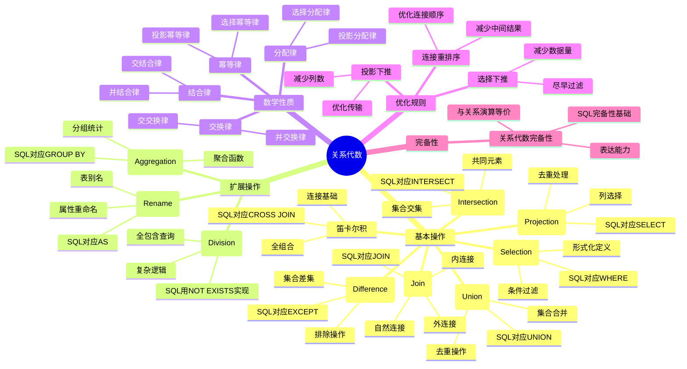

# 关系代数理论

> **创建日期**：2025-01-15
> **最后更新**：2025-01-15
> **版本**：v1.0.0
> **难度**：⭐⭐⭐⭐⭐
> **应用场景**：数据库理论基础、查询优化、SQL语义理解

---

## 📋 目录

- [关系代数理论](#关系代数理论)
  - [📋 目录](#-目录)
  - [一、概述](#一概述)
    - [1.1 关系代数定义](#11-关系代数定义)
    - [1.2 关系代数重要性](#12-关系代数重要性)
    - [1.3 关系代数与SQL对应](#13-关系代数与sql对应)
    - [1.4 关系代数知识体系思维导图](#14-关系代数知识体系思维导图)
  - [二、关系代数基本操作](#二关系代数基本操作)
    - [2.1 选择（Selection）](#21-选择selection)
    - [2.2 投影（Projection）](#22-投影projection)
    - [2.3 并（Union）](#23-并union)
    - [2.4 交（Intersection）](#24-交intersection)
    - [2.5 差（Difference）](#25-差difference)
    - [2.6 笛卡尔积（Cartesian Product）](#26-笛卡尔积cartesian-product)
    - [2.7 连接（Join）](#27-连接join)
  - [三、关系代数扩展操作](#三关系代数扩展操作)
    - [3.1 除（Division）](#31-除division)
    - [3.2 重命名（Rename）](#32-重命名rename)
    - [3.3 聚合（Aggregation）](#33-聚合aggregation)
  - [四、关系代数性质](#四关系代数性质)
    - [4.1 交换律](#41-交换律)
    - [4.2 结合律](#42-结合律)
    - [4.3 分配律](#43-分配律)
    - [4.4 幂等律](#44-幂等律)
  - [五、关系代数完备性](#五关系代数完备性)
    - [5.1 关系代数完备性定义](#51-关系代数完备性定义)
    - [5.2 关系代数完备性证明](#52-关系代数完备性证明)
  - [六、关系代数优化](#六关系代数优化)
    - [6.1 查询优化规则](#61-查询优化规则)
    - [6.2 等价变换规则](#62-等价变换规则)
  - [七、关系代数与SQL对应](#七关系代数与sql对应)
    - [7.1 关系代数到SQL映射](#71-关系代数到sql映射)
    - [7.2 SQL到关系代数转换](#72-sql到关系代数转换)
  - [八、相关资源](#八相关资源)
    - [相关文档](#相关文档)
    - [外部资源](#外部资源)

---

## 一、概述

### 1.1 关系代数定义

**关系代数（Relational Algebra）**是关系模型的操作语言，提供了一组操作符用于查询和操作关系。

**形式化定义**：

```latex
关系代数 = (基本操作, 扩展操作, 组合规则)

基本操作 = {选择, 投影, 并, 交, 差, 笛卡尔积, 连接}
扩展操作 = {除, 重命名, 聚合}
组合规则 = {操作符组合, 嵌套查询}
```

#### 1.1.1 关系代数的历史演进

**历史背景**：

- **1970年**：Codd在关系模型论文中首次提出关系代数的概念
- **1971年**：Codd在论文中详细定义了关系代数的基本操作符
- **1972年**：Codd提出关系代数完备性理论
- **1986年**：SQL-86标准基于关系代数定义SQL语义
- **至今**：关系代数仍然是数据库查询的理论基础

**重要里程碑**：

| 时间 | 事件 | 贡献者 |
|------|------|--------|
| **1970** | 关系代数概念提出 | Codd |
| **1971** | 基本操作符定义 | Codd |
| **1972** | 关系代数完备性理论 | Codd |
| **1986** | SQL标准基于关系代数 | ISO/ANSI |
| **1990s** | 查询优化理论发展 | 学术界和工业界 |

**Codd的原始定义**：

在Codd的原始论文中，关系代数被定义为：

- 一组操作符，用于操作关系
- 每个操作符接受一个或多个关系作为输入，返回一个关系作为输出
- 操作符可以组合使用，形成复杂的查询表达式

#### 1.1.2 关系代数的数学基础

**关系代数的数学基础**：

关系代数基于集合论和关系理论，每个操作符都有严格的数学定义：

```latex
关系代数操作符 f: R₁ × R₂ × ... × Rₙ → R

其中：
- Rᵢ 是输入关系
- R 是输出关系
- f 是关系代数操作符
```

**关系代数的性质**：

1. **封闭性**：关系代数操作的结果仍然是关系
2. **组合性**：操作符可以组合使用
3. **等价性**：不同的表达式可以表示相同的查询

---

### 1.2 关系代数重要性

关系代数的重要性：

1. **理论基础**：SQL查询的数学基础
2. **查询优化**：查询优化器的理论基础
3. **语义定义**：SQL语义的形式化定义
4. **等价性证明**：查询等价性的证明方法
5. **查询转换**：查询重写和优化的基础
6. **标准制定**：SQL标准制定的理论依据

### 1.3 关系代数与SQL对应

**关系代数操作与SQL对应关系**：

| 关系代数 | SQL对应 | 说明 | 示例 |
|---------|---------|------|------|
| σ (选择) | WHERE | 条件过滤 | σ_{age>20}(Student) ↔ SELECT * FROM Student WHERE age > 20 |
| π (投影) | SELECT | 列选择 | π_{id,name}(Student) ↔ SELECT id, name FROM Student |
| ∪ (并) | UNION | 并集操作 | R₁ ∪ R₂ ↔ SELECT *FROM R1 UNION SELECT* FROM R2 |
| ∩ (交) | INTERSECT | 交集操作 | R₁ ∩ R₂ ↔ SELECT *FROM R1 INTERSECT SELECT* FROM R2 |
| - (差) | EXCEPT | 差集操作 | R₁ - R₂ ↔ SELECT *FROM R1 EXCEPT SELECT* FROM R2 |
| × (笛卡尔积) | CROSS JOIN | 笛卡尔积 | R₁ × R₂ ↔ SELECT * FROM R1 CROSS JOIN R2 |
| ⋈ (连接) | JOIN | 连接操作 | R₁ ⋈_{A=B} R₂ ↔ SELECT * FROM R1 JOIN R2 ON R1.A = R2.B |

### 1.4 关系代数知识体系思维导图



---

## 二、关系代数基本操作

### 2.1 选择（Selection）

#### 2.1.1 选择的定义

**选择（Selection）**是关系代数中最基本的操作符之一，用于从关系中选择满足条件的元组。

**Codd的原始定义**：

在Codd的原始论文中，选择操作被定义为：

- 从关系中选择满足给定条件的元组
- 选择操作的结果仍然是关系
- 选择操作是关系代数的基本操作之一

#### 2.1.2 选择的形式化定义

**形式化定义**：

```latex
选择操作：σ_{条件}(R)

σ_{条件}(R) = {t | t ∈ R ∧ 条件(t)}

其中：
- R 是关系
- 条件 是谓词（布尔表达式）
- t 是元组
```

**详细说明**：

1. **输入**：一个关系 R 和一个条件（谓词）
2. **输出**：一个新关系，包含 R 中满足条件的所有元组
3. **结果关系模式**：与输入关系 R 的模式相同

**选择条件的类型**：

- **比较条件**：`A = value`, `A > value`, `A < value` 等
- **逻辑条件**：`条件1 AND 条件2`, `条件1 OR 条件2`, `NOT 条件`
- **范围条件**：`A BETWEEN value1 AND value2`
- **集合条件**：`A IN (value1, value2, ...)`

#### 2.1.3 选择的历史背景

**历史背景**：

- **1970年**：Codd在关系模型论文中首次提出选择操作
- **1971年**：Codd详细定义了选择操作的语义
- **目的**：提供条件过滤的能力，是查询的基础操作

**SQL对应**：

```sql
-- 关系代数：σ_{age>20}(Student)
-- SQL对应：
SELECT * FROM Student WHERE age > 20;
```

**数学性质**：

```latex
\begin{theorem}[选择的幂等性]
σ_{条件}(σ_{条件}(R)) = σ_{条件}(R)
\end{theorem}

\begin{proof}
设 t ∈ σ_{条件}(σ_{条件}(R))

则：t ∈ σ_{条件}(R) ∧ 条件(t)
因此：t ∈ R ∧ 条件(t)
所以：t ∈ σ_{条件}(R)

反之，设 t ∈ σ_{条件}(R)
则：t ∈ R ∧ 条件(t)
因此：t ∈ σ_{条件}(R) ∧ 条件(t)
所以：t ∈ σ_{条件}(σ_{条件}(R))

因此：σ_{条件}(σ_{条件}(R)) = σ_{条件}(R)
\end{proof}
```

**示例**：

```text
关系 R（学生表）：
| 学号 | 姓名 | 年龄 | 专业 |
|------|------|------|------|
| 001  | 张三 | 20   | 计算机 |
| 002  | 李四 | 21   | 数学   |
| 003  | 王五 | 19   | 物理   |

选择操作：σ_{年龄>20}(R)

结果：
| 学号 | 姓名 | 年龄 | 专业 |
|------|------|------|------|
| 002  | 李四 | 21   | 数学   |
```

**SQL对应**：

```sql
-- 关系代数：σ_{年龄>20}(R)
-- SQL对应：
SELECT * FROM Student WHERE 年龄 > 20;
```

### 2.2 投影（Projection）

#### 2.2.1 投影的定义

**投影（Projection）**是关系代数中的基本操作符，用于从关系中选择指定的属性列。

**Codd的原始定义**：

在Codd的原始论文中，投影操作被定义为：

- 从关系中选择指定的属性列
- 投影操作的结果仍然是关系
- 投影操作会自动去除重复的元组

#### 2.2.2 投影的形式化定义

**形式化定义**：

```latex
投影操作：π_{属性列表}(R)

π_{A₁, A₂, ..., Aₖ}(R) = {t[A₁, A₂, ..., Aₖ] | t ∈ R}

其中：
- R 是关系
- A₁, A₂, ..., Aₖ 是属性列表
- t[A₁, A₂, ..., Aₖ] 是元组 t 在属性 A₁, A₂, ..., Aₖ 上的投影
```

**详细说明**：

1. **输入**：一个关系 R 和一个属性列表
2. **输出**：一个新关系，只包含指定的属性
3. **结果关系模式**：只包含指定的属性
4. **去重**：投影操作会自动去除重复的元组

**投影的性质**：

- **去重性**：投影操作会自动去除重复的元组
- **幂等性**：对同一属性集合的多次投影等价于一次投影
- **单调性**：如果属性集合 A ⊆ B，则 π_A(R) ⊆ π_B(R)

#### 2.2.3 投影的历史背景

**历史背景**：

- **1970年**：Codd在关系模型论文中首次提出投影操作
- **1971年**：Codd详细定义了投影操作的语义
- **目的**：提供列选择的能力，是查询的基础操作

**SQL对应**：

```sql
-- 关系代数：π_{id,name}(Student)
-- SQL对应：
SELECT id, name FROM Student;
```

**数学性质**：

```latex
\begin{theorem}[投影的幂等性]
π_{A}(π_{A}(R)) = π_{A}(R)
\end{theorem}

\begin{proof}
设 t ∈ π_{A}(π_{A}(R))

则：∃ t' ∈ π_{A}(R): t = t'[A]
且：∃ t'' ∈ R: t' = t''[A]

因此：t = t''[A]
所以：t ∈ π_{A}(R)

反之，设 t ∈ π_{A}(R)
则：∃ t' ∈ R: t = t'[A]
因此：t ∈ π_{A}(R) 且 t = t[A]
所以：t ∈ π_{A}(π_{A}(R))

因此：π_{A}(π_{A}(R)) = π_{A}(R)
\end{proof}
```

**示例**：

```text
关系 R（学生表）：
| 学号 | 姓名 | 年龄 | 专业 |
|------|------|------|------|
| 001  | 张三 | 20   | 计算机 |
| 002  | 李四 | 21   | 数学   |

投影操作：π_{学号, 姓名}(R)

结果：
| 学号 | 姓名 |
|------|------|
| 001  | 张三 |
| 002  | 李四 |
```

**SQL对应**：

```sql
-- 关系代数：π_{学号, 姓名}(R)
-- SQL对应：
SELECT 学号, 姓名 FROM Student;
```

### 2.3 并（Union）

#### 2.3.1 并的定义

**并（Union）**是关系代数中的集合操作符，用于合并两个关系的元组。

**Codd的原始定义**：

在Codd的原始论文中，并操作被定义为：

- 合并两个关系的所有元组
- 自动去除重复的元组
- 要求两个关系必须有相同的属性集合（并兼容）

#### 2.3.2 并的形式化定义

**形式化定义**：

```latex
并操作：R₁ ∪ R₂

R₁ ∪ R₂ = {t | t ∈ R₁ ∨ t ∈ R₂}

要求：
- R₁ 和 R₂ 必须有相同的属性集合（并兼容）
- 结果关系自动去除重复元组
```

**详细说明**：

1. **输入**：两个关系 R₁ 和 R₂，必须有相同的属性集合
2. **输出**：一个新关系，包含 R₁ 和 R₂ 的所有元组（去除重复）
3. **结果关系模式**：与输入关系相同

**并兼容性要求**：

```latex
R₁ 和 R₂ 并兼容 ⟺
Attributes(R₁) = Attributes(R₂)
```

**数学性质**：

```latex
\begin{theorem}[并的交换律]
R₁ ∪ R₂ = R₂ ∪ R₁
\end{theorem}

\begin{proof}
R₁ ∪ R₂ = {t | t ∈ R₁ ∨ t ∈ R₂}
         = {t | t ∈ R₂ ∨ t ∈ R₁}
         = R₂ ∪ R₁
\end{proof}

\begin{theorem}[并的结合律]
(R₁ ∪ R₂) ∪ R₃ = R₁ ∪ (R₂ ∪ R₃)
\end{theorem}
```

**示例**：

```text
关系 R₁：
| 学号 | 姓名 |
|------|------|
| 001  | 张三 |

关系 R₂：
| 学号 | 姓名 |
|------|------|
| 002  | 李四 |

并操作：R₁ ∪ R₂

结果：
| 学号 | 姓名 |
|------|------|
| 001  | 张三 |
| 002  | 李四 |
```

**SQL对应**：

```sql
-- 关系代数：R₁ ∪ R₂
-- SQL对应：
SELECT * FROM R1
UNION
SELECT * FROM R2;
```

### 2.4 交（Intersection）

#### 2.4.1 交的定义

**交（Intersection）**是关系代数中的集合操作符，用于获取两个关系的共同元组。

**Codd的原始定义**：

在Codd的原始论文中，交操作被定义为：

- 获取同时属于两个关系的元组
- 要求两个关系必须有相同的属性集合（交兼容）

#### 2.4.2 交的形式化定义

**形式化定义**：

```latex
交操作：R₁ ∩ R₂

R₁ ∩ R₂ = {t | t ∈ R₁ ∧ t ∈ R₂}

要求：
- R₁ 和 R₂ 必须有相同的属性集合（交兼容）
```

**详细说明**：

1. **输入**：两个关系 R₁ 和 R₂，必须有相同的属性集合
2. **输出**：一个新关系，包含同时属于 R₁ 和 R₂ 的元组
3. **结果关系模式**：与输入关系相同

**交兼容性要求**：

```latex
R₁ 和 R₂ 交兼容 ⟺
Attributes(R₁) = Attributes(R₂)
```

**交与并的关系**：

```latex
R₁ ∩ R₂ = R₁ - (R₁ - R₂)
```

**数学性质**：

```latex
\begin{theorem}[交的交换律]
R₁ ∩ R₂ = R₂ ∩ R₁
\end{theorem}

\begin{theorem}[交的结合律]
(R₁ ∩ R₂) ∩ R₃ = R₁ ∩ (R₂ ∩ R₃)
\end{theorem}
```

**SQL对应**：

```sql
-- 关系代数：R₁ ∩ R₂
-- SQL对应：
SELECT * FROM R1
INTERSECT
SELECT * FROM R2;
```

### 2.5 差（Difference）

#### 2.5.1 差的定义

**差（Difference）**是关系代数中的集合操作符，用于获取在一个关系中存在但在另一个关系中不存在的元组。

**Codd的原始定义**：

在Codd的原始论文中，差操作被定义为：

- 获取属于第一个关系但不属于第二个关系的元组
- 要求两个关系必须有相同的属性集合（差兼容）

#### 2.5.2 差的形式化定义

**形式化定义**：

```latex
差操作：R₁ - R₂

R₁ - R₂ = {t | t ∈ R₁ ∧ t ∉ R₂}

要求：
- R₁ 和 R₂ 必须有相同的属性集合（差兼容）
```

**详细说明**：

1. **输入**：两个关系 R₁ 和 R₂，必须有相同的属性集合
2. **输出**：一个新关系，包含属于 R₁ 但不属于 R₂ 的元组
3. **结果关系模式**：与输入关系相同

**差兼容性要求**：

```latex
R₁ 和 R₂ 差兼容 ⟺
Attributes(R₁) = Attributes(R₂)
```

**差的性质**：

- **非交换性**：R₁ - R₂ ≠ R₂ - R₁（一般情况下）
- **非结合性**：(R₁ - R₂) - R₃ ≠ R₁ - (R₂ - R₃)（一般情况下）

**数学性质**：

```latex
\begin{theorem}[差的非交换性]
R₁ - R₂ ≠ R₂ - R₁（一般情况下）
\end{theorem}

\begin{theorem}[差的性质]
R₁ - (R₂ ∪ R₃) = (R₁ - R₂) - R₃
\end{theorem}
```

**SQL对应**：

```sql
-- 关系代数：R₁ - R₂
-- SQL对应：
SELECT * FROM R1
EXCEPT
SELECT * FROM R2;
```

### 2.6 笛卡尔积（Cartesian Product）

#### 2.6.1 笛卡尔积的定义

**笛卡尔积（Cartesian Product）**是关系代数中的基本操作符，用于将两个关系的元组组合，生成新的关系。

**Codd的原始定义**：

在Codd的原始论文中，笛卡尔积被定义为：

- 将两个关系的所有元组进行组合
- 结果关系的度等于两个输入关系的度之和
- 结果关系的基数等于两个输入关系的基数的乘积

**历史背景**：

笛卡尔积的概念来源于集合论，由法国数学家笛卡尔（René Descartes）在17世纪提出。在关系代数中，笛卡尔积是连接操作的基础。

#### 2.6.2 笛卡尔积的形式化定义

**形式化定义**：

```latex
笛卡尔积：R₁ × R₂

R₁ × R₂ = {(t₁, t₂) | t₁ ∈ R₁ ∧ t₂ ∈ R₂}

其中：
- (t₁, t₂) 是元组的连接
- 结果关系的度 = 度(R₁) + 度(R₂)
- 结果关系的基数 = |R₁| × |R₂|
```

**详细说明**：

1. **输入**：两个关系 R₁ 和 R₂（不需要属性兼容）
2. **输出**：一个新关系，包含 R₁ 和 R₂ 的所有元组组合
3. **结果关系模式**：包含 R₁ 和 R₂ 的所有属性
4. **结果关系基数**：|R₁| × |R₂|

**笛卡尔积的性质**：

- **非交换性**：R₁ × R₂ ≠ R₂ × R₁（属性顺序不同）
- **结合性**：(R₁ × R₂) × R₃ = R₁ × (R₂ × R₃)

**数学性质**：

```latex
\begin{theorem}[笛卡尔积的基数]
|R₁ × R₂| = |R₁| × |R₂|
\end{theorem}

\begin{proof}
R₁ × R₂ 中的每个元组由 R₁ 中的一个元组和 R₂ 中的一个元组组成。

R₁ 有 |R₁| 个元组，R₂ 有 |R₂| 个元组。

因此，R₁ × R₂ 有 |R₁| × |R₂| 个元组。
\end{proof}
```

**示例**：

```text
关系 R₁：
| A | B |
|---|---|
| 1 | a |
| 2 | b |

关系 R₂：
| C | D |
|---|---|
| x | 1 |
| y | 2 |

笛卡尔积：R₁ × R₂

结果：
| A | B | C | D |
|---|---|---|---|
| 1 | a | x | 1 |
| 1 | a | y | 2 |
| 2 | b | x | 1 |
| 2 | b | y | 2 |
```

**SQL对应**：

```sql
-- 关系代数：R₁ × R₂
-- SQL对应：
SELECT * FROM R1 CROSS JOIN R2;
```

### 2.7 连接（Join）

#### 2.7.1 连接的定义

**连接（Join）**是关系代数中最重要的操作符之一，用于根据条件连接两个关系的元组。

**Codd的原始定义**：

在Codd的原始论文中，连接操作被定义为：

- 根据条件从两个关系的笛卡尔积中选择元组
- 连接操作是关系代数中最常用的操作之一
- 连接操作可以表达关系之间的关联

**历史背景**：

连接操作是关系数据库的核心操作，用于表达关系之间的关联。在SQL中，连接操作是最常用的查询操作之一。

#### 2.7.2 连接的形式化定义

**形式化定义**：

```latex
连接操作：R₁ ⋈_{条件} R₂

R₁ ⋈_{条件} R₂ = σ_{条件}(R₁ × R₂)

其中：
- 条件 是连接条件（通常是等值连接）
```

**详细说明**：

1. **输入**：两个关系 R₁ 和 R₂，以及连接条件
2. **输出**：一个新关系，包含满足连接条件的元组组合
3. **结果关系模式**：包含 R₁ 和 R₂ 的所有属性

**连接的类型**：

- **等值连接（Equijoin）**：连接条件是等值比较
- **自然连接（Natural Join）**：自动匹配相同属性名的等值连接
- **内连接（Inner Join）**：只保留满足连接条件的元组
- **外连接（Outer Join）**：保留不满足连接条件的元组（用NULL填充）

**等值连接（Equijoin）**：

```latex
等值连接：R₁ ⋈_{A=B} R₂

R₁ ⋈_{A=B} R₂ = {t | t ∈ R₁ × R₂ ∧ t[A] = t[B]}
```

**自然连接（Natural Join）**：

```latex
自然连接：R₁ ⋈ R₂

R₁ ⋈ R₂ = {
    t | t ∈ R₁ × R₂
    ∧ ∀ 公共属性 A: t[A] 在 R₁ 和 R₂ 中相同
}
```

**数学性质**：

```latex
\begin{theorem}[连接的交换律]
R₁ ⋈_{条件} R₂ = R₂ ⋈_{条件} R₁
\end{theorem}

\begin{theorem}[连接的结合律]
(R₁ ⋈ R₂) ⋈ R₃ = R₁ ⋈ (R₂ ⋈ R₃)
\end{theorem}
```

**SQL对应**：

```sql
-- 关系代数：R₁ ⋈_{A=B} R₂
-- SQL对应：
SELECT * FROM R1 JOIN R2 ON R1.A = R2.B;

-- 关系代数：R₁ ⋈ R₂（自然连接）
-- SQL对应：
SELECT * FROM R1 NATURAL JOIN R2;
```

---

## 三、关系代数扩展操作

### 3.1 除（Division）

#### 3.1.1 除的定义

**除（Division）**是关系代数中的扩展操作符，用于获取满足特定条件的所有元组。

**Codd的原始定义**：

在Codd的原始论文中，除操作被定义为：

- 获取在第一个关系中存在，且与第二个关系的所有元组都匹配的元组
- 除操作可以表达"全包含"查询
- 除操作不是关系代数的基本操作，可以用其他基本操作表示

#### 3.1.2 除的形式化定义

**形式化定义**：

```latex
除操作：R₁ ÷ R₂

R₁ ÷ R₂ = {
    t | t ∈ π_{R₁-R₂}(R₁)
    ∧ ∀ t₂ ∈ R₂: (t, t₂) ∈ R₁
}

其中：
- R₁-R₂ 表示 R₁ 的属性减去 R₂ 的属性
- ∀ t₂ ∈ R₂ 表示对于 R₂ 中的每个元组 t₂
```

**详细说明**：

1. **输入**：两个关系 R₁ 和 R₂，R₂ 的属性必须是 R₁ 的属性的子集
2. **输出**：一个新关系，包含 R₁ 中与 R₂ 的所有元组都匹配的元组
3. **结果关系模式**：包含 R₁ 的属性减去 R₂ 的属性

**除操作的应用场景**：

- **全包含查询**：找出选择了所有课程的学生
- **完整匹配查询**：找出包含所有指定属性的元组
- **集合包含查询**：找出包含指定集合的所有元素的元组

---

**示例**：

```text
关系 R₁（学生选课）：
| 学号 | 课程号 |
|------|--------|
| 001  | C001   |
| 001  | C002   |
| 002  | C001   |

关系 R₂（课程）：
| 课程号 |
|--------|
| C001   |
| C002   |

除操作：R₁ ÷ R₂

结果（选择了所有课程的学生）：
| 学号 |
|------|
| 001  |
```

### 3.2 重命名（Rename）

#### 3.2.1 重命名的定义

**重命名（Rename）**是关系代数中的基本操作符，用于重命名关系的属性。

**Codd的原始定义**：

在Codd的原始论文中，重命名操作被定义为：

- 重命名关系的属性，不改变关系的内容
- 重命名操作是关系代数完备性要求的基本操作之一
- 重命名操作用于解决属性名冲突和表达复杂查询

#### 3.2.2 重命名的形式化定义

**形式化定义**：

```latex
重命名操作：ρ_{A→B}(R)

ρ_{A→B}(R) = {
    t' | t' 是 t 的属性 A 重命名为 B 后的元组
    ∧ t ∈ R
}
```

**详细说明**：

1. **输入**：一个关系 R 和一个属性重命名映射 A→B
2. **输出**：一个新关系，属性 A 被重命名为 B
3. **结果关系模式**：与输入关系相同，但属性 A 被重命名为 B

**重命名操作的应用场景**：

- **属性名冲突解决**：在连接操作中解决属性名冲突
- **查询简化**：使用更简洁的属性名
- **关系代数完备性**：重命名是关系代数完备性要求的基本操作

### 3.3 聚合（Aggregation）

#### 3.3.1 聚合的定义

**聚合（Aggregation）**是关系代数中的扩展操作符，用于对关系进行分组和聚合计算。

**历史背景**：

聚合操作不是Codd原始关系代数的基本操作，但在实际应用中非常重要。聚合操作在SQL中对应GROUP BY子句和聚合函数。

#### 3.3.2 聚合的形式化定义

**形式化定义**：

```latex
聚合操作：γ_{分组属性, 聚合函数}(R)

γ_{A, F}(R) = {
    (a, f(S)) | a ∈ π_A(R)
    ∧ S = σ_{A=a}(R)
    ∧ f 是聚合函数（SUM, AVG, COUNT等）
}
```

**详细说明**：

1. **输入**：一个关系 R、分组属性 A 和聚合函数 f
2. **输出**：一个新关系，包含每个分组的值和对应的聚合结果
3. **结果关系模式**：包含分组属性和聚合结果

**聚合函数的类型**：

- **COUNT**：计数函数
- **SUM**：求和函数
- **AVG**：平均值函数
- **MAX**：最大值函数
- **MIN**：最小值函数

**聚合操作的应用场景**：

- **统计分析**：计算每个分组的统计信息
- **数据汇总**：对数据进行分组汇总
- **报表生成**：生成汇总报表

---

**SQL对应**：

```sql
-- 关系代数：γ_{专业, COUNT}(R)
-- SQL对应：
SELECT 专业, COUNT(*)
FROM Student
GROUP BY 专业;
```

---

## 四、关系代数性质

### 4.1 交换律

**交换律定理**：

```latex
\begin{theorem}[并的交换律]
R₁ ∪ R₂ = R₂ ∪ R₁
\end{theorem}

\begin{theorem}[交的交换律]
R₁ ∩ R₂ = R₂ ∩ R₁
\end{theorem}

\begin{theorem}[连接的交换律]
R₁ ⋈ R₂ = R₂ ⋈ R₁
\end{theorem}
```

### 4.2 结合律

**结合律定理**：

```latex
\begin{theorem}[并的结合律]
(R₁ ∪ R₂) ∪ R₃ = R₁ ∪ (R₂ ∪ R₃)
\end{theorem}

\begin{theorem}[交的结合律]
(R₁ ∩ R₂) ∩ R₃ = R₁ ∩ (R₂ ∩ R₃)
\end{theorem}

\begin{theorem}[连接的结合律]
(R₁ ⋈ R₂) ⋈ R₃ = R₁ ⋈ (R₂ ⋈ R₃)
\end{theorem}
```

### 4.3 分配律

**分配律定理**：

```latex
\begin{theorem}[选择对并的分配律]
σ_{条件}(R₁ ∪ R₂) = σ_{条件}(R₁) ∪ σ_{条件}(R₂)
\end{theorem}

\begin{theorem}[投影对并的分配律]
π_{A}(R₁ ∪ R₂) = π_{A}(R₁) ∪ π_{A}(R₂)
\end{theorem}

\begin{theorem}[选择对连接的分配律]
σ_{条件}(R₁ ⋈ R₂) = σ_{条件}(R₁) ⋈ σ_{条件}(R₂)
\end{theorem}
```

### 4.4 幂等律

**幂等律定理**：

```latex
\begin{theorem}[选择的幂等性]
σ_{条件}(σ_{条件}(R)) = σ_{条件}(R)
\end{theorem}

\begin{theorem}[投影的幂等性]
π_{A}(π_{A}(R)) = π_{A}(R)
\end{theorem}
```

---

## 五、关系代数完备性

### 5.1 关系代数完备性定义

**关系代数完备性**：

```latex
关系代数完备性定义：

关系代数在表达能力上等价于关系演算，即：
\forall 关系演算查询 q, \exists 关系代数表达式 e:
    Result(q) = Result(e)
```

### 5.2 关系代数完备性证明

**完备性证明**：

```latex
\begin{theorem}[关系代数完备性]
关系代数是关系完备的，当且仅当它包含：
1. 选择操作（σ）
2. 投影操作（π）
3. 并操作（∪）
4. 差操作（-）
5. 笛卡尔积操作（×）
\end{theorem}

\begin{proof}
1. 选择操作：对应关系演算中的存在量词
2. 投影操作：对应关系演算中的属性选择
3. 并操作：对应关系演算中的析取
4. 差操作：对应关系演算中的否定
5. 笛卡尔积：对应关系演算中的合取

因此，关系代数的基本操作足以表达关系演算的所有查询。
\end{proof}
```

---

## 六、关系代数优化

### 6.1 查询优化规则

**优化规则**：

1. **选择下推**：将选择操作尽可能下推到数据源
2. **投影下推**：将投影操作尽可能下推到数据源
3. **连接重排序**：优化连接顺序
4. **消除冗余**：消除冗余操作

### 6.2 等价变换规则

**等价变换规则**：

```latex
\begin{rule}[选择下推规则]
σ_{条件}(R₁ ⋈ R₂) = σ_{条件}(R₁) ⋈ σ_{条件}(R₂)
\end{rule}

\begin{rule}[投影下推规则]
π_{A}(R₁ ⋈ R₂) = π_{A}(π_{A∪B}(R₁) ⋈ π_{A∪C}(R₂))
\end{rule}

\begin{rule}[连接重排序规则]
(R₁ ⋈ R₂) ⋈ R₃ = R₁ ⋈ (R₂ ⋈ R₃)
\end{rule}
```

---

## 七、关系代数与SQL对应

### 7.1 关系代数到SQL映射

**映射规则**：

| 关系代数 | SQL语法 | 示例 |
|---------|---------|------|
| σ_{条件}(R) | SELECT * FROM R WHERE 条件 | SELECT * FROM Student WHERE 年龄 > 20 |
| π_{A}(R) | SELECT A FROM R | SELECT 学号, 姓名 FROM Student |
| R₁ ∪ R₂ | SELECT *FROM R1 UNION SELECT* FROM R2 | - |
| R₁ ∩ R₂ | SELECT *FROM R1 INTERSECT SELECT* FROM R2 | - |
| R₁ - R₂ | SELECT *FROM R1 EXCEPT SELECT* FROM R2 | - |
| R₁ × R₂ | SELECT * FROM R1 CROSS JOIN R2 | - |
| R₁ ⋈_{A=B} R₂ | SELECT * FROM R1 JOIN R2 ON R1.A = R2.B | - |

### 7.2 SQL到关系代数转换

**转换示例**：

```sql
-- SQL查询
SELECT 学号, 姓名
FROM Student
WHERE 年龄 > 20
  AND 专业 = '计算机';
```

**对应的关系代数**：

```latex
π_{学号, 姓名}(σ_{年龄>20 ∧ 专业='计算机'}(Student))
```

---

## 八、相关资源

### 相关文档

- [关系模型理论](./01.01-关系模型理论.md) - 关系模型基础
- [关系演算理论](./01.03-关系演算理论.md) - 关系演算
- [SQL完备性理论](./01.04-SQL完备性理论.md) - SQL完备性

### 外部资源

- Codd, E. F. (1970). "A Relational Model of Data for Large Shared Data Banks"
- Date, C. J. (2003). "An Introduction to Database Systems"

---

**维护者**: SQL Standards Team
**最后更新**: 2025-01-15
