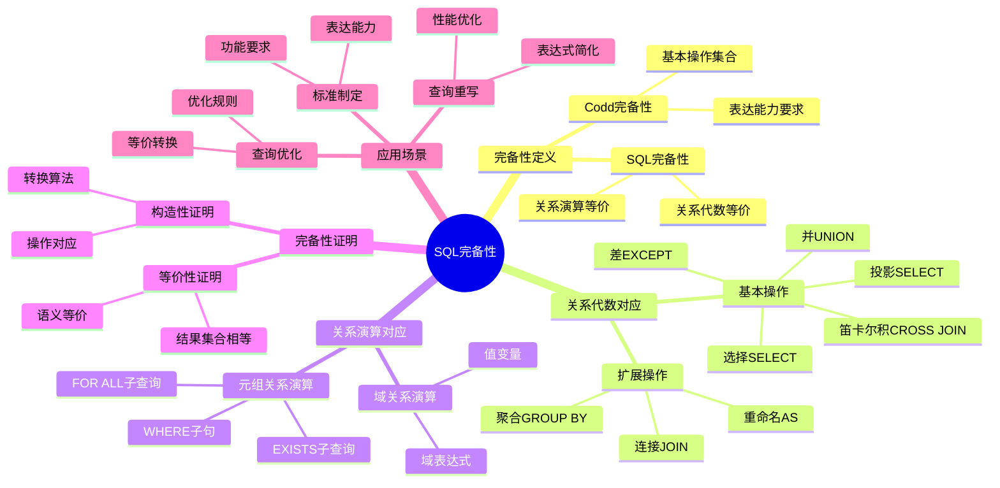
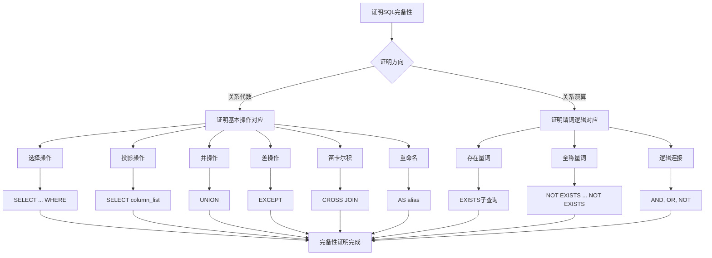

# SQL完备性理论

> **创建日期**：2025-01-15
> **最后更新**：2025-01-16
> **版本**：v1.0.0
> **难度**：⭐⭐⭐⭐⭐
> **应用场景**：数据库理论基础、SQL语义理解、查询优化

---

## 📋 目录

- [SQL完备性理论](#sql完备性理论)
  - [📋 目录](#-目录)
  - [一、概述](#一概述)
    - [1.1 SQL完备性定义](#11-sql完备性定义)
      - [1.1.1 SQL完备性的历史背景](#111-sql完备性的历史背景)
      - [1.1.2 SQL完备性的重要性](#112-sql完备性的重要性)
    - [1.2 Codd完备性](#12-codd完备性)
      - [1.2.1 Codd完备性的定义](#121-codd完备性的定义)
      - [1.2.2 Codd完备性的历史意义](#122-codd完备性的历史意义)
    - [1.3 SQL完备性重要性](#13-sql完备性重要性)
    - [1.4 SQL完备性知识体系思维导图](#14-sql完备性知识体系思维导图)
    - [1.5 SQL完备性证明决策树](#15-sql完备性证明决策树)
  - [二、关系完备性](#二关系完备性)
    - [2.0 关系完备性对比矩阵](#20-关系完备性对比矩阵)
    - [2.1 关系完备性定义](#21-关系完备性定义)
    - [2.2 关系完备性判定](#22-关系完备性判定)
    - [2.3 SQL关系完备性证明](#23-sql关系完备性证明)
      - [2.3.1 SQL关系完备性定理](#231-sql关系完备性定理)
      - [2.3.2 完备性证明的详细步骤](#232-完备性证明的详细步骤)
      - [2.3.2.1 步骤1：证明选择操作对应](#2321-步骤1证明选择操作对应)
      - [2.3.2.2 步骤2：证明投影操作对应](#2322-步骤2证明投影操作对应)
      - [2.3.2.3 步骤3：证明并操作对应](#2323-步骤3证明并操作对应)
      - [2.3.2.4 步骤4：证明差操作对应](#2324-步骤4证明差操作对应)
      - [2.3.2.5 步骤5：证明笛卡尔积对应](#2325-步骤5证明笛卡尔积对应)
      - [2.3.2.6 步骤6：证明重命名操作对应](#2326-步骤6证明重命名操作对应)
      - [2.3.3 完备性证明的历史意义](#233-完备性证明的历史意义)
  - [三、SQL与关系代数对应](#三sql与关系代数对应)
    - [3.1 基本操作对应](#31-基本操作对应)
    - [3.2 扩展操作对应](#32-扩展操作对应)
    - [3.3 对应关系证明](#33-对应关系证明)
  - [四、SQL与关系演算对应](#四sql与关系演算对应)
    - [4.1 元组关系演算对应](#41-元组关系演算对应)
    - [4.2 域关系演算对应](#42-域关系演算对应)
    - [4.3 对应关系证明](#43-对应关系证明)
  - [五、SQL表达能力分析](#五sql表达能力分析)
    - [5.1 SQL表达能力](#51-sql表达能力)
    - [5.2 SQL扩展能力](#52-sql扩展能力)
    - [5.3 SQL局限性](#53-sql局限性)
  - [六、SQL完备性应用](#六sql完备性应用)
    - [6.1 查询优化](#61-查询优化)
    - [6.2 查询等价性](#62-查询等价性)
    - [6.3 查询转换](#63-查询转换)
  - [七、相关资源](#七相关资源)
    - [相关文档](#相关文档)
    - [外部资源](#外部资源)

---

## 一、概述

### 1.1 SQL完备性定义

**SQL完备性（SQL Completeness）**是指SQL语言在表达能力上等价于关系代数或关系演算。

**形式化定义**：

```latex
SQL完备性定义：

SQL是关系完备的，当且仅当：
\forall 关系代数查询 q, \exists SQL查询 s: Result(q) = Result(s)
\forall 关系演算查询 q, \exists SQL查询 s: Result(q) = Result(s)
```

#### 1.1.1 SQL完备性的历史背景

**历史背景**：

- **1970年**：Codd提出关系模型，定义了关系完备性的概念
- **1972年**：Codd在论文中提出了关系完备性的标准定义（Codd完备性）
- **1974年**：IBM开发SEQUEL（SQL前身），设计时考虑了关系完备性
- **1986年**：SQL-86标准发布，SQL被证明是关系完备的
- **1992年**：SQL-92标准进一步增强了SQL的表达能力

**Codd的原始定义**：

在Codd的原始论文中，关系完备性被定义为：

- 一个查询语言是关系完备的，当且仅当它能够表达关系代数的所有基本操作
- 关系完备性是查询语言表达能力的基本要求
- SQL设计时考虑了关系完备性要求

#### 1.1.2 SQL完备性的重要性

SQL完备性的重要性：

1. **理论基础**：证明SQL的表达能力，确保SQL可以表达所有关系查询
2. **查询优化**：查询优化的理论基础，优化器可以基于关系代数进行优化
3. **查询转换**：查询等价转换的基础，可以将SQL查询转换为等价的关系代数表达式
4. **标准制定**：SQL标准制定的依据，确保SQL标准满足关系完备性要求
5. **可移植性**：保证SQL代码在不同数据库系统间的可移植性

### 1.2 Codd完备性

**Codd完备性（Codd Completeness）**是关系完备性的标准定义，由Codd在1972年的论文中提出。

#### 1.2.1 Codd完备性的定义

**Codd完备性要求**：

```latex
\begin{definition}[Codd完备性]
一个查询语言是关系完备的，当且仅当它能够表达：
1. 选择操作（Selection）
2. 投影操作（Projection）
3. 并操作（Union）
4. 差操作（Difference）
5. 笛卡尔积操作（Cartesian Product）
6. 重命名操作（Rename）
\end{definition}
```

#### 1.2.2 Codd完备性的历史意义

**历史意义**：

- **理论基础**：为查询语言的设计提供了理论基础
- **标准定义**：成为关系完备性的标准定义
- **SQL设计**：SQL设计时考虑了Codd完备性要求
- **标准制定**：SQL标准制定时以Codd完备性为依据

### 1.3 SQL完备性重要性

SQL完备性的重要性：

1. **理论基础**：证明SQL的表达能力
2. **查询优化**：查询优化的理论基础
3. **查询转换**：查询等价转换的基础
4. **标准制定**：SQL标准制定的依据

### 1.4 SQL完备性知识体系思维导图



### 1.5 SQL完备性证明决策树



---

## 二、关系完备性

### 2.0 关系完备性对比矩阵

**查询语言完备性对比**：

| 查询语言 | 关系代数对应 | 关系演算对应 | 完备性 | 证明状态 |
|---------|-------------|-------------|--------|---------|
| **SQL** | ✅ 完全对应 | ✅ 完全对应 | ✅ 完备 | ✅ 已证明 |
| **关系代数** | ✅ 自身 | ⚠️ 部分对应 | ✅ 完备 | ✅ 已证明 |
| **元组关系演算** | ⚠️ 部分对应 | ✅ 自身 | ✅ 完备 | ✅ 已证明 |
| **域关系演算** | ⚠️ 部分对应 | ⚠️ 部分对应 | ✅ 完备 | ✅ 已证明 |
| **QBE** | ❌ 不支持 | ✅ 基于域演算 | ⚠️ 部分完备 | ⚠️ 部分证明 |

### 2.1 关系完备性定义

**关系完备性（Relational Completeness）**是查询语言表达能力的基本要求。

**形式化定义**：

```latex
关系完备性定义：

查询语言 L 是关系完备的，当且仅当：
\forall 关系代数表达式 e, \exists L 查询 q:
    Result(e) = Result(q)
```

### 2.2 关系完备性判定

**关系完备性判定定理**：

```latex
\begin{theorem}[关系完备性判定]
查询语言 L 是关系完备的，当且仅当 L 支持：
1. 选择操作：σ_{条件}(R)
2. 投影操作：π_{属性}(R)
3. 并操作：R₁ ∪ R₂
4. 差操作：R₁ - R₂
5. 笛卡尔积操作：R₁ × R₂
6. 重命名操作：ρ_{A→B}(R)
\end{theorem}
```

### 2.3 SQL关系完备性证明

#### 2.3.1 SQL关系完备性定理

**SQL关系完备性证明**：

```latex
\begin{theorem}[SQL关系完备性]
SQL是关系完备的。
\end{theorem}

\begin{proof}
证明SQL支持关系代数的所有基本操作：

1. 选择操作：
   σ_{条件}(R) 对应 SELECT * FROM R WHERE 条件

2. 投影操作：
   π_{A₁, A₂}(R) 对应 SELECT A₁, A₂ FROM R

3. 并操作：
   R₁ ∪ R₂ 对应 SELECT * FROM R1 UNION SELECT * FROM R2

4. 差操作：
   R₁ - R₂ 对应 SELECT * FROM R1 EXCEPT SELECT * FROM R2

5. 笛卡尔积操作：
   R₁ × R₂ 对应 SELECT * FROM R1 CROSS JOIN R2

6. 重命名操作：
   ρ_{A→B}(R) 对应 SELECT A AS B FROM R

因此，SQL支持关系代数的所有基本操作，SQL是关系完备的。
\end{proof}
```

#### 2.3.2 完备性证明的详细步骤

**完备性证明的详细步骤**：

#### 2.3.2.1 步骤1：证明选择操作对应

```latex
\begin{proof}[选择操作对应]
关系代数：σ_{条件}(R)
SQL：SELECT * FROM R WHERE 条件

语义等价性：
σ_{条件}(R) = {t | t ∈ R ∧ 条件(t)}
SELECT * FROM R WHERE 条件 = {t | t ∈ R ∧ 条件(t)}

因此：σ_{条件}(R) = SELECT * FROM R WHERE 条件
\end{proof}
```

#### 2.3.2.2 步骤2：证明投影操作对应

```latex
\begin{proof}[投影操作对应]
关系代数：π_{A₁, A₂}(R)
SQL：SELECT A₁, A₂ FROM R

语义等价性：
π_{A₁, A₂}(R) = {t[A₁, A₂] | t ∈ R}
SELECT A₁, A₂ FROM R = {t[A₁, A₂] | t ∈ R}

因此：π_{A₁, A₂}(R) = SELECT A₁, A₂ FROM R
\end{proof}
```

#### 2.3.2.3 步骤3：证明并操作对应

```latex
\begin{proof}[并操作对应]
关系代数：R₁ ∪ R₂
SQL：SELECT * FROM R1 UNION SELECT * FROM R2

语义等价性：
R₁ ∪ R₂ = {t | t ∈ R₁ ∨ t ∈ R₂}
SELECT * FROM R1 UNION SELECT * FROM R2 = {t | t ∈ R₁ ∨ t ∈ R₂}

因此：R₁ ∪ R₂ = SELECT * FROM R1 UNION SELECT * FROM R2
\end{proof}
```

#### 2.3.2.4 步骤4：证明差操作对应

```latex
\begin{proof}[差操作对应]
关系代数：R₁ - R₂
SQL：SELECT * FROM R1 EXCEPT SELECT * FROM R2

语义等价性：
R₁ - R₂ = {t | t ∈ R₁ ∧ t ∉ R₂}
SELECT * FROM R1 EXCEPT SELECT * FROM R2 = {t | t ∈ R₁ ∧ t ∉ R₂}

因此：R₁ - R₂ = SELECT * FROM R1 EXCEPT SELECT * FROM R2
\end{proof}
```

#### 2.3.2.5 步骤5：证明笛卡尔积对应

```latex
\begin{proof}[笛卡尔积对应]
关系代数：R₁ × R₂
SQL：SELECT * FROM R1 CROSS JOIN R2

语义等价性：
R₁ × R₂ = {(t₁, t₂) | t₁ ∈ R₁ ∧ t₂ ∈ R₂}
SELECT * FROM R1 CROSS JOIN R2 = {(t₁, t₂) | t₁ ∈ R₁ ∧ t₂ ∈ R₂}

因此：R₁ × R₂ = SELECT * FROM R1 CROSS JOIN R2
\end{proof}
```

#### 2.3.2.6 步骤6：证明重命名操作对应

```latex
\begin{proof}[重命名操作对应]
关系代数：ρ_{A→B}(R)
SQL：SELECT A AS B FROM R

语义等价性：
ρ_{A→B}(R) = {t' | t' 是 t 的属性 A 重命名为 B 后的元组 ∧ t ∈ R}
SELECT A AS B FROM R = {t' | t' 是 t 的属性 A 重命名为 B 后的元组 ∧ t ∈ R}

因此：ρ_{A→B}(R) = SELECT A AS B FROM R
\end{proof}
```

#### 2.3.3 完备性证明的历史意义

**历史意义**：

1. **理论基础**：证明了SQL的表达能力，为SQL标准提供了理论基础
2. **标准制定**：SQL标准制定时以关系完备性为依据
3. **查询优化**：为查询优化提供了理论基础
4. **查询转换**：为查询转换提供了依据

---

## 三、SQL与关系代数对应

### 3.1 基本操作对应

**SQL与关系代数基本操作对应**：

| 关系代数 | SQL语法 | 示例 |
|---------|---------|------|
| **σ_{条件}(R)** | SELECT * FROM R WHERE 条件 | SELECT * FROM Student WHERE 年龄 > 20 |
| **π_{A₁, A₂}(R)** | SELECT A₁, A₂ FROM R | SELECT 学号, 姓名 FROM Student |
| **R₁ ∪ R₂** | SELECT *FROM R1 UNION SELECT* FROM R2 | - |
| **R₁ - R₂** | SELECT *FROM R1 EXCEPT SELECT* FROM R2 | - |
| **R₁ × R₂** | SELECT * FROM R1 CROSS JOIN R2 | - |
| **R₁ ⋈_{A=B} R₂** | SELECT * FROM R1 JOIN R2 ON R1.A = R2.B | - |
| **ρ_{A→B}(R)** | SELECT A AS B FROM R | - |

### 3.2 扩展操作对应

**SQL与关系代数扩展操作对应**：

| 关系代数 | SQL语法 | 示例 |
|---------|---------|------|
| **R₁ ∩ R₂** | SELECT *FROM R1 INTERSECT SELECT* FROM R2 | - |
| **R₁ ÷ R₂** | SELECT ... FROM R1 WHERE NOT EXISTS ... | - |
| **γ_{A, F}(R)** | SELECT A, F(...) FROM R GROUP BY A | SELECT 专业, COUNT(*) FROM Student GROUP BY 专业 |

### 3.3 对应关系证明

**对应关系形式化证明**：

```latex
\begin{theorem}[SQL与关系代数对应]
对于每个关系代数表达式 e，存在SQL查询 q，使得：
Result(e) = Result(q)
\end{theorem}

\begin{proof}
通过结构归纳法证明：

基础情况：
1. 关系 R：对应 SELECT * FROM R
2. 选择 σ_{条件}(R)：对应 SELECT * FROM R WHERE 条件
3. 投影 π_{A}(R)：对应 SELECT A FROM R

归纳步骤：
1. 并操作：R₁ ∪ R₂ 对应 UNION
2. 差操作：R₁ - R₂ 对应 EXCEPT
3. 笛卡尔积：R₁ × R₂ 对应 CROSS JOIN
4. 连接：R₁ ⋈ R₂ 对应 JOIN

因此，对于每个关系代数表达式，都存在对应的SQL查询。
\end{proof}
```

---

## 四、SQL与关系演算对应

### 4.1 元组关系演算对应

**SQL与元组关系演算对应**：

| 元组关系演算 | SQL语法 | 示例 |
|------------|---------|------|
| **{t \| R(t)}** | SELECT * FROM R | - |
| **{t \| R(t) ∧ P(t)}** | SELECT * FROM R WHERE P | - |
| **{t \| ∃s (R(s) ∧ t.A = s.A)}** | SELECT A FROM R | - |
| **{t \| R₁(t) ∨ R₂(t)}** | SELECT *FROM R1 UNION SELECT* FROM R2 | - |
| **{t \| R₁(t) ∧ ¬R₂(t)}** | SELECT *FROM R1 EXCEPT SELECT* FROM R2 | - |
| **{t \| R₁(t) ∧ ∃s (R₂(s) ∧ ...)}** | SELECT ... FROM R1 WHERE EXISTS (SELECT ... FROM R2 ...) | - |
| **{t \| R₁(t) ∧ ∀s (R₂(s) ⟹ ...)}** | SELECT ... FROM R1 WHERE NOT EXISTS (SELECT ... FROM R2 WHERE NOT ...) | - |

### 4.2 域关系演算对应

**SQL与域关系演算对应**：

| 域关系演算 | SQL语法 | 示例 |
|----------|---------|------|
| **{<x₁, x₂> \| R(x₁, x₂, ...)}** | SELECT x₁, x₂ FROM R | - |
| **{<x> \| R(x, ...) ∧ x > 20}** | SELECT x FROM R WHERE x > 20 | - |

### 4.3 对应关系证明

**对应关系形式化证明**：

```latex
\begin{theorem}[SQL与关系演算对应]
对于每个关系演算查询 q，存在SQL查询 s，使得：
Result(q) = Result(s)
\end{theorem}

\begin{proof}
通过结构归纳法证明：

基础情况：
1. 原子公式 R(t)：对应 SELECT * FROM R
2. 条件 t[A] θ c：对应 WHERE A θ c

归纳步骤：
1. 合取 P₁ ∧ P₂：对应 WHERE P1 AND P2
2. 析取 P₁ ∨ P₂：对应 UNION
3. 否定 ¬P：对应 EXCEPT 或 NOT EXISTS
4. 存在量词 ∃x P(x)：对应 EXISTS (SELECT ...)
5. 全称量词 ∀x P(x)：对应 NOT EXISTS (SELECT ... WHERE NOT ...)

因此，对于每个关系演算查询，都存在对应的SQL查询。
\end{proof}
```

---

## 五、SQL表达能力分析

### 5.1 SQL表达能力

**SQL表达能力**：

```latex
\begin{theorem}[SQL表达能力]
SQL的表达能力包括：
1. 关系完备性：支持关系代数的所有操作
2. 递归查询：支持递归CTE（WITH RECURSIVE）
3. 聚合操作：支持聚合函数和分组
4. 窗口函数：支持窗口函数和排序
5. 子查询：支持嵌套子查询
\end{theorem}
```

### 5.2 SQL扩展能力

**SQL扩展能力**：

1. **递归查询**：WITH RECURSIVE支持递归查询
2. **窗口函数**：支持窗口函数和排序
3. **JSON支持**：SQL:2016+支持JSON操作
4. **时态数据**：支持时态数据类型和操作

### 5.3 SQL局限性

**SQL局限性**：

1. **图查询**：难以表达复杂的图查询
2. **递归深度**：递归查询的深度限制
3. **计算能力**：某些计算密集型操作效率较低

---

## 六、SQL完备性应用

### 6.1 查询优化

**SQL完备性在查询优化中的应用**：

```latex
查询优化规则基于SQL完备性：

1. 查询重写：利用关系代数等价性重写查询
2. 查询简化：利用关系代数性质简化查询
3. 查询转换：将复杂查询转换为等价简单查询
```

### 6.2 查询等价性

**查询等价性判定**：

```latex
\begin{theorem}[查询等价性判定]
两个SQL查询 q₁ 和 q₂ 等价，当且仅当：
\forall 数据库实例 DB: Result(q₁, DB) = Result(q₂, DB)
\end{theorem}
```

### 6.3 查询转换

**查询转换规则**：

```latex
查询转换规则：

1. 选择下推：σ_{条件}(R₁ ⋈ R₂) = σ_{条件}(R₁) ⋈ σ_{条件}(R₂)
2. 投影下推：π_{A}(R₁ ⋈ R₂) = π_{A}(π_{A∪B}(R₁) ⋈ π_{A∪C}(R₂))
3. 连接重排序：(R₁ ⋈ R₂) ⋈ R₃ = R₁ ⋈ (R₂ ⋈ R₃)
```

---

## 七、相关资源

### 相关文档

- [关系模型理论](./01.01-关系模型理论.md) - 关系模型基础
- [关系代数理论](./01.02-关系代数理论.md) - 关系代数
- [关系演算理论](./01.03-关系演算理论.md) - 关系演算

### 外部资源

- Codd, E. F. (1972). "Relational Completeness of Data Base Sublanguages"
- Date, C. J. (2003). "An Introduction to Database Systems"

---

**维护者**: SQL Standards Team
**最后更新**: 2025-01-16
