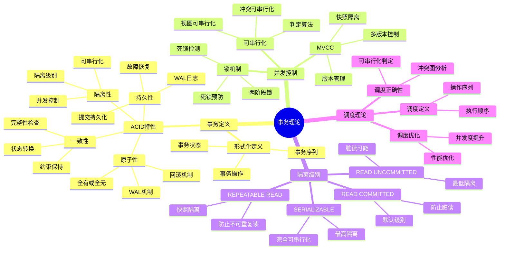
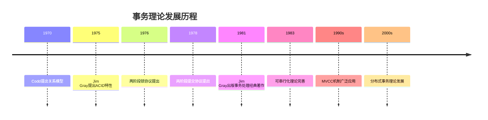
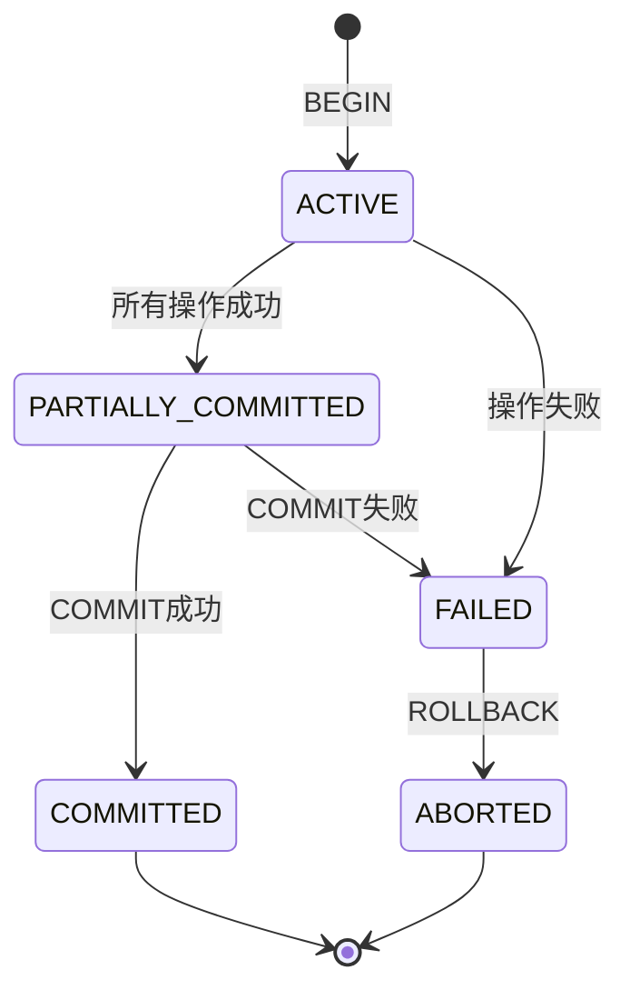

# 事务理论

> **创建日期**：2025-01-15
> **最后更新**：2025-01-16
> **版本**：v1.0.0
> **难度**：⭐⭐⭐⭐⭐
> **应用场景**：事务管理、并发控制、数据库系统设计

---

## 📋 目录

- [事务理论](#事务理论)
  - [📋 目录](#-目录)
  - [一、概述](#一概述)
    - [1.1 事务理论知识体系思维导图](#11-事务理论知识体系思维导图)
    - [1.2 事务理论历史](#12-事务理论历史)
      - [1.2.1 Jim Gray的贡献](#121-jim-gray的贡献)
      - [1.2.2 事务理论发展历程](#122-事务理论发展历程)
      - [1.2.2.1 1970-1975：理论奠基期](#1221-1970-1975理论奠基期)
      - [1.2.2.2 1976-1985：理论完善期](#1222-1976-1985理论完善期)
      - [1.2.2.3 1986-2000：实践应用期](#1223-1986-2000实践应用期)
  - [二、事务的形式化定义](#二事务的形式化定义)
    - [2.1 事务的数学定义](#21-事务的数学定义)
    - [2.2 事务状态的形式化定义](#22-事务状态的形式化定义)
    - [2.3 事务操作的形式化定义](#23-事务操作的形式化定义)
  - [三、ACID特性的形式化定义](#三acid特性的形式化定义)
    - [3.1 原子性（Atomicity）](#31-原子性atomicity)
      - [3.1.1 原子性的形式化定义](#311-原子性的形式化定义)
      - [3.1.2 原子性的必要性证明](#312-原子性的必要性证明)
        - [定理：原子性是事务正确性的必要条件](#定理原子性是事务正确性的必要条件)
      - [3.1.3 原子性的实现机制](#313-原子性的实现机制)
    - [3.2 一致性（Consistency）](#32-一致性consistency)
      - [3.2.1 一致性的形式化定义](#321-一致性的形式化定义)
      - [3.2.2 一致性的必要性证明](#322-一致性的必要性证明)
        - [定理：一致性是数据库正确性的基础](#定理一致性是数据库正确性的基础)
      - [3.2.3 一致性的保证机制](#323-一致性的保证机制)
    - [3.3 隔离性（Isolation）](#33-隔离性isolation)
      - [3.3.1 隔离性的形式化定义](#331-隔离性的形式化定义)
      - [3.3.2 隔离性的必要性证明](#332-隔离性的必要性证明)
        - [定理：隔离性是并发正确性的保证](#定理隔离性是并发正确性的保证)
      - [3.3.3 隔离级别的形式化定义](#333-隔离级别的形式化定义)
    - [3.4 持久性（Durability）](#34-持久性durability)
      - [3.4.1 持久性的形式化定义](#341-持久性的形式化定义)
      - [3.4.2 持久性的必要性证明](#342-持久性的必要性证明)
        - [定理：持久性是数据可靠性的保证](#定理持久性是数据可靠性的保证)
      - [3.4.3 持久性的实现机制](#343-持久性的实现机制)
  - [四、并发控制理论](#四并发控制理论)
    - [4.1 并发调度的形式化定义](#41-并发调度的形式化定义)
    - [4.2 可串行化理论](#42-可串行化理论)
      - [4.2.1 可串行化的形式化定义](#421-可串行化的形式化定义)
      - [4.2.2 可串行化的判定算法](#422-可串行化的判定算法)
        - [冲突图（Precedence Graph）方法](#冲突图precedence-graph方法)
        - [算法：可串行化判定](#算法可串行化判定)
      - [4.2.3 可串行化的充分必要条件证明](#423-可串行化的充分必要条件证明)
        - [定理：冲突图无环是可串行化的充分必要条件](#定理冲突图无环是可串行化的充分必要条件)
    - [4.3 冲突可串行化](#43-冲突可串行化)
      - [4.3.1 冲突操作的定义](#431-冲突操作的定义)
      - [4.3.2 冲突可串行化的判定](#432-冲突可串行化的判定)
      - [4.3.3 冲突可串行化与可串行化的关系](#433-冲突可串行化与可串行化的关系)
        - [定理：冲突可串行化是可串行化的充分条件](#定理冲突可串行化是可串行化的充分条件)
    - [4.4 视图可串行化](#44-视图可串行化)
      - [4.4.1 视图等价的形式化定义](#441-视图等价的形式化定义)
      - [4.4.2 视图可串行化的判定](#442-视图可串行化的判定)
  - [五、隔离级别理论](#五隔离级别理论)
    - [5.1 隔离级别的形式化定义](#51-隔离级别的形式化定义)
    - [5.2 隔离级别与异常的关系](#52-隔离级别与异常的关系)
    - [5.3 隔离级别的正确性证明](#53-隔离级别的正确性证明)
      - [定理：SERIALIZABLE隔离级别保证可串行化](#定理serializable隔离级别保证可串行化)
  - [六、锁机制理论](#六锁机制理论)
    - [6.1 锁的形式化定义](#61-锁的形式化定义)
    - [6.2 两阶段锁协议（2PL）](#62-两阶段锁协议2pl)
      - [6.2.1 2PL的形式化定义](#621-2pl的形式化定义)
      - [6.2.2 2PL保证冲突可串行化的证明](#622-2pl保证冲突可串行化的证明)
        - [定理：2PL保证冲突可串行化](#定理2pl保证冲突可串行化)
    - [6.3 死锁检测和预防](#63-死锁检测和预防)
      - [6.3.1 死锁的形式化定义](#631-死锁的形式化定义)
      - [6.3.2 死锁检测算法](#632-死锁检测算法)
      - [6.3.3 死锁预防策略](#633-死锁预防策略)
  - [七、MVCC理论](#七mvcc理论)
    - [7.1 MVCC的形式化定义](#71-mvcc的形式化定义)
    - [7.2 MVCC与隔离性的关系](#72-mvcc与隔离性的关系)
    - [7.3 MVCC的正确性证明](#73-mvcc的正确性证明)
      - [定理：MVCC保证快照隔离](#定理mvcc保证快照隔离)
  - [八、事务调度的正确性](#八事务调度的正确性)
    - [8.1 调度正确性的形式化定义](#81-调度正确性的形式化定义)
    - [8.2 调度正确性的判定定理](#82-调度正确性的判定定理)
      - [定理：冲突可串行化保证调度正确性](#定理冲突可串行化保证调度正确性)
    - [8.3 调度正确性的证明方法](#83-调度正确性的证明方法)
  - [九、隔离级别选择决策与实现对比 🆕](#九隔离级别选择决策与实现对比-)
    - [9.1 隔离级别选择决策推理](#91-隔离级别选择决策推理)
    - [9.2 PostgreSQL 18 事务实现](#92-postgresql-18-事务实现)
    - [9.3 SQLite 3.45+ 事务实现](#93-sqlite-345-事务实现)
    - [9.4 隔离级别异常场景完整分析](#94-隔离级别异常场景完整分析)
    - [9.5 隔离级别对比矩阵](#95-隔离级别对比矩阵)
  - [十、相关资源](#十相关资源)
    - [相关文档](#相关文档)
    - [外部资源](#外部资源)
      - [经典论文](#经典论文)
      - [经典教材](#经典教材)
      - [在线资源](#在线资源)

---

## 一、概述

**事务理论（Transaction Theory）**是数据库系统的核心理论基础，研究如何保证数据库操作的原子性、一致性、隔离性和持久性（ACID特性）。

**事务理论的重要性**：

1. **数据一致性保证**：确保数据库状态始终满足完整性约束
2. **并发控制基础**：提供并发事务的正确执行保证
3. **系统可靠性**：保证系统故障时的数据恢复能力
4. **性能优化指导**：为事务处理系统设计提供理论依据

### 1.1 事务理论知识体系思维导图



### 1.2 事务理论历史

#### 1.2.1 Jim Gray的贡献

**历史背景**：

1970年代，Jim Gray在IBM工作期间，对事务处理理论做出了开创性贡献：

- **1975年**：提出ACID特性的概念框架
- **1976年**：发表关于事务处理的经典论文
- **1978年**：提出两阶段提交协议（2PC）
- **1981年**：出版《Transaction Processing: Concepts and Techniques》

**Jim Gray（1944-2007）**：

- 美国计算机科学家
- 1998年图灵奖获得者
- 被誉为"事务处理之父"
- 主要贡献：ACID特性、两阶段提交、事务恢复理论

#### 1.2.2 事务理论发展历程

**重要里程碑时间线**：



**详细发展历程**：

#### 1.2.2.1 1970-1975：理论奠基期

- **1970年**：Codd提出关系模型，为事务理论奠定基础
- **1975年**：Jim Gray提出ACID特性的概念框架
- **1976年**：Eswaran等人提出两阶段锁协议（2PL）

#### 1.2.2.2 1976-1985：理论完善期

- **1978年**：Jim Gray提出两阶段提交协议（2PC）
- **1981年**：Jim Gray出版《Transaction Processing: Concepts and Techniques》
- **1983年**：可串行化理论得到完善

#### 1.2.2.3 1986-2000：实践应用期

- **1990s**：MVCC机制在PostgreSQL等数据库中广泛应用
- **1990s**：快照隔离（Snapshot Isolation）理论提出
- **2000s**：分布式事务理论得到发展

---

## 二、事务的形式化定义

### 2.1 事务的数学定义

**事务的形式化定义**：

```text
事务 T 是一个有限的操作序列：
T = \{op_1, op_2, \ldots, op_n\}

其中：
- op_i 是数据库操作（读操作 r_i(x) 或写操作 w_i(x)）
- x 是数据项（数据对象）
- i 是事务标识符

事务必须满足：
1. 事务有明确的开始（BEGIN）和结束（COMMIT 或 ROLLBACK）
2. 事务是原子的：要么全部执行，要么全部不执行
3. 事务的执行结果必须满足一致性约束
```

**事务操作的数学表示**：

```text
设数据项集合为 D = \{x_1, x_2, \ldots, x_m\}

读操作：r_i(x) 表示事务 T_i 读取数据项 x
写操作：w_i(x, v) 表示事务 T_i 将数据项 x 的值写为 v

事务 T_i 的操作序列：
T_i = \{r_i(x_1), w_i(x_2, v_2), r_i(x_3), \ldots\}
```

### 2.2 事务状态的形式化定义

**事务状态机**：

```text
事务状态集合：S = \{ACTIVE, PARTIALLY\_COMMITTED, COMMITTED, FAILED, ABORTED\}

状态转换函数：δ: S × Event → S

状态转换规则：
1. BEGIN → ACTIVE
2. ACTIVE → PARTIALLY\_COMMITTED (所有操作成功)
3. ACTIVE → FAILED (操作失败)
4. PARTIALLY\_COMMITTED → COMMITTED (提交成功)
5. PARTIALLY\_COMMITTED → FAILED (提交失败)
6. FAILED → ABORTED (回滚)
```

**事务状态转换图**：



### 2.3 事务操作的形式化定义

**事务操作的类型**：

```text
操作类型集合：O = \{READ, WRITE, COMMIT, ABORT\}

读操作形式化定义：
READ(T_i, x):
  - 输入：事务 T_i，数据项 x
  - 输出：x 的当前值 v
  - 前提条件：T_i 处于 ACTIVE 状态
  - 后置条件：T_i 读取了 x 的值

写操作形式化定义：
WRITE(T_i, x, v):
  - 输入：事务 T_i，数据项 x，新值 v
  - 输出：无
  - 前提条件：T_i 处于 ACTIVE 状态
  - 后置条件：x 的值被更新为 v（在事务提交前可能不可见）

提交操作形式化定义：
COMMIT(T_i):
  - 输入：事务 T_i
  - 输出：成功或失败
  - 前提条件：T_i 处于 PARTIALLY_COMMITTED 状态
  - 后置条件：T_i 的所有更改永久保存，T_i 进入 COMMITTED 状态

回滚操作形式化定义：
ABORT(T_i):
  - 输入：事务 T_i
  - 输出：无
  - 前提条件：T_i 处于 ACTIVE 或 FAILED 状态
  - 后置条件：T_i 的所有更改被撤销，T_i 进入 ABORTED 状态
```

---

## 三、ACID特性的形式化定义

### 3.1 原子性（Atomicity）

#### 3.1.1 原子性的形式化定义

**原子性的数学定义**：

```text
原子性（Atomicity）：
\forall 事务 T = \{op_1, op_2, \ldots, op_n\}，原子性要求：

T 要么完全执行（所有操作都成功），要么完全不执行（所有操作都不执行）

形式化表示：
Atomicity(T) \Leftrightarrow
  (执行(T) = 完整执行) \vee (执行(T) = 完全不执行)

其中：
- 执行(T) = 完整执行：所有 op_i 都成功执行，且 T 提交
- 执行(T) = 完全不执行：如果任何 op_i 失败，则所有已执行的 op_j (j < i) 都被撤销
```

**原子性的等价定义**：

```text
事务 T 满足原子性，当且仅当：

\forall 数据库状态 S，\forall 操作序列 O = \{op_1, op_2, \ldots, op_n\}：

如果 T 在状态 S 上执行，则：
1. 如果所有 op_i 都成功，则 T 提交，状态变为 S'
2. 如果任何 op_i 失败，则 T 回滚，状态保持为 S

即：S' = S（如果失败）或 S' = T(S)（如果成功）
```

#### 3.1.2 原子性的必要性证明

##### 定理：原子性是事务正确性的必要条件

```text
\begin{theorem}[原子性必要性]
如果事务不满足原子性，则无法保证数据库的一致性。
\end{theorem}

\begin{proof}
反证法：

假设事务 T 不满足原子性，即存在部分执行的情况：
- T 执行了操作 op_1, op_2, \ldots, op_k（k < n）
- 操作 op_{k+1} 失败
- 但 op_1 到 op_k 的更改没有被撤销

考虑一个转账事务：
T = \{w(账户A, 余额-100), w(账户B, 余额+100)\}

如果只执行了第一个操作而第二个操作失败，则：
- 账户A的余额减少了100
- 账户B的余额没有增加
- 总金额不守恒，违反一致性约束

因此，原子性是保证一致性的必要条件。
\end{proof}
```

#### 3.1.3 原子性的实现机制

**实现原子性的机制**：

1. **WAL（Write-Ahead Logging）机制**：
   - 在修改数据前，先写日志
   - 如果事务失败，使用日志回滚

2. **回滚段（Undo Log）**：
   - 保存修改前的数据值
   - 回滚时恢复原始值

3. **两阶段提交（2PC）**：
   - 准备阶段：所有参与者准备提交
   - 提交阶段：所有参与者提交或全部回滚

### 3.2 一致性（Consistency）

#### 3.2.1 一致性的形式化定义

**一致性的数学定义**：

```text
一致性（Consistency）：
设数据库状态集合为 \mathcal{S}，完整性约束集合为 \Phi

一致性要求：
\forall 事务 T，\forall 数据库状态 S \in \mathcal{S}：

如果 S \models \Phi（S 满足约束），且 T 在 S 上执行得到状态 S'，
则 S' \models \Phi（S' 也满足约束）

形式化表示：
Consistency(T) \Leftrightarrow
  \forall S \in \mathcal{S}: (S \models \Phi) \Rightarrow (T(S) \models \Phi)

其中：
- S \models \Phi 表示状态 S 满足约束集合 \Phi
- T(S) 表示事务 T 在状态 S 上执行后的新状态
```

**一致性的等价定义**：

```text
数据库状态 S 是一致的，当且仅当：

S \models \Phi

其中 \Phi 包括：
1. 实体完整性约束：\forall 关系 R，主键唯一且非空
2. 参照完整性约束：\forall 外键 FK，FK 的值必须在被引用关系的主键中存在
3. 用户定义完整性约束：\forall 检查约束 C，C 在 S 上为真

事务 T 满足一致性，当且仅当：
\forall S: (S \models \Phi) \Rightarrow (T(S) \models \Phi)
```

#### 3.2.2 一致性的必要性证明

##### 定理：一致性是数据库正确性的基础

```text
\begin{theorem}[一致性必要性]
如果数据库状态不一致，则查询结果可能不正确。
\end{theorem}

\begin{proof}
设完整性约束 \phi: "账户余额总和 = 初始总额"

如果违反一致性：
- 存在状态 S，使得 S \not\models \phi
- 即：账户余额总和 \neq 初始总额

考虑查询 Q: "查询所有账户余额总和"
- 如果执行 Q，得到的结果与预期不符
- 查询结果不正确

因此，一致性是保证查询正确性的基础。
\end{proof}
```

#### 3.2.3 一致性的保证机制

**保证一致性的机制**：

1. **约束检查**：
   - 在事务执行过程中检查完整性约束
   - 违反约束时回滚事务

2. **触发器**：
   - 自动执行约束检查逻辑
   - 保证数据修改满足业务规则

3. **应用层验证**：
   - 在应用层验证数据有效性
   - 确保输入数据满足约束

### 3.3 隔离性（Isolation）

#### 3.3.1 隔离性的形式化定义

**隔离性的数学定义**：

```text
隔离性（Isolation）：
设并发执行的事务集合为 \mathcal{T} = \{T_1, T_2, \ldots, T_n\}

隔离性要求：
并发执行的结果等价于某种串行执行的结果

形式化表示：
Isolation(\mathcal{T}) \Leftrightarrow
  \exists 串行调度 S: 并发执行(\mathcal{T}) \equiv S

其中：
- 并发执行(\mathcal{T}) 是事务集合 \mathcal{T} 的并发执行结果
- S 是某种串行调度
- \equiv 表示等价（产生相同的结果）
```

**隔离性的等价定义（可串行化）**：

```text
事务集合 \mathcal{T} = \{T_1, T_2, \ldots, T_n\} 的并发执行满足隔离性，
当且仅当存在一个串行调度 S，使得：

\forall 数据库状态 S_0，\forall 数据项 x：

并发执行(\mathcal{T}, S_0) 中 x 的最终值 =
串行执行(S, S_0) 中 x 的最终值

即：并发执行的结果与某个串行执行的结果相同
```

#### 3.3.2 隔离性的必要性证明

##### 定理：隔离性是并发正确性的保证

```text
\begin{theorem}[隔离性必要性]
如果不满足隔离性，并发事务可能产生不一致的结果。
\end{theorem}

\begin{proof}
考虑两个并发事务：

T_1: r_1(x), w_1(x, x+100)  // 转账100
T_2: r_2(x), w_2(x, x+200)  // 转账200

如果不满足隔离性，可能的执行顺序：
1. r_1(x)  // T_1 读取 x = 1000
2. r_2(x)  // T_2 读取 x = 1000
3. w_1(x, 1100)  // T_1 写入 x = 1100
4. w_2(x, 1200)  // T_2 写入 x = 1200（覆盖了 T_1 的写入）

最终结果：x = 1200
正确结果应该是：x = 1300（1000 + 100 + 200）

丢失更新问题，违反一致性。

如果满足隔离性（可串行化），则：
- 要么先执行 T_1 再执行 T_2：x = 1300
- 要么先执行 T_2 再执行 T_1：x = 1300

结果正确。

因此，隔离性是保证并发正确性的必要条件。
\end{proof}
```

#### 3.3.3 隔离级别的形式化定义

**隔离级别的层次结构**：

```text
隔离级别是一个偏序关系：

READ\_UNCOMMITTED \preceq READ\_COMMITTED \preceq
REPEATABLE\_READ \preceq SERIALIZABLE

其中 \preceq 表示"隔离性更弱"（允许更多的并发异常）

形式化定义：

1. READ UNCOMMITTED：
   - 允许脏读、不可重复读、幻读
   - 不保证任何隔离性

2. READ COMMITTED：
   - 防止脏读
   - 允许不可重复读、幻读
   - \forall T_i, T_j: 如果 T_i 提交，则 T_j 可以读取 T_i 的提交值

3. REPEATABLE READ：
   - 防止脏读、不可重复读
   - 允许幻读
   - \forall T_i: 在同一事务中多次读取同一数据项，结果相同

4. SERIALIZABLE：
   - 防止所有异常
   - 完全可串行化
   - \forall 并发执行: \exists 串行调度等价
```

### 3.4 持久性（Durability）

#### 3.4.1 持久性的形式化定义

**持久性的数学定义**：

```text
持久性（Durability）：
\forall 已提交事务 T，\forall 时间 t > commit\_time(T)：

即使在系统故障后恢复，T 的更改仍然存在

形式化表示：
Durability(T) \Leftrightarrow
  \forall t > commit\_time(T):
    (系统恢复(t) \Rightarrow T 的更改 \in 数据库状态)

其中：
- commit\_time(T) 是事务 T 的提交时间
- 系统恢复(t) 表示在时间 t 进行系统恢复
```

**持久性的等价定义**：

```text
事务 T 满足持久性，当且仅当：

如果 COMMIT(T) 成功，则：
\forall 故障 F，\forall 恢复操作 R：

恢复后的数据库状态包含 T 的所有更改

即：恢复后的状态 = 提交时的状态（对于已提交的事务）
```

#### 3.4.2 持久性的必要性证明

##### 定理：持久性是数据可靠性的保证

```text
\begin{theorem}[持久性必要性]
如果不满足持久性，已提交的事务可能丢失。
\end{theorem}

\begin{proof}
考虑一个已提交的转账事务：

T: w(账户A, 余额-100), w(账户B, 余额+100), COMMIT

如果 T 已提交，但系统故障后恢复时：
- 账户A的余额没有减少（丢失了更改）
- 账户B的余额没有增加（丢失了更改）

这违反了用户的预期：
- 用户认为转账已成功（因为收到提交确认）
- 但实际数据没有更新

导致数据不一致和用户信任问题。

因此，持久性是保证数据可靠性的必要条件。
\end{proof}
```

#### 3.4.3 持久性的实现机制

**实现持久性的机制**：

1. **WAL（Write-Ahead Logging）**：
   - 在修改数据前，先写日志到持久化存储
   - 提交时，确保日志已刷新到磁盘

2. **fsync操作**：
   - 强制将缓冲区数据写入磁盘
   - 确保数据物理持久化

3. **检查点（Checkpoint）**：
   - 定期将内存中的数据写入磁盘
   - 减少恢复时间

---

## 四、并发控制理论

### 4.1 并发调度的形式化定义

**调度的数学定义**：

```text
调度（Schedule）是一个操作序列，包含多个事务的操作：

S = \{op_1, op_2, \ldots, op_n\}

其中：
- op_i 是某个事务的操作（读操作或写操作）
- 操作按照时间顺序排列
- 同一事务的操作保持相对顺序

形式化表示：
设事务集合 \mathcal{T} = \{T_1, T_2, \ldots, T_k\}

调度 S 是操作序列，满足：
1. S 包含所有 T_i 的操作
2. \forall T_i，T_i 的操作在 S 中保持相对顺序
3. S 中的操作按时间戳排序
```

**调度的类型**：

```text
1. 串行调度（Serial Schedule）：
   S 是串行的，当且仅当：
   \forall T_i, T_j (i \neq j):
     要么 T_i 的所有操作都在 T_j 的所有操作之前，
     要么 T_j 的所有操作都在 T_i 的所有操作之前

2. 并发调度（Concurrent Schedule）：
   S 是并发的，当且仅当：
   \exists T_i, T_j (i \neq j):
     T_i 和 T_j 的操作交错执行

3. 可串行化调度（Serializable Schedule）：
   S 是可串行化的，当且仅当：
   \exists 串行调度 S': S \equiv S'
```

### 4.2 可串行化理论

#### 4.2.1 可串行化的形式化定义

**可串行化的数学定义**：

```text
调度 S 是可串行化的，当且仅当：

\forall 数据库初始状态 S_0，\forall 数据项 x：

S 在 S_0 上执行后 x 的最终值 =
某个串行调度 S' 在 S_0 上执行后 x 的最终值

形式化表示：
Serializable(S) \Leftrightarrow
  \exists 串行调度 S':
    \forall S_0, \forall x: Result(S, S_0, x) = Result(S', S_0, x)

其中：
- Result(S, S_0, x) 表示调度 S 在初始状态 S_0 上执行后 x 的最终值
```

#### 4.2.2 可串行化的判定算法

##### 冲突图（Precedence Graph）方法

```text
冲突图 G = (V, E)：
- 顶点集合 V = \{T_1, T_2, \ldots, T_n\}（事务集合）
- 边集合 E：如果 T_i 的某个操作在 T_j 的某个冲突操作之前，则 (T_i, T_j) \in E

冲突操作定义：
两个操作 op_i 和 op_j 冲突，当且仅当：
1. op_i 和 op_j 属于不同事务
2. op_i 和 op_j 操作同一个数据项
3. op_i 和 op_j 至少有一个是写操作

判定定理：
调度 S 是冲突可串行化的，当且仅当冲突图 G 是无环的（DAG）
```

##### 算法：可串行化判定

```text
算法：Conflict-Serializable(S)
输入：调度 S
输出：是否冲突可串行化

1. 构建冲突图 G = (V, E)
   - V = 所有事务
   - 对于每对冲突操作 (op_i, op_j)：
     如果 op_i 在 S 中先于 op_j，则添加边 (T_i, T_j)

2. 检查 G 是否有环
   - 使用拓扑排序或DFS检测环

3. 如果 G 无环，返回 TRUE（冲突可串行化）
   否则，返回 FALSE（不可串行化）
```

#### 4.2.3 可串行化的充分必要条件证明

##### 定理：冲突图无环是可串行化的充分必要条件

```text
\begin{theorem}[冲突可串行化判定定理]
调度 S 是冲突可串行化的，当且仅当 S 的冲突图 G 是无环的。
\end{theorem}

\begin{proof}
（充分性）如果 G 无环，则 S 是冲突可串行化的：

由于 G 是无环有向图（DAG），存在拓扑排序。
设拓扑排序为 T_{i_1}, T_{i_2}, \ldots, T_{i_n}。

构造串行调度 S' = T_{i_1}; T_{i_2}; \ldots; T_{i_n}。

对于任意冲突操作对 (op_i, op_j)：
- 如果 op_i 在 S 中先于 op_j，则 (T_i, T_j) \in E
- 在拓扑排序中，T_i 在 T_j 之前
- 在 S' 中，T_i 的所有操作在 T_j 的所有操作之前
- 因此，op_i 在 S' 中也先于 op_j

所以 S 和 S' 是冲突等价的，S 是冲突可串行化的。

（必要性）如果 S 是冲突可串行化的，则 G 无环：

反证法：假设 G 有环，即存在 T_1 \to T_2 \to \ldots \to T_k \to T_1。

这意味着：
- T_1 的某个操作在 T_2 的某个冲突操作之前
- T_2 的某个操作在 T_3 的某个冲突操作之前
- ...
- T_k 的某个操作在 T_1 的某个冲突操作之前

对于任何串行调度 S'，不可能同时满足这些顺序要求（因为会产生循环依赖）。

因此，S 不可能是冲突可串行化的，矛盾。

所以，如果 S 是冲突可串行化的，则 G 必须无环。
\end{proof}
```

### 4.3 冲突可串行化

#### 4.3.1 冲突操作的定义

**冲突操作的数学定义**：

```text
两个操作 op_i 和 op_j 冲突（Conflict），当且仅当：

1. op_i 和 op_j 属于不同事务：T(op_i) \neq T(op_j)
2. op_i 和 op_j 操作同一个数据项：Item(op_i) = Item(op_j)
3. op_i 和 op_j 至少有一个是写操作：
   (Type(op_i) = WRITE) \vee (Type(op_j) = WRITE)

形式化表示：
Conflict(op_i, op_j) \Leftrightarrow
  (T(op_i) \neq T(op_j)) \wedge
  (Item(op_i) = Item(op_j)) \wedge
  ((Type(op_i) = WRITE) \vee (Type(op_j) = WRITE))
```

**冲突操作的类型**：

```text
1. 读-写冲突（Read-Write Conflict）：
   r_i(x) 和 w_j(x) 冲突（i \neq j）
   - 如果 r_i(x) 在 w_j(x) 之前，可能读到旧值
   - 如果 w_j(x) 在 r_i(x) 之前，可能读到未提交的值

2. 写-读冲突（Write-Read Conflict）：
   w_i(x) 和 r_j(x) 冲突（i \neq j）
   - 如果 w_i(x) 在 r_j(x) 之前，r_j 可能读到未提交的值（脏读）

3. 写-写冲突（Write-Write Conflict）：
   w_i(x) 和 w_j(x) 冲突（i \neq j）
   - 如果 w_i(x) 在 w_j(x) 之前，w_j 可能覆盖 w_i 的写入（丢失更新）
```

#### 4.3.2 冲突可串行化的判定

**冲突等价（Conflict Equivalence）**：

```text
两个调度 S_1 和 S_2 是冲突等价的，当且仅当：

1. S_1 和 S_2 包含相同的事务集合
2. S_1 和 S_2 包含相同的操作集合
3. \forall 冲突操作对 (op_i, op_j)：
   如果 op_i 在 S_1 中先于 op_j，则 op_i 在 S_2 中也先于 op_j

形式化表示：
S_1 \equiv_c S_2 \Leftrightarrow
  (\forall Conflict(op_i, op_j):
    (op_i <_{S_1} op_j) \Leftrightarrow (op_i <_{S_2} op_j))

其中 <_S 表示在调度 S 中的顺序关系
```

**冲突可串行化定义**：

```text
调度 S 是冲突可串行化的，当且仅当：

\exists 串行调度 S': S \equiv_c S'

即：S 与某个串行调度冲突等价
```

#### 4.3.3 冲突可串行化与可串行化的关系

##### 定理：冲突可串行化是可串行化的充分条件

```text
\begin{theorem}
如果调度 S 是冲突可串行化的，则 S 是可串行化的。
\end{theorem}

\begin{proof}
如果 S 是冲突可串行化的，则存在串行调度 S' 使得 S \equiv_c S'。

对于任意数据库初始状态 S_0，任意数据项 x：

由于 S 和 S' 是冲突等价的，所有冲突操作的顺序相同。
因此，对于 x 的读写操作顺序相同，最终值相同。

所以 Result(S, S_0, x) = Result(S', S_0, x)。

因此，S 是可串行化的。
\end{proof}

注意：逆命题不成立。存在可串行化但不是冲突可串行化的调度（视图可串行化）。
```

### 4.4 视图可串行化

#### 4.4.1 视图等价的形式化定义

**视图等价的数学定义**：

```text
两个调度 S_1 和 S_2 是视图等价的，当且仅当：

1. \forall 事务 T_i，T_i 在 S_1 和 S_2 中读取的值相同
2. \forall 数据项 x，x 在 S_1 和 S_2 中的最终值相同
3. \forall 写操作 w_i(x)，如果 w_i(x) 是 x 的最终写入，则：
   在 S_1 和 S_2 中，w_i(x) 都是 x 的最终写入

形式化表示：
S_1 \equiv_v S_2 \Leftrightarrow
  (\forall T_i, \forall r_i(x): Value(S_1, r_i(x)) = Value(S_2, r_i(x))) \wedge
  (\forall x: FinalValue(S_1, x) = FinalValue(S_2, x)) \wedge
  (\forall w_i(x): FinalWrite(S_1, x) = w_i(x) \Leftrightarrow FinalWrite(S_2, x) = w_i(x))
```

#### 4.4.2 视图可串行化的判定

**视图可串行化定义**：

```text
调度 S 是视图可串行化的，当且仅当：

\exists 串行调度 S': S \equiv_v S'

即：S 与某个串行调度视图等价
```

**视图可串行化与冲突可串行化的关系**：

```text
\begin{theorem}
冲突可串行化 \subset 视图可串行化
\end{theorem}

\begin{proof}
如果 S 是冲突可串行化的，则 S 是视图可串行化的（已证明）。

但存在视图可串行化但不是冲突可串行化的调度。

例如：
S = r_1(x), w_2(x), w_1(x), w_2(x)

这个调度是视图可串行化的（等价于 T_1; T_2），
但不是冲突可串行化的（冲突图有环）。
\end{proof}
```

---

## 五、隔离级别理论

### 5.1 隔离级别的形式化定义

**隔离级别的层次结构**：

```text
隔离级别是一个偏序关系：

IsolationLevel = \{READ\_UNCOMMITTED, READ\_COMMITTED,
                  REPEATABLE\_READ, SERIALIZABLE\}

READ\_UNCOMMITTED \preceq READ\_COMMITTED \preceq
REPEATABLE\_READ \preceq SERIALIZABLE

其中 \preceq 表示"隔离性更弱"（允许更多的并发异常）
```

**各隔离级别的形式化定义**：

```text
1. READ UNCOMMITTED：
   \forall 事务 T_i, T_j (i \neq j):
   - 允许 T_i 读取 T_j 未提交的写入（脏读）
   - 不保证任何隔离性

2. READ COMMITTED：
   \forall 事务 T_i, T_j (i \neq j):
   - T_i 只能读取 T_j 已提交的写入
   - 防止脏读：\forall r_i(x): Value(r_i(x)) 来自已提交的事务
   - 允许不可重复读和幻读

3. REPEATABLE READ：
   \forall 事务 T_i:
   - T_i 在同一事务中多次读取同一数据项，结果相同
   - 防止脏读和不可重复读
   - 允许幻读

4. SERIALIZABLE：
   \forall 并发执行 S:
   - S 是可串行化的
   - 防止所有异常（脏读、不可重复读、幻读）
```

### 5.2 隔离级别与异常的关系

**并发异常的形式化定义**：

```text
1. 脏读（Dirty Read）：
   \exists 事务 T_i, T_j (i \neq j):
   - T_j 写入 x: w_j(x, v)
   - T_i 读取 x: r_i(x) = v
   - T_j 回滚：ABORT(T_j)
   - T_i 读取了未提交的数据

2. 不可重复读（Non-Repeatable Read）：
   \exists 事务 T_i:
   - T_i 读取 x: r_i(x) = v_1
   - 另一个事务修改 x: w_j(x, v_2), COMMIT(T_j)
   - T_i 再次读取 x: r_i(x) = v_2 \neq v_1
   - 同一事务中两次读取结果不同

3. 幻读（Phantom Read）：
   \exists 事务 T_i:
   - T_i 执行范围查询: SELECT * FROM R WHERE condition
   - 另一个事务插入满足条件的元组: INSERT INTO R ...
   - T_i 再次执行相同查询，结果集不同
   - 出现了"幻影"元组
```

**隔离级别与异常的关系矩阵**：

| 隔离级别 | 脏读 | 不可重复读 | 幻读 |
|---------|------|-----------|------|
| **READ UNCOMMITTED** | ❌ 可能 | ❌ 可能 | ❌ 可能 |
| **READ COMMITTED** | ✅ 防止 | ❌ 可能 | ❌ 可能 |
| **REPEATABLE READ** | ✅ 防止 | ✅ 防止 | ❌ 可能 |
| **SERIALIZABLE** | ✅ 防止 | ✅ 防止 | ✅ 防止 |

### 5.3 隔离级别的正确性证明

#### 定理：SERIALIZABLE隔离级别保证可串行化

```text
\begin{theorem}
如果事务在 SERIALIZABLE 隔离级别下执行，则并发执行是可串行化的。
\end{theorem}

\begin{proof}
SERIALIZABLE 隔离级别的定义要求：
\forall 并发执行 S: S 是可串行化的

根据可串行化的定义：
\exists 串行调度 S': S \equiv S'

因此，SERIALIZABLE 隔离级别保证：
- 并发执行的结果与某个串行执行的结果相同
- 不会出现任何并发异常
- 数据一致性得到保证
\end{proof}
```

---

## 六、锁机制理论

### 6.1 锁的形式化定义

**锁的数学定义**：

```text
锁类型集合：LockType = \{SHARED, EXCLUSIVE\}

锁操作：
- LOCK(T_i, x, mode): 事务 T_i 以模式 mode 锁定数据项 x
- UNLOCK(T_i, x): 事务 T_i 释放数据项 x 的锁

锁的兼容性：
- SHARED 锁与 SHARED 锁兼容
- SHARED 锁与 EXCLUSIVE 锁不兼容
- EXCLUSIVE 锁与任何锁都不兼容

形式化表示：
Compatible(mode_1, mode_2) \Leftrightarrow
  (mode_1 = SHARED) \wedge (mode_2 = SHARED)
```

### 6.2 两阶段锁协议（2PL）

#### 6.2.1 2PL的形式化定义

**两阶段锁协议的定义**：

```text
事务 T 满足两阶段锁协议（2PL），当且仅当：

T 的锁操作分为两个阶段：
1. 增长阶段（Growing Phase）：只能获取锁，不能释放锁
2. 收缩阶段（Shrinking Phase）：只能释放锁，不能获取锁

形式化表示：
2PL(T) \Leftrightarrow
  \exists 操作 op_k \in T:
    (\forall op_i < op_k: op_i 是 LOCK 操作) \wedge
    (\forall op_j \geq op_k: op_j 是 UNLOCK 操作)

其中 op_k 是第一个 UNLOCK 操作（锁点）
```

#### 6.2.2 2PL保证冲突可串行化的证明

##### 定理：2PL保证冲突可串行化

```text
\begin{theorem}[2PL定理]
如果所有事务都遵循两阶段锁协议，则任何调度都是冲突可串行化的。
\end{theorem}

\begin{proof}
设调度 S 中所有事务都遵循 2PL。

对于任意冲突操作对 (op_i, op_j)，其中：
- op_i 属于事务 T_i
- op_j 属于事务 T_j
- op_i 在 S 中先于 op_j

由于 op_i 和 op_j 冲突，T_i 和 T_j 必须对同一数据项加锁。

由于 T_i 遵循 2PL：
- T_i 在 op_i 之前获取锁
- T_i 在 op_i 之后释放锁（在锁点之后）

由于 op_i 在 op_j 之前，且 T_i 在 op_i 之后释放锁：
- T_j 必须在 T_i 释放锁之后才能获取锁
- 因此，T_j 的锁点在 T_i 的锁点之后

构造冲突图 G：
- 如果 T_i 的锁点在 T_j 的锁点之前，则添加边 (T_i, T_j)

由于锁点的顺序是线性的（全序），G 是无环的。

根据冲突可串行化判定定理，S 是冲突可串行化的。
\end{proof}
```

### 6.3 死锁检测和预防

#### 6.3.1 死锁的形式化定义

**死锁的数学定义**：

```text
死锁（Deadlock）：
\exists 事务集合 \{T_1, T_2, \ldots, T_n\} (n \geq 2)：

\forall i \in [1, n]:
  T_i 等待 T_{(i \bmod n) + 1} 释放锁

形式化表示：
Deadlock(\{T_1, T_2, \ldots, T_n\}) \Leftrightarrow
  \forall i: WaitFor(T_i, T_{(i \bmod n) + 1})

其中 WaitFor(T_i, T_j) 表示 T_i 等待 T_j 释放锁
```

**等待图（Wait-For Graph）**：

```text
等待图 G = (V, E)：
- 顶点集合 V = 所有活动事务
- 边集合 E: 如果 T_i 等待 T_j 释放锁，则 (T_i, T_j) \in E

死锁判定定理：
存在死锁，当且仅当等待图 G 中存在环
```

#### 6.3.2 死锁检测算法

**死锁检测算法**：

```text
算法：Deadlock-Detection(G)
输入：等待图 G = (V, E)
输出：是否存在死锁

1. 使用DFS或BFS检测 G 中是否存在环

2. 如果存在环，返回 TRUE（存在死锁）
   否则，返回 FALSE（无死锁）

时间复杂度：O(|V| + |E|)
```

#### 6.3.3 死锁预防策略

**死锁预防策略**：

```text
1. 锁超时（Lock Timeout）：
   \forall 锁请求：如果等待时间 > timeout，则回滚事务

2. 死锁预防（Deadlock Prevention）：
   - 按时间戳顺序获取锁
   - 如果 T_i 的时间戳 < T_j 的时间戳，且 T_i 等待 T_j，则回滚 T_j

3. 死锁避免（Deadlock Avoidance）：
   - 在获取锁前检查是否会导致死锁
   - 如果会，则等待或回滚
```

---

## 七、MVCC理论

### 7.1 MVCC的形式化定义

**MVCC的数学定义**：

```text
多版本并发控制（MVCC）：
\forall 数据项 x，维护多个版本：Versions(x) = \{v_1, v_2, \ldots, v_n\}

每个版本 v_i 关联：
- 创建事务：creator(v_i)
- 创建时间：create_time(v_i)
- 删除时间：delete_time(v_i)（如果已删除）

读操作：
r_i(x) 返回满足条件的版本：
  v = argmax_{v \in Versions(x)} create_time(v)
  s.t. create_time(v) \leq snapshot_time(T_i) \wedge
       (delete_time(v) = NULL \vee delete_time(v) > snapshot_time(T_i))

写操作：
w_i(x, v) 创建新版本：
  v_{new} = create_version(x, v, T_i, current_time)
  Versions(x) = Versions(x) \cup \{v_{new}\}
```

### 7.2 MVCC与隔离性的关系

**MVCC实现隔离级别**：

```text
1. READ COMMITTED：
   snapshot_time(T_i) = 每个语句开始时间
   - 每个语句看到已提交的最新版本

2. REPEATABLE READ：
   snapshot_time(T_i) = 事务开始时间
   - 整个事务看到一致的快照

3. SERIALIZABLE：
   - 使用可串行化快照隔离（SSI）
   - 检测写-写冲突和写-读冲突
```

### 7.3 MVCC的正确性证明

#### 定理：MVCC保证快照隔离

```text
\begin{theorem}
MVCC机制保证每个事务看到一致的数据库快照。
\end{theorem}

\begin{proof}
对于事务 T_i，设快照时间为 t_i。

\forall 数据项 x，T_i 读取的版本 v 满足：
- create_time(v) \leq t_i
- delete_time(v) = NULL \vee delete_time(v) > t_i

因此，T_i 看到的是时间 t_i 的数据库状态快照。

由于所有读取都基于同一快照时间 t_i，快照是一致的。

因此，MVCC保证快照隔离。
\end{proof}
```

---

## 八、事务调度的正确性

### 8.1 调度正确性的形式化定义

**调度正确性的定义**：

```text
调度 S 是正确的，当且仅当：

1. S 是可串行化的
2. S 满足所有完整性约束
3. S 不会导致死锁（如果使用锁机制）

形式化表示：
Correct(S) \Leftrightarrow
  Serializable(S) \wedge
  (\forall \phi \in \Phi: S \models \phi) \wedge
  (\neg Deadlock(S))
```

### 8.2 调度正确性的判定定理

#### 定理：冲突可串行化保证调度正确性

```text
\begin{theorem}
如果调度 S 是冲突可串行化的，且所有事务满足完整性约束，则 S 是正确的。
\end{theorem}

\begin{proof}
如果 S 是冲突可串行化的，则：
\exists 串行调度 S': S \equiv_c S'

由于 S' 是串行的，且每个事务满足完整性约束：
- S' 满足所有完整性约束
- S' 是正确的

由于 S \equiv_c S'，S 和 S' 产生相同的结果：
- S 也满足所有完整性约束
- S 是正确的

因此，冲突可串行化保证调度正确性。
\end{proof}
```

### 8.3 调度正确性的证明方法

**证明调度正确性的方法**：

1. **冲突图方法**：
   - 构建冲突图
   - 检查是否有环
   - 如果无环，则冲突可串行化

2. **等价变换方法**：
   - 通过交换非冲突操作
   - 将并发调度转换为串行调度
   - 如果成功，则冲突可串行化

3. **形式化验证方法**：
   - 使用形式化工具（如TLA+、Coq）
   - 证明调度的可串行化性质

---

## 九、隔离级别选择决策与实现对比 🆕

### 9.1 隔离级别选择决策推理

**决策推理框架**：

```text
隔离级别选择形式化决策规则
──────────────────────────────────────────────────

规则1: 金融交易系统
  前提:
    - 涉及金额转账
    - 不允许任何并发异常
    - 数据一致性优先于性能
  结论: 选择 SERIALIZABLE
  推理: 金额错误可能导致严重后果，必须保证完全隔离

规则2: 报表查询系统
  前提:
    - 只读查询为主
    - 可接受查询期间数据变化
    - 性能优先
  结论: 选择 READ COMMITTED
  推理: 只读查询不需要强隔离，RC提供最佳性能

规则3: 电商库存系统
  前提:
    - 需要防止超卖
    - 读取后可能更新
    - 中等一致性要求
  结论: 选择 REPEATABLE READ + 乐观锁
  推理: RR防止不可重复读，乐观锁处理更新冲突

规则4: 日志/审计系统
  前提:
    - 仅追加操作
    - 无更新/删除
    - 最高性能要求
  结论: 选择 READ UNCOMMITTED (如果可接受)
  推理: 追加操作不存在并发冲突
```

**决策树**：

```text
隔离级别选择决策树
──────────────────────────────────────────────────

[应用类型]
    │
    ├──→ 金融/支付系统 ───→ SERIALIZABLE ✓
    │
    ├──→ 电商系统
    │         │
    │         ├──→ 库存扣减 ───→ REPEATABLE READ + SELECT FOR UPDATE
    │         │
    │         └──→ 商品浏览 ───→ READ COMMITTED
    │
    ├──→ 分析/报表系统 ───→ READ COMMITTED / SNAPSHOT
    │
    ├──→ 日志系统 ───→ READ UNCOMMITTED (如果支持)
    │
    └──→ 通用OLTP ───→ READ COMMITTED (PostgreSQL默认)
```

### 9.2 PostgreSQL 18 事务实现

**PostgreSQL隔离级别实现**：

```sql
-- PostgreSQL 18: 查看当前隔离级别
SHOW transaction_isolation;

-- 设置隔离级别
SET TRANSACTION ISOLATION LEVEL READ COMMITTED;
SET TRANSACTION ISOLATION LEVEL REPEATABLE READ;
SET TRANSACTION ISOLATION LEVEL SERIALIZABLE;

-- 注意: PostgreSQL不支持READ UNCOMMITTED，自动升级为READ COMMITTED
```

**PostgreSQL MVCC实现细节**：

```text
PostgreSQL 18 MVCC机制
──────────────────────────────────────────────────

每个元组包含系统列:
- xmin: 创建该版本的事务ID
- xmax: 删除/更新该版本的事务ID
- cmin/cmax: 命令ID（同一事务内的操作顺序）

可见性规则:
  Visible(tuple, txn) ⟺
    (xmin已提交 ∧ xmin < txn.snapshot) ∧
    (xmax未设置 ∨ xmax未提交 ∨ xmax > txn.snapshot)

快照隔离 (REPEATABLE READ):
- 事务开始时获取快照
- 所有查询使用同一快照
- 更新时检测写-写冲突

序列化快照隔离 SSI (SERIALIZABLE):
- 基于快照隔离
- 额外检测读-写冲突
- 通过SIReadLock追踪读取
```

**PostgreSQL 18 实际示例**：

```sql
-- PostgreSQL 18: 银行转账的SERIALIZABLE事务
BEGIN ISOLATION LEVEL SERIALIZABLE;

-- 检查余额
SELECT balance FROM accounts WHERE account_id = 'A001' FOR UPDATE;

-- 扣减源账户
UPDATE accounts SET balance = balance - 1000 WHERE account_id = 'A001';

-- 增加目标账户
UPDATE accounts SET balance = balance + 1000 WHERE account_id = 'A002';

-- 记录交易日志
INSERT INTO transactions (from_account, to_account, amount, created_at)
VALUES ('A001', 'A002', 1000, NOW());

COMMIT;

-- 如果发生序列化冲突，PostgreSQL返回错误:
-- ERROR: could not serialize access due to read/write dependencies among transactions
-- 应用程序应重试事务
```

### 9.3 SQLite 3.45+ 事务实现

**SQLite隔离级别**：

```sql
-- SQLite: 只支持两种隔离模式
-- 1. DEFERRED (默认): 延迟获取锁
-- 2. IMMEDIATE: 立即获取RESERVED锁
-- 3. EXCLUSIVE: 立即获取EXCLUSIVE锁

BEGIN DEFERRED;    -- 第一次读取时获取SHARED锁
BEGIN IMMEDIATE;   -- 立即获取RESERVED锁，阻止其他写入
BEGIN EXCLUSIVE;   -- 立即获取EXCLUSIVE锁，阻止所有其他访问

-- SQLite 3.45+ WAL模式下的并发
PRAGMA journal_mode = WAL;  -- 写前日志模式，提高并发
PRAGMA busy_timeout = 5000; -- 锁等待超时(毫秒)
```

**SQLite锁机制**：

```text
SQLite 3.45+ 锁级别
──────────────────────────────────────────────────

锁级别 (从弱到强):
1. UNLOCKED: 无锁
2. SHARED: 读锁，多个事务可同时持有
3. RESERVED: 预留写锁，只有一个事务可持有，但允许其他SHARED锁
4. PENDING: 等待升级为EXCLUSIVE
5. EXCLUSIVE: 排他锁，阻止所有其他访问

WAL模式特性:
- 读取不阻塞写入
- 写入不阻塞读取
- 只有一个写入者
- 读取看到一致的快照
```

**SQLite 3.45+ 实际示例**：

```sql
-- SQLite: 库存扣减的安全实现
PRAGMA busy_timeout = 5000;

BEGIN IMMEDIATE;

-- 检查库存
SELECT stock FROM products WHERE product_id = 101;

-- 如果库存足够，扣减
UPDATE products
SET stock = stock - 1,
    updated_at = datetime('now')
WHERE product_id = 101 AND stock >= 1;

-- 检查更新是否成功
SELECT changes(); -- 返回受影响的行数

COMMIT;

-- SQLite 3.45+: RETURNING子句
UPDATE products
SET stock = stock - 1
WHERE product_id = 101 AND stock >= 1
RETURNING product_id, stock AS new_stock;
```

### 9.4 隔离级别异常场景完整分析

**四种经典异常的形式化定义与示例**：

```text
异常1: 脏读 (Dirty Read)
──────────────────────────────────────────────────
定义: T2读取了T1未提交的修改，T1随后回滚

形式化:
  ∃ T1, T2, x:
    W1(x) < R2(x) < A1  (T1写x，T2读x，T1回滚)

示例 (PostgreSQL/SQLite不会发生，因为不支持READ UNCOMMITTED):
  T1: BEGIN; UPDATE balance SET amount = 0; -- 未提交
  T2: SELECT amount FROM balance; -- 读到0
  T1: ROLLBACK; -- T2读到的0是"脏"数据

异常2: 不可重复读 (Non-Repeatable Read)
──────────────────────────────────────────────────
定义: T1两次读取同一数据，期间T2修改并提交

形式化:
  ∃ T1, T2, x:
    R1(x) < W2(x) < C2 < R1(x)  (T1读，T2写提交，T1再读)

PostgreSQL示例:
  -- 会话1: READ COMMITTED
  BEGIN;
  SELECT salary FROM employees WHERE id = 1; -- 返回5000
  -- 此时会话2执行: UPDATE employees SET salary = 6000 WHERE id = 1; COMMIT;
  SELECT salary FROM employees WHERE id = 1; -- 返回6000 (不同!)
  COMMIT;

  -- 解决: 使用REPEATABLE READ
  BEGIN ISOLATION LEVEL REPEATABLE READ;
  SELECT salary FROM employees WHERE id = 1; -- 返回5000
  -- 会话2的修改不可见
  SELECT salary FROM employees WHERE id = 1; -- 仍返回5000
  COMMIT;

异常3: 幻读 (Phantom Read)
──────────────────────────────────────────────────
定义: T1两次范围查询，期间T2插入新行

形式化:
  ∃ T1, T2, predicate P:
    R1(P) < INSERT2(满足P的新行) < C2 < R1(P)

PostgreSQL示例:
  -- REPEATABLE READ下仍可能幻读（但PostgreSQL的RR实际防止了幻读）
  BEGIN ISOLATION LEVEL REPEATABLE READ;
  SELECT COUNT(*) FROM orders WHERE status = 'pending'; -- 返回10
  -- 会话2: INSERT INTO orders (status) VALUES ('pending'); COMMIT;
  SELECT COUNT(*) FROM orders WHERE status = 'pending'; -- PostgreSQL RR: 仍返回10
  COMMIT;

异常4: 写偏斜 (Write Skew) - 快照隔离特有
──────────────────────────────────────────────────
定义: 两个事务基于相同快照做出冲突决策

示例: 医生值班约束（至少一人值班）
  -- T1和T2同时开始，看到Alice和Bob都在值班
  T1: SELECT * FROM doctors WHERE on_duty = true; -- Alice, Bob
      UPDATE doctors SET on_duty = false WHERE name = 'Alice';
  T2: SELECT * FROM doctors WHERE on_duty = true; -- Alice, Bob
      UPDATE doctors SET on_duty = false WHERE name = 'Bob';
  -- 两个事务都提交后，无人值班!

  -- 解决: 使用SERIALIZABLE
  BEGIN ISOLATION LEVEL SERIALIZABLE;
  SELECT * FROM doctors WHERE on_duty = true FOR UPDATE;
  -- 或者PostgreSQL会检测到序列化冲突并回滚其中一个事务
```

### 9.5 隔离级别对比矩阵

```text
┌────────────────────────────────────────────────────────────────────────────────┐
│                    隔离级别与异常对照表                                         │
├──────────────────┬──────────┬──────────┬──────────┬──────────┬────────────────┤
│ 隔离级别          │ 脏读     │ 不可重复读│ 幻读     │ 写偏斜   │ 实现方式       │
├──────────────────┼──────────┼──────────┼──────────┼──────────┼────────────────┤
│ READ UNCOMMITTED │ 可能     │ 可能     │ 可能     │ 可能     │ 无锁           │
│ READ COMMITTED   │ 不可能   │ 可能     │ 可能     │ 可能     │ 语句级快照     │
│ REPEATABLE READ  │ 不可能   │ 不可能   │ 可能*    │ 可能     │ 事务级快照     │
│ SERIALIZABLE     │ 不可能   │ 不可能   │ 不可能   │ 不可能   │ SSI/2PL        │
└──────────────────┴──────────┴──────────┴──────────┴──────────┴────────────────┘

* PostgreSQL的REPEATABLE READ实际使用快照隔离，防止了幻读

┌────────────────────────────────────────────────────────────────────────────────┐
│                    PostgreSQL vs SQLite 事务对比                               │
├──────────────────┬────────────────────────────┬────────────────────────────────┤
│ 特性              │ PostgreSQL 18              │ SQLite 3.45+                  │
├──────────────────┼────────────────────────────┼────────────────────────────────┤
│ 并发模型          │ MVCC                       │ 数据库级锁 / WAL              │
│ READ UNCOMMITTED │ 不支持(升级为RC)           │ 不支持                        │
│ READ COMMITTED   │ ✅ 默认级别                │ ✅ WAL模式下近似              │
│ REPEATABLE READ  │ ✅ 快照隔离                │ ✅ IMMEDIATE事务              │
│ SERIALIZABLE     │ ✅ SSI实现                 │ ✅ EXCLUSIVE事务              │
│ 并发写入          │ ✅ 行级锁                  │ ❌ 同时只有一个写入者         │
│ 死锁检测          │ ✅ 自动检测                │ ✅ 超时机制                   │
│ 保存点            │ ✅ SAVEPOINT               │ ✅ SAVEPOINT                  │
└──────────────────┴────────────────────────────┴────────────────────────────────┘
```

---

## 十、相关资源

### 相关文档

- [事务控制语言(TCL)](../04-语法规范/04.05-事务控制语言(TCL).md) - TCL语法
- [关系模型理论](./01.01-关系模型理论.md) - 关系模型基础
- [SQL完备性理论](./01.04-SQL完备性理论.md) - SQL理论基础
- [03.09-并发控制形式化理论](../03-形式化模型/03.09-并发控制形式化理论.md) - 🆕 2PL/MVCC形式化

### 外部资源

#### 经典论文

- **Gray, J., et al. (1976)**. "Granularity of Locks and Degrees of Consistency in a Shared Data Base". In IFIP Working Conference on Modelling in Data Base Management Systems.
  - 两阶段锁协议和一致性级别的经典论文

- **Gray, J. (1978)**. "Notes on Data Base Operating Systems". In Operating Systems: An Advanced Course.
  - 事务处理系统的基础理论

- **Bernstein, P. A., et al. (1987)**. "Concurrency Control and Recovery in Database Systems". Addison-Wesley.
  - 并发控制和恢复的经典教材

- **Papadimitriou, C. H. (1979)**. "Serializability of Concurrent Database Updates". Journal of the ACM, 26(4), 631-653.
  - 可串行化理论的经典论文

#### 经典教材

- **Gray, J., & Reuter, A. (1993)**. "Transaction Processing: Concepts and Techniques". Morgan Kaufmann.
  - 事务处理的经典教材

- **Bernstein, P. A., & Newcomer, E. (2009)**. "Principles of Transaction Processing" (2nd Edition). Morgan Kaufmann.
  - 事务处理原理教材

#### 在线资源

- [Wikipedia: ACID](https://en.wikipedia.org/wiki/ACID)
- [Wikipedia: Transaction Processing](https://en.wikipedia.org/wiki/Transaction_processing)
- [Wikipedia: Serializability](https://en.wikipedia.org/wiki/Serializability)

---

**维护者**: SQL Standards Team
**最后更新**: 2025-01-16
