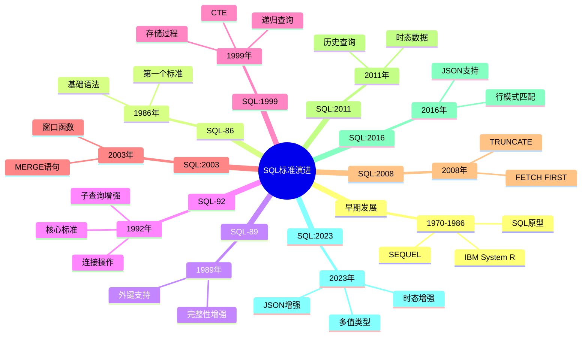

# SQL标准演进历史

> **创建日期**：2025-01-15
> **最后更新**：2025-01-15
> **版本**：v1.0.0
> **难度**：⭐⭐⭐
> **应用场景**：SQL标准学习、历史了解、版本对比

---

## 📋 目录

- [SQL标准演进历史](#sql标准演进历史)
  - [📋 目录](#-目录)
  - [一、概述](#一概述)
    - [1.1 SQL标准定义](#11-sql标准定义)
    - [1.2 SQL标准演进时间线思维导图](#12-sql标准演进时间线思维导图)
    - [1.3 SQL标准演进规律对比矩阵](#13-sql标准演进规律对比矩阵)
    - [1.2 SQL标准组织](#12-sql标准组织)
    - [1.3 SQL标准重要性](#13-sql标准重要性)
  - [二、SQL标准发展时间线](#二sql标准发展时间线)
    - [2.1 早期发展（1970-1986）](#21-早期发展1970-1986)
    - [2.2 SQL-86标准](#22-sql-86标准)
    - [2.3 SQL-89标准](#23-sql-89标准)
    - [2.4 SQL-92标准](#24-sql-92标准)
    - [2.5 SQL:1999标准](#25-sql1999标准)
    - [2.6 SQL:2003标准](#26-sql2003标准)
    - [2.7 SQL:2008标准](#27-sql2008标准)
    - [2.8 SQL:2011标准](#28-sql2011标准)
    - [2.9 SQL:2016标准](#29-sql2016标准)
    - [2.10 SQL:2023标准](#210-sql2023标准)
  - [三、SQL标准演进规律](#三sql标准演进规律)
    - [3.1 演进趋势](#31-演进趋势)
    - [3.2 主要改进方向](#32-主要改进方向)
    - [3.3 兼容性保证](#33-兼容性保证)
  - [四、SQL标准版本对比](#四sql标准版本对比)
    - [4.1 核心特性对比](#41-核心特性对比)
    - [4.2 数据类型对比](#42-数据类型对比)
    - [4.3 函数对比](#43-函数对比)
  - [五、SQL标准未来方向](#五sql标准未来方向)
    - [5.1 未来发展趋势](#51-未来发展趋势)
    - [5.2 可能的新特性](#52-可能的新特性)
  - [六、相关资源](#六相关资源)
    - [相关文档](#相关文档)
    - [外部资源](#外部资源)

---

## 一、概述

### 1.1 SQL标准定义

**SQL标准（SQL Standard）**是由国际标准化组织（ISO）和国际电工委员会（IEC）联合制定的关系数据库查询语言标准。

**标准编号**：ISO/IEC 9075

**标准名称**：Information technology — Database languages — SQL

### 1.2 SQL标准演进时间线思维导图



### 1.3 SQL标准演进规律对比矩阵

| 演进阶段 | 时间跨度 | 主要特性 | 演进特点 | 影响范围 |
|---------|---------|---------|---------|---------|
| **早期发展** | 1970-1986 | 基础语法 | 探索阶段 | 学术研究 |
| **标准化初期** | 1986-1992 | 核心语法 | 标准化 | 商业应用 |
| **功能扩展** | 1999-2003 | 高级特性 | 功能增强 | 企业应用 |
| **现代特性** | 2008-2016 | 现代数据 | 适应变化 | 云原生 |
| **最新发展** | 2016-2023 | 增强特性 | 持续演进 | 大数据 |

### 1.2 SQL标准组织

#### 1.2.1 标准制定组织

**标准制定组织**：

1. **ISO/IEC JTC 1/SC 32**：国际标准化组织/国际电工委员会联合技术委员会
   - **全称**：ISO/IEC Joint Technical Committee 1, Subcommittee 32
   - **职责**：负责数据管理和交换标准的制定
   - **历史**：成立于1980年代，负责SQL标准的制定和维护

2. **ANSI X3H2**：美国国家标准协会（早期）
   - **全称**：American National Standards Institute X3H2
   - **职责**：早期负责SQL标准的制定（1986-1992）
   - **历史**：在SQL-86和SQL-92标准制定中发挥重要作用

3. **SQL标准委员会**：负责SQL标准的制定和维护
   - **组成**：来自数据库厂商、学术界、用户组织的专家
   - **职责**：制定、维护和更新SQL标准

#### 1.2.2 标准制定流程

**标准制定流程**：

1. **提案阶段**：提出新特性或改进建议
2. **讨论阶段**：委员会讨论和评估提案
3. **草案阶段**：编写标准草案
4. **投票阶段**：委员会成员投票
5. **发布阶段**：正式发布标准

**标准更新周期**：

- **早期**：每3-4年更新一次（SQL-86到SQL-92）
- **中期**：每2-3年更新一次（SQL:1999到SQL:2011）
- **近期**：每5-7年更新一次（SQL:2016到SQL:2023）

### 1.3 SQL标准重要性

SQL标准的重要性：

1. **统一性**：统一不同数据库系统的SQL语法
2. **可移植性**：提高SQL代码的可移植性
3. **互操作性**：促进不同数据库系统之间的互操作
4. **标准化**：为数据库系统提供标准规范

---

## 二、SQL标准发展时间线

### 2.1 早期发展（1970-1986）

#### 2.1.1 历史背景

**早期发展的历史背景**：

- **1970年**：Codd提出关系模型，为SQL语言奠定了理论基础
- **1974年**：IBM开发SEQUEL（Structured English Query Language），SQL的前身
- **1976年**：SEQUEL改名为SQL（Structured Query Language），因为SEQUEL已被其他公司注册
- **1979年**：Oracle发布第一个商业SQL数据库，SQL开始商业化
- **1981年**：IBM发布SQL/DS，SQL开始在企业中应用
- **1983年**：IBM发布DB2，SQL成为主流数据库语言
- **1986年**：SQL-86标准发布，SQL正式标准化

#### 2.1.2 重要里程碑

**重要里程碑**：

| 时间 | 事件 | 影响 |
|------|------|------|
| **1970** | Codd提出关系模型 | 理论基础 |
| **1974** | IBM开发SEQUEL | SQL前身 |
| **1976** | SEQUEL改名为SQL | 正式命名 |
| **1979** | Oracle发布商业SQL数据库 | 商业化开始 |
| **1981** | IBM发布SQL/DS | 企业应用 |
| **1983** | IBM发布DB2 | 主流应用 |
| **1986** | SQL-86标准发布 | 正式标准化 |

---

#### 2.1.3 驱动因素

**标准化的驱动因素**：

1. **兼容性需求**：不同数据库系统的SQL语法不统一，需要标准化
2. **可移植性需求**：用户希望SQL代码可以在不同数据库间移植
3. **互操作性需求**：不同数据库系统需要互操作
4. **市场推动**：数据库厂商和用户组织推动标准化

### 2.2 SQL-86标准

#### 2.2.1 标准概述

**发布时间**：1986年（ANSI），1987年（ISO/IEC）

**标准编号**：

- ANSI X3.135-1986
- ISO/IEC 9075:1987

**标准名称**：Database Language SQL

#### 2.2.2 主要特性

**主要特性**：

- ✅ 基本SQL语法
- ✅ 数据定义语言（DDL）：CREATE TABLE, ALTER TABLE, DROP TABLE
- ✅ 数据操作语言（DML）：INSERT, UPDATE, DELETE
- ✅ 数据查询语言（DQL）：SELECT
- ✅ 基本数据类型：INTEGER, CHAR, VARCHAR, DECIMAL, DATE, TIME
- ✅ 基本约束：PRIMARY KEY, FOREIGN KEY, NOT NULL
- ✅ 基本函数：COUNT, SUM, AVG, MAX, MIN

#### 2.2.3 历史意义

**历史意义**：

1. **第一个SQL标准**：SQL-86是第一个SQL标准，奠定了SQL标准的基础
2. **标准化基础**：为后续SQL标准的发展奠定了基础
3. **兼容性保证**：为不同数据库系统提供了兼容性基础
4. **市场影响**：推动了SQL语言的广泛应用

#### 2.2.4 驱动因素

**标准化的驱动因素**：

1. **市场统一需求**：不同数据库厂商需要统一的SQL标准
2. **用户需求**：用户希望SQL代码可以在不同数据库间移植
3. **技术成熟**：SQL语言已经成熟，可以标准化
4. **国际标准需求**：需要国际标准来规范SQL语言

### 2.3 SQL-89标准

**发布时间**：1989年

**标准编号**：ANSI X3.135-1989, ISO/IEC 9075:1989

**主要改进**：

- ✅ 完整性约束（Integrity Constraints）
- ✅ 外键支持（Foreign Keys）
- ✅ 模式操作（Schema Operations）

**历史意义**：增强了数据完整性支持。

### 2.4 SQL-92标准

**发布时间**：1992年

**标准编号**：ANSI X3.135-1992, ISO/IEC 9075:1992

**主要特性**：

- ✅ 标准化语法
- ✅ 连接操作（JOIN）
- ✅ 子查询增强
- ✅ 数据类型扩展
- ✅ 字符集支持
- ✅ 动态SQL

**历史意义**：SQL-92是SQL标准的重要里程碑，奠定了现代SQL的基础。

### 2.5 SQL:1999标准

**发布时间**：1999年

**标准编号**：ISO/IEC 9075:1999

**主要特性**：

- ✅ 递归查询（WITH RECURSIVE）
- ✅ 公共表表达式（CTE）
- ✅ 触发器（Triggers）
- ✅ 存储过程（Stored Procedures）
- ✅ 用户定义函数（UDF）
- ✅ 对象关系支持
- ✅ 数组和集合类型

**历史意义**：引入了递归查询和存储过程，SQL功能大幅增强。

### 2.6 SQL:2003标准

**发布时间**：2003年

**标准编号**：ISO/IEC 9075:2003

**主要特性**：

- ✅ 窗口函数（Window Functions）
- ✅ MERGE语句
- ✅ 序列（Sequences）
- ✅ XML支持
- ✅ 多态函数

**历史意义**：引入了窗口函数，大大增强了SQL的分析能力。

### 2.7 SQL:2008标准

**发布时间**：2008年

**标准编号**：ISO/IEC 9075:2008

**主要特性**：

- ✅ INSTEAD OF触发器
- ✅ TRUNCATE TABLE
- ✅ FETCH FIRST子句
- ✅ 时态数据支持增强

**历史意义**：增强了时态数据处理能力。

### 2.8 SQL:2011标准

**发布时间**：2011年

**标准编号**：ISO/IEC 9075:2011

**主要特性**：

- ✅ 时态数据（Temporal Data）
- ✅ 时态表（Temporal Tables）
- ✅ 时态查询（Temporal Queries）
- ✅ 数据变更跟踪

**历史意义**：正式引入了时态数据支持，支持历史数据查询。

### 2.9 SQL:2016标准

**发布时间**：2016年

**标准编号**：ISO/IEC 9075:2016

**主要特性**：

- ✅ JSON支持（JSON Functions）
- ✅ 行模式匹配（MATCH_RECOGNIZE）
- ✅ 多态表函数（PTF）
- ✅ 新增数学函数（三角函数、对数函数）

**历史意义**：引入了JSON支持，适应现代应用需求。

### 2.10 SQL:2023标准

**发布时间**：2023年

**标准编号**：ISO/IEC 9075:2023

**主要特性**：

- ✅ JSON增强（JSON_TABLE, JSON_OBJECT, JSON_ARRAY）
- ✅ 时态数据增强
- ✅ 多值数据类型（MULTISET）
- ✅ 查询优化增强

**历史意义**：最新SQL标准，进一步增强JSON和时态数据处理能力。

---

## 三、SQL标准演进规律

### 3.1 演进趋势

**SQL标准演进趋势**：

1. **功能增强**：每个版本都增加新功能
2. **向后兼容**：新版本保持向后兼容
3. **标准化**：逐步统一不同数据库的实现
4. **现代化**：适应现代应用需求（JSON、时态数据等）

### 3.2 主要改进方向

**主要改进方向**：

1. **数据类型**：从基本类型到复杂类型（JSON、XML、时态数据）
2. **查询能力**：从基本查询到高级查询（窗口函数、递归查询）
3. **程序化**：从声明式到程序化（存储过程、触发器）
4. **扩展性**：从标准SQL到扩展SQL（用户定义函数、类型）

### 3.3 兼容性保证

**兼容性保证**：

```latex
\begin{theorem}[SQL标准向后兼容性]
SQL标准保证向后兼容，即：
\forall SQL版本 v₁ < v₂:
    \forall 查询 q ∈ SQL(v₁): q 在 SQL(v₂) 中语义相同
\end{theorem}
```

---

## 四、SQL标准版本对比

### 4.1 核心特性对比

| 特性 | SQL-92 | SQL:1999 | SQL:2003 | SQL:2008 | SQL:2011 | SQL:2016 | SQL:2023 |
|------|--------|----------|----------|----------|----------|----------|----------|
| **基本查询** | ✅ | ✅ | ✅ | ✅ | ✅ | ✅ | ✅ |
| **子查询** | ✅ | ✅ | ✅ | ✅ | ✅ | ✅ | ✅ |
| **连接操作** | ✅ | ✅ | ✅ | ✅ | ✅ | ✅ | ✅ |
| **递归查询** | ❌ | ✅ | ✅ | ✅ | ✅ | ✅ | ✅ |
| **CTE** | ❌ | ✅ | ✅ | ✅ | ✅ | ✅ | ✅ |
| **窗口函数** | ❌ | ❌ | ✅ | ✅ | ✅ | ✅ | ✅ |
| **MERGE语句** | ❌ | ❌ | ✅ | ✅ | ✅ | ✅ | ✅ |
| **JSON支持** | ❌ | ❌ | ❌ | ❌ | ❌ | ✅ | ✅✅ |
| **时态数据** | ❌ | ❌ | ❌ | ⚠️ | ✅ | ✅ | ✅✅ |
| **XML支持** | ❌ | ❌ | ✅ | ✅ | ✅ | ✅ | ✅ |
| **存储过程** | ❌ | ✅ | ✅ | ✅ | ✅ | ✅ | ✅ |
| **触发器** | ❌ | ✅ | ✅ | ✅ | ✅ | ✅ | ✅ |

### 4.2 数据类型对比

| 数据类型 | SQL-92 | SQL:1999 | SQL:2003 | SQL:2008 | SQL:2011 | SQL:2016 | SQL:2023 |
|---------|--------|----------|----------|----------|----------|----------|----------|
| **基本类型** | ✅ | ✅ | ✅ | ✅ | ✅ | ✅ | ✅ |
| **日期时间** | ✅ | ✅ | ✅ | ✅ | ✅ | ✅ | ✅ |
| **字符串** | ✅ | ✅ | ✅ | ✅ | ✅ | ✅ | ✅ |
| **数值** | ✅ | ✅ | ✅ | ✅ | ✅ | ✅ | ✅ |
| **数组** | ❌ | ✅ | ✅ | ✅ | ✅ | ✅ | ✅ |
| **XML** | ❌ | ❌ | ✅ | ✅ | ✅ | ✅ | ✅ |
| **JSON** | ❌ | ❌ | ❌ | ❌ | ❌ | ✅ | ✅✅ |
| **时态类型** | ❌ | ❌ | ❌ | ⚠️ | ✅ | ✅ | ✅✅ |
| **MULTISET** | ❌ | ❌ | ❌ | ❌ | ❌ | ❌ | ✅ |

### 4.3 函数对比

| 函数类型 | SQL-92 | SQL:1999 | SQL:2003 | SQL:2008 | SQL:2011 | SQL:2016 | SQL:2023 |
|---------|--------|----------|----------|----------|----------|----------|----------|
| **字符串函数** | ✅ | ✅ | ✅ | ✅ | ✅ | ✅ | ✅ |
| **数值函数** | ✅ | ✅ | ✅ | ✅ | ✅ | ✅ | ✅ |
| **日期函数** | ✅ | ✅ | ✅ | ✅ | ✅ | ✅ | ✅ |
| **聚合函数** | ✅ | ✅ | ✅ | ✅ | ✅ | ✅ | ✅ |
| **窗口函数** | ❌ | ❌ | ✅ | ✅ | ✅ | ✅ | ✅ |
| **JSON函数** | ❌ | ❌ | ❌ | ❌ | ❌ | ✅ | ✅✅ |
| **XML函数** | ❌ | ❌ | ✅ | ✅ | ✅ | ✅ | ✅ |
| **三角函数** | ❌ | ❌ | ❌ | ❌ | ❌ | ✅ | ✅ |

---

## 五、SQL标准未来方向

### 5.1 未来发展趋势

**未来发展趋势**：

1. **AI/ML集成**：SQL与机器学习的集成
2. **图数据支持**：图查询语言支持
3. **流数据处理**：实时流数据处理
4. **分布式查询**：分布式数据库查询优化

### 5.2 可能的新特性

**可能的新特性**：

1. **图查询**：图数据库查询支持
2. **流查询**：流数据处理查询
3. **向量查询**：向量数据库查询支持
4. **AI函数**：AI/ML函数集成

---

## 六、相关资源

### 相关文档

- [SQL-92标准详解](./02.02-SQL-92标准详解.md) - SQL-92标准
- [SQL:1999到SQL:2011标准](./02.03-SQL-1999到SQL-2011标准.md) - 中间版本标准
- [SQL:2016标准详解](./02.04-SQL-2016标准详解.md) - SQL:2016标准
- [SQL:2023标准详解](./02.05-SQL-2023标准详解.md) - SQL:2023标准
- [SQL标准版本对比矩阵](./02.06-SQL标准版本对比矩阵.md) - 版本对比

### 外部资源

- [ISO/IEC 9075标准](https://www.iso.org/standard/76583.html)
- [SQL标准官方文档](https://www.iso.org/standard/76583.html)

---

**维护者**: SQL Standards Team
**最后更新**: 2025-01-15
