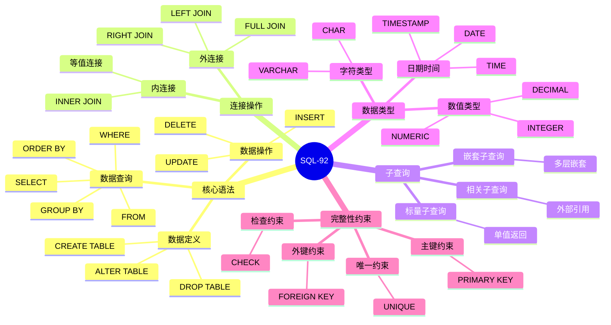

# SQL-92标准详解

> **创建日期**：2025-01-15
> **最后更新**：2025-01-16
> **版本**：v1.0.0
> **标准版本**：ANSI X3.135-1992, ISO/IEC 9075:1992
> **难度**：⭐⭐⭐
> **应用场景**：SQL标准学习、基础语法理解、兼容性分析

---

## 📋 目录

- [SQL-92标准详解](#sql-92标准详解)
  - [📋 目录](#-目录)
  - [一、概述](#一概述)
    - [1.1 SQL-92标准定义](#11-sql-92标准定义)
    - [1.1 SQL-92知识体系思维导图](#11-sql-92知识体系思维导图)
    - [1.2 SQL-92特性分类对比矩阵](#12-sql-92特性分类对比矩阵)
  - [二、SQL-92核心特性](#二sql-92核心特性)
    - [2.1 核心特性列表](#21-核心特性列表)
    - [2.2 特性分类](#22-特性分类)
  - [三、数据定义语言（DDL）](#三数据定义语言ddl)
    - [3.1 CREATE TABLE](#31-create-table)
    - [3.2 ALTER TABLE](#32-alter-table)
    - [3.3 DROP TABLE](#33-drop-table)
  - [四、数据操作语言（DML）](#四数据操作语言dml)
    - [4.1 INSERT](#41-insert)
    - [4.2 UPDATE](#42-update)
    - [4.3 DELETE](#43-delete)
  - [五、数据查询语言（DQL）](#五数据查询语言dql)
    - [5.1 SELECT基本语法](#51-select基本语法)
    - [5.2 JOIN操作](#52-join操作)
    - [5.3 子查询](#53-子查询)
  - [六、数据控制语言（DCL）](#六数据控制语言dcl)
    - [6.1 GRANT](#61-grant)
    - [6.2 REVOKE](#62-revoke)
  - [七、事务控制](#七事务控制)
    - [7.1 事务语句](#71-事务语句)
    - [7.2 事务隔离级别](#72-事务隔离级别)
  - [八、SQL-92与后续版本对比](#八sql-92与后续版本对比)
    - [8.1 主要差异](#81-主要差异)
    - [8.2 兼容性](#82-兼容性)
  - [九、相关资源](#九相关资源)
    - [相关文档](#相关文档)
    - [外部资源](#外部资源)

---

## 一、概述

**SQL-92**（也称为SQL2）是SQL标准的第二个主要版本，于1992年发布。它是现代SQL的基础，奠定了SQL标准的核心语法和语义。

**标准编号**：

- ANSI X3.135-1992
- ISO/IEC 9075:1992

**发布时间**：1992年

**历史意义**：SQL-92是SQL标准的重要里程碑，奠定了现代SQL的基础。

### 1.1 SQL-92标准定义

**形式化定义**：

SQL-92标准定义了关系数据库查询语言的语法和语义，包括：

- **语法定义**：使用BNF（Backus-Naur Form）定义SQL语法
- **语义定义**：定义SQL语句的执行语义
- **数据类型**：定义标准数据类型系统
- **完整性约束**：定义实体完整性、参照完整性等约束

**标准结构**：

SQL-92标准分为三个级别：

1. **Entry SQL**：基础SQL功能
2. **Intermediate SQL**：中等SQL功能
3. **Full SQL**：完整SQL功能

**标准重要性**：

SQL-92标准的重要性体现在：

1. **兼容性基础**：为后续SQL标准版本提供兼容性基础
2. **实现参考**：为数据库实现提供标准参考
3. **互操作性**：提高不同数据库之间的互操作性

### 1.1 SQL-92知识体系思维导图



### 1.2 SQL-92特性分类对比矩阵

| 特性类别 | 核心特性 | 增强特性 | 扩展特性 | 说明 |
|---------|---------|---------|---------|------|
| **数据定义** | ✅ | ✅ | ✅ | 表、索引、视图定义 |
| **数据操作** | ✅ | ✅ | ✅ | INSERT、UPDATE、DELETE |
| **数据查询** | ✅ | ✅ | ✅ | SELECT、JOIN、子查询 |
| **连接操作** | ✅ | ✅ | ✅ | 内连接、外连接 |
| **完整性约束** | ✅ | ✅ | ✅ | 主键、外键、检查约束 |
| **事务控制** | ✅ | ✅ | ✅ | COMMIT、ROLLBACK |
| **权限控制** | ✅ | ✅ | ✅ | GRANT、REVOKE |

---

## 二、SQL-92核心特性

### 2.1 核心特性列表

**SQL-92主要特性**：

1. ✅ **标准化语法**：统一的SQL语法规范
2. ✅ **连接操作**：INNER JOIN, LEFT JOIN, RIGHT JOIN, FULL JOIN
3. ✅ **子查询增强**：支持嵌套子查询
4. ✅ **数据类型扩展**：更多数据类型支持
5. ✅ **字符集支持**：字符集和排序规则
6. ✅ **动态SQL**：动态SQL支持
7. ✅ **完整性约束**：主键、外键、检查约束

### 2.2 特性分类

**SQL-92特性分类**：

- **核心特性（Core）**：所有SQL-92实现必须支持
- **增强特性（Enhanced）**：可选的高级特性
- **扩展特性（Extended）**：可选的扩展特性

---

## 三、数据定义语言（DDL）

### 3.1 CREATE TABLE

**CREATE TABLE语法**：

```sql
CREATE TABLE table_name (
    column_name data_type [constraint],
    ...
    [table_constraint]
);
```

**示例**：

```sql
-- SQL-92 CREATE TABLE示例
CREATE TABLE Student (
    student_id INTEGER PRIMARY KEY,
    name VARCHAR(50) NOT NULL,
    age INTEGER,
    major VARCHAR(50),
    CONSTRAINT chk_age CHECK (age >= 0 AND age <= 150)
);
```

### 3.2 ALTER TABLE

**ALTER TABLE语法**：

```sql
ALTER TABLE table_name
    ADD column_name data_type [constraint]
    | DROP COLUMN column_name
    | ALTER COLUMN column_name SET data_type
    | ADD CONSTRAINT constraint_name constraint_definition
    | DROP CONSTRAINT constraint_name;
```

### 3.3 DROP TABLE

**DROP TABLE语法**：

```sql
DROP TABLE table_name [CASCADE | RESTRICT];
```

---

## 四、数据操作语言（DML）

### 4.1 INSERT

**INSERT语法**：

```sql
INSERT INTO table_name [(column_list)]
VALUES (value_list);
```

**示例**：

```sql
-- SQL-92 INSERT示例
INSERT INTO Student (student_id, name, age, major)
VALUES (1, 'Alice', 20, 'Computer Science');
```

### 4.2 UPDATE

**UPDATE语法**：

```sql
UPDATE table_name
SET column_name = value [, column_name = value ...]
WHERE condition;
```

**示例**：

```sql
-- SQL-92 UPDATE示例
UPDATE Student
SET age = 21
WHERE student_id = 1;
```

### 4.3 DELETE

**DELETE语法**：

```sql
DELETE FROM table_name
WHERE condition;
```

**示例**：

```sql
-- SQL-92 DELETE示例
DELETE FROM Student
WHERE age < 18;
```

---

## 五、数据查询语言（DQL）

### 5.1 SELECT基本语法

**SELECT语法**：

```sql
SELECT [DISTINCT] select_list
FROM table_list
[WHERE condition]
[GROUP BY group_list]
[HAVING condition]
[ORDER BY order_list];
```

### 5.2 JOIN操作

**SQL-92 JOIN语法**：

```sql
-- INNER JOIN
SELECT * FROM table1
INNER JOIN table2 ON table1.id = table2.id;

-- LEFT JOIN
SELECT * FROM table1
LEFT JOIN table2 ON table1.id = table2.id;

-- RIGHT JOIN
SELECT * FROM table1
RIGHT JOIN table2 ON table1.id = table2.id;

-- FULL JOIN
SELECT * FROM table1
FULL JOIN table2 ON table1.id = table2.id;
```

### 5.3 子查询

**SQL-92子查询示例**：

```sql
-- 标量子查询
SELECT name, (SELECT COUNT(*) FROM Enrollment WHERE student_id = s.student_id) as course_count
FROM Student s;

-- 相关子查询
SELECT * FROM Student s
WHERE EXISTS (
    SELECT 1 FROM Enrollment e
    WHERE e.student_id = s.student_id
);
```

---

## 六、数据控制语言（DCL）

### 6.1 GRANT

**GRANT语法**：

```sql
GRANT privilege_list
ON object
TO user_list
[WITH GRANT OPTION];
```

**示例**：

```sql
-- SQL-92 GRANT示例
GRANT SELECT, INSERT ON Student TO user1;
GRANT ALL PRIVILEGES ON Student TO user2 WITH GRANT OPTION;
```

### 6.2 REVOKE

**REVOKE语法**：

```sql
REVOKE privilege_list
ON object
FROM user_list
[CASCADE | RESTRICT];
```

---

## 七、事务控制

### 7.1 事务语句

**SQL-92事务控制**：

```sql
-- 开始事务
BEGIN TRANSACTION;

-- 提交事务
COMMIT;

-- 回滚事务
ROLLBACK;

-- 保存点
SAVEPOINT savepoint_name;
ROLLBACK TO SAVEPOINT savepoint_name;
```

### 7.2 事务隔离级别

**SQL-92隔离级别**：

- READ UNCOMMITTED
- READ COMMITTED
- REPEATABLE READ
- SERIALIZABLE

---

## 八、SQL-92与后续版本对比

### 8.1 主要差异

| 特性 | SQL-92 | SQL:1999+ |
|------|--------|-----------|
| **递归查询** | ❌ | ✅ |
| **CTE** | ❌ | ✅ |
| **窗口函数** | ❌ | ✅ |
| **JSON支持** | ❌ | ✅ |
| **存储过程** | ❌ | ✅ |

### 8.2 兼容性

**SQL-92兼容性**：

- ✅ SQL-92查询在所有后续版本中完全兼容
- ✅ SQL-92是SQL标准的基础
- ✅ 所有数据库系统都支持SQL-92核心特性

---

## 九、相关资源

### 相关文档

- [SQL标准演进历史](./02.01-SQL标准演进历史.md) - SQL标准发展历程
- [SQL:1999到SQL:2011标准](./02.03-SQL-1999到SQL-2011标准.md) - 后续版本标准
- [SQL标准版本对比矩阵](./02.06-SQL标准版本对比矩阵.md) - 版本对比

### 外部资源

- ANSI X3.135-1992 (SQL-92)
- ISO/IEC 9075:1992 (SQL-92)

---

**维护者**: SQL Standards Team
**最后更新**: 2025-01-16
