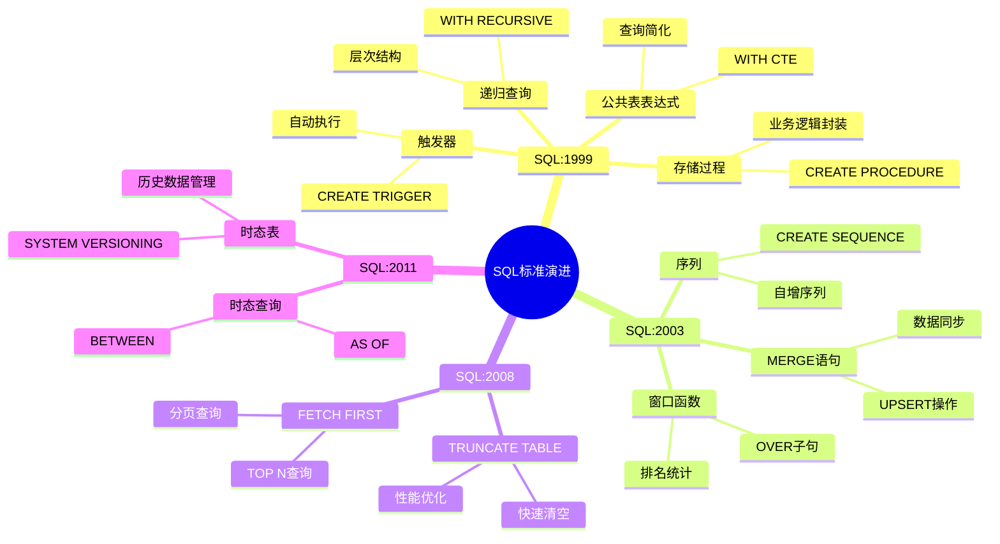
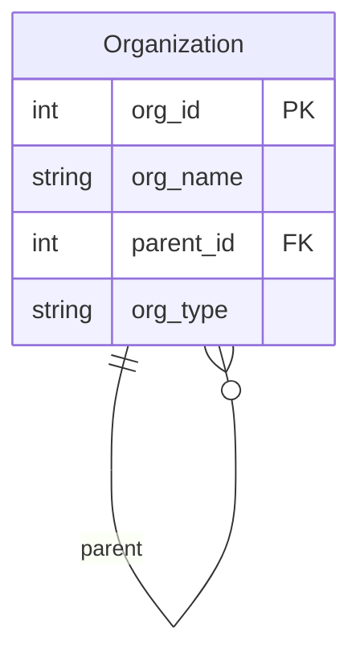

# SQL:1999到SQL:2011标准

> **创建日期**：2025-01-15
> **最后更新**：2025-01-15
> **版本**：v1.0.0
> **难度**：⭐⭐⭐
> **应用场景**：SQL标准学习、特性演进理解

---

## 📋 目录

- [SQL:1999到SQL:2011标准](#sql1999到sql2011标准)
  - [📋 目录](#-目录)
  - [一、概述](#一概述)
    - [1.1 SQL标准演进知识体系思维导图](#11-sql标准演进知识体系思维导图)
    - [1.2 SQL标准版本演进对比矩阵](#12-sql标准版本演进对比矩阵)
  - [二、SQL:1999标准](#二sql1999标准)
    - [2.1 主要特性](#21-主要特性)
    - [2.2 递归查询](#22-递归查询)
    - [2.2.1 场景示例：组织架构层次查询](#221-场景示例组织架构层次查询)
    - [2.3 存储过程](#23-存储过程)
    - [2.3.1 场景示例：学生信息查询存储过程](#231-场景示例学生信息查询存储过程)
  - [三、SQL:2003标准](#三sql2003标准)
    - [3.1 主要特性](#31-主要特性)
    - [3.2 窗口函数](#32-窗口函数)
    - [3.2.1 场景示例：学生成绩排名分析](#321-场景示例学生成绩排名分析)
    - [3.3 MERGE语句](#33-merge语句)
    - [3.3.1 场景示例：学生数据同步](#331-场景示例学生数据同步)
  - [四、SQL:2008标准](#四sql2008标准)
    - [4.1 主要特性](#41-主要特性)
    - [4.2 TRUNCATE TABLE](#42-truncate-table)
    - [4.3 FETCH FIRST](#43-fetch-first)
  - [五、SQL:2011标准](#五sql2011标准)
    - [5.1 主要特性](#51-主要特性)
    - [5.2 时态表](#52-时态表)
    - [5.2.1 场景示例：员工薪资历史管理](#521-场景示例员工薪资历史管理)
    - [5.3 时态查询](#53-时态查询)
    - [5.3.1 场景示例：历史数据查询](#531-场景示例历史数据查询)
  - [六、版本演进对比](#六版本演进对比)
  - [七、相关资源](#七相关资源)
    - [相关文档](#相关文档)

---

## 一、概述

本文档介绍SQL:1999到SQL:2011标准的主要特性和演进，这些版本在SQL-92基础上引入了许多重要特性。

**版本时间线**：

- SQL:1999 - 1999年
- SQL:2003 - 2003年
- SQL:2008 - 2008年
- SQL:2011 - 2011年

### 1.1 SQL标准演进知识体系思维导图



### 1.2 SQL标准版本演进对比矩阵

| 特性 | SQL:1999 | SQL:2003 | SQL:2008 | SQL:2011 | 演进趋势 |
|------|----------|----------|----------|----------|---------|
| **递归查询** | ✅ 新增 | ✅ | ✅ | ✅ | 稳定 |
| **CTE** | ✅ 新增 | ✅ | ✅ | ✅ | 稳定 |
| **窗口函数** | ❌ | ✅ 新增 | ✅ | ✅ | 增强 |
| **MERGE** | ❌ | ✅ 新增 | ✅ | ✅ | 稳定 |
| **时态数据** | ❌ | ❌ | ❌ | ✅ 新增 | 新增 |
| **TRUNCATE** | ❌ | ❌ | ✅ 新增 | ✅ | 稳定 |
| **FETCH FIRST** | ❌ | ❌ | ✅ 新增 | ✅ | 稳定 |

---

## 二、SQL:1999标准

### 2.1 主要特性

**SQL:1999核心特性**：

1. ✅ **递归查询（WITH RECURSIVE）**
2. ✅ **公共表表达式（CTE）**
3. ✅ **触发器（Triggers）**
4. ✅ **存储过程（Stored Procedures）**
5. ✅ **用户定义函数（UDF）**
6. ✅ **对象关系支持**
7. ✅ **数组和集合类型**

### 2.2 递归查询

**WITH RECURSIVE语法**：

```sql
WITH RECURSIVE cte_name AS (
    -- 基础查询
    SELECT ...
    UNION ALL
    -- 递归查询
    SELECT ... FROM cte_name WHERE ...
)
SELECT * FROM cte_name;
```

### 2.2.1 场景示例：组织架构层次查询

**业务需求**：查询完整的组织架构树，包括所有层级关系。

**数据模型**：



**递归查询实现**：

```sql
WITH RECURSIVE org_tree AS (
    -- 基础查询：根节点
    SELECT
        org_id,
        org_name,
        parent_id,
        0 as level,
        CAST(org_name AS VARCHAR(1000)) as path
    FROM Organization
    WHERE parent_id IS NULL

    UNION ALL

    -- 递归查询：子节点
    SELECT
        o.org_id,
        o.org_name,
        o.parent_id,
        ot.level + 1,
        ot.path || ' > ' || o.org_name
    FROM Organization o
    JOIN org_tree ot ON o.parent_id = ot.org_id
    WHERE ot.level < 10
)
SELECT * FROM org_tree ORDER BY path;
```

### 2.3 存储过程

**存储过程示例**：

```sql
CREATE PROCEDURE get_student(IN student_id INTEGER)
BEGIN
    SELECT * FROM Student WHERE id = student_id;
END;
```

### 2.3.1 场景示例：学生信息查询存储过程

**业务需求**：创建存储过程查询学生及其选课信息。

**存储过程实现**：

```sql
CREATE PROCEDURE get_student_with_courses(
    IN p_student_id INTEGER
)
BEGIN
    SELECT
        s.student_id,
        s.name,
        s.major,
        c.course_name,
        e.score,
        e.enroll_date
    FROM Student s
    LEFT JOIN Enrollment e ON s.student_id = e.student_id
    LEFT JOIN Course c ON e.course_id = c.course_id
    WHERE s.student_id = p_student_id;
END;

-- 调用存储过程
CALL get_student_with_courses(1);
```

---

## 三、SQL:2003标准

### 3.1 主要特性

**SQL:2003核心特性**：

1. ✅ **窗口函数（Window Functions）**
2. ✅ **MERGE语句**
3. ✅ **序列（SEQUENCES）**
4. ✅ **XML支持**
5. ✅ **多态函数**

### 3.2 窗口函数

**窗口函数示例**：

```sql
SELECT
    student_id,
    score,
    ROW_NUMBER() OVER (PARTITION BY class ORDER BY score DESC) as rank
FROM Scores;
```

### 3.2.1 场景示例：学生成绩排名分析

**业务需求**：计算每门课程的学生排名，并分析成绩分布。

**窗口函数实现**：

```sql
SELECT
    course_id,
    student_id,
    score,
    ROW_NUMBER() OVER (PARTITION BY course_id ORDER BY score DESC) as rank,
    RANK() OVER (PARTITION BY course_id ORDER BY score DESC) as rank_with_ties,
    DENSE_RANK() OVER (PARTITION BY course_id ORDER BY score DESC) as dense_rank,
    AVG(score) OVER (PARTITION BY course_id) as avg_score,
    MAX(score) OVER (PARTITION BY course_id) as max_score,
    MIN(score) OVER (PARTITION BY course_id) as min_score
FROM Enrollment
ORDER BY course_id, rank;
```

### 3.3 MERGE语句

**MERGE语句示例**：

```sql
MERGE INTO Student AS target
USING NewStudent AS source
ON target.id = source.id
WHEN MATCHED THEN
    UPDATE SET name = source.name
WHEN NOT MATCHED THEN
    INSERT (id, name) VALUES (source.id, source.name);
```

### 3.3.1 场景示例：学生数据同步

**业务需求**：从外部系统同步学生数据，存在则更新，不存在则插入。

**MERGE实现**：

```sql
MERGE INTO Student AS target
USING ExternalStudent AS source
ON target.student_id = source.student_id
WHEN MATCHED THEN
    UPDATE SET
        name = source.name,
        age = source.age,
        major = source.major,
        email = source.email,
        update_time = CURRENT_TIMESTAMP
WHEN NOT MATCHED THEN
    INSERT (student_id, name, age, major, email, create_time)
    VALUES (source.student_id, source.name, source.age,
            source.major, source.email, CURRENT_TIMESTAMP);
```

---

## 四、SQL:2008标准

### 4.1 主要特性

**SQL:2008核心特性**：

1. ✅ **INSTEAD OF触发器**
2. ✅ **TRUNCATE TABLE**
3. ✅ **FETCH FIRST子句**
4. ✅ **时态数据支持增强**

### 4.2 TRUNCATE TABLE

**TRUNCATE TABLE语法**：

```sql
TRUNCATE TABLE table_name;
```

### 4.3 FETCH FIRST

**FETCH FIRST语法**：

```sql
SELECT * FROM Student
ORDER BY score DESC
FETCH FIRST 10 ROWS ONLY;
```

---

## 五、SQL:2011标准

### 5.1 主要特性

**SQL:2011核心特性**：

1. ✅ **时态数据（Temporal Data）**
2. ✅ **时态表（Temporal Tables）**
3. ✅ **时态查询（Temporal Queries）**
4. ✅ **数据变更跟踪**

### 5.2 时态表

**时态表示例**：

```sql
CREATE TABLE Employee (
    id INTEGER,
    name VARCHAR(50),
    salary DECIMAL(10,2),
    PERIOD FOR SYSTEM_TIME (start_time, end_time)
) WITH SYSTEM VERSIONING;
```

### 5.2.1 场景示例：员工薪资历史管理

**业务需求**：跟踪员工薪资变更历史，支持查询任意时间点的薪资信息。

**时态表实现**：

```sql
-- 创建时态表
CREATE TABLE Employee (
    employee_id INTEGER PRIMARY KEY,
    name VARCHAR(50),
    department VARCHAR(50),
    salary DECIMAL(10,2),
    PERIOD FOR SYSTEM_TIME (start_time, end_time)
) WITH SYSTEM VERSIONING;

-- 插入数据
INSERT INTO Employee (employee_id, name, department, salary)
VALUES (1, 'Alice', 'Engineering', 50000);

-- 更新薪资（系统自动创建历史记录）
UPDATE Employee
SET salary = 55000
WHERE employee_id = 1;
```

### 5.3 时态查询

**时态查询示例**：

```sql
SELECT * FROM Employee
FOR SYSTEM_TIME AS OF '2023-01-01';
```

### 5.3.1 场景示例：历史数据查询

**业务需求**：查询员工在特定时间点的薪资信息，以及薪资变更历史。

**时态查询实现**：

```sql
-- 查询2023-01-01的薪资
SELECT
    employee_id,
    name,
    salary
FROM Employee
FOR SYSTEM_TIME AS OF '2023-01-01'
WHERE employee_id = 1;

-- 查询2023年全年的薪资变更
SELECT
    employee_id,
    name,
    salary,
    start_time,
    end_time
FROM Employee
FOR SYSTEM_TIME BETWEEN '2023-01-01' AND '2023-12-31'
WHERE employee_id = 1
ORDER BY start_time;
```

---

## 六、版本演进对比

| 特性 | SQL:1999 | SQL:2003 | SQL:2008 | SQL:2011 |
|------|----------|----------|----------|----------|
| **递归查询** | ✅ | ✅ | ✅ | ✅ |
| **CTE** | ✅ | ✅ | ✅ | ✅ |
| **窗口函数** | ❌ | ✅ | ✅ | ✅ |
| **MERGE语句** | ❌ | ✅ | ✅ | ✅ |
| **时态数据** | ❌ | ❌ | ⚠️ | ✅ |
| **XML支持** | ❌ | ✅ | ✅ | ✅ |

---

## 七、相关资源

### 相关文档

- [SQL标准演进历史](./02.01-SQL标准演进历史.md) - SQL标准发展历程
- [SQL-92标准详解](./02.02-SQL-92标准详解.md) - SQL-92标准
- [SQL:2016标准详解](./02.04-SQL-2016标准详解.md) - SQL:2016标准
- [SQL标准版本对比矩阵](./02.06-SQL标准版本对比矩阵.md) - 版本对比

---

**维护者**: SQL Standards Team
**最后更新**: 2025-01-15
