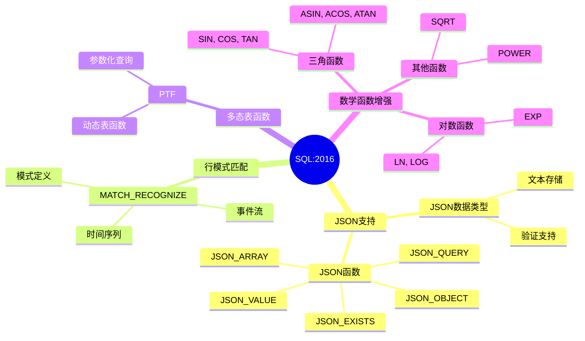
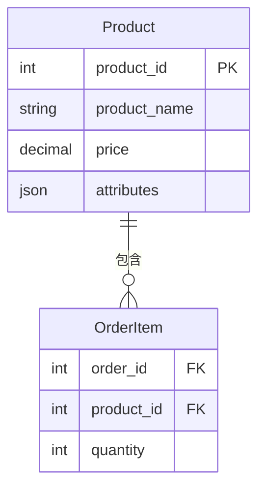
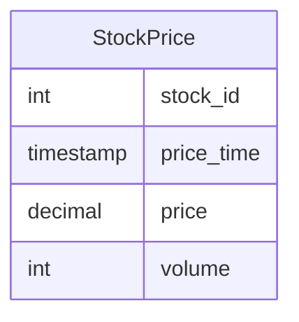

# SQL:2016标准详解

> **创建日期**：2025-01-15
> **最后更新**：2025-01-15
> **版本**：v1.0.0
> **标准版本**：ISO/IEC 9075:2016
> **难度**：⭐⭐⭐⭐
> **应用场景**：SQL标准学习、JSON数据处理、现代应用开发

---

## 📋 目录

- [SQL:2016标准详解](#sql2016标准详解)
  - [📋 目录](#-目录)
  - [一、概述](#一概述)
    - [1.1 SQL:2016知识体系思维导图](#11-sql2016知识体系思维导图)
    - [1.2 SQL:2016与SQL:2011对比矩阵](#12-sql2016与sql2011对比矩阵)
  - [二、SQL:2016核心新特性](#二sql2016核心新特性)
    - [2.1 特性列表](#21-特性列表)
  - [三、JSON支持](#三json支持)
    - [3.1 JSON数据类型](#31-json数据类型)
    - [3.2 JSON函数](#32-json函数)
    - [3.2.1 场景示例：电商系统商品属性查询](#321-场景示例电商系统商品属性查询)
  - [四、行模式匹配](#四行模式匹配)
    - [4.1 MATCH\_RECOGNIZE](#41-match_recognize)
    - [4.1.1 场景示例：股票价格模式识别](#411-场景示例股票价格模式识别)
  - [五、多态表函数](#五多态表函数)
    - [5.1 PTF定义](#51-ptf定义)
  - [六、数学函数增强](#六数学函数增强)
    - [6.1 三角函数](#61-三角函数)
    - [6.2 对数函数](#62-对数函数)
  - [七、SQL:2016与SQL:2011对比](#七sql2016与sql2011对比)
  - [八、相关资源](#八相关资源)
    - [相关文档](#相关文档)

---

## 一、概述

**SQL:2016**（ISO/IEC 9075:2016）是SQL标准的重要版本，引入了JSON支持、行模式匹配等现代特性。

**标准编号**：ISO/IEC 9075:2016

**发布时间**：2016年

**主要改进**：JSON支持、行模式匹配、多态表函数、数学函数增强

### 1.1 SQL:2016知识体系思维导图



### 1.2 SQL:2016与SQL:2011对比矩阵

| 特性类别 | SQL:2011 | SQL:2016 | 改进程度 | 应用场景 |
|---------|----------|----------|---------|---------|
| **JSON支持** | ❌ | ✅ 新增 | ⭐⭐⭐⭐⭐ | 半结构化数据 |
| **行模式匹配** | ❌ | ✅ 新增 | ⭐⭐⭐⭐ | 时间序列分析 |
| **多态表函数** | ❌ | ✅ 新增 | ⭐⭐⭐ | 动态查询 |
| **数学函数** | 基础 | 增强 | ⭐⭐⭐ | 科学计算 |
| **时态数据** | ✅ | ✅ | - | 历史数据管理 |

---

## 二、SQL:2016核心新特性

### 2.1 特性列表

**SQL:2016核心特性**：

1. ✅ **JSON支持**：JSON数据类型和函数
2. ✅ **行模式匹配（MATCH_RECOGNIZE）**：时间序列模式匹配
3. ✅ **多态表函数（PTF）**：动态表函数
4. ✅ **数学函数增强**：三角函数、对数函数

---

## 三、JSON支持

### 3.1 JSON数据类型

**JSON类型定义**：

```sql
CREATE TABLE products (
    id INTEGER,
    name VARCHAR(100),
    attributes JSON
);
```

### 3.2 JSON函数

**JSON函数示例**：

```sql
-- JSON_VALUE：提取JSON值
SELECT JSON_VALUE(attributes, '$.color') AS color
FROM products;

-- JSON_QUERY：提取JSON对象
SELECT JSON_QUERY(attributes, '$.specs') AS specs
FROM products;

-- JSON_EXISTS：检查JSON路径是否存在
SELECT * FROM products
WHERE JSON_EXISTS(attributes, '$.discount');
```

### 3.2.1 场景示例：电商系统商品属性查询

**业务需求**：在电商系统中，商品属性以JSON格式存储，需要查询特定属性的商品。

**数据模型**：



**JSON查询实现**：

```sql
-- 查询红色商品
SELECT
    product_id,
    product_name,
    price,
    JSON_VALUE(attributes, '$.color') AS color,
    JSON_VALUE(attributes, '$.size') AS size
FROM Product
WHERE JSON_VALUE(attributes, '$.color') = 'red';

-- 查询有折扣的商品
SELECT
    product_id,
    product_name,
    price,
    CAST(JSON_VALUE(attributes, '$.discount') AS DECIMAL) AS discount
FROM Product
WHERE JSON_EXISTS(attributes, '$.discount')
  AND CAST(JSON_VALUE(attributes, '$.discount') AS DECIMAL) > 0.1;
```

---

## 四、行模式匹配

### 4.1 MATCH_RECOGNIZE

**MATCH_RECOGNIZE语法**：

```sql
SELECT *
FROM events
MATCH_RECOGNIZE (
    PARTITION BY user_id
    ORDER BY timestamp
    MEASURES
        A.price AS start_price,
        B.price AS end_price
    PATTERN (A B+)
    DEFINE
        A AS price > 100,
        B AS price > A.price
);
```

### 4.1.1 场景示例：股票价格模式识别

**业务需求**：识别股票价格连续上涨的模式。

**数据模型**：



**MATCH_RECOGNIZE实现**：

```sql
SELECT *
FROM StockPrice
MATCH_RECOGNIZE (
    PARTITION BY stock_id
    ORDER BY price_time
    MEASURES
        FIRST(A.price_time) AS start_time,
        LAST(B.price_time) AS end_time,
        FIRST(A.price) AS start_price,
        LAST(B.price) AS end_price,
        COUNT(B.*) AS up_days
    PATTERN (A B+)
    DEFINE
        A AS price > 100,
        B AS price > PREV(B.price)
)
WHERE up_days >= 3
ORDER BY stock_id, start_time;
```

---

## 五、多态表函数

### 5.1 PTF定义

**多态表函数示例**：

```sql
CREATE FUNCTION dynamic_query(input_table TABLE, condition VARCHAR)
RETURNS TABLE
LANGUAGE SQL
AS $$
    SELECT * FROM input_table WHERE condition;
$$;
```

---

## 六、数学函数增强

### 6.1 三角函数

**三角函数示例**：

```sql
SELECT
    SIN(angle) AS sine,
    COS(angle) AS cosine,
    TAN(angle) AS tangent
FROM angles;
```

### 6.2 对数函数

**对数函数示例**：

```sql
SELECT
    LOG(value) AS natural_log,
    LOG10(value) AS log10,
    LN(value) AS ln
FROM numbers;
```

---

## 七、SQL:2016与SQL:2011对比

| 特性 | SQL:2011 | SQL:2016 |
|------|----------|----------|
| **JSON支持** | ❌ | ✅ |
| **行模式匹配** | ❌ | ✅ |
| **多态表函数** | ❌ | ✅ |
| **三角函数** | ❌ | ✅ |
| **时态数据** | ✅ | ✅ |

---

## 八、相关资源

### 相关文档

- [SQL标准演进历史](./02.01-SQL标准演进历史.md) - SQL标准发展历程
- [SQL:2023标准详解](./02.05-SQL-2023标准详解.md) - SQL:2023标准
- [SQL标准版本对比矩阵](./02.06-SQL标准版本对比矩阵.md) - 版本对比

---

**维护者**: SQL Standards Team
**最后更新**: 2025-01-15
