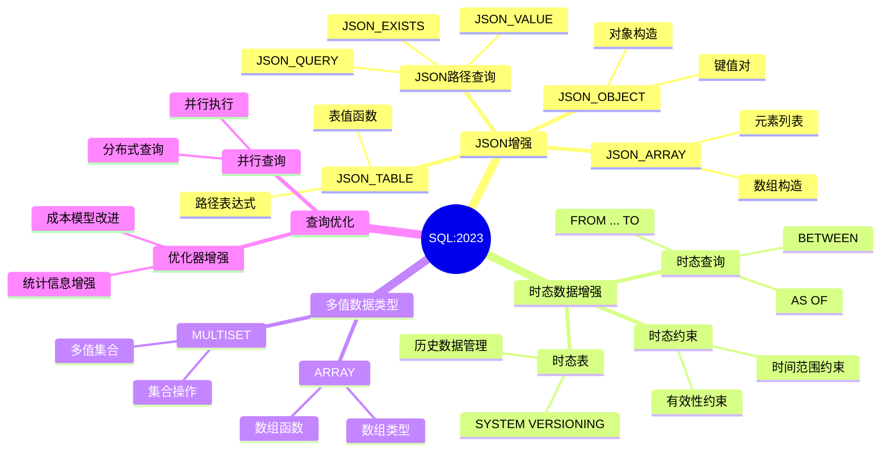

# SQL:2023标准详解

> **创建日期**：2025-01-15
> **最后更新**：2025-01-16
> **版本**：v1.0.0
> **标准版本**：ISO/IEC 9075:2023 (SQL:2023)
> **难度**：⭐⭐⭐⭐
> **应用场景**：SQL标准学习、数据库开发、标准对齐

---

## 📋 目录

- [SQL:2023标准详解](#sql2023标准详解)
  - [📋 目录](#-目录)
  - [一、概述](#一概述)
    - [1.1 SQL:2023标准简介](#11-sql2023标准简介)
    - [1.2 SQL:2023发布时间](#12-sql2023发布时间)
    - [1.3 SQL:2023主要改进](#13-sql2023主要改进)
    - [1.4 SQL:2023知识体系思维导图](#14-sql2023知识体系思维导图)
    - [1.5 SQL标准演进对比矩阵](#15-sql标准演进对比矩阵)
  - [二、SQL:2023核心新特性](#二sql2023核心新特性)
    - [2.1 JSON增强功能](#21-json增强功能)
      - [2.1.1 JSON\_TABLE函数](#211-json_table函数)
      - [2.1.2 JSON\_OBJECT和JSON\_ARRAY增强](#212-json_object和json_array增强)
    - [2.2 时态数据增强](#22-时态数据增强)
      - [2.2.1 时态数据类型增强](#221-时态数据类型增强)
      - [2.2.2 时态查询操作](#222-时态查询操作)
    - [2.3 多值数据类型](#23-多值数据类型)
    - [2.4 查询优化增强](#24-查询优化增强)
  - [三、SQL:2023与SQL:2016对比](#三sql2023与sql2016对比)
    - [3.1 特性对比矩阵](#31-特性对比矩阵)
    - [3.2 兼容性分析](#32-兼容性分析)
    - [3.3 迁移指南](#33-迁移指南)
  - [四、SQL:2023形式化语义](#四sql2023形式化语义)
    - [4.1 JSON操作形式化](#41-json操作形式化)
    - [4.2 时态操作形式化](#42-时态操作形式化)
  - [五、数据库实现情况](#五数据库实现情况)
    - [5.1 PostgreSQL实现](#51-postgresql实现)
    - [5.2 MySQL实现](#52-mysql实现)
    - [5.3 SQLite实现](#53-sqlite实现)
    - [5.4 SQL Server实现](#54-sql-server实现)
  - [六、实践应用](#六实践应用)
    - [6.1 JSON数据处理案例](#61-json数据处理案例)
    - [6.2 时态数据查询案例](#62-时态数据查询案例)
  - [七、相关资源](#七相关资源)
    - [相关文档](#相关文档)
    - [外部资源](#外部资源)

---

## 一、概述

### 1.1 SQL:2023标准简介

**SQL:2023**（ISO/IEC 9075:2023）是SQL标准的最新版本，在SQL:2016的基础上进行了多项增强和改进。

**标准编号**：ISO/IEC 9075:2023

**发布时间**：2023年

**主要改进方向**：

1. **JSON数据处理增强**：更强大的JSON操作和查询能力
2. **时态数据处理增强**：改进的时态数据类型和操作
3. **多值数据类型**：支持多值数据类型
4. **查询优化**：改进的查询优化器支持

### 1.2 SQL:2023发布时间

- **标准发布**：2023年
- **ISO/IEC编号**：ISO/IEC 9075:2023
- **前一个版本**：SQL:2016 (ISO/IEC 9075:2016)

### 1.3 SQL:2023主要改进

**核心改进**：

1. ✅ **JSON增强**：JSON_TABLE、JSON_OBJECT、JSON_ARRAY等新函数
2. ✅ **时态数据增强**：改进的时态数据类型和操作
3. ✅ **多值数据类型**：支持多值数据类型（MULTISET）
4. ✅ **查询优化**：改进的查询优化器支持
5. ✅ **数据类型增强**：新的数据类型和操作

### 1.4 SQL:2023知识体系思维导图



### 1.5 SQL标准演进对比矩阵

| 特性类别 | SQL:2016 | SQL:2023 | 改进程度 | 应用场景 |
|---------|----------|----------|---------|---------|
| **JSON支持** | 基础支持 | 增强支持 | ⭐⭐⭐⭐ | 半结构化数据 |
| **时态数据** | 基础支持 | 增强支持 | ⭐⭐⭐⭐ | 历史数据管理 |
| **多值类型** | ❌ | ✅ 新增 | ⭐⭐⭐⭐⭐ | 复杂数据结构 |
| **查询优化** | 基础 | 增强 | ⭐⭐⭐ | 性能优化 |
| **数据类型** | 标准类型 | 扩展类型 | ⭐⭐⭐ | 数据建模 |

---

## 二、SQL:2023核心新特性

### 2.1 JSON增强功能

**SQL:2023 JSON增强**：

#### 2.1.1 JSON_TABLE函数

**功能**：将JSON数据转换为关系表。

**语法**：

```sql
JSON_TABLE(
    json_doc,
    path_expression
    COLUMNS (
        column_name data_type PATH json_path,
        ...
    )
)
```

**场景示例**：

**场景1：电商系统 - 处理订单中的JSON商品信息**:

```text
订单表(Orders)：
| order_id | order_date | items_json |
|----------|------------|------------|
| O001     | 2024-01-15 | [{"product_id": "P001", "quantity": 2, "price": 100}, {"product_id": "P002", "quantity": 1, "price": 200}] |

需求：将JSON商品信息展开为关系表
```

**查询**：

```sql
SELECT
    o.order_id,
    o.order_date,
    jt.product_id,
    jt.quantity,
    jt.price,
    jt.quantity * jt.price as item_total
FROM Orders o
CROSS APPLY JSON_TABLE(
    o.items_json,
    '$[*]'
    COLUMNS (
        product_id VARCHAR(50) PATH '$.product_id',
        quantity INTEGER PATH '$.quantity',
        price DECIMAL(10,2) PATH '$.price'
    )
) AS jt;
```

**查询结果**：

```text
| order_id | order_date | product_id | quantity | price | item_total |
|----------|------------|------------|----------|-------|------------|
| O001     | 2024-01-15 | P001       | 2        | 100   | 200        |
| O001     | 2024-01-15 | P002       | 1        | 200   | 200        |
```

**场景2：用户系统 - 处理用户配置JSON**:

```text
用户表(Users)：
| user_id | name | preferences_json |
|---------|------|------------------|
| U001    | 张三 | {"theme": "dark", "language": "zh-CN", "notifications": {"email": true, "sms": false}} |

需求：提取用户偏好设置
```

**查询**：

```sql
SELECT
    u.user_id,
    u.name,
    jt.theme,
    jt.language,
    jt.email_notification,
    jt.sms_notification
FROM Users u
CROSS APPLY JSON_TABLE(
    u.preferences_json,
    '$'
    COLUMNS (
        theme VARCHAR(20) PATH '$.theme',
        language VARCHAR(10) PATH '$.language',
        email_notification BOOLEAN PATH '$.notifications.email',
        sms_notification BOOLEAN PATH '$.notifications.sms'
    )
) AS jt;
```

**形式化定义**：

```latex
JSON_TABLE: JSON × Path → Relation

JSON_TABLE(json, path) = {
    t | t 是从 json 中根据 path 提取的元组
}

形式化语义：
JSON_TABLE(json, path, COLUMNS(...)) = {
    (v₁, v₂, ..., vₙ) |
    ∃e ∈ JSON_PATH(json, path):
        v₁ = JSON_VALUE(e, col₁.path) ∧
        v₂ = JSON_VALUE(e, col₂.path) ∧
        ...
        vₙ = JSON_VALUE(e, colₙ.path)
}
```

**性能优化**：

```sql
-- 创建JSON索引（如果数据库支持）
CREATE INDEX idx_orders_items_json ON Orders USING GIN (items_json jsonb_path_ops);

-- 使用物化视图（如果JSON结构稳定）
CREATE MATERIALIZED VIEW mv_order_items AS
SELECT
    o.order_id,
    jt.product_id,
    jt.quantity,
    jt.price
FROM Orders o
CROSS APPLY JSON_TABLE(...) AS jt;
```

#### 2.1.2 JSON_OBJECT和JSON_ARRAY增强

**JSON_OBJECT函数**：

```sql
-- SQL:2023 JSON_OBJECT示例
SELECT JSON_OBJECT(
    'id' VALUE user_id,
    'name' VALUE user_name,
    'age' VALUE user_age
) AS user_json
FROM users;
```

**JSON_ARRAY函数**：

```sql
-- SQL:2023 JSON_ARRAY示例
SELECT JSON_ARRAY(
    user_id,
    user_name,
    user_age
) AS user_array
FROM users;
```

### 2.2 时态数据增强

**SQL:2023时态数据增强**：

#### 2.2.1 时态数据类型增强

**新的时态数据类型**：

```sql
-- SQL:2023时态数据类型
CREATE TABLE events (
    event_id INTEGER,
    event_time TIMESTAMP WITH TIME ZONE,
    valid_period PERIOD(TIMESTAMP, TIMESTAMP),
    event_data JSON
);
```

#### 2.2.2 时态查询操作

**时态查询示例**：

```sql
-- SQL:2023时态查询
SELECT *
FROM events
WHERE valid_period OVERLAPS PERIOD('2023-01-01', '2023-12-31');
```

### 2.3 多值数据类型

**SQL:2023多值数据类型（MULTISET）**：

```sql
-- SQL:2023 MULTISET类型
CREATE TABLE products (
    product_id INTEGER,
    product_name VARCHAR(100),
    tags MULTISET(VARCHAR(50))
);

-- MULTISET操作
SELECT product_id, product_name
FROM products
WHERE 'electronics' IN (tags);
```

**形式化定义**：

```latex
MULTISET类型定义：
MULTISET(T) = {bag | bag 是类型 T 的多重集合}

多重集合性质：
- 允许重复元素
- 元素顺序无关紧要
- 支持集合运算（并、交、差）
```

### 2.4 查询优化增强

**SQL:2023查询优化增强**：

1. **改进的查询优化器**：更好的查询计划选择
2. **并行查询支持**：增强的并行查询能力
3. **物化视图优化**：改进的物化视图维护

---

## 三、SQL:2023与SQL:2016对比

### 3.1 特性对比矩阵

| 特性 | SQL:2016 | SQL:2023 | 改进程度 |
|------|----------|----------|---------|
| **JSON支持** | ⭐⭐⭐ | ⭐⭐⭐⭐⭐ | 显著增强 |
| **JSON_TABLE** | ❌ | ✅ | 新增 |
| **JSON_OBJECT/ARRAY** | 基础 | 增强 | 改进 |
| **时态数据** | ⭐⭐⭐ | ⭐⭐⭐⭐ | 增强 |
| **时态查询** | 基础 | 增强 | 改进 |
| **多值数据类型** | ❌ | ✅ | 新增 |
| **MULTISET** | ❌ | ✅ | 新增 |
| **查询优化** | ⭐⭐⭐ | ⭐⭐⭐⭐ | 改进 |

### 3.2 兼容性分析

**SQL:2023向后兼容性**：

```latex
\begin{theorem}[SQL:2023向后兼容性]
SQL:2023完全向后兼容SQL:2016，即：
\forall query \in SQL:2016: query 在 SQL:2023 中语义相同
\end{theorem}
```

**兼容性保证**：

- ✅ SQL:2016的所有特性在SQL:2023中仍然支持
- ✅ SQL:2016的查询在SQL:2023中结果相同
- ✅ SQL:2023新增特性不影响现有查询

### 3.3 迁移指南

**从SQL:2016迁移到SQL:2023**：

1. **无需修改**：现有SQL:2016代码无需修改
2. **可选增强**：可以使用SQL:2023新特性优化查询
3. **逐步迁移**：可以逐步采用新特性

---

## 四、SQL:2023形式化语义

### 4.1 JSON操作形式化

**JSON_TABLE形式化语义**：

```latex
JSON_TABLE语义定义：

JSON_TABLE(json, path, columns) = {
    t | t 满足以下条件：
    1. t 是从 json 中根据 path 提取的
    2. t 的列由 columns 定义
    3. t 的类型由 columns 中的类型定义
}
```

### 4.2 时态操作形式化

**时态查询形式化语义**：

```latex
时态查询语义：

OVERLAPS(p1, p2) = {
    True  if p1.start < p2.end AND p1.end > p2.start
    False otherwise
}
```

---

## 五、数据库实现情况

### 5.1 PostgreSQL实现

**PostgreSQL SQL:2023支持情况**：

| 特性 | 支持情况 | 版本要求 |
|------|---------|---------|
| JSON增强 | ⭐⭐⭐⭐ | PostgreSQL 12+ |
| JSON_TABLE | ⚠️ 部分支持 | PostgreSQL 16+ |
| 时态数据 | ⭐⭐⭐ | PostgreSQL 9.2+ |
| MULTISET | ❌ | 不支持 |

### 5.2 MySQL实现

**MySQL SQL:2023支持情况**：

| 特性 | 支持情况 | 版本要求 |
|------|---------|---------|
| JSON增强 | ⭐⭐⭐⭐ | MySQL 5.7+ |
| JSON_TABLE | ✅ 支持 | MySQL 8.0+ |
| 时态数据 | ⭐⭐⭐ | MySQL 5.6+ |
| MULTISET | ❌ | 不支持 |

### 5.3 SQLite实现

**SQLite SQL:2023支持情况**：

| 特性 | 支持情况 | 版本要求 |
|------|---------|---------|
| JSON增强 | ⭐⭐⭐ | SQLite 3.9+ |
| JSON_TABLE | ❌ | 不支持 |
| 时态数据 | ⭐⭐ | SQLite 3.0+ |
| MULTISET | ❌ | 不支持 |

### 5.4 SQL Server实现

**SQL Server SQL:2023支持情况**：

| 特性 | 支持情况 | 版本要求 |
|------|---------|---------|
| JSON增强 | ⭐⭐⭐⭐ | SQL Server 2016+ |
| JSON_TABLE | ✅ 支持 | SQL Server 2016+ |
| 时态数据 | ⭐⭐⭐⭐ | SQL Server 2016+ |
| MULTISET | ❌ | 不支持 |

---

## 六、实践应用

### 6.1 JSON数据处理案例

**案例：用户配置JSON数据查询**：

```sql
-- SQL:2023 JSON查询示例
SELECT
    user_id,
    JSON_VALUE(user_config, '$.theme') AS theme,
    JSON_VALUE(user_config, '$.language') AS language
FROM users
WHERE JSON_EXISTS(user_config, '$.preferences');
```

### 6.2 时态数据查询案例

**案例：事件时间范围查询**：

```sql
-- SQL:2023时态查询示例
SELECT event_id, event_name
FROM events
WHERE valid_period OVERLAPS PERIOD(
    CURRENT_TIMESTAMP - INTERVAL '30 days',
    CURRENT_TIMESTAMP
);
```

---

## 七、相关资源

### 相关文档

- [SQL标准演进历史](./02.01-SQL标准演进历史.md) - SQL标准发展历程
- [SQL:2016标准详解](./02.04-SQL-2016标准详解.md) - SQL:2016标准
- [数据库实现对比](../06-数据库实现对比/) - 各数据库标准对齐

### 外部资源

- [ISO/IEC 9075:2023 (SQL:2023)](https://www.iso.org/standard/76583.html)
- [SQL标准官方文档](https://www.iso.org/standard/76583.html)

---

**维护者**: SQL Standards Team
**最后更新**: 2025-01-16
