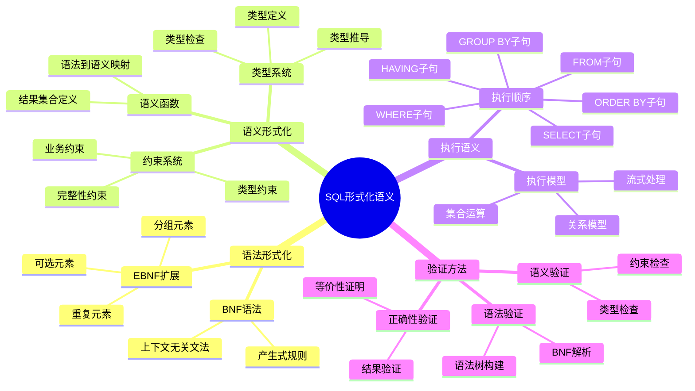
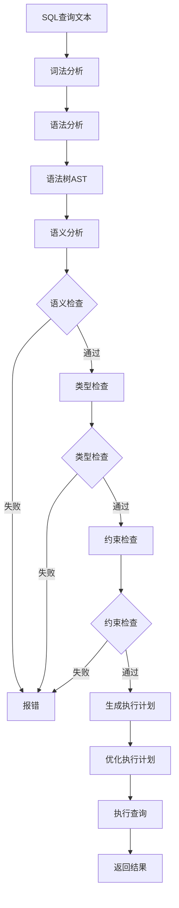
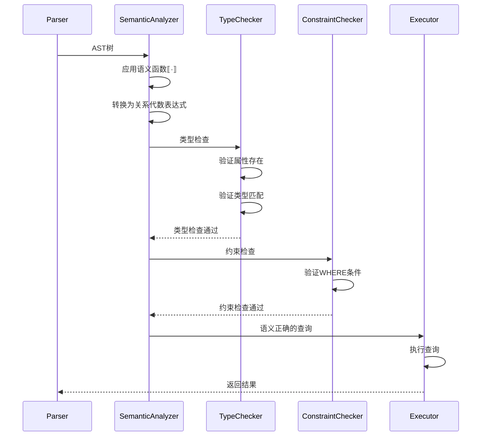

# SQL形式化语义

> **创建日期**：2025-01-15
> **最后更新**：2025-01-15
> **版本**：v1.0.0
> **难度**：⭐⭐⭐⭐⭐
> **应用场景**：SQL语义理解、查询优化、形式化验证

---

## 📋 目录

- [SQL形式化语义](#sql形式化语义)
  - [📋 目录](#-目录)
  - [一、概述](#一概述)
    - [1.1 SQL形式化语义知识体系思维导图](#11-sql形式化语义知识体系思维导图)
    - [1.2 SQL语义处理流程图](#12-sql语义处理流程图)
  - [二、SQL语法形式化定义](#二sql语法形式化定义)
    - [2.1 BNF语法定义](#21-bnf语法定义)
    - [2.2 EBNF扩展语法](#22-ebnf扩展语法)
  - [三、SQL语义形式化定义](#三sql语义形式化定义)
    - [3.1 语义函数定义](#31-语义函数定义)
    - [3.2 SELECT语句语义](#32-select语句语义)
    - [3.2.1 场景示例：SELECT语句语义验证](#321-场景示例select语句语义验证)
    - [3.3 JOIN语句语义](#33-join语句语义)
  - [四、类型系统形式化](#四类型系统形式化)
    - [4.1 类型定义](#41-类型定义)
    - [4.2 类型检查](#42-类型检查)
  - [五、约束系统形式化](#五约束系统形式化)
    - [5.1 约束定义](#51-约束定义)
    - [5.2 约束验证](#52-约束验证)
  - [六、执行语义形式化](#六执行语义形式化)
    - [6.1 执行顺序](#61-执行顺序)
    - [6.2 执行语义](#62-执行语义)
  - [七、相关资源](#七相关资源)
    - [相关文档](#相关文档)
    - [外部资源](#外部资源)

---

## 一、概述

SQL形式化语义为SQL语言提供严格的数学定义，确保SQL查询的语义准确性和一致性。

**形式化语义的目标**：

1. 精确定义SQL语法
2. 严格定义SQL语义
3. 支持形式化验证
4. 支持查询优化

### 1.1 SQL形式化语义知识体系思维导图



### 1.2 SQL语义处理流程图



---

## 二、SQL语法形式化定义

### 2.1 BNF语法定义

#### 2.1.1 BNF语法概述

**BNF（Backus-Naur Form）**是一种用于描述上下文无关文法的形式化语法表示法，由John Backus和Peter Naur在1960年提出。

**BNF语法特点**：

- **产生式规则**：使用 `::=` 表示"定义为"
- **非终结符**：使用尖括号 `< >` 表示
- **终结符**：直接使用字符串表示
- **选择**：使用 `|` 表示"或"
- **可选**：使用 `[ ]` 表示可选元素
- **重复**：使用 `*` 表示零次或多次，`+` 表示一次或多次

#### 2.1.2 SQL语法BNF定义

**SQL语法BNF定义**：

```bnf
<sql_statement> ::= <ddl_statement>
                  | <dml_statement>
                  | <dql_statement>
                  | <dcl_statement>
                  | <tcl_statement>

<ddl_statement> ::= CREATE TABLE <table_name> (<column_def_list>)
                  | ALTER TABLE <table_name> <alter_action>
                  | DROP TABLE <table_name>

<dml_statement> ::= INSERT INTO <table_name> VALUES (<value_list>)
                  | UPDATE <table_name> SET <assignment_list> WHERE <condition>
                  | DELETE FROM <table_name> WHERE <condition>

<dql_statement> ::= SELECT <select_list>
                    FROM <table_list>
                    [WHERE <condition>]
                    [GROUP BY <group_list>]
                    [HAVING <condition>]
                    [ORDER BY <order_list>]

<select_list> ::= * | <column_list>

<table_list> ::= <table_name> [<join_clause>]*

<join_clause> ::= [INNER | LEFT | RIGHT | FULL] JOIN <table_name> ON <condition>

<condition> ::= <predicate>
              | <condition> AND <condition>
              | <condition> OR <condition>
              | NOT <condition>
```

#### 2.1.3 BNF语法历史背景

**历史背景**：

- **1960年**：John Backus和Peter Naur提出BNF语法，用于描述ALGOL 60语言
- **1970年代**：BNF被广泛用于描述编程语言语法
- **1986年**：SQL-86标准使用BNF描述SQL语法
- **至今**：BNF仍然是描述SQL语法的标准方法

**BNF在SQL标准中的应用**：

- SQL-86标准首次使用BNF描述SQL语法
- 后续SQL标准版本都使用BNF/EBNF描述语法
- BNF提供了SQL语法的精确、无歧义的定义

### 2.2 EBNF扩展语法

#### 2.2.1 EBNF语法概述

**EBNF（Extended Backus-Naur Form）**是BNF的扩展版本，提供了更简洁的语法表示法。

**EBNF语法特点**：

- **产生式规则**：使用 `=` 表示"定义为"
- **非终结符**：直接使用标识符表示
- **终结符**：使用双引号 `" "` 表示
- **选择**：使用 `|` 表示"或"
- **可选**：使用 `[ ]` 表示可选元素
- **重复**：使用 `{ }` 表示零次或多次，`{ }+` 表示一次或多次
- **分组**：使用 `( )` 表示分组

#### 2.2.2 SQL语法EBNF定义

**SQL语法EBNF定义**：

```ebnf
sql_statement = ddl_statement | dml_statement | dql_statement | dcl_statement | tcl_statement;

ddl_statement = "CREATE" "TABLE" identifier "(" column_definition {"," column_definition} ")";

column_definition = identifier data_type [constraint];

data_type = "INTEGER" | "VARCHAR" "(" number ")" | "DATE" | "TIMESTAMP";

dql_statement = "SELECT" select_list "FROM" table_list [where_clause] [group_clause] [having_clause] [order_clause];

select_list = "*" | column_list;

table_list = table_reference {join_clause};

join_clause = join_type "JOIN" table_reference "ON" condition;

where_clause = "WHERE" condition;

condition = predicate | condition "AND" condition | condition "OR" condition | "NOT" condition;
```

#### 2.2.3 EBNF与BNF的对比

**EBNF与BNF的对比**：

| 特性 | BNF | EBNF |
|------|-----|------|
| **产生式规则** | `::=` | `=` |
| **非终结符** | `<identifier>` | `identifier` |
| **终结符** | 直接使用 | `"string"` |
| **可选元素** | `[element]` | `[element]` |
| **重复元素** | `<element>*` | `{element}` |
| **分组** | `(element)` | `(element)` |

**EBNF的优势**：

- **更简洁**：语法表示更简洁
- **更易读**：更容易阅读和理解
- **更灵活**：提供了更多的语法表示选项

---

## 三、SQL语义形式化定义

### 3.1 语义函数定义

#### 3.1.1 语义函数概述

**语义函数（Semantic Function）**是将SQL语法映射到语义的数学函数。

**语义函数定义**：

```latex
语义函数：·: SQL_Statement → Result

SELECT A FROM R WHERE P = {
    t[A] | t ∈ R ∧ P(t) = True
}

其中：
- R 是关系
- A 是属性
- P 是谓词
- t 是元组
```

#### 3.1.2 语义函数的历史背景

**历史背景**：

- **1970年代**：形式化语义理论开始应用于编程语言
- **1980年代**：形式化语义理论应用于数据库查询语言
- **1986年**：SQL-86标准开始使用形式化语义定义SQL语义
- **至今**：形式化语义是SQL标准定义语义的标准方法

**语义函数的作用**：

- **精确性**：提供SQL语义的精确、无歧义的定义
- **可验证性**：支持SQL语义的形式化验证
- **可优化性**：为查询优化提供理论基础

### 3.2 SELECT语句语义

**SELECT语句形式化语义**：

```latex
SELECT A₁, A₂, ..., Aₙ FROM R WHERE P =
    π_{A₁, A₂, ..., Aₙ}(σ_P(R))

其中：
- π 是投影操作
- σ 是选择操作
- R 是关系
- P 是谓词
```

### 3.2.1 场景示例：SELECT语句语义验证

**业务需求**：验证SELECT语句的形式化语义是否正确。

**查询示例**：

```sql
SELECT name, age FROM Student WHERE age > 20;
```

**形式化语义**：

```latex
SELECT name, age FROM Student WHERE age > 20 =
    π_{name, age}(σ_{age > 20}(Student))

语义解释：
1. σ_{age > 20}(Student)：从Student关系中选择age > 20的元组
2. π_{name, age}(...)：投影到name和age属性
3. 结果：包含name和age两列的关系
```

**语义验证流程时序图**：



### 3.3 JOIN语句语义

**JOIN语句形式化语义**：

```latex
R₁ JOIN R₂ ON P = σ_P(R₁ × R₂)

其中：
- × 是笛卡尔积
- σ 是选择操作
- P 是连接条件
```

---

## 四、类型系统形式化

### 4.1 类型定义

**SQL类型系统形式化定义**：

```latex
类型系统：Type = {INTEGER, VARCHAR(n), DATE, TIMESTAMP, ...}

类型函数：type: Expression → Type

类型规则：
- type(c) = T 其中 c 是类型 T 的常量
- type(t.A) = type(A) 其中 t 是元组，A 是属性
- type(e₁ op e₂) = result_type(type(e₁), type(e₂), op)
```

### 4.2 类型检查

**类型检查规则**：

```latex
类型检查函数：check: Expression × Type → Boolean

类型检查规则：
- check(c, T) = True  ⟺  type(c) = T
- check(t.A, T) = True  ⟺  type(A) = T
- check(e₁ op e₂, T) = True  ⟺  type(e₁) compatible type(e₂) ∧ result_type(type(e₁), type(e₂), op) = T
```

---

## 五、约束系统形式化

### 5.1 约束定义

**SQL约束形式化定义**：

```latex
约束系统：Constraint = {PrimaryKey, ForeignKey, Check, NotNull, Unique}

约束函数：satisfies: Relation × Constraint → Boolean

约束满足性：
- satisfies(R, PrimaryKey(K)) = True  ⟺  ∀t₁, t₂ ∈ R: t₁[K] = t₂[K] ⟹ t₁ = t₂
- satisfies(R, ForeignKey(FK, R_ref, PK)) = True  ⟺  ∀t ∈ R: t[FK] ∈ π_{PK}(R_ref)
- satisfies(R, Check(P)) = True  ⟺  ∀t ∈ R: P(t) = True
```

### 5.2 约束验证

**约束验证规则**：

```latex
约束验证函数：validate: Relation × Constraint → Boolean

validate(R, c) = satisfies(R, c)
```

---

## 六、执行语义形式化

### 6.1 执行顺序

**SQL执行顺序形式化定义**：

```latex
执行顺序：exec_order: SQL_Statement → Execution_Plan

exec_order(SELECT ... FROM ... WHERE ... GROUP BY ... HAVING ... ORDER BY ...) =
    1. FROM (关系获取)
    2. WHERE (选择)
    3. GROUP BY (分组)
    4. HAVING (分组选择)
    5. SELECT (投影)
    6. ORDER BY (排序)
```

### 6.2 执行语义

**SQL执行语义形式化定义**：

```latex
执行语义函数：execute: SQL_Statement × Database → Result

execute(SELECT A FROM R WHERE P, DB) =
    {t[A] | t ∈ DB(R) ∧ P(t) = True}
```

---

## 七、相关资源

### 相关文档

- [查询等价性理论](./03.02-查询等价性理论.md) - 查询等价性证明
- [SQL正确性验证](./03.03-SQL正确性验证.md) - SQL正确性验证
- [关系代数与SQL对应](./03.04-关系代数与SQL对应.md) - 关系代数对应

### 外部资源

- ISO/IEC 9075:2023 (SQL:2023) - SQL标准官方文档

---

**维护者**: SQL Standards Team
**最后更新**: 2025-01-15
